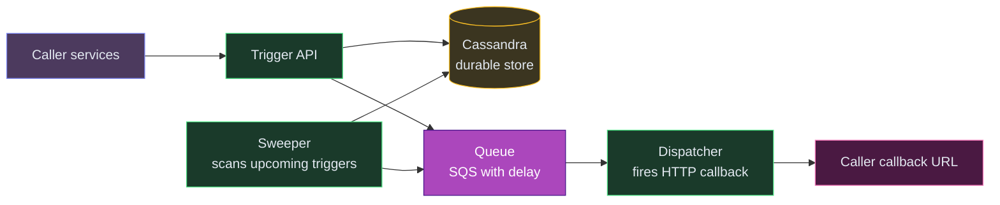
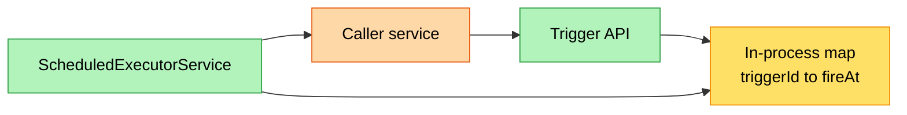
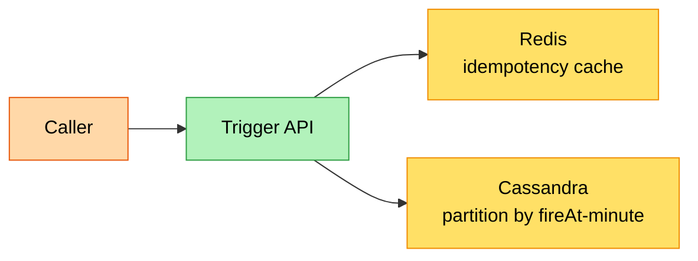
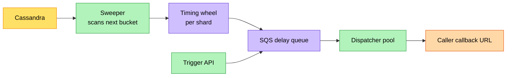
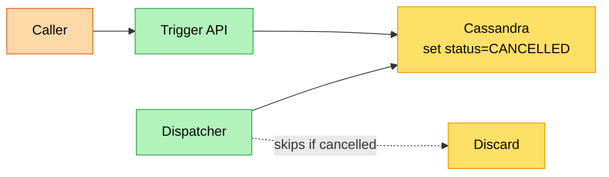
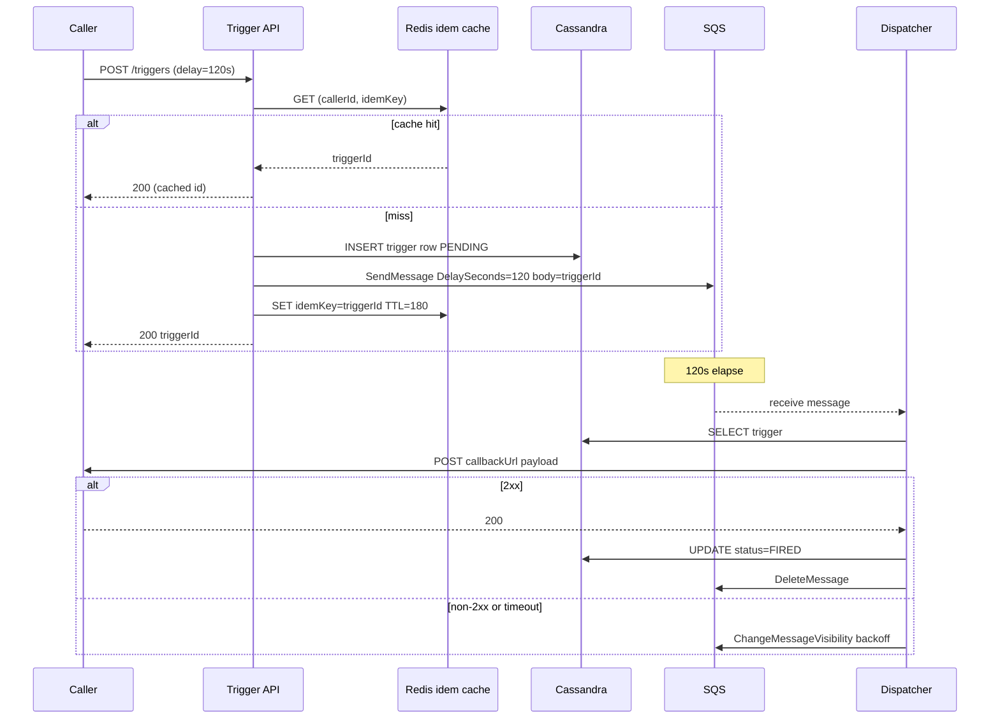
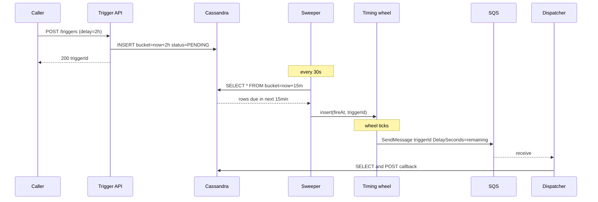
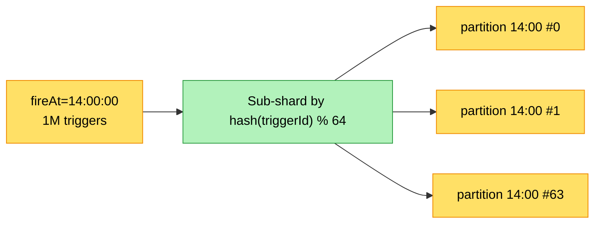
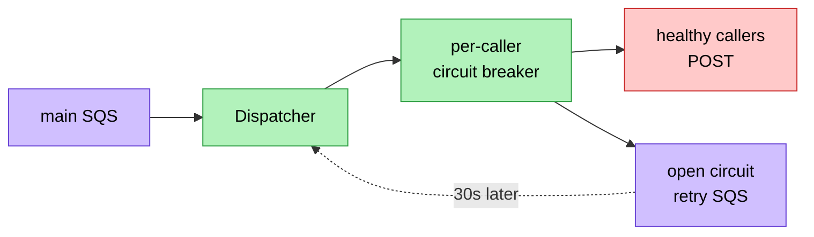
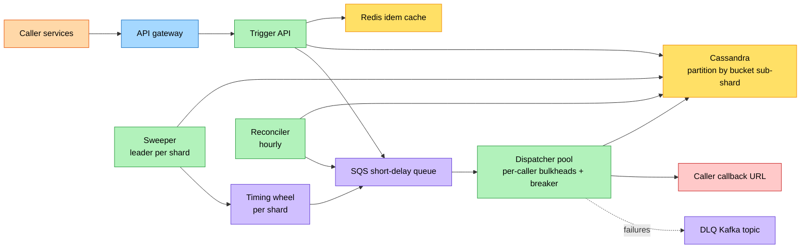

# HLD: Delayed Trigger Service

⚡ **Difficulty:** Intermediate–Advanced
📋 **Prerequisites:** [Fundamentals](/concepts) — especially [Message Queues](/concepts#message-queues) and [Leader Election](/concepts#leader-election)

---

## TL;DR

A service that fires HTTP callbacks at a future time. Short delays (≤15 min) go directly to a queue. Long delays park in a database and a sweeper migrates them to the queue as their fire time approaches.



**In 3 sentences:** Services register "call me back in X minutes" requests. The system persists the trigger durably, then fires the HTTP callback at the right time with retries. Two tiers: short delays use a managed queue (SQS); long delays sit in a database until a sweeper promotes them.

---

## 1. Understanding the Problem

A delayed trigger service lets internal services register a callback with a future fire time (e.g., "ping me back in 30 minutes"). When the delay elapses, the service POSTs a response to a callback URL the caller provided. It's the building block behind reminders, payment retries, abandoned-cart nudges, "release the seat hold in 7 minutes," and "auto-cancel the order if not paid in 15 min."

## 1.5. Naive First Cut



| Color | Meaning |
|---|---|
| 🟧 client | calling service |
| 🟩 service | application service |
| 🟨 data | storage / state |

Why this breaks under real constraints:

- **Process crash loses every pending trigger** — no durability. If the box reboots, every "fire in 10 min" is gone.
- **One JVM caps throughput** — `ScheduledExecutorService` is fine for thousands of timers, hopeless at millions.
- **No horizontal scale** — two replicas would each fire the callback, giving duplicates.
- **No retry on callback failure** — if the caller's endpoint is down at fire time, the trigger is silently lost.
- **No long delays** — JVM heap pressure with millions of `DelayedTask` objects.
- **Hot fire-time spikes** — "fire at top of the hour" thundering herd would saturate the executor.

The rest of the doc evolves this into a durable, sharded, bucketed scheduler with a timing-wheel front end and at-least-once HTTP callback delivery.

## 1.7. Prior Art We're Drawing From

- **[Airbnb Dynein](https://medium.com/airbnb-engineering/dynein-building-a-distributed-delayed-job-queueing-system-93ab10f05f99)** — short-delay jobs (≤15 min) go straight to SQS; long-delay jobs sit in DynamoDB and a sweeper moves them to SQS as fire time approaches. We borrow this two-tier split.
- **[Apache Kafka Purgatory + Hierarchical Timing Wheels](https://www.confluent.io/blog/apache-kafka-purgatory-hierarchical-timing-wheels/)** — O(1) insert/expire for millions of in-memory timers across multiple resolutions. We use this for the hot, near-future tier.
- **[AWS SQS delay queues](https://docs.aws.amazon.com/AWSSimpleQueueService/latest/SQSDeveloperGuide/sqs-delay-queues.html)** — built-in 0–15 min delay primitive. We treat SQS as the "execution lane" once a trigger is within 15 min.
- **[Stripe Idempotency-Key](https://stripe.com/docs/api/idempotent_requests)** — caller-supplied idempotency key on register so repeated submissions don't create duplicate triggers.
- **[Netflix Maestro](https://blog.bytebytego.com/p/how-netflix-orchestrates-millions)** — sharded execution layer; we use the same partition-by-triggerId model so each shard is independently leader-led.

When deep dives below cite "borrowing from Dynein" or "borrowing from Kafka Purgatory," that's what they mean.

## Technology Choices

| Tier / Purpose | What it stores | Access pattern | Primary pick | Alternatives |
|---|---|---|---|---|
| OLTP trigger store | triggerId, callerId, callbackUrl, fireAt, payload, status, idempotencyKey | write-heavy on register, point read on fire, range scan by fireAt bucket | Cassandra / DynamoDB (partition key = bucket) | ScyllaDB, Bigtable |
| Short-delay execution lane | trigger envelope, retries metadata | FIFO with per-msg delay 0–15 min | SQS (delay queue) | RabbitMQ delayed exchange, Redis Streams + ZSET |
| In-memory timer wheel | next-tick triggers per shard | O(1) insert/expire | hierarchical timing wheel in-process | Netty `HashedWheelTimer`, Redis sorted set per bucket |
| Long-delay sweep index | fireAt bucket (1-min) → list of triggerIds | range scan by upcoming bucket | secondary index on Cassandra (partition = bucket minute) | DynamoDB GSI on `fireAtMinute` |
| Idempotency cache | (callerId, idempotencyKey) → triggerId | TTL'd KV | Redis with TTL = max delay + grace | DynamoDB with TTL |
| Audit / DLQ | failed callbacks after N retries | append-only | Kafka topic + S3 sink | Kinesis Firehose |

Two non-obvious picks worth a note:

**Why Cassandra for the trigger store, not Postgres.** Writes dominate (every register is a write, every fire is an update). The access pattern is `partition key = fireAt-bucket` → range scan within the bucket. That's exactly what wide-column stores are built for. Postgres would work but you'd be hand-rolling sharding and the time-series indexing.

**Why a separate timing wheel in-process when the queue already has delay.** SQS caps at 15-minute delay, and even within that window, draining millions of messages at the exact same fireAt second is hard to control. The timing wheel gives precise local scheduling and feeds SQS only with messages that are due in the next few seconds.

## 2. Functional Requirements

**Core:**

1. `registerTrigger(callerId, callbackUrl, payload, delaySeconds, idempotencyKey)` returns a `triggerId`. Persists the intent durably.
2. At `now + delaySeconds`, the service POSTs `{triggerId, payload}` to `callbackUrl` and considers the trigger fired only after a 2xx ack.
3. `cancelTrigger(triggerId)` — best-effort cancel before fire time.

**Below the line (out of scope for the interview):**

- Recurring / cron-like triggers.
- Workflow chaining (trigger A fires trigger B).
- Per-caller priority / rate limits beyond fairness.
- Cross-region active-active.

## 3. Non-Functional Requirements

**Core:**

- **Durability** — once `register` returns 200, the trigger must fire even if every component crashes. No silent drops.
- **On-time firing** — P99 jitter < 1s for short delays, < 5s for long (>15 min) delays.
- **Throughput** — 100K registers/sec, 100K fires/sec at peak.
- **At-least-once + idempotent** — callback may fire twice; caller must dedupe via `triggerId`.

**Below the line:** strict-once delivery, sub-millisecond jitter, multi-region failover.

## Scale Estimation (Back-of-Envelope)

- **Users:** 50M pending triggers at any given time across all callers
- **Write QPS:** 500K new triggers/hour (~140 triggers/sec), 10K fires/sec at peak
- **Read QPS:** Sweeper scans 1K buckets/sec, 5K status queries/sec from callers
- **Storage:** 200GB trigger metadata/year (Cassandra, with TTL cleanup after firing)
- **Bandwidth:** <1s jitter SLA for firing — timing wheel precision in the 100ms range

## 4. Core Entities

- **Trigger** — id, callerId, callbackUrl, payload, fireAt, status (PENDING / IN_FLIGHT / FIRED / FAILED / CANCELLED), attemptCount.
- **Caller** — registered service with auth credentials and (optionally) per-tenant rate limits.
- **Bucket** — a 1-minute window keyed by floor(fireAt). Triggers live in their bucket's row in Cassandra.
- **Dispatcher** — worker that turns "trigger is due" into "HTTP POST to callbackUrl."
- **Sweeper** — process that scans upcoming buckets and pushes due-soon triggers into the in-memory wheel.

## 5. API / System Interface

```http
POST /v1/triggers
Authorization: Bearer <caller JWT>
Idempotency-Key: <client-supplied uuid>

{
  "callbackUrl": "https://orders.internal/seat-hold/expire",
  "payload":     {"holdId": "h_8c4"},
  "delaySeconds": 420
}
```

```http
200 OK
{ "triggerId": "trg_01HZ...", "fireAt": "2026-06-12T14:31:00Z" }
```

```http
DELETE /v1/triggers/{triggerId}
Authorization: Bearer <caller JWT>
```

The dispatcher fires this against the caller:

```http
POST <callbackUrl>
X-Trigger-Id: trg_01HZ...
X-Trigger-Attempt: 1

{ "triggerId": "trg_01HZ...", "payload": {"holdId": "h_8c4"} }
```

Caller responds 2xx for ack. Anything else (or timeout) → retry with exponential backoff, eventually DLQ.

Security notes: caller authenticated via short-lived JWT minted for the service identity; `callbackUrl` validated against an allow-list of registered base URLs per caller (prevents using us as an SSRF springboard). `payload` size capped at 4 KB.

## 6. High-Level Design

We'll layer in components as the three FRs demand them.

### FR1: Register a trigger

**New components we need:**

1. **Trigger API** — the HTTP service callers hit to register or cancel triggers. Validates requests and handles idempotency.
2. **Redis Idempotency Cache** — stores `(callerId, idempotencyKey) → triggerId` so retried requests don't create duplicate triggers.<br>💡 *Idempotency means: if the caller's network drops and they retry, we return the same triggerId instead of creating a second trigger. Safe retries.*
3. **Cassandra (partitioned by fire-time bucket)** — durable storage for all triggers. Partitioned by the 1-minute window containing `fireAt`, so the sweeper can efficiently ask "give me all triggers due in minute M" with one partition read.



**Step-by-step flow:**

1. Caller (e.g., the Order Service) calls `POST /v1/triggers` with a callback URL and `delaySeconds: 420` (7 minutes) → "Call me back in 7 minutes to expire this seat hold"
2. Trigger API checks Redis: have we seen this `(callerId, idempotencyKey)` before? If yes → return the cached `triggerId` (no duplicate created)
3. API computes `fireAt = now + 420s`, generates a unique ULID `triggerId`, and writes the row to Cassandra. The partition key is the 1-minute bucket containing `fireAt` (e.g., `14:31`) — this groups triggers by fire time for efficient sweeping later
4. API caches the `triggerId` in Redis under the idempotency key (TTL = delay + grace period) so future retries short-circuit
5. Returns `200 OK` with the `triggerId` and exact `fireAt` timestamp

**Why partition by 1-minute buckets?** The sweeper needs to efficiently find "all triggers about to fire." Without bucketing, it would scan millions of rows. With bucketing, it reads one partition per minute — a single disk seek in Cassandra.

### FR2: Fire the callback at the right time

We split by delay length, borrowing from Dynein:

- **Short delay (≤ 15 min)** — push directly to SQS with `DelaySeconds = delay`. SQS handles the wait, the dispatcher picks up the message when visible. We keep the Cassandra row as the source of truth.
- **Long delay (> 15 min)** — leave it in Cassandra. The **Sweeper** scans the next bucket every 30 s and, when within 15 min of fireAt, pushes into SQS the same way. This caps the in-memory state and lets the long tail live cheaply in Cassandra.

**New components we need (in addition to the ones above):**

1. **Sweeper (leader-elected, per shard)** — scans Cassandra for triggers due in the next 15 minutes and loads them into the timing wheel.<br>💡 *Leader election ensures only one sweeper owns each shard — without it, duplicate fires would happen.*
2. **Timing Wheel (in-process)** — a ring-buffer data structure that fires callbacks at precise times with O(1) insert and expiry.<br>💡 *Think of it as an alarm clock with thousands of slots — you set the alarm (insert), and when the hand reaches your slot, it goes off (expires). Kafka's internals use this exact structure.*
3. **SQS (delay queue)** — the execution lane. Once a trigger is within seconds of firing, the timing wheel pushes it to SQS. Dispatchers consume from SQS.
4. **Dispatcher Pool** — workers that pull from SQS, read the trigger from Cassandra, and POST the callback to the caller's URL. Stateless; scales horizontally.



**Step-by-step flow:**

1. Sweeper runs per shard, leader-elected via ZooKeeper/etcd. Every 30 seconds, it scans Cassandra for the bucket that's about to enter the 15-minute firing window
2. Each trigger from the scan is inserted into the in-process timing wheel — O(1) per insert, handles millions of pending triggers per shard
3. When a wheel slot expires (fire time arrives!), the triggerId is pushed to SQS with a tiny `DelaySeconds` (usually 0-60s of slack)
4. Dispatcher pulls from SQS, reads the current trigger row from Cassandra (checking status — it might have been cancelled!), and POSTs the payload to the callback URL
5. On `2xx` response → dispatcher writes `status = FIRED` to Cassandra and deletes the SQS message. Done!
6. On non-2xx or timeout → dispatcher requeues to SQS with exponential backoff (10s → 30s → 2min → 10min → 30min). After N attempts → Dead Letter Queue
7. If dispatcher crashes after POST but before deleting from SQS → SQS visibility timeout expires → another dispatcher picks up and retries. The caller dedupes on `triggerId` — at-least-once is the contract

**Why the timing wheel when SQS already has delay?** Two reasons: (a) SQS caps at 15-minute delay — not enough for our 30-day triggers. (b) At the top of the hour, 200K triggers all want `DelaySeconds=0` simultaneously. The wheel acts as a smoothing front-end, releasing messages into SQS in sub-second batches so the dispatcher pool sees an even rate instead of a thundering herd.

**Why does the dispatcher read from Cassandra before firing?** The SQS message only holds the `triggerId` (to keep messages small). More importantly, the trigger might have been cancelled since it was enqueued — checking status at fire time is the "lazy cancel" pattern that avoids expensive queue surgery.

### FR3: Cancel a trigger

**New components we need:** None! Cancellation reuses existing infrastructure — it just flips a status flag in Cassandra that the dispatcher checks at fire time.



**Step-by-step flow:**

1. Caller hits `DELETE /v1/triggers/{triggerId}` → API sets `status = CANCELLED` in Cassandra (only if current status is `PENDING`)
2. We DON'T try to remove the trigger from SQS or the timing wheel — that's too racy and SQS doesn't support targeted deletion by content
3. When the trigger's fire time arrives, the dispatcher reads the row, sees `CANCELLED`, and quietly drops it without firing the callback
4. This is "lazy cancel": the cancel is durable instantly, but the trigger message may sit in the queue until its fire time before being discarded

**Why not remove from the queue immediately?** SQS doesn't support "find and delete message with triggerId X." And even if it did, there's a race: the message might be in-flight to a dispatcher at the exact moment you try to cancel. Lazy cancel avoids all these races — the flag in Cassandra is the single source of truth, checked at the last possible moment.

## 6.5. Core Flows

### Flow A: Register + fire (short delay, ≤15 min)



1. Caller POSTs with delay 120s. API checks idempotency, persists to Cassandra, sends an SQS message with `DelaySeconds=120`.
2. After 120s SQS makes the message visible. Dispatcher receives it and looks up the trigger row.
3. Dispatcher POSTs the payload to the caller's `callbackUrl`.
4. On 2xx, mark `FIRED` and delete from SQS. **Failure path:** on 5xx or timeout, dispatcher pushes the message back with exponential `ChangeMessageVisibility` (e.g., 10s, 30s, 2m, 10m, 30m). After 6 attempts it goes to DLQ.
5. **Non-obvious failure path:** dispatcher crashes after POST but before deleting from SQS. SQS visibility timeout expires, another dispatcher receives the message, POSTs again. The caller is expected to dedupe on `triggerId` — at-least-once is the contract.

### Flow B: Long delay (> 15 min)



1. Trigger lands in Cassandra, partition keyed by `floor(fireAt / 1min)`.
2. Sweeper for that shard scans `bucket = now + 15min` every 30 s. Reading 15 min into the future gives slack for sweeper hiccups.
3. Each row is inserted into the in-process timing wheel.
4. The wheel ticks; when a slot expires, that triggerId is shipped to SQS with a small `DelaySeconds` (typically 0–60 s).
5. Dispatcher path is identical to Flow A from there.
6. **Non-obvious failure path:** sweeper leader crashes mid-scan. ZooKeeper detects the session loss, elects a new leader. The new leader rescans the bucket — Cassandra row's `status` is still `PENDING` so it gets re-inserted into the wheel. Possible duplicate fire if the old leader had already pushed to SQS; dedupe on `triggerId` handles it.

### Trigger state machine

```
PENDING ──register──> in Cassandra
   │
   ├──cancel─────────> CANCELLED (terminal)
   │
   └──dispatcher picks up──> IN_FLIGHT
            │
            ├──2xx ack───> FIRED (terminal)
            └──N retries fail──> FAILED (DLQ, terminal)
```

## 7. Potential Deep Dives

Self-audit found these as the real risk areas: (1) hot bucket at top-of-the-hour, (2) duplicate fires from dispatcher retries, (3) the long-delay tail in Cassandra, (4) callback failures with bad caller endpoints, (5) at-fire-time read amplification on Cassandra.

### 7.1 Hot bucket: thundering herd at popular fire times

**Bad** — single Cassandra partition keyed by `bucket = fireAt minute`. At 14:00:00 sharp every cron-aligned trigger lands in the same partition. Cassandra hot partition warning, sweeper read fan-out spikes, and the wheel inserts a million entries in one go. Latency for that bucket blows up.

**Good** — sub-shard the bucket. Partition key becomes `(bucket, hash(triggerId) % 64)`. The single 14:00 minute is now 64 partitions, evenly distributed. Sweeper runs 64 parallel reads (one per sub-shard).

**Great** — combine sub-sharding with **jittered fireAt**. Caller asks for `delay = 1h`; we add ±5s of jitter (`fireAt = requested + rand(-5s, +5s)`). This is invisible to the caller (they wanted "in roughly an hour") but spreads the load across many seconds. For callers that need exact timing (e.g., `delay = 0`), skip the jitter — usually the exact-timing callers are a small fraction. Borrowed from Airbnb Dynein's load-spreading approach.



### 7.2 Exactly-once-ish: idempotency on register and dedupe at fire

**Bad** — caller retries the register request after a network blip. We create two trigger rows. Two callbacks fire at the same time. Caller is confused.

**Good** — caller supplies `Idempotency-Key`. API stores `(callerId, idemKey) → triggerId` in Redis with TTL covering the delay. Repeat requests get the same triggerId.

**Great** — combine register-side idempotency with **fire-side dedupe**. The dispatcher writes `status = FIRED` using a Cassandra `IF status = IN_FLIGHT` condition. If two dispatchers race on the same SQS message (visibility-timeout edge case), one wins the conditional write, the other gets a "no-op" and skips the callback. Borrowed from Stripe's idempotency layer pattern. The caller still has to be ready for at-least-once because the conditional write reduces but doesn't eliminate duplicates (window between POST returning 2xx and the conditional write).

### 7.3 Long-delay tail: 30-day triggers without bloating SQS

**Bad** — push 30-day triggers to SQS with `DelaySeconds=2592000`. SQS doesn't support that — caps at 15 min.

**Good** — keep them in Cassandra; sweeper migrates them to SQS within 15 min of fire. Already the design.

**Great** — bucket-aligned **Cassandra TTL** so old fired/cancelled rows auto-purge. Set TTL on inserts to `delaySeconds + 30 days` so audit data sticks around but the active table stays lean. For super-long delays (> 30 days, e.g., subscription renewal in 1 year), promote to a separate cold table (`triggers_cold`) and have a daily job migrate rows back into the hot table when they're a day away. Borrowed from Dynein's "secondary store for far-future" pattern.

### 7.4 Bad caller endpoints: blocking dispatchers

**Bad** — one caller's callback URL hangs (60s read timeout). Dispatcher pool fills with stuck threads. All other triggers stall. Single-tenant outage becomes platform-wide.

**Good** — per-caller dispatcher pools with bulkhead semantics. Each caller gets a slice of the pool capped at, say, 100 concurrent calls. A misbehaving caller can saturate their own slice but not others'.

**Great** — circuit breaker per caller (e.g., Resilience4j). Track success rate per `callerId`; if >50% errors over the last 30s, open the circuit and fast-fail callbacks to that caller for 60s, dumping them to a per-caller delayed retry SQS. This both protects the dispatcher pool and gives the caller breathing room to recover. Pair with a dashboard surfacing "callers with open circuit" so on-call can reach out. Borrowed from Netflix Hystrix-style isolation.

💡 *Circuit breaker = if a downstream service fails X times in a row, stop calling it for a cooldown period (the circuit "opens"). Prevents cascading failures and gives the failing service time to recover.*



### 7.5 Cancellation race: cancel arrives mid-fire

**Bad** — caller cancels at T-2s; dispatcher reads `status = PENDING` at T-3s, fires at T+0. Caller confused.

**Good** — dispatcher reads `status` at the moment of dispatch (just before POST), not when SQS message is received.

**Great** — use a Cassandra LWT (`UPDATE ... IF status='PENDING'`) to atomically transition `PENDING → IN_FLIGHT` right before POST. If the cancel raced and won, the LWT fails and dispatcher skips. This gives us a consistent linearization point at fire time.

### 7.6 Dead-letter / reconciliation

If a callback fails N times, the trigger lands in a DLQ topic (Kafka). A small operator dashboard surfaces failures by caller. Critically, a **reconciler job** runs hourly: scans Cassandra for rows with `fireAt < now - 1h` and `status IN (PENDING, IN_FLIGHT)` — these are leaks. They get re-pushed to SQS. This is the safety net for any sweeper / leader-election bug. Borrowed from Dynein's reconciler.

## 7.5. Design Self-Audit

- **Single point of failure?** Cassandra is multi-DC replicated, SQS is regional with built-in redundancy, Redis cache is tolerable to lose (just rebuild from Cassandra). API and dispatchers are stateless behind a load balancer. ✅
- **Stale reads?** Dispatcher LWT on `IF status='PENDING'` is strongly consistent (Paxos round). The sub-second window between LWT and HTTP POST is the at-least-once gap, accepted. ✅
- **Hot partition?** Addressed in 7.1 with sub-sharding + jitter. ✅
- **DLQ + reconciliation story?** 7.6. ✅
- **Cost callout for hot tier?** SQS at 100K msgs/sec is non-trivial — ~$0.40/M requests, plus delay queue charges. At 100K/s × 86400 = 8.6B msgs/day, that's ~$3500/day in SQS alone. Worth noting we'd evaluate SQS FIFO vs Redis Streams for cost-sensitive deployments. ✅
- **Search?** Not relevant — callers query their own triggers by `triggerId`, no full-text need.
- **What would a skeptical senior push back on?** "Why not just Temporal?" Fair — Temporal solves this and more. Tradeoff: heavier ops, harder to scale to 100K/s of simple delayed triggers without serious tuning. Our scope is the narrow "fire one HTTP callback later" use case, where a purpose-built service is leaner.

## 8. Final Architecture



## Glossary (named components)

- **Sweeper** — periodic process that scans Cassandra for triggers due in the next 15 min and pushes them into the in-memory timing wheel. Why it exists: Cassandra is the durable store, but range-scanning it at every tick would be slow; the sweeper hydrates a fast in-memory structure.
- **Timing wheel** — ring buffer of time slots (e.g., 1024 slots × 1 ms). Insert is O(1); each tick fires expired slots. Multiple wheels chained give hierarchical resolution (ms → s → min). Borrowed from Kafka Purgatory.
- **Dispatcher** — worker that pulls from SQS, reads the trigger row, POSTs to the caller's callback URL, marks `FIRED`. Stateless; scale horizontally.
- **Reconciler** — hourly safety-net job that finds triggers stuck in `PENDING` past their fireAt and re-injects them. Catches any leak from sweeper / leader-election bugs.
- **Bucket** — Cassandra partition keyed by `floor(fireAt / 1min)` plus a sub-shard hash. The unit of work the sweeper scans.

## Sources

- [Airbnb Dynein](https://medium.com/airbnb-engineering/dynein-building-a-distributed-delayed-job-queueing-system-93ab10f05f99) — two-tier (SQS + DynamoDB) design, reconciler pattern. Content rephrased for compliance.
- [Kafka Purgatory + Hierarchical Timing Wheels](https://www.confluent.io/blog/apache-kafka-purgatory-hierarchical-timing-wheels/) — wheel structure for O(1) timer insert/expire.
- [AWS SQS delay queues docs](https://docs.aws.amazon.com/AWSSimpleQueueService/latest/SQSDeveloperGuide/sqs-delay-queues.html) — 15-min delay primitive.
- [Stripe Idempotency-Key](https://stripe.com/docs/api/idempotent_requests) — caller-supplied idempotency pattern.
- [Netflix Maestro overview](https://blog.bytebytego.com/p/how-netflix-orchestrates-millions) — sharded execution layer.


---

## Key Technologies Mentioned

| Term | What it is |
|---|---|
| **SQS** | Amazon Simple Queue Service. A managed message queue. You put messages in, consumers take them out. Supports delaying message visibility up to 15 minutes. |
| **Cassandra** | Distributed NoSQL database. Excellent for time-series/bucketed data. We partition triggers by their fire-time minute for efficient sweeper scans. |
| **Timing Wheel** | An in-memory data structure (ring buffer) that fires callbacks at precise times. O(1) insert and expiry. Used inside Kafka and Netty. |
| **Sweeper** | A background job that scans the database for triggers approaching their fire time and moves them into the active queue. Safety net for long delays. |
| **Idempotency Key** | A unique ID the caller sends with each request. If retried, the server recognizes it's a duplicate and returns the cached response instead of creating a new trigger. |
| **Circuit Breaker** | Pattern that stops calling a failing service after N errors. "Opens" the circuit, fast-fails for a cooldown period, then retries. Protects dispatchers from bad callback endpoints. |
| **DLQ (Dead Letter Queue)** | Where messages go after failing N retries. Allows manual investigation without blocking the main queue. |
| **Reconciler** | Hourly safety-net job that finds "stuck" triggers (fire time passed but status still PENDING) and re-injects them. Catches bugs in the sweeper or leader election. |

---

## What's Expected at Each Level

> This section helps you calibrate your depth. You don't need to cover everything — just know what's expected for your level.

### Mid-level

Understand the problem — schedule an action to happen at a future time (e.g., "send reminder in 30 min"). Propose a simple DB + polling mechanism. Recognize why polling every second doesn't scale to millions of triggers — scanning the entire table is O(N) per tick.

### Senior

Propose SQS delay queues or hierarchical timing wheels for efficient scheduling. Explain how to shard triggers by time bucket so sweepers only scan a small partition. Discuss idempotent trigger execution and what happens if a trigger fires twice (callers must be idempotent, we provide execution IDs).

### Staff+

Address sub-second precision at scale using timing wheels (Kafka-style HashedWheelTimer with O(1) insert and fire). Discuss circuit breaker patterns for downstream callback services, multi-region trigger consistency (what if the primary region fails mid-sweep), and cost comparison of managed SQS vs self-managed timing infrastructure at 10K fires/sec. Cover the reconciler as a safety net for leaked triggers.

---
## 🎯 Key Takeaways

- **Timing wheel** gives O(1) insert and fire for scheduled events
- **Two-tier**: Redis for near-term (<1hr), Cassandra for far-term timers
- **Circuit breaker** protects downstream services during cascade failures
- **Lazy cancellation** — mark as cancelled, skip on fire (cheaper than deleting from wheel)

---
## Related Designs
- [Job Scheduler](/hld/JobScheduler) — distributed task scheduling
- [Digital Wallet](/hld/DigitalWallet) — payment retry workflows
- [Notification System](/hld/NotificationSystem) — delayed and scheduled delivery
