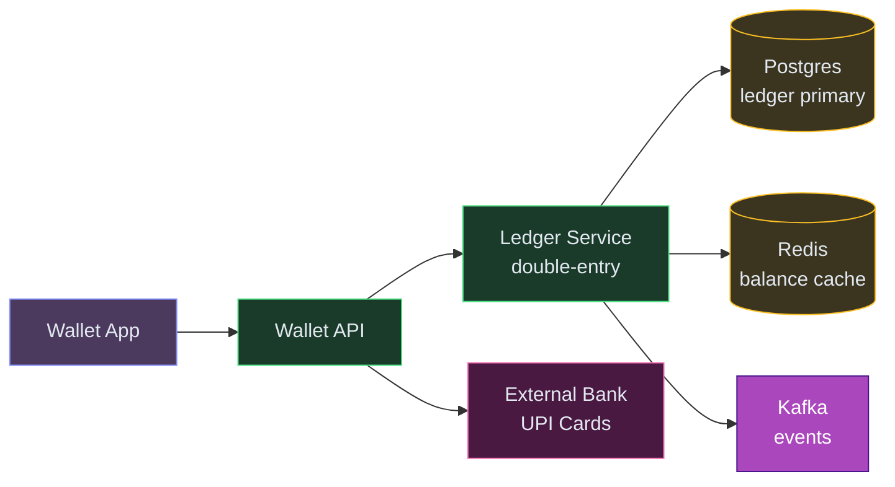
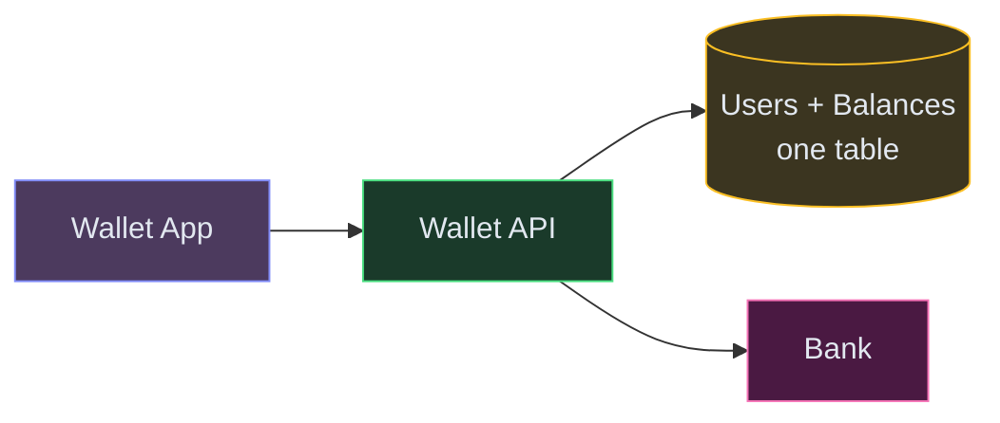
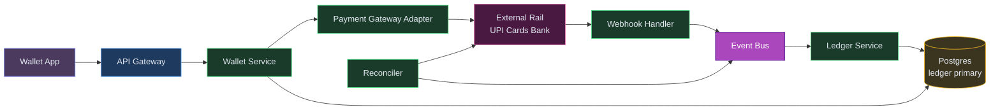
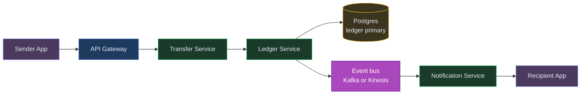
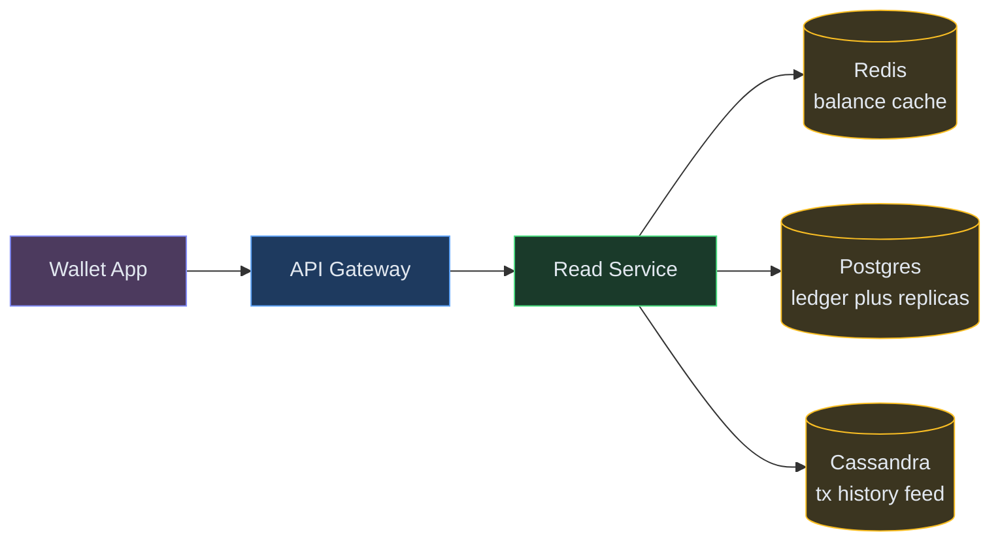
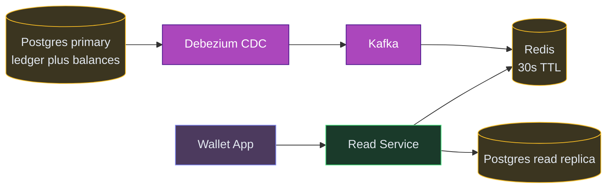
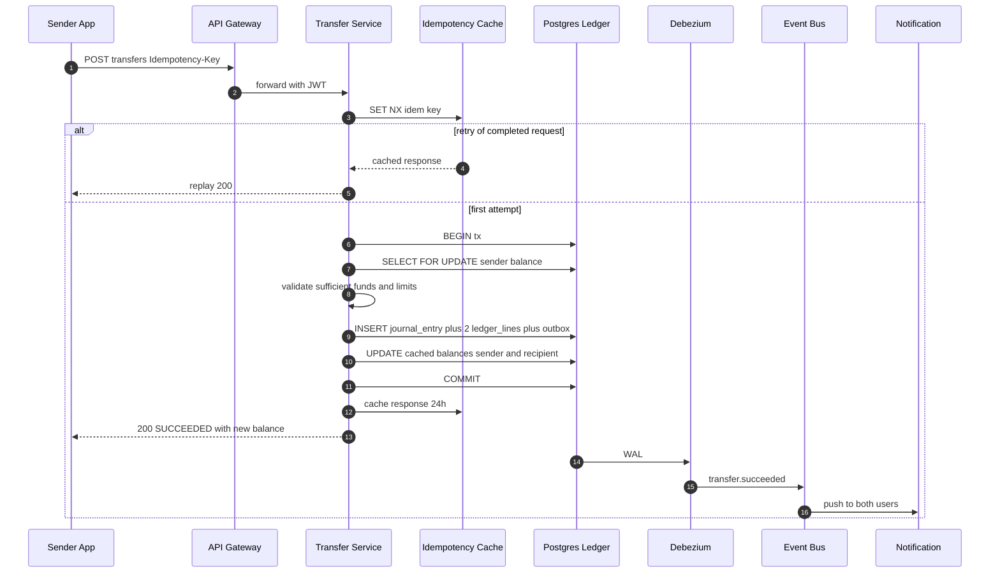
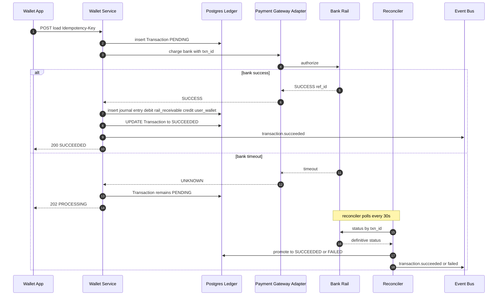
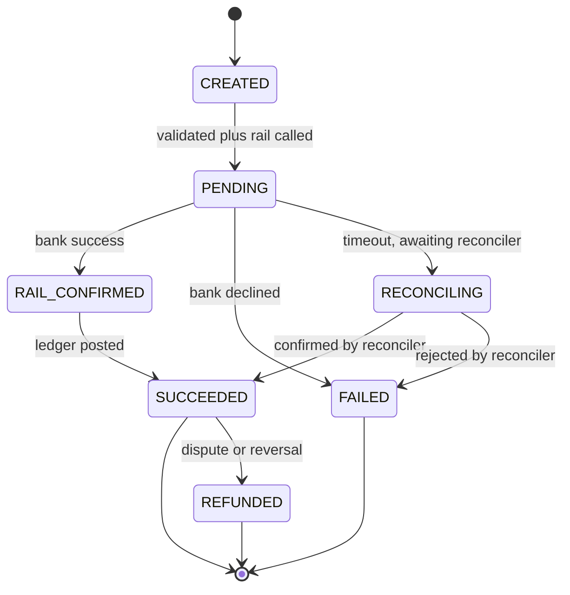
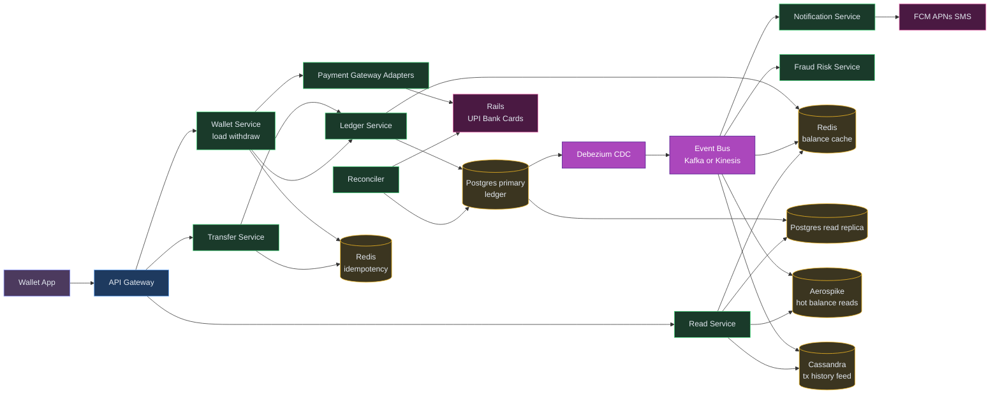

# Designing a Payment Wallet Like PhonePe / Venmo / Cash App

⚡ **Difficulty:** Advanced
📋 **Prerequisites:** [System Design Fundamentals](/concepts) — especially Databases, Consistency, and Message Queues
⏱️ **Reading time:** 30 min

---

## TL;DR

A digital wallet is an accounting system disguised as a consumer app. Every transfer is a pair of debits and credits on a double-entry ledger. Money never moves without both sides of the entry being written atomically.



**In 3 sentences:** Users load money from banks (async, webhook-confirmed), send to each other (instant, single DB transaction), and withdraw (async again). The core is a double-entry ledger in Postgres — every balance change creates both a debit and a credit line that sum to zero. Redis caches balances for fast reads; Kafka fans out events to notifications and analytics.

---

## Understanding the Problem

👛 **What is a payment wallet?** A closed-loop or semi-closed-loop digital wallet lets users load money into a balance, send it peer-to-peer, pay merchants, and withdraw back to a bank. Examples: Paytm Wallet, PhonePe Wallet, Venmo, Cash App, Google Pay's balance. Under the hood it's an accounting system disguised as a consumer app — every "transfer" is a pair of debits and credits on a ledger, and every ₹1 or $1 moving in the app must correspond to real money sitting in a partner bank account.

## Naive First Cut

30-second whiteboard sketch:



Store a `balance` column on the user row, `UPDATE users SET balance = balance - 100 WHERE user_id = A` and `... + 100 WHERE user_id = B`. This breaks in every way that matters for money:
- Race conditions on concurrent transfers corrupt balances.
- No audit trail — who transferred what, when, why?
- No way to reconcile against the real bank account.
- A crash between the two updates creates or destroys money.
- No idempotency → double-debits on retries.
- No way to handle async outcomes (bank says "pending" for 3 seconds).

The rest of this doc evolves this into a system that a regulator, an auditor, and 360 million daily transactions can trust.

## Prior Art We're Drawing From

- **Modern Treasury "Accounting for Developers"** — the reference for how to model a Venmo-style wallet with double-entry: chart of accounts, debit-normal vs credit-normal accounts, balance = aggregate of entries. ([source](https://www.moderntreasury.com/journal/accounting-for-developers-part-ii))
- **Uber "Gulfstream"** — active-active payments with exactly-once via idempotency + strong consistency, double-entry bookkeeping, async stream processing of immutable orders. ([source](https://www.uber.com/en-CH/blog/payments-platform/))
- **Airbnb "Orpheus"** — idempotency framework with three-phase Pre-RPC / RPC / Post-RPC contract, retryable vs non-retryable error classification, and reads-from-primary-only to avoid replica-lag double-charges. ([source](https://medium.com/airbnb-engineering/avoiding-double-payments-in-a-distributed-payments-system-2981f6b070bb))
- **PhonePe on Aerospike** — 360M transactions/day served with sub-ms balance reads via a partitioned KV store; separated hot OLTP paths from governance/audit stores. ([source](https://enterprise.aerospike.com/blog/phonepe-real-time-transactions-governance))
- **TigerBeetle** — purpose-built financial DB that enforces double-entry and debit/credit invariants at the storage layer itself; shows how far you can push correctness guarantees. ([source](https://tigerbeetle.com))

## Technology Choices

Each data tier has a different job. Picking one DB to "just store everything" is the mistake that kills most wallet prototypes. Here's what each tier does and what actually fits.

| Tier | What it stores | Access pattern | Primary pick | Alternatives |
|---|---|---|---|---|
| **Ledger (source of truth)** | `journal_entries`, `ledger_lines`, `accounts`, `transactions` — append-only, ACID required | Point writes (inserts only), point reads, `SELECT FOR UPDATE` on balance rows | **PostgreSQL** with partitioning by month on ledger_lines | MySQL / Aurora, CockroachDB for multi-region strong consistency, TigerBeetle for invariant-enforced financial storage |
| **Balance cache** | `balance:{userId}` → current available + pending | 100K+ point reads/sec, invalidate on ledger write | **Redis** (cluster mode) | Memcached, Valkey, Aerospike at PhonePe scale |
| **Idempotency keys** | `idem:{merchantOrUser}:{endpoint}:{hash}` → response JSON | `SET NX PX`, retrieval on retry, short TTL | **Redis** (same cluster as balance cache, separate keyspace) | DynamoDB with TTL if you want it durable by default |
| **Transaction history feed** | denormalized per-user transaction list for the history screen | Range scans by `(user_id, created_at DESC)` at hundreds of QPS | **Cassandra** or **ClickHouse** | DynamoDB with `user_id` PK and `created_at` sort key |
| **Event bus (outbox fan-out)** | `transaction.succeeded`, `rail.confirmed` events | Ordered per-key, replayable, at least once | **Kafka** | Kinesis, Google Pub/Sub, Pulsar |
| **CDC** | Postgres WAL → Kafka | Continuous | **Debezium** | Native logical replication + custom publisher |
| **Raw events lake** | Every event forever, for audit and ML | Append-only, columnar for ad-hoc queries | **S3 + Parquet** via Kafka S3 sink | GCS, Azure Blob, MinIO |
| **Ad-hoc analytics** | SQL over raw events | Infrequent, high-scan | **Athena / Trino / BigQuery** | Snowflake, DuckDB |
| **Settlement / reconciliation store** | daily settlement files, bank statements, reconciliation breaks | Append, compare, query by day | **Postgres** (separate schema from OLTP) | Same-cluster Postgres is fine; doesn't need scale |
| **KYC / user profile** | Name, phone, docs, tier, limits | Point lookup by user_id | **Postgres** | DynamoDB |

Why Postgres for the ledger (not DynamoDB or Cassandra):

- The ledger is where correctness lives. We need **multi-row ACID transactions** (insert journal entry + 2+ ledger lines + update balance cache + write outbox row — all or nothing). DynamoDB transactions exist but are capped at 100 items and expensive; Cassandra can't do this at all.
- `SELECT FOR UPDATE` on balance rows gives us row-level concurrency control for free.
- Partitioning by month on `ledger_lines` keeps the hot set small as we grow; a single Postgres cluster comfortably handles tens of billions of rows with partitioning.
- Auditors, finance tools, BI tools all speak SQL. A KV store makes daily reconciliation painful.
- When we truly outgrow a single Postgres cluster (500M+ DAU, billions of transactions per day), we shard by `user_id` at the application layer and keep Postgres semantics. This is what Uber Gulfstream does.

Why Redis for balance cache (not just hitting Postgres):

- Balance reads massively outnumber writes. Every app screen does a balance check.
- Sub-ms reads matter for perceived app snappiness.
- Postgres can handle it, but you'd burn half your cluster capacity on reads that have a 99.9% cache hit rate.

Why Cassandra / ClickHouse for history feed (not Postgres):

- History is read-only after the write, and the access pattern is "latest N transactions for user X."
- Cassandra's partition-per-user (`user_id` as partition key, `created_at` as clustering column) is tailor-made for this.
- ClickHouse is better if we also want "top 1000 largest transactions today" — column-store aggregations.
- Postgres works until ~100GB per table; past that, history queries start fighting OLTP writes.

Why Kafka as the event bus:

- Ordering per `user_id` partition matters (notification for "you received money" must come after "send initiated").
- Replayability lets new consumers (fraud, analytics, new features) backfill from history.
- Debezium plugs straight into Postgres WAL.

---

## Functional Requirements

### Core Requirements
1. Users can **load money** into the wallet from a bank, card, or UPI.
2. Users can **send money** peer-to-peer to another wallet user.
3. Users can **withdraw** to a bank account; users and internal systems can **view balance and transaction history**.

### Below the line (out of scope)
- Merchant payments with checkout flows (adjacent system)
- Split bills, group payments, social feed
- Rewards, cashback, subscriptions
- KYC, sanctions screening, fraud scoring (assumed; not the design focus)
- Cards issued against the wallet balance
- Multi-currency, FX, international remittance
- Interest / investment features

## Non-Functional Requirements

### Core Requirements
- **Correctness over everything.** Money cannot be created, lost, or duplicated. Every rupee in a user's balance must correspond to a rupee in our partner bank.
- **Strong consistency** on the balance and ledger. Eventual is fine for history feed and analytics.
- **Low latency** — P95 transfer under 500ms, balance check under 100ms.
- **High availability** — 99.99% on the transfer path. Users block on this.
- **Auditability** — every balance change is traceable to the ledger entries that produced it. Required for regulators and internal finance.
- **Idempotency** — any operation is safe to retry without side effects. 💡 *Idempotency = running the same operation multiple times produces the same result. Essential for payment retries — charging a card twice would be catastrophic.*

### Below the line
- Globally multi-region active-active (single-region-primary with regional read replicas is fine to start)
- Sub-100ms tail latencies (bounded by downstream banks and card rails anyway)

## Scale Estimation (Back-of-Envelope)

- **Users:** 50M DAU, 10M transactions/day
- **Write QPS:** 500 txns/sec peak (double-entry = 1000 ledger writes/sec)
- **Read QPS:** 5K balance checks/sec, 2K transaction history queries/sec
- **Storage:** ~1TB ledger data/year (immutable append-only entries)
- **Bandwidth:** Zero tolerance for balance inconsistency — strong consistency on the write path

---

## Core Entities

- **User** — wallet holder, identified by phone/email, with KYC state.
- **Account** — a logical bucket of money. Each user has one **wallet account**; the platform owns **system accounts** (cash-in-bank, fees-collected, etc.).
- **Journal Entry** — a group of ledger lines representing a single logical transaction. All lines sum to zero.
- **Ledger Line** — one debit or credit on one account, part of a journal entry. Append-only.
- **Transaction** — the user-visible operation (load, send, withdraw). Owns a state machine and refers to its underlying journal entry.
- **Payment Instrument** — a tokenized reference to a bank account, card, or UPI VPA the user has linked.

---

## API / System Interface

```
POST /v1/wallets/:userId/load              → Transaction
     Body: { amount, paymentInstrumentId }
     Header: Idempotency-Key: <uuid>

POST /v1/transfers                         → Transaction
     Body: { toUserId, amount, note }
     Header: Idempotency-Key: <uuid>

POST /v1/wallets/:userId/withdraw          → Transaction
     Body: { amount, paymentInstrumentId }
     Header: Idempotency-Key: <uuid>

GET  /v1/wallets/:userId/balance           → { available, pending }
GET  /v1/wallets/:userId/transactions      → Transaction[]
GET  /v1/transactions/:id                  → Transaction
```

Security:
- `userId` always comes from the authenticated JWT, never from a path or body for writes.
- Server computes the authoritative amount and fees; client-side numbers are advisory.
- Every money-moving API requires an idempotency key.
- Rate limit per user and per instrument to stop card-testing and credential stuffing.

---

## High-Level Design

### 1) User loads money into the wallet

User adds ₹500 from their bank to their wallet. The interesting twist: **this is inherently async**, not by choice but because the payment rails we talk to (UPI, cards with 3DS, bank ACH) are themselves async.

Why we can't make it sync:

| Rail | What has to happen | Typical latency |
|---|---|---|
| UPI collect | We request → NPCI → user's bank app → user taps approve → bank debits → we're told | 5-30 seconds, sometimes minutes |
| Card with 3DS | Authorize → bank issues OTP challenge → user enters OTP → bank confirms → we capture | 10-60 seconds |
| Direct bank debit / ACH | Authorize → bank runs its batch → settles | Hours to days |

None of these are "call a function and get an answer in 200ms." The shortest path still involves a human tapping a button in another app. If we held an open HTTP connection the whole time, thread pools would exhaust and P99 would balloon to 30s.

So the system accepts the request, returns `202 Processing` immediately, and learns about the final outcome through **three backstops**:

1. **Webhook (primary).** When the rail finishes, it POSTs a signed HTTPS callback to our Payment Gateway Adapter, referencing our internal `txn_id` that we passed when we initiated the charge.
2. **Reconciler (backup).** A cron job polls the rail every 30s for any of our `PENDING` transactions older than 2 minutes, asking for their definitive status. Catches lost webhooks.
3. **Settlement files (end-of-day).** Banks and rails send us daily settlement reports; a batch job compares against our ledger and flags breaks for finance.

Each layer backs up the one above it. Industry principle: **rail truth always wins.**

**New components we need:**

1. **API Gateway** — authenticates users, applies rate limits, and routes to the right service.
2. **Wallet Service** — orchestrates load/withdraw operations. Creates the transaction row BEFORE calling any external rail — the durable record that we attempted this operation.
3. **Payment Gateway Adapter** — translates our internal "charge this bank" request into the specific API format each rail expects (UPI, card networks, bank ACH). 💡 *Think of it as a universal translator between our system and dozens of different bank APIs.*
4. **Webhook Handler** — receives signed callbacks from banks when a charge succeeds or fails. This is how we learn the outcome of async operations.
5. **Reconciler** — a background job that polls rails every 30s for any PENDING transaction older than 2 minutes. The safety net for lost webhooks. 💡 *If the bank's webhook fails to reach us (network blip, our endpoint was down), the reconciler catches it on the next sweep.*
6. **Ledger Service** — the accounting brain. Posts journal entries (balanced debit + credit) to the ledger. Never creates money from nothing. 💡 *Double-entry ledger means every money movement has two sides that sum to zero. Debit one account, credit another. If the math doesn't balance, the transaction is rejected.*
7. **Event Bus (Kafka)** — carries transaction events to downstream services (notifications, analytics, fraud) without coupling the hot payment path to any of them.
8. **Postgres (ledger primary)** — the sacred source of truth. Stores journal entries and ledger lines. ACID transactions ensure money is never created or destroyed.



How the Ledger Service actually learns the rail succeeded — **it doesn't actively check anything**. It's a passive consumer of a `rail.confirmed` (or `rail.failed`) event on the event bus. Whoever produces that event — Webhook Handler, Reconciler, or Settlement batch — is responsible for having verified rail truth. Ledger Service just receives "transaction `txn_555` succeeded" and posts the journal entry.

**Step-by-step flow:**

1. User taps "Add ₹500 from HDFC Bank" → app calls `POST /v1/wallets/:userId/load` with an idempotency key
2. Wallet Service inserts a `Transaction` row in `PENDING` state BEFORE making any network call — this row is our durable promise that we attempted this load
3. Wallet Service calls the Payment Gateway Adapter with our internal `txn_id` as the reference. Adapter initiates the charge on the UPI rail
4. Rail responds "accepted, I'll tell you later" — we return `202 Processing` to the app immediately. User sees "pending" in the UI
5. Seconds to minutes later, the user approves in their bank app. Bank fires a signed webhook to our Webhook Handler with the result, referencing our `txn_id`
6. Webhook Handler verifies the HMAC signature, then publishes a `rail.confirmed` event to Kafka
7. Ledger Service consumes the event, locks the Transaction row (`SELECT FOR UPDATE WHERE status = 'PENDING'`), posts a balanced journal entry (`DEBIT rail_receivable ₹500, CREDIT user_wallet ₹500`), flips status to `SUCCEEDED` — all in one atomic DB transaction
8. If the webhook was lost? No problem — the Reconciler polls the rail within 30-60s and produces the same event
9. Notification fires: "₹500 added to your wallet!" 🎉

**Why persist BEFORE calling the bank?** If we called the bank first and crashed before recording the result, we'd have no record that money was charged. The durable `PENDING` row means: even if everything explodes, we know a charge attempt exists and can reconcile it later. "Write first, call second" is the golden rule of payment systems.

Tricks that make this safe:
- **Our `txn_id` passed to the rail on creation** so the webhook can tie back to our row.
- **HMAC verification** on the webhook — the endpoint is public, only signed payloads are trusted.
- **Idempotent consumer** — the same webhook may be delivered twice, or the webhook and reconciler may both fire; the `WHERE status = PENDING` guard ensures the second attempt is a no-op.
- **State machine guard** prevents posting a journal entry for a transaction already in a terminal state.

### Color Legend

| Color | Layer |
|---|---|
| 🟠 Orange | Clients |
| 🔵 Blue | Edge |
| 🟢 Green | Services |
| 🟣 Purple | Async / Streaming |
| 🟡 Yellow | Data |
| 🩷 Pink | External |

### 2) User sends money to another wallet user

Pure internal transfer — no bank rail involved. Fastest and most common operation.

**New components we need (in addition to the ones above):**

1. **Transfer Service** — handles peer-to-peer sends. Validates sender balance, recipient existence, and daily limits before asking the Ledger Service to post the entry.
2. **Notification Service** — tells both sender and recipient about the transfer via push notification.



**Step-by-step flow:**

1. Sender taps "Send ₹100 to Priya" → app calls `POST /v1/transfers` with an idempotency key
2. Transfer Service validates: Does Priya exist? Is sender KYC-verified? Does sender have ₹100 available? Not a self-transfer? Within daily limits?
3. Ledger Service atomically posts a journal entry in ONE database transaction: `DEBIT user_wallet:sender ₹100` + `CREDIT user_wallet:recipient ₹100`. Either BOTH happen or NEITHER — money cannot be lost or created
4. Same transaction writes a `transaction_completed` event to an outbox table — guarantees the event is published if and only if the ledger entry committed
5. Debezium (CDC) drains the outbox to Kafka → Notification Service pushes to both users
6. Response returns to sender with their new balance in ~200ms

**Why one DB transaction instead of a saga?** Both users' wallets are in the same Postgres database. A single transaction gives us atomicity for free — no distributed coordination, no compensating rollbacks, no inconsistency window. This is the beauty of keeping the ledger in one place.

💡 *Saga pattern = a sequence of local transactions where each step has a compensating action (undo). If step 3 fails, run compensations for steps 2 and 1 to rollback.*

### 3) Balance and transaction history

Balance is a derived quantity — the sum of all ledger lines on the user's wallet account. History is the list of those lines enriched with user-facing metadata.

**New components we need (in addition to the ones above):**

1. **Read Service** — serves balance checks and transaction history. Reads from caches and replicas to avoid loading the primary ledger DB.
2. **Redis (balance cache)** — caches the current balance for sub-millisecond reads. Every app screen checks the balance; we can't hit Postgres 100K times/sec for this.
3. **Cassandra (transaction history feed)** — a denormalized, read-optimized store for "show me my last 50 transactions." Populated from the Kafka event stream.



**Step-by-step flow:**

1. User opens the app → balance check: Read Service hits Redis first (`balance:{userId}`) — sub-millisecond response, 99.9% cache hit rate
2. On the rare cache miss, Read Service computes the balance from the ledger and re-caches it. Cache is invalidated automatically on every write via CDC (ledger entry → Kafka → cache invalidation)
3. User scrolls to transaction history → Read Service queries Cassandra (partitioned by userId, sorted by time). Fast range scans without touching the OLTP database

**Why not just read from Postgres?** Balance reads outnumber writes 100:1. Every app screen triggers a balance check. If we hit Postgres directly, we'd burn half our database capacity on repetitive reads that have a 99.9% chance of returning the same number. Redis absorbs this load for pennies.

---

## Potential Deep Dives

### Deep Dive 1 — How do we model money correctly so we don't lose a rupee?

**Problem.** The defining question for a wallet. A naive "balance column" approach has been the cause of every "missing ₹1000 from my wallet" customer support ticket since the first digital wallets existed. Race conditions, unreconciled state, and one-sided updates all silently corrupt money.

**Bad — `UPDATE users SET balance = balance - X` and `UPDATE users SET balance = balance + X`.**
Two statements, no atomicity across rows in some DBs, no audit trail, no way to answer "where did this ₹100 come from?" or "what was my balance at 3pm last Tuesday?" Race conditions under concurrency. You cannot reconcile this against the bank.

**Good — a `transactions` table that records every transfer, plus balance derived from sum.**
Append-only log of transfers: `{from, to, amount, timestamp}`. Balance = `SUM(credits) - SUM(debits) WHERE account = user`. Much better. But it's still only tracking **user-to-user flows**; it doesn't model where money came from (which bank? which rail?) or where fees, promotions, and system money go.

**Great — full double-entry ledger with a chart of accounts.**

This is how every real wallet works. Borrowed directly from accounting:

```
journal_entries
  id, transaction_id, description, created_at

ledger_lines
  id, journal_entry_id, account_id, direction (DEBIT|CREDIT), amount_cents, created_at
  -- Append-only. Never updated. Never deleted.

accounts
  id, type, name, currency
  -- Types: USER_WALLET (debit-normal from our perspective as liability to user),
  --        CASH_IN_BANK (our asset), FEES_COLLECTED (our revenue),
  --        PROMOTIONS_PAYABLE (our liability), RAIL_RECEIVABLE (asset in-flight)
```

**Invariant enforced at every write**: `SUM(amount WHERE direction=DEBIT) = SUM(amount WHERE direction=CREDIT)` for every journal entry. A DB trigger or application-level check refuses to commit a journal entry that doesn't balance.

**A user transfer of ₹100 from A to B** creates one journal entry with two lines:
```
Line 1: DEBIT  user_wallet:A   ₹100
Line 2: CREDIT user_wallet:B   ₹100
```

**Loading ₹500 from a bank** creates:
```
Line 1: DEBIT  rail_receivable       ₹500  (money in-flight from bank)
Line 2: CREDIT user_wallet:A         ₹500
```
And later when the bank settles:
```
Line 1: CREDIT rail_receivable       ₹500  (cleared)
Line 2: DEBIT  cash_in_bank          ₹500  (now sitting in our bank)
```

**Balance** for any account at any time = `SUM(credits) - SUM(debits) WHERE account_id = X AND created_at <= T`. Point-in-time queries are free.

**Why this matters beyond correctness:**
- Daily reconciliation: our `cash_in_bank` total must equal our bank partner's statement. If they diverge, we know exactly which journal entry caused it.
- Regulator asks "how much do you owe users?" — sum all `user_wallet:*` balances. That's the "pooled account" liability.
- Finance asks "where did fees come from last month?" — query one account, `fees_collected`.
- Every customer support dispute is answerable by pulling journal entries tied to that transaction ID.

The mental shift is: **balances are not stored, they are computed.** Stored balances are a **cache**; the ledger is the truth.

### Deep Dive 2 — How do we handle concurrent transfers from the same user without corruption?

**Problem.** User A has ₹100. She taps "send ₹80 to B" and "send ₹50 to C" in rapid succession. Both land on different pods within milliseconds. Without concurrency control, both may pass a naive balance check ("₹100 > ₹80" and "₹100 > ₹50") and proceed, leaving A with -₹30. Money has been created from nothing.

**Bad — read balance, check, write balance. Three statements, no locks.**
Classic race. Both transactions see the stale balance. Bug guaranteed.

**Good — `SELECT ... FOR UPDATE` on the user's account row before posting the journal entry.**
The first transaction acquires a row lock; the second waits. By the time the second checks, it sees A's balance reduced to ₹20 and fails correctly.

Implementation:
```sql
BEGIN;
SELECT balance FROM account_balances WHERE account_id = ? FOR UPDATE;
-- validate >= amount
INSERT INTO journal_entries (...);
INSERT INTO ledger_lines (...);  -- 2+ lines, must balance
UPDATE account_balances SET balance = balance - ? WHERE account_id = ?;
UPDATE account_balances SET balance = balance + ? WHERE account_id = ?;
COMMIT;
```

Works correctly. The `account_balances` table is a **cached projection** of the ledger; it's the row we lock on for concurrency control. The truth is the ledger.

Problem: `FOR UPDATE` serializes concurrent transfers for that one user. Fine for retail users (one person can't send 1000 transfers/sec). Not fine for a "platform account" that receives credits from millions of users.

**Great — row-level locks for user accounts + async aggregation for hot platform accounts + optimistic concurrency as a safety net.**

For user accounts:
- `SELECT FOR UPDATE` pattern above. User rate of ~10 tx/sec is trivial.
- Add a **version column** for belt-and-suspenders optimistic control: `UPDATE ... WHERE account_id = ? AND version = ?`. If 0 rows updated, someone else wrote concurrently — retry the full transaction.

For hot platform accounts (e.g., `fees_collected` receiving credits from every transfer in the system):
- Don't lock. These are credit-only accounts from the platform's perspective.
- Use a **partitioned account** pattern: `fees_collected_shard_0` through `_shard_63`, writes go to a randomly chosen shard. Reads sum across all shards.
- Uber, Stripe, and PhonePe all do this for the same reason — you can't lock a single row that receives 100K writes/sec.

For the ledger itself: journal_entries and ledger_lines are append-only with auto-increment IDs. No locks needed on writes; readers see a consistent snapshot.

**Isolation level.** Serializable is correct but slow. Use **Repeatable Read** (MySQL) or the default **Read Committed** (Postgres) with explicit `FOR UPDATE` locks on the specific balance rows we care about. That's the standard financial-system choice.

### Deep Dive 3 — How do we serve balance reads at 100K+ QPS without hammering the ledger?

**Problem.** Every wallet screen on the app triggers a balance read. 100M active users checking their balance = catastrophic query load if we derive balance from scratch every time. But balance must be accurate, not stale, because it gates the next transfer.

**Bad — derive balance on every read by summing ledger lines.**
Sums millions of rows on every GET. A user with 10 years of history pays the cost of everyone before them. Melts the DB.

**Good — cached `account_balances` table, updated on every ledger write.**
Single-row lookup per user. Correctness comes from the same DB transaction that writes the ledger lines — balance updates atomically with the underlying journal entry. Fast reads, guaranteed consistency.

This is already a huge win. Most real wallets stop here. But at PhonePe-scale (360M transactions/day, hundreds of thousands of balance reads/sec), even a single-row Postgres read is pressure on the primary.

**Great — three-tier balance cache: Redis hot tier + read replicas + snapshot rebuilds.**

1. **Redis cache** holds `balance:{userId}` with a 30s TTL. On every ledger write, the same CDC pipeline that produces Kafka events also invalidates the Redis entry (or writes the new balance directly). Read-your-writes consistency within the write pipeline is preserved by making the API response include the new balance from the DB transaction, not the cache.

2. **Read replicas** serve cold misses. Read-your-writes isn't guaranteed here, but for "just-checking-my-balance" reads a second of lag is fine. **Critical:** reads that **gate** a write (like "can A afford this transfer?") MUST go to primary with `FOR UPDATE` — never a replica.

3. **PhonePe-style: Aerospike or similar low-latency KV** for the hot balance tier at truly massive scale. Sub-ms reads, natively partitioned, designed for 360M+ tx/day workloads. Secondary to the SQL ledger (SQL remains the truth) but serves most balance reads.

For platform accounts with skew (one account credited by millions of users), precompute running aggregates in a stream processor (Flink) subscribed to the ledger CDC stream; the query never touches the raw ledger.



### Deep Dive 4 — How do we keep our wallet balances reconciled with the real money in our bank account?

**Problem.** Users trust our `balance` number. But that number is only valid if there's real money in a partner bank account backing it. If our ledger says users collectively hold ₹100 crore in wallets, our bank partner must show ₹100 crore in our pooled account. Any drift is either a bug, a bank-side error, or fraud. Regulators require this reconciliation daily.

**Bad — trust the ledger and hope.**
You will find out about reconciliation breaks at the worst possible time (regulator audit, customer complaint, bank dispute).

**Good — nightly batch reconciliation.**
Every night, pull the bank's statement for our pooled account, compute our expected balance from the ledger (`SUM(cash_in_bank account)`), compare. Alert on mismatch.

Works and is legally required. But "we find the break 24 hours later" is too slow — you may have millions more transactions stacked on top of a broken state.

**Great — continuous reconciliation + match-as-you-go for external rails + two-sided state machines.**

Three layers of defense:

1. **Continuous reconciliation at the rail level.** Every load/withdraw transaction has a state machine that only closes when we've heard back from the bank. `PENDING → RAIL_CONFIRMED → LEDGER_POSTED → SETTLED`. A reconciler polls rails for any `PENDING` transaction older than 2 minutes and reads the ground truth, so we never silently diverge.

2. **Daily automated reconciliation** as a pipeline job:
   - Pull bank statements (via bank API or file feed).
   - Compute expected from ledger.
   - Match line-by-line by external reference.
   - **Breaks are ticketed, not swept** — every mismatch creates an investigation task for ops.

3. **TigerBeetle-style invariant at the DB layer** (optional, advanced). If using a purpose-built financial DB, the storage engine itself refuses to commit unbalanced entries. Extra defense.

Real-world example patterns:
- **Two-sided state machine** — we track the transaction in our DB AND mirror the bank's view. The two must match at terminal states.
- **Sweep jobs** — money held in our "rail_receivable" or "rail_payable" accounts older than N hours triggers investigation.
- **Daily liability report** — `SUM(all user_wallet accounts)` compared against `cash_in_bank` account. Divergence > $10 pages finance.

### Deep Dive 5 — How do we prevent double-debiting on retries and across services?

**Problem.** Network failures are guaranteed. A user taps "send ₹500" — their phone's radio drops mid-request. Their app retries. Without idempotency, we debit them twice. If our own internal services retry (e.g., Payment Gateway adapter timing out), we may charge the bank twice.

**Bad — trust the client and service retry policies to not cause harm.**
Guaranteed to eventually send the same user two identical transfers for the same intent.

**Good — `Idempotency-Key` header on every money-moving API + DB unique constraint.**
Client sends a UUID; server checks `UNIQUE(user_id, idempotency_key)`. Duplicates return the original response.

**Great — Airbnb Orpheus-style idempotency framework with three-phase contract.**

Lifted directly from Airbnb's production design:

1. **Pre-RPC (DB only).** Acquire idempotency lease in Redis (`SET NX PX 60s`). Insert `Transaction` row in `PENDING`. All within one DB transaction.
2. **RPC (network only).** Call the payment rail. No DB writes during this phase — otherwise a slow bank call holds a transaction lock and deadlocks the system.
3. **Post-RPC (DB only).** Record the rail's response, post the journal entry, update state. Atomic DB transaction.

Rules:
- **No network calls during Pre/Post-RPC.** Otherwise one slow downstream service kills the whole wallet.
- **No DB writes during RPC.** Same reason.

Plus two critical pieces Airbnb calls out:

**Retryable vs non-retryable error classification.** Every failed operation is stamped with its retryability:
- 5xx, timeouts, connection resets → retryable. Idempotency key NOT burned. A later retry will try again.
- 4xx validation errors, "insufficient funds," "KYC blocked" → non-retryable. Idempotency key IS burned with the error response cached. Future retries return the same 4xx.

Misclassification is how you get stuck transactions or double-debits. Every new exception type gets reviewed for retry semantics.

**Read-from-primary for idempotency state.** Never check the idempotency table on a read replica. Replica lag between a write and a retry is exactly the window where you accidentally process twice. This is a subtle bug with huge blast radius.

**Fencing token for multi-step flows.** Loads and withdrawals span multiple seconds. If the Transaction row is picked up for reconciliation while another process is mid-flight, you need `version` optimistic locking — `UPDATE ... WHERE id = ? AND version = ?`. Zero rows updated = someone else beat you, retry.

Downstream processors (card rails, UPI, bank APIs) should also receive a deterministic idempotency key derived from our transaction ID — `{txn_id}:{attempt_no}` — so even if we retry, the external system dedupes.

### Deep Dive 6 — Balance > 0 but can't spend it: how do we model holds, pending, and available balance?

**Problem.** A user loads ₹500. The bank says "pending" for up to 2 business days. Should the user see ₹500 in their available balance? No — we haven't actually received the money yet. Similarly, if a user sends ₹100 that hasn't cleared the recipient's bank-linked rail yet, that's in flight. We need to distinguish **provisional** balance from **available** balance.

**Bad — one balance number.**
Users spend money they don't actually have yet, or we don't let them spend money that's real. Both are bad UX.

**Good — two balance fields: `available` and `pending`.**
Store both on the cached row. `available` is what they can spend; `pending` is inflow that hasn't cleared.

Works for simple cases. Falls apart with refunds, disputes, stuck transactions, and long-tail edge cases. Ends up needing more fields.

**Great — model holds as first-class ledger accounts, not flags on a balance row.**

Every user has multiple sub-accounts:
- `user_wallet:{id}:available` — money they can spend.
- `user_wallet:{id}:pending_in` — inflow not yet cleared.
- `user_wallet:{id}:pending_out` — outflow awaiting settlement.
- `user_wallet:{id}:hold` — frozen for disputes, KYC review, etc.

Transfers between these are ledger entries. "Clearing" a pending load is a ledger entry: debit `pending_in`, credit `available`. Nothing special. Holds, releases, and clears are all expressible as balanced journal entries.

**Why this is better:**
- Zero special-case code paths. Every money-move is a journal entry.
- Auditable: "why is ₹100 in my hold account?" → pull the journal entry that put it there.
- Easy to reason about regulatory escrow requirements (e.g., funds in `pending_in` aren't yet "owed" to users).
- Unified reporting: user's total stake is still just `SUM(all their sub-accounts)`.

This is how Venmo, Cash App, and Stripe all model it internally.

---

## Core Flows

### Flow 1 — Peer-to-peer transfer



1. Sender app generates a UUIDv4 idempotency key tied to the tap action and retries with the same key.
2. Transfer Service checks Redis for the idempotency key. Duplicate retries replay the cached response — no double-debit.
3. Pre-RPC phase begins: lock sender's balance row with `SELECT FOR UPDATE`.
4. Validate sufficient funds, daily limit, KYC tier, recipient is valid.
5. Insert the journal entry and two ledger lines (debit sender, credit recipient) PLUS an outbox row in one atomic tx. This is the core correctness guarantee: both halves of the money move atomically.
6. Update the cached balance rows in the same tx.
7. Commit. Response returns to sender. Debezium drains outbox to Kafka, fanning out to notifications, history store, analytics.

Failure: if `FOR UPDATE` times out waiting on another transaction (user in rapid succession), we return `429 Retry` and the client retries with the same key — idempotency guarantees no duplicate on retry.

### Flow 2 — Load money from bank



1. App sends load with an idempotency key and payment instrument ID.
2. Wallet Service inserts `Transaction` row in `PENDING` before any network call.
3. Calls the payment gateway. On success, journal entry is posted: `DEBIT rail_receivable, CREDIT user_wallet`. User sees balance increase.
4. On timeout, `Transaction` stays `PENDING`. Crucially, no ledger entry exists yet — money has not been declared to exist. User sees "pending" in app.
5. Reconciler polls the bank every 30s for any `PENDING` transaction older than 2 min and makes a definitive call.

Later, when the bank actually settles (1-2 business days), a separate ledger entry reconciles `rail_receivable` to `cash_in_bank`. This is the audit-critical piece.

### Flow 3 — Withdraw to bank

Structurally symmetric to Load. Debit `user_wallet`, credit `rail_payable` immediately (freezing the user's balance). The physical money movement to their bank is async via the rail; on confirmation, we debit `rail_payable` and credit `cash_in_bank` (reducing our bank holdings). On bank failure, we reverse: debit `rail_payable`, credit `user_wallet`, restoring the user's balance. Every step is a balanced journal entry, so the audit trail is bulletproof.

### Transaction state machine



Every transition is a compare-and-set in the DB and emits an event. Illegal transitions no-op silently (update 0 rows).

---

## Final Architecture



That's the design. Six deep dives each picking the right primitive: double-entry ledger with chart-of-accounts for correctness, row-locking with `FOR UPDATE` plus partitioned platform accounts for concurrency, tiered balance caches for read scale, continuous-plus-daily reconciliation for integrity with real banks, Orpheus-style three-phase idempotency to kill double-debits, and modeling holds as first-class accounts instead of flags. Correctness first, everything else second — a wallet that occasionally loses money is not a wallet.


---

## Key Technologies Mentioned

| Term | What it is |
|---|---|
| **Double-entry Ledger** | Accounting model where every money movement creates balanced debit + credit entries that sum to zero — money can never be created or destroyed. |
| **Idempotency Key** | Client-generated UUID attached to every payment request ensuring retries produce the same result without double-charging. |
| **Saga Pattern** | Sequence of local transactions with compensating actions (e.g., refund) used when operations span multiple services that can't share a DB transaction. |
| **Optimistic Locking (CAS)** | Compare-and-swap via a version column — UPDATE succeeds only if the version matches, detecting concurrent modifications without holding locks. |
| **Materialized Balance** | A cached running total derived from the ledger; updated atomically with ledger writes and used for fast balance checks. |
| **Reconciliation** | Periodic comparison of internal ledger state against external bank statements to detect and resolve discrepancies. |
| **Kafka** | Distributed event bus carrying transaction events (via CDC/outbox) to notifications, analytics, and the history feed. |
| **Postgres** | ACID relational database serving as the ledger source of truth with row-level locking for concurrency control on balances. |

---

## What's Expected at Each Level

> This section helps you calibrate your depth. You don't need to cover everything — just know what's expected for your level.

### Mid-level

Design a basic wallet with balance storage and transfer capability. Understand why double-spend is the core problem — two concurrent requests draining the same balance must not both succeed. Propose database transactions for atomic balance updates and explain why check-then-deduct is a race condition.

### Senior

Propose double-entry ledger (every transaction creates two entries: debit + credit). Explain idempotency keys for safe retries without double-charging. Discuss saga pattern for multi-party transfers involving external banks and reconciliation with external payment gateways. Articulate why eventual consistency is unacceptable for balance operations.

### Staff+

Address distributed ledger consistency across shards (partitioned platform accounts to avoid hot-key contention). Discuss settlement and clearing processes with partner banks, regulatory compliance (PCI-DSS, RBI guidelines for prepaid instruments), and fraud detection patterns (velocity checks, device fingerprinting). Cover how to handle partial failures in multi-step payment flows using three-phase idempotency and the cost of strong consistency at scale.

---
## 🎯 Key Takeaways

- **Double-entry ledger** — every transaction has debit + credit; sum must be zero
- **Persist before calling external** — write intent to DB, then call bank; never the reverse
- **Idempotency key** on every payment — retries are safe
- **Reconciler** compares our ledger with bank statements daily

---
## Related Designs
- [Stock Broker](/StockBroker) — financial transactions + exactly-once semantics
- [Zomato](/Zomato) — end-to-end order lifecycle
- [Delayed Trigger Service](/DelayedTriggerService) — scheduled payment retries
