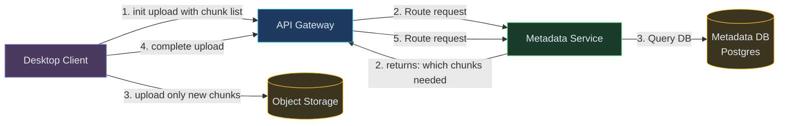
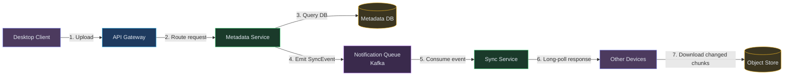
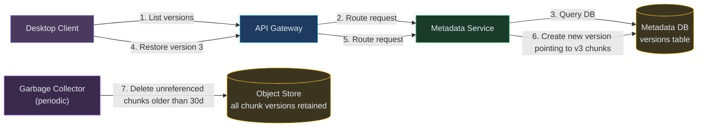
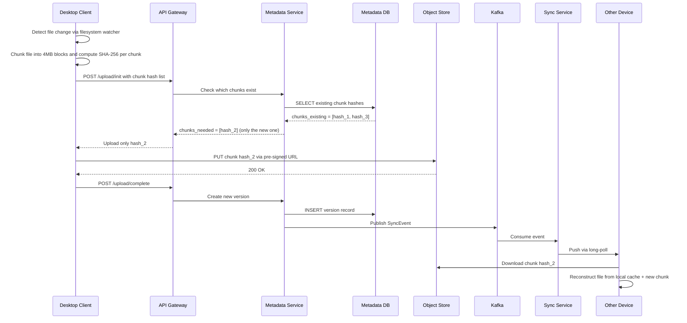
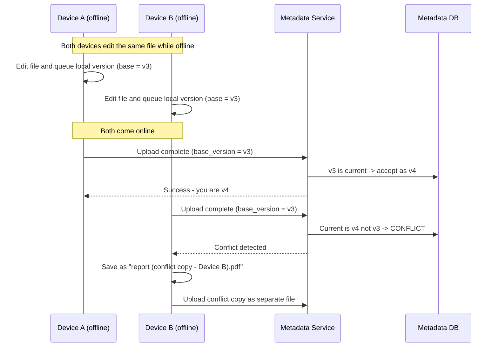
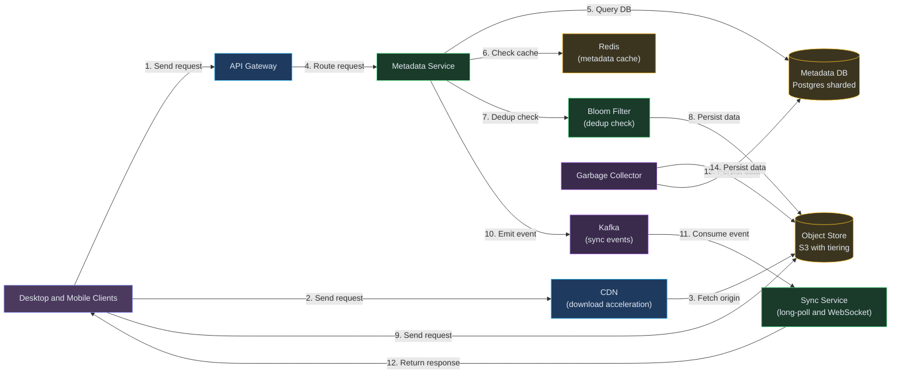

# Designing Dropbox / Cloud File Storage and Sync

**Difficulty:** Advanced **Topics:** Chunking, Deduplication, Delta Sync, Conflict Resolution, Object Storage, Metadata Service **Asked at:** Google, Amazon, Microsoft, Dropbox, PhonePe, Flipkart
**Prerequisites:**[Object Storage](/concepts/object-storage/), [Consistent Hashing](/concepts/consistent-hashing/), and [Message Queues](/concepts/message-queues/)

---

## 1. Understanding the Problem

A cloud file storage service lets users upload files, sync them across devices, share them with others, and access version history. The hard engineering problems: syncing a 4GB video edit without re-uploading the entire file (delta sync), handling two people editing the same file offline simultaneously (conflict resolution), and storing petabytes of files cost-efficiently while keeping metadata lookups fast.

**Real examples:** Dropbox, Google Drive, OneDrive, iCloud Drive, Box.

---

## 1.5. Naive First Cut


User uploads the entire file to a server; server stores it as-is on disk. On change, re-upload the whole file.

**Why this breaks:**

- Re-uploading a 2GB file because one byte changed wastes bandwidth and takes minutes
- No deduplication - 100 users with the same PDF = 100 copies stored
- Single file server has finite disk; can't scale to petabytes
- No versioning - overwriting loses history
- No sync - other devices don't know a file changed until they poll
- Concurrent edits from two devices silently overwrite each other (last-write-wins data loss)

The rest of the doc evolves this into a chunked, content-addressed, event-driven sync system.

---

## 1.7. Prior Art We're Drawing From

- **Dropbox Block-Level Sync** - Files are split into 4MB chunks, each identified by SHA-256 hash. Only changed chunks are uploaded/downloaded. This single optimization reduced Dropbox's bandwidth usage by 60%+ for typical edit patterns. ([Dropbox Tech Blog](https://dropbox.tech/infrastructure/streaming-file-synchronization))
- **Google Drive Conflict Resolution** - Uses operational-transform-style conflict detection: when two clients edit the same file offline, the second to sync gets a "conflict copy" rather than silent overwrite. User explicitly resolves. ([Google Workspace Blog](https://workspace.google.com/blog/))
- **Rsync Rolling Checksum** - The rsync algorithm uses a rolling hash (Adler-32) to detect which blocks of a file have changed without comparing the entire file byte-by-byte. Dropbox's delta sync is conceptually derived from this. ([Rsync Technical Report](https://rsync.samba.org/tech_report/))
- **Content-Addressable Storage (CAS)** - Git, IPFS, and Dropbox all use content-addressed storage (hash of content = storage key). This gives deduplication for free — identical blocks map to the same key regardless of which user uploaded them.

---

## 2. Technology Choices

| Tier | Purpose | Stores | Access Pattern | Primary Pick | Alternatives |
|---|---|---|---|---|---|
| Object store | File chunk storage | Raw binary chunks (4MB each) | PUT/GET by content hash | S3 / GCS / Azure Blob | MinIO (self-hosted) / Ceph |
| Metadata DB | File tree and versions | File paths, chunk lists, versions, sharing | OLTP reads and writes | Postgres (strong consistency) | CockroachDB / TiDB / Spanner |
| Sync queue | Change notifications | File change events | Pub/Sub per user | Kafka / Redis Streams | RabbitMQ / SNS+SQS |
| Cache | Hot metadata | Recently accessed file metadata | Key-value lookup | Redis / Memcached | - |
| CDN | Download acceleration | Popular shared files | Read-heavy, geo-distributed | CloudFront / Cloudflare | Fastly / Akamai |
| Block diff engine | Delta computation | Rolling hash state | CPU-intensive, stateless | Custom service (rsync-like) | librsync library |

**Why Postgres for metadata, not a NoSQL store?** File systems have strong hierarchy and referential constraints (folders contain files, files have ordered chunk lists, sharing permissions reference users). Relational integrity + ACID transactions prevent orphaned chunks and inconsistent states. At Dropbox-scale, shard Postgres by workspace_id.

---

## 3. Functional Requirements

### Core (Top 3)

1. **Upload and download files** - users can store files up to 50GB and retrieve them from any device
2. **Sync across devices** - changes on one device propagate to all other devices within seconds
3. **Version history** - users can view and restore previous versions of any file (last 30 days)

### Below the Line

- File and folder sharing with permissions (view/edit)
- Collaborative real-time editing (Google Docs territory)
- Offline editing with eventual sync
- Storage quota management
- Trash / soft-delete with recovery

---

## 4. Non-Functional Requirements

### Core

- **Reliability:** Zero data loss - files stored with 99.999999999% (11 nines) durability
- **Sync latency:** Changes propagate to other devices within 5-10 seconds (after upload completes)
- **Upload efficiency:** Only transfer changed bytes, not entire files (delta sync)
- **Scale:** 500M files per workspace, 100K concurrent sync sessions globally

### Below the Line

- Eventual consistency for metadata across regions (but strong within a region)
- Bandwidth-aware sync (pause on metered connections)
- Cost-efficient storage tiering (hot/warm/cold)

---

## 5. Core Entities

- **Workspace** - a user's or team's logical container for all files (the root of their file tree)
- **FileMetadata** - path, size, content hash, chunk list, version history, permissions
- **Chunk** - a fixed-size (4MB) block of a file, identified by its SHA-256 hash (content-addressed)
- **Version** - a snapshot of a file's chunk list at a point in time
- **SyncEvent** - a notification that a file changed (created/modified/deleted/moved)
- **EditSession** - tracks an active device's sync state (cursor position in the event stream)

---

## 6. API / System Interface

```
POST /v1/files/upload/init
Body: {"path": "/docs/report.pdf", "size": 52428800, "chunks": ["sha256_a", "sha256_b", ...]}
Response: {"upload_id": "u123", "chunks_needed": ["sha256_b"]}
// Server already has sha256_a (dedup) - only upload the new chunk
```

```
PUT /v1/files/upload/{upload_id}/chunk/{chunk_hash}
Body: <binary chunk data>
Response: 200 OK
```

```
POST /v1/files/upload/{upload_id}/complete
Response: {"file_id": "f456", "version": 3}
```

```
GET /v1/files/{file_id}/download?version=latest
Response: 302 Redirect to signed S3 URL (or chunked download URLs)
```

```
GET /v1/sync/events?cursor={last_event_id}&limit=100
Response: {"events": [...], "cursor": "evt_789", "has_more": false}
// Long-poll: server holds connection open until new events arrive or timeout (30s)
```

Security notes: all chunk uploads go to pre-signed URLs (client uploads directly to object store, not through API server). Download URLs are time-limited (15 min). Access checks happen at the metadata layer before issuing signed URLs.

---

## 7. High-Level Design

### FR1: Upload and download files (chunked, deduplicated)

The key insight: split every file into fixed-size chunks and identify each chunk by the hash of its content. If two users upload the same file, the chunks are identical hashes — store only one copy.



| Color | Meaning |
|---|---|
| Purple | Client |
| Blue | Edge / Gateway |
| Green | Application Service |
| Yellow | Data Store |

**New components:**
- **Metadata Service:** The brain. Tracks the file tree, chunk lists per file version, and determines which chunks already exist in the object store (dedup check).
- **Object Store (S3/GCS):** Stores raw chunk bytes keyed by their content hash. Immutable — chunks are never overwritten, only new ones are added.
- **Metadata DB (Postgres):** Stores file paths, chunk lists, versions, permissions. Sharded by workspace_id.

**Flow:**
1. Client computes SHA-256 for each 4MB chunk of the file locally
2. Client sends init request with the ordered list of chunk hashes
3. Metadata Service checks which hashes already exist in the store
4. Returns only the hashes that are missing (client skips uploading duplicates)
5. Client uploads missing chunks directly to object store via pre-signed URLs
6. Client sends complete request — Metadata Service creates a new file version pointing to the chunk list
7. Dedup savings: a 100MB file where only 4MB changed = only 1 chunk uploaded

---

### FR2: Sync across devices

Other devices need to know when a file changes. Instead of polling, we use a **long-poll event stream** — the client holds a connection open, and the server pushes events the moment they happen.



**New components:**
- **Sync Service:** Maintains long-poll connections from all devices. When a SyncEvent arrives via the queue, it pushes the event to all connected devices for that workspace.
- **Notification Queue (Kafka):** Decouples the upload path from the sync notification path. Metadata Service publishes events; Sync Service consumes them.

**Flow:**
1. Device A uploads a changed file (as per FR1)
2. On upload-complete, Metadata Service publishes a SyncEvent to Kafka (file_id, new_version, changed_chunks)
3. Sync Service consumes the event and looks up which devices are connected for this workspace
4. Pushes the event to Device B and Device C via their long-poll connections
5. Devices B and C receive the event, download only the new/changed chunks from object store
6. Devices reconstruct the updated file locally from cached chunks + new chunks
7. End-to-end sync latency: 2-5 seconds after upload completes

---

### FR3: Version history

Every upload creates a new version (an immutable snapshot of the chunk list). We never overwrite or delete chunks — we just create new version records that point to a different set of chunks.



**New components:**
- **Garbage Collector:** Periodic job that identifies chunks not referenced by any version within the retention window (30 days) and deletes them from object storage. This prevents unbounded storage growth.

**Flow:**
1. Each upload-complete creates a new row in the versions table: `{file_id, version_num, chunk_list[], timestamp}`
2. User requests version history: Metadata Service returns list of versions with timestamps and sizes
3. User restores version 3: Metadata Service creates a NEW version (v5) that copies v3's chunk list — this is a metadata-only operation (no data movement)
4. Garbage Collector runs daily, finds chunks referenced by no version within 30 days, deletes from S3
5. Storage cost: only unique chunks across all versions are stored (dedup means version overhead is small)

---

## 6.5. Core Flows

### Flow 1: File Upload with Delta Sync



1. Filesystem watcher detects the change instantly (no polling)
2. Client-side chunking means the expensive hashing happens locally, not on the server
3. Dedup check at init means only genuinely new data traverses the network
4. Pre-signed URL upload bypasses the API server (direct client-to-S3)
5. Version creation is atomic in Postgres (transaction)
6. Sync notification is fire-and-forget from Metadata Service's perspective

**Non-obvious failure path:** If the client crashes mid-upload (some chunks uploaded, complete never called), the upload_id times out after 24 hours. Orphaned chunks in S3 are cleaned by the Garbage Collector (they're unreferenced by any version).

---

### Flow 2: Conflict Resolution (Two Offline Edits)



1. Each client tracks the base_version it last synced
2. On upload-complete, Metadata Service checks: is base_version still current?
3. If yes, accept as next version (optimistic concurrency)
4. If no, reject with CONFLICT — the client creates a conflict copy
5. User manually resolves by picking one or merging

**Non-obvious failure:** Network partition during upload-complete. Client retries with idempotency key — Metadata Service deduplicates and never creates duplicate versions for the same upload.

---

## 7. Deep Dives

### Deep Dive 1: Delta Sync (Minimizing Upload Bytes)

**Bad:** Re-upload the entire file on every change. A 1-byte edit to a 2GB video = 2GB uploaded.

**Good:** Fixed-size chunking (4MB blocks). Only changed chunks are uploaded. If the user edits byte 5,000,000, only the chunk containing that byte (chunk 2) gets re-uploaded. Savings: 99.8% for a single edit to a large file.

**Great:** Content-defined chunking (CDC) using a rolling hash (Rabin fingerprint). Instead of fixed 4MB boundaries, chunk boundaries are determined by the content itself. This means inserting bytes at the start of a file doesn't shift ALL chunk boundaries (which fixed-size would) — only the chunks near the insertion point change. Dropbox uses this to reduce unnecessary re-uploads from ~40% to ~5% for insert-heavy workloads (documents, code files).

---

### Deep Dive 2: Deduplication at Scale

**Bad:** Store every chunk regardless of duplicates. 1000 users with the same 50MB installer = 50GB wasted.

**Good:** Content-addressed storage — chunk hash IS the storage key. Before uploading, check if the hash exists. Global dedup across all users. Dropbox reported 60%+ storage savings from cross-user dedup.

**Great:** Add a **Bloom filter** in front of the dedup check. With 10B chunks, checking existence in Postgres for every chunk hash on every upload is expensive. A Bloom filter (in memory, ~10 bytes per entry = ~100GB for 10B chunks) gives a fast "definitely not stored" answer for new chunks, and only hits the DB for probable matches. False positive rate of 0.1% means 99.9% of DB lookups are eliminated.

---

### Deep Dive 3: Sync Protocol and Offline Handling

**Bad:** Poll the server every 5 seconds asking "anything changed?" At 100M connected clients, that's 20M requests/second just for polling, mostly returning "no."

**Good:** Long-polling — client holds a connection open for 30 seconds. Server responds immediately when an event occurs, or times out with "no changes." 99% fewer requests than polling.

**Great:** WebSocket with server-push + cursor-based catch-up. On reconnect after being offline, client sends its last cursor (event_id). Server replays all events since that cursor. No missed updates, no duplicate processing. Combined with **exponential backoff on reconnect** (to prevent thundering herd when a server restarts and 1M clients reconnect simultaneously).

---

### Deep Dive 4: Consistency and Conflict Resolution

**Bad:** Last-write-wins. Device B's upload silently overwrites Device A's changes. Data loss.

**Good:** Optimistic concurrency with version checks (as shown in Core Flows). Detect conflicts and create conflict copies. User resolves manually.

**Great:** For collaborative scenarios, use **vector clocks** or **Lamport timestamps** to track causality. If two edits are causally independent (neither "saw" the other), it's a true conflict. If one causally follows the other (Device B saw A's version before editing), it's a clean update. This reduces false conflicts — only truly divergent edits require user resolution. Google Drive uses a version-vector approach internally to minimize unnecessary conflict copies.

---

### Deep Dive 5: Storage Tiering and Cost

**Bad:** Keep all chunks in S3 Standard forever. At $0.023/GB/month and petabytes of data, costs balloon to millions/year.

**Good:** Move versions older than 30 days to S3 Infrequent Access ($0.0125/GB). Move versions older than 90 days to S3 Glacier ($0.004/GB). 3-5x cost reduction for archival data.

**Great:** **Intelligent tiering based on access patterns**, not just age. Track per-chunk access frequency. A 2-year-old chunk that's part of an actively-used shared folder stays in Standard. A 1-week-old chunk from a file nobody's opened since upload moves to IA immediately. Combine with **regional replication only for active workspaces** — archive workspaces replicate to one region only.

---

## 7.5. Design Self-Audit

- **Stale reads after writes?** No — Metadata Service uses Postgres with read-after-write consistency within the same workspace shard. Other devices get notified via event stream within seconds.
- **Single points of failure?** Metadata DB is the critical path — mitigated with Postgres streaming replication (sync replica for zero data loss). Object store (S3) has built-in 11-nines durability. Kafka is multi-broker.
- **Dead-letter / reconciliation?** If Sync Service fails to deliver an event, the client's next long-poll catch-up (cursor-based) will replay missed events. No silent data loss.
- **Cost?** The biggest cost is object storage. Dedup + tiering reduce it by 70-80% vs naive storage. At 1PB, expect ~$15K-25K/month (vs $100K+ without optimization).
- **Hot partition?** Workspaces with very large shared folders (10K+ files, many editors) could hot-spot the metadata shard. Mitigated by folder-level read caching and async event batching.

---

## 8. Final Architecture


