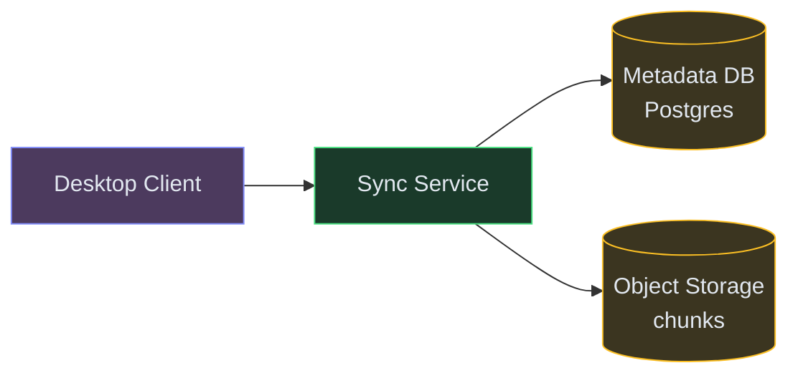
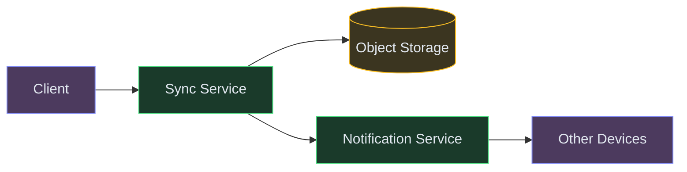
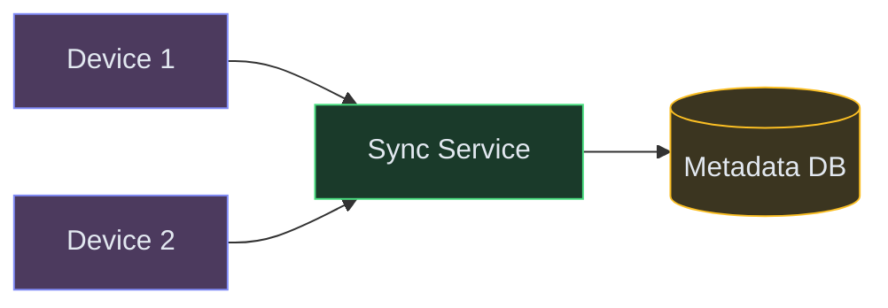

# Designing Dropbox / Cloud File Sync

**Difficulty:** Advanced
**Prerequisites:**[Object Storage](/concepts/object-storage/), [Consistent Hashing](/concepts/consistent-hashing/), and [Message Queues](/concepts/message-queues/)

---

## Understanding the Problem

A cloud file storage service lets users upload files, sync them across devices, share them with others, and access version history. The hard engineering problems: syncing a 4GB video edit without re-uploading the entire file (delta sync), handling two people editing the same file offline simultaneously (conflict resolution), and storing petabytes of data cost-efficiently while keeping metadata lookups fast.

---

## Naive First Cut


Why this breaks:
- Uploading an entire 4GB file when 1 byte changes — wastes bandwidth and time
- Single file server has finite storage and is a SPOF
- No deduplication — 1000 users uploading the same PDF stores 1000 copies
- Two devices editing the same file offline → last upload silently overwrites the other
- No way to notify other devices that a file changed (polling is wasteful)

---

## Functional Requirements

### Core (top 3)
1. **Upload and sync files** — changes on one device appear on all linked devices within seconds
2. **Delta sync** — only transfer the parts of a file that changed
3. **Conflict resolution** — handle simultaneous edits to the same file gracefully

### Below the Line
- File sharing with permissions, version history/restore, full-text file search, team folders, selective sync

---

## Non-Functional Requirements

- **Sync latency** — changes propagate to other devices within 10 seconds
- **Bandwidth efficiency** — delta sync reduces transfer by 90%+ for large file edits
- **Scale** — 500M files, 100TB+ total storage, 50K concurrent syncs
- **Durability** — 99.999999999% (11 nines); no file is ever lost

---

## Core Entities

- **File** — path, size, content hash, version number, owner
- **Chunk** — fixed-size block (4MB) of a file, identified by content hash
- **FileVersion** — snapshot: file path, ordered list of chunk hashes, timestamp
- **SyncEvent** — notification: file path, change type (create/modify/delete), device ID

---

## API

```text
POST /v1/files/upload
  Body: { path, chunks: [{ index, hash, data }] }
  Response: { fileId, version: 7, chunksStored: 3, chunksDeduped: 12 }

GET /v1/files/sync?since=version_6&deviceId=laptop_1
  Response: [{ path, changeType, version, chunkHashes }]

GET /v1/files/{fileId}/versions
  Response: [{ version, timestamp, size, author }]
```

---

## High-Level Design

### FR1: Upload and Sync

The client splits files into fixed-size chunks, hashes each chunk, and uploads only chunks the server doesn't already have (deduplication). The Metadata Service tracks which chunks compose each file version.



### FR2: Delta Sync

When a file changes, the client re-chunks and hashes. Only chunks with new hashes (not on server) are uploaded. For other devices, only the changed chunks are downloaded.



### FR3: Conflict Resolution

When two devices modify the same file offline, the second sync detects a version conflict (expected parent version doesn't match server's current). The system keeps both versions and lets the user resolve.



---

## Deep Dives

### Deep Dive 1: Chunking strategy for efficient delta sync

**Bad:** Fixed-size chunks (e.g., 4MB boundaries). Insert 1 byte at the start of the file → every chunk boundary shifts → all chunks have new hashes → entire file re-uploaded. Delta sync is useless.

**Good:** Content-defined chunking (CDC). Use a rolling hash (Rabin fingerprint) to find chunk boundaries based on content, not fixed positions. An insertion only affects the chunk containing the edit — all other chunks keep their original hashes. Typical savings: 95%+ bandwidth reduction for small edits to large files.

**Great:** Combine CDC with a minimum/maximum chunk size (e.g., 512KB–8MB). This prevents pathological cases (tiny chunks from repetitive data, or giant chunks from random data). For very small files (<1MB), skip chunking entirely and upload as a single block. This gives the best trade-off between deduplication ratio and metadata overhead.

### Deep Dive 2: Notification — how other devices learn about changes

**Bad:** Each device polls the server every 5 seconds asking "anything new?" At 100M devices, that's 20M requests/second even when nothing changed. Wasteful.

**Good:** Long-polling. Device opens a connection, server holds it until there's a change (or timeout at 60s). Change arrives → server responds immediately → device re-opens. Reduces idle traffic by 99%.

**Great:** WebSocket for active devices + push notification for sleeping ones. Active devices maintain a persistent WebSocket connection — server pushes sync events instantly. Mobile devices or closed laptops get a lightweight push notification (APNs/FCM) that wakes the sync client. Combined with a per-user event queue (ordered list of changes since last sync), devices that were offline catch up by draining their queue on reconnect.

### Deep Dive 3: Deduplication across users

**Bad:** Store every chunk independently. 1000 users upload the same 10MB presentation → 10GB stored. At petabyte scale, this multiplies storage costs by 5-10x.

**Good:** Content-addressable storage. Each chunk is stored by its hash (SHA-256). Before uploading, client sends the hash; server checks if it already exists. If yes, just reference it — no data transfer needed. This deduplicates across all users globally.

**Great:** Same approach, plus reference counting for garbage collection. Each chunk has a ref count. When a user deletes a file, decrement refs for its chunks. When ref count hits zero, schedule chunk deletion (with a grace period for undo). For security, encrypt chunks with per-user keys so the server can deduplicate by hash but can't read content (convergent encryption: key = hash of plaintext).

---

## What's Expected at Each Level

| Level | Expectations |
|---|---|
| **Mid** | Chunking + object storage. Content hashing for dedup. Basic sync flow with version numbers. Conflict creates a "conflicted copy." |
| **Senior** | Content-defined chunking (CDC) for efficient delta sync. Long-polling/WebSocket for notifications. Reference-counted dedup. Metadata DB separate from blob storage. |
| **Staff+** | Convergent encryption for secure dedup. Per-user event queues for offline catch-up. Garbage collection with grace periods. Back-of-envelope on chunk size trade-offs (metadata overhead vs dedup ratio). |
