# Designing a Collaborative Editing Platform (Google Docs / Notion)

**Difficulty:** Advanced **Topics:** Real-Time Collaboration, OT/CRDT, WebSocket, Conflict Resolution, Presence Awareness **Asked at:** Google, Notion, Figma, Microsoft, Amazon
**Prerequisites:**[WebSockets](/concepts/websockets/) and [Consistency Models](/concepts/consistency-models/)

---

## 1. Understanding the Problem

A collaborative editing platform lets multiple users simultaneously edit the same document in real-time - seeing each other's cursors, changes appearing character-by-character as they type, without any user overwriting another's work. The hard part? When two users type at the same position in the same millisecond, you need a deterministic way to merge both changes without data loss, all while maintaining sub-100ms latency so typing feels instant.

---

## 1.5. Naive First Cut

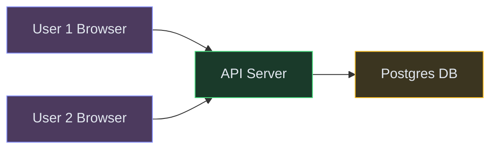

| Color | Meaning |
|---|---|
| 🟠 Purple-Orange | Client apps |
| 🔵 Blue | Edge / Gateway |
| 🟢 Green | Backend services |
| 🟡 Yellow | Data stores |
| 🟣 Purple | Async (Kafka / Pub/Sub) |
| 🔴 Pink | External services |


**How this breaks:**

- Last-write-wins in Postgres means User 1's edits silently disappear when User 2 saves - data loss
- No way to push changes to other users in real-time - polling every second is too slow and wasteful
- Storing the full document on every keystroke creates massive write amplification (100 chars/min × millions of docs)
- No conflict resolution - concurrent edits at the same position produce garbled text
- Single API server can't maintain persistent connections for millions of active editors
- No presence awareness - users have no idea others are editing, leading to conflicting sections

The rest of the doc evolves this into a production-grade real-time collaborative editing system using operational transforms and persistent WebSocket connections.

---

## 1.7. Prior Art We're Drawing From

- **Google Wave OT** - Pioneered Operational Transformation for real-time collaborative editing. Jupiter protocol with a central server that transforms concurrent operations to maintain consistency. ([Google Research](https://svn.apache.org/repos/asf/incubator/wave/whitepapers/operational-transform/operational-transform.html))
- **Figma CRDT** - Uses a custom CRDT (Conflict-free Replicated Data Type) for multiplayer design editing with no central coordination for conflict resolution. Demonstrated CRDTs can work at scale with structured documents. ([Figma Engineering Blog](https://www.figma.com/blog/how-figmas-multiplayer-technology-works/))
- **Yjs** - Open-source CRDT framework used by Notion, JupyterLab, and others. YATA algorithm for text sequences with O(1) amortized insertion and efficient encoding. ([Yjs GitHub](https://github.com/yjs/yjs))
- **Automerge** - Research CRDT library that treats documents as mergeable JSON structures. Demonstrates how CRDTs handle offline editing and eventual convergence. ([Ink and Switch](https://automerge.org/))
- **Google Docs Jupiter Protocol** - Server-mediated OT where each client sends operations to a central server that transforms and broadcasts them. Single point of serialization ensures total ordering. ([Operational Transformation FAQ](https://operational-transformation.github.io/))

---

## 2. Functional Requirements

### Core (Top 3)

1. **Real-time collaborative editing** - multiple users type simultaneously in the same document with changes appearing within 100ms for all participants
2. **Document storage and retrieval** - create, open, and save documents; persist all content durably
3. **Version history** - view previous versions of a document, restore any earlier state, see who made what changes

### Below the Line

- Rich text formatting (bold, italic, headings, lists)
- Comments and suggestions (track changes)
- Offline editing with sync on reconnect
- Access control and sharing permissions
- Real-time presence indicators (cursors, selections)
- Document templates and search

---

## 3. Non-Functional Requirements

### Core

| NFR | Target |
|---|---|
| **Edit propagation latency** | < 100ms from one user's keystroke to appearing on another user's screen |
| **Consistency** | Eventual consistency - all users converge to the same document state regardless of operation order |
| **Availability** | 99.99% - document editing must never be "down" during work hours |
| **Scale** | Support 100M+ documents with up to 50 concurrent editors per document |

### Below the Line

- Version history retained for 30+ days
- Document size up to 1M characters
- Support 10M+ daily active users across all documents
- Sub-second document open time (cold start)

## Scale Estimation (Back-of-Envelope)

- **Users:** 100M DAU, 5M concurrent editing sessions at peak
- **Write QPS:** 10K ops/sec per popular document, 500M total ops/sec across all documents
- **Read QPS:** 50K document opens/sec (initial state load + presence sync)
- **Storage:** ~10TB document storage (500M documents × avg 20KB per document + version history)
- **Bandwidth:** ~100 Gbps WebSocket traffic for real-time operation broadcast

---

## Technology Choices

| Tier | Purpose | Stores | Access Pattern | Primary | Alternatives |
|---|---|---|---|---|---|
| Document Store | Persistent document content | Full document snapshots + metadata | Read/write by docId | Postgres (or Spanner) | CockroachDB, TiDB |
| Operation Log | Ordered stream of edit operations | Insert/delete ops with position and version | Append-only, read by docId + version range | Cassandra (or DynamoDB) | ScyllaDB, FoundationDB |
| Real-time Relay | Push operations to connected editors | WebSocket messages | Fan-out per document session | WebSocket Gateway + Redis Pub/Sub | SSE, gRPC streaming |
| Presence Cache | Active cursors and selections | userId, cursor position, color | High-QPS reads/writes, TTL-based | Redis Cluster | Memcached |
| Event Bus | Async events (save, snapshot, version) | Document lifecycle events | Pub/sub per document | Kafka or Redpanda | Kinesis, Pub/Sub |
| Object Store | Version snapshots and exports | Document snapshots, PDF exports | Batch writes, occasional reads | S3 | GCS, MinIO |
| Search Index | Full-text document search | Document titles and content | Text search by user | Elasticsearch | Typesense, Meilisearch |

**Why a central OT server, not pure CRDT?**
Pure CRDTs (like Yjs or Automerge) work great for peer-to-peer scenarios and offline editing. But for a Google Docs-style product where we need a canonical server-side version, fine-grained access control, and version history, server-mediated OT gives us a single serialization point. This makes snapshotting, permissions, and undo/redo simpler. The tradeoff: the server is on the critical path for every operation. We mitigate this with per-document sharding.

**Why Cassandra for the operation log?**
Operations are append-only and partitioned by documentId. We need fast sequential reads (replay ops from version X to Y) and high write throughput. Cassandra's partition-key based access and LSM storage handle this naturally. We never update or delete individual operations.

---

## 4. Core Entities

- **Document** - id, title, owner, permissions, current version number, created/updated timestamps
- **Operation** - documentId, version number, userId, type (insert/delete), position, content, timestamp
- **Session** - documentId, userId, WebSocket connection reference, cursor position, selection range
- **Version Snapshot** - documentId, version number, full document content, timestamp (periodic checkpoint)
- **User** - id, name, email, avatar, color assignment for presence

---

## 5. API / System Interface

```text
POST /api/v1/documents
  Body: { title, content?: "" }
  Response: { documentId, version: 0, createdAt }
  Auth: JWT Bearer token
  Note: Creates an empty document

GET /api/v1/documents/{docId}
  Response: { documentId, title, content, version, collaborators[] }
  Auth: JWT Bearer token
  Note: Returns latest snapshot + any pending ops after snapshot

WebSocket /ws/v1/documents/{docId}/edit
  Client sends: { type: "op", ops: [{ type: "insert", pos: 12, content: "hello" }], version: 42 }
  Server broadcasts: { type: "op", ops: [...transformed...], userId, version: 43, serverTimestamp }
  Client sends: { type: "cursor", pos: 17, selectionEnd?: 25 }
  Server broadcasts: { type: "presence", userId, name, color, pos, selectionEnd }
  Auth: JWT ticket in connection params

GET /api/v1/documents/{docId}/history
  Query: ?fromVersion=1&toVersion=100
  Response: { versions: [{ version, userId, timestamp, summary }] }
  Auth: JWT Bearer token

POST /api/v1/documents/{docId}/restore
  Body: { targetVersion: 42 }
  Response: { documentId, newVersion: 101, content }
  Auth: JWT Bearer token (owner/editor only)
```

---

## 6. High-Level Design

### FR1: Real-Time Collaborative Editing

The core challenge: when User A inserts "hello" at position 5 and User B simultaneously deletes character at position 3, the positions shift. Without transformation, User A's insert lands at the wrong spot. We need Operational Transformation (OT) to adjust positions based on concurrent operations.

**In simple terms:** Two people type in the same document at the same time. Alice inserts a word at position 5, Bob deletes a character at position 3. Without coordination, the positions get messed up and text corrupts.

**New components we need:**

1. **API Gateway** - Entry point for HTTP requests (document CRUD). Handles auth and routing.
2. **WebSocket Gateway** - Maintains persistent connections with all active editors. One connection per user per document.
3. **Collaboration Service** - The brain. Receives operations from clients, transforms them against concurrent ops using OT, assigns version numbers, and broadcasts to all participants.<br>💡 *Operational Transformation (OT) = an algorithm that adjusts the position/content of an operation based on other operations that happened concurrently. If User B deletes char at pos 3, User A's insert at pos 5 becomes an insert at pos 4.*
4. **Operation Log (Cassandra)** - Append-only log of every operation, partitioned by documentId. Used for replaying history and conflict resolution.
5. **Redis Pub/Sub** - Routes transformed operations to the correct WebSocket Gateway instance holding each collaborator's connection.

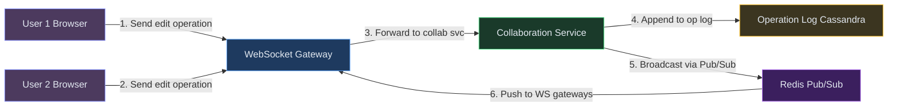


**Step-by-step flow:**

1. User 1 types "hello" at position 12 → client generates operation `{type: "insert", pos: 12, content: "hello", clientVersion: 42}`
2. Operation sent over WebSocket to WebSocket Gateway → forwarded to Collaboration Service
3. Collaboration Service checks: is clientVersion == server's current version for this doc? If yes, operation applies directly. If not (concurrent edits happened), transform the operation against all ops between clientVersion and current server version.
4. Transformed operation is assigned the next server version (43), appended to Operation Log in Cassandra
5. Collaboration Service publishes transformed op to Redis Pub/Sub channel `doc:{docId}:ops`
6. WebSocket Gateway instances subscribed to that channel receive the op and push it to all connected clients (except the author, who gets an ACK instead)
7. Each client applies the transformed operation to their local document state

**Why not just broadcast the raw operation?**

If User 1 is at version 42 and User 2 sends an op based on version 41, User 1 needs to see User 2's op transformed against the operation that took version 41 → 42. The server does this centrally so each client always receives operations that can be applied directly to their current state.

---

### FR2: Document Storage and Retrieval

Documents need to be persisted durably so users can close the browser and come back later. But we can't write the full document to disk on every keystroke - that's 5-10 writes per second per active document. Instead, we store operations and periodically create snapshots.

**In simple terms:** You're typing in Google Docs. Every keystroke needs to be saved, but writing the full document to disk 10 times per second is too expensive. We need a smarter approach.

**New components we need:**

1. **Document Service** - Handles document CRUD (create, open, list, delete). Responsible for assembling the current document state from snapshot + recent operations.
2. **Snapshot Service** - Periodically compacts the operation log into a full document snapshot. Without snapshots, opening a document with 100K operations would require replaying all of them.
3. **Document DB (Postgres)** - Stores document metadata (title, owner, permissions, current version, latest snapshot version).

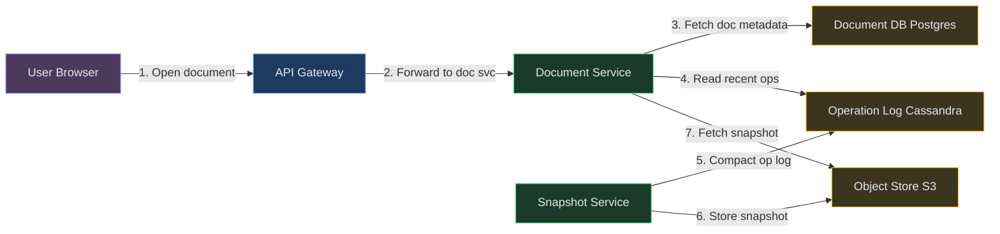

**Step-by-step flow:**

1. User opens a document → GET request hits Document Service
2. Document Service reads metadata from Postgres: `{docId, title, latestSnapshotVersion: 950, currentVersion: 987}`
3. Fetches the snapshot at version 950 from S3 (full document content at that point)
4. Reads operations 951-987 from Cassandra (only 37 ops to replay, not the entire history)
5. Applies those 37 operations to the snapshot → produces current document state
6. Returns assembled document to user, establishes WebSocket connection for live editing
7. Meanwhile, Snapshot Service runs periodically (every 100 operations or 5 minutes): reads all ops since last snapshot, applies them, writes new snapshot to S3, updates Postgres with new snapshot version

**Why snapshot + operation log, not just store the full document?**

Two reasons. First, writing the full document on every keystroke would be 5-10 Postgres writes/sec per active document - unsustainable at scale. Operations are tiny (insert 3 chars at pos 12) and append-only, which Cassandra handles trivially. Second, the operation log IS the version history. Every keystroke is preserved, enabling fine-grained undo and time-travel.

---

### FR3: Version History

Users need to see what the document looked like at any point in the past, who made changes, and restore earlier versions. This is built directly on top of the operation log.

**In simple terms:** Your boss asks 'what did this document say last Tuesday?' We need version history without storing a complete copy of the document for every single keystroke.

**New components we need:**

1. **History Service** - Reads the operation log and reconstructs document state at any historical version. Groups operations into logical "sessions" for a human-readable change timeline.
2. **Change Summarizer** - Groups individual character operations into meaningful change descriptions ("User A added paragraph about pricing" rather than 847 individual insert operations).

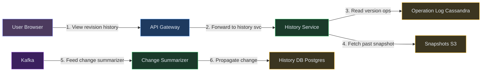

**Step-by-step flow:**

1. User clicks "Version History" → GET /documents/{docId}/history
2. History Service reads the pre-computed change summaries from History DB: grouped by user session (a session = continuous editing by one user without 5+ minutes of inactivity)
3. User selects a specific version (e.g., version 450) → History Service fetches nearest snapshot before 450 (say version 400 from S3)
4. Replays operations 401-450 from Cassandra → produces exact document state at version 450
5. Returns this reconstructed document to the UI for preview
6. If user clicks "Restore": a new operation is created that replaces current content with the historical state, increments version, broadcasts to all active editors

**Change Summarizer (async):**

- Listens to Kafka topic `doc.operations`
- Batches operations by (userId + 5-minute inactivity gap) into "change sessions"
- Produces summaries: "User A edited lines 45-52" or "User B deleted 3 paragraphs"
- Stores in History DB for fast timeline rendering

---

## 6.5. Core Flows

### Flow 1: Concurrent Edit with OT Resolution

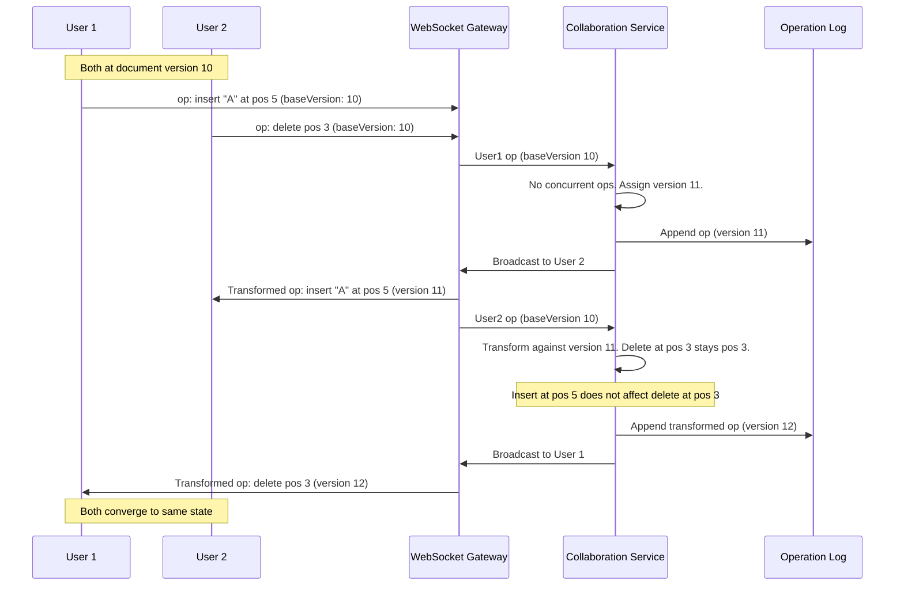

**Walk-through:**

1. Both users start at version 10 of the document
2. User 1 inserts "A" at position 5 - arrives at server first, gets version 11 directly (no transformation needed since it's based on the current version)
3. User 2's delete at position 3 arrives based on version 10, but server is now at version 11. Server transforms it against version 11's operation (insert at pos 5). Since the delete is at pos 3 and the insert was at pos 5, the delete position is unaffected - stays at pos 3
4. Both users converge: the document has "A" inserted at pos 5 AND character at pos 3 deleted

**Non-obvious failure path:** What if the Collaboration Service crashes mid-transform? The operation was never assigned a version number, so the client will timeout and retry. Operations are idempotent (same content + same base version = same transform). The client retries with the same baseVersion, and the server re-processes it.

### Flow 2: Document Open with Snapshot Reconstruction

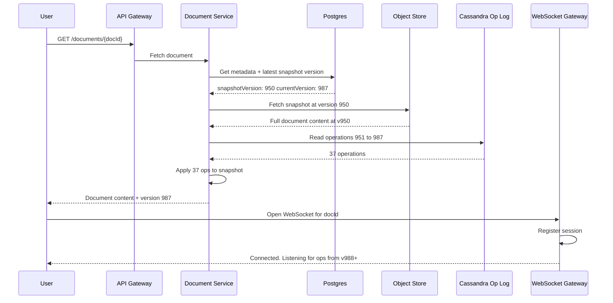

**Non-obvious failure path:** What if a snapshot is corrupted in S3? The Document Service falls back to the previous snapshot (version 850) and replays 100 more operations (851-987). Slower, but guarantees correctness. If ALL snapshots are lost, the service can rebuild from operation 0 - the op log is the source of truth.

### Document Session State Machine

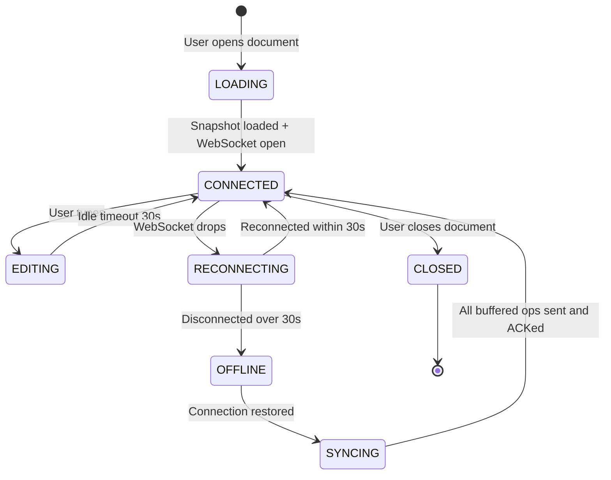

Each transition: EDITING buffers operations locally and sends over WebSocket. RECONNECTING queues new operations client-side. SYNCING replays all buffered operations to the server with proper base versions for OT resolution.

---

## 7. Deep Dives

### Deep Dive 1: OT vs CRDT - Conflict Resolution Strategy

**Problem:** Two users edit the same position simultaneously. Without conflict resolution, one user's changes are lost or the document becomes garbled.

**Bad:** Last-write-wins (LWW). Overwrite the document with whoever saved last. Simple, but any concurrent edit is lost. Completely unacceptable for collaborative editing.

**Good:** Lock-based editing. Lock paragraphs or sections while a user is editing them. Prevents conflicts but destroys the real-time collaboration experience - users see "section locked by User B" instead of fluid typing.

**Great:** Server-mediated Operational Transformation using the Jupiter/dOPT protocol. (Borrowing from Google Wave and Google Docs.)

**In simple terms:** When two users type at the same time, their edits might conflict (User A inserts at position 5, User B deletes at position 3 — now position 5 is wrong). The server "transforms" each operation based on what happened before it, so both users end up with the same correct document.

**How OT works:**

The core OT algorithm maintains a server version counter and transforms each incoming operation against all operations that happened between the client's base version and the server's current version.

```text
Transform rules for text operations:
- insert(pos, char) vs insert(pos2, char2):
    if pos < pos2: insert stays at pos (the other insert is after us)
    if pos > pos2: insert shifts to pos+1 (the other insert pushed us right)
    if pos == pos2: break tie by userId (deterministic)

- insert(pos, char) vs delete(pos2):
    if pos <= pos2: insert stays at pos
    if pos > pos2: insert shifts to pos-1 (the deleted char pulled us left)

- delete(pos) vs insert(pos2, char):
    if pos < pos2: delete stays at pos
    if pos >= pos2: delete shifts to pos+1

- delete(pos) vs delete(pos2):
    if pos < pos2: delete stays at pos
    if pos > pos2: delete shifts to pos-1
    if pos == pos2: delete becomes no-op (already deleted)
```

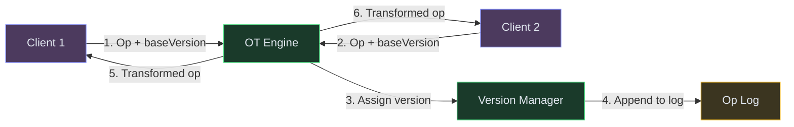

**Why OT over CRDT for this use case?**

| Factor | OT (Server-mediated) | CRDT (Decentralized) |
|---|---|---|
| Server involvement | Required (single serialization point) | Optional (peers can sync directly) |
| Version history | Trivial (linear version chain) | Complex (DAG of causal versions) |
| Undo/redo | Simple (reverse the operation) | Hard (tombstones, causal dependencies) |
| Memory overhead | Low (operations are tiny) | Higher (tombstones never deleted) |
| Offline support | Harder (need server to transform) | Native (merge on reconnect) |
| Correctness proof | Well-understood (25+ years) | Newer (still evolving for rich text) |

For a Google Docs-like product with always-online users, centralized permissions, and strong version history needs, OT wins on simplicity. If we needed peer-to-peer or offline-first (like a note-taking app), CRDT would be the choice.

---

### Deep Dive 2: Real-Time Sync via WebSocket at Scale

**Problem:** 10M concurrent users editing documents. Each user has a persistent WebSocket connection. Operations must be routed from the Collaboration Service to the exact WebSocket Gateway instance holding each user's connection.

**Bad:** Single WebSocket server for everyone. Can't scale past ~100K connections per instance (file descriptors, RAM for buffers). Single point of failure.

**Good:** Multiple WebSocket Gateway instances behind a load balancer with sticky sessions. Works, but: when the Collaboration Service produces a transformed operation, how does it know which gateway instance holds User 2's connection?

**Great:** WebSocket Gateway fleet + Redis Pub/Sub for last-mile routing + connection registry.

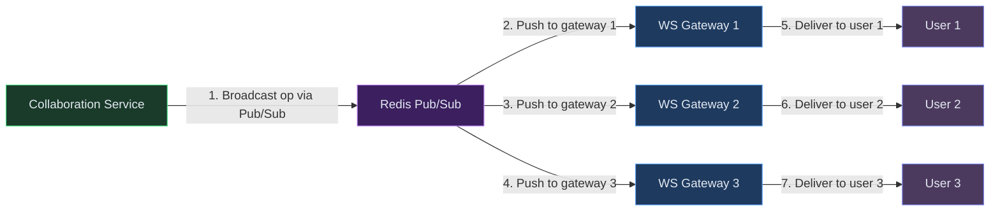

**Mechanism:**

1. When a user connects via WebSocket, the Gateway registers `(docId, userId) → gatewayInstanceId` in Redis
2. Gateway subscribes to Redis Pub/Sub channel `doc:{docId}:ops`
3. When Collaboration Service produces a transformed op, it publishes to `doc:{docId}:ops` channel
4. Only gateways with users in that document are subscribed → they receive the op and push to connected users
5. Each gateway instance handles ~100K connections. 100 instances = 10M concurrent users

**Connection handling:**

- **Heartbeat:** Client sends ping every 30 seconds. If server receives no ping for 60 seconds, connection is considered dead - clean up session.
- **Reconnection:** Client stores last received version. On reconnect, sends `{resumeFrom: lastVersion}`. Server replays any missed operations from the op log.
- **Graceful shutdown:** When a gateway instance is being drained (deploy), it sends a `REDIRECT` message to all connected clients with a new gateway URL. Clients reconnect within 5 seconds - zero downtime deploys.

**Scaling math:** At 10M concurrent users editing 2M documents, average 5 users per document. Each document channel has 5 subscribers. Redis Pub/Sub handles ~1M messages/sec per node. With 500 ops/sec per document × 2M documents = 1B messages/sec total → need 1000 Redis Pub/Sub shards partitioned by docId. In practice, only 10% of documents are actively being edited at any moment, so ~100 shards suffice.

---

### Deep Dive 3: Version History and Efficient Undo

**Problem:** A document with 100K edits over 6 months. User wants to see "what did this look like last Tuesday?" Replaying 100K operations from scratch takes seconds - too slow for an interactive timeline.

**Bad:** Store the full document on every save (Ctrl+S). Massive storage waste (1MB doc × 1000 saves = 1GB per doc). Also misses all the changes between saves.

**Good:** Store every operation and replay from the start. Accurate but slow for old documents. Opening version 500 of a 100K-operation doc requires replaying 500 ops from version 0.

**Great:** Periodic snapshots + operation segments. (Borrowing from event sourcing best practices.)

**Mechanism:**

1. Every 100 operations (or every 5 minutes of activity), create a snapshot: serialize the full document state, store in S3 with version tag
2. To reconstruct any version V: find the nearest snapshot before V, replay only the operations between that snapshot and V
3. Worst case: replay 99 operations (not 100K)
4. Snapshots are immutable - old ones are never deleted (they serve as checkpoints in version history)

**Undo implementation:**

- **Local undo (before ACK):** Client reverses its own pending operation locally. Trivial.
- **Collaborative undo (after ACK):** Cannot simply reverse the operation because other users' ops may have been applied since. Instead: generate an **inverse operation** and send it as a new operation through OT. Example: undo of `insert("hello", pos 5)` = `delete(5 chars at pos 5)`. This inverse op goes through the full OT pipeline, getting transformed against any concurrent operations.
- **Undo stack per user:** Each user has their own undo stack. Undoing User A's last edit doesn't affect User B's edits.

**Storage efficiency:**

- Operations are tiny: average 20-50 bytes each (type + position + 1-5 chars)
- 100K operations for a 6-month document ≈ 5MB in Cassandra
- Snapshots: one every 100 ops × 100K ops = 1000 snapshots × 1MB each = 1GB in S3
- Total per document: ~1GB for a heavily edited doc over 6 months. With S3 tiering (Glacier after 30 days), cost is negligible.

---

### Deep Dive 4: Scaling to Millions of Concurrent Documents

**Problem:** 2M documents being actively edited simultaneously. Each document needs its own OT state (current version, pending transforms). How do we shard the Collaboration Service?

**Bad:** Single Collaboration Service instance handling all documents. Memory for 2M document states × OT buffers = too much. Single point of failure.

**Good:** Shard by docId using consistent hashing across N Collaboration Service instances. Each instance owns a subset of documents. Works until an instance crashes - those documents become unavailable.

**Great:** Consistent hash ring with virtual nodes + stateless OT workers backed by Redis for document state.

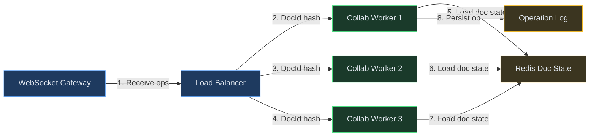

**Mechanism:**

1. Each document is assigned to a Collaboration Worker via consistent hashing on docId
2. The worker's OT state for each document (current version, last N ops for transform buffer) lives in Redis, not in-process memory
3. When a worker receives an operation: reads doc state from Redis, transforms, writes new version + op atomically (Redis transaction / Lua script), publishes to Pub/Sub
4. If a worker crashes: any other worker can pick up the document because state is in Redis, not local memory
5. Rebalancing: add a new worker node to the hash ring → it takes ownership of some docIds → reads their state from Redis → starts processing immediately

**Why Redis for OT state and not just Cassandra?**

The OT transform operation needs atomic read-modify-write: "read current version, transform against recent ops, increment version, write new op." This must be serialized per document. Redis single-threaded execution + Lua scripts give us this atomicity. Cassandra doesn't support atomic read-then-write.

**Handling hot documents (50+ concurrent editors):**

- A viral document with 50 editors generates 50 ops/sec. Each op requires transform against the last ~10 operations = manageable.
- If a single document exceeds 200 ops/sec (unlikely in text editing), the worker can batch operations in 50ms windows and transform them together before broadcasting.

---

### Deep Dive 5: Presence and Cursor Tracking

**Problem:** Users need to see each other's cursors and selections in real-time. With 50 users in a document, each moving their cursor on every keystroke, that's 50 × 5 cursor updates/sec = 250 messages/sec just for presence.

**Bad:** Broadcast every cursor movement to all users immediately. 250 messages/sec × 50 recipients = 12,500 messages/sec for one document. Wasteful - cursor positions between keystrokes are irrelevant.

**Good:** Throttle cursor updates to 1 per 100ms per user. Reduces to 50 × 10/sec × 50 = 25K messages/sec per hot document. Still heavy.

**Great:** Throttled cursor updates + position transformation + server-side aggregation.

**Mechanism:**

1. Client throttles cursor position sends to every 200ms (5 updates/sec per user max)
2. Cursor positions are sent as document positions (character offset), not screen coordinates
3. When other users' operations shift text, the server transforms all active cursor positions using the same OT rules (cursor at pos 10 shifts to pos 11 after an insert at pos 5)
4. Server batches all cursor positions for a document every 200ms and sends one aggregated presence update to all users: `{cursors: [{userId: "A", pos: 12, color: "#ff6b6b"}, {userId: "B", pos: 45, selection: [45,60], color: "#4ecdc4"}]}`
5. Presence data stored in Redis with 10-second TTL. If no update in 10 seconds, cursor disappears (user left or went idle)

**Color assignment:** Each user gets a deterministic color based on a hash of their userId from a predefined palette of 12 high-contrast colors. Consistent across sessions.

---

## 7.5. Design Self-Audit

| Question | Answer |
|---|---|
| Dedicated search index? | Yes - Elasticsearch for full-text document search by title and content. Indexed asynchronously via Kafka on document save events |
| Stale reads after writes? | After typing, your own changes appear instantly (optimistic local apply). Other users see changes within 100ms via WebSocket push. Acceptable. |
| Single points of failure? | Redis doc state has replicas with auto-failover. Collaboration workers are stateless (state in Redis). Cassandra op log uses RF=3. |
| Dead-letter / reconciliation? | Failed snapshot jobs go to DLQ and retry. If a client's op is rejected (version mismatch), client rebases and retries automatically. Orphaned sessions (no heartbeat > 60s) are cleaned by a sweeper. |
| Data freshness across caches? | Cursor presence TTL = 10s (stale cursors auto-disappear). Document metadata cache TTL = 30s. Op log is source of truth - no cache invalidation needed. |
| Cost at scale? | Redis (OT state + Pub/Sub): 20 shards × r6g.large ≈ $4000/month. Cassandra op log (RF=3): 12 nodes ≈ $6000/month. WebSocket Gateways (100 instances): $10K/month. S3 snapshots: $500/month. Total hot-path: ~$21K/month for 10M DAU. |

---

## 8. Final Architecture

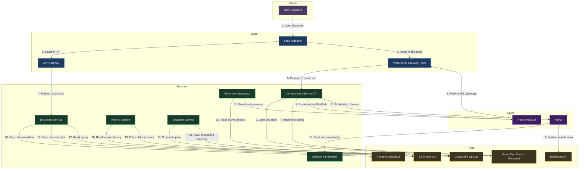

**How it works end-to-end:**

1. **User opens document** — browser connects via Load Balancer to WebSocket Gateway for real-time sync
2. **User types an edit** — operation sent over WebSocket to Collaboration Service (OT engine)
3. **OT transforms and applies** — Collaboration Service checks Redis Doc State for current version, transforms against concurrent ops
4. **Operation persisted** — written to Cassandra Op Log as an immutable event
5. **Broadcast to collaborators** — transformed op published via Redis Pub/Sub to all WebSocket Gateway instances holding active editors
6. **Periodic snapshot saved** — Snapshot Service compacts the op log into a full document snapshot stored in S3
7. **Async indexing and summarization** — Kafka carries events to Change Summarizer (version history labels) and Elasticsearch (full-text search)
8. **Presence tracked** — Presence Aggregator maintains cursor positions in Redis, broadcast via Pub/Sub for live cursor indicators

---

*Want a deep dive on rich text OT (formatting operations), offline editing with CRDT fallback, or access control for shared documents? Drop a comment below 👇*

---

## Key Technologies Mentioned

| Term | What it is |
|---|---|
| **Operational Transformation (OT)** | Algorithm that adjusts concurrent edit positions so multiple users' changes merge without conflicts or data loss. |
| **CRDT** | Conflict-free Replicated Data Type - a data structure that converges to the same state across replicas without coordination; used in peer-to-peer/offline-first editors. |
| **WebSocket** | Persistent bidirectional connection between client and server enabling sub-100ms operation push to all collaborators. |
| **Kafka** | Event bus used for async document lifecycle events (snapshots, version summaries, change notifications). |
| **Redis Pub/Sub** | In-memory publish/subscribe messaging used to route transformed operations to the correct WebSocket Gateway instance holding each user's connection. |
| **Postgres** | Relational DB storing document metadata, permissions, and snapshot version pointers with ACID guarantees. |
| **Version Vector** | Data structure tracking the latest version each client has seen, enabling the server to identify which operations need transformation on arrival. |

---

## What's Expected at Each Level

> This section helps you calibrate your depth. You don't need to cover everything - just know what's expected for your level.

### Mid-level

Understand the core problem - multiple users editing the same document simultaneously. Propose a server that broadcasts changes to all connected clients via WebSocket. With prompting, recognize that conflicts arise when edits overlap and that naive "last writer wins" destroys data.

### Senior

Explain OT (Operational Transformation) or CRDT for conflict resolution - articulate how concurrent operations are transformed to maintain consistency. Propose WebSocket for real-time sync. Discuss cursor/presence indicators, document versioning, and how to handle offline edits that merge on reconnect using buffered operations.

### Staff+

Compare OT vs CRDT trade-offs at scale (OT needs a central server for linear ordering, CRDT is peer-to-peer but has larger payloads and tombstone overhead). Discuss undo/redo in collaborative context (transforming undo against concurrent operations), document permissions model with real-time access revocation, and how Google scales this to millions of concurrent docs with strong consistency per document using per-document session processes.

---
## 🎯 Key Takeaways

- **Operational Transform (OT)** resolves concurrent edits by transforming positions
- **Server-mediated OT** gives linear version history - simpler than CRDT for online editing
- **Snapshot + operation log** avoids writing full document on every keystroke
- **Redis Pub/Sub** routes operations to the correct WebSocket gateway

---
## Related Designs
- [Chat System (WhatsApp)](/hld/ChatSystem) - similar WebSocket fan-out, presence tracking
- [Notification System](/hld/NotificationSystem) - multi-channel push delivery
- [Stock Broker (Robinhood)](/hld/StockBroker) - event sourcing, ordered operations


---

## Related Concepts

Understand the building blocks used in this design:

- [WebSockets vs SSE →](/concepts/websockets/) — carry real-time collaborative edits and presence between clients
- [Consistency Models →](/concepts/consistency-models/) — how concurrent edits eventually converge via OT or CRDT
- [Event Sourcing & CQRS →](/concepts/event-sourcing/) — the ordered stream of edit operations is the document's source of truth
