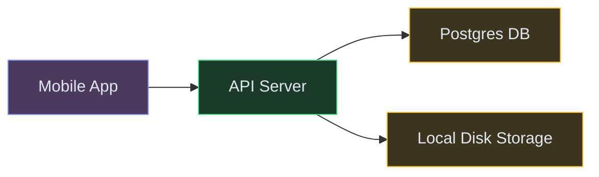
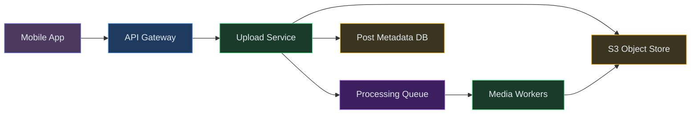
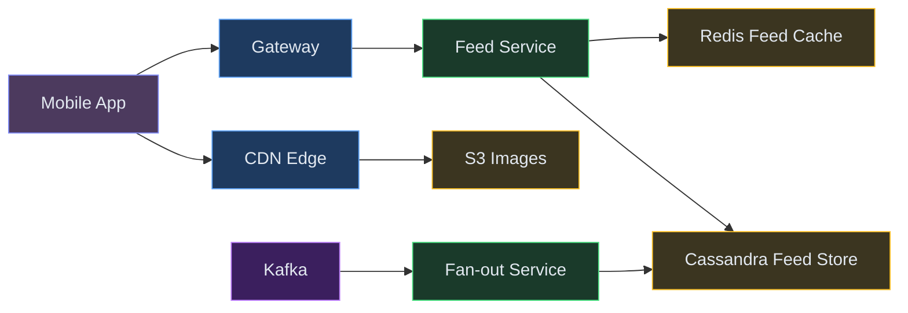
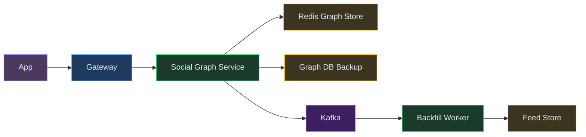
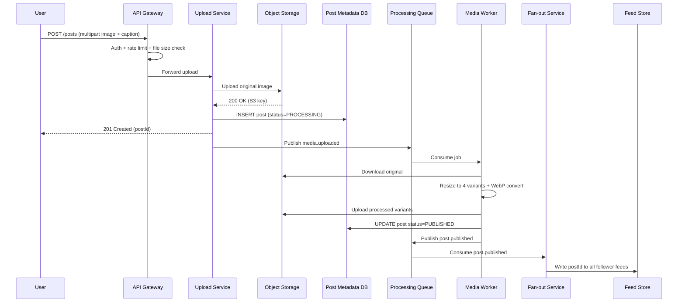
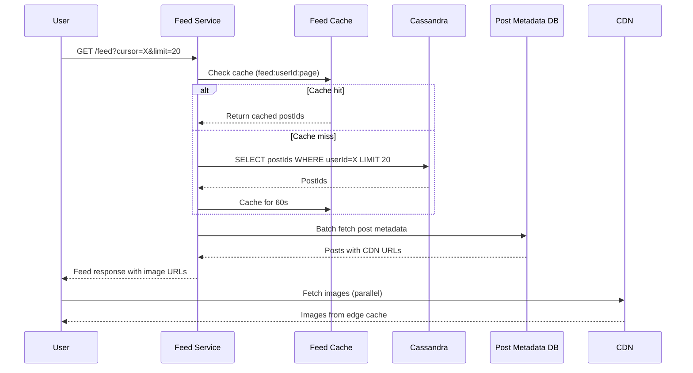
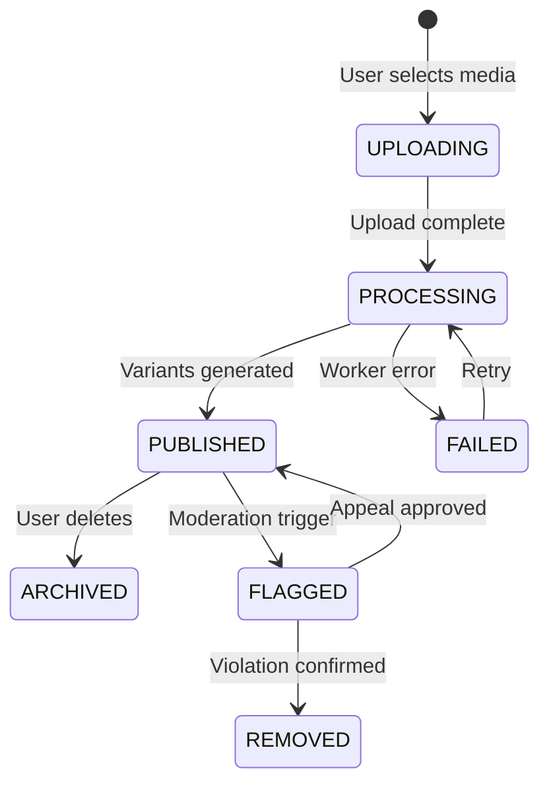
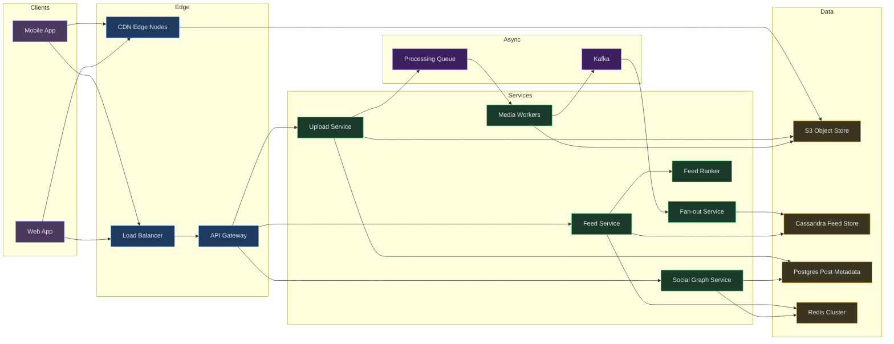

# Designing Instagram / Pinterest - Photo Sharing Platform

⚡ **Difficulty:** Intermediate 🏷️ **Topics:** CDN, Object Storage, Fan-out, Media Processing, Feed Ranking 🏢 **Asked at:** Meta, Pinterest, Snap, Google, Amazon
📋 **Prerequisites:** [Fundamentals](/concepts) - especially [CDN](/concepts#cdn-content-delivery-network), [Caching](/concepts#caching), and [Fan-Out Patterns](/concepts#fan-out-patterns)

---

## 1. Understanding the Problem

Instagram is a photo and video sharing platform where users upload media, follow other users, and consume a personalized feed of content. The system must handle billions of photo uploads, deliver images globally with low latency via CDN, and generate personalized feeds for hundreds of millions of users. The key challenges are: efficiently processing and storing media at scale, generating feeds without overwhelming the system, and delivering images fast regardless of user location.

---

## 1.5. Naive First Cut



| Color | Meaning |
|---|---|
| 🟠 Purple | Client |
| 🔵 Blue | Edge / Gateway |
| 🟢 Green | Service |
| 🟣 Purple | Async (Queue / Kafka) |
| 🟡 Yellow | Data store |


**How this breaks:**
- Local disk storage can't serve images globally - users in Tokyo wait 2+ seconds for images stored in US-East
- Single API server becomes bottleneck during upload spikes (New Year's Eve, live events)
- No image resizing - phones download 12MP originals on 3G connections
- Feed generation via `SELECT * FROM posts WHERE user_id IN (following) ORDER BY time` kills the DB at scale
- No caching layer - every feed request hits the database
- Celebrity posts (100M followers) create thundering herd on reads

The rest of the doc evolves this into a globally distributed media platform with CDN delivery and intelligent feed generation.

---

## 1.7. Prior Art We're Drawing From

- **Instagram Engineering (Cassandra for Feed Storage)** - Moved from Redis to Cassandra for feed storage to handle 500M+ users. Uses a hybrid fan-out approach (write for normal users, read for celebrities). ([Instagram Engineering blog](https://instagram-engineering.com/))
- **Facebook TAO (Social Graph Cache)** - Distributed graph-aware cache serving billions of queries/sec for social relationships. Demonstrates that the social graph must be cached separately from content. ([Facebook TAO paper](https://www.usenix.org/conference/atc13/technical-sessions/presentation/bronson))
- **Flickr Architecture (Image Serving)** - Pioneered the multi-tier image serving pattern: upload → process → store in object storage → serve via CDN. Proved that separating upload and serving paths is essential. ([Flickr architecture talk](https://www.slideshare.net/jallspaw/10-deploys-per-day-dev-and-ops-cooperation-at-flickr))
- **Pinterest Image Processing Pipeline** - Async image processing with multiple resolution generation, perceptual hashing for deduplication, and progressive JPEG delivery. ([Pinterest Engineering blog](https://medium.com/pinterest-engineering))
- **Twitter Fan-out Service** - Demonstrates the fan-out-on-write vs fan-out-on-read tradeoff at scale. Twitter hybrid approach handles celebrities differently from normal users.

---

## 2. Functional Requirements

### Core (Top 3)

1. **Upload photos and videos** - users can upload media with captions, apply filters, and tag locations
2. **View personalized feed** - users see a ranked feed of posts from people they follow
3. **Follow and unfollow users** - build a social graph that drives feed generation

### Below the Line

- Stories (24-hour ephemeral content)
- Direct messages
- Comments and likes
- Explore/discovery page
- Reels (short-form video)

---

## 3. Non-Functional Requirements

### Core

| NFR | Target |
|---|---|
| **Feed Latency** | Feed load < 500ms P95 globally |
| **Upload Latency** | Photo upload completes < 3 seconds (user sees confirmation) |
| **Availability** | 99.99% - users expect Instagram to always be up |
| **Scale** | 2B monthly active users, 100M+ photos uploaded daily |

### Below the Line

- Image deduplication (nice-to-have, saves storage cost)
- Multi-region disaster recovery
- Content moderation pipeline

## Scale Estimation (Back-of-Envelope)

- **Users:** 2B MAU, 500M DAU, 50M feed loads/day at peak
- **Write QPS:** 400M resize ops/day (100M photos/day × 4 variants = ~4,600 resize ops/sec sustained)
- **Read QPS:** 50M feed loads/day peak = ~580K feed reads/sec + image CDN requests
- **Storage:** ~200TB new storage/day before dedup (100M photos × 4 variants × 500KB avg)
- **Bandwidth:** ~15 Tbps at peak (500M users × avg 10 images/session × 200KB per image)

---

## Technology Choices

| Tier | Purpose | Stores | Access Pattern | Primary | Alternatives |
|---|---|---|---|---|---|
| Object Storage | Original and resized images | Raw media files (JPEG, MP4) | Write once, read many via CDN | S3 | GCS, Azure Blob |
| CDN | Global image delivery | Cached image variants | High-QPS reads, edge-cached | CloudFront or Cloudflare | Fastly, Akamai |
| Feed Store | Pre-computed user feeds | Ordered post IDs per user | Write-heavy (fan-out), sequential reads | Cassandra | ScyllaDB, DynamoDB |
| Post Metadata DB | Post details, captions, tags | Structured post data | Read-heavy, indexed queries | Postgres (sharded by user) | CockroachDB, Vitess |
| Social Graph DB | Follow relationships | Follower and following edges | High-QPS lookups (who follows whom) | Redis Cluster (adjacency sets) | Neo4j, TAO-style cache |
| Event Bus | Async processing pipeline | Upload events, feed fan-out events | Fan-out writes, ordered per user | Kafka | Redpanda, Kinesis |
| Cache | Hot feed data, user profiles | Serialized feed pages, profile JSON | High-QPS reads, TTL-based | Redis Cluster | Memcached |
| Media Processing Queue | Image resize jobs | Processing tasks | FIFO per upload | SQS or Kafka | RabbitMQ |

**Why Cassandra for the feed store, not Postgres?**
Feed reads are sequential (give me the next 20 posts) and writes are massive during fan-out (one post fans out to millions of follower feeds). Cassandra's write-optimized LSM-tree and partition-key access pattern (userId → sorted posts) is perfect. Postgres would choke on the write amplification.

**Why Redis for the social graph, not the main DB?**
"Does user A follow user B?" is called on every feed request, every like, every comment. At 2B users, this needs sub-millisecond latency. Redis SET operations (`SISMEMBER`) answer this in microseconds.

---

## 4. Core Entities

- **User** - profile info, follower count, following count, settings
- **Post** - media URL, caption, location, timestamp, author
- **Feed** - ordered list of post IDs for a user's home timeline
- **Follow** - directed edge from follower to followee
- **Media** - physical file metadata: S3 key, dimensions, format, sizes generated
- **Like** - user + post association with timestamp

---

## 5. API / System Interface

```text
POST /api/v1/posts
  Body: { mediaFile (multipart), caption, location?, tags[]? }
  Response: { postId, mediaUrl, status: "PROCESSING", timestamp }
  Auth: JWT Bearer token
  Note: Returns immediately; media processing happens async

GET /api/v1/feed?cursor=<timestamp>&limit=20
  Response: { posts: [{ postId, authorId, mediaUrls, caption, likes, timestamp }], nextCursor }
  Note: Cursor-based pagination for infinite scroll

POST /api/v1/users/{userId}/follow
  Response: { status: "FOLLOWING", timestamp }

DELETE /api/v1/users/{userId}/follow
  Response: { status: "UNFOLLOWED" }

GET /api/v1/users/{userId}/profile
  Response: { userId, username, bio, postCount, followerCount, followingCount, posts[] }
```

---

## 6. High-Level Design

### FR1: Upload Photos and Videos

When a user takes a photo and hits "Share," we need to store the image, process it into multiple sizes, and make it available globally. The key insight: don't make the user wait for processing. Accept the upload, confirm immediately, process in the background.

**New components:**

1. **API Gateway** - Handles auth, rate limiting, routes requests. For uploads, it streams the file directly to object storage (not through the app server - avoids memory pressure).
2. **Upload Service** - Validates the upload, generates a unique media ID, writes metadata to DB, and triggers async processing.
3. **Object Storage (S3)** - Stores the original image. Write-once, read-many. Durable (11 nines).
4. **Media Processing Workers** - Consume from a queue, generate thumbnails (150px, 320px, 640px, 1080px), compress, strip EXIF data, and write variants back to S3.
5. **Processing Queue (Kafka or SQS)** - Decouples upload from processing. If workers are busy, uploads still succeed.




**Step-by-step flow:**

1. User selects photo, adds caption, hits "Share" → app uploads file via multipart POST to Gateway
2. Gateway authenticates user, checks file size limits (max 50MB), streams file to Upload Service
3. Upload Service generates a unique `mediaId`, uploads original to S3 at path `originals/{userId}/{mediaId}.jpg`
4. Upload Service writes post metadata to DB (postId, userId, caption, mediaId, status=PROCESSING)
5. Upload Service publishes a `media.uploaded` event to Processing Queue with mediaId and S3 path
6. User gets `201 Created` with postId - upload is confirmed, processing hasn't started yet
7. Media Worker picks up the job: downloads original from S3, generates 4 size variants, converts to WebP, uploads variants to S3 at `processed/{mediaId}/{size}.webp`
8. Worker updates post status to `PUBLISHED` and triggers feed fan-out

---

### FR2: View Personalized Feed

Feed is the core experience. When a user opens Instagram, they need to see recent posts from people they follow, ranked by relevance. The challenge: a user following 500 people needs their feed assembled from 500 sources.

Two approaches: **fan-out-on-write** (pre-compute everyone's feed when a post is created) vs **fan-out-on-read** (assemble the feed on demand). We use a hybrid - borrowing from Twitter and Instagram's actual approach.

**New components:**

1. **Feed Service** - Serves feed requests. Reads from pre-computed feed store for normal users, merges in celebrity posts on-read.
2. **Fan-out Service** - When a post is published, pushes the postId to all followers' feeds (Cassandra). Skips celebrities (>500K followers).
3. **Feed Store (Cassandra)** - Each user has a feed partition: sorted list of postIds. Feed Service reads top N.
4. **CDN** - Serves actual images. Feed Service returns URLs; the app fetches images from CDN edge nodes.
5. **Redis Feed Cache** - Caches the top 200 posts for active users. Avoids hitting Cassandra on every scroll.



**Step-by-step flow:**

1. User opens app → `GET /feed?cursor=&limit=20` hits Feed Service
2. Feed Service checks Redis cache for user's feed. Cache hit → return immediately
3. Cache miss → query Cassandra feed partition for user (SELECT postIds WHERE userId=X ORDER BY timestamp DESC LIMIT 20)
4. Feed Service enriches postIds with metadata (author name, caption, like count) from Post Metadata DB
5. For celebrities the user follows (pre-flagged in social graph), Feed Service fetches their recent posts on-the-fly and merges into the sorted feed
6. Response includes CDN URLs for each image variant (thumbnail for preview, full-res for detail view)
7. App renders feed; each image `` points to CDN edge → CDN serves from cache or fetches from S3 origin

**Why hybrid fan-out?**

Pure fan-out-on-write: when a celebrity with 100M followers posts, we'd write 100M rows to Cassandra. That's 100M writes per post - expensive and slow. Instead, we skip fan-out for celebrities and merge their posts at read time. This is the "celebrity problem" fix.

---

### FR3: Follow and Unfollow Users

The social graph drives everything - feed generation, suggestions, notifications. When user A follows user B, we need to update the graph and backfill A's feed with B's recent posts.

**New components:**

1. **Social Graph Service** - Manages follow/unfollow operations. Stores bidirectional edges (A follows B, B is followed by A).
2. **Graph Store (Redis Sets)** - `following:{userId}` = set of users they follow. `followers:{userId}` = set of their followers. O(1) membership check.
3. **Feed Backfill Worker** - When A follows B, fetches B's last 10 posts and inserts into A's feed in Cassandra.



**Step-by-step flow:**

1. User A taps "Follow" on User B's profile → `POST /users/{B}/follow`
2. Social Graph Service adds B to `following:A` set in Redis, adds A to `followers:B` set
3. Service persists the edge to durable Graph DB (Postgres) as backup - Redis is fast but volatile
4. Service publishes `user.followed` event to Kafka
5. Backfill Worker consumes event: fetches B's last 10 posts, inserts postIds into A's Cassandra feed partition
6. A's next feed refresh shows B's recent posts mixed in chronologically
7. On unfollow: remove from Redis sets, publish `user.unfollowed` event. A lazy cleanup job removes B's posts from A's feed (or they just age out naturally)

---

## 6.5. Core Flows

### Flow 1: Photo Upload End-to-End



**Non-obvious failure path:** If Media Worker crashes mid-processing, the job stays on the queue (visibility timeout). After timeout, another worker picks it up. Idempotent processing (check if variants already exist in S3 before re-generating) prevents duplicates. Posts stuck in PROCESSING > 10 minutes are flagged by a reconciler and re-queued.

### Flow 2: Feed Load



**Non-obvious failure path:** If Cassandra is temporarily down, Feed Service falls back to assembling the feed on-the-fly by querying the social graph (who does this user follow?) and then fetching recent posts from each followed user's partition. Slower (2-3s) but keeps the app functional.

### Post Lifecycle State Machine



---

## 7. Deep Dives

### Deep Dive 1: Media Upload and Processing Pipeline

**Bad:** Process images synchronously during upload - user waits 15+ seconds while server resizes, compresses, and uploads variants. Timeouts on slow connections cause lost uploads.

**Good:** Accept upload, store original, process asynchronously. Notify user when done. But: single worker processes all images serially - backlog grows during peak hours.

**Great:** Multi-stage pipeline with auto-scaling worker pools:

1. **Upload stage:** Client uploads to a pre-signed S3 URL directly (bypasses API server entirely for large files). Upload Service just validates and records metadata.
2. **Processing stage:** Worker pool auto-scales based on queue depth. Each worker: download → resize (150, 320, 640, 1080px) → convert to WebP → strip EXIF → upload variants → update DB.
3. **Optimization:** Generate progressive JPEGs so images render top-to-bottom even on slow connections. Store a tiny 20px blurred placeholder (BlurHash) in the post metadata for instant feed skeleton rendering.


**Cost consideration:** Processing 100M images/day at 4 variants each = 400M resize operations. GPU-accelerated workers (using libvips, not ImageMagick) cut processing time from 2s to 200ms per image. Auto-scaling down during off-peak saves 60% compute cost.

---

### Deep Dive 2: Feed Generation - Fan-out on Write vs Read

**Bad:** Fan-out-on-read only - every feed request queries 500 users' posts, sorts, ranks. At 100M DAU opening feeds simultaneously, this is billions of queries per minute.

**Good:** Fan-out-on-write - when user posts, push postId to all followers' feeds (Cassandra write). Feed reads become a single partition scan. But: celebrities with 100M followers generate 100M writes per post.

**Great:** Hybrid approach (borrowing from Instagram and Twitter):

- **Normal users (< 500K followers):** Fan-out-on-write. When they post, Fan-out Service writes their postId to all followers' feed partitions.
- **Celebrity users (> 500K followers):** Skip fan-out. Feed Service merges their recent posts at read time. Since users follow only ~5-10 celebrities, merging 10 extra queries is acceptable.
- **Feed ranking:** After assembling candidates, a lightweight ML ranker scores posts by: recency (decay function), engagement signals (likes from mutual friends), content type preference, and relationship strength.

**How Fan-out Service handles scale:**
- Kafka partitions fan-out events by postId → single consumer per post
- Consumer reads follower list from Redis (SMEMBERS followers:{userId})
- Batches writes to Cassandra (1000 rows per batch, async)
- For 10K followers, fan-out completes in < 2 seconds
- Rate limiter ensures no single post's fan-out starves others

---

### Deep Dive 3: CDN and Image Optimization

**Bad:** Serve all images from origin S3 directly - high latency for distant users (300ms+ for cross-continent), massive egress costs, origin overwhelmed.

**Good:** Put CloudFront/Cloudflare in front of S3 - cache at edge nodes. But: cache misses on first access, no adaptive quality based on connection speed.

**Great:** Multi-layer CDN strategy with client-driven quality selection:

1. **Edge caching (CDN):** Images cached at 200+ PoPs globally. TTL = 1 year (images are immutable - new upload = new URL). Cache hit ratio > 95% for popular content.
2. **Client-driven quality:** App detects network speed and requests appropriate variant: `cdn.instagram.com/media/{id}/w640.webp` vs `w1080.webp`. Saves bandwidth on slow connections.
3. **Progressive loading:** Feed shows BlurHash placeholder instantly → low-res thumbnail loads in 50ms → full resolution lazy-loads as user scrolls.
4. **Regional origin shields:** Secondary cache layer between CDN edge and S3 origin. Reduces origin requests by another 80%.

**Cost at scale:** Serving 2B users, ~50 images/session, ~200KB avg = 20PB egress/month. CDN with committed-use discount: ~$0.02/GB = $400K/month. Without CDN (direct from S3 at $0.09/GB) = $1.8M/month. CDN pays for itself 4x over.

---

### Deep Dive 4: Celebrity / Hot User Problem

**Problem:** When a celebrity (100M followers) posts, naive fan-out means 100M Cassandra writes. At 10 celebrity posts/hour, that's 1B writes/hour just for fan-out - unsustainable.

**Bad:** Treat celebrities the same as everyone - fan-out to all followers. System collapses under write load.

**Good:** Skip fan-out entirely for celebrities. Merge their posts at read time. But: feed load latency increases because we now query celebrity posts on every feed request.

**Great:** Tiered hybrid with intelligent caching:

1. **Classify users:** follower_count > 500K = "celebrity." Flag in Redis graph store.
2. **Skip fan-out for celebrities:** Their posts go to a special "celebrity posts" store (sharded by celebrityId, sorted by time).
3. **Feed assembly at read time:** Feed Service fetches: (a) user's pre-computed feed from Cassandra, (b) recent posts from celebrities they follow (max 10 celebrities × 5 posts = 50 posts to merge).
4. **Cache celebrity feeds aggressively:** Redis caches each celebrity's last 50 posts. Updated on new post. All followers read from same cache - millions of cache hits, one write.
5. **Pre-warm on post:** When celebrity posts, invalidate their Redis cache entry. First reader triggers cache fill; subsequent readers hit cache.

**Net effect:** Celebrity post = 1 write to celebrity store + 1 cache invalidation. vs. 100M writes with naive fan-out. Read overhead: +5ms per celebrity merge (parallel Redis fetches).

---

### Deep Dive 5: Feed Ranking and Relevance

**Problem:** Chronological feed shows everything in time order. But users follow 500 people and check the app 5x/day - they miss 80% of content. Need to surface the most relevant posts.

**Bad:** Pure chronological - users miss important posts from close friends buried under high-frequency posters.

**Good:** Simple scoring: `score = recency_weight * time_decay + engagement_weight * (likes + comments)`. Better than chronological but doesn't personalize.

**Great:** Lightweight ML ranker with candidate generation + ranking stages:

1. **Candidate generation:** Pull 500 candidate posts (pre-computed feed + celebrity merge)
2. **Feature extraction:** For each candidate, compute: time since posted, author-viewer relationship strength (interaction frequency), post engagement velocity (likes/min in first hour), content type match (does viewer prefer photos or videos?)
3. **Scoring:** Simple logistic regression or small neural net predicts P(engagement). Trained offline on historical engagement data. Inference < 10ms for 500 candidates.
4. **Diversity injection:** After ranking, ensure no more than 3 consecutive posts from same author. Mix in "discovery" posts (from friends-of-friends) at 10% ratio.

**Why not a huge ML model?**
Feed ranking runs on every feed load for 500M daily users. At 200M feed loads/day, even 50ms per inference = saturated GPU cluster. Keep the model small (< 1ms inference on CPU). Heavy ML is for offline training, not online serving.

---

### Deep Dive 6: Storage and Data Lifecycle

**Problem:** 100M photos/day × 4 variants × average 500KB = 200TB new storage per day. At $0.023/GB, that's $4.6M/month in S3 Standard alone.

**Bad:** Keep everything in S3 Standard forever - cost grows linearly, unbounded.

**Good:** Lifecycle policies: move to S3 Infrequent Access after 30 days, Glacier after 1 year.

**Great:** Intelligent tiering based on access patterns:

1. **Hot tier (S3 Standard):** Posts < 7 days old. 80% of all accesses hit content from the last week.
2. **Warm tier (S3 IA):** Posts 7-90 days old. Occasionally accessed via profile views and search.
3. **Cold tier (S3 Glacier Instant Retrieval):** Posts > 90 days. Rare access but must still serve in < 100ms when profile is scrolled.
4. **Delete originals:** After processed variants are confirmed, delete the original full-res upload (keep only the 1080px max). Saves 40% storage.
5. **Deduplication:** Perceptual hash (pHash) on upload. If near-duplicate exists, store a reference instead of new file. Catches reposts and memes - saves ~15% storage.

**Cost after optimization:** 200TB/day → 120TB/day (after dedup + original deletion). Tiered storage reduces effective cost from $0.023/GB to ~$0.008/GB average. Monthly storage cost drops from $4.6M to $960K.

---

## 7.5. Design Self-Audit

| Question | Answer |
|---|---|
| Dedicated search index? | Not needed for core feed. Explore/discovery (below the line) would use Elasticsearch for hashtag and location search. |
| Stale reads after writes? | User who just posted sees their own post immediately (read-your-writes via write-DB check). Followers see it within 2-5s (fan-out delay). |
| Single points of failure? | Cassandra is multi-node with RF=3. S3 is 11-nines durable. Redis is clustered. Feed Service is stateless, horizontally scaled. |
| Dead-letter / reconciliation? | Failed media processing jobs → DLQ with 3 retries. Reconciler scans PROCESSING posts > 10min. |
| Data freshness across caches? | Feed cache TTL 60s + event-driven invalidation on new post. CDN images are immutable (cache forever). |
| Cost at scale? | S3 tiering + CDN = biggest cost drivers. Covered in Deep Dive 6. Fan-out Cassandra writes are the hot write tier - managed via celebrity exemption. |

---

## 8. Final Architecture



---

*Want a deep dive on Stories (ephemeral content with TTL), Explore page (recommendation engine), or Direct Messages? Drop a comment below 👇*

---

## Key Technologies Mentioned

| Term | What it is |
|---|---|
| **CDN** | Content Delivery Network caching images at 200+ global edge nodes so users fetch media from the nearest PoP in under 20ms. |
| **Object Storage (S3)** | Durable blob storage (11 nines) for original and resized images - write once, serve via CDN forever. |
| **Fan-out on Write** | Pre-computing each user's feed by pushing new postIds to all followers' feed partitions at post time - feed reads become a single partition scan. |
| **Redis Sorted Set** | In-memory sorted data structure used for the social graph (follower/following sets) and hot feed caching with O(1) membership checks. |
| **Kafka** | Event bus carrying upload events, fan-out triggers, and post-published signals to downstream services. |
| **Cassandra** | Write-optimized wide-column store used for pre-computed feed storage - partitioned by userId with posts sorted by timestamp. |
| **Elasticsearch** | Search engine for hashtag, location, and user search with full-text and faceted filtering (used in Explore/discovery). |

---

## What's Expected at Each Level

> This section helps you calibrate your depth. You don't need to cover everything - just know what's expected for your level.

### Mid-level

Design the upload → process → store flow. Understand fan-out-on-write for feed generation and why it works for most users. Propose object storage + CDN for images. With prompting, recognize the celebrity problem - that fan-out-on-write breaks when a user has 100M followers.

### Senior

Propose hybrid fan-out (write for normal users, read for celebrities with >500K followers). Explain the CDN strategy with immutable URLs and aggressive TTLs. Discuss Cassandra for the feed store and why it beats Postgres for write-heavy fan-out workloads. Propose an image processing pipeline with auto-scaling workers and explain why the upload path must be async.

### Staff+

Address storage lifecycle optimization (hot/warm/cold tiers with S3 Standard → IA → Glacier). Discuss the feed ranking ML pipeline - candidate generation plus a lightweight ranker that runs in <10ms. Proactively mention BlurHash for instant placeholder rendering, perceptual deduplication (pHash) for storage savings, and a full cost breakdown at scale showing how tiering reduces monthly storage from $4.6M to under $1M.

---
## 🎯 Key Takeaways

- **Hybrid fan-out**: write for normal users, read for celebrities (>500K followers)
- **CDN + Object Storage** for global image delivery - 95%+ cache hit ratio
- **Async media pipeline**: user doesn't wait for image processing
- **BlurHash placeholders** for instant feed skeleton rendering

---
## Related Designs
- [Twitter Feed](/hld/TwitterFeed) - fan-out patterns and timeline caching
- [Notification System](/hld/NotificationSystem) - push delivery for likes and follows
- [Chat System](/hld/ChatSystem) - real-time messaging infrastructure
