# Distributed Job Scheduler — HLD

⚡ **Difficulty:** Intermediate–Advanced
📋 **Prerequisites:** [System Design Fundamentals](/concepts) — especially Message Queues, Leader Election, and Databases
⏱️ **Reading time:** 25 min

---

## TL;DR

A distributed job scheduler lets teams register recurring or one-off tasks (like cron, but across a fleet of machines). It ensures each job runs exactly once, on time, with retries and dependency management.

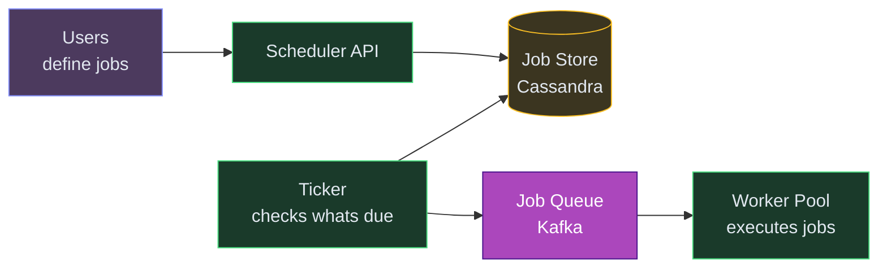

**In 3 sentences:** Users register jobs with a schedule (cron expression) or a one-time fire time. A "ticker" process scans the database for due jobs and enqueues them to Kafka. Worker pods consume from Kafka, execute the job, and report success/failure back. Leader election ensures only one ticker runs per shard.

---

## 1. Understanding the Problem

A distributed job scheduler accepts jobs (run once at time T, or recurring on a cron schedule, or a DAG of dependent steps) and executes them reliably across a fleet of workers. Callers shouldn't worry about which machine runs the job, what happens when a worker crashes mid-execution, or whether the job ran twice. The scheduler owns timing, dispatch, retries, isolation, and observability.

---

## 1.5. Naive First Cut

The 30-second whiteboard version:

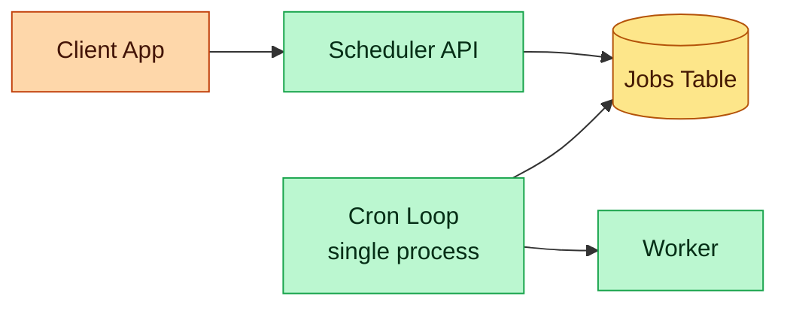

Why it collapses under real use:

- **Single point of failure** — the one cron loop dies, nothing schedules until someone restarts it.
- **Scheduler and worker coupled** — long-running jobs block the schedule tick.
- **No leader election** — if you run two cron loops for HA, both pick up the same due job and run it twice.
- **No retries or backoff** — worker crashes mid-run, job is lost.
- **Tick granularity** — one-per-minute poll can't handle sub-second precision or 100k due-jobs-per-second bursts.
- **No isolation** — a runaway tenant saturates the worker pool, everyone else's jobs miss their SLA.
- **No observability** — "did my job run?" requires grep across worker logs.
- **No dependencies** — jobs are independent; can't express "run B after A finishes."

The rest of the doc evolves this into a horizontally scalable, HA, exactly-once-in-effect job platform.

---

## 1.6. Glossary — what these names mean

Quick reference so nothing in this doc is a black box:

**Components we build**
- **Scheduler API** — the HTTP service users call to create, query, cancel jobs.
- **Dispatcher** — a process that watches for due jobs and hands them to workers.
- **Hydrator** — a background job that copies "soon-due" jobs from the durable DB (Postgres) into the fast in-memory index (Redis), one hour before their fire time. Keeps the hot index small.
- **Sweeper** — a background job that finds executions stuck in `RUNNING` longer than their heartbeat TTL (worker died) and marks them failed so they can be retried.
- **Worker** — a process that picks up a job from the queue, runs the handler code, and reports success/failure.
- **Worker pool** — a named group of workers that handle a specific class of jobs (e.g., `email-sender`, `batch-etl`).

**Infrastructure pieces we use**
- **Postgres** — relational DB for durable truth. Job definitions, execution history. ACID, SQL queries, easy admin.
- **Redis** — in-memory data store. We use two structures:
  - **Sorted Set (ZSET)** — collection where each entry has a score (we use the fire-time timestamp); supports O(log N) range queries by score. Lets us ask "give me all jobs due before now."
  - **Key with TTL** — short-lived entries (heartbeats, cancel flags) that auto-expire.
- **Kafka** — durable message broker. Topics hold ordered messages; consumers (workers) pull them with per-partition ordering. Used here to decouple dispatch from execution.
- **etcd** / **ZooKeeper** / **Consul** — distributed coordination services. They store a tiny amount of data very reliably and let N nodes race for a "lease" (temporary exclusive lock). We use them for **leader election** — picking one dispatcher among N to own a shard.
- **Kubernetes Lease** — K8s's built-in version of the same leader-election idea.
- **Raft / Paxos** — consensus protocols that make coordination services (etcd, ZooKeeper) tolerate node failures without split-brain. You don't implement them; you use a service that does.
- **DLQ (Dead Letter Queue)** — a parking spot for messages that failed N retries. Ops reviews them manually.

> 💡 *DLQ (Dead Letter Queue) = a holding queue for messages that failed processing after max retries. Operators can inspect and reprocess them later.*

**External / reference names in Prior Art**
- **Airbnb Dynein** — Airbnb's internal delayed-job system.
- **Temporal / Cadence** — open-source durable workflow engines (Temporal is the Cadence fork, now the industry standard).
- **Quartz** — the classic Java scheduler library with a clustered mode using DB locks.
- **Dkron** — a distributed cron daemon built in Go using Raft.
- **AWS EventBridge Scheduler** — AWS's managed version of this entire design.

**Observability tools**
- **Prometheus** — metrics DB. Scrapes services for counters/gauges (e.g., dispatch latency, queue depth), stores time series, powers dashboards and alerts.
- **OpenTelemetry** — vendor-neutral SDK that services use to emit metrics, traces, and logs in a standard format.
- **Jaeger** — distributed tracing UI. Given a trace ID, shows the full path of a request across services.
- **ClickHouse** — columnar analytics DB. Fast at aggregating billions of rows ("how many jobs failed per tenant this week?"); slow at single-row updates. Complements Postgres.

---

## 1.7. Prior Art We're Drawing From

- **Airbnb Dynein** — distributed delayed job queue at Airbnb; uses DynamoDB for job storage, a dispatcher pool that polls by time range, pushes onto SQS for workers. Powers in-app messaging, dynamic pricing. ([blog](https://medium.com/airbnb-engineering/dynein-building-a-distributed-delayed-job-queueing-system-93ab10f05f99))
- **Uber Cadence / Temporal** — durable workflow engine: workflow code runs as a "replayable" function; every step is persisted so the workflow survives host death. Originated at Uber, now the industry standard for multi-step orchestration with human-in-the-loop steps, timeouts, and saga compensation. ([Temporal blog](https://www.temporal.io/blog/workflow-engine-principles))
- **Quartz Scheduler (clustered)** — open-source Java scheduler with DB-locked leader election. Classic pattern — a table row with `FOR UPDATE` or a sentinel column determines the active scheduler. Widely deployed; limits on horizontal scale due to the single write-lock hot row.
- **Dkron** — Go-based distributed cron using Raft for leader election. No SPOF, no DB dependency. Good for platform-layer scheduling (host patching, telemetry collection).
- **Google Borg / Kubernetes CronJob** — cluster-level job scheduling. Kubernetes CronJob uses a single controller with leader election to create jobs; job pods execute the work.
- **AWS EventBridge Scheduler** — the managed version of this pattern at AWS scale. One-shot and cron schedules, EventBridge dispatches to Lambda / SQS / Step Functions. Designed for multi-tenant throughput.

---

## 2. Functional Requirements

### Core (top 3)
1. **Schedule a job** — one-time (run at timestamp T), recurring (cron expression), or delayed (run in N seconds).
2. **Execute reliably** — at-least-once delivery to a worker, with retries on failure, respecting timeouts.
3. **Inspect and cancel** — query the status of a scheduled or running job, cancel a future run.

### Below the line (out of scope)
- Workflow DAGs with conditional branches and human steps — that's Temporal territory; we'd mention it as a deep dive extension.
- Job output streaming and log aggregation — assume workers ship logs to an existing log pipeline.
- Cost optimization (spot workers, preemption) — covered in the worker-pool deep dive briefly.
- Full multi-region active-active — we'll note what's needed but design primary-with-DR.

---

## 3. Non-Functional Requirements

### Core
- **Scale** — 100M scheduled jobs at rest, 1M jobs/minute dispatched at peak, 10k concurrent executions.
- **Timing precision** — P95 dispatch latency < 1s of scheduled time for "hot" jobs due within the next minute. Best-effort for long-tail jobs scheduled months out.
- **Reliability** — at-least-once execution guarantee. Job owners must be idempotent; we provide execution IDs to help them dedupe.
- **Availability** — scheduler control plane tolerates single-node and single-AZ failure. No job loss across failover.

### Below the line
- Exactly-once execution end-to-end (impossible; at-least-once + idempotency is the industry standard).
- Sub-100ms precision for far-future jobs.
- Strict fairness across tenants (we'll do weighted, not strict).

## Scale Estimation (Back-of-Envelope)

- **Users:** 10M scheduled jobs at rest, thousands of internal service tenants
- **Write QPS:** 1K new job registrations/sec, 100K executions/hour at peak
- **Read QPS:** 10K job status queries/sec, 1K "what's due now?" sweeps/sec
- **Storage:** 500GB job metadata/year (definitions + execution history)
- **Bandwidth:** 99.9% on-time execution SLA — dispatch within 1s of scheduled time

---

## 4. Core Entities

- **Job** — the definition: identity, owner, type (one-shot / cron / delayed), payload, target (worker pool + handler name), retry policy, timeout, priority.
- **Schedule** — derived from a Job; holds `next_fire_time` for cron jobs. Updated after each fire.
- **Execution** — one attempt to run a job. Has its own ID, a timestamp, a worker assignment, status (PENDING / RUNNING / SUCCEEDED / FAILED / TIMED_OUT / CANCELLED).
- **Worker Pool** — a named group of worker processes that handle a specific class of jobs (e.g., `email-sender`, `batch-etl`).
- **Worker** — a single process that pulls and runs jobs, sends heartbeats.
- **Tenant** — owner of a set of jobs. Quotas and fairness are applied per tenant.

---

## 5. API / System Interface

```bash
POST   /v1/jobs                     -> Job
  Header: Idempotency-Key: <uuid>
GET    /v1/jobs/:id                 -> Job + latest executions
PUT    /v1/jobs/:id                 -> update schedule or payload
DELETE /v1/jobs/:id                 -> cancel (and stop future fires)

POST   /v1/jobs/:id/pause           -> pause recurring job
POST   /v1/jobs/:id/resume          -> resume

GET    /v1/jobs/:id/executions      -> paginated history
POST   /v1/executions/:id/cancel    -> cancel a specific run
GET    /v1/executions/:id           -> status + logs pointer
```

Example create:

```json
POST /v1/jobs
{
  "name": "daily-invoice-gen",
  "type": "CRON",
  "schedule": "0 3 * * *",
  "timezone": "America/Los_Angeles",
  "target": { "pool": "batch-etl", "handler": "generate_invoices" },
  "payload": { "tenantId": "acme", "dateRange": "yesterday" },
  "retryPolicy": { "maxAttempts": 3, "backoff": "EXPONENTIAL", "initialDelayMs": 30000 },
  "timeoutSec": 600,
  "priority": "NORMAL"
}
```

Response:

```json
{
  "jobId": "job_a93f2",
  "nextFireAt": "2026-05-05T10:00:00Z",
  "state": "ACTIVE"
}
```

Security notes:
- Service JWT on all endpoints; payload is opaque to us.
- Idempotency key for job creation so retries don't double-register.
- Payloads are encrypted at rest — they often carry secrets (API tokens, tenant IDs).

---

## 6. High-Level Design

Three passes, one per core functional requirement.

### 6.1 FR-1: Schedule a job

**New components we need:**

1. **Scheduler API** — the HTTP interface users call to create, query, or cancel jobs. Validates inputs and stores job definitions.
2. **Postgres (jobs + schedules)** — the durable source of truth. Stores job definitions, cron expressions, and computed `next_fire_time`.

> 💡 *We use Postgres because job creation needs ACID transactions — if we write the job and its schedule, both must succeed or neither does.*
3. **Redis Sorted Set (upcoming index)** — holds jobs due within the next hour, scored by `next_fire_time`.

> 💡 *A sorted set (ZSET) lets us ask "give me everything due before NOW" in O(log N) — the dispatcher polls this instead of scanning millions of rows in Postgres every second.*

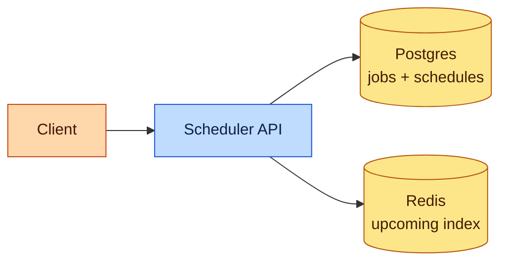

**Legend**

| Color | Role |
|---|---|
| Orange | Client |
| Blue | Edge / API |
| Green | Service |
| Purple | Async / broker |
| Yellow | Data store |
| Pink | External |

**Step-by-step flow:**

1. Developer calls `POST /v1/jobs` with a cron expression like `"0 3 * * *"` (run daily at 3am) → hits the Scheduler API
2. API validates: Is the cron expression valid? Does the target worker pool exist? Is the payload within size limits?
3. API computes `next_fire_time` from the cron + timezone (e.g., 3:00 AM Pacific = 10:00 UTC), then writes a `jobs` row AND a `schedules` row to Postgres in one atomic transaction
4. For jobs due within the next hour, API also adds `(next_fire_time, job_id)` to the Redis sorted set — this is the "hot window" that the dispatcher polls. Jobs further out stay only in Postgres until a background hydrator promotes them
5. Returns `201 Created` with the job ID and next fire time

**Why Postgres for jobs**: ACID for "create + schedule" atomicity, SQL flexibility for admin queries ("show all jobs by tenant X that fired in the last 24h"), indexes on `(next_fire_time, state)` for dispatcher polling.

**Why Redis ZSET for the hot window**: at 1M jobs/min peak, polling Postgres for "jobs due in the next 60s" every second would hammer the index. Redis ZSET gives O(log N) inserts and O(log N + k) range queries by score (timestamp). The ZSET holds only the next hour; everything further out lives only in Postgres, promoted to Redis one hour ahead.

### 6.2 FR-2: Execute reliably (the dispatch + retry path)

This is where most of the complexity lives.

**New components we need (in addition to the ones above):**

1. **Dispatcher Pool (leader-elected shards)** — the heartbeat of the system. Each dispatcher continuously polls its slice of the Redis ZSET for due jobs.

> 💡 *Leader election ensures only ONE dispatcher owns each shard — without it, two dispatchers would both fire the same job, causing duplicate execution.*
2. **Kafka (per-pool topics)** — decouples dispatch timing from worker availability. When the dispatcher finds a due job, it publishes to Kafka rather than directly calling a worker.
3. **Workers** — the processes that actually execute your job code. Each worker pool handles a specific class of jobs (e.g., `email-sender`, `batch-etl`).
4. **Executions table (Postgres)** — one row per attempt to run a job. Append-only history so you can answer "did my job run? when? how long did it take?"
5. **Worker Heartbeats (Redis)** — workers write a heartbeat every 10s. If a worker crashes, its heartbeat expires and a sweeper reschedules the stuck job.

> 💡 *This is the "dead man's switch" — if we don't hear from a worker, we assume it's dead and retry the job.*
6. **Retry Queue** — a delayed Kafka topic where failed jobs wait with exponential backoff before being retried.

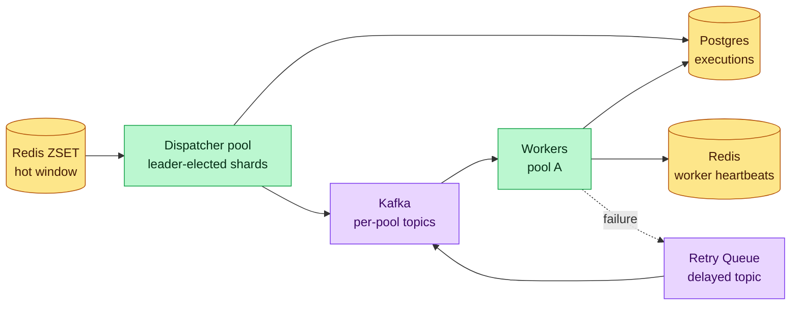

**Step-by-step flow:**

1. Dispatcher shards continuously poll their slice of the Redis ZSET: "Give me all jobs with `score <= now()`" — runs every 100-500ms
2. When a shard finds due jobs, it atomically claims them via `ZREMRANGEBYSCORE` (Redis is single-threaded, so only one dispatcher wins the race)
3. For each claimed job, the dispatcher:
   - Creates an `executions` row in Postgres with status `PENDING`
   - Publishes a message to Kafka on the target pool's topic (e.g., `jobs.batch-etl`)
   - For cron jobs, computes the NEXT fire time and re-adds it to the ZSET (or Postgres if > 1 hour out)
4. A worker in the target pool picks up the Kafka message, marks the execution as `RUNNING`, and starts writing heartbeats to Redis every 10s
5. Worker invokes the job handler with the payload — this is where YOUR code actually runs
6. On success → worker marks execution `SUCCEEDED`, commits Kafka offset, moves on
7. On failure → worker marks `FAILED`, reads the retry policy, and publishes to the retry queue with exponential backoff (30s → 2min → 10min → 1h)
8. A **sweeper** periodically checks: "any executions stuck in RUNNING with expired heartbeats?" If yes → the worker crashed. Mark `FAILED_WORKER_LOST` and trigger a retry

**Why Kafka between dispatcher and workers?** If the dispatcher called workers directly, a pool restart would lose all in-flight jobs. Kafka gives us durability (messages survive worker crashes), replay (reprocess an hour of jobs if a worker had a bug), and independent scaling per pool.

**Why a separate execution row, not just status on the job row**: one job may produce many executions (cron fires daily, retries add more). Executions are append-only, cheap to partition by day, and joinable by job_id for history views.

### 6.3 FR-3: Inspect and cancel

**New components we need (in addition to the ones above):**

1. **Cancel Set (Redis)** — a short-lived set of `executionId`s that have been cancelled. Workers check this before starting and periodically during execution.

> 💡 *We can't "un-send" a Kafka message, so instead we let the worker check a cancel flag before it starts working.*

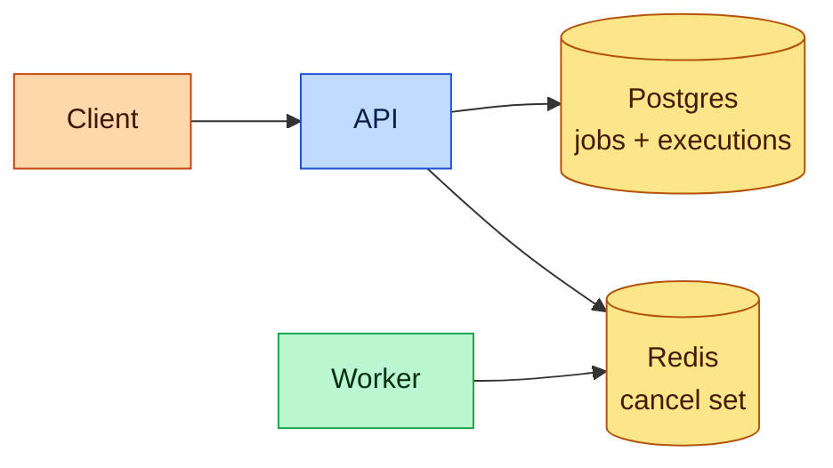

**Step-by-step flow (read path):**

The read path is straightforward: `GET /v1/jobs/:id` hits Postgres with an indexed query by `job_id` — returns the job definition plus recent executions. No drama.

**Step-by-step flow (cancellation — the tricky part):**

Cancellation sounds simple but has three distinct timing windows:

1. **Cancel a future job (not yet due)** — easiest case. API sets the job state to `CANCELLED` and removes it from the Redis ZSET. It'll never fire.
2. **Cancel a PENDING execution (dispatched but worker hasn't started yet)** — write the `executionId` to the Redis cancel set. Worker checks this set before starting; if present, it skips the job entirely.
3. **Cancel a RUNNING execution (worker is mid-flight)** — worker polls the cancel set every few seconds during execution. On hit, it sends an interrupt to the handler code. Handlers must cooperate — we can't force-kill without risking data corruption.

**Why lazy cancellation via a flag instead of "delete from the queue"?** Kafka doesn't support targeted message deletion. And even if it did, there's a race between the cancel request and the worker consuming the message. A cancel flag checked at execution time is simpler and race-free.

---

## Technology Choices

Vendor-agnostic with alternatives listed.

| Tier / purpose | What it stores | Access pattern | Primary pick | Alternatives |
|---|---|---|---|---|
| **Job definitions** | `jobs`, `schedules` — immutable plus a state column, cron expression, payload | low write, point reads + admin queries | **PostgreSQL** sharded by `tenant_id` | MySQL, CockroachDB, Aurora |
| **Hot schedule index** | upcoming-hour ZSET keyed by `next_fire_time` | O(log N) insert, range query by score, atomic pop | **Redis** sorted sets | DynamoDB with sort key on timestamp; Google Cloud Tasks for managed |
| **Executions** | one row per run, heavy insert | insert-heavy, query by job_id + time range | **PostgreSQL** partitioned monthly | Cassandra for 100M+ executions/day, ClickHouse for analytics replica |
| **Worker heartbeats** | `workerId -> lastSeenAt, currentExecutionId` | writes every 10s per worker, TTL eviction | **Redis** with TTL | ZooKeeper for small fleets, ETCD |
| **Event backbone** | `execution.dispatched`, `execution.succeeded`, etc. | ordered per-pool, replayable, at-least-once | **Kafka** | Kinesis, Google Pub/Sub, Pulsar |
| **Delayed retry queue** | messages with `ready_at` timestamp | insert-then-pop-when-ready | **Redis sorted sets** (reuse the ZSET pattern) | Kafka timer topic, SQS delay queues, RabbitMQ delayed exchange |
| **Leader election** | who owns each dispatcher shard | heartbeat-based, fast failover | **ZooKeeper / etcd / Consul** | Kubernetes Lease, Redis Redlock |
| **Cancellation signal** | `cancelled:{executionId}` — short-lived set | fast write from API, fast check from worker | **Redis** set with TTL | Postgres with LISTEN/NOTIFY |
| **Cron parsing** | turn cron expressions into `next_fire_time` | pure compute | **Library** (quartz-cron, croniter) | Custom impl |
| **Observability** | metrics, traces, audit | high write, OLAP queries | **Prometheus + OpenTelemetry + ClickHouse** | Datadog, Honeycomb |

### Why Postgres and Redis together for scheduling

Postgres is durable truth. Redis is the fast index. The split is the key insight:
- Far-future jobs (months out) sit in Postgres. We don't need millisecond access to them.
- Soon-due jobs (next hour) sit in Redis. Dispatchers poll Redis, not Postgres.
- A background hydrator job promotes Postgres rows to Redis one hour before their fire time.

This keeps the dispatcher hot path lightning-fast while Postgres handles the scale-at-rest (100M jobs easily on a single partitioned table).

### Why not just put everything in Redis?

Redis is not durable at the cost-per-GB point we're operating at. Losing scheduled jobs on a Redis failover is unacceptable. Postgres + WAL gives us "if the commit returned, the job will run."

### Why Kafka for the worker-facing bus?

- Durability — if workers all restart, messages survive.
- Per-pool topics — lets us tune partition counts and consumer parallelism per pool.
- Replay — reprocess an hour of executions if a worker had a bug.
- At-least-once delivery semantics match our guarantee.

---

## 7. Potential Deep Dives

Self-audit surfaces these weak spots. Eight deep dives.

### Deep Dive 1 — Hot dispatcher: scale beyond one leader

**Bad**: single dispatcher leader polling one Redis ZSET. At 1M jobs/min the single thread is saturated, polling latency creeps into seconds.

**Good**: shard the ZSET by `hash(jobId) % N`. Each shard has its own leader (picked via etcd). N dispatchers poll N ZSETs in parallel.

**Great — dynamic sharding with consistent hashing and idle thievery**:
- Use consistent hashing so adding/removing shards redistributes a minimal fraction of jobs.
- Each dispatcher publishes its load; a coordinator rebalances shards when hotspots emerge.
- Idle dispatchers can "steal" work from busy peers via a small pull queue, which smooths bursts.

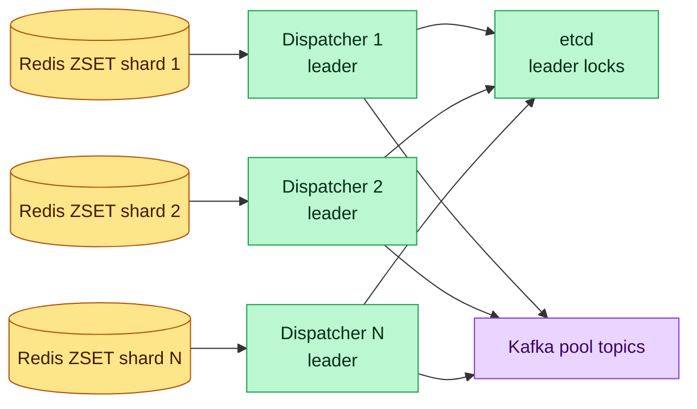

### Deep Dive 2 — Exactly-once-in-effect execution

Exactly-once delivery is impossible across a network boundary. The achievable goal: at-least-once delivery + idempotent handlers = "exactly-once in effect."

**Bad**: no execution ID. If dispatch retries the same message, the handler runs twice with no way to dedupe.

**Good**: generate an `executionId` on dispatch. Hand it to the worker. The worker's first action is to check a "processed" table; if present, skip; else run the handler, record completion.

**Great — fencing tokens + transactional completion**:
- Each execution gets a monotonic fencing token. Worker uses it when writing to downstream systems that support fencing (Kafka transactional writes, Postgres with token check).
- Completion is recorded in the same transaction as the business side-effect wherever possible:
  ```sql
  BEGIN;
    UPDATE invoices SET status = 'sent' WHERE id = ? AND fence_token < ?;
    UPDATE executions SET state = 'SUCCEEDED' WHERE id = ?;
  COMMIT;
  ```
- For non-transactional downstreams, the handler writes its output with the `executionId` as a dedup key (producer-level dedup).

This is the **Outbox + fencing** pattern borrowed from Stripe's idempotency work and Temporal's activity-retry model.

### Deep Dive 3 — Worker crash during execution

**Bad**: worker crashes mid-run. Execution sits in `RUNNING` forever. Nobody retries.

**Good**: heartbeat-based liveness. Workers write to Redis every 10s. A sweeper scans executions stuck in `RUNNING` with expired heartbeats and marks them `FAILED_WORKER_LOST`, triggering retry.

**Great — heartbeat TTL + at-most-once interpretation + retry with backoff**:
- Worker writes heartbeat with a 30s TTL in Redis. Misses two consecutive beats → sweeper picks up.
- Sweeper updates the execution row with `UPDATE executions SET state = 'FAILED' WHERE id = ? AND worker_id = ? AND state = 'RUNNING'` — CAS on worker_id prevents race with a worker that just reconnected.
- Retry publishes to the retry topic with exponential backoff (30s, 2min, 10min, 1h).
- After `maxAttempts`, move to DLQ; ops dashboard surfaces these for manual review.

**Edge case**: worker finished the work but crashed before ACKing. Job effectively ran; our retry will run it again. That's why the idempotency contract with handlers matters.

### Deep Dive 4 — Cron drift, DST, and timezones

**Bad**: interpret cron in UTC. User in India sees "3 AM IST" jobs run at 3 AM UTC, 8:30 AM IST.

**Good**: store `cron + timezone`. Compute `next_fire_time` in the user's zone, convert to UTC for the ZSET score.

**Great — recompute every fire, handle DST discontinuities**:
- Use a robust cron library (`croniter`, `cron-utils`) that handles timezone transitions.
- On DST spring-forward, "2:30 AM local" skips to 3:30 AM — library returns the next valid time.
- On fall-back, "1:30 AM local" occurs twice — library returns the first; our `next_fire_time` moves forward after the first fire, so we don't fire twice.
- Store both `next_fire_time_local` and `next_fire_time_utc` for debugging.
- Migrations: if a timezone's rules change (this happens — e.g., governments moving DST dates), a background job recomputes all affected schedules.

### Deep Dive 5 — Multi-tenant isolation and fairness

**Bad**: tenant A schedules 10M cron jobs all firing at `0 0 * * *` (midnight UTC). At midnight, the dispatcher is overwhelmed, tenant B's urgent jobs miss their SLA.

**Good**: per-tenant quotas enforced at job-submit time. Cap at N concurrent executions per tenant.

**Great — weighted fair queuing in the dispatcher**:
- Dispatcher doesn't blindly pop from the ZSET in timestamp order. It picks batches round-robin across tenants, weighted by each tenant's tier.
- Per-tenant rate limiters (token buckets in Redis) sit in front of Kafka publish.
- Noisy-neighbor isolation: if tenant A's workers are backlogged, tenant A's dispatcher shard slows its publish rate, leaving Kafka capacity for others.
- Jitter job fire times at schedule-creation: if a user says `0 0 * * *`, we spread to `0..180 0 * * *` (0-180 second jitter) unless they explicitly opt out. This alone avoids most of the midnight stampede.

### Deep Dive 6 — Leader election and failover

**Bad**: single dispatcher process. Dies → no jobs scheduled until ops restarts. 5-minute outage.

**Good**: two dispatchers with a DB-based lock row (`UPDATE scheduler_leader SET leader = $me WHERE leader IS NULL`). Quartz's classic approach.

**Great — consensus-backed leases with sub-second failover**:
- **etcd** / **ZooKeeper** / **Consul** — each dispatcher shard has a lease on its shard key. Leases renew every 5 seconds; if a leader dies, another node acquires the lease within 10s.
- Kubernetes Lease API works identically if you're on K8s — just a lease object that watchers race for.
- **Split-brain prevention**: leader includes a monotonic **epoch** in every dispatch message. Workers check the epoch against the one they last saw; outdated dispatches are rejected. Same fencing-token idea as Deep Dive 2, scaled up.

### Deep Dive 7 — Handling long-running jobs (heartbeat + restart-safe)

**Bad**: a 4-hour ETL job. Worker crashes at hour 3.5. Retry restarts from zero. Massive waste.

**Good**: handlers checkpoint progress periodically. On retry, they read the checkpoint and resume.

**Great — activity/heartbeat pattern (from Temporal)**:
- Handler calls `heartbeat(progress)` every minute. Progress is arbitrary JSON, stored in the execution row.
- On retry, handler reads `progress` from the previous attempt's execution and resumes.
- Heartbeat TTL on the scheduler side is generous (e.g., 5 minutes) for long jobs — they're allowed to be silent that long.
- For truly stateful workflows (multi-step with external calls between steps), recommend users move to a workflow engine like Temporal rather than shoehorn into a plain scheduler.

### Deep Dive 8 — Observability and debuggability

**Bad**: "did my job run?" — grep logs on 200 worker hosts.

**Good**: executions table indexed by job_id. UI shows history.

**Great — metrics + traces + audit + replay**:
- **Metrics** (Prometheus): dispatch latency histogram, queue depth per pool, execution duration, retry count, DLQ size. SLI: P95 dispatch latency.
- **Distributed tracing** (OpenTelemetry): every execution gets a trace ID. Propagated to Kafka headers → worker → downstream services. A support person can see the whole path for one execution in Jaeger.
- **Audit log**: every state transition is logged to an append-only table. Answers "who cancelled this job?" compliance questions.
- **Replay**: for a given time range, replay messages from Kafka into a staging pool. Lets devs reproduce incidents without hitting prod.

---

## 7.5. Design Self-Audit

Weak spots checked:
- **Clock skew** — dispatcher and workers must agree on "now." NTP keeps hosts in sync; for critical timing we round to the nearest second. Major clock drift would cause duplicate dispatches; fencing tokens (Deep Dive 2) catch those.
- **Redis ZSET size** — holding 1 hour of due jobs at 1M/min = 60M entries. One Redis instance can handle that in RAM (~10 GB). For growth, shard the ZSET (Deep Dive 1).
- **Postgres write hot spot** — executions table grows fast. Partitioning by month + archive old partitions to S3 keeps the hot table small.
- **Retry storm** — a downstream service fails for 5 min, 1M failed executions queue into retry. Retry backoff must be randomized (jitter) and capped; circuit breaker at the worker side pauses retries if failure rate exceeds a threshold.
- **Payload bloat** — users pass 10 MB payloads. Cap payload at 256 KB; larger = reference to S3.
- **Dependency on Redis availability** — Redis outage = no dispatch. Mitigation: Redis Sentinel / Cluster; cold-start re-hydrates ZSET from Postgres in minutes.
- **Multi-region** — primary region in one location, warm standby in another; cross-region Postgres replication (async). On failover, some last-second jobs may re-fire — idempotency catches them.
- **Cost** — Kafka and Postgres dominate. Monitor per-tenant cost, bill back for heavy schedulers.

---

## 6.5. Core Flows

### Flow 1 — One-shot delayed job (run in 5 minutes)

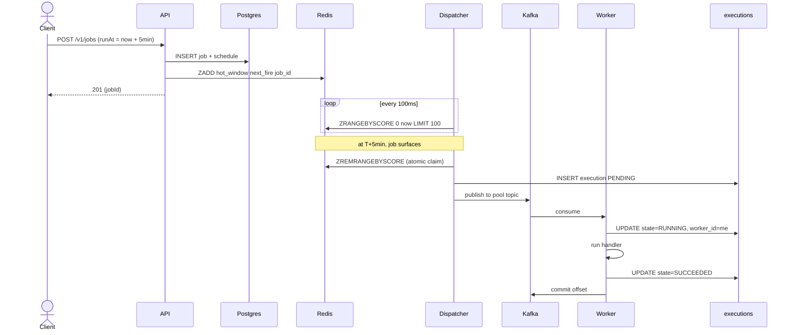

Walkthrough:
1. Client posts a job with `runAt = now + 5min`.
2. API persists the job and schedule rows, then adds to the Redis hot-window ZSET.
3. Dispatcher polls the ZSET every 100ms.
4. At the fire time, dispatcher atomically pops the entry (ZREMRANGEBYSCORE), creates an execution row, and publishes to Kafka.
5. Worker consumes, marks RUNNING, runs, marks SUCCEEDED, commits.

Non-obvious failure path: if dispatcher crashes between step 3 and publishing, on restart the ZSET entry has already been removed. Safety net: the executions row was created before the publish, so a sweeper sees a PENDING execution with no Kafka publish → re-publishes.

### Flow 2 — Recurring cron job with a failure and retry

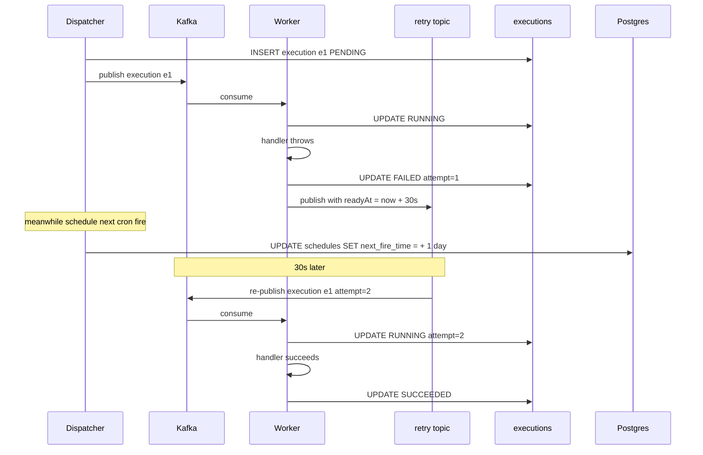

Walkthrough:
1. Dispatcher fires the cron job, creates execution `e1`, publishes to Kafka.
2. Worker picks up, runs handler, handler throws.
3. Worker writes FAILED with attempt=1, publishes to retry topic with a 30-second delay.
4. Dispatcher also advances the next fire time for the cron (+1 day) — retries don't affect the schedule.
5. 30 seconds later, the retry topic re-publishes. A worker picks it up as attempt=2.
6. Succeeds, marked SUCCEEDED.

Non-obvious failure: worker crashes between step 3a (handler throws) and step 3b (publish to retry). Safety net: the execution row is still RUNNING in Postgres. Heartbeat TTL expires in 30s → sweeper marks FAILED_WORKER_LOST → enqueues retry.

### Flow 3 — Running execution cancellation

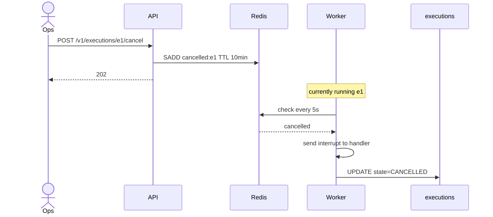

Walkthrough:
1. Ops calls the cancel API for a running execution.
2. API writes to a Redis set with a short TTL (10 min is enough; after that the execution is done anyway).
3. Worker polls the cancel set every 5 seconds (cheap — single GET).
4. On hit, it sends an interrupt signal to the handler (Java `Thread.interrupt`, or a cancel-token check in the handler).
5. Handler cooperatively stops, updates the execution to CANCELLED.

Non-cooperative handlers (native code, infinite CPU loop) can't be cancelled. We surface that as "best effort" in the docs and kill the worker process after a grace period.

### State machine — an execution's lifecycle

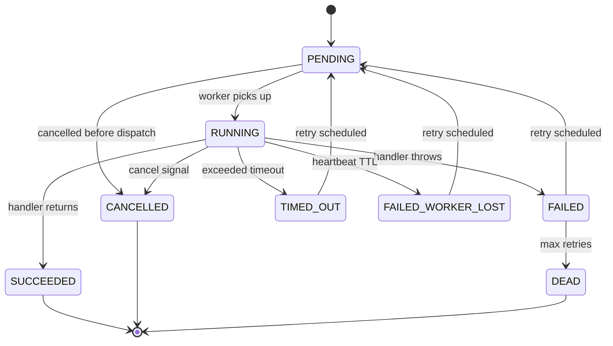

---

## 8. Final Architecture Diagram

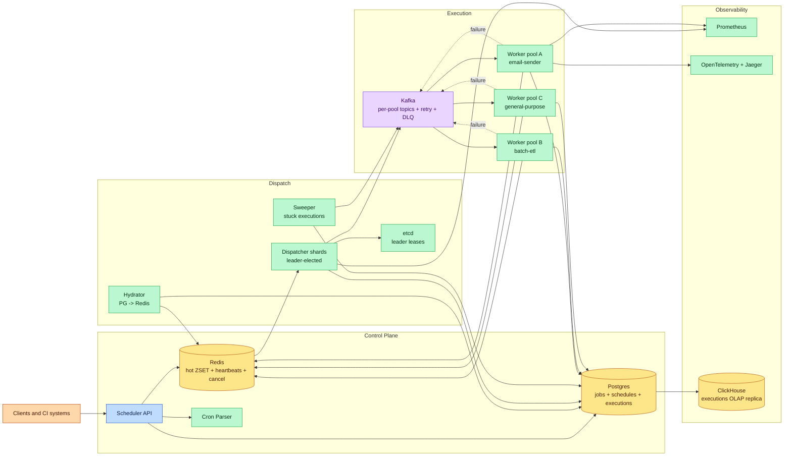


---

## Key Technologies Mentioned

| Term | What it is |
|---|---|
| **Redis Sorted Set (ZSET)** | In-memory data structure scored by fire-time timestamp — O(log N) insert and range queries power the "what's due now?" dispatcher hot path. |
| **Timing Wheel** | Alternative scheduling structure with O(1) insert and fire for time-bucketed events — used in some dispatcher implementations for high-volume ticks. |
| **Leader Election** | Coordination mechanism (via etcd/ZooKeeper/Consul) ensuring only one dispatcher owns each shard — prevents duplicate job firing. |
| **Kafka** | Durable message broker decoupling dispatch timing from worker execution — survives worker restarts and enables per-pool topic scaling. |
| **Cron Expression** | Standard syntax (e.g., `0 3 * * *`) for defining recurring schedules, parsed with timezone-aware libraries to compute next fire times. |
| **Heartbeat** | Periodic signal (every 10s) from workers to Redis with TTL — missed heartbeats trigger sweeper-based retry of stuck jobs. |
| **Dead Letter Queue** | Holding queue for jobs that exhausted all retry attempts — surfaced to an ops dashboard for manual investigation. |
| **Temporal** | Durable workflow engine for complex multi-step job orchestration with built-in retries, timeouts, and crash recovery. |

---

## What's Expected at Each Level

> This section helps you calibrate your depth. You don't need to cover everything — just know what's expected for your level.

### Mid-level

Design a system that stores jobs with execution times and triggers them when due. Propose a polling mechanism or priority queue for finding due jobs. Understand why a single timer thread doesn't scale — one machine crashing means jobs don't fire.

### Senior

Propose Redis ZSET for the hot window of upcoming jobs (score = execution timestamp). Explain leader election for preventing duplicate execution across multiple scheduler instances. Discuss retry logic with exponential backoff and dead-letter queues for permanently failed jobs. Articulate the difference between at-least-once and exactly-once execution guarantees.

### Staff+

Address multi-tenant fair scheduling (one user's million jobs shouldn't starve others) using weighted queues with per-tenant token buckets. Discuss timing wheel data structures for sub-second precision without polling overhead, sharding strategies for the job store (partition by tenant + time bucket), and exactly-once execution guarantees using fencing tokens to prevent stale workers from completing zombie executions.

---
## 🎯 Key Takeaways

- **Redis ZSET scored by execution time** enables O(log N) "what's due now?" queries
- **Leader election** ensures exactly one worker processes the hot window
- **Dead letter queue** catches permanently failing jobs without blocking others
- **Idempotent execution** — jobs must be safe to retry

---
## Related Designs
- [Delayed Trigger Service](/hld/DelayedTriggerService) — timing wheels and scheduled execution
- [Notification System](/hld/NotificationSystem) — scheduled notification delivery
- [Zomato](/hld/Zomato) — dispatch and async workflows
