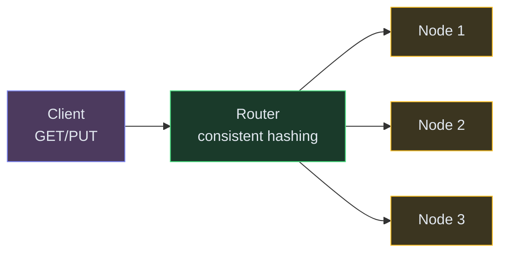
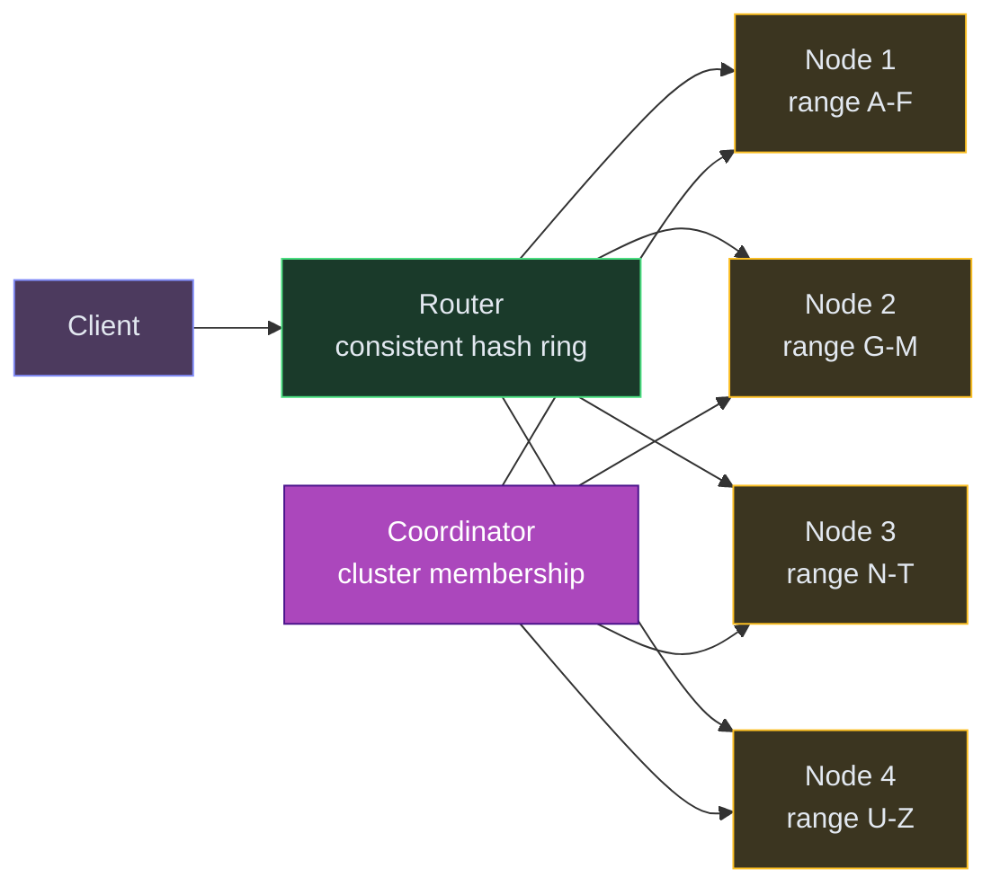
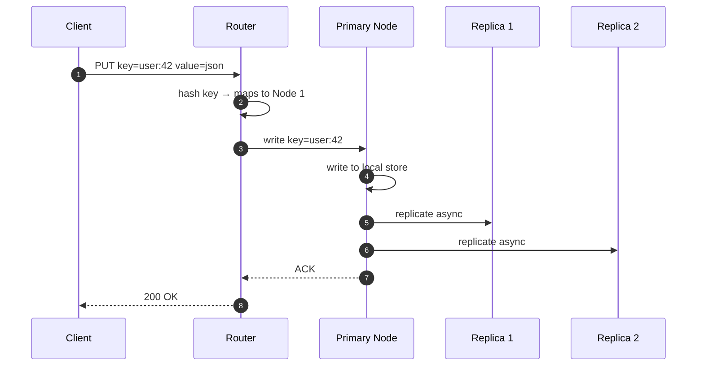
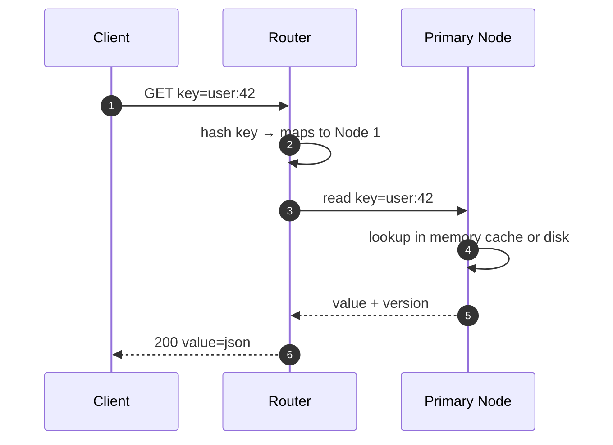
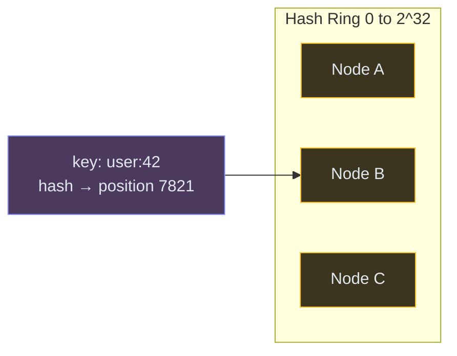
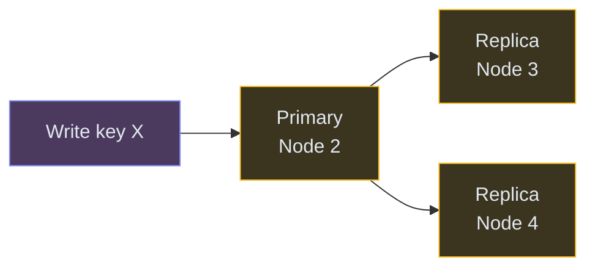
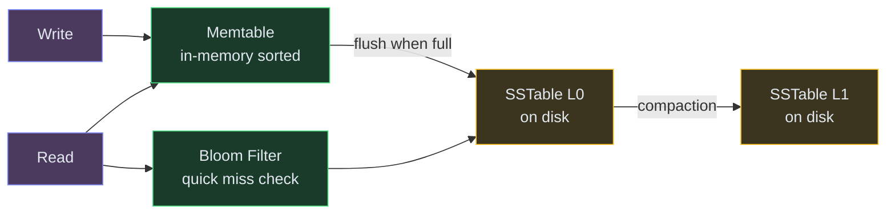

# Designing a Distributed Key-Value Store

⚡ **Difficulty:** Beginner–Intermediate
📋 **Prerequisites:** [System Design Fundamentals](/concepts) — especially Databases and Caching
⏱️ **Reading time:** 12 min
🏢 **Asked at:** Amazon, Google, Meta, Microsoft, Databricks

---

## TL;DR

A key-value store is the simplest database: give it a key, get back a value. Distributed versions (Redis, DynamoDB, Cassandra) split data across many machines using consistent hashing and replicate it for durability.



**In 3 sentences:** Client sends a key → router hashes it to find which node owns it → that node stores/returns the value. Data is replicated to N nodes for durability. Consistent hashing ensures adding/removing nodes only moves a small fraction of keys.

---

## Understanding the Problem

**What is a key-value store?** The simplest database imaginable: a giant dictionary/hashmap. You `PUT(key, value)` to store data and `GET(key)` to retrieve it. No complex queries, no joins, no schemas — just keys and values.

**Real examples:**
- **Redis** — in-memory, sub-millisecond reads, used for caching and sessions
- **DynamoDB** — AWS managed, scales to millions of requests/sec
- **Cassandra** — wide-column store with KV access patterns
- **etcd** — distributed config store used by Kubernetes
- **Memcached** — in-memory caching layer

**Why is this asked?** It's a foundational distributed systems problem. A single-node hashmap is trivial, but distributing it across machines teaches: partitioning, replication, consistency, failure handling — the core of distributed systems.

---

## Prior Art We're Drawing From

- **Amazon DynamoDB (Dynamo Paper)** — Introduced consistent hashing with virtual nodes, vector clocks for conflict resolution, and tunable consistency (W, R, N quorum). The foundational paper for distributed KV stores. ([Amazon Dynamo Paper](https://www.allthingsdistributed.com/files/amazon-dynamo-sosp2007.pdf))
- **Google Bigtable / LevelDB** — Pioneered the LSM-tree storage engine (memtable → SSTable → compaction) that powers most modern KV stores. LevelDB is the reference implementation. ([Bigtable Paper](https://static.googleusercontent.com/media/research.google.com/en//archive/bigtable-osdi06.pdf))
- **Apache Cassandra** — Combines Dynamo's partitioning with Bigtable's storage model. Demonstrates tunable consistency at massive scale (Apple runs 160K+ Cassandra nodes). ([Cassandra Architecture](https://cassandra.apache.org/doc/latest/architecture/))
- **etcd / Raft Consensus** — Shows how strong consistency can be achieved in a distributed KV store using the Raft consensus algorithm. Used by Kubernetes for cluster state. ([etcd.io](https://etcd.io/))

## Scale Estimation (Back-of-Envelope)

- **Users:** Millions of clients (internal services + applications)
- **Write QPS:** 500K writes/sec (mixed PUTs and DELETEs)
- **Read QPS:** 1M reads/sec (GETs dominate in most workloads)
- **Storage:** 10TB total data distributed across the cluster, 3x replication = 30TB raw
- **Bandwidth:** Sub-10ms P99 latency target, ~100 Gbps aggregate cluster throughput

---

## Naive First Cut

A single server with an in-memory hashmap:


**Why this breaks:**

- ❌ **Memory limit** — one server has maybe 64GB RAM. Your data might be 10TB.
- ❌ **Single point of failure** — server crashes, all data gone
- ❌ **No scalability** — can't handle more reads by adding machines
- ❌ **Data loss** — in-memory means a restart wipes everything (unless you add persistence, but then writes are slow)

We need to split data across many machines and replicate it.

---

## The Solution: Distributed Key-Value Store

**New components:**

1. **Client Library / Router** — decides which node a key belongs to using consistent hashing. Could be a smart client or a separate routing layer.
2. **Storage Nodes** — each node owns a portion of the key space. Stores data on disk (for durability) with an in-memory cache for speed.
3. **Replication** — each key is stored on N nodes (typically 3). If one node dies, the data still exists on the others.
4. **Coordinator** — handles cluster membership: which nodes are alive, which owns what range. Could be a gossip protocol (Cassandra) or a centralized service (etcd/ZooKeeper).



> 💡 **Consistent hashing** maps both keys AND nodes onto a circular ring (0 to 2³²). A key is assigned to the first node clockwise from its position on the ring. When a node is added/removed, only its neighbors' keys move — everything else stays put.

---

## API Design

```
PUT /v1/data/{key}
Body: { value: <any>, ttl?: 3600 }
→ 200 OK

GET /v1/data/{key}
→ { value: <any>, version: 42 }

DELETE /v1/data/{key}
→ 204 No Content
```

That's it. The simplicity is the point — no SQL, no query language, just CRUD by key.

---

## Flow: Write (PUT)



**Write path:** Router hashes the key, finds the primary node, writes to it. The primary replicates to N-1 other nodes. Depending on consistency settings, the client might wait for 1 ACK (fast but risky) or all N ACKs (slow but safe).

## Flow: Read (GET)



For stronger consistency, the router can read from multiple replicas and return the latest version.

---

## Deep Dives

### 1. Consistent Hashing — How Keys Map to Nodes

**Problem:** If you use `node = hash(key) % num_nodes`, adding or removing a node changes EVERY key's assignment. With 1 billion keys, all of them would need to move — catastrophic.

**Solution: Consistent hashing.**



**How it works:**
1. Hash each node's ID to a position on a ring (0 to 2³²)
2. Hash each key to a position on the same ring
3. Walk clockwise from the key's position — the first node you hit owns that key

**Adding a new node D:** Only keys between D and its predecessor move to D. Everything else stays put. On average, only `1/N` of keys move (where N = number of nodes). With 4 nodes, adding a 5th moves only ~20% of keys instead of 100%.

> 💡 **Virtual nodes:** Real systems place each physical node at multiple positions on the ring (e.g., 150 virtual nodes per server). This ensures even distribution — otherwise, some nodes might get 60% of keys by luck of the hash.

### 2. Replication — What Happens When a Node Dies

**Problem:** Nodes fail. Disks die. Networks partition. If data lives on only one node, it's gone when that node goes down.

**Solution:** Store each key on N nodes (typically N=3). The primary node replicates to the next N-1 nodes clockwise on the ring.



**Tunable consistency (W and R values):**

| Setting | Meaning | Trade-off |
|---|---|---|
| W=1 | Write succeeds after 1 node ACKs | Fast writes but risk data loss if that node dies before replicating |
| W=N | Write succeeds after ALL nodes ACK | Slow writes but guaranteed durability |
| W=2, R=2 (quorum) | Majority must agree | Good balance of speed and safety |

> 💡 **Quorum rule:** As long as `W + R > N`, reads always see the latest write. With N=3, W=2, R=2 → at least one node in the read set has the latest value. This is how DynamoDB and Cassandra achieve "tunable consistency."

**When a node comes back:** It catches up by comparing its data versions with replicas (anti-entropy repair / Merkle tree comparison).

### 3. Storage Engine — How Data Lives on Each Node

Each node needs to actually store data on disk efficiently. Two main approaches:

**Bad:** Store each key as a file on disk. Millions of tiny files = filesystem chokes.

**Good:** Use a log-structured merge tree (LSM tree). All writes go to an in-memory buffer (memtable). When full, flush to disk as a sorted file (SSTable). Reads check memtable first, then SSTables.



> 💡 **Bloom filter** is a space-efficient data structure that tells you "definitely not here" or "maybe here." Before reading an SSTable from disk, the bloom filter tells you if the key MIGHT exist in that file — saves expensive disk reads for keys that aren't there.

**Great:** Add a Write-Ahead Log (WAL). Before writing to the memtable, append to a log on disk. If the node crashes before flushing, the WAL replays to recover the memtable. Zero data loss.

**Why LSM tree over B-tree?** LSM trees turn random writes into sequential writes (just append to a log). Sequential disk I/O is 100x faster than random I/O. For write-heavy workloads (like a KV store that handles millions of writes/sec), LSM trees win.

---

## Key Technologies

| Term | What it is |
|---|---|
| **Consistent Hashing** | Maps keys and nodes onto a ring. Adding/removing a node only moves neighboring keys. Used by DynamoDB, Cassandra, Redis Cluster. |
| **Replication Factor (N)** | Number of copies of each key. N=3 means 3 nodes hold the data. Survive up to N-1 failures. |
| **Quorum (W + R > N)** | Ensures reads always see latest writes. A tunable knob between speed and consistency. |
| **LSM Tree** | Log-Structured Merge Tree. Write-optimized storage engine. Sequential writes → fast. Used by LevelDB, RocksDB, Cassandra. |
| **Bloom Filter** | Probabilistic structure to quickly check "is key X in this file?" Avoids unnecessary disk reads. |
| **WAL (Write-Ahead Log)** | Append-only disk log written before in-memory changes. Crash recovery guarantee. |
| **Vector Clock** | Tracks causality between writes. Detects conflicts when two replicas have divergent values. Used in DynamoDB. |

---

## Interview Cheat Sheet

| Question | Answer |
|---|---|
| "How to partition data?" | Consistent hashing with virtual nodes for even distribution |
| "How to handle node failure?" | Replication factor N=3. Quorum reads/writes (W=2, R=2). |
| "Consistency vs availability?" | Tunable: W=1 R=1 for speed (AP), W=N R=N for strong consistency (CP). Quorum is the sweet spot. |
| "How to detect conflicts?" | Vector clocks or last-writer-wins (simpler but loses data) |
| "How data is stored on disk?" | LSM tree: memtable → flush to SSTable → compaction. WAL for crash recovery. |
| "How to find data fast?" | Bloom filter to skip SSTables that don't have the key |
| "What about hot keys?" | Cache popular keys in front. Or split hot keys across sub-keys (shard the shard). |

---

## What's Expected at Each Level

> This section helps you calibrate your depth. You don't need to cover everything — just know what's expected for your level.

### Mid-level

Understand the basic API (GET/PUT/DELETE by key). Propose a hash map for storage. Recognize that a single server can't hold all data — need to split across machines. With prompting, explain consistent hashing as a way to distribute keys across nodes without reshuffling everything when a node is added or removed.

### Senior

Explain consistent hashing with virtual nodes for even distribution. Discuss replication factor and quorum reads/writes (W+R>N for strong consistency). Propose LSM tree storage engine for write optimization (memtable → SSTable flush → compaction). Articulate the CAP theorem trade-off for this system — which guarantee do you sacrifice?

### Staff+

Address vector clocks for conflict detection in multi-master writes, Merkle trees for anti-entropy repair (detecting divergence between replicas), hinted handoff during temporary node failures (sloppy quorum), and read repair as a protocol for healing stale reads. Discuss tunable consistency per operation (some keys need strong, others can be eventual) and the operational cost of compaction in LSM trees (write amplification, space amplification).

---

## 🎯 Key Takeaways

- **Consistent hashing** distributes data evenly and minimizes reshuffling when nodes change
- **Replication** (N=3) provides fault tolerance — lose a node, data survives
- **Quorum (W+R>N)** lets you tune the consistency-vs-speed tradeoff per operation
- **LSM trees** make writes fast by converting random I/O to sequential appends
- This pattern underpins almost every distributed database — learn it once, apply everywhere

---

## Related Designs
- [Rate Limiter](/RateLimiter) — uses Redis (a KV store) for counters
- [Leaderboard](/Leaderboard) — Redis sorted sets are a specialized KV structure
- [URL Shortener](/URLShortner) — simple KV mapping of short code → URL
