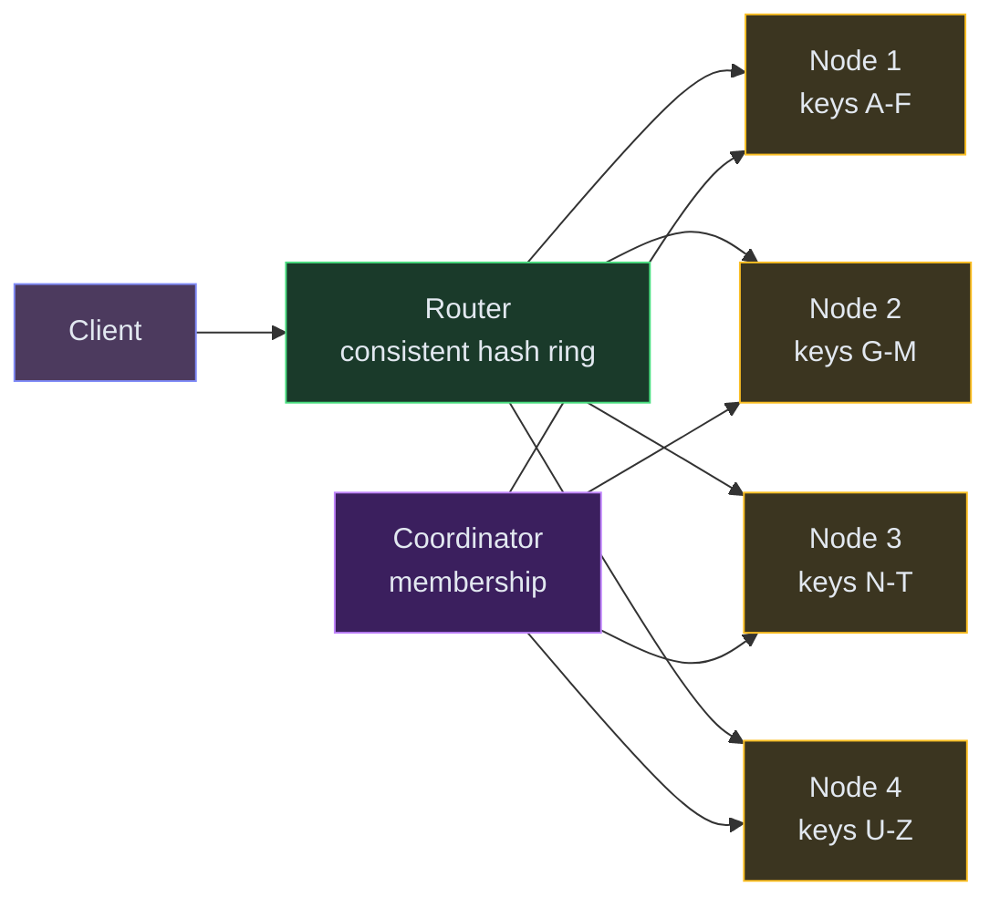
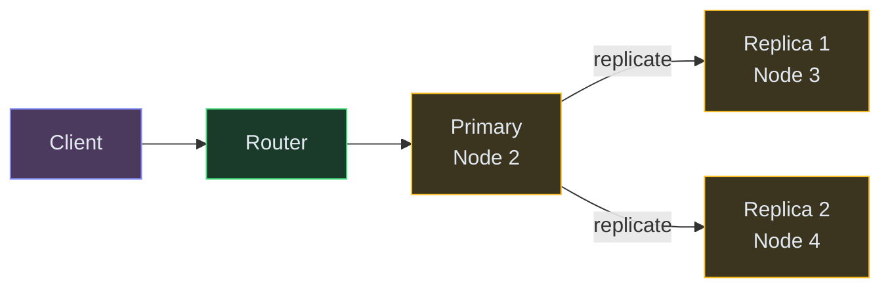
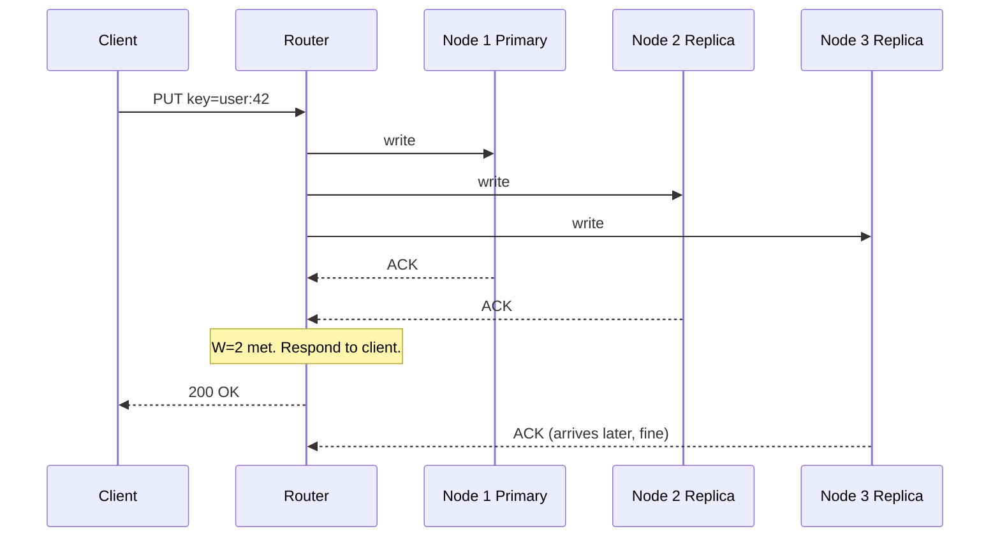
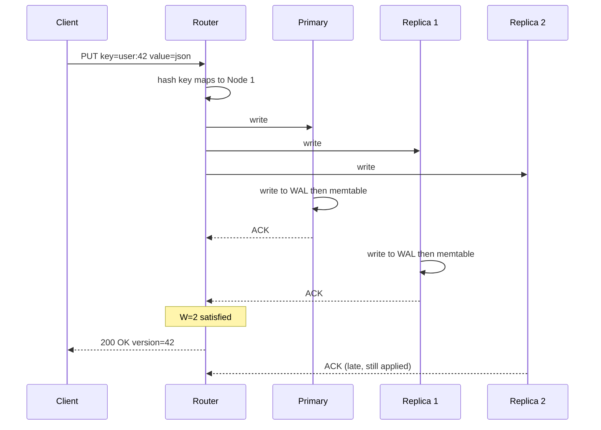
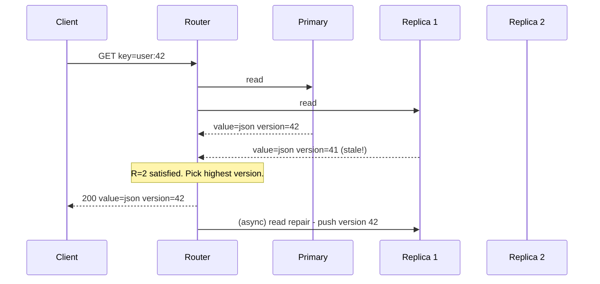
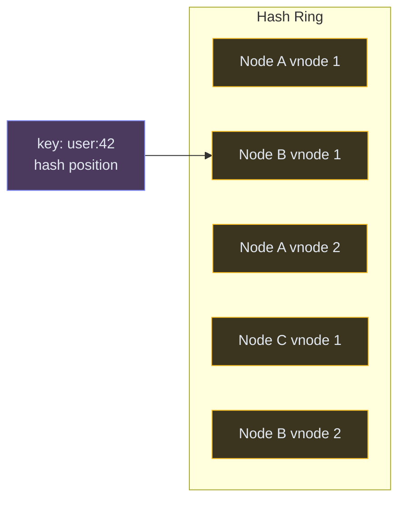
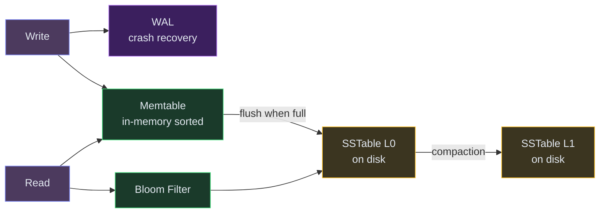
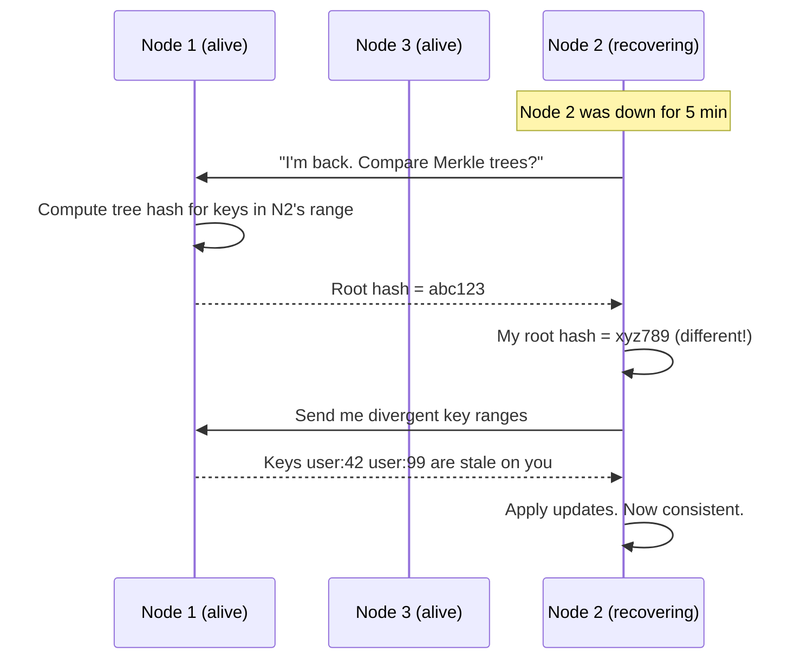
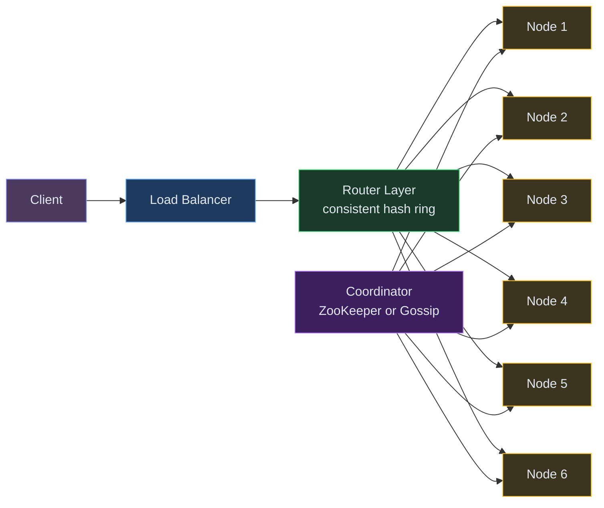

# Designing a Distributed Key-Value Store

⚡ **Difficulty:** Beginner–Intermediate 🏷️ **Topics:** Consistent Hashing, Replication, LSM Tree, Quorum 🏢 **Asked at:** Amazon, Google, Meta, Microsoft, Databricks
📋 **Prerequisites:** [Fundamentals](/concepts) - especially [Consistent Hashing](/concepts#consistent-hashing), [CAP Theorem](/concepts#cap-theorem), and [Merkle Trees](/concepts#merkle-trees)

---

## 1. Understanding the Problem

A key-value store is the simplest database: give it a key, get back a value. Think of it as a giant distributed dictionary. You `PUT(key, value)` to store data and `GET(key)` to retrieve it. No complex queries, no joins, no schemas.

**Real examples:** Redis (in-memory, sub-ms reads), DynamoDB (millions of req/sec), Cassandra (wide-column), etcd (Kubernetes config store).

**Why is this asked?** A single-node hashmap is trivial. Distributing it across machines teaches partitioning, replication, consistency, and failure handling - the core of distributed systems.

---

## 1.5. Naive First Cut


| Color | Meaning |
|---|---|
| 🟣 Purple | Client apps |
| 🟢 Green | Services / routing |
| 🟡 Yellow | Data stores / nodes |
| 🟣 Dark purple | Async / coordination |


A single server with an in-memory hashmap. `PUT` adds to the map, `GET` retrieves.

**Why this breaks:**

- **Memory limit** - one server has maybe 64GB RAM. Your data might be 10TB.
- **Single point of failure** - server crashes, all data gone
- **No scalability** - can't handle more reads by adding machines
- **Data loss** - in-memory means a restart wipes everything
- **No availability** - maintenance = downtime

The rest of the doc evolves this into a production-grade distributed store.

---

## 1.7. Prior Art We're Drawing From

- **Amazon DynamoDB (Dynamo Paper)** - Introduced consistent hashing with virtual nodes, vector clocks for conflict resolution, and tunable consistency (W, R, N quorum). The foundational paper for distributed KV stores. ([Amazon Dynamo Paper](https://www.allthingsdistributed.com/files/amazon-dynamo-sosp2007.pdf))
- **Google Bigtable / LevelDB** - Pioneered the LSM-tree storage engine (memtable → SSTable → compaction) that powers most modern KV stores. ([Bigtable Paper](https://static.googleusercontent.com/media/research.google.com/en//archive/bigtable-osdi06.pdf))
- **Apache Cassandra** - Combines Dynamo's partitioning with Bigtable's storage model. Apple runs 160K+ Cassandra nodes. ([Cassandra Docs](https://cassandra.apache.org/doc/latest/architecture/))
- **etcd / Raft** - Shows how strong consistency works in a distributed KV store using Raft consensus. Used by Kubernetes. ([etcd.io](https://etcd.io/))

---

## 2. Functional Requirements

### Core (Top 3)

1. **PUT(key, value)** - store a key-value pair, overwriting if it already exists
2. **GET(key)** - retrieve the value for a given key
3. **DELETE(key)** - remove a key-value pair

### Below the Line

- Range queries (scan keys between A and B)
- TTL / automatic expiry
- Atomic compare-and-swap (CAS)
- Batch operations

---

## 3. Non-Functional Requirements

### Core

| NFR | Target |
|---|---|
| **Scalability** | Handle 10TB+ data across many machines, scale horizontally |
| **Availability** | 99.99% - tolerate node failures without downtime |
| **Latency** | Sub-10ms P99 for reads and writes |
| **Tunable consistency** | Let users choose between strong and eventual consistency per operation |

### Below the Line

- Multi-region replication
- Encryption at rest
- Access control per key

---

## Scale Estimation (Back-of-Envelope)

- **Write QPS:** 500K writes/sec
- **Read QPS:** 1M reads/sec (read-heavy workload)
- **Storage:** 10TB total data, 3x replication = 30TB raw
- **Latency target:** < 10ms P99

---

## 4. Core Entities

- **Key** - a unique string identifier (e.g., `user:42`, `session:abc`)
- **Value** - arbitrary bytes (JSON, protobuf, raw text). Up to a few MB.
- **Node** - a machine in the cluster that owns a portion of the keyspace
- **Partition** - a range of keys assigned to a specific node
- **Replica** - a copy of a partition on a different node for durability

---

## 5. API / System Interface

```text
PUT /v1/data/{key}
  Body: { value: <any>, ttl?: 3600 }
  Response: 200 OK { version: 42 }

GET /v1/data/{key}
  Response: 200 { value: <any>, version: 42 }

DELETE /v1/data/{key}
  Response: 204 No Content
```

That's it. The simplicity is the point - no SQL, no query language, just CRUD by key.

> **Security note:** Authentication via API key or JWT. Rate-limit per client to prevent abuse.

---

## 6. High-Level Design

Let's build this incrementally, one requirement at a time.

### FR1: PUT(key, value) - Storing Data Across Multiple Machines

The first problem: we have more data than fits on one machine. We need to split (partition) the data across many nodes. But how do we decide which node owns which key?

**The naive approach** is `node = hash(key) % num_nodes`. This works until you add or remove a server - then ALL keys need to remap. With 1 billion keys, that's catastrophic.

**What we need instead:** [Consistent hashing](/concepts#consistent-hashing).<br>💡 *Consistent hashing maps both keys AND nodes onto a circular ring (0 to 2³²). A key is assigned to the first node clockwise from its position on the ring. When a node is added/removed, only its neighbors' keys move - everything else stays put. [Learn more →](/concepts#consistent-hashing)*

**New components:**

1. **Client / Router** - hashes the key to find the correct node. Could be a smart client library or a separate routing tier.
2. **Storage Nodes** - each node owns a portion of the key space. Stores data on disk with in-memory caching for speed.
3. **Coordinator Service** - tracks which nodes are alive and which key ranges they own. Could be ZooKeeper, gossip protocol, or a control plane.




**Step-by-step flow for PUT:**

1. Client calls `PUT key=user:42 value={name: "Alice"}`
2. Router hashes `user:42` → gets a position on the ring (e.g., position 7821)
3. Router walks clockwise on the ring from position 7821 → finds Node 2 is the first node
4. Router forwards the write to Node 2
5. Node 2 stores the key-value pair locally
6. Node 2 ACKs back to router → router ACKs to client

**But wait** - what if Node 2 crashes? The data is gone. That brings us to the next requirement.

---

### FR2: GET(key) - Reading Data with High Availability

If we only store each key on one node, a single machine failure means data loss. We need replication.

**New concept: Replication Factor (N).** Each key is stored on N nodes (typically N=3). The primary node replicates to the next N-1 nodes clockwise on the ring.

**New components:**

1. **Replica Nodes** - for each key, 2 additional nodes hold copies. If the primary dies, reads can still succeed from a replica.



**Step-by-step flow for GET:**

1. Client calls `GET key=user:42`
2. Router hashes `user:42` → finds Node 2 is the primary
3. Router sends read request to Node 2
4. Node 2 checks its in-memory cache first, then disk if cache miss
5. Node 2 returns the value to the client

**But what if Node 2 is down?** The router knows the replica list (Nodes 3 and 4 also have the data). It reads from a replica instead. No downtime, no data loss.

**Step-by-step flow for a write with replication:**

1. Client calls `PUT key=user:42 value={...}`
2. Router forwards to Node 2 (primary)
3. Node 2 writes locally
4. Node 2 replicates to Node 3 and Node 4
5. **How many ACKs do we wait for?** This is the consistency knob - see the next section.

---

### FR3: Tunable Consistency - The W and R Knobs

Here's the fundamental trade-off: do we wait for ALL replicas to ACK before telling the client "success" (slow but safe), or just one (fast but risky)?

**The solution: Quorum reads and writes.**<br>💡 *A quorum means "majority must agree." With N=3 replicas, a quorum is 2. If W=2 (write succeeds after 2 ACKs) and R=2 (read from 2 nodes), then at least one node in the read set has the latest value. This guarantees you always read the latest write.*

**The rule:** As long as `W + R > N`, you get strong consistency.

| Setting | W | R | Behavior |
|---|---|---|---|
| Strong consistency | 2 | 2 | Always read latest. Slower writes. |
| Fast writes | 1 | 3 | Write is fast (1 ACK). Read must check all 3 nodes. |
| Fast reads | 3 | 1 | Write is slow (all must ACK). Read from any one node. |
| Eventual consistency | 1 | 1 | Fastest, but might read stale data. |



**Why not always use strong consistency (W=N, R=N)?** Because if even one node is down, writes fail. With W=2 out of 3, you can tolerate one node being down and still accept writes. This is the **availability vs consistency** trade-off (CAP theorem in action).

---

## 6.5. Core Flows

### Flow: PUT with Quorum Write



**Non-obvious failure path:** What if Node 2 is temporarily unreachable during the write? With W=2, Node 1 and Node 3 ACK → write succeeds. When Node 2 comes back online, it's missing the latest version. This is repaired via **read repair** (on next read, if we detect a stale replica, we push the latest version to it) or **anti-entropy** (background Merkle tree comparison between replicas).

### Flow: GET with Quorum Read



The router reads from R nodes, compares versions, returns the highest. If a replica is stale, it triggers a read repair in the background.

---

## 7. Deep Dives

### Deep Dive 1: Consistent Hashing - How Keys Map to Nodes

**Problem:** With naive `hash(key) % N`, adding or removing a node remaps ALL keys. With 1 billion keys, that's a thundering herd of data movement.

**Bad:** `hash(key) % num_nodes`. Add a 5th node to a 4-node cluster → 80% of keys need to move. Network overwhelmed, system unavailable during rebalance.

**Good:** Basic consistent hashing. Place nodes on a ring. Walk clockwise from the key's hash to find its node. Adding a node only moves keys between it and its predecessor. On average, only `1/N` keys move. With 4 nodes, adding a 5th moves ~20% instead of 80%.

**Great:** Consistent hashing with virtual nodes (borrowing from DynamoDB). Each physical node gets 100-200 positions on the ring. This ensures even distribution - without virtual nodes, some physical nodes might get 60% of keys by luck of the hash.

**In simple terms:** Instead of assigning each key to a server using simple math (which breaks when you add/remove servers), we put servers on a circle and each key goes to the nearest server clockwise. Virtual nodes make sure no single server gets overloaded by bad luck.



**Why virtual nodes matter:** Without them, if Node A happens to be at positions 10 and 11 on the ring while Node B is at 50 and 90, Node A only gets keys from positions 11-50 (40% of the ring) while Node B covers 90-10 + 50-90 (60%). Virtual nodes (150 positions per physical node) make the distribution nearly uniform.

---

### Deep Dive 2: Storage Engine - How Data Lives on Each Node

**Problem:** Each node needs to store potentially hundreds of GB on disk efficiently, handle 100K writes/sec, and retrieve any key in sub-10ms.

**Bad:** Store each key as a file on disk. Millions of tiny files chokes the filesystem. Or use a B-tree (like Postgres) - good for reads but random writes are expensive at high throughput.

**Good:** Append-only log. All writes are sequential appends (fast!). But reads require scanning the entire log to find a key (slow). Add an in-memory hash index pointing key → offset in the log. Reads are fast now, but the log grows forever.

**Great:** Log-Structured Merge Tree (LSM Tree).<br>💡 *An LSM Tree splits storage into two layers: a fast in-memory buffer (memtable) and sorted files on disk (SSTables). All writes go to the memtable. When it's full, it's flushed to disk as a sorted file. Reads check memtable first, then disk files. [Learn more about WAL →](/concepts#write-ahead-log-wal)*

**In simple terms:** Instead of writing directly to disk (slow random writes), dump everything into memory first, then flush to disk in big sorted batches. Reads check memory first, then disk files. This makes writes 100x faster.



**The write path:**
1. Write arrives → append to WAL (Write-Ahead Log) on disk for crash recovery
2. Insert into the memtable (a sorted in-memory structure, like a red-black tree)
3. When memtable reaches ~64MB, flush it to disk as an SSTable (Sorted String Table)
4. Background compaction merges SSTables, removing old versions and deleted keys

**The read path:**
1. Check the memtable (fastest - it's in memory)
2. If not found, check the [Bloom filter](/concepts#bloom-filters) for each SSTable.<br>💡 *A Bloom filter is a space-efficient structure that tells you "definitely not here" or "maybe here." It avoids expensive disk reads for keys that don't exist in a given file. [Learn more →](/concepts#bloom-filters)*
3. If Bloom filter says "maybe," read the SSTable from disk
4. Return the value (or 404 if not found anywhere)

**Why LSM over B-tree?** LSM turns random writes into sequential writes (just append to a log). Sequential disk I/O is 100x faster than random I/O. For write-heavy workloads (500K writes/sec), LSM trees win decisively. LevelDB, RocksDB, and Cassandra all use this pattern.

---

### Deep Dive 3: Handling Node Failures - What Happens When a Machine Dies

**Problem:** In a cluster of 100 nodes, machines fail regularly. A node might crash, restart, or become unreachable due to network partitions. The system must continue serving reads and writes without data loss.

**Bad:** If a node goes down, its keys are unavailable until it comes back. Users get errors. Writes to those keys fail.

**Good:** With replication (N=3), reads and writes continue via the remaining 2 replicas. But when the node comes back, it's stale - it missed writes that happened during its downtime. We need a way to bring it back up to date.

**Great:** Three mechanisms working together:

**In simple terms:** When a server comes back from being dead, we have 3 ways to catch it up: (1) replay writes that were saved for it while it was down, (2) fix stale data whenever someone reads it, (3) periodically compare what each server has and sync the differences.

**Hinted Handoff** - while a node is down, writes meant for it are temporarily stored on another node as "hints." When the dead node comes back, hints are replayed to bring it up to date. Fast recovery for short outages.

**Read Repair** - when a read hits multiple replicas and detects version mismatch, the router pushes the latest version to the stale replica. Passive healing on every read.

**Anti-Entropy ([Merkle Trees](/concepts#merkle-trees))** - for long outages where hints might overflow, a background process compares Merkle tree hashes between replicas.<br>💡 *A Merkle tree hashes data in a tree structure - if the root hashes differ, you recursively check children to find exactly which keys diverged. This minimizes data transfer during repair. [Learn more →](/concepts#merkle-trees)*



---

### Deep Dive 4: Conflict Resolution - What If Two Clients Write the Same Key Simultaneously

**Problem:** With eventual consistency (W=1), two clients could write different values to the same key on different replicas. When the replicas sync, which value wins?

**Bad:** Last-writer-wins (LWW) using wall-clock timestamps. Simple but loses data - if clocks are slightly skewed, the "later" timestamp might not be the actually-later write.

**Good:** Last-writer-wins with synchronized clocks (NTP). Acceptable for many use cases where losing an occasional write is tolerable (caching, session stores).

**Great:** [Vector clocks](/concepts#vector-clocks). Each write carries a vector clock that tracks which nodes have seen which version. If two writes are concurrent (neither "happened before" the other), the system detects the conflict and either:
- Returns BOTH values to the client to resolve (DynamoDB's approach)
- Merges automatically using a CRDT (conflict-free data type)

**In simple terms:** When two servers both update the same key at the same time, we need to know if one happened "before" the other or if they truly conflict. Vector clocks track this by counting updates per server — if neither is strictly ahead, we have a conflict and must resolve it.

**For most interview answers:** Say "we use LWW with versioning for simplicity, but for critical data we'd use vector clocks." That shows you know both and can choose pragmatically.

---

## 7.5. Design Self-Audit

| Question | Answer |
|---|---|
| Single points of failure? | Coordinator uses ZooKeeper (replicated) or gossip (no SPOF). Storage nodes are replicated N=3. |
| Hot keys? | A viral key could overwhelm one node. Mitigation: client-side cache, or split the hot key across sub-shards. |
| Data freshness? | Quorum reads (R=2) guarantee latest. Eventual reads (R=1) might be stale by milliseconds. |
| What about network partitions? | With quorum, partitioned minority can't serve reads/writes (CP). Or accept stale reads (AP). Configurable per operation. |
| Cost at scale? | 10TB with 3x replication = 30TB raw. At $0.10/GB/month for SSDs, ~$3000/month for storage + compute for 100 nodes. |

---

## 8. Final Architecture



Each node internally uses an LSM tree with WAL for the storage engine. Data is replicated to N=3 nodes via consistent hashing with virtual nodes. Reads and writes use configurable quorum (W, R values).

---

## Key Technologies

| Term | What it is |
|---|---|
| **Consistent Hashing** | Maps keys and nodes onto a ring. Adding/removing a node only moves neighboring keys. Used by DynamoDB, Cassandra, Redis Cluster. |
| **Replication Factor (N)** | Number of copies of each key. N=3 means survive up to 2 node failures. |
| **Quorum (W + R > N)** | Tunable consistency knob. Majority must agree for correctness. |
| **LSM Tree** | Write-optimized storage engine. Sequential appends, background compaction. Used by LevelDB, RocksDB, Cassandra. |
| **Bloom Filter** | Probabilistic structure: "definitely not here" or "maybe here." Avoids expensive disk reads. |
| **WAL** | Write-Ahead Log. Append-only disk log before in-memory changes. Crash recovery guarantee. |
| **Vector Clock** | Tracks causality between writes. Detects conflicts when replicas diverge. Used in DynamoDB. |
| **Merkle Tree** | Hash tree for efficient replica comparison. Find exactly which keys diverged without transferring all data. |

---

## What's Expected at Each Level

### Mid-level

Design basic GET/PUT with data split across multiple machines. Explain consistent hashing at a high level - keys map to nodes on a ring, adding a node only moves some keys. Propose replication (N=3) for fault tolerance. With prompting, explain why `hash % N` is bad when nodes change.

### Senior

Explain consistent hashing with virtual nodes for even distribution. Discuss quorum reads/writes (W+R>N). Propose LSM tree storage with memtable + SSTables and explain why it beats B-trees for write-heavy loads. Articulate the CAP theorem trade-off - this system chooses AP with tunable consistency. Discuss read repair as a self-healing mechanism.

### Staff+

Address vector clocks for conflict detection, Merkle trees for anti-entropy repair, hinted handoff during temporary failures. Discuss tunable consistency per operation (some keys need strong, others eventual). Cover write amplification in LSM trees (compaction cost), hot key mitigation (client-side cache + key splitting), and the operational complexity of managing a 100+ node cluster (gossip protocol convergence time, network partition handling).

---

## 🎯 Key Takeaways

- **Consistent hashing** distributes data evenly and minimizes reshuffling when nodes change
- **Replication (N=3)** provides fault tolerance - lose a node, data survives
- **Quorum (W+R>N)** lets you tune the consistency-vs-speed tradeoff per operation
- **LSM trees** make writes fast by converting random I/O to sequential appends
- This pattern underpins almost every distributed database - learn it once, apply everywhere

---

## Related Designs

- [Rate Limiter](/hld/RateLimiter) - uses Redis (a KV store) for counters
- [Leaderboard](/hld/Leaderboard) - Redis sorted sets are a specialized KV structure
- [URL Shortener](/hld/URLShortner) - simple KV mapping of short code → URL


---

## Related Concepts

Understand the building blocks used in this design:

- [Consistent Hashing →](/concepts/consistent-hashing/) — places keys on the ring so adding or removing nodes reshuffles minimal data
- [CAP Theorem →](/concepts/cap-theorem/) — frames the availability-vs-consistency choice this store makes under partitions
- [Merkle Trees →](/concepts/merkle-trees/) — power efficient anti-entropy repair between replicas
- [Vector Clocks →](/concepts/vector-clocks/) — detect and reconcile concurrent writes to the same key
- [Database Replication →](/concepts/database-replication/) — N-way replication with quorum reads and writes for durability
