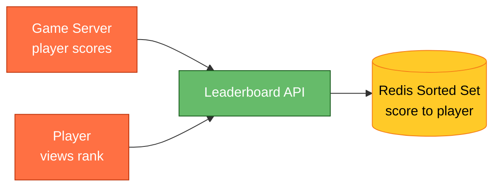
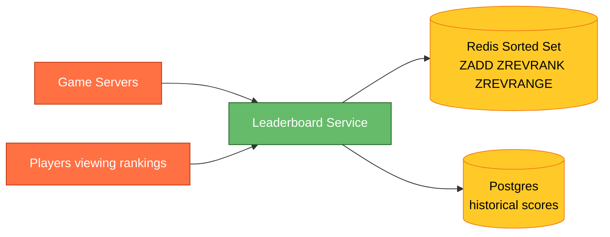
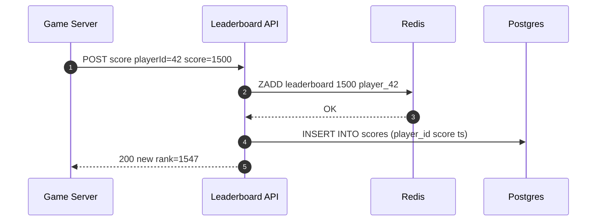
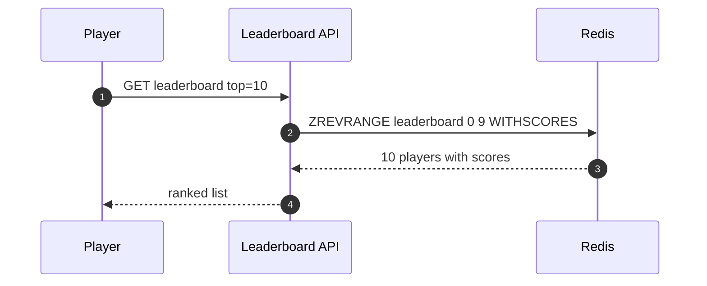

# Designing a Real-Time Leaderboard

⚡ **Difficulty:** Beginner
📋 **Prerequisites:** [System Design Fundamentals](/concepts) — especially Caching
⏱️ **Reading time:** 10 min

---

## TL;DR

A leaderboard shows ranked players by score. Redis Sorted Sets give you O(log N) score updates and O(log N) rank queries — perfect for real-time rankings of millions of players.



**In 3 sentences:** Player completes a level → game server sends the new score. Redis Sorted Set stores `(score, playerId)` and automatically maintains rank order. To get "top 100" or "my rank," Redis answers in microseconds.

---

## The Problem

You're building a game or competition with millions of players. You need:
1. Update a player's score
2. Get the top N players
3. Get a specific player's rank
4. Get players around a specific rank (e.g., rank 99–101)

All in real-time (< 50ms).

---

## Why Not Just Use a Database?

```sql
-- Get top 10
SELECT * FROM players ORDER BY score DESC LIMIT 10;

-- Get my rank
SELECT COUNT(*) + 1 FROM players WHERE score > (SELECT score FROM players WHERE id = ?);
```

**Problems:**
- ❌ `ORDER BY score DESC` on 10M rows = full table sort every query
- ❌ "My rank" requires counting ALL players with higher score = O(N)
- ❌ Under 10K QPS these queries would melt the database
- ❌ Adding an index helps reads but every score update moves the row in the index

---

## The Solution: Redis Sorted Set

> 💡 **Redis Sorted Set (ZSET)** stores members with a score. Members are unique; scores can repeat. Redis keeps them sorted internally using a skip list — O(log N) for insert, delete, and rank lookup.

### Key Operations

```
ZADD leaderboard 1500 "player_42"     → add/update score
ZREVRANK leaderboard "player_42"      → get rank (0-indexed, highest first)
ZREVRANGE leaderboard 0 9 WITHSCORES  → top 10
ZREVRANGE leaderboard 98 102 WITHSCORES → ranks 99-103 (around me)
ZCARD leaderboard                     → total players
ZSCORE leaderboard "player_42"        → get score
```

### All operations are O(log N)!

For 10 million players: log₂(10M) ≈ 23 comparisons. Microseconds.

---

## Architecture

**New components we need:**

1. **Game Servers** — the backend that runs your game logic and knows when a player's score changes.
2. **Leaderboard Service** — an API layer that translates "update score" and "get rank" requests into Redis commands.
3. **Redis Sorted Set** — the star of the show. A data structure that keeps players ordered by score automatically, giving O(log N) rank lookups. 💡 *Think of it as a self-sorting list — you add or update a score, and Redis instantly knows where that player ranks among millions.*
4. **Postgres** — the durable source of truth for score history and audit trail. If Redis goes down, we rebuild from here.



**Why two stores instead of just one database?** Redis gives us microsecond rank lookups (essential for real-time leaderboards at 10K QPS), but it's volatile — a restart could lose data. Postgres gives us durability and SQL flexibility (for "show me all scores from last Tuesday"), but it can't answer "what's player X's rank among 10M players?" without an expensive full-table sort. Together they cover both needs: speed for live rankings, permanence for history.

**Why two stores?**
- **Redis:** live leaderboard. Fast reads and writes. Volatile (can be rebuilt from DB).
- **Postgres:** source of truth. Stores score history, audit trail, handles persistence.

---

## API Design

```
POST /v1/scores
Body: { playerId, score }
→ updates the leaderboard

GET /v1/leaderboard?top=100
→ top 100 players with scores and ranks

GET /v1/leaderboard/rank?playerId=player_42
→ { rank: 1547, score: 1500 }

GET /v1/leaderboard/around?playerId=player_42&range=5
→ 5 players above and below player_42
```

---

## Flow: Score Update



## Flow: Get Top 10



---

## Deep Dives

### What if you have 100M+ players?

Redis sorted set handles 100M members on a single node (~6GB RAM). But if you need more:

**Option 1: Shard by score range**
- Shard 1: scores 0–999
- Shard 2: scores 1000–1999
- Combine top-N from each shard

**Option 2: Shard by region/game mode**
- `leaderboard:us`, `leaderboard:eu`, `leaderboard:global`
- Global = union of regional boards (computed periodically)

### What about ties (same score)?

Redis breaks ties **lexicographically by member name**. If you want "earlier score wins," encode timestamp into the score:

```
effective_score = actual_score * 10000000000 + (MAX_TIMESTAMP - timestamp)
```

Higher score wins. For same score, earlier timestamp has a higher effective score.

### Weekly/monthly resets?

```
RENAME leaderboard leaderboard:archive:2026-W25
DEL leaderboard:archive:2026-W25  (after persisting to DB)
```

Or use key per time period: `leaderboard:weekly:2026-W25`, `leaderboard:monthly:2026-06`.

---

## Key Technologies

| Term | What it is |
|---|---|
| **Redis Sorted Set (ZSET)** | Data structure that stores (score, member) pairs in sorted order. O(log N) operations. The backbone of real-time leaderboards everywhere. |
| **Skip List** | The internal data structure Redis uses for sorted sets. Like a linked list with "express lanes" for fast traversal. |
| **ZADD** | Redis command: add a member with a score (or update if member exists). |
| **ZREVRANK** | Redis command: get the rank of a member (0 = highest score). |
| **ZREVRANGE** | Redis command: get members by rank range (e.g., top 10 = range 0–9). |

---

## Interview Cheat Sheet

| Question | Answer |
|---|---|
| "How to get top N?" | `ZREVRANGE key 0 N-1` — O(log N + N) |
| "How to get my rank?" | `ZREVRANK key playerId` — O(log N) |
| "Why not SQL?" | `ORDER BY score DESC` is O(N log N); rank count is O(N). Redis is O(log N) for both. |
| "How to handle 100M players?" | Single Redis ZSET handles it (~6GB). Shard if needed. |
| "How to handle ties?" | Encode timestamp into score for tie-breaking |
| "What about persistence?" | Redis for live reads. Postgres for source of truth and history. |

---
## Related Designs
- [Rate Limiter](/RateLimiter) — Redis patterns
- [URL Shortener](/URLShortner) — caching and CDN
- [Twitter Feed](/TwitterFeed) — real-time updates to users
