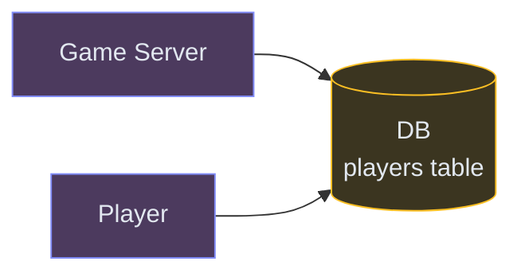
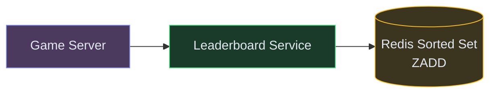
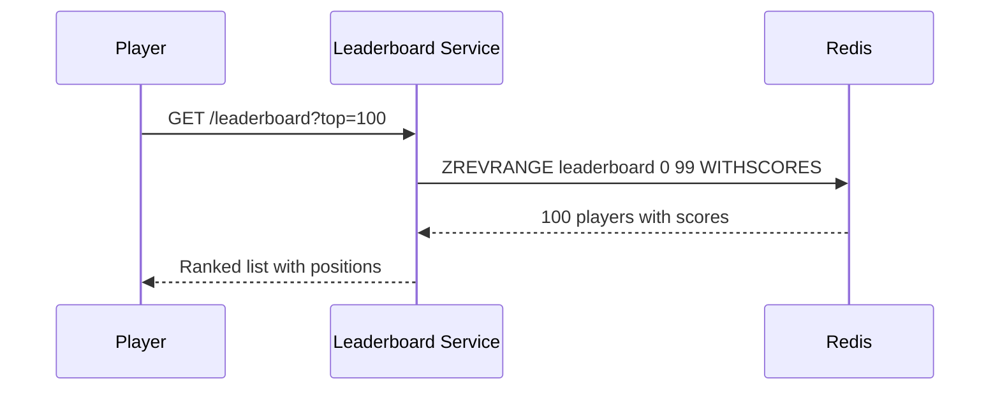
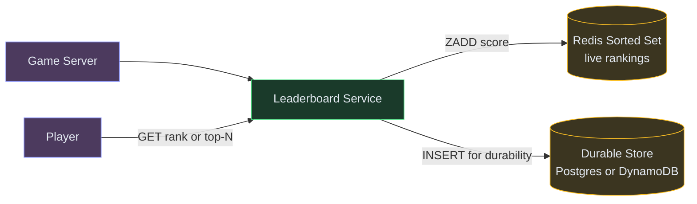
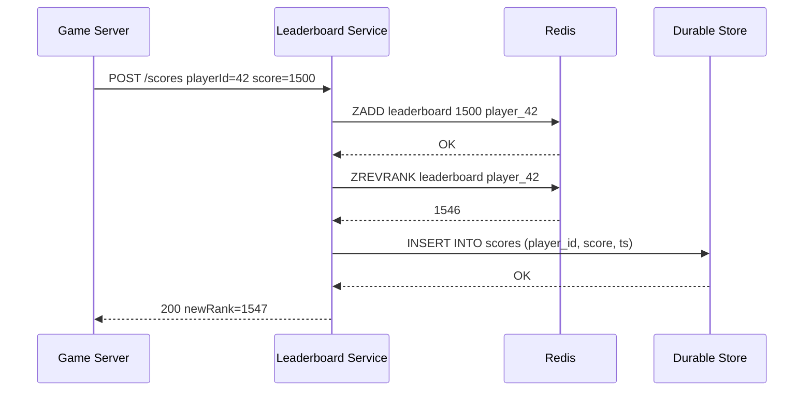
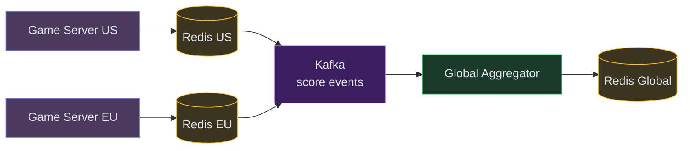
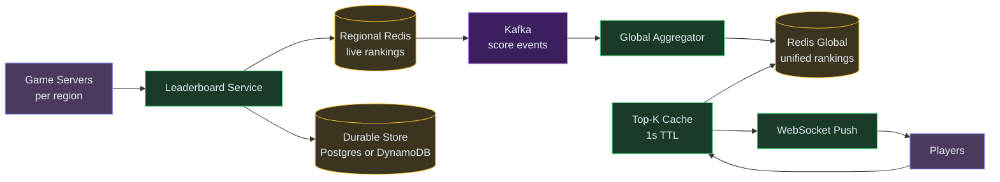

# Designing a Real-Time Leaderboard

**Difficulty:** Beginner **Topics:** Redis Sorted Sets, Sharding, Real-Time Updates **Asked at:** Dream11, Riot Games, Amazon, Google
**Prerequisites:**[Caching](/concepts/caching/)

---

## 1. Understanding the Problem

You're building a game or competition with millions of players. Players earn scores, and you need to show a ranked leaderboard in real-time. Anyone can check their rank, see the top players, or see who's around them - all in under 50ms.

**Real examples:** Dream11 fantasy cricket (live scoring), Riot Games ranked mode (100M+ players), Duolingo weekly leaderboards, Strava segments.

---

## 1.5. Naive First Cut



Store scores in a SQL table. Query rankings with `ORDER BY score DESC`.

```sql
-- Get top 10
SELECT * FROM players ORDER BY score DESC LIMIT 10;

-- Get my rank
SELECT COUNT(*) + 1 FROM players WHERE score > (SELECT score FROM players WHERE id = 42);
```

**Why this breaks:**

- `ORDER BY score DESC` on 10M rows = full table sort every query
- "My rank" requires counting ALL players with higher scores = O(N) per query
- At 100K rank queries/sec during a live event, the database melts
- Every score update reshuffles the index - write-heavy workloads degrade reads
- No way to serve "ranks around me" efficiently without scanning

We need a data structure that keeps players sorted automatically and answers rank queries in O(log N), not O(N).

---

## 1.7. Prior Art We're Drawing From

- **Redis Sorted Sets** - Skip-list backed sorted set giving O(log N) for all rank operations. The de-facto standard for real-time leaderboards. Used by Dream11, Riot Games, and most gaming platforms. ([Redis documentation](https://redis.io/docs/data-types/sorted-sets/))
- **Riot Games Leaderboard** - Handles 100M+ ranked players across multiple regions with composite scoring (MMR + LP). Uses Redis with regional sharding. ([Riot Engineering](https://technology.riotgames.com/))
- **Discord Activity Status** - Real-time presence and activity leaderboards for millions of concurrent users using Redis pub/sub + sorted sets. ([Discord Engineering](https://discord.com/blog/how-discord-stores-trillions-of-messages))

---

## 2. Functional Requirements

### Core (Top 3)

1. **Update a player's score** - when a player completes an action (wins a match, answers a question), their score changes
2. **Get top N players** - show the leaderboard: top 10, top 100, etc.
3. **Get a player's rank** - "what position am I?" among all players

### Below the Line

- Get players around a specific rank (e.g., rank 99–101)
- Multiple leaderboards (daily, weekly, all-time)
- Real-time push updates (WebSocket) when ranks change
- Anti-cheat validation

---

## 3. Non-Functional Requirements

| NFR | Target |
|---|---|
| **Latency** | < 50ms for rank queries and score updates |
| **Throughput** | 50K score updates/sec + 100K rank reads/sec during live events |
| **Availability** | 99.99% - leaderboard is the main engagement feature |
| **Scale** | 10M+ players per leaderboard |

---

## Scale Estimation

- **Users:** 10M players, 1M concurrent during live events
- **Write QPS:** 50K score updates/sec during live events
- **Read QPS:** 100K rank queries/sec (leaderboard page loads)
- **Storage:** ~6GB in Redis for 10M entries (key + score + overhead)

---

## 4. Core Entities

- **Player** - user with a unique ID and a current score
- **Score** - numeric value representing the player's performance
- **Leaderboard** - a named sorted collection (e.g., `leaderboard:weekly:2026-W26`)
- **Rank** - player's position (1 = highest score)

---

## 5. API / System Interface

```text
POST /v1/scores
  Body: { playerId, score, gameId }
  Response: 200 { newRank: 1547 }

GET /v1/leaderboard?top=100
  Response: [{ playerId, score, rank }, ...]

GET /v1/leaderboard/rank?playerId=player_42
  Response: { rank: 1547, score: 1500 }

GET /v1/leaderboard/around?playerId=player_42&range=5
  Response: [5 above, player_42, 5 below] with ranks
```

> **Security note:** Score updates should only come from trusted game servers (server-to-server auth), never directly from client apps. Clients can only READ ranks.

---

## 6. High-Level Design

Let's build this incrementally, one requirement at a time.

### FR1: Update a Player's Score

The first thing we need: when a player scores, update the leaderboard instantly. The naive SQL approach fails at scale (see above). We need a data structure designed for sorted data with fast updates.

**The solution: Redis Sorted Set (ZSET).**<br>💡 *A Redis Sorted Set stores (score, member) pairs and keeps them sorted automatically. Internally it uses a skip list - like a linked list with "express lanes" - giving O(log N) for insert, update, and rank lookup. For 10M players: log₂(10M) ≈ 23 comparisons. Microseconds.*

**New components:**

1. **Game Server** - the backend running your game logic. Knows when a player's score changes. Authoritative source of truth for scores.
2. **Leaderboard Service** - API layer that translates business requests into Redis commands.
3. **Redis Sorted Set** - the star. `ZADD` to add/update scores, maintains sorted order automatically.



**Step-by-step flow:**

1. Player wins a match → Game Server calculates new score (1500)
2. Game Server calls Leaderboard Service: `POST /scores { playerId: "player_42", score: 1500 }`
3. Leaderboard Service executes: `ZADD leaderboard 1500 "player_42"`
4. Redis updates the skip list - player is now in sorted position. Done in ~0.1ms.
5. Service returns the player's new rank (optional: `ZREVRANK leaderboard "player_42"`)

**Why Redis and not a database?** At 50K writes/sec during live events, a database index rebuild would lag behind. Redis keeps everything in memory with O(log N) operations - microsecond response regardless of dataset size.

---

### FR2: Get Top N Players

Now players want to see the leaderboard. "Show me the top 100." With our Redis Sorted Set already maintaining sorted order, this is trivial.

**No new components needed** - Redis already has this built in.

**Step-by-step flow:**

1. Player opens leaderboard page → `GET /leaderboard?top=100`
2. Leaderboard Service executes: `ZREVRANGE leaderboard 0 99 WITHSCORES`
3. Redis returns 100 players sorted by score (highest first) - O(log N + 100)
4. Service returns the ranked list to the client



**But what about durability?** Redis is in-memory - if it restarts, the leaderboard is gone. We need a persistent backup.

**New component:**

4. **Durable Store (Postgres / DynamoDB)** - source of truth. Every score update is also written here. If Redis goes down, we rebuild the Sorted Set from this store.



**Why two stores?** Redis gives microsecond rank lookups (essential for 100K QPS). The durable store (Postgres or DynamoDB) gives persistence — if Redis restarts, we rebuild from it. Pick Postgres if you need ad-hoc SQL queries over history; pick DynamoDB if you want zero-ops and infinite scale with simple key-value access patterns.

---

### FR3: Get a Player's Rank

The most frequent query: "What's MY rank?" With 10M players, this must be instant.

**Still no new components** - Redis Sorted Set handles this natively.

```text
ZREVRANK leaderboard "player_42"  → returns 1546 (0-indexed)
```

O(log N). For 10M players: ~23 operations internally. Microseconds.

**Step-by-step flow:**

1. Player taps "My Rank" → `GET /leaderboard/rank?playerId=player_42`
2. Service executes: `ZREVRANK leaderboard "player_42"` → returns 1546
3. Service also gets score: `ZSCORE leaderboard "player_42"` → returns 1500
4. Returns `{ rank: 1547, score: 1500 }` (converting 0-indexed to 1-indexed)

**"Players around me"** is equally simple:
```text
ZREVRANGE leaderboard 1541 1551 WITHSCORES  → 11 players around rank 1547
```

This completes all three core functional requirements with just Redis + a durable store. Now let's address scale.

---

## 6.5. Core Flows

### Flow: Score Update (Full)



**Non-obvious failure:** What if the Redis write succeeds but the DB insert fails? The live leaderboard shows the new score, but if Redis restarts later, this score is lost during rebuild. Solution: log failed DB writes to a dead-letter queue and retry. Or make the DB write synchronous (acceptable at 50K WPS for a single INSERT).

---

## 7. Deep Dives

### Deep Dive 1: Regional Sharding - What Happens During a Global Live Event

**Problem:** Your game operates worldwide. Players in Asia, Europe, and US all compete. If Redis lives in `us-east-1`, Asian players get 200ms latency on every interaction. That's unacceptable for "real-time."

**Bad:** Single global Redis in one region. All players hit it remotely. High latency for 2/3 of the world.

**Good:** Regional Redis instances. Each region has its own leaderboard. Writes are local (<5ms). Players see their regional ranking instantly.

**Great:** Regional Redis for writes + async global aggregation for unified rankings. A Kafka-based pipeline merges regional scores into a global leaderboard with 100-500ms lag. For a leaderboard, this is invisible to users.

**In simple terms:** Each region (US, EU, Asia) has its own leaderboard for instant local updates. A background job merges them into one global leaderboard every few hundred milliseconds. Users don't notice the tiny delay.



**Consistency tradeoff:** The global leaderboard lags regional by 100-500ms (Kafka consumer lag). For a leaderboard, this is perfectly acceptable - no one notices their global rank updating 300ms late.

---

### Deep Dive 2: Tie-Breaking - When Two Players Have the Same Score

**Problem:** Redis Sorted Sets break ties lexicographically by member name. If Player A and Player B both have score 1500, their rank order is alphabetical. But you probably want "whoever scored first ranks higher."

**In simple terms:** Two players both have 1500 points. Who gets the higher rank? Redis will just sort by their name alphabetically - that's unfair. We need a better tie-breaker.

**Bad:** Accept lexicographic tie-breaking. Players named "Aaron" always rank above "Zeus" on ties. Not fair.

**Good:** Encode timestamp into the score itself. Combine the actual score with the time they achieved it into ONE number:

```
effective_score = actual_score × 10_000_000_000 + (MAX_TIMESTAMP - timestamp)
```

**How this works with an example:**
- Player A scores 1500 at timestamp 1000 → effective = 1500 × 10B + (MAX - 1000)
- Player B scores 1500 at timestamp 2000 → effective = 1500 × 10B + (MAX - 2000)
- Player A's effective score is HIGHER (because MAX-1000 > MAX-2000)
- So Player A ranks above Player B (earlier scorer wins)

Redis stores scores as float64 - this works for scores up to ~100M with millisecond precision.

**Great:** For complex tie-breaking (score → then win-rate → then games played), use a composite score with weighted fields packed into a single number. Alternatively, maintain a secondary sorted set for the tiebreaker dimension and resolve in the application layer.

---

### Deep Dive 3: Weekly Resets and Historical Leaderboards

**Problem:** Many games have weekly/seasonal leaderboards that reset. How do you atomically start a fresh leaderboard without downtime?

**In simple terms:** Every Monday, the leaderboard should start fresh (everyone back to 0). But how do you swap to a new empty leaderboard without players seeing a blank page for even a second?

**Bad:** `DEL leaderboard` → create new one. Between delete and first writes, players see empty leaderboard. Even if just for 100ms, during that gap any rank query returns nothing.

**Good:** Use time-bucketed keys: `leaderboard:weekly:2026-W26`. When the week changes, new writes go to the new key. Old key stays readable until archived. No deletion needed.

**Great:** Redis `RENAME` for atomic swap:

```
RENAME leaderboard:current leaderboard:archive:2026-W25
```

This is atomic - zero gap. In a single operation: the current leaderboard becomes the archive, and a new empty `leaderboard:current` can be created immediately. Persist the archive to the durable store for historical queries, then delete from Redis after a day.

---

### Deep Dive 4: Read Amplification During Live Events

**Problem:** During a tournament final, 1M players all load the leaderboard simultaneously. They're all asking for the same "top 100." That's 1M identical `ZREVRANGE` calls hitting Redis.

**In simple terms:** A million people asking the exact same question ("who's in the top 100?") at the same time. Even though each individual question is cheap, a million of them overwhelms even Redis.

**Bad:** Let all 1M requests hit Redis directly. Even though each ZREVRANGE is O(log N + 100), at 1M QPS the network bandwidth saturates the Redis node (each response is ~5KB × 1M = 5GB/sec of bandwidth).

**Good:** Application-level cache. Cache the "top 100" result with a 1-second TTL. First request computes it from Redis, caches the result. The next 999,999 requests in that second are served from cache. Only 1 request/second actually hits Redis.

**Great:** Dedicated "Top-K Cache" service with 1s TTL + WebSocket push for live updates. Instead of players polling "show me the top 100" repeatedly, the server pushes the updated top 100 to all connected players once per second via WebSocket. Zero polling, zero Redis load from viewers.

**How it works:**
1. A background job runs `ZREVRANGE` once per second → gets the latest top 100
2. Compares with previous top 100 → computes the diff (who moved up/down)
3. Pushes the diff to all connected WebSocket clients
4. Client updates the UI smoothly (player 5 moved to position 3, new score: 2450)

---

## 7.5. Design Self-Audit

| Question | Answer |
|---|---|
| Hot key problem? | The leaderboard IS a single key. But Redis ZSET handles 100K+ ops/sec per key. For extreme load, cache top-N results. |
| Redis goes down? | Rebuild from the durable store (Postgres or DynamoDB). Takes minutes for 10M entries. During rebuild, serve stale data from a read replica or return "temporarily unavailable." |
| Memory budget? | 10M entries × ~600 bytes = ~6GB in Redis. Comfortable for any cloud Redis instance. |
| Anti-cheat? | Only game servers (authenticated) can submit scores. Never trust client-submitted scores. |

---

## 8. Final Architecture

This diagram brings together every "Great" choice from the deep dives: regional Redis for low-latency writes, a Kafka pipeline feeding a global aggregator (Deep Dive 1), a durable store for rebuilds, and a Top-K cache with WebSocket push for read amplification (Deep Dive 4).



---

## Key Technologies

| Term | What it is |
|---|---|
| **Redis Sorted Set (ZSET)** | O(log N) operations for insert, rank lookup, and range queries. The backbone of real-time leaderboards. |
| **Skip List** | Internal data structure Redis uses for sorted sets. Linked list with express lanes for fast traversal. |
| **ZADD** | Add or update a member's score. O(log N). |
| **ZREVRANK** | Get rank of a member (0 = highest score). O(log N). |
| **ZREVRANGE** | Get members by rank range (top 10 = range 0-9). O(log N + K). |

---

## What's Expected at Each Level

### Mid-level

Propose Redis Sorted Set for real-time ranking. Understand ZADD for updates and ZREVRANK for rank queries. Explain why SQL `ORDER BY` doesn't scale - it's O(N log N) per query vs O(log N) in Redis. Know that Redis is in-memory and needs a persistent backup (Postgres or DynamoDB).

### Senior

Discuss regional sharding - local Redis per geography for low-latency writes. Explain tie-breaking with timestamp encoding. Propose dual-store (Redis for speed, Postgres/DynamoDB for durability). Discuss the "1M viewers asking for top 100" problem and how application-level caching with short TTL solves it.

### Staff+

Design the tiered architecture for global live events: regional Redis + Kafka + global aggregator. Discuss WebSocket push for live rank updates (only push diffs for visible positions). Address read amplification with a dedicated Top-K cache. Cover anti-cheat (server-authoritative scoring), weekly resets via atomic `RENAME`, and memory budgeting (~6GB per 100M entries).

---

## 🎯 Key Takeaways

- **Redis Sorted Set** gives O(log N) rank queries and updates - microseconds for millions of players
- **ZREVRANGE** for top-N, **ZREVRANK** for "my rank" - both sub-millisecond
- **Separate hot store (Redis) from durable store (Postgres or DynamoDB)** for speed + durability
- **Cache the top-K** during live events to handle millions of identical reads

---

## Related Designs

- [Rate Limiter](/hld/RateLimiter) - Redis patterns, counters, sliding windows
- [URL Shortener](/hld/URLShortner) - caching and CDN patterns
- [Twitter Feed](/hld/TwitterFeed) - real-time updates pushed to users


---

## Related Concepts

Understand the building blocks used in this design:

- [Caching →](/concepts/caching/) — Redis sorted sets serve real-time rank queries in-memory
- [Database Sharding →](/concepts/database-sharding/) — partitions scores across segments when a single node can't hold the set
- [Consistency Models →](/concepts/consistency-models/) — trades exact rank freshness against read latency at scale
