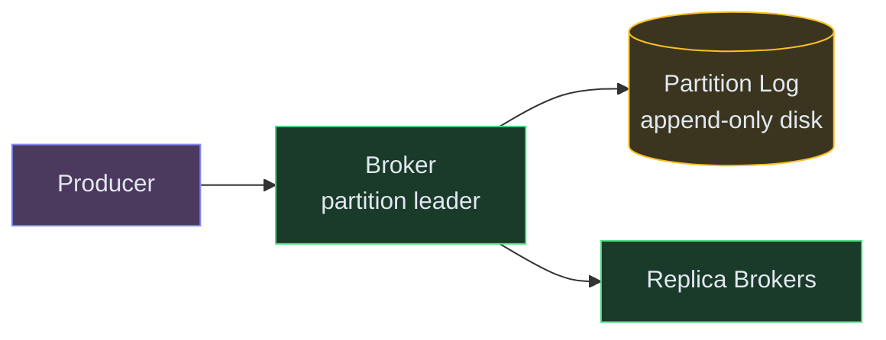
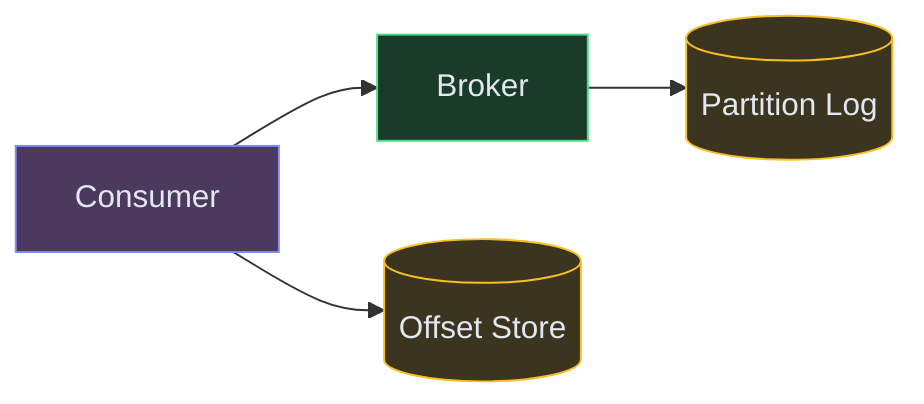
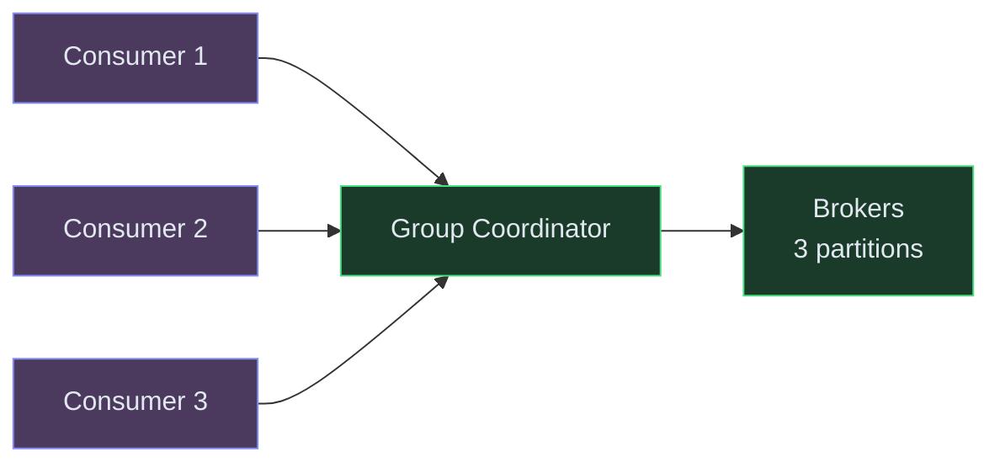

# Designing a Distributed Message Queue (Kafka)

**Difficulty:** Advanced
**Prerequisites:**[Scalability](/concepts/scalability/), [Database Replication](/concepts/database-replication/), and [Leader Election](/concepts/leader-election/)

---

## Understanding the Problem

A distributed message queue decouples producers from consumers — services publish events without knowing who consumes them, and consumers process at their own pace. The hard engineering problems: guaranteeing no message loss when brokers crash, maintaining strict ordering within a partition while allowing parallel consumption, and achieving exactly-once semantics where networks are unreliable.

---

## Naive First Cut


Why this breaks:
- In-memory queue — server restart loses all messages
- Single server throughput caps at ~100K msg/sec; can't scale horizontally
- No ordering guarantees — consumers get messages in random order under load
- One slow consumer blocks all others (head-of-line blocking)
- No replication — server crash = permanent message loss

---

## Functional Requirements

### Core (top 3)
1. **Publish messages** — producers write messages to a named topic with ordering guarantees
2. **Consume messages** — consumers read messages in order, at their own pace, without losing any
3. **Consumer groups** — multiple instances of a consumer share the workload (each message delivered to exactly one member)

### Below the Line
- Message TTL/retention, dead-letter queues, schema registry, exactly-once transactions, multi-DC replication

---

## Non-Functional Requirements

- **Throughput** — 1M messages/second sustained per topic
- **Durability** — no message loss even with N-1 broker failures (replication factor N)
- **Ordering** — strict ordering within a partition
- **Latency** — publish-to-consume in <10ms (P99) for real-time use cases

---

## Core Entities

- **Topic** — named channel for a category of messages (e.g., "orders", "clicks")
- **Partition** — ordered, immutable sequence of messages within a topic; unit of parallelism
- **Message** — key, value, timestamp, offset within its partition
- **Consumer Group** — set of consumers that coordinate to consume a topic (each partition assigned to exactly one member)

---

## API

```text
POST /v1/topics/{topic}/publish
  Body: { key: "user_42", value: { event: "order_placed", ... } }
  Response: { partition: 3, offset: 157892 }

GET /v1/topics/{topic}/consume?group=order-service&partition=3&offset=157890
  Response: [{ key, value, offset, timestamp }, ...]

POST /v1/topics
  Body: { name: "orders", partitions: 12, replicationFactor: 3 }
  Response: { topicId, partitions: 12 }
```

---

## High-Level Design

### FR1: Publish Messages

Producers send messages to a Broker. The Broker appends to the partition's log (an append-only file on disk). The partition is determined by hashing the message key.



### FR2: Consume Messages

Consumers pull messages from the partition leader starting from their last committed offset. After processing, they commit the new offset. On restart, they resume from the committed offset — no message loss.



### FR3: Consumer Groups

A coordinator assigns partitions to group members. Each partition goes to exactly one consumer. When a member joins/leaves, partitions are rebalanced.



---

## Deep Dives

### Deep Dive 1: Durability — surviving broker crashes

**Bad:** Single broker, data on one disk. Disk failure = all messages in that partition permanently lost. Consumers will have gaps they never know about.

**Good:** Replicate each partition to N brokers (replication factor 3 is standard). One is the leader (handles reads/writes), others are followers that replicate the log. If the leader dies, a follower promotes to leader. No data loss as long as at least one replica survives.

**Great:** Use ISR (In-Sync Replicas). A follower is "in-sync" if it's caught up within a configurable lag. The producer can choose acknowledgment level: `acks=all` waits for all ISR replicas to confirm the write before responding. This guarantees zero message loss even if the leader crashes immediately after the write. Trade-off: slightly higher publish latency (extra replication round-trip). For non-critical topics, `acks=1` (leader only) gives lower latency at the risk of losing the last few messages on leader crash.

### Deep Dive 2: Ordering guarantees with parallel consumption

**Bad:** Multiple consumers read from the same partition simultaneously. Messages arrive out of order. An "order cancelled" event is processed before "order placed" — corrupting state.

**Good:** Strict rule: one partition = one consumer (within a group). Messages within a partition are always consumed in order. Parallelism comes from having multiple partitions. Key-based routing ensures all events for the same entity (e.g., same order ID) go to the same partition → same consumer → processed in order.

**Great:** Handle the "hot partition" problem. If one key (e.g., a viral user) generates 90% of traffic, its partition becomes a bottleneck. Solution: allow sub-partitioning or "partition splitting" where a hot partition is temporarily split into two. Alternatively, for cases where strict ordering isn't needed between independent sub-entities, use a finer-grained key (e.g., `order_id` instead of `user_id`) to distribute load more evenly.

### Deep Dive 3: Exactly-once delivery semantics

**Bad:** Consumer processes a message, then crashes before committing the offset. On restart, it re-processes the same message. If the consumer's side effect is "charge the customer," the customer is double-charged.

**Good:** Make the consumer idempotent. Track processed message offsets (or idempotency keys) in the consumer's own database. Before processing, check if already done. This gives at-least-once delivery with effectively-once semantics at the application layer.

**Great:** Use transactional produce + consume. The consumer reads a message, processes it, writes the output to another topic AND commits the offset — all in a single atomic transaction (Kafka's transactional API). If any part fails, the entire transaction rolls back. Combined with producer idempotency (sequence numbers per partition), this achieves true exactly-once from end to end within the queue system. External side effects (DB writes, HTTP calls) still need application-level idempotency.

---

## What's Expected at Each Level

| Level | Expectations |
|---|---|
| **Mid** | Append-only log concept. Partitioning for parallelism. Consumer groups with offset tracking. Replication for durability. |
| **Senior** | ISR and acks semantics. Key-based routing for ordering. At-least-once + idempotent consumers. Leader election on broker failure. |
| **Staff+** | Transactional exactly-once semantics. Hot partition detection and mitigation. Tiered storage (recent on SSD, old on object storage). Back-of-envelope on partition count vs throughput. |
