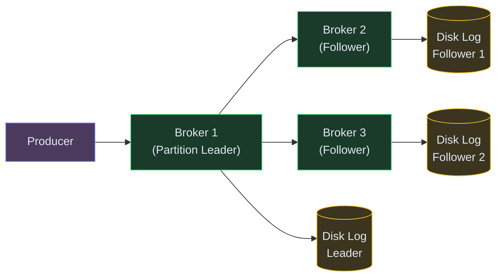
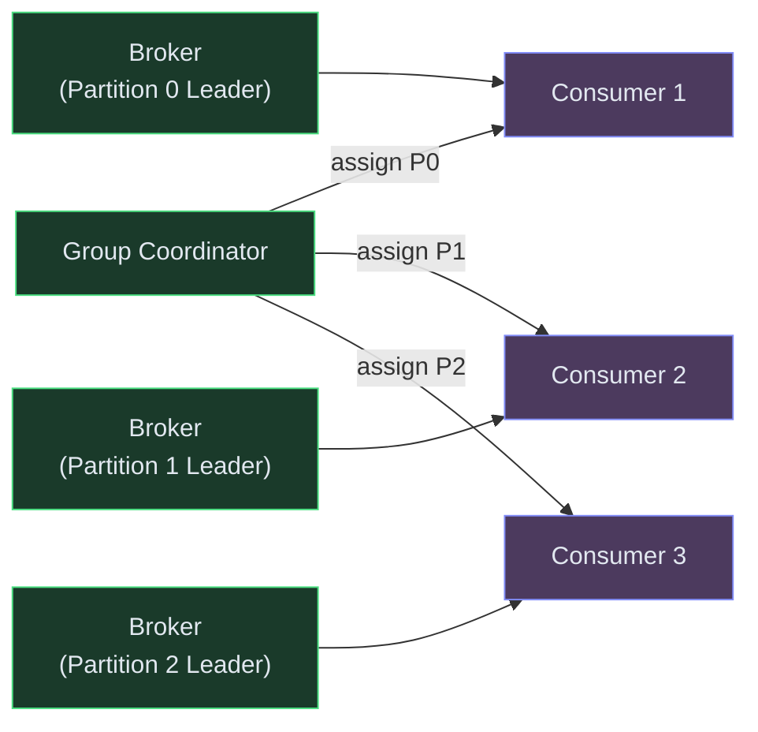
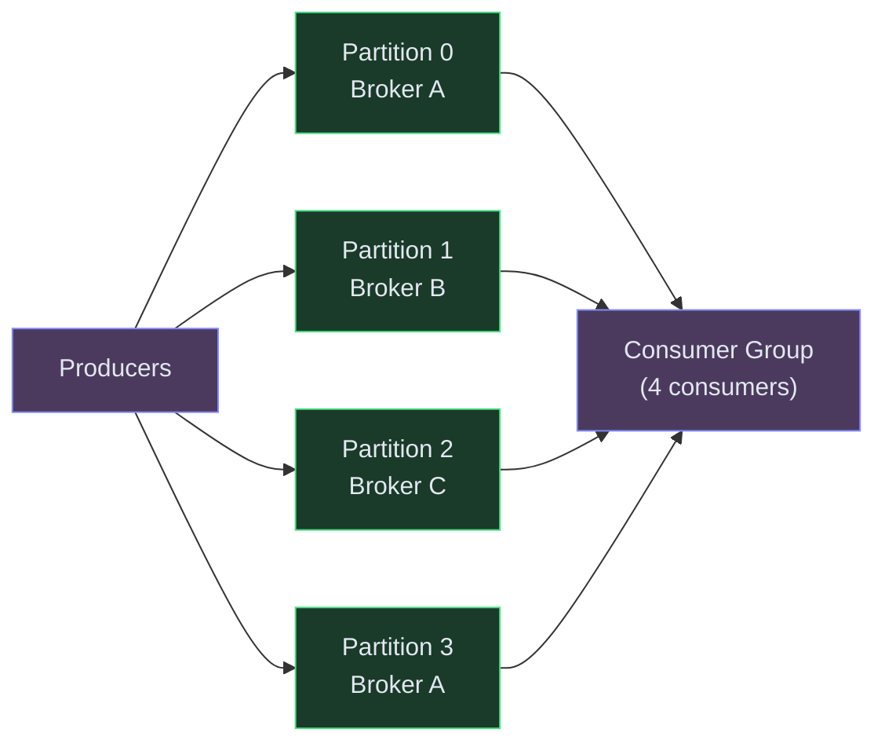
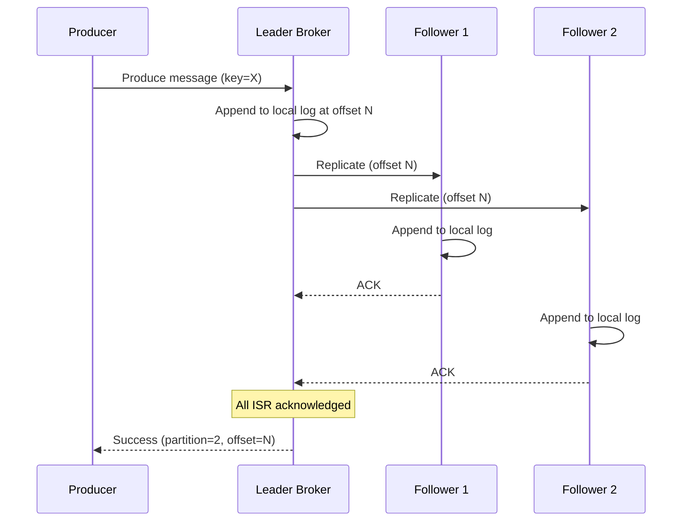
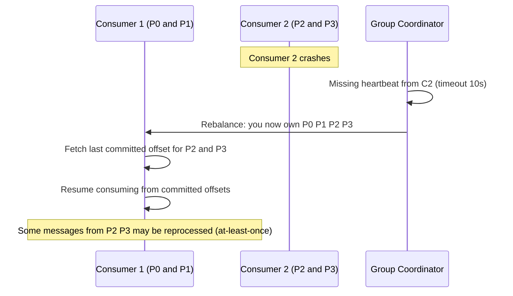
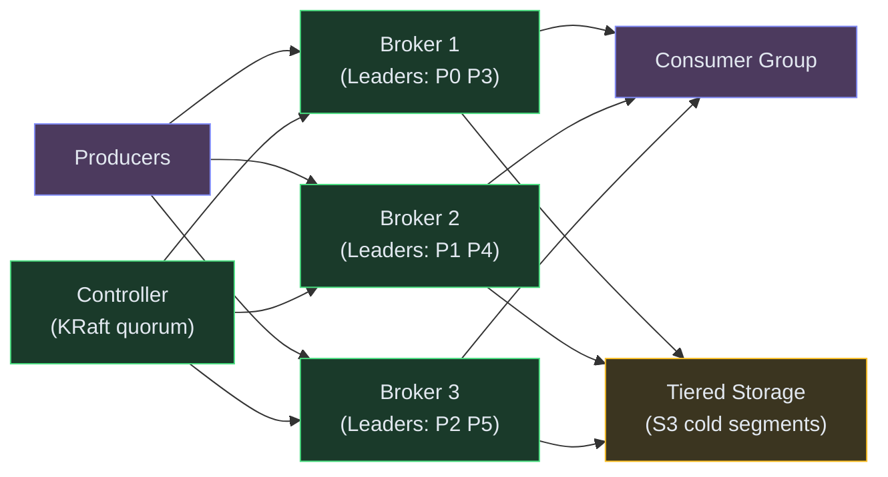

# Designing a Distributed Message Queue (Kafka)

**Difficulty:** Advanced **Topics:** Partitioned Log, Consumer Groups, Exactly-Once Delivery, Replication, Ordering **Asked at:** Google, Amazon, Microsoft, LinkedIn, Uber, Confluent
**Prerequisites:** [Fundamentals](/concepts) - especially [Distributed Systems basics](/concepts#distributed-systems), [Replication](/concepts#replication), and [Consensus](/concepts#consensus)

---

## 1. Understanding the Problem

A distributed message queue decouples producers from consumers — services publish events without knowing who consumes them, and consumers process at their own pace without blocking producers. The hard engineering problems: guaranteeing no message loss even when brokers crash, maintaining strict ordering within a partition while allowing parallel consumption, and achieving exactly-once semantics in a distributed system where networks are unreliable.

**Real examples:** Apache Kafka, Amazon Kinesis, Google Pub/Sub, RabbitMQ, Apache Pulsar, Redpanda.

---

## 1.5. Naive First Cut


In-memory FIFO queue on a single server. Producer pushes, consumer pops.

**Why this breaks:**

- Server crash = all messages lost (in-memory, no persistence)
- Single server limits throughput to one machine's I/O (~100K msg/sec)
- One consumer means no parallel processing — throughput bottlenecked by consumer speed
- No replay — once a message is consumed, it's gone (can't reprocess after a bug fix)
- No ordering guarantees when you add multiple consumers
- No backpressure — if consumers are slow, memory fills up and the server OOMs

The rest of the doc evolves this into a replicated, partitioned, persistent log with consumer groups.

---

## 1.7. Prior Art We're Drawing From

- **LinkedIn Kafka** - Invented the partitioned commit log model. Messages are appended to an immutable, ordered log. Consumers track their own position (offset) and can replay from any point. This single abstraction replaced dozens of point-to-point queues at LinkedIn. ([LinkedIn Engineering](https://engineering.linkedin.com/distributed-systems/log-what-every-software-engineer-should-know-about-real-time-datas-unifying))
- **Amazon Kinesis Shards** - Similar to Kafka partitions but with a different scaling model: throughput is provisioned per shard (1MB/sec write, 2MB/sec read). Auto-scaling splits hot shards when write capacity is exceeded.
- **Google Pub/Sub** - Separates the concept of "topic" from "subscription." Multiple subscriptions to the same topic each get independent message delivery — no consumer group coordination needed. Messages are stored until acknowledged (pull-based with ACK deadlines).
- **Redpanda (Raft-based replication)** - Replaces Kafka's ZooKeeper-based controller with embedded Raft consensus per partition. Simplifies operations and provides stronger consistency guarantees during leader elections. ([Redpanda Blog](https://redpanda.com/blog))

---

## 2. Technology Choices

| Tier | Purpose | Stores | Access Pattern | Primary Pick | Alternatives |
|---|---|---|---|---|---|
| Broker storage | Message persistence | Ordered log segments per partition | Sequential append + sequential read | On-disk log files (ext4/XFS) | Tiered storage (S3 for cold segments) |
| Metadata store | Topic and partition config | Cluster topology and assignments | Strongly consistent reads | Raft-embedded (KRaft) / etcd | ZooKeeper (legacy) |
| Replication | Fault tolerance | Replica logs on follower brokers | Synchronous append from leader | ISR (In-Sync Replicas) model | Raft per partition |
| Offset store | Consumer position tracking | Consumer group offsets | Atomic commit per partition | Internal compacted topic | External store (Redis, Postgres) |
| Schema registry | Message schema evolution | Avro/Protobuf schemas | Lookup by schema ID | Confluent Schema Registry | Apicurio / AWS Glue |

**Why an on-disk append-only log?** Sequential disk writes are nearly as fast as memory (~600MB/sec on modern SSDs). By only appending (never random writes), the message broker achieves 1M+ messages/sec per partition with commodity hardware. The OS page cache serves recent reads from memory transparently — no custom caching needed.

---

## 3. Functional Requirements

### Core (Top 3)

1. **Publish messages to a topic** - producers write messages to named topics with guaranteed durability (acknowledged only after replication)
2. **Consume messages with ordering** - consumers in a group process messages in partition order, exactly once, with the ability to replay from any offset
3. **Scale throughput horizontally** - adding partitions and brokers increases capacity linearly without downtime

### Below the Line

- Message filtering (server-side tag-based routing)
- Dead-letter queues for poison messages
- Message TTL and compaction (retain latest per key)
- Transactions across multiple topics
- Multi-region replication

---

## 4. Non-Functional Requirements

### Core

- **Throughput:** 1M+ messages/sec per cluster (with appropriate partitions)
- **Latency:** Produce-to-consume P99 < 10ms (within a single datacenter)
- **Durability:** Zero message loss — acknowledged writes survive broker crashes
- **Ordering:** Strict ordering within a partition (total order)

### Below the Line

- 7-day default retention (configurable to infinite)
- Exactly-once semantics (with idempotent producers + transactional consumers)
- Graceful broker addition/removal without message loss

---

## 5. Core Entities

- **Topic** - a named stream that producers write to and consumers subscribe to
- **Partition** - an ordered, immutable log within a topic (the unit of parallelism)
- **Message** - a key-value pair with headers and a timestamp, appended at an offset
- **Offset** - the position of a message within a partition (monotonically increasing integer)
- **ConsumerGroup** - a set of consumers that collectively process a topic (each partition assigned to exactly one consumer in the group)
- **Broker** - a server that stores partitions and serves produce/consume requests

---

## 6. API / System Interface

```
POST /v1/topics/{topic}/produce
Body: {
  "messages": [
    {"key": "user_123", "value": "{\"event\":\"purchase\",\"amount\":500}", "headers": {"trace_id": "t1"}},
    ...
  ],
  "acks": "all"  // wait for all ISR replicas
}
Response: {"offsets": [{"partition": 2, "offset": 10542}]}
```

```
POST /v1/topics/{topic}/consume
Body: {
  "group_id": "payment-processor",
  "max_messages": 100,
  "timeout_ms": 5000
}
Response: {
  "messages": [{"partition": 2, "offset": 10542, "key": "user_123", "value": "...", "timestamp": 1720000000}],
  "has_more": true
}
```

```
POST /v1/topics/{topic}/commit
Body: {"group_id": "payment-processor", "offsets": {"2": 10543}}
Response: 200 OK
```

Security notes: produce/consume authenticated via SASL. ACLs per topic (which services can produce/consume). Encryption in-transit (TLS) and optionally at-rest (broker disk encryption).

---

## 7. High-Level Design

### FR1: Publish messages (durable, replicated writes)

A producer writes to the leader replica of a partition. The leader replicates to followers before acknowledging — guaranteeing durability.



**Flow:**
1. Producer hashes the message key to determine the target partition (consistent hashing → same key always goes to same partition → ordering preserved per key)
2. Producer sends to the partition's leader broker
3. Leader appends to its local log on disk (sequential write)
4. Leader replicates to all in-sync replicas (ISR) in parallel
5. Once all ISR acknowledge → leader responds to producer with offset
6. If acks=all: message is durable (survives any single broker crash). If acks=1: faster but risks loss on leader crash.

---

### FR2: Consume messages with ordering (consumer groups)

Each partition is assigned to exactly one consumer in a group. This guarantees ordering within a partition while allowing parallel consumption across partitions.



**Flow:**
1. Consumers join a group and send heartbeats to the Group Coordinator
2. Coordinator assigns partitions to consumers (range or round-robin strategy)
3. Each consumer fetches messages from its assigned partitions sequentially (respecting offset order)
4. Consumer processes a batch, then commits its offset (marks messages as "done")
5. If a consumer crashes, coordinator detects missing heartbeat and reassigns its partitions to survivors
6. Survivors resume from the last committed offset — no message loss, possible re-delivery (at-least-once)

---

### FR3: Scale throughput (partitioning)

Throughput scales linearly with partitions. More partitions = more parallel producers and consumers.



**Flow:**
1. Topic created with N partitions distributed across brokers
2. Each partition handles ~100K msg/sec (limited by disk I/O of one broker)
3. Adding more partitions = more total throughput (4 partitions = ~400K msg/sec)
4. Consumer group scales to N consumers (one per partition) for maximum parallelism
5. Adding more consumers beyond N provides no benefit (idle consumers)
6. To scale further: add partitions + brokers (online, no downtime)

---

## 6.5. Core Flows

### Flow 1: Produce with Replication



**Non-obvious failure path:** Follower 2 is slow (network issue). If it falls too far behind, the leader removes it from the ISR set. Now acks=all only requires Follower 1's ACK. When Follower 2 catches up, it rejoins ISR. This prevents a slow follower from blocking all writes.

---

### Flow 2: Consumer Rebalance (failure recovery)



**Non-obvious failure:** Consumer 2 crashed after processing messages but BEFORE committing offsets. Those messages will be redelivered to Consumer 1. The consumer must be idempotent (handle duplicates gracefully) or use exactly-once transactions.

---

## 7. Deep Dives

### Deep Dive 1: Exactly-Once Semantics

**Bad:** At-most-once (fire-and-forget). Producer sends and doesn't retry on failure. Fast but loses messages on network errors.

**Good:** At-least-once. Producer retries until acknowledged. Consumer commits offsets after processing. No loss, but duplicates possible (if crash between process and commit).

**Great:** **Exactly-once via idempotent producer + transactional consumer.** The producer assigns a sequence number per partition. The broker deduplicates by (producer_id, sequence_number) — retried writes with the same sequence are idempotent. The consumer wraps processing + offset commit in a transaction — either both succeed or neither does. This gives true exactly-once end-to-end (Kafka 0.11+ supports this natively).

---

### Deep Dive 2: Replication and Leader Election

**Bad:** No replication. Leader crash = data loss for all unread messages on that partition.

**Good:** Synchronous replication to N followers. Leader waits for ALL followers. Zero data loss but high latency and blocked by the slowest follower.

**Great:** **ISR (In-Sync Replicas) model.** Leader tracks which followers are "in-sync" (caught up within a threshold). Writes are acknowledged when all ISR members have the data — not all replicas. Slow/failed followers are removed from ISR (writes continue). On leader failure, a new leader is elected from the ISR set (guaranteed to have all committed data). This balances durability (ISR size = replication factor) with availability (slow followers don't block).

---

### Deep Dive 3: Storage Efficiency (Log Compaction and Tiered Storage)

**Bad:** Retain all messages forever. Disk fills up in days at 1M msg/sec.

**Good:** Time-based retention (delete segments older than 7 days). Simple but loses historical data.

**Great:** Two modes depending on use case:
1. **Log compaction** for changelog topics (retain latest value per key, discard old versions). Used for database CDC streams where you only need the current state of each row.
2. **Tiered storage** for event streams (recent segments on local SSD for fast access, old segments offloaded to S3 at 10x lower cost). Consumers reading recent data hit local disk; consumers replaying history transparently read from S3. This gives "infinite retention" at manageable cost.

---

### Deep Dive 4: Ordering Guarantees

**Bad:** Random partition assignment. Messages for the same entity land on different partitions. Consumer sees events out of order (payment_completed before payment_created).

**Good:** Key-based partitioning. All messages with the same key go to the same partition → strict ordering per key. Works perfectly until a hot key (celebrity, viral product) overloads one partition.

**Great:** **Key-based + partition splitting for hot keys.** Monitor per-partition throughput. When a partition is hot (one key dominates), either: (a) sub-partition that key across dedicated partitions with a secondary hash, or (b) accept slightly relaxed ordering for that specific key and process in parallel with sequence numbers for reordering at the consumer. LinkedIn uses approach (b) for high-volume activity streams.

---

### Deep Dive 5: Backpressure and Flow Control

**Bad:** Producer sends unlimited. Broker buffers in memory until OOM. Crash.

**Good:** Broker rejects writes when a quota is exceeded (returns THROTTLED error). Producer retries with backoff.

**Great:** **Cooperative flow control with quotas.** Each producer/consumer is assigned a byte-rate quota by the broker (e.g., 50MB/sec produce, 100MB/sec consume). Broker tracks actual rate and delays responses proportionally when the quota is exceeded (adds artificial latency rather than hard-rejecting). This smooths traffic without the thundering-herd retries of hard rejection. Combined with consumer lag monitoring — if a consumer group falls too far behind, alert the team (the queue is growing unboundedly, which eventually hits retention limits and drops messages).

---

## 7.5. Design Self-Audit

- **Stale reads?** Not applicable — consumers read from a single leader (strong ordering). Multi-region consumers may have follower-read lag but maintain ordering within their own stream.
- **Single points of failure?** Leader failure triggers automatic election from ISR (seconds). ZooKeeper/KRaft is a dependency — mitigated by running 3-5 node quorum. No single-broker SPOF for committed data.
- **Dead-letter / reconciliation?** Messages that repeatedly fail processing (poison pills) are redirected to a dead-letter topic after N retries. A separate consumer handles DLQ messages (alert + manual review).
- **Cost?** Storage dominates at scale. With 1M msg/sec x 1KB avg x 7 days = ~600TB. On local SSD: ~$30K/month. With tiered storage (hot 1 day local, cold 6 days S3): ~$5K/month.
- **Hot partition?** Monitored by broker metrics (bytes-in per partition). Mitigated by key distribution analysis at producer + partition rebalancing.

---

## 8. Final Architecture


