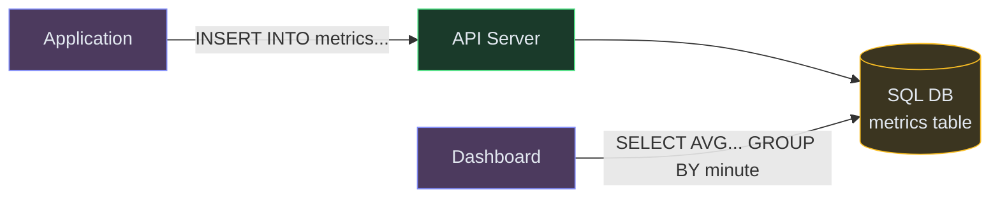
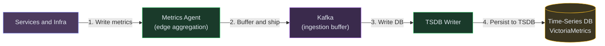
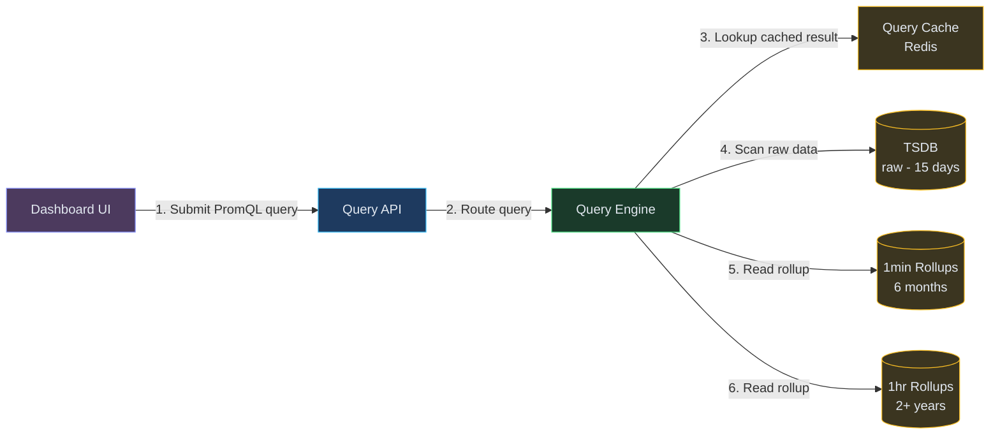
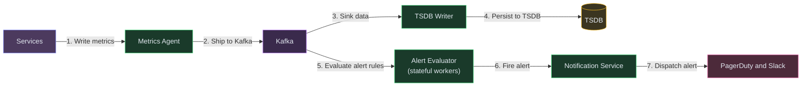
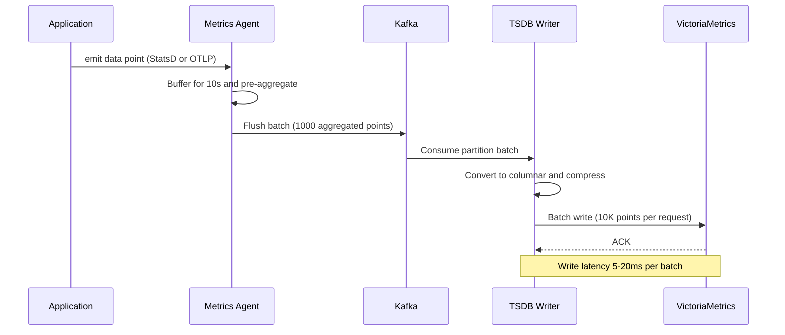
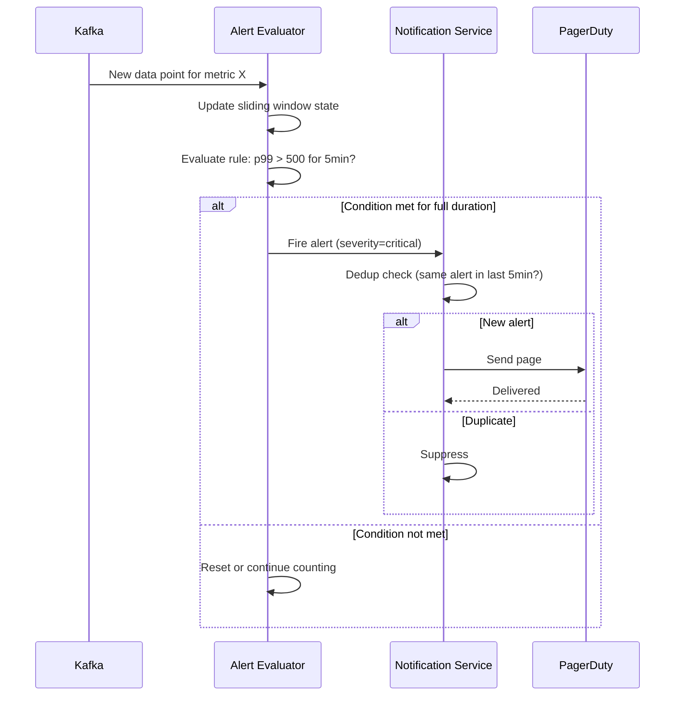
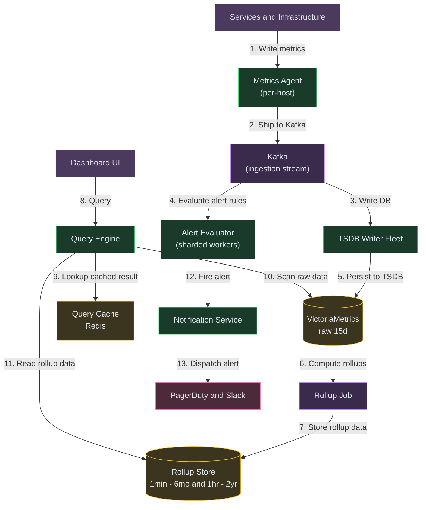

# Designing a Metrics Monitoring System (Datadog / Prometheus)

**Difficulty:** Advanced **Topics:** Time-Series DB, Aggregation Pipeline, Anomaly Detection, Alerting, Dashboard Queries **Asked at:** Google, Amazon, Microsoft, Uber, PhonePe, Flipkart, Netflix
**Prerequisites:**[Message Queues](/concepts/message-queues/), [Database Indexing](/concepts/database-indexing/), and [Caching](/concepts/caching/)

---

## 1. Understanding the Problem

A metrics monitoring system ingests millions of time-stamped data points per second from thousands of services and infrastructure components (CPU usage, request latency, error rates, business KPIs), stores them efficiently for weeks to years, lets engineers query and visualize them on dashboards, and fires alerts when something goes wrong. The hard parts: ingesting at massive write throughput without dropping data, querying across billions of data points in sub-second for dashboards, and detecting anomalies in real-time across thousands of metric streams.

**Real examples:** Datadog, Prometheus + Grafana, New Relic, Amazon CloudWatch, InfluxDB.

---

## 1.5. Naive First Cut



Applications write metrics directly to a SQL table. Dashboards query with GROUP BY for aggregation.

**Why this breaks:**

- At 1M data points/second, INSERT throughput exceeds any single SQL DB capacity
- GROUP BY across billions of rows for a dashboard panel takes minutes, not milliseconds
- Row-based storage wastes space for time-series (timestamps are sequential, values compress well)
- No pre-aggregation means every dashboard refresh re-scans raw data
- No alerting - someone has to stare at the dashboard to notice problems
- Retention of raw data for months costs prohibitively much without downsampling

The rest of the doc evolves this into a purpose-built time-series ingestion pipeline with pre-aggregation, tiered storage, and real-time alert evaluation.

---

## 1.7. Prior Art We're Drawing From

- **Facebook Gorilla (in-memory TSDB)** - Uses delta-of-delta encoding for timestamps and XOR encoding for floating-point values to achieve 12x compression. Keeps last 26 hours in memory for low-latency reads. This encoding scheme is now used in Prometheus TSDB and VictoriaMetrics. ([Facebook Engineering](https://engineering.fb.com/2015/03/10/core-infra/gorilla-a-fast-open-source-time-series-database/))
- **Uber M3 (Metrics Platform)** - Processes 500M+ metrics/sec. Uses a tiered architecture: M3 Aggregator pre-aggregates at the edge before writing to M3DB (distributed TSDB). Edge aggregation reduces write volume by 10-100x. ([Uber Engineering](https://www.uber.com/blog/m3/))
- **Prometheus Pull Model** - Instead of applications pushing metrics, a central Prometheus server pulls (scrapes) metrics from service endpoints every 15-30s. Simplifies service code but limits scale to what one server can scrape. Thanos and Cortex add horizontal scaling on top. ([Prometheus Docs](https://prometheus.io/docs/introduction/overview/))
- **Datadog Alerting Pipeline** - Evaluates millions of alert rules per minute using a streaming evaluation engine. Each rule is a stateful computation over a metric stream (e.g., "if avg(latency) > 500ms for 5 minutes, fire"). Rules are sharded across workers by metric name. ([Datadog Engineering](https://www.datadoghq.com/blog/engineering/))

---

## 2. Technology Choices

| Tier | Purpose | Stores | Access Pattern | Primary Pick | Alternatives |
|---|---|---|---|---|---|
| Ingestion buffer | Buffer incoming metrics | Raw data points in transit | High-throughput append | Kafka / Kinesis | Pulsar / Redis Streams |
| Time-series DB | Store metrics long-term | Time-stamped values per metric | Range scans by time + tags | VictoriaMetrics / InfluxDB | TimescaleDB / M3DB / Prometheus |
| Pre-aggregation | Reduce write volume | Rolled-up averages per minute | Streaming aggregation | Flink / Kafka Streams | Spark Structured Streaming |
| Query engine | Dashboard queries | Aggregated metric data | Time-range GROUP BY | PromQL compatible engine | InfluxQL / custom SQL over TSDB |
| Alert evaluator | Rule evaluation | Alert rules + metric streams | Streaming threshold checks | Custom stateful workers | Prometheus Alertmanager |
| Metadata store | Metric names and tags | Metric registry + tag index | Lookup by tag combination | Postgres / Elasticsearch | Cassandra |
| Dashboard store | Dashboard configs | JSON dashboard definitions | CRUD by dashboard_id | Postgres | MongoDB |

**Why a purpose-built TSDB over Postgres?** Time-series workloads have a unique access pattern: append-only writes (never update old data), always query by time range, and data compresses dramatically with delta encoding. A TSDB exploits this for 10-50x better write throughput and 5-10x better compression than row-based Postgres. TimescaleDB is the middle ground (Postgres extension with TSDB optimizations).

---

## 3. Functional Requirements

### Core (Top 3)

1. **Ingest metrics at scale** - accept millions of data points per second from services, infra, and custom metrics without dropping data
2. **Query and visualize** - sub-second dashboard queries across time ranges (5 min to 6 months) with aggregation (avg, p99, sum, rate)
3. **Alert on anomalies** - evaluate threshold and anomaly-detection rules in real-time and notify on-call engineers within 60 seconds of a problem

### Below the Line

- Custom metric tags and dimensions
- Dashboard sharing and annotations
- SLO tracking (error budget burn rate)
- Log correlation (link metrics to related logs)
- Capacity forecasting

---

## 4. Non-Functional Requirements

### Core

- **Write throughput:** 1M+ data points/second sustained
- **Query latency:** P95 < 500ms for dashboard panel queries (1-hour range)
- **Alert latency:** Problem detected and notification sent within 60 seconds
- **Retention:** Raw data 15 days, 1-minute rollups 6 months, 1-hour rollups 2+ years

### Below the Line

- Eventual consistency for dashboards is fine (seconds of lag acceptable)
- Multi-tenancy with per-team quotas
- 99.9% availability for the ingestion path (metrics must never be lost during outages)

---

## 5. Core Entities

- **Metric** - a named measurement stream with tags (e.g., `http_requests_total{service=api, status=200}`)
- **DataPoint** - a single (timestamp, value) pair for a metric
- **TimeSeries** - the full sequence of data points for a specific metric + tag combination
- **AlertRule** - a condition evaluated against a metric stream (threshold, rate-of-change, anomaly)
- **Alert** - a fired instance of an AlertRule, with severity, timestamps, and notification state
- **Dashboard** - a collection of panels, each rendering a query over one or more metrics

---

## 6. API / System Interface

```
POST /v1/metrics/write
Body: [
  {"metric": "http_latency_ms", "tags": {"service": "api", "endpoint": "/users"}, "value": 42.5, "timestamp": 1720000000},
  {"metric": "http_latency_ms", "tags": {"service": "api", "endpoint": "/users"}, "value": 38.1, "timestamp": 1720000001}
]
Response: 202 Accepted
```

```
POST /v1/metrics/query
Body: {
  "metric": "http_latency_ms",
  "tags": {"service": "api"},
  "aggregation": "p99",
  "interval": "1m",
  "from": 1720000000,
  "to": 1720003600
}
Response: {"series": [{"timestamp": 1720000000, "value": 95.2}, ...]}
```

```
POST /v1/alerts/rules
Body: {
  "name": "High API Latency",
  "metric": "http_latency_ms",
  "condition": "p99 > 500",
  "for": "5m",
  "notify": ["pagerduty://team-oncall"]
}
Response: {"rule_id": "ar_123"}
```

Security notes: metrics write endpoint is authenticated via service API keys. Alert notifications go through PagerDuty/Slack webhooks, never expose raw metric values in public channels.

---

## 7. High-Level Design

### FR1: Ingest metrics at scale

The core challenge: accepting 1M+ writes/second without losing data during traffic spikes. We can't write directly to the TSDB at this rate — we need a buffer.



| Color | Meaning |
|---|---|
| Purple | Client / Source |
| Green | Application Service |
| Yellow | Data Store |
| Violet | Async / Stream |

**New components:**
- **Metrics Agent:** Runs on every host. Collects local metrics, pre-aggregates (e.g., counts 1000 requests into one "count=1000, p99=42ms" summary per 10 seconds), and forwards to Kafka. This reduces write volume by 10-100x at the edge (borrowing from Uber M3).
- **Kafka (ingestion buffer):** Absorbs traffic spikes. Even if the TSDB writer is temporarily slow, data queues safely in Kafka (retention: 24-48 hours).
- **TSDB Writer:** Consumes from Kafka partitions and batch-writes to the time-series database. Parallelism is controlled by Kafka partition count.
- **Time-Series DB (VictoriaMetrics):** Purpose-built for time-series: columnar storage, delta-of-delta compression, fast range scans. Handles the sustained write load after edge aggregation.

**Flow:**
1. Application emits metric data points (via SDK or StatsD/OpenTelemetry protocol)
2. Local Metrics Agent buffers for 10 seconds, pre-aggregates histograms into summaries
3. Agent flushes batch to Kafka (partitioned by metric name for locality)
4. TSDB Writer consumes batches, converts to columnar format, writes to VictoriaMetrics
5. Write amplification: 1M raw events/sec at apps → ~100K aggregated points/sec into TSDB
6. Kafka provides backpressure safety — writer consumes at its own pace

---

### FR2: Query and visualize

Dashboard queries need to scan potentially billions of data points and return aggregated results in under 500ms. The key: **pre-computed rollups** at multiple granularities.



**New components:**
- **Query Engine:** Parses PromQL-style queries, determines which storage tier to read from based on the time range requested, fans out to the appropriate tier, and merges results.
- **Rollup stores:** Pre-aggregated data at 1-minute and 1-hour granularity. A query over "last 6 months" reads from the 1-hour rollup (only ~4,300 data points) instead of scanning 15B raw points.
- **Query Cache (Redis):** Caches recent dashboard query results for 15-30 seconds. A dashboard with 20 panels and 50 viewers doesn't need to re-scan the TSDB 1000 times per minute.

**Flow:**
1. Dashboard panel issues a query: "p99(http_latency_ms{service=api}) over last 1 hour, 1min intervals"
2. Query Engine checks Redis cache — hit returns immediately
3. Cache miss: time range is <15 days → read from raw TSDB tier
4. TSDB returns raw points for the hour; Query Engine computes p99 per minute bucket
5. Result cached in Redis (TTL 15s) and returned to dashboard
6. For "last 3 months" query: reads from 1-minute rollup tier (pre-computed aggregates)

---

### FR3: Alert on anomalies

Alert evaluation must be real-time — we can't wait for dashboard queries. Alerts consume the same Kafka stream as the writer, but evaluate rules against the live stream.



**New components:**
- **Alert Evaluator:** Stateful stream processors. Each worker owns a shard of alert rules (partitioned by metric name). Maintains sliding windows in memory and evaluates rules on every new data point. Fires when condition persists for the configured duration ("for: 5m").
- **Notification Service:** Deduplicates alerts (don't page every second), routes to the right channel (PagerDuty for critical, Slack for warning), and tracks acknowledgment.

**Flow:**
1. Kafka delivers metric data points to Alert Evaluator workers (same stream as TSDB writer — fan-out)
2. Worker loads its assigned alert rules and maintains per-rule state (rolling window of recent values)
3. On each new data point: evaluate "p99 > 500 for 5 min" against the window
4. If condition is true for the full "for" duration → fire alert
5. Alert Evaluator publishes to Notification Service
6. Notification Service deduplicates (same alert firing within 5 min → suppress), sends to PagerDuty
7. End-to-end latency from metric emission to page: 30-60 seconds

---

## 6.5. Core Flows

### Flow 1: Metric Ingestion (write path)



1. Application SDK emits raw data points at high frequency (every request, every second)
2. Agent aggregates locally — 1000 raw counts become one counter value per 10 seconds
3. Kafka partitioning by metric name ensures related time-series land on the same TSDB shard
4. Writer batches aggressively (10K points per write) for throughput
5. VictoriaMetrics compresses using Gorilla encoding: 12x compression ratio

**Non-obvious failure path:** If VictoriaMetrics is down, the Writer stops consuming. Kafka retains data for 24-48 hours (configurable). When TSDB recovers, the Writer catches up from the lag — no data is lost, but dashboards show a gap until backfill completes.

---

### Flow 2: Alert Evaluation



1. Alert Evaluator maintains a 5-minute sliding window per rule
2. Rule fires ONLY if condition is true for the entire "for" duration (prevents flapping)
3. Notification Service deduplicates to avoid alert storms (one page per incident)
4. If PagerDuty delivery fails, retry with exponential backoff + dead-letter after 3 failures

**Non-obvious failure path:** Alert Evaluator crashes — Kafka consumer group rebalances, another worker takes over the partition. It replays the last 5 minutes of data to rebuild window state before evaluating rules (exactly-once via Kafka consumer offsets + local state snapshots).

---

## 7. Deep Dives

### Deep Dive 1: Time-Series Compression (Gorilla Encoding)

**Bad:** Store each data point as a full (timestamp: int64, value: float64) = 16 bytes. At 1M points/sec = 16MB/sec = 1.3TB/day raw.

**Good:** Delta encoding for timestamps: store the first timestamp fully, then store differences (Δ) which are usually small (10, 10, 10 for 10-second intervals). Reduces timestamp storage by ~75%.

**Great:** Delta-of-delta for timestamps + XOR for values (the Gorilla encoding from Facebook). Timestamps that arrive at regular intervals have Δ-of-Δ = 0, which compresses to 1 bit. Floating-point values that change slowly have XOR with previous = mostly zeros, stored with leading/trailing zero compression. Result: average 1.37 bytes per data point (vs 16 raw) = **12x compression**. This is why in-memory TSDBs can hold 26 hours of data in RAM affordably.

---

### Deep Dive 2: High Write Throughput (Edge Aggregation)

**Bad:** Every application instance sends every raw data point to the central TSDB. 10,000 instances x 100 metrics x 1 point/sec = 1M writes/sec to a single store.

**Good:** Batch writes on the application side (flush every 10 seconds). Reduces network calls but doesn't reduce the total data volume reaching the TSDB.

**Great:** **Edge aggregation** at the Metrics Agent. For counter and histogram metrics, the agent computes local summaries (count, sum, min, max, quantiles) per 10-second window and sends ONE aggregated point instead of hundreds of raw events. A host handling 10K requests/sec sends 1 summary point every 10 seconds, not 10K raw points. This reduces write volume to the central TSDB by 100x (Uber M3's approach). The tradeoff: you lose per-request granularity for high-cardinality metrics, but gain scalability.

---

### Deep Dive 3: Query Performance (Rollups and Tiered Storage)

**Bad:** Query raw data for all time ranges. "Show me CPU usage for last year" scans 3B data points. Takes minutes.

**Good:** Pre-compute 1-minute rollups (avg, min, max, count, sum per minute). Queries over hours/days read rollups instead of raw. 60x fewer points to scan.

**Great:** **Multi-tier rollups with automatic tier selection.** The Query Engine chooses the tier based on the query's time range:
- Last 1 hour → raw data (full resolution)
- Last 24 hours → 1-minute rollups
- Last 30 days → 5-minute rollups  
- Last 6 months → 1-hour rollups

Rollups are pre-computed by a background job that reads raw data and writes aggregated data to the rollup tier. Combined with **columnar storage** (metrics stored column-wise, not row-wise), a 6-month query touches only the timestamp and value columns, skipping tags and metadata entirely.

---

### Deep Dive 4: Alert Evaluation at Scale

**Bad:** One server evaluates all alert rules sequentially. With 100K rules, each needing a window of recent data, evaluation takes too long and alerts fire late.

**Good:** Shard alert rules across workers by metric name. Each worker handles all rules for its assigned metrics. Parallelism = number of Kafka partitions.

**Great:** **Two-level evaluation** (borrowing from Datadog's architecture):
1. **Level 1 (streaming):** Simple threshold rules evaluated inline as data flows through. No state beyond the current window. Handles 90% of rules at sub-second latency.
2. **Level 2 (stateful):** Complex rules (anomaly detection, rate-of-change, composite alerts across multiple metrics) evaluated by specialized workers with larger state. These query the TSDB for historical baselines to compute dynamic thresholds.

This separation means simple alerts never wait for complex anomaly detection, and complex rules get the compute resources they need without slowing the hot path.

---

### Deep Dive 5: Cardinality Explosion

**Bad:** Allow arbitrary tag values (e.g., `user_id` as a tag). With 100M users, one metric becomes 100M distinct time-series. Storage and indexing blow up.

**Good:** Reject high-cardinality tags at ingestion. Enforce a per-metric cardinality limit (e.g., 10K unique tag combinations). Drop points that exceed the limit.

**Great:** **Cardinality-aware routing + sampling.** Instead of hard-dropping, route high-cardinality metrics to a separate "raw events" store (ClickHouse) for ad-hoc analysis, while the TSDB only stores pre-aggregated rollups for that metric. Engineers can still query individual user_id data in ClickHouse when debugging, but the TSDB stays bounded. Combined with proactive cardinality monitoring — alert the metric owner when their metric approaches the limit, before data is dropped.

---

## 7.5. Design Self-Audit

- **Stale reads?** Dashboard data lags by ~10-30 seconds (agent flush interval + Kafka consumer lag). Acceptable for monitoring — not a real-time trading system.
- **Single points of failure?** Kafka is the critical path for both writes and alerts — multi-broker, replicated. TSDB runs in clustered mode (VictoriaMetrics cluster). Alert Evaluator recovers from Kafka offsets on crash.
- **Dead-letter / reconciliation?** If TSDB Writer fails, Kafka retains data. If Alert Evaluator crashes, consumer rebalance + state replay. Notification Service has a DLQ for failed delivery attempts.
- **Data freshness across tiers?** Rollup jobs run every 5 minutes. A query that spans the boundary between raw and rollup data merges both seamlessly (Query Engine handles this).
- **Cost at scale?** Gorilla compression + edge aggregation + tiered retention means 1M points/sec costs ~$3-5K/month in storage (vs $50K+ for naive row-based storage). The biggest cost is actually compute for the Alert Evaluator fleet.

---

## 8. Final Architecture



**How it works end-to-end (ingestion path):**

1. **Services emit metrics** — application hosts push data points to the local Metrics Agent
2. **Agent buffers and forwards** — batches metrics into Kafka (ingestion stream) for durability and backpressure absorption
3. **TSDB Writer Fleet persists** — consumers write raw data points to VictoriaMetrics (15-day retention)
4. **Rollup Job compresses** — periodically downsamples raw data into 1-min (6-month) and 1-hour (2-year) rollup stores

**How it works end-to-end (query path):**

5. **Dashboard UI queries** — user requests hit the Query Engine
6. **Query Engine checks cache** — Redis query cache serves repeated dashboard panels; misses fan out to TSDB or Rollup Store
7. **Alert Evaluator streams from Kafka** — evaluates threshold rules in near-real-time against incoming data
8. **Notification dispatched** — triggered alerts routed through Notification Service to PagerDuty/Slack
