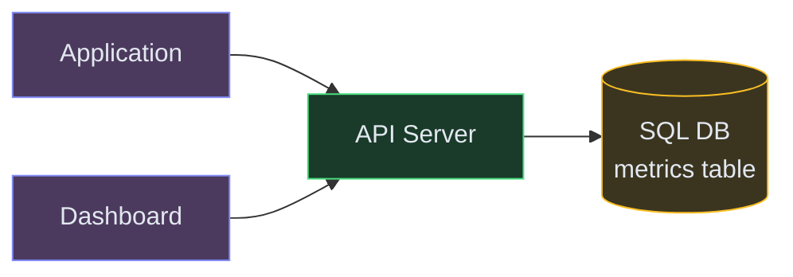
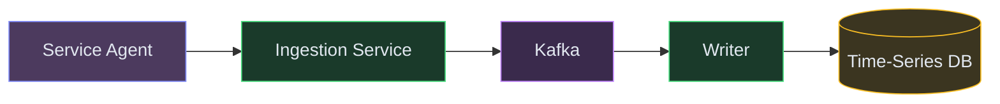
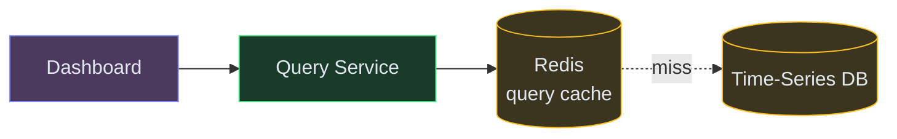
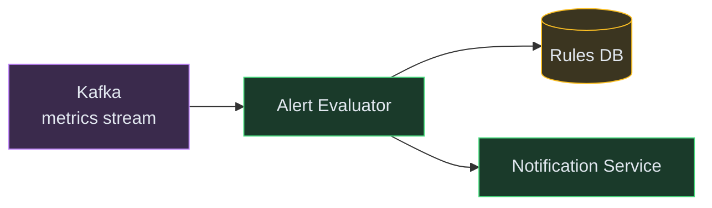

# Designing a Metrics Monitoring System (Datadog / Prometheus)

**Difficulty:** Advanced
**Prerequisites:**[Message Queues](/concepts/message-queues/), [Database Indexing](/concepts/database-indexing/), and [Caching](/concepts/caching/)

---

## Understanding the Problem

A metrics monitoring system ingests millions of time-stamped data points per second from thousands of services (CPU usage, request latency, error rates), stores them efficiently for weeks to years, lets engineers query and visualize them on dashboards, and fires alerts when something goes wrong. The hard parts: ingesting at massive write throughput without dropping data, querying across billions of data points in sub-second for dashboards, and evaluating thousands of alert rules in near-real-time.

---

## Naive First Cut



Why this breaks:
- SQL INSERT at 1M rows/second overwhelms any relational DB
- `SELECT AVG(cpu) WHERE time > now()-1h GROUP BY host` scans millions of rows — dashboards timeout
- No downsampling — storing raw 1-second data points for a year = petabytes
- Alert evaluation requires scanning all metrics continuously — can't share the same DB as ingest
- Single DB is a bottleneck for both writes and reads simultaneously

---

## Functional Requirements

### Core (top 3)
1. **Ingest metrics** — accept high-throughput time-series data from agents/services
2. **Query and visualize** — dashboard queries returning aggregated data in <1 second
3. **Alert on anomalies** — evaluate rules against incoming data and fire alerts in <60 seconds

### Below the Line
- Custom dashboards, metric tagging/filtering, SLO tracking, anomaly detection (ML-based), log correlation

---

## Non-Functional Requirements

- **Write throughput** — 5M data points/second sustained
- **Query latency** — <500ms for dashboard queries spanning 24 hours of data
- **Alert latency** — rule evaluation within 30 seconds of data arrival
- **Retention** — raw data for 15 days, downsampled for 1 year

---

## Core Entities

- **Metric** — name, tags (key-value labels), type (counter/gauge/histogram)
- **DataPoint** — metric ID, timestamp, value
- **Alert Rule** — metric query, threshold, duration, notification channel
- **Dashboard** — collection of panels, each with a metric query and visualization type

---

## API

```text
POST /v1/metrics/ingest
  Body: [{ name: "http.latency", tags: { service: "api", host: "web-01" }, value: 42, timestamp }]
  Response: 202 Accepted

GET /v1/metrics/query?metric=http.latency&tags=service:api&from=-1h&agg=p99&interval=1m
  Response: { series: [{ timestamp, value }] }

POST /v1/alerts
  Body: { metric: "http.error_rate", condition: "> 5%", duration: "5m", notify: "pagerduty" }
  Response: { alertId, status: "active" }
```

---

## High-Level Design

### FR1: Ingest Metrics

Agents push metrics to an Ingestion Service. It buffers data in Kafka for durability, then a Writer consumes and batches writes into the time-series database (TSDB).



### FR2: Query and Visualize

The Query Service reads from the TSDB, applies aggregations (avg, p99, sum), and returns time-series data. A cache layer handles repeated dashboard queries.



### FR3: Alert on Anomalies

An Alert Evaluator continuously checks rules against recent data. When a threshold is breached for the configured duration, it fires a notification.



---

## Deep Dives

### Deep Dive 1: Time-series storage and downsampling

**Bad:** Store every data point at 1-second granularity forever. At 5M points/sec, that's 432B points/day. Storage costs are astronomical and old data queries are unbearably slow.

**Good:** Use a purpose-built TSDB (InfluxDB, TimescaleDB, or Prometheus TSDB) that stores data in time-partitioned chunks with columnar compression. Raw data is retained for 15 days. A background job downsamples older data into 1-minute and 1-hour rollups.

**Great:** Multi-tier storage. Hot tier (last 2 hours): in-memory for sub-millisecond alert evaluation. Warm tier (2h–15 days): SSD-backed TSDB partitions for dashboard queries. Cold tier (15d–1 year): downsampled data in object storage (Parquet files) queryable via the same API. The query service transparently routes to the right tier based on the time range. This cuts storage costs by 50x for historical data while keeping recent data blazing fast.

### Deep Dive 2: Alert evaluation at scale

**Bad:** For each alert rule, query the TSDB every 10 seconds. With 100K rules, that's 10K queries/second — overwhelming the TSDB with redundant reads, and alert latency is 10+ seconds.

**Good:** Stream-based evaluation. The Alert Evaluator consumes from the same Kafka topic as the Writer. It maintains in-memory sliding windows per metric/rule combination. When new data arrives, it immediately evaluates against matching rules. No DB query needed — evaluation latency drops to <5 seconds.

**Great:** Partition rules by metric name. Each evaluator instance owns a subset of metrics (assigned via consistent hashing). This distributes the 100K rules across N instances, each holding only its relevant sliding windows in memory. If an instance dies, its partition is reassigned and the new owner rebuilds windows from Kafka (replay last 10 minutes). Deduplication of alerts uses a distributed lock to prevent multiple notifications for the same breach.

### Deep Dive 3: Dashboard query performance for high-cardinality metrics

**Bad:** A metric like `http.latency{service=X, endpoint=Y, host=Z}` has millions of unique tag combinations. A dashboard query `avg(http.latency) by service` must scan all combinations — slow.

**Good:** Pre-aggregate at ingest time. When data arrives, also compute `avg by service` and store the rolled-up series separately. Dashboard queries hit the pre-aggregated data instead of scanning raw points.

**Great:** Combine pre-aggregation with an inverted index on tags. The TSDB maintains a tag index (like Prometheus's posting lists): given tags, instantly find matching series IDs without scanning. For high-cardinality dimensions (like `request_id`), automatically detect and warn users — or refuse to index ephemeral tags that would explode the index. This keeps query latency bounded regardless of cardinality.

---

## What's Expected at Each Level

| Level | Expectations |
|---|---|
| **Mid** | Kafka buffer for ingest durability. TSDB for storage. Basic downsampling concept. Alert rules evaluated periodically against stored data. |
| **Senior** | Multi-tier storage (hot/warm/cold). Stream-based alert evaluation from Kafka. Pre-aggregation for dashboard performance. Explain why relational DB fails for time-series. |
| **Staff+** | Partitioned alert evaluation with consistent hashing. High-cardinality tag handling. Inverted index on metric labels. Cost analysis of retention tiers. Sliding window rebuild from Kafka on failover. |
