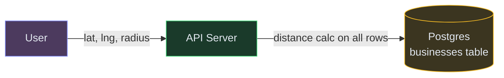
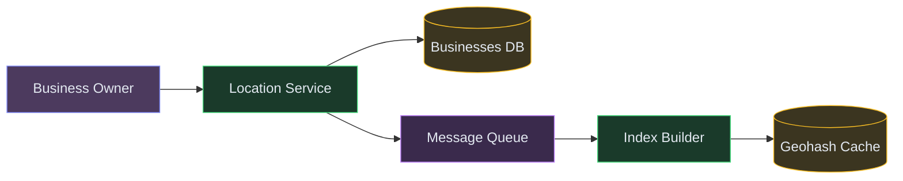

# Designing a Nearby Service (Yelp / Google Maps Places)

**Difficulty:** Intermediate
**Prerequisites:**[Caching](/concepts/caching/), [Database Indexing](/concepts/database-indexing/), and [Scalability](/concepts/scalability/)

---

## Understanding the Problem

You're building a service that answers "what's near me?" — given a user's location (lat/lng) and a radius, return nearby businesses, restaurants, or points of interest. The challenge is that traditional database indexes (B-trees) don't work well for 2D spatial queries. You need a data structure that can efficiently answer "find all points within X km of this coordinate" across millions of businesses.

Real examples: Yelp nearby restaurants, Google Maps Places, Zomato, Swiggy store discovery, Uber driver finding.

---

## Naive First Cut



Query: `SELECT * FROM businesses WHERE distance(lat, lng, user_lat, user_lng) < radius ORDER BY distance LIMIT 20`. Compute the Haversine distance for every row.

Why this breaks:
- Distance calculation on every row = full table scan. With 200M businesses, this takes seconds per query
- B-tree indexes on lat/lng columns help with range queries on ONE dimension, but "within radius" is a 2D problem — a lat range filter still leaves millions of candidates
- No spatial partitioning means the DB does O(N) work per query
- At 50K queries/sec, the DB is completely overwhelmed
- Results aren't cacheable because every user has a different location

---

## Functional Requirements

### Core (top 3)
1. **Search nearby places** — given user's location and a radius (or category filter), return businesses sorted by distance
2. **View business details** — get full info (name, address, hours, rating, photos) for a specific business
3. **Add/update a business listing** — business owners can register or update their location and details

### Below the Line
- Reviews and ratings, photo uploads, search by name/keyword, real-time location (moving entities like drivers), opening hours filter

---

## Non-Functional Requirements

- **Latency** — nearby search returns in < 100ms
- **Scale** — 200M business listings, 50K search queries/sec at peak
- **Availability** — 99.99%; search must always work, even if listings are slightly stale
- **Freshness** — new/updated businesses appear in search within a few minutes

---

## Core Entities

- **Business** — unique ID, name, lat/lng, category, address, rating, hours, photos
- **Geohash/Cell** — spatial partition identifier mapping a region of the earth to a string key
- **Spatial Index** — data structure enabling O(log N) proximity queries
- **Search Result** — business info + computed distance from the user's location

---

## API

```text
GET /v1/nearby?lat=37.78&lng=-122.41&radius=5km&category=restaurant&limit=20
  Response: { businesses: [{ id, name, lat, lng, distance, rating, category }] }

GET /v1/businesses/{id}
  Response: { id, name, address, lat, lng, hours, rating, photos, reviews }
```

The nearby endpoint is the hot path (high QPS, needs to be fast). The detail endpoint is a simple key-value lookup.

---

## High-Level Design

The key insight is **geohashing**: convert 2D coordinates into a 1D string key so that nearby points share a common prefix. This transforms a spatial query into a simple prefix lookup, which databases and caches handle efficiently.

💡 *Geohash: divides the earth into a grid of cells. Each cell gets a string code (e.g., "9q8yy"). Points in the same cell share the same prefix. Longer strings = smaller cells = more precision.*

### FR1: Search Nearby Places


| Color | Layer |
|---|---|
| 🟣 Purple | Clients |
| 🟢 Green | Services |
| 🟡 Yellow | Data stores |

1. User sends their location → Location Service computes the geohash at the appropriate precision for the requested radius
2. To cover edge cases at cell boundaries, also compute the 8 neighboring geohash cells
3. Query the Geohash Cache: fetch all businesses in those 9 cells (the target cell + 8 neighbors)
4. Filter results by exact distance (Haversine) to remove false positives outside the actual radius
5. Sort by distance and return top results

### FR2: View Business Details


1. User taps on a business → `GET /businesses/{id}`
2. Simple key-value lookup: check the Business Cache (Redis hash), fall back to DB on miss
3. Business details are highly cacheable (rarely change) — set a 1-hour TTL

### FR3: Add/Update a Business



1. Business owner submits new/updated listing → API writes to Businesses DB
2. Publishes an update event to the Message Queue
3. Index Builder consumes the event, computes the geohash for the business's location
4. Updates the Geohash Cache: adds the business to the correct cell (or moves it between cells if location changed)
5. Within a few minutes, the business appears in nearby search results

---

## Deep Dives

### Deep Dive 1: Geohash Precision and Boundary Problem

**Bad — use a single geohash precision for all queries.** A 5-character geohash covers ~5km × 5km. If the user is near the edge of a cell, a restaurant 100m away might be in the adjacent cell and missed entirely. Users see inconsistent results depending on where exactly they're standing within a cell.

**Good — query the target cell plus all 8 neighboring cells.** For any prefix lookup, fetch 9 cells total. This guarantees full coverage regardless of where the user is within their cell. Filter false positives (results outside the actual radius) with a Haversine distance check on the returned results.

**Great — same 9-cell query, with adaptive precision based on radius.** For a 1km radius search, use 6-character geohashes (cells ~600m). For a 10km radius, use 4-character geohashes (cells ~20km). This keeps the number of businesses per query manageable regardless of radius. Fewer cells to query for large radii, more precise cells for small radii. Precompute business memberships at multiple precision levels during indexing.

### Deep Dive 2: Caching Strategy for Spatial Queries

**Bad — cache by exact user location.** Every user has a unique lat/lng, so cache hit rate is near zero. Millions of unique cache keys, each used once.

**Good — cache by geohash cell.** All users in the same ~1km² area share the same cache key (the geohash string). Cache hit rate jumps to 80%+ in dense urban areas. Store the full list of businesses per cell in a Redis sorted set (sorted by rating or distance from cell center).

**Great — same geohash-keyed cache, with hot-cell preloading.** Identify high-traffic cells (Manhattan, downtown Mumbai) and proactively refresh their cache even before TTL expires. For cold cells (rural areas), compute on demand and cache with a longer TTL (businesses rarely change there). This ensures the hottest 5% of cells — which serve 80% of queries — always hit warm cache.

### Deep Dive 3: Handling Dense vs. Sparse Regions

**Bad — fixed number of results regardless of density.** In Manhattan, "nearby restaurants within 1km" returns 5000 results. In rural Montana, it returns zero. Both are bad UX.

**Good — dynamic radius expansion.** If the initial radius returns fewer than N results (e.g., < 5), automatically expand the radius and query additional geohash cells until you have enough results. Conversely, in dense areas, apply stricter filters (higher rating, more reviews) to keep the result set manageable.

**Great — same dynamic expansion, with category-aware density estimation.** Pre-compute density stats per cell per category. If the system knows downtown Manhattan has 200 restaurants per cell, it can set a tighter initial radius. If rural areas have 0.5 restaurants per cell, start with a wider radius immediately without the back-and-forth expansion. This reduces average latency by avoiding retry queries.

---

## What's Expected at Each Level

| Level | Expectations |
|---|---|
| **Mid** | Explain why lat/lng B-tree indexes don't solve proximity queries. Introduce geohashing. Query target cell + 8 neighbors. Cache by geohash cell. Simple Haversine distance filter on results. |
| **Senior** | Adaptive geohash precision based on radius. Index Builder pattern for async updates. Dense vs sparse handling. Discuss alternatives (quadtree, R-tree) and tradeoffs vs geohash. |
| **Staff+** | Multi-precision precomputation during indexing. Real-time location for moving entities (drivers) using Redis Geo with TTL. Sharding the spatial index by region. Global service with regional data locality. |
