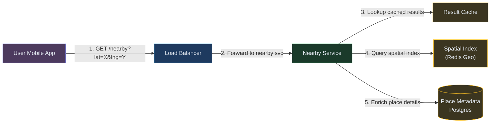
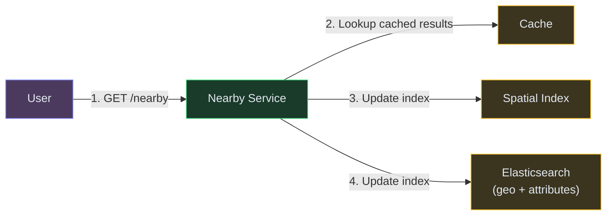
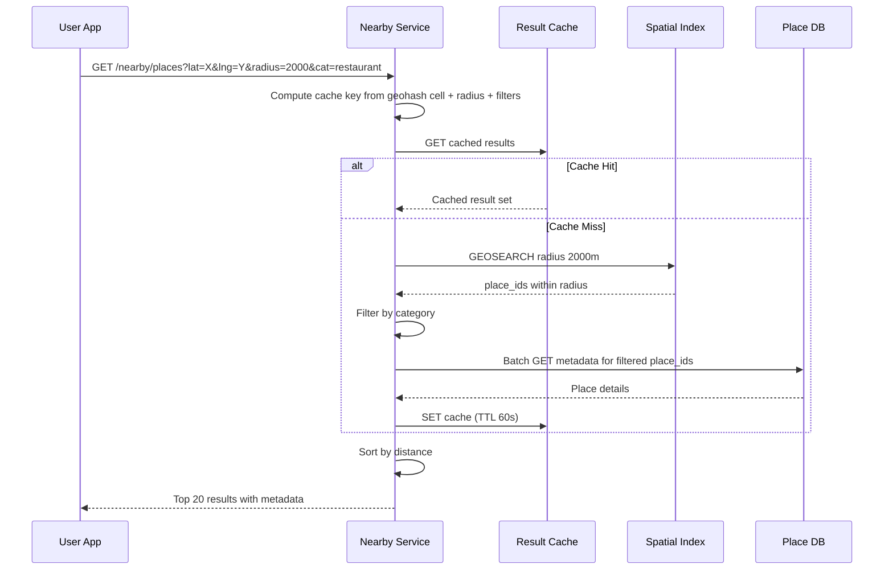
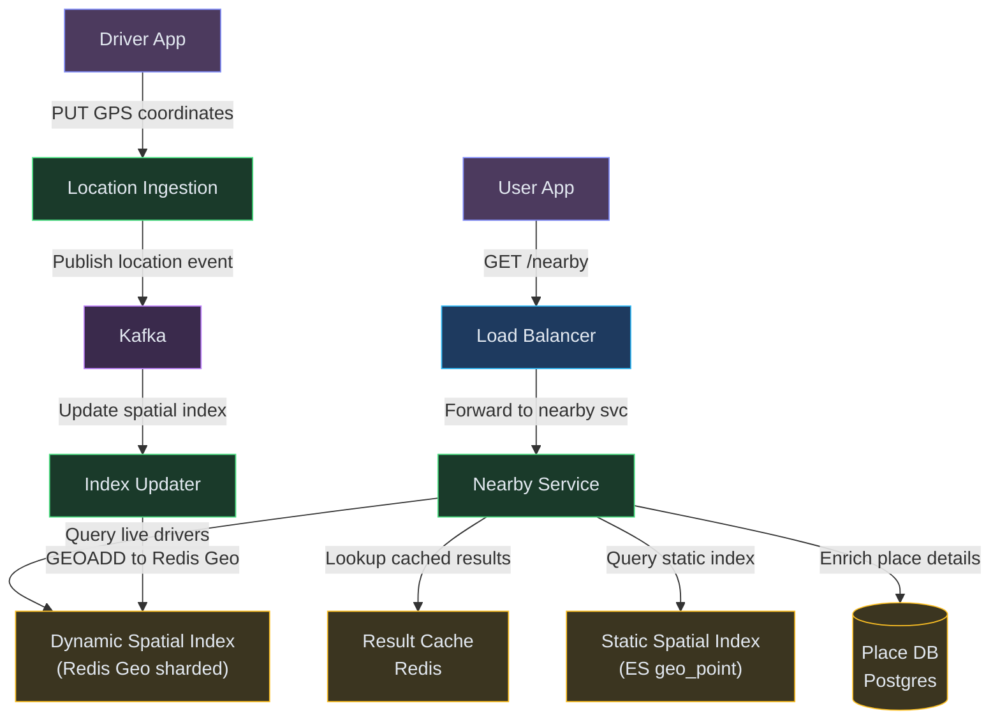

# Designing a Nearby Service (Yelp / Google Maps Places)

**Difficulty:** Intermediate **Topics:** Geohash, Quadtree, Spatial Indexing, Location Updates, Radius Queries **Asked at:** Google, Uber, Amazon, Swiggy, Zomato, PhonePe, Grab
**Prerequisites:**[Caching](/concepts/caching/), [Database Indexing](/concepts/database-indexing/), and [Scalability](/concepts/scalability/)

---

## 1. Understanding the Problem

A proximity service answers the question "what's near me?" — restaurants within 2km, friends within 500m, EV chargers within 5km. The core challenge: indexing millions of locations (some static like restaurants, some moving like drivers) so that a radius query returns results in under 100ms without scanning the entire dataset. Bonus: efficiently updating the index when entities move.

**Real examples:** Yelp, Google Maps "Explore Nearby," Uber driver matching, Swiggy restaurant discovery, Bumble/Hinge proximity matching.

---

## 1.5. Naive First Cut


Store all places with lat/lng. For each query, compute haversine distance to every row and filter.

**Why this breaks:**

- Computing distance to every row in a table of 200M places is a full table scan
- B-tree index on lat or lng alone doesn't help (you need 2D range)
- Can't scale to 100K QPS each doing a full scan
- No support for moving entities (drivers, friends) that update every 5 seconds
- Radius "2km" varies by latitude (longitude degree spacing shrinks at poles)
- No ranking within results (closest first, highest rated first)

The rest of the doc evolves this into a geospatial index with Geohash-based sharding and efficient range queries.

---

## 1.7. Prior Art We're Drawing From

- **Uber H3 Hexagonal Grid** - Uses a hierarchical hexagonal grid system (H3) to partition the earth into cells at multiple resolutions. Each hexagon has roughly equal area (unlike Geohash rectangles which distort at poles). Used for surge pricing, supply/demand balancing, and driver matching. ([Uber Engineering](https://www.uber.com/blog/h3/))
- **Google S2 Geometry Library** - Hierarchical decomposition of the sphere into cells using a Hilbert curve. Enables efficient spatial indexing where a region query becomes a set of contiguous cell range scans. Used in Google Maps and Pokémon Go. ([S2 Geometry](https://s2geometry.io/))
- **Redis Geo Commands** - Redis GEOADD/GEOSEARCH uses a sorted set with Geohash-encoded scores. O(N+log(M)) for radius queries where N = results and M = total entries. Simple, fast, but single-machine memory-limited. ([Redis Docs](https://redis.io/commands/geosearch/))
- **Foursquare Pilgrim SDK** - Background location tracking with adaptive precision: high-frequency GPS in cities, low-frequency cell-tower in rural areas. Balances battery life vs accuracy for proximity features.

---

## 2. Technology Choices

| Tier | Purpose | Stores | Access Pattern | Primary Pick | Alternatives |
|---|---|---|---|---|---|
| Spatial index (static) | Index places and restaurants | Place records with geohash | Prefix range scan + radius filter | Redis Geo / Elasticsearch geo_point | PostGIS / DynamoDB with geohash sort key |
| Spatial index (dynamic) | Real-time moving entities | Driver or friend locations | High-frequency updates + radius query | Redis Geo (in-memory) | Custom quadtree service |
| Place metadata | Full place details | Name, reviews, photos, hours | Point lookup by place_id | Postgres / DynamoDB | MongoDB |
| Cache | Hot query results | Nearby results per geohash cell | Key-value with short TTL | Redis / Memcached | CDN edge cache |
| Event stream | Location update ingestion | GPS pings from mobile devices | Append-only high throughput | Kafka / Kinesis | Redis Streams |

**Why Redis Geo for dynamic entities?** Moving entities (drivers, friends) update every 3-5 seconds. Redis Geo gives O(log N) updates + O(N+log M) radius queries, all in memory. For 2M active drivers, this fits in ~1-2GB RAM and handles 500K updates/sec on a single shard. PostGIS would buckle under this write rate.

---

## 3. Functional Requirements

### Core (Top 3)

1. **Find nearby places within a radius** - given user's location and a radius, return relevant places sorted by distance/rating
2. **Update location for moving entities** - accept GPS pings from millions of devices every few seconds and keep the spatial index fresh
3. **Search with filters** - combine proximity with attributes (cuisine type, price range, open now, rating > 4.0)

### Below the Line

- Place details, reviews, and photos
- Route/ETA to each result
- Saved/favorited places
- Business owner place management
- Check-ins and visit history

---

## 4. Non-Functional Requirements

### Core

- **Query latency:** P99 < 100ms for radius queries
- **Update throughput:** Handle 2M+ location updates per second (for dynamic entities like drivers)
- **Freshness:** Moving entity locations reflected in queries within 3-5 seconds of the update
- **Scale:** 200M static places indexed; 10M concurrent moving entities

### Below the Line

- Multi-region serving (query the nearest data center)
- Graceful degradation (return cached stale results if spatial index is slow)
- Battery-aware SDK (reduce GPS polling frequency based on movement speed)

---

## 5. Core Entities

- **Place** - a static location with metadata (restaurant, ATM, gas station) — lat, lng, geohash, category, rating
- **MovingEntity** - a dynamic location (driver, delivery partner, friend) — lat, lng, updated_at, entity_type
- **GeohashCell** - a fixed-size spatial bucket (precision level 6 = ~1.2km x 0.6km)
- **NearbyQuery** - a request with center point, radius, filters, and sort preference
- **LocationUpdate** - a GPS ping with entity_id, lat, lng, timestamp, accuracy

---

## 6. API / System Interface

```
GET /v1/nearby/places?lat=12.97&lng=77.59&radius=2000&category=restaurant&sort=distance&limit=20
Authorization: Bearer <token>

Response:
{
  "places": [
    {"id": "p1", "name": "Toit Brewpub", "distance_m": 340, "rating": 4.5, "lat": 12.972, "lng": 77.594},
    ...
  ]
}
```

```
POST /v1/location/update (from mobile SDK)
Body: {"entity_id": "driver_123", "lat": 12.971, "lng": 77.592, "timestamp": 1720000000, "accuracy_m": 8}
Response: 202 Accepted
```

```
GET /v1/nearby/entities?lat=12.97&lng=77.59&radius=5000&type=driver&limit=50
Response: {"entities": [...], "count": 42}
```

Security notes: location updates authenticated via device tokens. User location in queries is never logged with user_id (privacy). Rate-limit location updates to 1 per 3 seconds per entity to prevent abuse.

---

## 7. High-Level Design

### FR1: Find nearby places (static entities)

For static places (restaurants, ATMs), we pre-compute their geohash and store them in a spatial index. A radius query becomes a geohash prefix scan — find all cells that overlap the search circle, then filter results by exact distance.



**Flow:**
1. User requests nearby restaurants within 2km
2. Nearby Service computes the geohash of the user's location at precision 6 (~1.2km cell)
3. Determines all geohash cells that overlap the 2km radius (the center cell + up to 8 neighbors)
4. Queries the spatial index: GEOSEARCH within radius, or range scan on geohash prefixes
5. Filters by category, open-now, minimum rating
6. For each matching place_id, fetches metadata from Place DB (or cache)
7. Returns sorted by distance, with rich metadata

---

### FR2: Update location for moving entities

Moving entities (drivers, friends) send GPS pings every 3-5 seconds. We ingest these through a buffer and update the spatial index in near-real-time.


**Flow:**
1. Driver app sends GPS ping to Location Ingestion API (fire-and-forget, 202 Accepted)
2. API publishes to Kafka (partitioned by entity_id for ordering)
3. Index Updater consumes and executes GEOADD to update position in Redis Geo
4. Redis Geo sorted set is now current — next GEOSEARCH query returns fresh positions
5. Old positions are naturally overwritten (GEOADD is an upsert)
6. Stale entities (no update in 5 min) are evicted by a TTL sweeper

---

### FR3: Search with filters (combined geo + attribute query)

Pure spatial indexes don't support attribute filters (cuisine, price, rating). We need a hybrid approach.



**Flow:**
1. Simple nearby (no filters): use Redis Geo — fastest path (sub-10ms)
2. Complex query (nearby + category + rating + open_now): route to Elasticsearch with geo_distance filter + attribute filters
3. Nearby Service decides which backend based on query complexity
4. Results merged with metadata and cached per geohash cell + filter combination (TTL 30-60s)

---

## 6.5. Core Flows

### Flow 1: Nearby Query



**Non-obvious failure path:** If the spatial index is temporarily unavailable, return stale cached results (degrade gracefully). Cache keys include the geohash cell (not exact lat/lng) so nearby users hit the same cache entry, improving hit rate.

---

## 7. Deep Dives

### Deep Dive 1: Geohash vs Quadtree vs H3

**Bad:** Full table scan with haversine distance computation. O(N) per query, doesn't scale.

**Good:** **Geohash** — encode lat/lng into a single string where shared prefixes = spatial proximity. A prefix scan on "tdr5e" returns all points in that cell. Simple, works with any sorted data structure (Redis sorted set, DynamoDB sort key). Downside: cells are rectangles with edge effects (neighbors across a cell boundary may have very different prefixes).

**Great:** **H3 hexagonal grid** (Uber) or **S2 cells** (Google). H3 uses hexagons which have uniform adjacency (each cell has exactly 6 neighbors, unlike Geohash rectangles which have 8 with irregular sizes). This eliminates edge-case bugs where points 50m apart fall in non-adjacent geohash cells. S2 uses a Hilbert curve mapping that guarantees good spatial locality in the 1D index. For most applications (Yelp, Swiggy), Geohash is sufficient. For ride-matching with high precision requirements, H3/S2 is worth the complexity.

---

### Deep Dive 2: High-Frequency Location Updates (2M writes/sec)

**Bad:** Write every GPS ping directly to Postgres. At 2M updates/sec, Postgres buckles — row-level locking, WAL amplification, index updates.

**Good:** Use Redis Geo (in-memory). GEOADD is O(log N) and Redis handles 500K+ ops/sec per shard. Shard by city/region for 2M total.

**Great:** **Tiered updates with adaptive frequency.** Not all entities need 3-second updates. A parked driver can report every 30 seconds. A driver mid-trip needs 3-second updates. The mobile SDK adapts based on movement speed (GPS delta < 5m → throttle). This alone reduces write volume by 60-70%. Combined with edge batching (agent on the device buffers 3-5 pings and sends one batch), actual write QPS to the spatial index drops to ~500K — well within Redis Geo capacity.

---

### Deep Dive 3: Caching Strategy for Geo Queries

**Bad:** Cache by exact (lat, lng, radius). Every user has a slightly different coordinate — cache hit rate is ~0%.

**Good:** **Snap to geohash cell.** Round the user's location to their geohash cell center (precision 6 = ~1.2km resolution). All users in the same cell hit the same cache key. Hit rate jumps to 60-80% in dense areas.

**Great:** **Pre-compute popular queries per cell.** For the most popular cells (city centers, airport areas), proactively compute "nearby restaurants within 2km" every 30 seconds and push to the cache. These cells serve 80% of all queries, and users get sub-5ms responses without ever hitting the spatial index. Less popular cells fall back to on-demand caching.

---

### Deep Dive 4: Ranking Within Results

**Bad:** Sort purely by distance. The closest result is a 1-star dive bar 50m away instead of the 4.8-star restaurant 300m away.

**Good:** Weighted score combining distance and rating: `score = rating * 0.6 + (1 - distance/max_distance) * 0.4`. Simple, tunable.

**Great:** **Learning-to-rank (LTR) model** that considers: distance, rating, number of reviews, price match to user preference, open-now status, click-through history for this user, and trending/popular-right-now signals. The model is trained on user engagement data (which results do users actually click and visit?). Served via a lightweight ML model (gradient boosted trees) that scores the top-100 spatial results and re-ranks to top-20. Latency budget: 10-20ms for re-ranking after the spatial query returns.

---

## 7.5. Design Self-Audit

- **Stale reads?** Dynamic entity positions lag by 3-5 seconds (GPS ping interval). Acceptable for "nearby friends" but tight for ride matching (Uber uses <1 second with WebSocket push).
- **Single points of failure?** Redis Geo is sharded by city and replicated. Kafka provides durability for the location update stream. Place metadata in Postgres with read replicas.
- **Dead-letter / reconciliation?** If Redis Geo loses data (failover), replay the last 60 seconds from Kafka to rebuild state.
- **Hot partition?** Manhattan/CBD areas have 100x the density of suburbs. Shard spatial index by geohash prefix regions, with hot regions getting more replicas.
- **Cost?** Redis in-memory is expensive at scale. 10M entities x ~100 bytes = ~1GB — very affordable. The cost is dominated by Location Ingestion API compute (handling 2M pings/sec), not storage.

---

## 8. Final Architecture



**How it works end-to-end:**

1. **User searches for nearby places** — request hits Load Balancer, routed to Nearby Service
2. **Result Cache checked** — Redis returns cached results for repeated queries (same geohash cell)
3. **Static index queried** — Elasticsearch geo_point index returns fixed locations (restaurants, gas stations) within radius
4. **Dynamic index queried** — Redis Geo shards return live-moving entities (drivers, riders) near the user
5. **Results merged and returned** — Nearby Service combines static + dynamic results, ranked by distance/relevance
6. **Drivers update location** — Driver App sends GPS pings to Location Ingestion service
7. **Kafka streams updates** — location events published for async processing
8. **Index Updater refreshes Redis Geo** — consumes from Kafka and writes latest positions to the sharded dynamic spatial index
