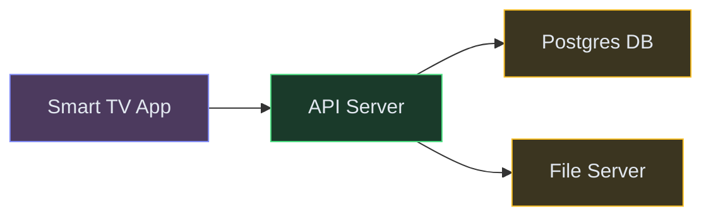
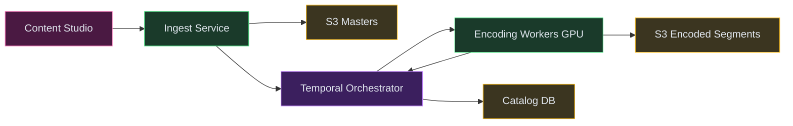
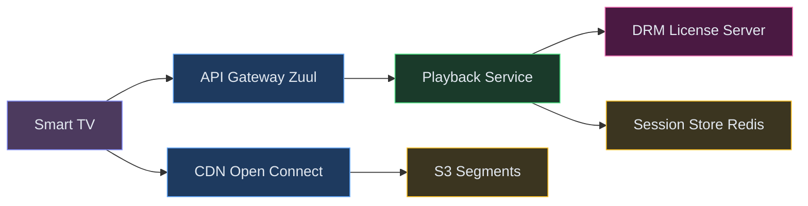
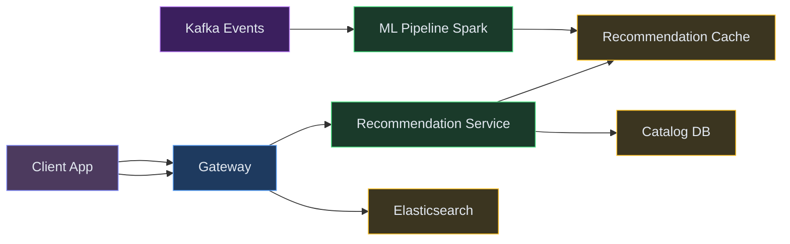
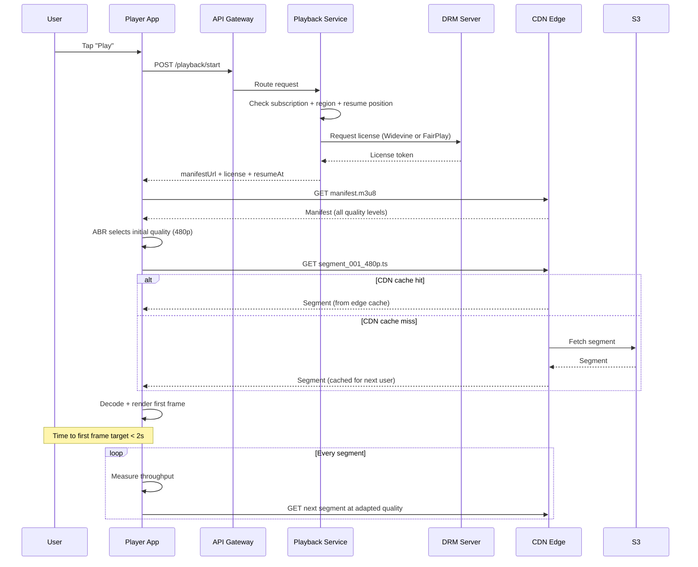
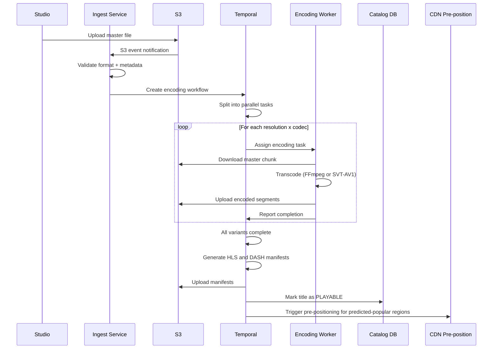
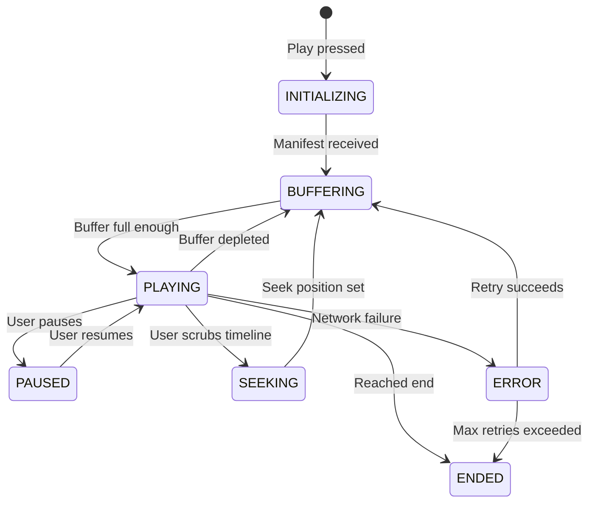
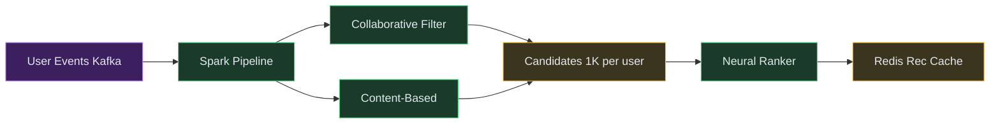
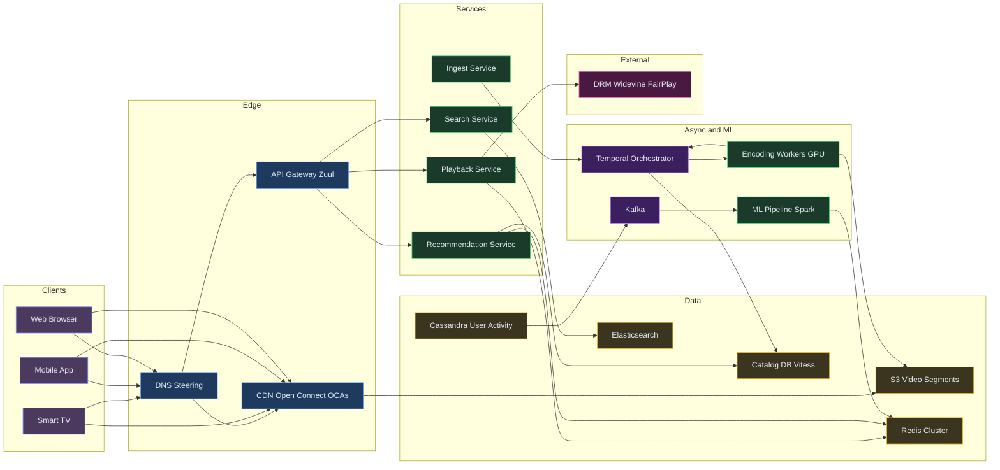

# Designing Netflix / YouTube - Video Streaming Platform

⚡ **Difficulty:** Advanced 🏷️ **Topics:** Video Encoding Pipeline, CDN, Adaptive Bitrate Streaming, Recommendation Engine, Content Catalog 🏢 **Asked at:** Netflix, YouTube, Disney+, Amazon Prime Video, Hotstar
📋 **Prerequisites:** [Fundamentals](/concepts) - especially [CDN](/concepts#cdn-content-delivery-network) and [Message Queues](/concepts#message-queues)

---

## 1. Understanding the Problem

Netflix is a video streaming platform that lets content creators upload video, encodes it into dozens of format/resolution/bitrate combinations, distributes it globally via CDN, and streams it to users with adaptive quality based on their connection speed. The system serves 200M+ concurrent users, each streaming a unique video at a unique bitrate. The hardest parts: encoding pipeline (converting one upload into 100+ playable variants), CDN distribution (getting the right bits to the right edge node before the user needs them), and recommendations (deciding what to show each user from a catalog of 15,000+ titles).

---

## 1.5. Naive First Cut



| Color | Meaning |
|---|---|
| 🟠 Purple | Client |
| 🔵 Blue | Edge / Gateway |
| 🟢 Green | Service |
| 🟣 Purple | Async (Workflow / Queue) |
| 🟡 Yellow | Data store |
| 🔴 Pink | External |


**How this breaks:**
- Single file server can't serve 200M concurrent streams - bandwidth alone would be 200 Tbps
- No encoding pipeline - raw 4K master files are too large (50GB per hour of content) to stream directly
- No adaptive quality - users on 3G get buffer wheels, users on fiber get potato quality
- Centralized serving means 500ms+ latency for users far from origin (India streaming from US-West)
- No personalization - everyone sees the same homepage, engagement drops
- Single DB can't handle 200M concurrent session lookups + play position tracking

The rest of the doc evolves this into a globally distributed streaming platform with intelligent encoding, edge delivery, and personalized recommendations.

---

## 1.7. Prior Art We're Drawing From

- **Netflix Open Connect** - Netflix's own CDN: custom hardware appliances (OCAs) deployed inside ISP networks. Serves 95%+ of traffic from within the ISP, eliminating internet transit costs. Pre-positions content overnight based on popularity predictions. ([Netflix Open Connect overview](https://openconnect.netflix.com/))
- **YouTube Vitess (Video Metadata at Scale)** - Sharded MySQL via Vitess for video metadata, serving billions of queries/day. Demonstrates that video catalogs need a horizontally scalable metadata tier. ([Vitess.io](https://vitess.io/))
- **Netflix Zuul (API Gateway)** - Edge gateway handling auth, routing, canary deployments, and load shedding for 200M+ users. Shows why a smart edge layer is critical for streaming. ([Netflix Zuul blog](https://netflixtechblog.com/open-sourcing-zuul-2-82ea476cb2b3))
- **Netflix Cosmos (Encoding Pipeline)** - Microservice-based media processing platform replacing the monolithic encoder. Uses per-title encoding to optimize bitrate per scene complexity. ([Netflix Tech Blog - Cosmos](https://netflixtechblog.com/the-netflix-cosmos-platform-35c14d9351ad))
- **Netflix Recommendations (Two-Stage Ranking)** - Candidate generation via collaborative filtering, then re-ranking via deep learning. Row-based homepage layout driven by ML. ([Netflix Tech Blog - Recommendations](https://netflixtechblog.com/netflix-recommendations-beyond-the-5-stars-part-1-55838468f429))

---

## 2. Functional Requirements

### Core (Top 3)

1. **Upload and encode video content** - content team uploads master files; system encodes into multiple resolutions, bitrates, and codecs
2. **Stream video with adaptive bitrate** - users watch content with quality that adjusts to their bandwidth in real-time
3. **Personalized recommendations** - homepage shows titles ranked by predicted relevance for each user

### Below the Line

- User profiles and parental controls
- Offline downloads
- Subtitles and multi-language audio
- Watch party (synchronized playback)
- Content licensing and regional availability

---

## 3. Non-Functional Requirements

### Core

| NFR | Target |
|---|---|
| **Start Playback** | Time to first frame < 2 seconds globally |
| **Buffer-free** | 99% of streams play without rebuffering |
| **Scale** | 200M+ concurrent streams during peak (Sunday evening) |
| **Availability** | 99.99% - downtime during prime time is front-page news |

### Below the Line

- Encoding pipeline completes within 4 hours of upload (not user-facing latency)
- Recommendation freshness: incorporate new viewing signals within 1 hour
- Multi-region disaster recovery for control plane

## Scale Estimation (Back-of-Envelope)

- **Users:** 200M concurrent streams at peak (Sunday evening globally)
- **Write QPS:** 20M heartbeats/10s = 2M writes/sec (playback position tracking)
- **Read QPS:** 5M recommendation requests/sec at homepage load (200M users × periodic refreshes)
- **Storage:** ~100PB total content (15,000 titles × 30 encoding variants × avg 2GB per variant)
- **Bandwidth:** ~200 Tbps aggregate at peak (200M streams × avg 5 Mbps adaptive bitrate)

---

## Technology Choices

| Tier | Purpose | Stores | Access Pattern | Primary | Alternatives |
|---|---|---|---|---|---|
| Object Storage | Master files and encoded segments | Raw uploads + HLS/DASH segments | Write once, read via CDN | S3 | GCS, Azure Blob |
| CDN | Video segment delivery | Encoded segments cached at edge | Ultra-high throughput reads | Open Connect (custom) | CloudFront, Akamai, Fastly |
| Content Catalog DB | Title metadata, episodes, licensing | Structured catalog data | Read-heavy, complex queries | Postgres (Vitess-sharded) | CockroachDB, Spanner |
| User Activity Store | Watch history, progress, ratings | Time-series user events | High-write (play events), read for recs | Cassandra | DynamoDB, ScyllaDB |
| Encoding Queue | Encoding job orchestration | Job state, dependencies, retries | Workflow orchestration | Temporal or Cadence | Step Functions, Airflow |
| Recommendation Cache | Pre-computed user recommendations | Ranked title lists per user | High-QPS reads on homepage load | Redis Cluster | Memcached, DynamoDB DAX |
| Event Bus | User events, encoding events | Streaming events | High-throughput append, multiple consumers | Kafka | Redpanda, Kinesis |
| Search Index | Title search, genre browse | Catalog text + facets | Full-text + filtered queries | Elasticsearch | OpenSearch, Meilisearch |
| Session Store | Playback state, DRM tokens | Ephemeral session data | High-QPS read/write | Redis | Memcached |

**Why a custom CDN (Open Connect), not CloudFront?**
At Netflix's scale (15% of global internet traffic during peak), paying per-GB to a CDN provider is prohibitively expensive. Custom hardware appliances (Open Connect Appliances - OCAs) placed inside ISP networks cost $0.001/GB vs $0.02+/GB for commercial CDNs. Saves $1B+/year.

**Why Temporal for encoding, not a simple queue?**
Video encoding is a multi-step workflow: split → encode each resolution → validate → package into HLS/DASH → DRM encrypt → publish. Steps have dependencies, retries, and can take hours. Temporal handles long-running workflows with checkpointing, retry policies, and visibility - far better than chaining SQS queues.

---

## 4. Core Entities

- **Title** - movie or series metadata: name, genre, cast, rating, licensing regions
- **Video Asset** - physical encoding: resolution, bitrate, codec, segment manifest
- **Encoding Job** - workflow state for converting a master into playable assets
- **User Profile** - preferences, watch history, ratings, maturity settings
- **Playback Session** - active stream: title, position, quality level, device info
- **Recommendation** - pre-computed ranked list of titles for a user

---

## 5. API / System Interface

```text
POST /api/v1/content/upload
  Body: { titleId, masterFileUrl (S3 pre-signed), metadata }
  Response: { encodingJobId, status: "QUEUED", estimatedCompletion }
  Auth: Internal service token (content team only)

GET /api/v1/browse/home?profileId=<id>
  Response: { rows: [{ rowTitle, titles: [{ titleId, thumbnail, matchScore }] }] }
  Note: Personalized homepage with ranked rows

POST /api/v1/playback/start
  Body: { titleId, profileId, deviceType, preferredQuality }
  Response: { sessionId, manifestUrl (HLS/DASH), licenseUrl (DRM), resumePosition }
  Note: Returns manifest URL pointing to CDN

POST /api/v1/playback/heartbeat
  Body: { sessionId, currentPosition, currentBitrate, bufferHealth }
  Response: { continue: true }
  Note: Sent every 10s to track progress and detect abandonment

GET /api/v1/search?q=<query>&filters=genre,year
  Response: { results: [{ titleId, title, matchType, thumbnail }] }
```

---

## 6. High-Level Design

### FR1: Upload and Encode Video Content

When a studio delivers a new movie to Netflix, it arrives as a massive master file (ProRes 4K, 50-100GB). We need to convert it into playable formats: multiple resolutions (240p to 4K), multiple bitrates per resolution, multiple codecs (H.264, H.265, VP9, AV1), and package them into streamable segments (HLS for Apple, DASH for everything else). This is a multi-hour pipeline.

**New components:**

1. **Ingest Service** - Receives upload notification, validates master file, creates encoding job. Think of it as the "front desk" for new content.
2. **Encoding Orchestrator (Temporal)** - Manages the multi-step encoding workflow.<br>💡 *Temporal is a workflow engine that breaks complex jobs into steps, handles retries, and checkpoints progress. If a step fails after 2 hours of encoding, it retries just that step, not the whole job.*
3. **Encoding Workers** - GPU-powered machines that do the actual transcoding. Each worker handles one resolution/bitrate variant.
4. **Object Storage (S3)** - Stores master files and all encoded segments. Organized as `titles/{titleId}/assets/{resolution}_{bitrate}/{segment_000.ts}`
5. **Content Catalog DB** - Stores metadata about what's available: which encodings exist, which regions can play it, licensing windows.




**Step-by-step flow:**

1. Studio uploads master file to a designated S3 bucket (pre-signed URL, resumable upload for 100GB files)
2. S3 event notification triggers Ingest Service. It validates: correct codec? correct resolution? audio tracks present?
3. Ingest Service creates an encoding job in Temporal with parameters: target resolutions (240p, 360p, 480p, 720p, 1080p, 4K), codecs (H.264, H.265, AV1), bitrate ladder
4. Temporal orchestrator splits the job into parallel tasks: one per resolution×codec combination (~20-30 tasks per title)
5. Each Encoding Worker picks a task: downloads the master (or a pre-split chunk), transcodes to target format using FFmpeg/x265/SVT-AV1, outputs 4-second segments
6. Workers upload segments to S3 Encoded bucket, report completion to Temporal
7. After all variants complete, Temporal triggers packaging: generate HLS manifests (.m3u8) and DASH manifests (.mpd) that list all available quality levels
8. Final step: update Catalog DB marking title as "playable" + push to CDN pre-positioning queue

---

### FR2: Stream Video with Adaptive Bitrate

When a user hits "Play," we need to start delivering video segments immediately and adapt quality to their bandwidth in real-time. If they're on WiFi, stream 4K. If they switch to cellular, drop to 720p without buffering.

The key protocol: **HLS (HTTP Live Streaming)** or **DASH (Dynamic Adaptive Streaming over HTTP)**.<br>💡 *Both work the same way: the video is split into small segments (2-4 seconds each). A manifest file lists all available quality levels. The player fetches segments one at a time, choosing quality level based on current bandwidth.*

**New components:**

1. **Playback Service** - Handles play requests. Resolves DRM license, generates manifest URL, records session start.
2. **CDN Edge (Open Connect)** - Serves video segments from ISP-local caches. The user's player fetches segments directly from the nearest OCA.
3. **ABR Client (in-player)** - The adaptive bitrate algorithm running on the user's device. It decides which quality to request next based on buffer level and throughput estimates.
4. **Session Store (Redis)** - Tracks active playback sessions: position, quality, buffer health. Used for resume and analytics.



**Step-by-step flow:**

1. User hits "Play" on a title → app sends `POST /playback/start` to Playback Service
2. Playback Service checks: Is this title available in user's region? Does user have an active subscription? What was their last watch position (resume)?
3. Service requests a DRM license from the License Server (Widevine for Android/Chrome, FairPlay for Apple, PlayReady for Windows)
4. Service returns: manifest URL (pointing to CDN), DRM license, resume position
5. Player downloads the manifest from CDN - it lists all quality levels (e.g., 240p@300kbps, 480p@1.5Mbps, 1080p@5Mbps, 4K@15Mbps)
6. ABR algorithm starts conservative: first segment at medium quality (480p). Measures download speed.
7. If segment downloaded faster than real-time → next segment at higher quality. If slower → drop quality.
8. Player fetches segments sequentially from CDN edge. CDN cache hit → instant. Cache miss → pull from S3 origin, cache locally.
9. Every 10 seconds, player sends heartbeat with current position + bitrate → Session Store updates.

---

### FR3: Personalized Recommendations

When users open Netflix, they see a homepage with rows of titles ("Because you watched X," "Trending Now," "Top 10 in India"). Each user's homepage is different. Recommendation quality directly drives engagement and retention - Netflix estimates their rec system is worth $1B/year in reduced churn.

**New components:**

1. **Recommendation Service** - Serves pre-computed recommendations for a user profile. Returns ranked rows of titles.
2. **ML Recommendation Pipeline (offline)** - Batch job that runs every few hours: takes all user viewing history, computes collaborative filtering + content-based signals, generates ranked lists per user.
3. **Event Collector (Kafka)** - Ingests real-time user events (play, pause, skip, rate, browse). Feeds both the offline pipeline and real-time signals.
4. **Recommendation Cache (Redis)** - Stores pre-computed homepage for each active user. Homepage load = one Redis GET.
5. **Content Catalog + Search (Elasticsearch)** - Powers the search bar and genre browsing with full-text + faceted search.



**Step-by-step flow:**

1. User opens Netflix app → `GET /browse/home?profileId=X` hits Recommendation Service
2. Service checks Redis cache for pre-computed homepage (key: `recs:{profileId}`)
3. Cache hit (99% of cases) → return immediately. Homepage loads in < 200ms.
4. Cache miss (new user or cache expired) → fall back to popularity-based defaults while async job computes personalized recs
5. Meanwhile, every user action (play, pause at 5 min, finish, skip after 30s, add to list) → published to Kafka as events
6. ML Pipeline (runs on Spark every 4 hours): consumes all events, updates user embeddings (collaborative filtering), combines with content features (genre, cast, director), generates ranked homepage per user
7. Pipeline writes results to Redis cache. Next homepage load picks up fresh recommendations.
8. Search queries hit Elasticsearch: full-text on title/cast/director + filters (genre, year, rating)

---

## 6.5. Core Flows

### Flow 1: Video Playback Start-to-Stream



**Non-obvious failure path:** If CDN edge is overloaded (flash crowd for a new release), the player's ABR algorithm detects slow segment downloads and drops quality aggressively. If even the lowest quality buffers, the player switches to a different CDN PoP (DNS-based failover). Playback Service also maintains a "steering" endpoint that can redirect players away from saturated edges.

### Flow 2: Encoding Pipeline



**Non-obvious failure path:** If an encoding worker crashes mid-transcode (GPU OOM, spot instance reclaimed), Temporal automatically retries the failed task on a different worker. The worker resumes from the last completed segment (checkpointed in Temporal state). Partial segments in S3 are overwritten. The overall workflow only fails if a single task exceeds 5 retries - then it's flagged for manual review.

### Playback Session State Machine



---

## 7. Deep Dives

### Deep Dive 1: Video Encoding Pipeline - Per-Title Encoding

**Bad:** Fixed bitrate ladder - encode every title at the same bitrates (e.g., 1080p always at 5Mbps). Animated movies (simple scenes) waste bits; action movies (complex scenes) look blocky.

**Good:** Per-resolution encoding - analyze content complexity and assign optimal bitrate per resolution. "My Little Pony" at 1080p needs only 2Mbps; "Mad Max" needs 8Mbps. But: analyzing the entire movie adds encoding time.

**Great:** Per-shot encoding (borrowing from Netflix Cosmos):

1. **Scene detection:** Split video into shots (scene changes detected via frame difference). Each shot gets its own optimal encoding parameters.
2. **Convex hull optimization:** For each shot, encode at multiple bitrate/quality points. Plot quality (VMAF score) vs bitrate. Find the convex hull - the set of points that gives maximum quality per bit.
3. **Bitrate allocation:** Given a target average bitrate for the stream, allocate more bits to complex shots and fewer to simple shots. Result: consistent visual quality throughout.
4. **Codec selection:** Encode each title in H.264 (compatibility), H.265 (50% more efficient, most devices), and AV1 (30% more efficient than H.265, newer devices). Client picks best codec their device supports.


**Cost consideration:** Per-shot encoding increases compute time by 3x vs fixed-ladder. But savings in storage and bandwidth (20-30% smaller files at same quality) pay back within weeks for popular titles. Netflix encodes each new title once; it's streamed millions of times.

---

### Deep Dive 2: CDN Architecture - Open Connect

**Bad:** Use a commercial CDN (CloudFront, Akamai) - at Netflix scale (15% of global internet traffic), per-GB pricing is ruinous ($0.02/GB × exabytes/month = billions/year).

**Good:** Build your own CDN with PoPs in major metros. Better cost, but ISP peering still adds latency and transit costs.

**Great:** Deploy custom appliances (OCAs) directly inside ISP networks:

1. **Open Connect Appliances (OCAs):** Custom servers with 100+ TB SSD storage + 100Gbps NIC. Deployed inside ISP data centers (Comcast, Vodafone, Jio, etc.).
2. **Pre-positioning (proactive caching):** Every night, a popularity prediction model identifies which titles will be watched tomorrow in each region. Those titles are pushed to local OCAs overnight (off-peak bandwidth is nearly free).
3. **Fill strategy:** Cache miss on an OCA → fetch from a parent OCA (regional hub) → only if parent misses → fetch from S3 origin. Three-tier hierarchy minimizes origin load.
4. **Steering:** Control plane selects the best OCA for each client based on: network proximity, current load, content availability. Uses DNS-based and HTTP redirect steering.

**Result:** 95%+ of bytes served from within the user's ISP network. Latency < 5ms for segment fetch. ISPs benefit too (no transit costs for Netflix traffic), so they deploy OCAs for free.

**Cache eviction:** LRU with popularity weighting. A title watched by 1000 users/day stays cached over one watched by 10 users/day, even if the latter was accessed more recently.

---

### Deep Dive 3: Adaptive Bitrate Streaming (ABR Algorithms)

**Bad:** Fixed quality - user selects "HD" and it stays there. When bandwidth drops, video buffers for 30 seconds while next segment downloads.

**Good:** Simple throughput-based ABR - measure download speed of last segment, choose next quality that fits within that bandwidth. But: highly reactive, causes frequent quality oscillation (480p → 1080p → 480p every few seconds). Jarring user experience.

**Great:** Buffer-based ABR with throughput smoothing (borrowing from Netflix's practical ABR research):

1. **Buffer-Based (BBA):** Decision is driven by buffer level, not just throughput. If buffer is full (30s ahead), be aggressive (higher quality). If buffer is low (< 5s), be conservative (lower quality). Smooth transitions.
2. **Throughput estimation:** Use harmonic mean of last 5 segment downloads (not arithmetic mean - resists outliers from temporary spikes).
3. **Startup optimization:** During initial buffering, start at lowest quality for the first 2 segments (fast start, reduces time-to-first-frame). Then ramp up aggressively once buffer grows.
4. **Quality lock:** Once at a stable quality for 30+ seconds, don't drop unless buffer is critically low. Prevents flicker.

```text
Pseudocode for ABR decision:
  buffer_level = current_buffer_seconds
  throughput = harmonic_mean(last_5_segments_speed)
  
  if buffer_level > 30s:
      quality = highest where bitrate < throughput * 0.9
  elif buffer_level > 10s:
      quality = current_quality  (hold steady)
  elif buffer_level > 5s:
      quality = max(current_quality - 1, lowest)
  else:
      quality = lowest  (emergency drop)
```

**Why not server-side ABR?**
The client knows its actual buffer state and network conditions in real-time. Server can't know if the user is on WiFi or just entered a tunnel. Client-side ABR reacts in < 100ms; server-side would add round-trip latency to every quality decision.

---

### Deep Dive 4: Recommendation Engine

**Bad:** Show everyone the same "Top 10" list - no personalization, engagement drops, churn increases.

**Good:** Collaborative filtering only - "users who watched X also watched Y." Works well for popular content but fails for niche titles and new users (cold start problem).

**Great:** Two-stage pipeline with hybrid signals:

**Stage 1 - Candidate Generation (offline, runs every 4 hours on Spark):**
- **Collaborative filtering:** Matrix factorization on user-item interaction matrix. Each user and title gets a 128-dimension embedding. Similarity in embedding space = likely interest.
- **Content-based:** Encode title features (genre, director, cast, keywords, avg shot length) into embeddings. Match against user preference vector.
- **Output:** 1000 candidate titles per user (from 15K catalog).

**Stage 2 - Ranking (near-real-time, per request):**
- **Features:** Candidate title embedding + user context (time of day, device, recent watches, account age).
- **Model:** Lightweight neural net (2-layer MLP) predicting P(watch > 70% of title).
- **Inference:** < 10ms for 1000 candidates on CPU. Results sorted by score.
- **Row assembly:** Group ranked titles into themed rows ("Because you watched Stranger Things," "Trending," "New Releases"). Each row is a retrieval source.



**Cold start (new user):** First session uses onboarding quiz (pick 3 genres you like) + popularity-based defaults. After 5+ interactions, collaborative filtering kicks in.

**Freshness vs compute tradeoff:** Full pipeline rerun every 4 hours. But: real-time signals (user just finished a horror movie → boost horror in next homepage load) are injected via a lightweight "re-ranker" that adjusts cached scores using the last 30 minutes of activity.

---

### Deep Dive 5: Content Pre-positioning and Cache Warming

**Problem:** When a new blockbuster drops (Stranger Things Season 5), millions of users hit play within minutes. If the content isn't pre-cached on edge nodes, all requests slam the origin - massive latency spike.

**Bad:** Reactive caching - first user in each region triggers origin fetch. For a 2-hour movie at 4K, that's a 20GB pull per OCA on first play. Multiply by 10,000 OCAs = 200TB origin egress in one hour.

**Good:** Push content to all OCAs 24 hours before release. But: OCA storage is limited (100TB). Pushing everything everywhere is wasteful - content that's popular in India may get 0 plays in Brazil.

**Great:** Predictive pre-positioning with regional popularity models:

1. **Popularity prediction:** ML model trained on: historical premiere viewership, pre-release engagement (trailers watched, "remind me" clicks), genre popularity per region, time of year, marketing spend.
2. **Regional allocation:** Model predicts views-per-region for the first 48 hours. Content pushed to OCAs proportionally - more copies in high-demand regions, fewer in low-demand.
3. **Fill during off-peak:** Transfers happen 2AM-6AM local time when ISP bandwidth is idle. OCAs pull from regional hubs (not origin directly).
4. **Dynamic rebalancing:** After release, actual viewership data feeds back. If Brazil has unexpected demand, nearby OCAs serve while additional copies propagate.
5. **Tiered encoding push:** Push only the most popular bitrates first (1080p H.265, 720p H.264). Niche formats (4K AV1) stay at regional hubs until demanded.

**Result:** For a major premiere, 99%+ of first-play requests hit warm OCA cache. Origin egress stays flat regardless of demand spike.

---

### Deep Dive 6: Playback Reliability and Error Resilience

**Problem:** Users are watching on unreliable networks (cellular, congested WiFi, train tunnels). Any interruption > 2 seconds and they close the app.

**Bad:** Single CDN endpoint - if it goes down, playback stops entirely.

**Good:** Retry on same CDN with exponential backoff. But: if the problem is the CDN node itself (hardware failure, network partition), retries never succeed.

**Great:** Multi-level resilience with fast failover:

1. **Segment-level retry:** If a segment fetch fails or times out (3s), immediately retry from a different CDN PoP (player knows 3+ candidate OCAs from steering).
2. **Quality downshift on repeated failure:** If 2 consecutive segments fail at current quality, drop to lowest bitrate (which has smaller segments, more likely to succeed on degraded network).
3. **Buffer-based tolerance:** ABR algorithm maintains a 30-second buffer when healthy. This "runway" absorbs network glitches - user doesn't notice a 5-second outage if buffer covers it.
4. **Session resume:** If player crashes or device sleeps, resume from exact position (stored in Session Store every 10s). User re-opens app → continues from where they left off, no buffering.
5. **CDN steering updates:** Every 30 seconds, player pings the steering service for updated CDN PoP rankings. If their current OCA is degraded, next segment fetches from a better one.

**Backstop:** If all CDN PoPs in a region fail (rare, ISP-level outage), players fall back to fetching from a regional hub OCA in a neighboring ISP. Higher latency (50ms vs 5ms) but playback continues.

---

## 7.5. Design Self-Audit

| Question | Answer |
|---|---|
| Dedicated search index? | ✅ Elasticsearch for title/cast/genre search. Covered in FR3 components. |
| Stale reads after writes? | Encoding: title marked PLAYABLE only after all variants confirmed. Recs: 4-hour staleness acceptable for homepage; real-time re-ranker handles short-term signals. |
| Single points of failure? | CDN is massively distributed (10K+ OCAs). Catalog DB is sharded (Vitess). Temporal orchestrator has its own HA (multiple workers, durable state). Playback Service is stateless behind LB. |
| Dead-letter / reconciliation? | Encoding: failed tasks retry 5x in Temporal, then flag for review. Playback: heartbeat timeout after 5 minutes marks session as abandoned (for analytics). |
| Data freshness across caches? | Rec cache refreshed every 4 hours + real-time re-ranker. CDN content is immutable (new encoding = new URL). Session store is real-time (Redis). |
| Cost at scale? | CDN (Open Connect): dominant cost, mitigated by ISP partnerships. Encoding: GPU compute is expensive but one-time per title. Storage: tiered S3 (originals archived to Glacier after encoding). Rec pipeline: Spark cluster - scales with user base. |

---

## 8. Final Architecture



---

*Want a deep dive on DRM (content protection), offline downloads, multi-language audio switching, or live streaming (sports events)? Drop a comment below 👇*

---

## Key Technologies Mentioned

| Term | What it is |
|---|---|
| **HLS / DASH** | HTTP-based streaming protocols that split video into small segments and let the player pick quality per segment. |
| **ABR (Adaptive Bitrate)** | Client-side algorithm that switches video quality in real-time based on available bandwidth and buffer level. |
| **CDN / Open Connect** | Content Delivery Network; Netflix's custom CDN places appliances inside ISPs to serve 95%+ of traffic locally. |
| **Per-Title Encoding** | Analyzing each title's visual complexity to assign optimal bitrate per resolution instead of a fixed ladder. |
| **Temporal / Cadence** | Durable workflow engines that checkpoint multi-step encoding jobs so crashed steps retry without restarting the whole pipeline. |
| **Kafka** | Distributed event log used here for user activity streaming, encoding events, and decoupling services. |
| **Cassandra** | Wide-column NoSQL store used for high-write user activity data (watch history, play events). |
| **Redis** | In-memory cache used for recommendation results, session state, and playback position tracking. |
| **Elasticsearch** | Search engine powering full-text title search and genre browsing with faceted filtering. |
| **DRM (Widevine / FairPlay)** | Digital Rights Management systems that encrypt video content and issue device-specific playback licenses. |

---

## What's Expected at Each Level

> This section helps you calibrate your depth. You don't need to cover everything - just know what's expected for your level.

### Mid-level

Outline the upload → encode → store → stream flow. Understand why a CDN is needed for latency and bandwidth at scale. Describe HLS/DASH at a high level - the idea of splitting video into segments and serving a manifest. With prompting, discuss adaptive bitrate and why users can't just download a single fixed-quality file.

### Senior

Propose per-title encoding optimization (different bitrate ladders for animated vs action content). Explain the CDN cache hierarchy (edge → regional → origin) and why three tiers matter. Discuss the recommendation pipeline (offline batch candidate generation + online re-ranking). Articulate the ABR algorithm trade-offs - buffer-based vs throughput-based - and why client-side ABR beats server-side.

### Staff+

Address custom CDN economics (Open Connect vs commercial CDN at Netflix scale - $0.001/GB vs $0.02/GB). Discuss predictive pre-positioning of content based on popularity models and how overnight off-peak bandwidth is leveraged. Explain DRM license serving architecture and the cold-start recommendation problem. Articulate what happens when a new blockbuster drops and millions hit play simultaneously - cache warming, origin shielding, and steering.


---
## 🎯 Key Takeaways

- **Per-shot encoding** optimizes bitrate per scene complexity - saves 20-30% bandwidth
- **Open Connect CDN** inside ISPs serves 95% of traffic locally
- **Adaptive Bitrate (ABR)** driven by buffer level, not just throughput
- **Two-stage recommendation**: collaborative filtering (offline) → neural ranker (online)

---
## Related Designs
- [URL Shortener](/hld/URLShortner) - CDN caching patterns and redirect optimization
- [Chat System](/hld/ChatSystem) - real-time delivery and session management
- [Notification System](/hld/NotificationSystem) - push notification infrastructure
