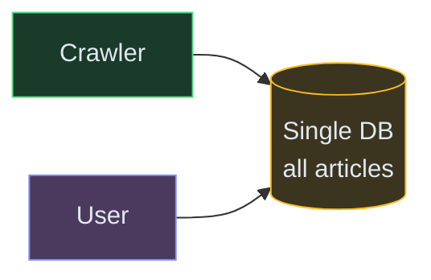
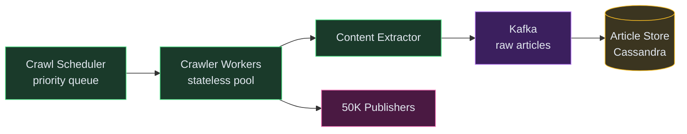
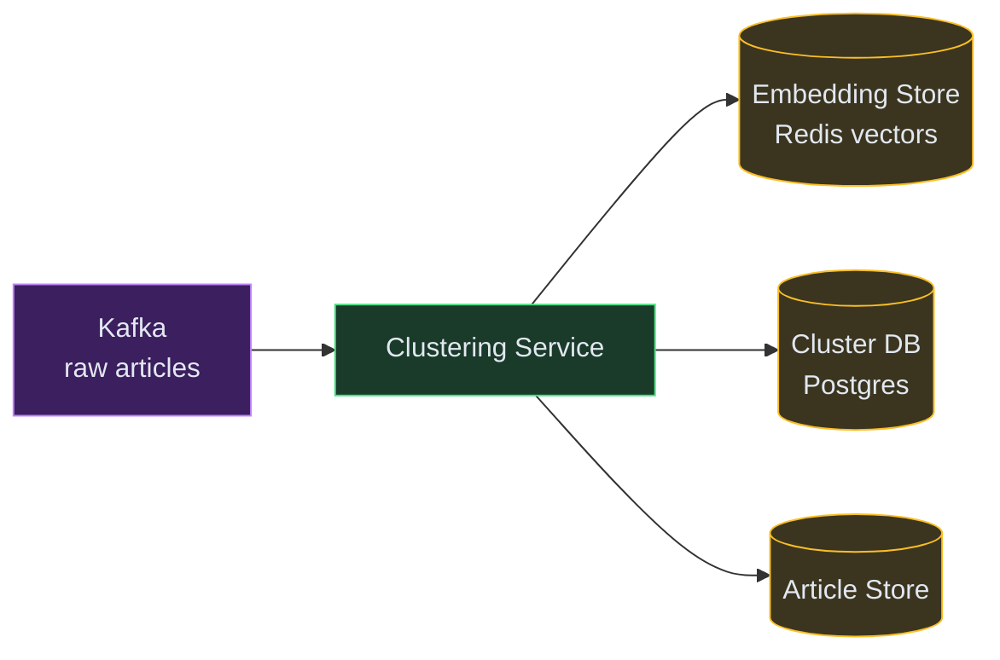
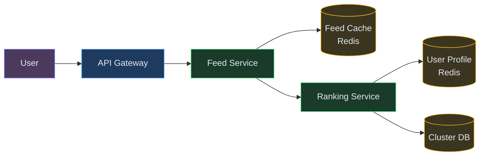
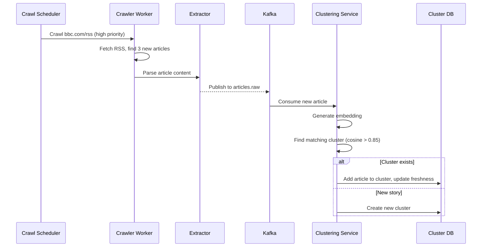
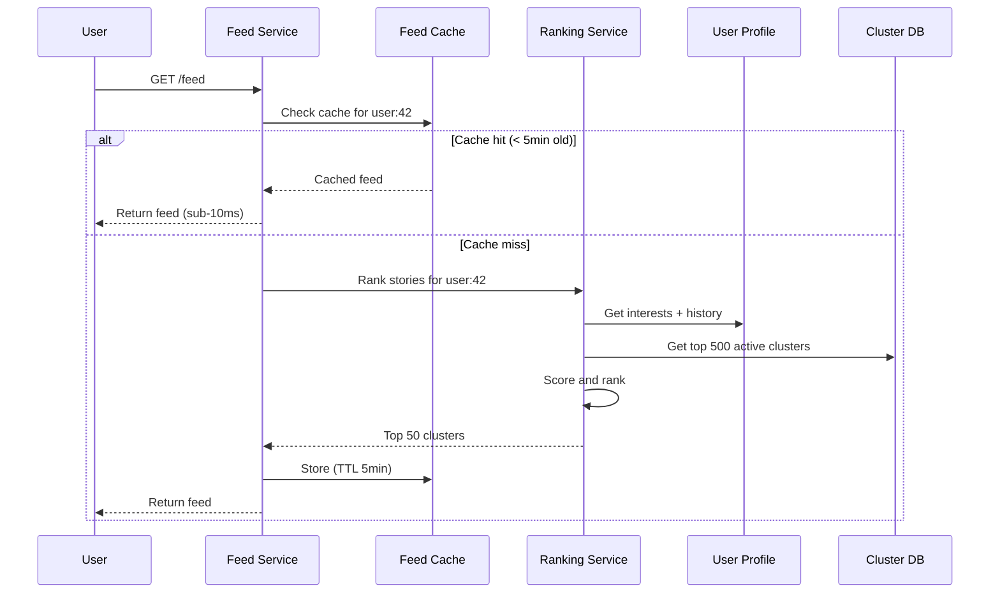
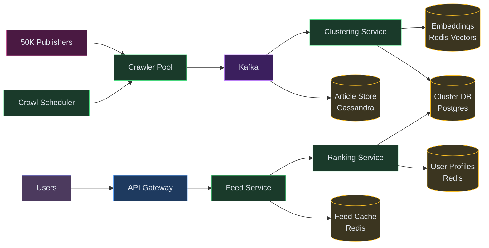

# Designing a News Aggregator (Google News / Apple News)

⚡ **Difficulty:** Intermediate 🏷️ **Topics:** Crawling, NLP Deduplication, Feed Ranking, Trending Detection, Caching 🏢 **Asked at:** Google, Amazon, Microsoft, Apple, Flipkart
📋 **Prerequisites:** [Fundamentals](/concepts) - especially [Caching](/concepts#caching), [Message Queues](/concepts#message-queues), and [Database Indexing](/concepts#database-indexing)

---

## 1. Understanding the Problem

A news aggregator continuously collects articles from thousands of publishers around the world, removes duplicates (50 sources might cover the same event), ranks them by relevance and freshness, and serves personalized feeds to millions of users. The hard parts: ingesting content from unreliable sources at scale, detecting that 200 articles are about the same event, handling breaking news spikes (traffic 10x during elections or disasters), and personalizing without a cold-start problem.

**Real examples:** Google News (aggregates from 50K+ sources), Apple News, Flipboard, Inshorts, Microsoft Start.

---

## 1.5. Naive First Cut



Crawl RSS feeds periodically, dump articles into a database, serve them sorted by time.

**Why this breaks:**

- No deduplication - same story from 50 sources clutters the feed
- No personalization - everyone sees the same feed regardless of interests
- Crawling 50K sources sequentially takes hours - stale news
- Breaking news takes too long to surface (waiting for next crawl cycle)
- Single DB can't handle 100M+ articles + millions of feed queries
- No concept of "topics" or "stories" - just a flat list of articles

---

## 1.7. Prior Art We're Drawing From

- **Google News Clustering** - Groups articles about the same event into "story clusters" using NLP similarity. A story cluster has one headline, multiple source links, and a freshness score that decays over time. ([Google Blog](https://www.blog.google/products/news/look-how-news-google-works/))
- **Facebook News Feed Ranking** - Multi-stage ranking pipeline: candidate generation (1000s) → lightweight ranker (100s) → heavy ranker (top 50). Balances engagement prediction with content quality signals. ([Facebook Engineering](https://engineering.fb.com/2021/01/26/ml-applications/news-feed-ranking/))
- **Twitter Trends Detection** - Detects trending topics by comparing current mention velocity against historical baseline. A topic "trends" when its current rate exceeds the expected rate by a statistical threshold, not just when volume is high. ([Twitter Engineering](https://blog.twitter.com/engineering/))
- **Apache Kafka + Flink at LinkedIn** - Real-time content processing pipeline that ingests millions of events, enriches them, deduplicates, and routes to multiple downstream consumers (feed, notifications, search index). ([LinkedIn Engineering](https://engineering.linkedin.com/))

---

## 2. Functional Requirements

### Core (Top 3)

1. **Ingest articles from thousands of sources** - continuously crawl/receive articles from 50K+ publishers via RSS, APIs, and webhooks
2. **Deduplicate and cluster** - group articles about the same event into story clusters, surface the best source as the headline
3. **Serve personalized feed** - each user sees a ranked feed based on their interests, reading history, and location

### Below the Line

- Breaking news push notifications
- Topic following and custom sections
- Publisher credibility scoring
- Fact-check labels
- Offline reading / save for later
- Comments and social sharing

---

## 3. Non-Functional Requirements

| NFR | Target |
|---|---|
| **Freshness** | Breaking news appears within 2-5 minutes of first publication |
| **Scale** | 50K sources, 1M+ new articles/day, 100M+ DAU |
| **Feed latency** | Personalized feed served in < 200ms P99 |
| **Availability** | 99.99% - news is time-sensitive, downtime means missed events |

### Below the Line

- Multi-language support (50+ languages)
- Regional content laws compliance (right to be forgotten)
- Publisher analytics dashboard

---

## Scale Estimation

- **Sources:** 50K publishers, crawled every 5-15 minutes
- **Ingestion:** ~1M new articles/day, 10K/hour average, 50K/hour during breaking events
- **Storage:** ~500GB new article content/month (title + body + metadata), 5TB with media links
- **Read QPS:** 50K feed requests/sec at peak (100M DAU x 5 opens/day / 86400)
- **Story clusters:** ~50K active clusters at any time, 500K total/month

---

## 4. Core Entities

- **Article** - URL, title, body, publisher, publish time, language, category, media
- **Publisher** - name, domain, credibility score, crawl frequency, RSS/API endpoint
- **Story Cluster** - a group of articles about the same event, with a representative headline, summary, source count, and freshness score
- **Topic** - a category or tag (Politics, Tech, Sports, etc.) that stories belong to
- **User Profile** - interests (topics followed), reading history, location, language preferences

---

## 5. API / System Interface

```text
GET /v1/feed?userId={id}&page={n}
  Response: [{ storyCluster: { headline, summary, sources[], topic, publishedAt, imageUrl } }, ...]

GET /v1/story/{clusterId}
  Response: { headline, summary, articles: [{ title, publisher, url, publishedAt }], relatedStories[] }

GET /v1/topics
  Response: [{ id, name, articleCount }]

GET /v1/trending
  Response: [{ storyCluster, velocity, region }]

POST /v1/user/interests
  Body: { topics: ["tech", "sports"], publishers: ["bbc", "reuters"] }
  Response: 200 OK
```

> **Security note:** Feed is read-only for users. Article ingestion is internal only (no user-submitted content). Rate-limit feed API to prevent scraping.

---

## 6. High-Level Design

### FR1: Ingest Articles from Thousands of Sources

The first challenge: 50K publishers, each publishing 10-100 articles/day. We need to crawl them continuously, extract content, and store it. Some publishers offer RSS feeds, some have APIs, some need HTML scraping. Sources are unreliable - they go down, change formats, or throttle us.

**New components:**

1. **Crawl Scheduler** - maintains a priority queue of sources to crawl. High-priority sources (BBC, Reuters) crawled every 5 min; smaller blogs every 30 min. Adjusts frequency based on publisher's historical update rate.
2. **Crawler Workers** - stateless workers that fetch content from assigned URLs. Handle retries, rate limiting per publisher, and format parsing (RSS, Atom, HTML scraping).
3. **Content Extractor** - parses raw HTML/RSS into structured data: title, body text, publish time, author, images. Strips ads and navigation.
4. **Article Store (Cassandra)** - stores all articles durably. Partitioned by publish date for efficient time-range queries.
5. **Kafka** - decouples crawling from downstream processing. Crawlers publish raw articles; multiple consumers process them independently.



**Step-by-step flow:**

1. Crawl Scheduler pops the next source due for crawling from its priority queue
2. Assigns it to a Crawler Worker (round-robin across the worker pool)
3. Worker fetches the RSS feed or webpage, respecting robots.txt and rate limits
4. Content Extractor parses the raw content into structured article fields
5. Deduplicates at the URL level (skip if we've already seen this exact URL)
6. Publishes the new article to Kafka topic `articles.raw`
7. Downstream consumers (clustering, indexing) read from Kafka independently

**Why Kafka?** Crawling speed varies wildly (some sources respond in 50ms, some in 5s). Kafka buffers the stream so downstream processing isn't coupled to crawl speed. If the clustering service goes down for maintenance, articles queue up and are processed when it's back.

---

### FR2: Deduplicate and Cluster Articles into Stories

This is the hardest part. When a major event happens (election results, earthquake), 200 publishers write about it within minutes. We need to detect that these 200 articles are about the same event and group them into one "story cluster." The user should see one headline with "200 sources" - not 200 separate cards.

**New components:**

6. **Clustering Service** - consumes articles from Kafka, computes text similarity against existing clusters, and either assigns the article to an existing cluster or creates a new one.
7. **Embedding Store (Redis)** - stores vector embeddings of recent story clusters for fast similarity lookup. When a new article arrives, we compare its embedding against existing cluster centroids.
8. **Story Cluster DB (Postgres)** - stores cluster metadata: representative headline, source list, topic, freshness score, article count.



**Step-by-step flow:**

1. Clustering Service consumes a new article from Kafka
2. Generates a text embedding (vector) from the article's title + first paragraph
3. Queries Embedding Store: "find clusters whose centroid is within 0.85 cosine similarity"
4. **Match found?** → Add article to that cluster. Update cluster metadata (source count, freshness, representative headline if this source is more authoritative).
5. **No match?** → Create a new cluster with this article as the seed. Store its embedding as the cluster centroid.
6. Assign topic(s) to the cluster based on content classification (Politics, Tech, Sports, etc.)
7. Update freshness score: `score = article_count * recency_weight` (more sources + newer = hotter story)

**Why embeddings over keyword matching?** "Biden wins election" and "US Presidential race results announced" are about the same event but share few keywords. Semantic embeddings capture meaning, not just words. Cosine similarity of their vectors will be >0.9.

---

### FR3: Serve Personalized Feed

When a user opens the app, they need a ranked feed of story clusters tailored to their interests. A tech enthusiast in Bangalore should see different stories than a sports fan in Mumbai - even during the same news cycle.

**New components:**

9. **Feed Service** - the API layer users hit. Fetches candidate stories, applies personalization ranking, returns the final feed.
10. **User Profile Store (Redis)** - stores each user's interests, reading history (last 100 stories read), location, and language.
11. **Feed Cache (Redis)** - pre-computed feeds for active users. Refreshed every 5-10 minutes. Avoids re-ranking on every request.
12. **Ranking Service** - scores each candidate story for a specific user based on: topic relevance, freshness, source authority, diversity (don't show 5 politics stories in a row).



**Step-by-step flow:**

1. User opens app → `GET /feed?userId=42`
2. Feed Service checks Feed Cache: is there a fresh pre-computed feed? (< 5 min old)
3. **Cache hit?** → Return immediately. Sub-10ms.
4. **Cache miss?** → Call Ranking Service to build a fresh feed:
   - Fetch top 500 active story clusters from Cluster DB (sorted by freshness + article count)
   - Fetch user profile: interests, reading history, location
   - Score each cluster: `score = w1*topic_match + w2*freshness + w3*source_authority + w4*diversity_penalty`
   - Filter out stories user already read (from reading history)
   - Return top 50 ranked clusters
5. Cache the result for this user (TTL = 5 min)
6. Return feed to user

**Why cache feeds?** At 50K feed requests/sec, running the ranking model on every request is expensive. Most users check their feed 5-10 times between updates anyway. A 5-minute cache means 99% of requests are served without computation.

---

## 6.5. Core Flows

### Flow 1: Article Ingestion (Breaking News)



**Non-obvious failure:** If the Clustering Service is slow during a breaking news spike (100 articles/min about the same event), articles queue in Kafka. This is fine - Kafka handles backpressure naturally. The feed might show the story 30-60 seconds later than ideal, but no data is lost.

### Flow 2: Personalized Feed Load



---

## 7. Deep Dives

### Deep Dive 1: Story Clustering - Detecting Same Event Across Sources

**Problem:** 50 publishers write about the same event with different headlines, different angles, different details. We need to detect they're the same "story" and group them.

**Bad:** Keyword matching. "Biden" AND "election" → same cluster. Fails because: "Biden election victory" and "Biden election campaign funding scandal" are completely different stories sharing the same keywords.

**Good:** TF-IDF cosine similarity on article titles. Compute term-frequency vectors, compare cosine similarity. Threshold > 0.7 = same cluster. Works for obvious duplicates but misses paraphrased content ("Stock market crashes" vs "Wall Street sees worst day in a decade").

**Great:** Sentence embeddings (BERT/sentence-transformers) + incremental clustering.

1. Each article's title + first paragraph → 768-dim vector via a pre-trained model
2. New article's vector compared against all active cluster centroids using approximate nearest neighbor (FAISS or Redis Vector Search)
3. If cosine similarity > 0.85 → assign to cluster. Update centroid as running average.
4. If no match → new cluster.
5. Clusters decay: if no new article joins for 24h, cluster moves to archive.

**Latency:** Embedding generation ~10ms (GPU), ANN search ~5ms, total clustering decision < 20ms per article. At 10K articles/hour, one machine handles it.

---

### Deep Dive 2: Breaking News - How to Surface Events in Under 5 Minutes

**Problem:** A major event happens. The first publisher posts about it. Our crawler might not check that source for another 10 minutes. By then, users have already seen it on Twitter.

**Bad:** Crawl all 50K sources every 5 minutes. At 50K sources with 2s average response time, that's 100K seconds of crawl time / parallelism. Even with 100 workers = 1000 seconds per full cycle. Too slow and wasteful for sources that rarely update.

**Good:** Adaptive crawl frequency. Track how often each source publishes. BBC publishes every 2 minutes → crawl every 3 min. A local blog publishes weekly → crawl every 6 hours. Prioritize sources by historical freshness.

**Great:** Adaptive crawling + webhook push + velocity detection.

1. **Push for top publishers:** Major publishers (Reuters, AP, BBC) send webhooks when they publish. Instant - zero crawl delay.
2. **Adaptive polling for the rest:** Crawl frequency = f(publish_rate). High-velocity sources crawled every 3-5 min, low-velocity every 1-6 hours.
3. **Velocity spike detection:** If the clustering service sees 10+ new clusters created in the last 5 minutes (unusual), trigger an emergency re-crawl of all top-100 sources. Something big is happening.
4. **Breaking news flag:** Stories with cluster growth rate > 20 articles/hour get flagged as "Breaking" and boosted to the top of all feeds regardless of personalization.

---

### Deep Dive 3: Feed Ranking - Personalization Without Being a Filter Bubble

**Problem:** Pure personalization creates filter bubbles - a user who reads only tech news never sees important political events. Pure chronological is noisy - most stories aren't relevant to any specific user.

**Bad:** Sort by publish time only. User drowns in irrelevant content.

**Good:** Topic-based filtering. User follows "Tech" and "Sports" → only show stories with those topics. Simple but misses cross-topic stories the user might care about and provides no ranking within a topic.

**Great:** Multi-signal scoring with diversity constraints.

Scoring formula per story cluster for a user:

```
score = 0.3 * topic_relevance
      + 0.25 * freshness_decay
      + 0.2 * story_importance (source_count * authority_avg)
      + 0.15 * engagement_signals (CTR from similar users)
      + 0.1 * diversity_bonus (penalize 3rd story on same topic)
```

**Diversity constraint:** After ranking, apply a post-processing pass:
- No more than 2 consecutive stories from the same topic
- At least 1 "serendipity" story per page (topic the user doesn't usually read, but is nationally important)
- Breaking news always ranks in top 3 regardless of personalization

**Cold start (new users):** Use location + language to serve a "trending in your region" feed. After 10 clicks, enough signal to personalize.

---

### Deep Dive 4: Handling Traffic Spikes During Breaking Events

**Problem:** Normal traffic is 50K QPS. During election night or a natural disaster, traffic spikes to 500K QPS in minutes. The same 3 stories are requested by everyone simultaneously.

**Bad:** Every user's feed request triggers a fresh ranking computation. At 500K QPS, ranking service melts.

**Good:** Feed cache with 5-min TTL absorbs most reads. But during breaking news, users want the LATEST - a 5-min-old cache feels stale.

**Great:** Tiered caching + push invalidation.

1. **Global trending cache:** Top 10 stories for each region, updated every 30 seconds. Served to users whose personal feed cache is stale. Super cheap (one cache entry per region, millions of reads).
2. **Breaking news override:** When a story is flagged "Breaking," it's injected at the top of ALL cached feeds without regenerating the entire feed.
3. **Graceful degradation:** If ranking service is overloaded, fall back to the global trending feed + user's topic preferences (simple filter, no ML ranking). "Good enough" feed in 5ms vs perfect feed timing out.

---

## 7.5. Design Self-Audit

| Question | Answer |
|---|---|
| Single points of failure? | Kafka is replicated. Crawlers are stateless. Cluster DB has read replicas. Feed cache is Redis Cluster. |
| Stale content? | Feed cache TTL = 5 min. Breaking news bypasses cache. Acceptable for a news feed. |
| Duplicate articles? | URL-level dedup at ingestion + semantic clustering catches paraphrases. |
| Hot stories? | Trending cache absorbs 95% of reads for popular stories. |
| Publisher goes down? | Crawler retries with backoff. Missing one crawl cycle is acceptable. |

---

## 8. Final Architecture



---

## Key Technologies

| Term | What it is |
|---|---|
| **Sentence Embeddings** | ML models (BERT, sentence-transformers) that convert text into fixed-size vectors capturing semantic meaning. Similar texts have high cosine similarity. |
| **Approximate Nearest Neighbor (ANN)** | Algorithms (FAISS, HNSW) that find similar vectors without comparing against all vectors. O(log N) vs O(N). |
| **Story Clustering** | Grouping articles about the same event. The cluster has one headline, N sources, a freshness score, and decays over time. |
| **Adaptive Crawling** | Adjusting crawl frequency per source based on how often they actually publish. Saves resources, improves freshness for active sources. |
| **Feed Ranking** | Multi-signal scoring that balances personalization, freshness, importance, and diversity to produce a ranked feed. |
| **Cascade Ranking** | Two-stage: lightweight filter (1000→100) then expensive ML ranker (100→50). Saves compute. |

---

## What's Expected at Each Level

### Mid-level

Design the basic pipeline: crawl sources, store articles, serve chronologically. Propose RSS parsing and a database. With prompting, recognize the deduplication problem (same story from multiple sources). Propose keyword matching or URL-based dedup.

### Senior

Proactively identify story clustering as the core challenge. Propose embedding-based similarity for grouping articles. Design the feed with personalization (topic preferences + freshness). Discuss adaptive crawl scheduling and why uniform polling wastes resources. Explain caching strategy for feed reads.

### Staff+

Address breaking news latency (webhook push + velocity detection + emergency re-crawl). Discuss feed diversity constraints to avoid filter bubbles. Propose cascade ranking (lightweight filter → ML ranker) for cost efficiency. Cover graceful degradation during traffic spikes (fall back to trending feed). Discuss cold-start personalization and the tension between engagement optimization and editorial quality.

---

## Key Takeaways

- **Story clustering with embeddings** groups 200 articles about the same event into one card
- **Adaptive crawling** balances freshness vs resource cost across 50K sources
- **Feed cache (5-min TTL)** absorbs 99% of read traffic without re-ranking
- **Breaking news bypass** injects urgent stories into cached feeds without full regeneration
- **Diversity constraints** prevent filter bubbles while still personalizing

---

## Related Designs

- [Twitter Feed](/hld/TwitterFeed) - fan-out and personalized timeline ranking
- [Notification System](/hld/NotificationSystem) - multi-channel delivery for breaking news alerts
- [Instagram](/hld/Instagram) - media-heavy feed with CDN and ranking
