# Notification System - HLD

⚡ **Difficulty:** Intermediate
📋 **Prerequisites:** [Fundamentals](/concepts) - especially [Message Queues](/concepts#message-queues), [Fan-Out Patterns](/concepts#fan-out-patterns), and [Caching](/concepts#caching)

---

## TL;DR

A multi-channel notification platform that delivers push, SMS, email, and in-app messages. It decouples "something happened" from "tell the user" using an event bus.

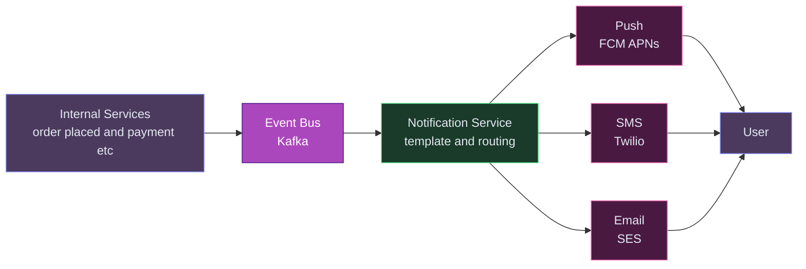

**In 3 sentences:** Backend services emit events ("order confirmed") to Kafka. The notification service consumes these, renders a template, picks the channel (push/SMS/email based on user preferences), and dispatches. Delivery tracking, retries, and send-time optimization ensure messages reach users when they're most likely to engage.

---

## 1. Understanding the Problem

A notification system lets product surfaces across a company send messages to users across multiple channels - push (mobile), email, SMS, in-app - without every team re-implementing delivery, preferences, retries, and rate limiting. The system must handle billions of events per day, respect user preferences, dedupe noisy senders, and prove delivery.

---

## 1.5. Naive First Cut

The whiteboard sketch before any real thought:

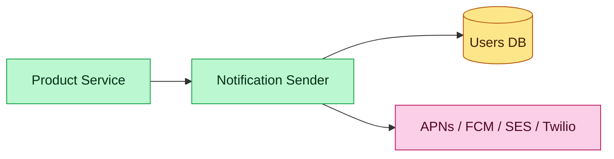

Why it breaks under real load:

- **One synchronous hop** - if APNs is slow, the product service blocks. A single downstream hiccup freezes every checkout / signup / message-send.
- **No retries** - APNs drops a packet, the user never hears back. No receipt, no replay.
- **No user preferences** - customer unsubscribed from marketing but still gets marketing. Legal problem (GDPR, CAN-SPAM), trust problem.
- **No rate limiting** - batch job fires a million sends in a minute, exceeds APNs quota, APNs throttles us for everyone.
- **No deduplication** - two product teams both decide to welcome the user; they get two welcomes.
- **No quiet hours** - user in Sydney gets a 3am push.
- **No observability** - something failed for 10% of users today. Which 10%? We don't know.

The rest of the doc evolves this into a queue-based, multi-channel, preference-aware notification platform.

---

## 1.7. Prior Art We're Drawing From

- **Uber Consumer Communication Gateway (CCG)** - central intelligence layer that manages quality, ranking, timing, and frequency of push notifications at the per-user level. Introduced after Uber hit 15+ hours a week of manual coordination trying to keep internal teams from stepping on each other. ([blog](https://www.uber.com/en-NZ/blog/how-uber-optimizes-push-notifications-using-ml/))
- **Airbnb notification platform** - channel abstraction + per-user preference service, feeding multiple providers. Treats the sender API as a single pipe regardless of channel.
- **LinkedIn Air Traffic Control** - deduping + frequency capping layer that rides on top of all outbound member communications to prevent over-notification.
- **Stripe Webhooks** - the canonical "reliable delivery via outbox + retry" pattern that applies directly to transactional notifications: persist before send, deliver asynchronously, expose attempt history.
- **Courier, Braze, OneSignal, SendGrid** - commercial templates for how this kind of platform is exposed to product teams: a single `send(user, template, data)` API on top of a multi-channel router.

---

## 2. Functional Requirements

### Core (top 3)
1. **Send a notification** to a user through one or more channels (push, email, SMS, in-app) given a template ID and template variables.
2. **Respect user preferences** - channel opt-ins, category opt-ins (marketing vs transactional), quiet hours, locale.
3. **Guaranteed at-least-once delivery with retries** for transient failures, and exposed per-attempt status for debugging.

### Below the line (out of scope)
- Rich content creation (images, carousels, deeplink generation).
- Campaign management UI / marketer console.
- ML-driven send-time optimization (Uber CCG's specialty - we'll mention it but not build it).
- Reply handling (SMS 2-way conversations).
- Delivery receipts beyond what the provider returns.

---

## 3. Non-Functional Requirements

### Core
- **Scale** - 1B notifications/day peak, ~50k/sec sustained, bursts to 500k/sec (campaign).
- **Latency** - transactional (OTP, security): P95 end-to-end < 5s. Marketing: P95 < 5 min.
- **Reliability** - at-least-once delivery, no silent loss. Acceptable duplicate rate < 0.1%.
- **Multi-region** - failover; user in EU hits EU stack.

### Below the line
- Cost optimization (provider routing for cheapest path).
- Per-tenant isolation (if multi-tenant SaaS).
- Compliance reports (TCPA/GDPR opt-in audit trails).

## Scale Estimation (Back-of-Envelope)

- **Users:** 500M DAU, generating events across all product surfaces
- **Write QPS:** 100K notifications/sec peak (5B notifications/day across 3 channels)
- **Read QPS:** 50K preference lookups/sec, 10K status queries/sec
- **Storage:** ~2TB notification metadata/year (attempts + audit trail)
- **Bandwidth:** ~10 Gbps outbound to providers at peak campaign burst

---

## 4. Core Entities

- **Notification** - one logical message intended for a user, with a template ID, variables, channels, and priority.
- **User** - the recipient. Has channel identifiers (device tokens, email, phone), preferences, locale, time zone.
- **Template** - a channel-specific content template with variable interpolation (`{{firstName}}`).
- **Preference** - per-user, per-category, per-channel opt-in/out. Quiet hours.
- **Delivery Attempt** - one try to hand off a notification to a channel provider. Status: SENT / DELIVERED / FAILED / THROTTLED.
- **Campaign** (optional) - a batch of notifications sharing a template, targeting a segment.
- **Channel Provider** - APNs, FCM, SES, Twilio, etc. Adapter per provider.

---

## 5. API / System Interface

One primary send API. Callers are internal product services, authenticated via service-to-service JWT.

### Send a notification

```bash
POST /v1/notifications                    -> NotificationReceipt
  Header: Idempotency-Key: <uuid>
  Header: Authorization: Bearer <service-jwt>
```

Request body:

```json
{
  "userId": "u_1293847",
  "templateId": "order_shipped_v3",
  "variables": {
    "orderId": "A-88273",
    "trackingUrl": "https://tr.ck/X7Y8Z",
    "carrier": "BlueDart"
  },
  "channels": ["PUSH", "EMAIL"],
  "category": "TRANSACTIONAL",
  "priority": "HIGH",
  "dedupKey": "order-A-88273-shipped",
  "deeplink": "myapp://orders/A-88273",
  "overrides": {
    "sendAt": null,
    "expireAt": "2026-05-05T10:00:00Z"
  }
}
```

Response (202 Accepted):

```json
{
  "notificationId": "n_7a3f2e91",
  "state": "ACCEPTED",
  "createdAt": "2026-05-04T12:01:33.412Z"
}
```

### Get status and attempts (for support / debugging)

```bash
GET /v1/notifications/:id                 -> Notification + attempts
```

Response:

```json
{
  "id": "n_7a3f2e91",
  "userId": "u_1293847",
  "templateId": "order_shipped_v3",
  "state": "DELIVERED",
  "category": "TRANSACTIONAL",
  "attempts": [
    { "channel": "PUSH", "provider": "APNs", "status": "SENT",      "at": "2026-05-04T12:01:33.900Z", "providerResp": "200 APNs accepted" },
    { "channel": "PUSH", "provider": "APNs", "status": "DELIVERED", "at": "2026-05-04T12:01:34.102Z", "receipt": "apns-receipt-abc" },
    { "channel": "EMAIL","provider": "SES",  "status": "SENT",      "at": "2026-05-04T12:01:34.200Z", "providerResp": "250 OK" },
    { "channel": "EMAIL","provider": "SES",  "status": "OPENED",    "at": "2026-05-04T12:04:11.512Z", "userAgent": "Mail.app iOS 17" }
  ]
}
```

### User preferences

```bash
GET  /v1/users/:id/preferences            -> Preference
PUT  /v1/users/:id/preferences            -> Preference
```

Preference shape:

```json
{
  "userId": "u_1293847",
  "channels": { "PUSH": true, "EMAIL": true, "SMS": false, "IN_APP": true },
  "categories": {
    "TRANSACTIONAL": { "enabled": true,  "channels": ["PUSH","EMAIL","SMS"] },
    "SECURITY":      { "enabled": true,  "channels": ["PUSH","EMAIL","SMS"] },
    "MARKETING":     { "enabled": false, "channels": ["EMAIL"] }
  },
  "quietHours": { "start": "22:00", "end": "07:00", "timezone": "Asia/Kolkata" },
  "frequencyCaps": { "MARKETING": 5, "SOCIAL": 20 },
  "locale": "en-IN"
}
```

### Device registration (push)

```bash
POST   /v1/users/:id/devices              -> register token
DELETE /v1/users/:id/devices/:token       -> revoke
```

```json
{
  "deviceToken": "apns-token-base64=",
  "platform": "IOS",
  "appVersion": "12.3.0",
  "timezone": "Asia/Kolkata"
}
```

### Campaigns

```bash
POST /v1/campaigns                        -> Campaign
```

```json
{
  "name": "diwali_offers_2026",
  "templateId": "promo_diwali_v1",
  "segment": { "query": "country=IN AND active_last_7d=true AND age BETWEEN 18 AND 34" },
  "scheduledAt": "2026-10-28T09:00:00+05:30",
  "rateLimit": { "perSec": 20000, "perMin": 600000 },
  "useSendTimeOptimization": true
}
```

### Real-time subscription (in-app)

```
WSS /v1/users/:id/stream                  -> WebSocket
    Header: Authorization: Bearer <user-jwt>
```

Server pushes JSON frames as notifications fire:

```json
{ "type": "notification", "id": "n_7a3f2e91", "title": "Your order shipped", "body": "...", "at": "2026-05-04T12:01:33.412Z" }
```

Security notes:
- All HTTP APIs require service JWT; product services pass the end-user's ID as data, not identity.
- The `/stream` WebSocket uses the end-user's JWT - authenticates the subscriber against the `userId` in the path.
- Templates are pre-approved and versioned; raw text body isn't accepted from callers to prevent content injection and compliance bypass.
- Device tokens stored encrypted at rest; tokens rotate when app reinstalls.
- Idempotency key is scoped per `(service, key)` and kept 24h in Redis.

---

## 6. High-Level Design

We'll grow the architecture in three passes - one per core functional requirement.

### 6.1 FR-1: Send a notification through multiple channels

Start with the minimum viable pipeline: accept, enqueue, fan out per channel, dispatch to the provider.

**New components we need:**

1. **Notification API** - the single entry point for all product services. Receives "send a notification to user X" requests, validates them, and enqueues for processing.
2. **Message Broker (Kafka)** - decouples notification intake from delivery.<br>💡 *Kafka here acts as a buffer - if push notifications are slow today, the queue absorbs the backlog instead of slowing down the checkout flow that triggered the notification. [Learn more →](/concepts#message-queues)*
3. **Router** - reads each notification event, decides which channels to use (push? email? SMS?), and fans out one message per channel to channel-specific topics.
4. **Channel Workers (Push, Email, SMS)** - each specialized worker renders the template and calls the external provider. Isolated so a Twilio outage doesn't affect push delivery.
5. **External Providers (APNs, SES, Twilio)** - the actual delivery services. We don't send emails ourselves - we hand them to SES/Mailgun, which handles the SMTP complexity.<br>💡 *FCM (Firebase Cloud Messaging) and APNs (Apple Push Notification Service) are the only way to send push notifications to Android and iOS devices respectively. Your server can't push directly to phones - it must go through these gateways.*

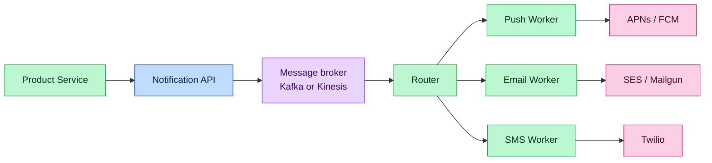

**Legend**

| Color | Role |
|---|---|
| Blue | Edge / API gateway |
| Green | Service |
| Purple | Async / message broker |
| Pink | External dependency |
| Yellow | Data store |
| Orange | Client |

**Step-by-step flow:**

1. Order Service calls `POST /v1/notifications` → "Hey, order A-88273 shipped, tell the user via push + email"
2. Notification API validates the payload, looks up the user's preferences and locale, and persists the intent to a notifications table (audit + dedup)
3. API publishes an event to Kafka and returns `202 Accepted` in ~20ms - the product service is free to move on
4. Router consumes the event, checks template rules + user preferences, and fans out: one message to `push` topic, one to `email` topic
5. Push Worker picks up its message, renders the template in the user's locale ("Your order has shipped! 📦"), and POSTs to APNs/FCM
6. Provider response (accepted/rejected) is recorded as a delivery attempt for debugging ("why didn't my user get their notification?")

**Why async?** The product service call path has a strict latency budget (checkout is running). Hitting APNs synchronously is a timebomb - provider slowness becomes product slowness. Enqueueing gives us 10-50ms end-to-end on the hot path; the actual send happens on the worker's clock.

**Why persist before publish?** Safety net. If the broker is down, we still have the row. A reconciler (covered later) sweeps notifications stuck in `PENDING_PUBLISH` and re-publishes.

### 6.2 FR-2: Respect user preferences

Preferences live in a dedicated service. Both the Notification API (at intake) and the Router (before fan-out) consult it.

**New components we need (in addition to the ones above):**

1. **Preference Service** - owns all user notification settings: which channels are on/off, which categories they've opted out of, quiet hours, locale, and frequency caps.<br>💡 *This is the "do not disturb" brain - it prevents us from waking someone at 3am with a marketing push.*
2. **Preference Cache (Redis)** - since every single notification triggers a preference lookup (50K/sec!), we cache preferences in Redis for microsecond reads instead of hammering Postgres.
3. **Preference DB (Postgres)** - the durable source of truth for preferences. Updated when users change settings.

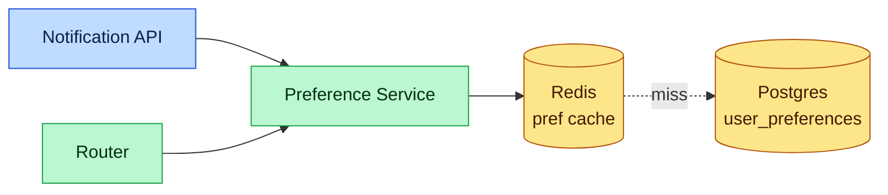

What preferences capture:
- **Channel opt-ins** - SMS: off. Email: on. Push: on.
- **Category opt-ins** - Marketing: off. Transactional: always on (legally required in many jurisdictions). Security: always on.
- **Quiet hours** - per-user time window in user's local time. Non-urgent notifications during quiet hours get deferred to a **delayed queue**; urgent (security, fraud, OTP) bypass.
- **Locale + time zone** - for template localization and quiet-hour computation.
- **Frequency cap** - max N marketing notifications per day.

**Step-by-step flow (Router consulting preferences):**

1. Router receives the event: "send MARKETING notification to user U via PUSH and EMAIL"
2. Router asks Preference Service: "What are U's notification preferences?"
3. Preference Service checks Redis cache (hit 99% of the time) → returns preferences
4. Router filters: user has Marketing=on, Push=on, Email=on - both channels stay. If they'd opted out of Marketing, the notification would be silently dropped here
5. Router checks quiet hours: user's timezone says it's 2:30am → enqueue to a **delayed queue** that will fire at 7am when quiet hours end. (Security and transactional notifications bypass quiet hours - your OTP still arrives at 3am)
6. Router checks frequency cap: "user got 4/5 marketing notifications today" - still under the limit, proceed
7. Fans out to the push and email channel topics

**Why cache preferences in Redis?** Every notification triggers a preference lookup. 50k/sec sustained = 50k/sec reads minimum. Postgres can do it, but Redis drops the latency from millis to microseconds and takes load off the DB for campaigns.

**Write path**: user updates prefs → API writes Postgres → invalidates Redis entry (write-through not worth the complexity; read-through handles the miss).

### 6.3 FR-3: Guaranteed at-least-once delivery with retries

Channel workers own the retry logic. The key mechanism is the **outbox pattern** between provider state and our own DB.

**New components we need (in addition to the ones above):**

1. **Retry Queue (delayed Kafka topic)** - when a provider returns a transient error (timeout, 5xx, rate-limit 429), the failed message goes here with exponential backoff timing.<br>💡 *Exponential backoff means: wait 2s, then 10s, then 60s, then 5min before each retry. This prevents hammering a struggling provider. [Learn more →](/concepts#message-queues)*
2. **Dead Letter Queue (DLQ)** - where permanently-failed messages go after exhausting all retries. These get reviewed by a human or an automated reconciler.
3. **Delivery Attempts table (Postgres)** - records every single attempt to deliver a notification, including the provider's response. Essential for debugging "why didn't user X get their OTP?"

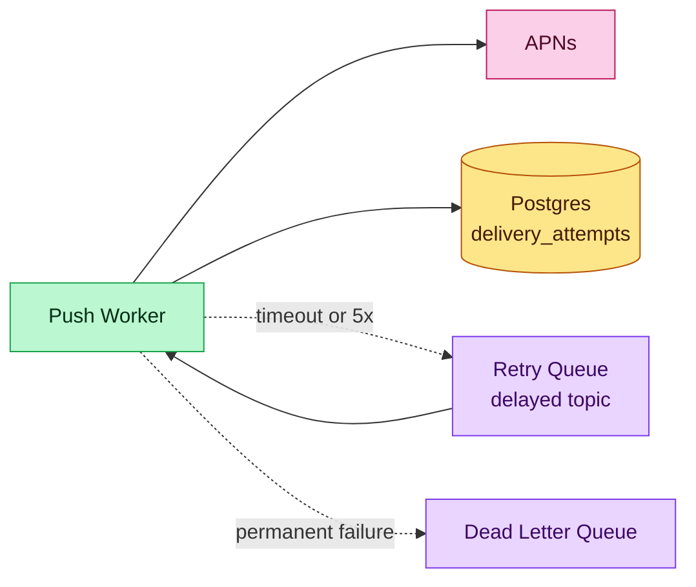

**How a channel worker handles each notification (with retries):**

What a worker does for each message:
1. Read from channel topic.
2. Render template with user variables + locale.
3. POST to provider (APNs / SES / Twilio) with a timeout (2s for push, 5s for email/SMS).
4. Write a `delivery_attempts` row: status (SENT / FAILED / THROTTLED), provider response code, timestamp.
5. Classify the outcome:
   - **Success** → commit Kafka offset, move on.
   - **Transient failure** (5xx, timeout, 429 throttle) → publish to a delayed retry topic with exponential backoff (2s → 10s → 60s → 5min → 30min; max 5 retries).
   - **Permanent failure** (400 bad token, invalid phone) → revoke the token in our user device table, send to DLQ.

**Why not just retry forever?** Permanent failures (invalid device token, phone number doesn't exist) will never succeed no matter how many times we retry. Sending to DLQ and revoking the bad token prevents infinite loops and keeps the queue healthy. Transient failures (provider overloaded) usually resolve within minutes, so retries with backoff are the right call.

**Why at-least-once, not exactly-once?** Distributed systems can't do exactly-once delivery across a network boundary - only at-least-once + idempotency on the receiving side. The `Idempotency-Key` header upstream and the `dedupKey` on the notification row let us detect dups on retry. Providers also dedupe on `apns-collapse-id` / FCM `collapse_key` - we pass our notification ID as collapse key so a retry doesn't produce two banners on the device.

**Why persist every attempt?** Debugging ("why didn't my user get the OTP?") requires per-attempt receipts. When someone files a ticket, ops need to see the exact provider response.

**DLQ ownership**: a sweeper runs every 5 minutes, reviews DLQ messages, and either retries with longer backoff, or surfaces to a human dashboard after N tries.

---

## Technology Choices

Vendor-agnostic with alternatives. Swap to a specific cloud's services if you're targeting one.

| Tier / purpose | What it stores | Access pattern | Primary pick | Alternatives |
|---|---|---|---|---|
| **Notification primary** | `notifications` - intent, template ID, state, dedupKey | high write on send, index by (user, createdAt), point-read by id | **PostgreSQL** partitioned by day | MySQL, CockroachDB, Aurora |
| **Delivery attempts** | one row per provider call, with response | insert-heavy, query by notification_id for support | **PostgreSQL** monthly-partitioned, or **Cassandra** at very high rates | DynamoDB with TTL |
| **User preferences** | channel + category opt-ins, quiet hours, frequency state | low write, very high read (every send) | **PostgreSQL** + **Redis** cache | DynamoDB + DAX |
| **Device registry** | push tokens per user per device | medium write (registrations), high read | **PostgreSQL** sharded by user_id | DynamoDB, Cassandra |
| **Event backbone** | `notification.requested`, `notification.dispatched`, etc. | ordered per user_id, replayable, at-least-once | **Kafka** | Kinesis, Google Pub/Sub, Pulsar |
| **Delayed queue** (quiet hours, retries) | messages keyed by wake-up time | producer writes with a `readyAt`; consumer only pulls ready ones | **Redis sorted sets** keyed by timestamp, or **Kafka with timer-topic wheel** | SQS with visibility delay, RabbitMQ delayed exchange |
| **Template store** | rendered templates per channel per locale | read-heavy, versioned | **S3 / object storage** + **Postgres** metadata | Git-backed templates (GitOps) |
| **Rate-limit counters** | per-user / per-tenant counters | very high read+write, TTL'd | **Redis** token bucket / sliding window | DynamoDB with atomic counters |
| **Analytics / reporting** | daily sends, delivery rates, opt-out trends | OLAP scans, dashboards | **Snowflake / BigQuery / ClickHouse** via CDC | Redshift, Druid |
| **Secrets** | provider API keys, APNs certs | very low read, high sensitivity | **Vault / AWS Secrets Manager** | 1Password Connect, Parameter Store |

### Why Postgres for notifications + attempts, not Cassandra or DynamoDB?

You get ACID within a send: persist the notification + initial state atomically. Support queries hit an indexed point lookup, not a full table scan. Partition by day to keep hot data in tiny tables. For companies sending 10B+/day, Cassandra becomes the right call because append-only writes beat Postgres WAL. Below that, Postgres is simpler and has full SQL.

### Why Redis for the delayed queue?

Redis sorted sets (ZSET) give O(log N) insert and O(log N) range query by score. "Give me everything with score ≤ now()" → pop them. This is the cleanest delayed queue pattern. Kafka timer-topic wheels work too but are harder to get right; use them only when volumes exceed what a Redis cluster handles.

### Why Kafka for the event backbone?

- Ordering per partition - critical for "this user's notifications" to stay in order.
- Replayable - if the Push Worker had a bug yesterday, we reprocess the topic.
- Durable - tolerates consumer downtime; messages persist until we ACK.

Kinesis and Pub/Sub are equivalent on managed clouds.

---

## 7. Potential Deep Dives

Running the self-audit against the checklist surfaces eleven worth doing. Deep Dives 1-6 cover the core delivery mechanics; 7-11 address real-time delivery, template management, send-time optimization, engagement tracking, and broadcast.

### Deep Dive 1 - Hot write path: notification intake at scale

**Bad**: Product service inserts directly into `notifications` + publishes to Kafka + writes an audit log. Three writes on the critical path. At 500k/sec burst, the DB is the bottleneck.

**Good**: Notification API does one insert with `INSERT ... RETURNING id`, then publishes. Two writes, still DB-bound. Campaigns that fire 10M sends in a minute still melt Postgres.

**Great - outbox + CDC**:
- Notification API writes one row in Postgres in a transaction that includes the event payload in an `outbox` table.
- **Debezium / logical replication** tails the WAL and emits to Kafka - exactly once from WAL to Kafka.
- The product-facing API returns immediately after the DB commit (~5ms).
- Campaign batch writer uses `COPY FROM` to bulk-insert millions of rows in seconds.

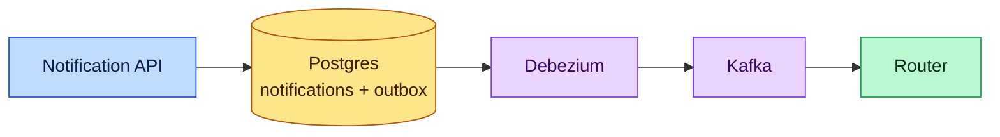

### Deep Dive 2 - Fan-out amplification: one event to N devices

**Bad**: Router looks up a user's device tokens inline. User has 4 devices (phone, tablet, desktop, kiosk). Push worker fans out 4x. Fine for one user - not for a campaign that hits 50M users = 200M push sends.

**Good**: Router fans out once per device into the push topic. Each device is an independent delivery attempt. Works until we need to dedupe across devices for the same notification (e.g., user opens on phone, don't ring the tablet 30s later).

**Great - logical notification + per-device attempts + device-collapse**:
- One `notification` row, N `delivery_attempts` rows.
- `apns-collapse-id` = notification_id: if the same notification retries, APNs replaces rather than stacking.
- A "read receipt" from the client marks the notification read and any still-pending retries are cancelled.
- For campaigns: partitioned bulk insert, each partition processes in parallel by a pool of Router workers.

### Deep Dive 3 - Provider throttling and backpressure

**Bad**: Blast sends at APNs' max rate. APNs rate-limits the whole tenant, legitimate transactional sends also get 429'd.

**Good**: Token bucket per provider, per channel. Workers pull from the channel topic only when a token is available.

**Great - weighted bucket + priority lanes**:
- Two topics per channel: `push.transactional` (high priority), `push.marketing` (bulk).
- Transactional workers have higher bucket capacity and refill rate.
- Marketing workers share a smaller bucket, self-throttle.
- When provider returns 429, workers exponential-backoff the bucket refill rate for that provider - system-wide TTL'd override in Redis.
- Noisy-neighbor isolation: per-tenant token buckets on top of the per-provider limit, so one product team can't starve others.

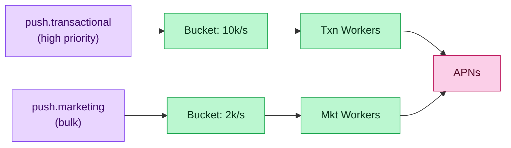

### Deep Dive 4 - Deduplication and frequency capping

**Bad**: Two product teams both emit `welcome_user` for a new signup. User gets 2 welcomes.

**Good**: `dedupKey` on the `notifications` table with a unique constraint. Second insert fails → second team's send is dropped. Works for exact dups.

**Great - Air Traffic Control layer (from LinkedIn's playbook)**:
- A "policy check" step between Router and channel workers.
- Input: user ID, category, timestamp, content hash.
- Policies:
  - **Dedup** - exact dedupKey match within last 24h → drop.
  - **Frequency cap** - ≤5 marketing per day per user. Counter in Redis (`INCR notif:mkt:{userId}:2026-05-04` + EXPIRE).
  - **Category quota** - no more than 3 "new review" notifications per hour.
  - **Global mute** - user churned to quiet mode for N days → all marketing dropped.
- Tokens live in Redis, sharded by user_id. Per-user consistency holds; cross-user global quotas use a separate counter.

This is the layer Uber calls the **CCG**. It's where the ML logic for send-time optimization would eventually slot in.

### Deep Dive 5 - Quiet hours and scheduled delivery

**Bad**: Check quiet hours synchronously, if in-quiet-hours, `Thread.sleep(untilSomeTime)`. Worker threads pile up.

**Good**: If in quiet hours, compute `readyAt = end_of_quiet_hours_in_user_tz` and insert into a delayed queue. A scheduler wakes up and re-injects when ready.

**Great - Redis ZSET with a dequeue poller**:
```
ZADD delayed:notifications <readyAtEpoch> <notificationId>
```
A scheduler service polls every second:
```
ZRANGEBYSCORE delayed:notifications 0 <now> LIMIT 0 1000
```
For each returned ID, re-publish to the channel topic and `ZREM`. O(log N) inserts, O(log N + k) poll where k = batch size. Scales to hundreds of millions of scheduled notifications.

Alternatives: Kafka timer-topic tumbling wheel, DynamoDB TTL streams, SQS visibility timeout tricks. Pick Redis for simplicity and latency, others if volumes push past a single Redis cluster.

Edge case: user changes time zone mid-wait. Two reasonable answers:
- Let the scheduled time fire as originally computed (simplicity wins).
- Re-enqueue on preference change with the new tz (more accurate, more complex).

Most teams pick option 1 and accept occasional mis-timing.

### Deep Dive 6 - Observability and delivery proof

**Bad**: "Did user X get their OTP?" - grep logs across 50 hosts. Hope someone logged what we need.

**Good**: Structured logs in ELK. Search by notification_id.

**Great - first-class attempt history + delivery webhooks + dashboards**:
- `delivery_attempts` table holds per-try status. Indexed by notification_id for O(1) support lookups.
- Provider delivery callbacks (APNs feedback, SES SNS, Twilio webhook) write to an `inbound_receipts` table; a reconciler joins attempts ↔ receipts to compute true delivery rate.
- Real-time dashboard: delivery rate per channel, per provider, per category, per locale. Alert on sudden drops.
- **Backstop for lost webhooks**: periodic `/status` poll for providers that support it (APNs Feedback Service); if we have a SENT attempt with no receipt after 30 min, we poll.

---

----

### Deep Dive 7 - In-app notifications in real time

**Bad**: In-app notifications rely on polling. The mobile app hits `GET /notifications?since=...` every 30 seconds. Users see a 30-second lag; 1M DAUs = 33k req/sec of wasted polling.

**Good**: Server-sent events (SSE) over HTTP/2. The server keeps a unidirectional stream open; when a notification arrives for this user, the server writes a frame. SSE is one-way, text-only, and works through most proxies without configuration.

**Great - WebSocket gateway with a presence layer + a fallback poll**:

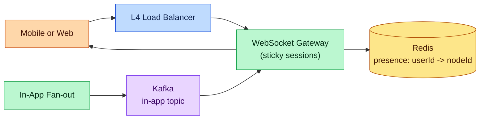

How it works:
1. Client opens a WebSocket to `/v1/users/:id/stream`. Load balancer uses consistent hashing on `userId` to pin the connection to a specific WS gateway node (sticky sessions). This means a given user is always on the same node, simplifying routing.
2. On connect, the WS gateway writes `userId -> nodeId` to Redis (TTL 30s, refreshed by heartbeat every 10s).
3. When the In-App Fan-out worker consumes a notification, it looks up the target user's `nodeId` in Redis. If present, it publishes to a Kafka topic **keyed by node**; each WS gateway node consumes its own keyed partition and delivers to the live socket.
4. If `nodeId` is missing (user offline), the worker writes the notification to an "inbox" - a Redis list `inbox:{userId}` capped at 100 items + a Postgres backup. Next time the app connects, it drains the inbox as the first thing.
5. **Fallback poll**: even with WS, the app periodically (every 60s) calls `GET /notifications?since=<lastSeenId>` as a safety net. This catches any notification lost to a transient WS hiccup. It's rare, but belt-and-suspenders.

Why WS over SSE: bidirectional frames give us acknowledgments (client says "got it, showed badge"), and modern load balancers + browsers handle WebSocket fine. Also: we can multiplex multiple event types over one WS (notifications, typing indicators, presence).

Scale numbers: a single modern WS gateway node handles 50k-100k open sockets. For 10M concurrent users, 100-200 gateway nodes behind a consistent-hash LB.

**Trade-off**: sticky sessions complicate rolling deploys. Mitigation: graceful drain - new deploy tells existing sockets to reconnect, they get routed to the new node via the LB.

---

### Deep Dive 8 - Template service: versioning, localization, rendering

**Bad**: Templates as hardcoded strings in worker code. Every copy change requires a deploy. Marketing can't iterate. Translators need a developer.

**Good**: Templates in a database, fetched by ID at render time. Versioned. Marketing uses a console.

**Great - immutable template versions + pre-compiled renderer + per-locale cache**:

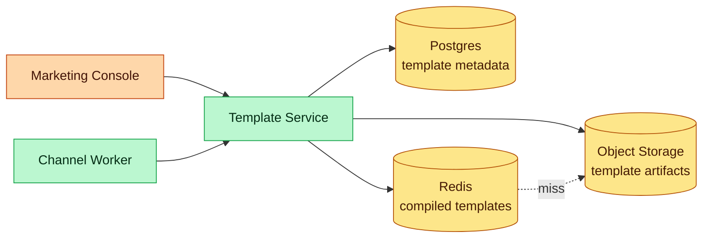

Model:
- A template has an **ID**, a **version**, a **channel** (PUSH / EMAIL / SMS / IN_APP), and a **locale** (en, hi-IN, ja-JP, etc.).
- Each version is **immutable**. You don't edit v3; you publish v4.
- The `templateId` on a send request resolves to the current **active version** per locale.
- Old versions remain queryable - needed to render historical notifications in the support UI correctly.

Publishing flow:
1. Marketer drafts a template in the console.
2. Console uploads the template file (Mustache/Handlebars/MJML for email) to object storage at `templates/order_shipped_v4/en.mustache`.
3. Pre-flight validation: variables referenced in the template must all exist in a registered `variableSchema`. Catches typos before a real send fails.
4. Compliance reviewer approves (required for MARKETING category).
5. Activate atomically: Postgres row updates the `active_version` pointer for `(templateId, locale)`.

Render flow (from a channel worker):
1. Look up `(templateId, userLocale)` via Template Service.
2. Fetch compiled template from Redis. Miss → pull from S3 → compile (parse Mustache to AST) → cache.
3. Render with the user's variables. Run output sanitization (HTML escape for email, length-cap for SMS, JSON-safe for push payload).
4. Return the rendered content to the worker.

Caching: compiled template objects stay in Redis with a **long TTL** (24h) because versions are immutable - there's no staleness risk. On activation, the service bumps a global version number which workers check cheaply to detect new active versions.

Locale fallback: `hi-IN` not found → try `hi` → try template's declared default locale → fail send. All falls through Template Service so workers don't reinvent fallback logic.

Why pre-compile: a template is parsed once per node per version; subsequent renders are ~10-20 μs instead of parsing the template string each time. At 500k/sec we can't afford the parser on every send.

**Integration with channels**:
- Push: renders to title + body + data payload. Max 4KB (APNs) / 4KB (FCM).
- Email: renders MJML → responsive HTML. Separate plain-text fallback.
- SMS: renders to plain text, segmented if > 160 GSM characters.
- In-app: renders to a structured JSON the client knows how to display.

---

### Deep Dive 9 - Send-time optimization (Uber CCG-style)

**Bad**: All marketing fires immediately when the campaign is scheduled. Users get a 9am blast, half ignore it. Open rates tank.

**Good**: Default quiet hours + frequency cap. Better, but still one-size-fits-all. Your "marketing hits at 9am local" misses the user who opens the app at 7pm every day.

**Great - per-user send-time prediction + constrained ranking**:

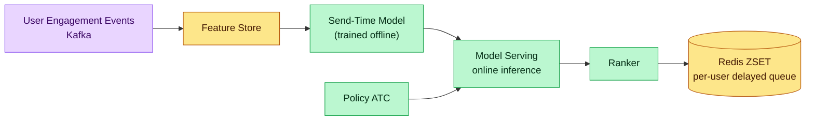

Three layers:

1. **Feature store** - per-user features: open-rate-by-hour histogram, click-rate-by-hour, last-active-hour, timezone, days since last notification. Updated in near real time from the engagement Kafka topic.

2. **Send-time model** - offline-trained (weekly) gradient-boosted model that predicts P(open | user, hour-of-day, category). Lightweight: ~KBs per user, serves in <1ms. For each incoming notification with `useSendTimeOptimization=true`, inference returns the best hour in the next 24h.

3. **Ranker** - multiple notifications compete for attention. Per-user ranker runs a linear program (Uber's actual approach - linear programming) that picks at most N notifications per day subject to:
   - category priority (transactional > security > social > marketing),
   - frequency caps,
   - minimum spacing between notifications (15 min),
   - predicted open probability.

   The output is a scheduled list: `(notificationId, sendAt)` pairs. Each is enqueued in the delayed Redis ZSET from Deep Dive 5.

Why linear programming rather than greedy: the "max 5 marketing per day + min 15 min spacing + top-N by predicted open" problem has conflicting constraints. Greedy picks the highest-scoring notification first and loses optimal coverage. LP gets the globally best schedule in milliseconds for per-user problems of this size (~dozens of candidates per user per day).

Only marketing and social categories go through this layer. Transactional and security bypass - they fire immediately.

**Cost control**: inference serving is the hot spot. At 100M users × 10 marketing candidates per day = 1B inferences/day. A small Redis-cached "best hour per user per category" result valid for 24h absorbs 95% of those.

**Trade-off**: adds latency to marketing sends. That's fine - they're not time-sensitive. For "this product just restocked" you'd still fire with a shorter urgency window.

---

### Deep Dive 10 - Engagement tracking (opens, clicks)

**Bad**: "Did the user see it?" - no clue. Only the provider knows they accepted it.

**Good**: Client-side reporting. App SDK pings `POST /v1/notifications/:id/opened` when user taps. Email has a tracking pixel. But: no reliable way to know for push without client SDK, and clients can lie or double-report.

**Great - multi-source engagement ingestion + deduped event store**:

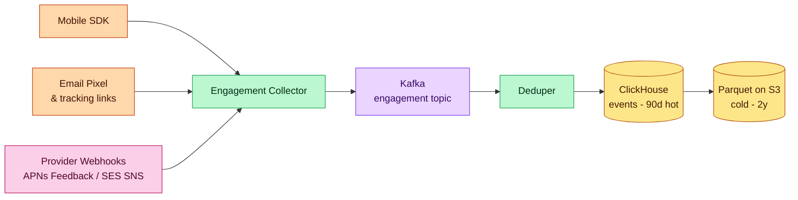

Event types tracked:
- `SENT` - worker handed off to provider.
- `DELIVERED` - provider confirmed or SDK ack'd receipt.
- `OPENED` - user tapped push / opened email.
- `CLICKED` - user tapped a tracked link.
- `DISMISSED` - user swiped away without opening.
- `UNSUBSCRIBED` - user hit unsubscribe link.
- `BOUNCED` - email bounce (hard / soft).
- `COMPLAINED` - spam report.

Pipeline:
1. Sources normalize to a common envelope: `{notificationId, userId, event, at, source}`.
2. Collector publishes to the engagement Kafka topic, partitioned by `notificationId`.
3. Deduper drops duplicates per `(notificationId, event)` within a 7-day window using a Bloom filter in Redis. Fixes double-reports from SDK + provider webhook for the same open.
4. Events land in ClickHouse for real-time dashboards (campaign open rate, per-locale performance). Daily roll-up to S3 Parquet for long-term analysis and ML training.
5. Events also feed back into the feature store (Deep Dive 9) within minutes.

Why ClickHouse: column-store gives fast aggregation for `SELECT category, hour, COUNT(*) FROM events WHERE date=today GROUP BY ...` dashboards. Postgres would be too slow at the event volume (10B events/day).

Why a Bloom filter for dedup: exact dedup would require storing 10B IDs per week. Bloom filter accepts ~0.1% false positives (we occasionally drop a real second open) but uses ~100x less memory.

Engagement data flows back into:
- The send-time optimization model (better predictions).
- The ATC layer (noisy unsubscribe → suppress future marketing).
- Product dashboards (which templates work, which don't).

---

### Deep Dive 11 - Broadcast to large segments (optional)

**Bad**: "Send this to all 500M users" - the Router iterates the user list one-by-one. Takes hours.

**Good**: Parallelize the iteration. Shard the user list into batches of 10k, each processed by a worker pool. Still bounded by provider rate limits.

**Great - pre-computed segment materialized view + push-time content personalization**:

1. For any large segment (country = IN, engaged_users, power_users_top_10pct), Segment Service materializes the user list nightly into an S3 object or a dedicated table.
2. Broadcast Worker reads the segment in parallel partitions (e.g., 1000 partitions for 500M users) - each partition processed by a separate consumer group.
3. Content is static across the segment (same template ID, same variables) but rendered per-user-locale at worker time.
4. Provider rate limit is the ceiling: even fully parallelized, APNs caps total throughput at ~1M/sec. 500M users → ~8 minutes wall-clock minimum.

For truly instant large-audience cases (emergency civic alerts, security advisories), broadcast via channels that support **topic-based fan-out** natively:
- APNs Topic, FCM Topics - subscribers receive by topic subscription. Kicks fan-out to the provider.
- SMS carrier broadcast features for regional alerts (governmental use only).

For normal business broadcast, the segmented-queue approach is what you want.

---

## 7.5. Design Self-Audit

Weak spots checked:
- **Text search** - yes, if support team needs to search notifications by content. Push content through a search index (Elasticsearch) with a 14-day retention. Not core but worth mentioning.
- **Stale prefs after write** - user opts out, gets one more marketing send because the cache hasn't invalidated. Fix: 1-second TTL on the cache entry plus event-driven invalidation; acceptable window.
- **Single-region failure** - primary Postgres region goes down. Active-passive: async replica in DR region; on failover, promote and re-route traffic. In-flight notifications in Kafka → consumer group repositions to the DR cluster that's mirrored via MirrorMaker.
- **DLQ reconciliation** - ops dashboard lists DLQ entries by reason. Auto-retry once after 1h, then require human decision.
- **Cost at scale** - egress to providers is free-ish for APNs/FCM, paid per send for SES/Twilio. Cost dashboard per category so Marketing knows their send cost.
- **Hot user / broadcast** - celebrity's account triggers 100k notifications to followers. Covered in Deep Dive 11.
- **In-app real-time delivery** - user opens the app and expects to see the unread badge instantly. Covered in Deep Dive 7 via WebSocket gateway + presence + inbox.
- **Template staleness and localization** - marketing can't edit strings without a deploy. Covered in Deep Dive 8.
- **Over-notification and smart scheduling** - users ignore poorly-timed marketing. Covered in Deep Dive 9 with Uber CCG-style send-time optimization.
- **Engagement blindness** - we send and hope. Covered in Deep Dive 10 with a unified engagement pipeline.

---

## 6.5. Core Flows

### Flow 1 - Transactional send (OTP)

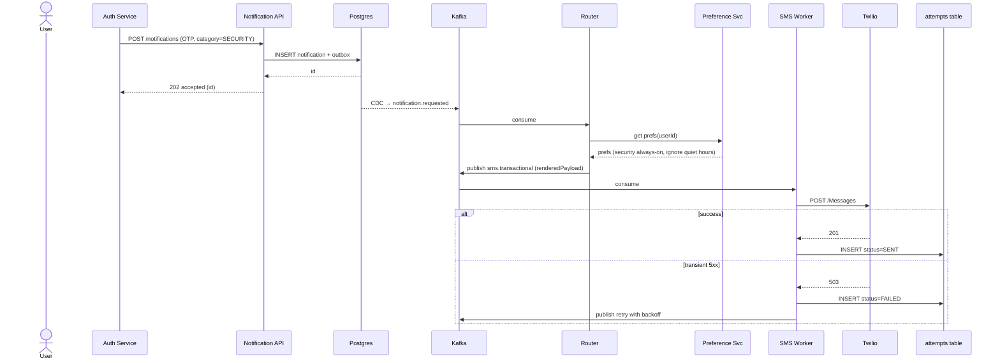

Walkthrough:
1. Auth service calls the Notification API with the OTP template and category=SECURITY.
2. API writes the notification and its outbox entry in one transaction.
3. It returns 202 in under 20ms - the user sees "code sent" immediately.
4. CDC picks up the commit and publishes to Kafka.
5. Router consults Preference Service. Security overrides quiet hours and marketing opt-out.
6. Router fans out to `sms.transactional` (high-priority topic).
7. SMS worker renders and hits Twilio with a 5s timeout.
8. On success, we record the attempt; on 5xx, we retry with exponential backoff; on 4xx we mark permanent failure and alert.

Failure case: Twilio webhooks tell us 15s later the SMS was actually undelivered (number disconnected). The reconciler joins the webhook to our `delivery_attempts`, flips the status to UNDELIVERED, and notifies Auth Service via its own outbound webhook so it can offer the user an alternate channel.

### Flow 2 - Marketing campaign send (10M users)

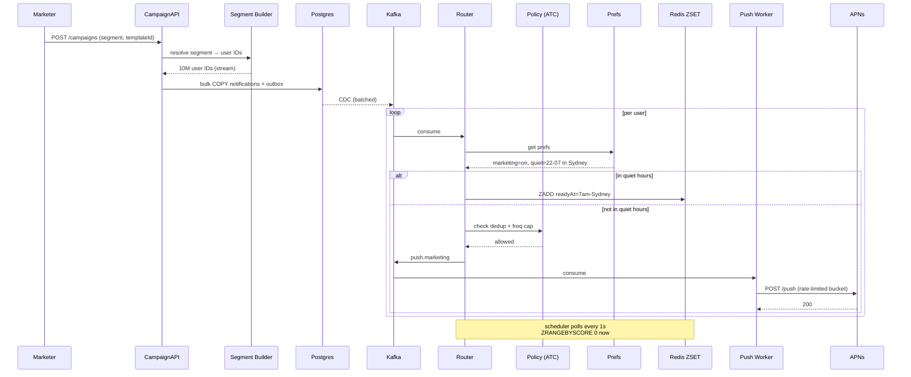

Walkthrough:
1. Marketer calls CampaignAPI with a segment definition (e.g., "Indian users, 18-34, active in last 7 days").
2. Segment Builder streams the user IDs out of the user data warehouse.
3. CampaignAPI bulk-writes notifications using `COPY` - seconds, not minutes.
4. CDC streams events to Kafka in order.
5. Router consults prefs + ATC for each. Users in quiet hours get deferred via Redis ZSET.
6. Rate-limited workers drain the topic, respecting APNs throughput caps.
7. Failures → retry topic with backoff.

Non-obvious failure: campaign writes succeed, CDC is behind by 10 minutes. We don't block. Marketer sees "campaign queued" because the row is committed; the delay is at most CDC lag, which alerting monitors. Acceptable for marketing.

### Flow 3 - User updates preferences

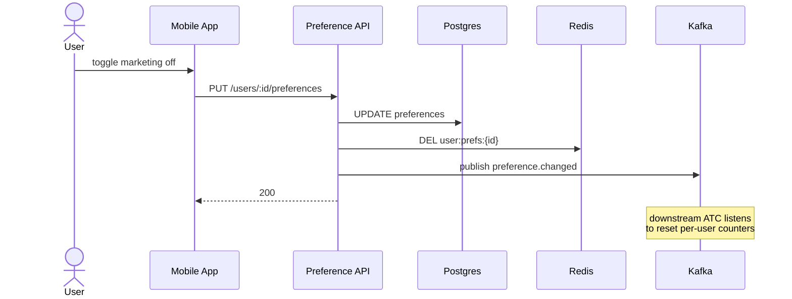

1. App calls PUT.
2. Preference API updates Postgres.
3. Invalidates Redis cache (next read rebuilds).
4. Publishes a `preference.changed` event - downstream consumers (ATC, counters) can react.
5. Returns 200.

Within milliseconds of the update, the next notification fan-out sees the new preference on cache miss → DB hit → re-cache.

### State machine - a notification's lifecycle

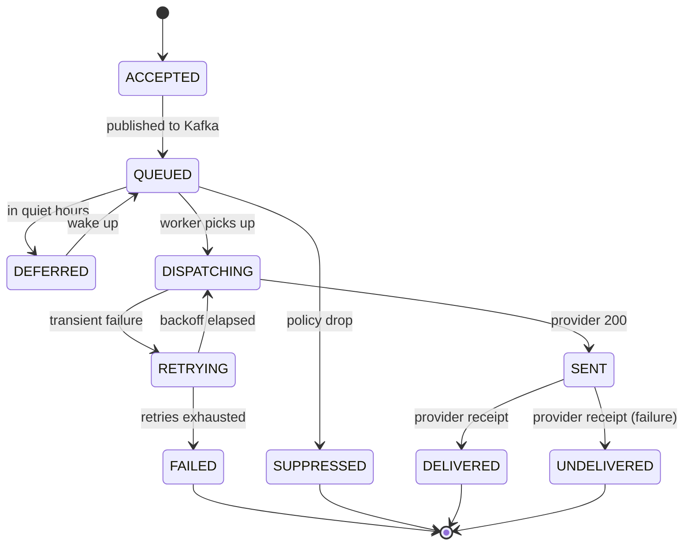

---

## 8. Final Architecture Diagram

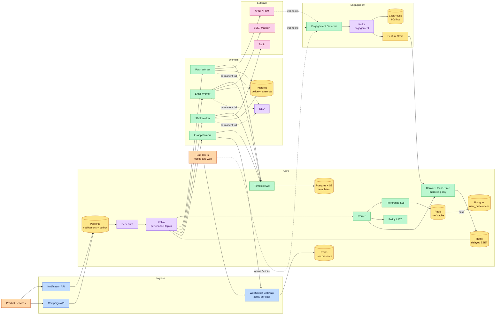


---

## Key Technologies Mentioned

| Term | What it is |
|---|---|
| **Kafka** | Distributed event log decoupling notification intake from delivery - absorbs burst traffic so product services never block on slow providers. |
| **APNs (Apple Push)** | Apple Push Notification Service - the only gateway for delivering push notifications to iOS devices. |
| **FCM (Firebase Cloud Messaging)** | Google's push notification gateway for Android (and web) - your server can't push directly to phones without going through FCM. |
| **SES / Twilio** | Amazon SES for email delivery, Twilio for SMS - external provider adapters wrapped behind channel workers. |
| **Template Engine** | Renders per-channel, per-locale message content from pre-approved templates with variable interpolation (e.g., `{{firstName}}`). |
| **Dead Letter Queue** | Parking spot for permanently-failed messages after max retries - reviewed by ops or an automated reconciler. |
| **Exponential Backoff** | Retry strategy that waits progressively longer between attempts (2s → 10s → 60s → 5min) to avoid hammering a struggling provider. |
| **Rate Limiting** | Token bucket per provider and per tenant preventing any single sender from exhausting push/email/SMS quotas for everyone. |

---

## What's Expected at Each Level

> This section helps you calibrate your depth. You don't need to cover everything - just know what's expected for your level.

### Mid-level

Design a basic system that receives events and sends notifications via push/email. Propose a queue between event generation and delivery. Understand why async processing matters - synchronous dispatch blocks the product service and can't handle provider slowdowns gracefully.

### Senior

Propose Kafka for event ingestion with consumer groups per channel. Discuss template service for message rendering, user preference management (opt-in/out per channel), and rate limiting per user. Explain retry strategies with exponential backoff and DLQ for permanently failed deliveries. Articulate the outbox pattern for guaranteed event capture.

### Staff+

Address notification deduplication across channels (Air Traffic Control pattern from LinkedIn), priority queuing (critical alerts skip the queue), and A/B testing delivery times for engagement optimization. Discuss cost analysis across channels (SMS costs $0.01/msg vs push at $0) and provider routing for cost optimization. Cover regulatory compliance (CAN-SPAM, GDPR consent) and the operational cost of maintaining per-user frequency caps at scale.

---
## 🎯 Key Takeaways

- **Multi-channel** (push + email + SMS) with per-user preference routing
- **Kafka** decouples event producers from notification delivery
- **Template engine** separates content from channel logic
- **At-least-once delivery** with dedup on the client side

---
## Related Designs
- [Chat System](/hld/ChatSystem) - WebSocket real-time delivery
- [Job Scheduler](/hld/JobScheduler) - scheduled and delayed notifications
- [Twitter Feed](/hld/TwitterFeed) - fan-out patterns
