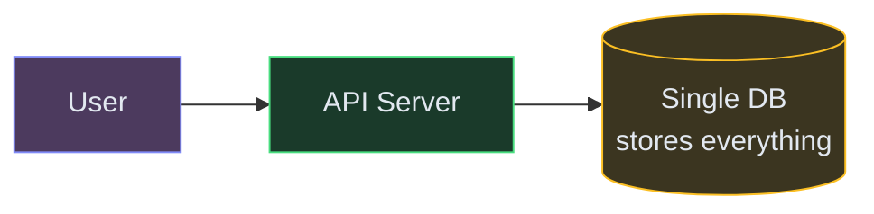
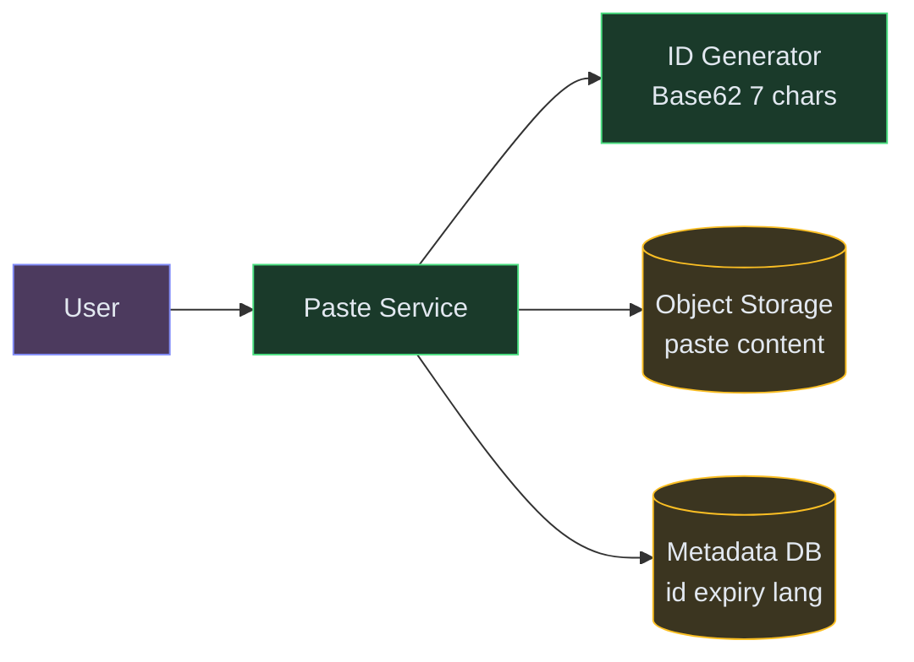
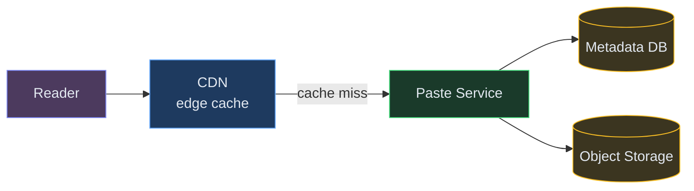
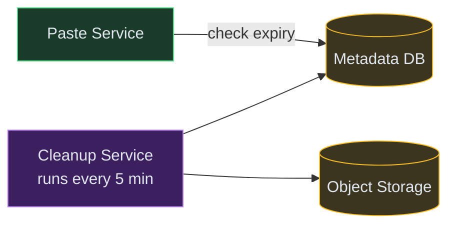
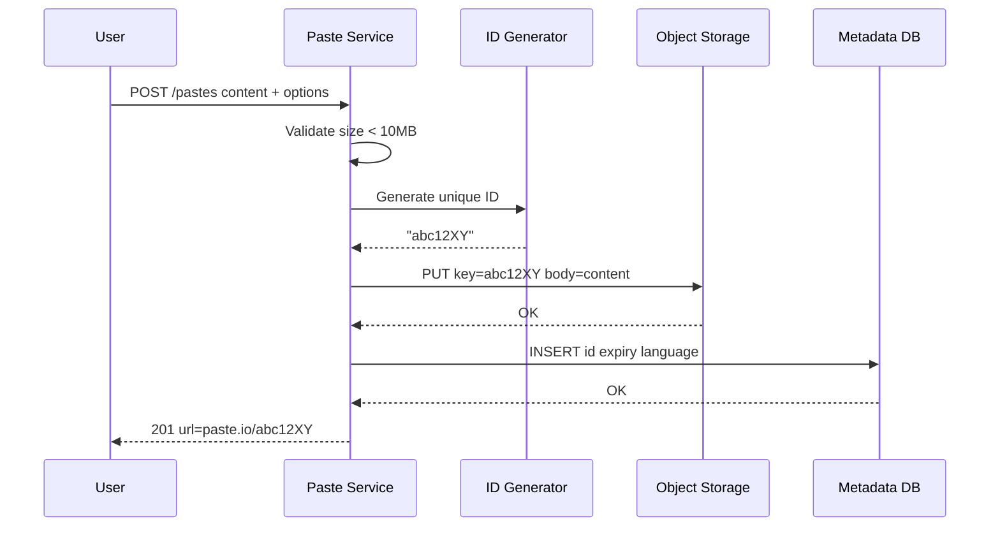
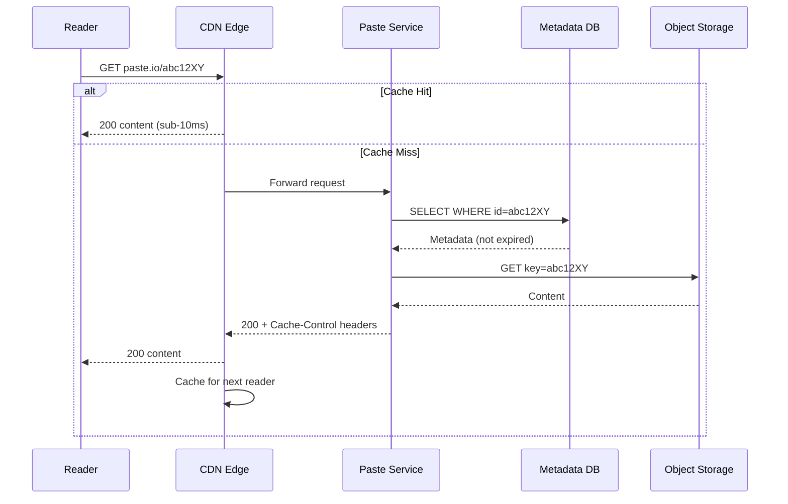
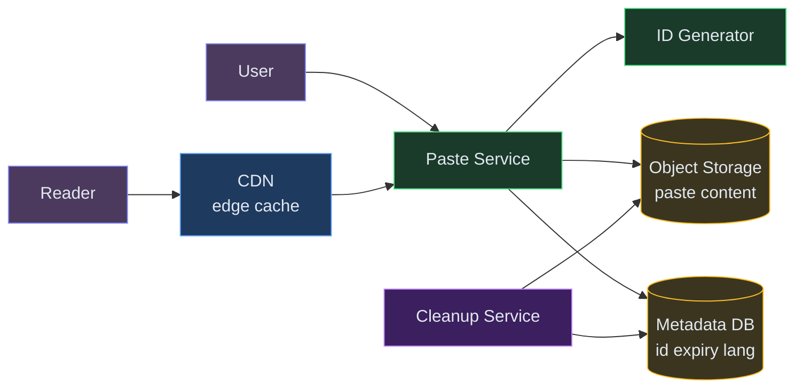

# Designing Pastebin

**Difficulty:** Beginner **Topics:** Object Storage, ID Generation, CDN, TTL **Asked at:** Google, Amazon, Meta
**Prerequisites:** [Fundamentals](/concepts) - especially [Caching](/concepts#caching) and [CDN](/concepts#cdn-content-delivery-network)

---

## 1. Understanding the Problem

Pastebin is a text-sharing service. You paste text (code snippets, logs, config files), get a unique short URL, and anyone with that URL can read the paste. No authentication needed to create or read. That's it - deceptively simple, but it covers real design concepts: unique ID generation, storage decisions, caching, and data lifecycle management.

**Real examples:** pastebin.com (18M+ pastes/month), GitHub Gist, Hastebin, Privatebin.

---

## 1.5. Naive First Cut



| Color | Meaning |
|---|---|
| 🟣 Purple | Clients |
| 🟢 Green | Services |
| 🟡 Yellow | Data stores |
| 🔵 Blue | Edge / CDN |


Store the paste content as a TEXT/BLOB column directly in SQL. Use auto-increment IDs.

**Why this breaks:**

- **Large pastes in DB** - storing 10MB text blobs in a relational DB bloats the table, slows backups, and makes queries inefficient
- **Sequential IDs** - auto-increment exposes paste count and is guessable (scraping `paste/1`, `paste/2`, ...)
- **Single server** - one machine handles both reads and writes. Traffic spike kills everything.
- **No caching** - every read hits the DB. With 10:1 read-to-write ratio, the DB drowns.
- **No expiry** - pastes accumulate forever, storage grows unbounded

The rest of the doc evolves this into a proper scalable design.

---

## 1.7. Prior Art We're Drawing From

- **GitHub Gist** - Stores code snippets with Git-backed versioning. Content lives in object storage, metadata in Postgres. Demonstrates separation of content from metadata at scale. ([GitHub Engineering](https://github.blog/engineering/))
- **Hastebin (haste-server)** - Minimal open-source paste service. Shows that the core problem is just ID generation + blob storage + serve. ([GitHub: haste-server](https://github.com/toptal/haste-server))
- **Cloudflare Workers KV** - Globally distributed key-value store with CDN-like read performance. Demonstrates how immutable content benefits from aggressive edge caching. ([Cloudflare Workers KV docs](https://developers.cloudflare.com/kv/))

---

## 2. Functional Requirements

### Core (Top 3)

1. **Create a paste** - user submits text, gets back a unique short URL
2. **Read a paste** - anyone with the URL can retrieve the content
3. **Expire pastes** - pastes can have a TTL (1 hour, 1 day, 1 week, never)

### Below the Line

- Syntax highlighting per language
- Edit/update an existing paste
- User accounts and "my pastes" list
- Password-protected pastes
- Raw content endpoint

---

## 3. Non-Functional Requirements

| NFR | Target |
|---|---|
| **Read-heavy** | 10:1 read-to-write ratio (10K reads/sec, 1K writes/sec) |
| **Low read latency** | P99 < 100ms for paste retrieval |
| **Durability** | Paste content must survive hardware failures (99.999%) |
| **Storage efficiency** | Handle pastes up to 10MB cheaply |

### Below the Line

- Strong consistency on analytics
- Multi-region deployment
- End-to-end encryption

---

## Scale Estimation (Back-of-Envelope)

- **Write QPS:** 1K new pastes/sec (peak during work hours)
- **Read QPS:** 10K reads/sec (10:1 ratio)
- **Storage:** 10TB paste content/year (avg paste ~1KB, max 10MB)
- **Bandwidth:** ~1 Gbps at peak for content delivery

---

## 4. Core Entities

- **Paste** - the content (text/code), up to 10MB
- **Metadata** - paste ID, creation time, expiry time, language, owner (optional)
- **Short URL** - the unique 7-character code that maps to a paste

---

## 5. API / System Interface

```text
POST /v1/pastes
  Body: { content, language?, expiresIn?, title? }
  Response: { id: "abc12XY", url: "https://paste.io/abc12XY", expiresAt }

GET /v1/pastes/{id}
  Response: { id, content, language, createdAt, expiresAt, title }

DELETE /v1/pastes/{id}
  Headers: Authorization: Bearer <token>
  Response: 204 No Content
```

> **Security note:** Creating pastes can be anonymous, but deleting requires ownership proof. Rate-limit creation by IP to prevent spam.

---

## 6. High-Level Design

Let's build this incrementally, one functional requirement at a time.

### FR1: Create a Paste - Generating a Unique ID and Storing Content

The first thing a user does: paste text, click submit, get a short URL. We need to generate a unique ID, store the content somewhere, and return the URL.

**The problem with storing content in the DB:** Paste content can be up to 10MB. Storing that in a relational DB makes the table enormous, slows queries, and makes backups painful. Object storage (S3/GCS) is designed for exactly this: cheap, durable blob storage.

**New components:**

1. **Paste Service** - the API layer. Validates input (size < 10MB), generates unique IDs, coordinates writes.
2. **ID Generator** - produces unique, short, non-guessable IDs.<br>💡 *We use Base62 encoding (a-z, A-Z, 0-9) with 7 characters = 62⁷ = 3.5 trillion possible IDs. Even at 1000 pastes/sec, that's 100+ years before exhaustion.*
3. **Object Storage (S3/GCS)** - stores the actual paste content. Key = paste ID, value = text blob. Cheap ($0.023/GB/month), durable (99.999999999%), scales infinitely.
4. **Metadata DB (Postgres)** - stores small metadata per paste: ID, timestamps, expiry, language. Small rows (~200 bytes), fast lookups by primary key.




**Step-by-step flow:**

1. User submits text + options → `POST /v1/pastes`
2. Paste Service validates: content size < 10MB, rate-limit check passes
3. Service calls ID Generator → gets `"abc12XY"` (7 random Base62 chars)
4. Service stores content in Object Storage: `PUT key=abc12XY body=<paste_text>`
5. Service inserts metadata row: `INSERT INTO pastes (id, created_at, expires_at, language)`
6. Service returns `{ url: "paste.io/abc12XY" }` to user

**Why separate Object Storage from the Metadata DB?** Different access patterns, different cost profiles. The DB stays lean with small rows (fast primary-key lookups). Object Storage handles variable-size blobs cheaply. If we put 10MB blobs in Postgres, the table would be 10TB and backups would take hours.

---

### FR2: Read a Paste - Serving Reads at Scale with Caching

Now users want to read pastes. With a 10:1 read-to-write ratio, reads dominate. If every read hits Object Storage (S3), we're paying for latency (~50ms first byte) and per-request costs on every view.

**The insight:** Pastes are immutable - once created, the content never changes. This is perfect for caching. A CDN can serve pastes from edge locations worldwide, and almost every read will be a cache hit.

**New component:**

5. **CDN (CloudFront/Cloudflare)** - caches paste content at edge locations globally. Since pastes are immutable, cache-hit rate is extremely high - most reads never reach your origin server.



**Step-by-step flow:**

1. Reader visits `paste.io/abc12XY` → request hits CDN edge in their region
2. **CDN cache hit?** → return content immediately. Done. Sub-10ms globally.
3. **CDN cache miss?** → CDN forwards to Paste Service (origin)
4. Paste Service queries Metadata DB: `SELECT * FROM pastes WHERE id='abc12XY'`
5. Service checks: is the paste expired? If yes → return `404 Gone`
6. Service fetches content from Object Storage: `GET key=abc12XY`
7. Service returns content with `Cache-Control: public, max-age=86400` headers
8. CDN caches the response → next reader in the same region gets a cache hit

**Why CDN works so well here:** Pastes are write-once, read-many. A popular paste might get 100K views - after the first CDN miss, the remaining 99,999 reads are served from cache with zero origin load. This is the highest-leverage optimization in the entire system.

---

### FR3: Expire Pastes - Handling TTL Without Slowing Reads

Users can set an expiry: 1 hour, 1 day, 1 week. After expiry, the paste should return 404. But we also need to reclaim storage - expired content sitting in S3 still costs money.

**New component:**

6. **Cleanup Service** - a background job that deletes expired paste content from Object Storage and removes metadata rows. Runs on a schedule.



**Two-pronged expiry strategy:**

1. **Lazy check on read** - when someone requests a paste, Paste Service checks `expiresAt`. If expired → return 404 immediately. The data still exists but is inaccessible. This gives **instant correctness** - no one ever sees an expired paste.

2. **Background cleanup job** - runs every 5 minutes:
   - Queries: `SELECT id FROM pastes WHERE expires_at < NOW() LIMIT 1000`
   - Deletes from Object Storage: `DELETE key=abc12XY`
   - Removes metadata row
   - This **reclaims storage** - without it, expired content wastes money indefinitely.

**Why both?** Lazy check is instant (no delay between expiry time and blocking access). But without cleanup, your S3 bill grows forever with dead content. The cleanup job handles the economics; the lazy check handles the user experience.

**What about the CDN cache?** If a paste expires while still cached at the edge, a reader could see it after expiry. Solution: set CDN `max-age` to min(TTL_remaining, 24h). Short-lived pastes get short cache TTLs. The worst case: a paste is visible for up to `max-age` seconds after expiry. For most use cases, this is acceptable.

---

## 6.5. Core Flows

### Flow: Create a Paste (End-to-End)



**Non-obvious failure:** What if S3 write succeeds but the DB insert fails? The content exists in S3 but no metadata points to it - it's an orphan. Solution: the Cleanup Service also scans for S3 keys that don't have a corresponding metadata row (runs less frequently, once/hour).

### Flow: Read a Paste (CDN Hit vs Miss)



---

## 7. Deep Dives

### Deep Dive 1: Unique ID Generation - Short, Unique, and Non-Guessable

**Problem:** The paste ID appears in the URL (`paste.io/abc12XY`). It must be unique, short, and not guessable (sequential IDs let people scrape all pastes).

**Bad:** Auto-increment IDs (1, 2, 3...). Sequential, guessable, easy to scrape. Also exposes business metrics (total paste count).

**Good:** Hash-based - MD5/SHA256 of content, take first 7 chars of Base62. Same content = same ID (deduplication!). But different pastes can collide (same first 7 chars), requiring retry logic.

**Great:** Random 7-character Base62 string with collision check. Generate `abc12XY` randomly, check if it exists in the metadata DB (fast primary key lookup), retry on collision. At 3.5 trillion possible IDs, the collision probability is astronomically low - less than lottery odds at 1 billion pastes.

**In simple terms:** Generate a random 7-character code (like "aB3xY9"), check if it already exists in the database (extremely unlikely with 3.5 trillion possibilities), and use it. Simple, fast, and non-guessable.

**Why random beats hash:** With hash-based IDs, two different pastes CAN produce the same first 7 chars (collision). You'd need collision resolution anyway, so random is simpler. Hash-based is better when you WANT deduplication (same content → same URL), but that's not a requirement here.

**Why random beats counter/Snowflake:** Snowflake IDs are time-sorted and somewhat predictable. For a paste service where privacy matters (users don't want their paste URLs guessable), random is preferred.

---

### Deep Dive 2: Storage Choice - Why Object Storage Beats the Database

**Problem:** Paste content ranges from 1 byte to 10MB. Where should it live?

**Bad:** Store content as a `TEXT` column in Postgres.

| Factor | DB (Postgres BYTEA) | Object Storage (S3) |
|---|---|---|
| **Max practical size** | ~1MB per row (performance degrades) | Up to 5TB per object |
| **Cost** | $0.10-0.20/GB/month (EBS-backed) | $0.023/GB/month (S3 Standard) |
| **Backup speed** | Slow when table has large blobs | Independent - DB stays lean |
| **Read latency** | Fast for small rows | ~50ms first byte (CDN fixes this) |
| **Scaling** | Vertical (bigger instance) | Infinite horizontal |

**Good:** Object Storage for all content. Cheap, scalable, durable. The 50ms latency is a non-issue because CDN absorbs 95%+ of reads.

**Great:** Object Storage + content-hash deduplication. If two users paste identical content, store it once in S3 with the content hash as the key. Both paste metadata rows point to the same S3 object. Saves storage at scale.

**In simple terms:** If two users paste the exact same text, store it only once in S3 and have both paste URLs point to the same file. Saves storage money.

---

### Deep Dive 3: CDN Caching Strategy - Immutable Content is Cache-Perfect

**Problem:** 10K reads/sec. Object Storage charges per request and has ~50ms latency. We need most reads to never touch the origin.

**Bad:** No caching. Every read hits S3 through the API. At $0.0004 per GET and 10K/sec, that's ~$350/day in S3 costs alone, plus 50ms+ latency for every user.

**Good:** Application-level cache (Redis) in front of S3. Reduces origin hits. But Redis costs memory, and popular pastes might be large (10MB cache entry).

**Great:** CDN at the edge. Pastes are immutable (write-once, never updated), making them ideal CDN candidates. Set `Cache-Control: public, max-age=86400` (24h). After the first read, all subsequent reads from the same region are served in <10ms from the CDN edge. For a popular paste with 100K views, only 1 request reaches your origin.

**In simple terms:** Since pastes never change after creation, a CDN can cache them forever. After the first person reads a paste, everyone else in that region gets it instantly from the CDN — your origin server is never hit again for that paste.

**Cache invalidation:** For expired pastes, the CDN might serve stale content for up to `max-age` seconds. Solutions:
- Set `max-age = min(time_until_expiry, 24h)` - paste expiring in 1 hour gets 1h cache
- For immediate removal: call CDN purge API when a paste is deleted

---

## 7.5. Design Self-Audit

| Question | Answer |
|---|---|
| Single points of failure? | S3 is multi-AZ. Metadata DB needs a replica. Paste Service is stateless → scale horizontally. |
| Abuse prevention? | Rate limit by IP (100 creates/hour), max size 10MB, content scanning for malware. |
| What if S3 is slow? | CDN absorbs 95% of reads. The remaining 5% (cold misses) tolerate 50ms. |
| Orphan cleanup? | Background job scans for S3 keys without metadata matches (hourly). |

---

## 8. Final Architecture



---

## Key Technologies

| Term | What it is |
|---|---|
| **Object Storage (S3/GCS)** | Cloud storage for arbitrary blobs. Pay per GB. Virtually unlimited. Perfect for paste content. |
| **Base62 Encoding** | Encoding using 62 characters (a-z, A-Z, 0-9). 7 chars = 3.5 trillion combinations. Short, URL-safe. |
| **CDN (CloudFront/Cloudflare)** | Caches content at edge servers worldwide. Immutable pastes = extremely high hit rate. |
| **TTL (Time To Live)** | How long a paste lives before expiring. Stored as `expiresAt` timestamp. |
| **Metadata DB** | Small structured data per paste (ID, timestamps, language). Stays lean because content lives elsewhere. |

---

## What's Expected at Each Level

### Mid-level

Design basic paste creation and retrieval. Propose object storage (S3) for content and a database for metadata. Understand Base62 ID generation (same pattern as URL shortener). Explain why storing large text blobs directly in a relational DB is a bad idea - cost, backup speed, and query performance all suffer.

### Senior

Explain the separation of content (S3) from metadata (Postgres) - different access patterns, different cost profiles. Propose CDN caching for immutable pastes (write-once, read-many = perfect cache hit ratio). Discuss expiry handling with lazy deletion on read plus background cleanup for storage reclamation. Know the failure mode: S3 write succeeds but DB insert fails → orphan handling.

### Staff+

Address abuse prevention (rate limiting per IP, content scanning for malware/spam, CAPTCHA). Discuss storage cost optimization via content-hash deduplication (same content = same S3 key). Cover CDN cache invalidation for expired pastes (short `max-age` for short-lived pastes). Discuss multi-region: replicate metadata DB for low-latency reads, S3 is already multi-AZ, CDN handles global distribution.

---

## 🎯 Key Takeaways

- **Separate metadata from content** - small DB rows for fast lookups, object storage for cheap blob storage
- **Base62 random IDs** give short, URL-safe, non-guessable paste links
- **CDN is a perfect fit** because pastes are immutable - write once, read many
- **Two-pronged expiry** - lazy check for correctness, background job for cleanup
- This is essentially a simpler URL shortener: generate ID → store blob → serve it

---

## Related Designs

- [URL Shortener](/hld/URLShortner) - same ID generation pattern, simpler storage
- [Rate Limiter](/hld/RateLimiter) - protecting the paste API from abuse
- [Instagram](/hld/Instagram) - object storage patterns for media


---

## Related Concepts

Understand the building blocks used in this design:

- [Object Storage →](/concepts/object-storage/) — stores large paste blobs cheaply instead of bloating the database
- [CDN →](/concepts/cdn/) — serves popular pastes from the edge to cut read latency
- [Caching →](/concepts/caching/) — keeps hot paste content and metadata in memory
- [Database Sharding →](/concepts/database-sharding/) — partitions the paste metadata store as volume grows
