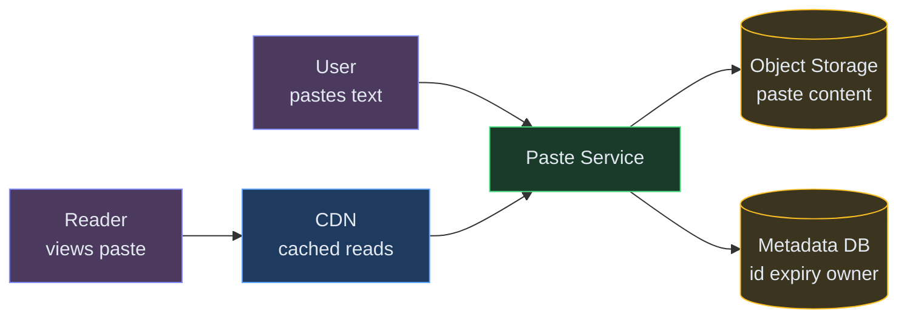
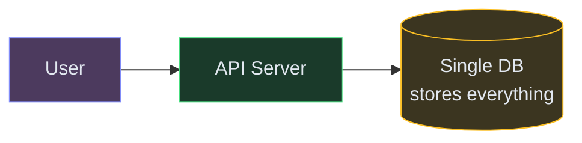
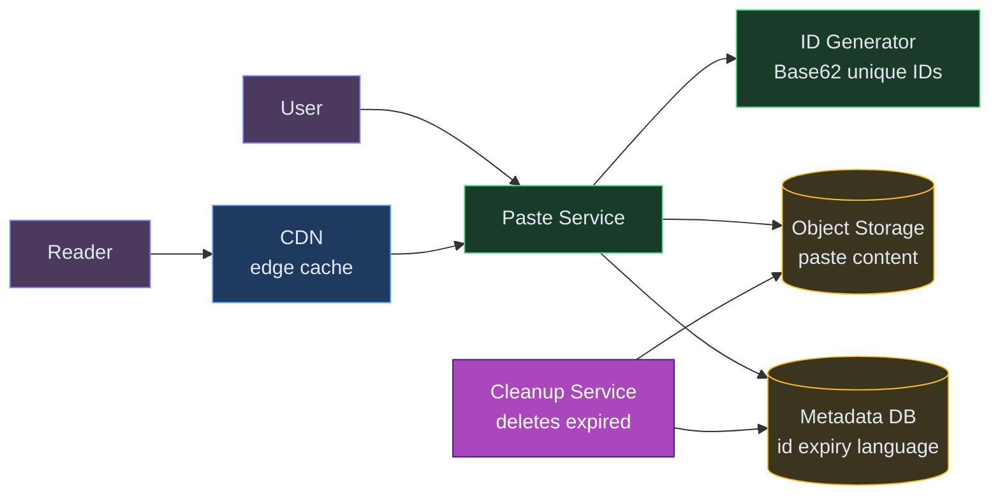
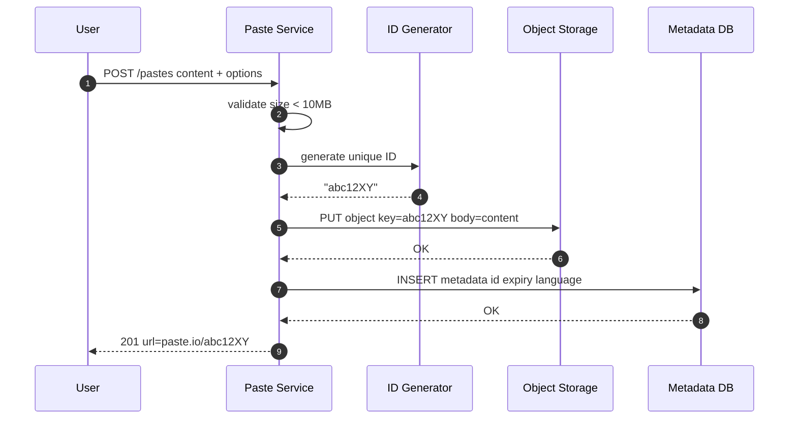
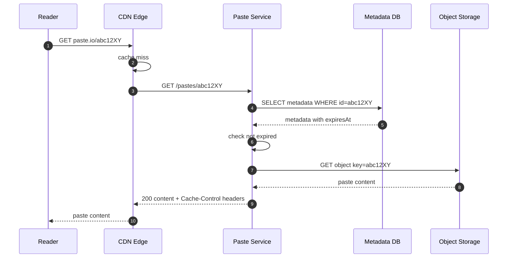
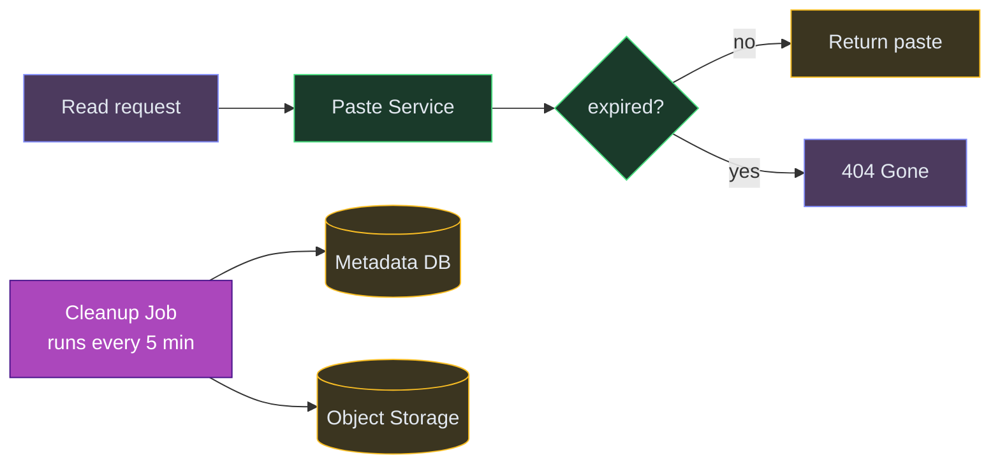

# Designing Pastebin

⚡ **Difficulty:** Beginner
📋 **Prerequisites:** [System Design Fundamentals](/concepts) — especially Storage and Caching
⏱️ **Reading time:** 12 min

---

## TL;DR

Pastebin is a text-sharing service. Users paste text, get a unique short URL, and anyone with that URL can read the paste. Object storage holds the content, a metadata DB tracks IDs and expiry, and a CDN serves reads fast.



**In 3 sentences:** User submits text → service generates a unique short ID, stores the content in object storage, and saves metadata in a DB. The user gets back a URL like `paste.io/abc12XY`. Anyone with that URL fetches the paste through a CDN for fast, cached reads.

---

## Understanding the Problem

**What is Pastebin?** A simple web service where you paste text (code snippets, logs, config files, notes) and get a unique shareable link. Think pastebin.com, GitHub Gist, or hastebin. No authentication needed to create or read a paste — just paste, get a link, share it.

**Why is this asked in interviews?** It's one of the simplest system design problems — even easier than a URL shortener because there's no redirect logic. But it still covers real design concepts: unique ID generation, storage decisions, caching, and data lifecycle management.

---

## Prior Art We're Drawing From

- **GitHub Gist** — Stores code snippets with Git-backed versioning. Content lives in object storage, metadata in Postgres. Demonstrates the separation of content from metadata at scale. ([GitHub Engineering](https://github.blog/engineering/))
- **Hastebin (haste-server)** — Minimal open-source paste service. Shows that the core problem is just ID generation + blob storage + serve. No auth needed for the basic case. ([GitHub: haste-server](https://github.com/toptal/haste-server))
- **Cloudflare Workers KV** — Globally distributed key-value store with CDN-like read performance. Demonstrates how immutable content (like pastes) benefits from aggressive edge caching. ([Cloudflare Workers KV docs](https://developers.cloudflare.com/kv/))

---

**Real examples:**
- Pastebin.com: 18M+ pastes per month
- GitHub Gist: code snippet sharing
- Hastebin: minimal paste tool for developers
- Privatebin: encrypted paste service

## Scale Estimation (Back-of-Envelope)

- **Users:** 5M DAU (creators + readers combined)
- **Write QPS:** 1K new pastes/sec (peak during work hours)
- **Read QPS:** 10K reads/sec (10:1 read-write ratio)
- **Storage:** 10TB paste content/year (assuming avg paste ~1KB, max 10MB)
- **Bandwidth:** ~1 Gbps at peak for content delivery (CDN absorbs most reads)

---

## Naive First Cut

The dumbest possible design — a single server with everything in one database:



Store the paste content as a TEXT/BLOB column directly in a SQL database. Use auto-increment IDs.

**Why this breaks:**

- ❌ **Large pastes in DB** — storing 10MB text blobs in a relational DB bloats the table, slows backups, and makes queries inefficient
- ❌ **Sequential IDs** — auto-increment exposes paste count and is guessable (people will scrape `paste/1`, `paste/2`, ...)
- ❌ **Single server** — one machine handles both reads and writes. A traffic spike kills everything.
- ❌ **No caching** — every read hits the DB. With a 10:1 read-to-write ratio, the DB drowns under read load.
- ❌ **No expiry** — pastes accumulate forever, storage grows unbounded

The rest of the doc evolves this into a proper scalable design.

---

## The Solution

**New components we need:**

1. **Paste Service** — an API layer that handles create and read requests, generates unique IDs, and coordinates storage.
2. **Object Storage (S3 or GCS)** — cheap, durable storage for paste content. Optimized for storing and retrieving blobs of text up to 10MB. 💡 *Object storage is like a giant key-value store for files — you give it a key (paste ID) and it stores the blob. Much cheaper and more scalable than storing blobs in a database.*
3. **Metadata DB (Postgres or DynamoDB)** — stores the paste metadata: ID, creation time, expiry time, owner, syntax language. Small rows, fast lookups.
4. **CDN (CloudFront or Cloudflare)** — caches popular pastes at edge locations worldwide. Since pastes are immutable (content never changes after creation), CDN caching is extremely effective.
5. **Cleanup Service** — a background job that deletes expired pastes from both object storage and the metadata DB.



**Why separate object storage from the metadata DB?** Paste content can be up to 10MB — storing that in a relational DB makes the table enormous, slows queries, and makes backups painful. Object storage (S3) is designed for exactly this: cheap, durable blob storage with simple get/put operations. The metadata DB stays lean with small rows (ID, timestamps, a few flags), so lookups are fast.

---

## API Design

```
POST /v1/pastes
Body: { content, language?, expiresIn?, title? }
→ { id: "abc12XY", url: "https://paste.io/abc12XY", expiresAt: "..." }

GET /v1/pastes/{id}
→ { id, content, language, createdAt, expiresAt, title }

DELETE /v1/pastes/{id}
Headers: Authorization: Bearer <token>
→ 204 No Content
```

> 💡 **Security note:** Creating pastes can be anonymous, but deleting requires ownership proof. Rate-limit paste creation by IP to prevent spam (see [Rate Limiter](/RateLimiter)).

---

## Flow: Create a Paste



## Flow: Read a Paste



On subsequent reads, CDN serves from cache — no origin hit.

---

## Deep Dives

### 1. Unique ID Generation

The paste ID appears in the URL (`paste.io/abc12XY`). It must be unique, short, and not guessable.

**How short?** Base62 encoding (a-z, A-Z, 0-9) with 7 characters gives 62⁷ = **3.5 trillion** possible IDs. Even at 1000 pastes/second, that's 100+ years before exhaustion.

> 💡 **Base62** uses 62 characters (letters + digits) to encode numbers compactly. The number 1000 in Base62 is "g8" — much shorter than decimal. This is the same trick URL shorteners use.

**Three approaches:**

| Approach | How | Trade-off |
|---|---|---|
| **Random** | Generate 7 random Base62 chars | Simple. Tiny collision risk (check DB). |
| **Hash-based** | MD5/SHA256 of content → take first 7 chars of Base62 | Same content = same ID (dedup). Collisions possible. |
| **Counter-based** | Global counter → Base62 encode | Zero collisions. But sequential = guessable. |

**Best for Pastebin:** Random with collision check. Generate 7 random characters, check if the ID exists in the metadata DB (fast primary key lookup), retry if collision. At 3.5T possible IDs, collisions are astronomically rare.

**Why not hash-based?** Two different pastes could collide (same first 7 chars). You'd need collision resolution anyway, so random is simpler. Hash-based is better when you want deduplication (same content → same URL), but that's not a requirement here.

### 2. Storage Choice: DB Blob vs Object Storage

**Why not just store content in the database?**

| Factor | DB (Postgres BYTEA) | Object Storage (S3) |
|---|---|---|
| **Max size** | Practical limit ~1MB per row | Up to 5TB per object |
| **Cost** | $0.10-0.20/GB/month (EBS) | $0.023/GB/month (S3) |
| **Backup speed** | Slow with large blobs in table | Independent — DB stays lean |
| **Read latency** | Fast for small rows | ~50ms first byte (CDN fixes this) |
| **Scaling** | Vertical (bigger DB) | Infinite horizontal |

**Verdict:** Object storage for content, relational DB for metadata. The DB stays small and fast (each row is ~200 bytes of metadata). Object storage handles the variable-size content cheaply.

> 💡 **Real-world example:** GitHub stores Gist content in a Git-backed object store, not in their main Postgres database. The metadata (owner, description, timestamps) lives in the DB.

### 3. Handling Paste Expiry

Pastes can have an expiry time (1 hour, 1 day, 1 week, never). How do we delete expired pastes?

**Approach: Lazy deletion + Background cleanup**



**Two-pronged strategy:**

1. **Lazy check on read** — when someone requests a paste, check `expiresAt`. If expired, return 404 immediately. The data still exists but is inaccessible.
2. **Background cleanup job** — runs every 5 minutes, queries `SELECT id FROM pastes WHERE expiresAt < NOW() LIMIT 1000`, deletes from both object storage and metadata DB in batches.

**Why both?** Lazy check gives instant correctness (no one ever sees an expired paste). Background cleanup reclaims storage space. Without cleanup, expired content wastes storage money indefinitely.

> 💡 **S3 Lifecycle Rules** can also auto-delete objects after a TTL. But since our expiry is per-paste (not a global TTL), we need our own cleanup logic for the metadata. S3 lifecycle works great if you organize objects into folders by expiry date.

---

## Key Technologies

| Term | What it is |
|---|---|
| **Object Storage (S3 or GCS)** | Cloud storage for arbitrary blobs. Pay per GB. Virtually unlimited capacity. Perfect for paste content. |
| **Base62 Encoding** | Encoding numbers using 62 characters (a-z, A-Z, 0-9). Produces short, URL-safe strings. 7 chars = 3.5 trillion combinations. |
| **CDN (CloudFront or Cloudflare)** | Caches content at edge servers worldwide. Since pastes are immutable, CDN hit rates are very high — most reads never reach your origin. |
| **TTL (Time To Live)** | How long a paste lives before expiring. Stored as `expiresAt` timestamp in metadata. |
| **Metadata DB** | Stores small structured data about each paste (ID, timestamps, language). Stays lean because content lives elsewhere. |

---

## Interview Cheat Sheet

| Question | Answer |
|---|---|
| "How to generate unique IDs?" | Random 7-char Base62. 3.5T combinations. Check for collision (rare). |
| "Where to store paste content?" | Object storage (S3). Cheap, scalable, durable. Not in the DB. |
| "How to handle reads at scale?" | CDN caching. Pastes are immutable so cache-hit ratio is very high. |
| "How to handle expiry?" | Lazy check on read (instant correctness) + background cleanup job (reclaim storage). |
| "Why not store content in DB?" | 10MB blobs bloat the table, slow backups, and cost 5-10× more than object storage. |
| "How to prevent abuse?" | Rate limit by IP, max paste size (10MB), optional CAPTCHA for anonymous users. |
| "What about syntax highlighting?" | Store the `language` field in metadata. Highlighting is done client-side (Prism.js or highlight.js). |

---

## What's Expected at Each Level

> This section helps you calibrate your depth. You don't need to cover everything — just know what's expected for your level.

### Mid-level

Design basic paste creation and retrieval. Propose object storage (S3) for content and a database for metadata. Understand Base62 ID generation (same pattern as URL shortener). Explain why storing large text blobs directly in a relational DB is a bad idea.

### Senior

Explain the separation of content (S3/object storage) from metadata (Postgres) — different access patterns, different cost profiles. Propose CDN caching for immutable pastes (write-once, read-many = perfect cache-hit ratio). Discuss expiry handling with lazy deletion on read plus background cleanup jobs for storage reclamation.

### Staff+

Address abuse prevention (rate limiting per IP, content scanning for malware/spam, CAPTCHA for anonymous users). Discuss storage cost optimization via content-hash deduplication (same content = same S3 key, share the blob). Cover multi-region replication for read latency (replicate to CDN edge, not the origin) and the operational cost of managing expiry at scale with billions of pastes.

---

## 🎯 Key Takeaways

- **Separate metadata from content** — small DB rows for fast lookups, object storage for cheap blob storage
- **Base62 random IDs** give short, URL-safe, non-guessable paste links
- **CDN is a perfect fit** because pastes are immutable — write once, read many
- **Two-pronged expiry** — lazy check for correctness, background job for cleanup
- This is essentially a simpler URL shortener: generate ID → store blob → serve it

---

## Related Designs
- [URL Shortener](/URLShortner) — same ID generation pattern, simpler storage
- [Rate Limiter](/RateLimiter) — protecting the paste API from abuse
- [Instagram](/Instagram) — object storage patterns for media

