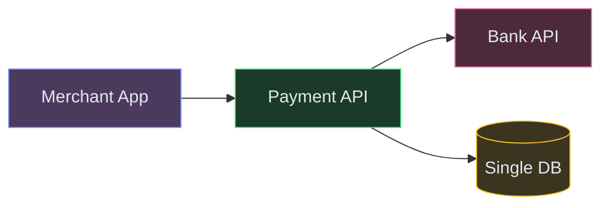
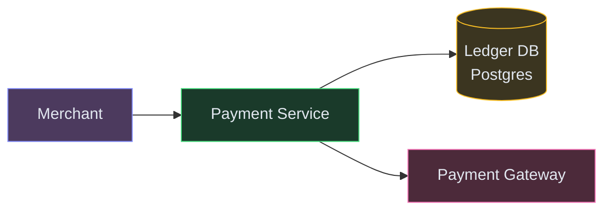
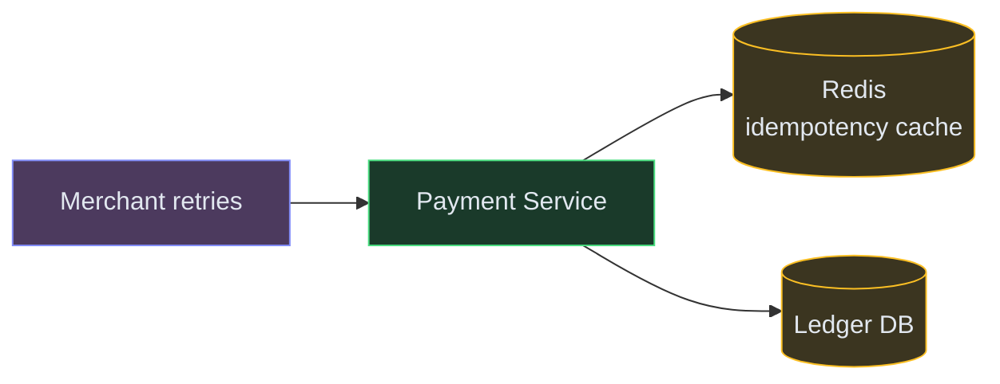
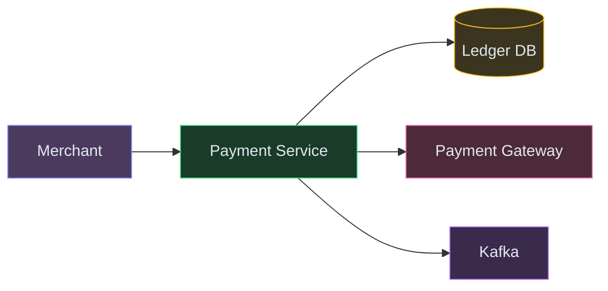

# Designing a Payment System (Stripe / Razorpay)

**Difficulty:** Advanced
**Prerequisites:**[Message Queues](/concepts/message-queues/), [Database Transactions](/concepts/write-ahead-log/), and [Scalability](/concepts/scalability/)

---

## Understanding the Problem

A payment system orchestrates the movement of money between buyers, merchants, and banks. It processes a payment request (card charge, UPI transfer), routes it to the appropriate payment network, handles success/failure gracefully, and maintains a bulletproof ledger for auditing. The hard parts: never charging a customer twice (idempotency), handling partial failures across external systems (bank timeouts), and reconciling millions of transactions daily.

---

## Naive First Cut



Why this breaks:
- Bank API times out → did the charge go through or not? System is in unknown state
- Network retry charges the customer twice (no idempotency)
- Single `balance` column — concurrent payments race and corrupt the balance
- No double-entry ledger — money can appear or vanish without audit trail
- A single DB for payment records, ledger, and merchant data can't handle 50K TPS

---

## Functional Requirements

### Core (top 3)
1. **Process a payment** — charge a customer's card/UPI and credit the merchant
2. **Idempotent execution** — retries never cause double-charges
3. **Refund a payment** — reverse a charge and return money to the customer

### Below the Line
- Multi-currency, partial refunds, recurring subscriptions, dispute handling, PCI compliance, settlement reports

---

## Non-Functional Requirements

- **Correctness** — double-entry ledger; money never created or destroyed
- **Idempotency** — exactly-once semantics for payment operations
- **Latency** — payment confirmed in <3 seconds (including bank round-trip)
- **Availability** — 99.99%; payment downtime = lost revenue for all merchants

---

## Core Entities

- **Payment** — id, merchant, amount, currency, status (pending/succeeded/failed), idempotency key
- **Ledger Entry** — account, amount, direction (debit/credit), payment reference, timestamp
- **Refund** — payment reference, amount, status, reason
- **Settlement** — batch of completed payments owed to a merchant, payout status

---

## API

```text
POST /v1/payments
  Body: { amount: 5000, currency: "INR", merchantId, paymentMethod: "card_tok_xxx", idempotencyKey }
  Response: { paymentId, status: "succeeded" }

POST /v1/payments/{paymentId}/refund
  Body: { amount: 5000, reason: "customer_request", idempotencyKey }
  Response: { refundId, status: "processing" }

GET /v1/payments/{paymentId}
  Response: { paymentId, status, amount, ledgerEntries: [...] }
```

---

## High-Level Design

### FR1: Process a Payment

The Payment Service validates the request, records it with a pending status, calls the Payment Gateway (bank/card network), and on success writes double-entry ledger entries.



### FR2: Idempotent Execution

The idempotency key is stored as a unique constraint. On retry, the service detects the duplicate and returns the original result without re-processing.



### FR3: Refund

A refund creates reverse ledger entries (credit back to customer, debit from merchant). The Gateway is called to reverse the charge. Events are published for reconciliation.



---

## Deep Dives

### Deep Dive 1: Handling bank timeouts — the unknown state problem

**Bad:** Call the bank API. It times out after 30 seconds. We don't know if the charge went through. Mark as "failed" and let the user retry → potential double-charge.

**Good:** On timeout, mark the payment as "unknown." Don't retry automatically. Instead, query the bank's status API after 60 seconds. If the bank confirms the charge succeeded, mark as succeeded and write ledger entries. If it confirms failure, mark as failed and allow retry.

**Great:** Treat every payment as a state machine: `created → pending → [succeeded | failed | unknown]`. For unknown states, a reconciliation job runs every 5 minutes, pulls the bank's transaction status in bulk, and force-resolves all stuck payments. Additionally, consume the bank's end-of-day settlement file and cross-reference every transaction. Any discrepancy (we say failed, bank says charged) triggers an automatic refund. The system self-heals within hours.

### Deep Dive 2: Double-entry ledger design

**Bad:** Store a `balance` column per merchant. Increment on payment, decrement on refund. If a write is lost or a bug skips the increment, money disappears silently. No audit trail.

**Good:** Append-only double-entry ledger. Every payment creates two entries: debit customer's funding source, credit merchant's account. The balance is a derived value (`SUM(credits) - SUM(debits)`). If the ledger is correct, balances are always correct.

**Great:** Separate the ledger from the operational payment flow. The Payment Service writes events to Kafka. A Ledger Writer consumes events and appends entries in the correct order. The ledger DB is append-only with no updates or deletes — making it trivially auditable. For balance queries, maintain a materialized balance in Redis (updated on each ledger write). Periodically run a reconciliation job that recomputes all balances from the raw ledger and compares with the materialized values — any mismatch fires an alert.

### Deep Dive 3: Scaling for peak events (sales, salary days)

**Bad:** Single Postgres for all payments. During a Flipkart Big Billion Day sale, 50K+ TPS overwhelms the DB. Payments fail, merchants lose revenue.

**Good:** Shard the ledger by merchant ID. Each shard handles a manageable 5K TPS. Payments between merchants (rare) use cross-shard coordination.

**Great:** Add a request queue in front of the Payment Gateway during peak. When bank response times degrade (they always do during sales), instead of failing payments, enqueue them and process at the bank's sustainable rate. Merchants get a "processing" status (completes in 5-10 seconds instead of 2). Combined with circuit breakers per bank (if a specific bank is failing, route to a backup acquirer), this maintains 99.9% payment success even during massive traffic spikes.

---

## What's Expected at Each Level

| Level | Expectations |
|---|---|
| **Mid** | Double-entry ledger concept. Idempotency key with unique constraint. Basic payment state machine. Explain the timeout problem. |
| **Senior** | Reconciliation job for unknown states. Append-only ledger with materialized balances. Kafka for event sourcing. Circuit breaker per bank/gateway. |
| **Staff+** | Request queue for peak load smoothing. Settlement file reconciliation. Multi-acquirer routing for failover. Sharded ledger by merchant. Cost of PCI compliance on architecture choices. |
