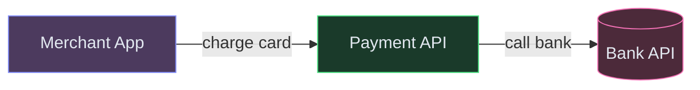
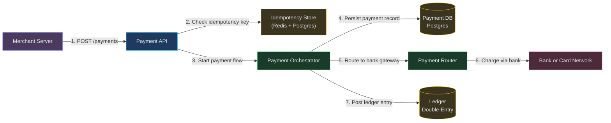
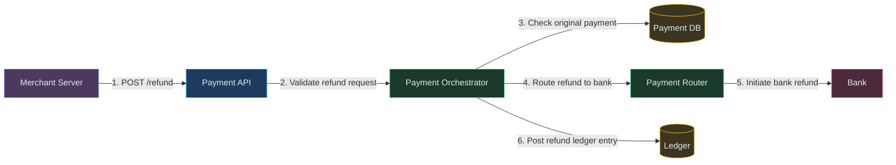
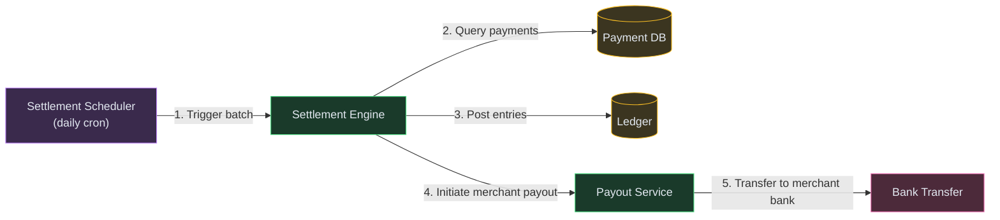
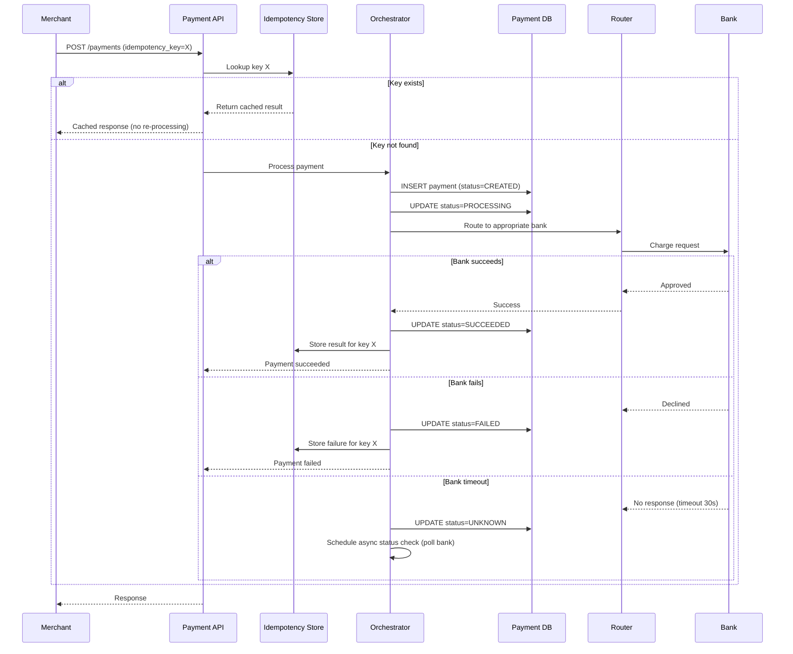
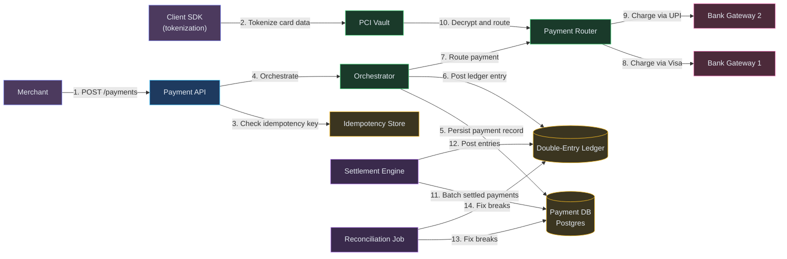

# Designing a Payment System (Stripe / Razorpay)

**Difficulty:** Advanced **Topics:** Payment Orchestration, Idempotency, Double-Entry Ledger, Settlement, Reconciliation, PCI Compliance **Asked at:** Google, Amazon, PhonePe, Razorpay, Stripe, Flipkart, Goldman Sachs
**Prerequisites:**[Message Queues](/concepts/message-queues/), [Database Transactions](/concepts/write-ahead-log/), and [Scalability](/concepts/scalability/)

---

## 1. Understanding the Problem

A payment system orchestrates the movement of money between buyers, merchants, and banks. It processes a payment request (card charge, UPI transfer, wallet debit), routes it to the appropriate payment network, handles success and failure, settles funds to the merchant, and maintains a bulletproof ledger for auditing. The hard parts: exactly-once processing (never charge a customer twice), handling partial failures across multiple external systems (bank timeouts, network drops), and reconciling millions of transactions daily across banks that disagree with your records.

**Real examples:** Stripe, Razorpay, PayPal, Square, Adyen.

---

## 1.5. Naive First Cut



Merchant calls API, API calls bank, returns success/failure.

**Why this breaks:**

- Bank times out — did the charge go through? If you retry, you might double-charge
- No record if the API crashes between calling the bank and responding to the merchant
- No settlement — money sits in the payment processor's account indefinitely
- No reconciliation — disagreements between your ledger and the bank go undetected
- No refund handling — partial refunds, chargebacks, disputes require complex state machines
- No PCI compliance — raw card numbers stored in your DB is a security and legal disaster

The rest of the doc evolves this into an idempotent, ledger-based payment orchestration system with state machines, retry safety, and daily reconciliation.

---

## 1.7. Prior Art We're Drawing From

- **Stripe Idempotency Keys** - Every API request includes a client-generated idempotency key. The server stores the result of the first execution and returns it for any retry with the same key. This guarantees exactly-once semantics even with network failures. ([Stripe Engineering](https://stripe.com/blog/idempotency))
- **Airbnb Payments Platform** - Uses a double-entry ledger where every money movement is recorded as a debit+credit pair that sums to zero. Enables real-time reconciliation and audit trails. Processes $100B+ in yearly payments. ([Airbnb Engineering](https://medium.com/airbnb-engineering/avoiding-double-payments-in-a-distributed-payments-system-2981f6b070bb))
- **Square Payment State Machine** - Models each payment as a state machine (CREATED → AUTHORIZED → CAPTURED → SETTLED or FAILED/REFUNDED). Each transition is idempotent and persisted before side effects execute. Recovery after crashes replays from the last persisted state. ([Square Engineering](https://developer.squareup.com/blog))
- **Razorpay Recon Engine** - Daily reconciliation compares internal ledger with bank settlement files. Discrepancies trigger auto-correction for known patterns (timing differences) and manual review for unknowns. Handles millions of transactions with <0.01% unreconciled. ([Razorpay Engineering](https://engineering.razorpay.com/))

---

## 2. Technology Choices

| Tier | Purpose | Stores | Access Pattern | Primary Pick | Alternatives |
|---|---|---|---|---|---|
| Payment DB | Payment records and state | Transactions with state machine | OLTP with strong consistency | Postgres (ACID critical) | CockroachDB / Spanner |
| Ledger | Double-entry accounting | Debit-credit journal entries | Append-only with balance queries | Postgres (with append-only constraint) | Custom ledger DB / TigerBeetle |
| Idempotency store | Request dedup | idempotency_key -> result | Point lookup and upsert | Redis (fast) + Postgres (durable) | DynamoDB |
| Payment queue | Async processing | Payment jobs in various states | Priority queue with retry | Kafka / SQS | RabbitMQ |
| Vault | Sensitive card data | Encrypted PANs and tokens | Tokenize and detokenize | HashiCorp Vault / custom PCI vault | AWS KMS |
| Settlement store | Payout batches | Daily settlement summaries | Batch read and write | Postgres | - |
| Event stream | Audit trail | All state transitions | Append-only audit log | Kafka | EventBridge |

**Why Postgres over NoSQL for payments?** ACID transactions are non-negotiable. A payment that deducted money from a customer but crashed before recording it in the ledger is unacceptable. Postgres gives serializable isolation, and the payment DB is not horizontally-scaled (it's sharded by merchant_id, with each shard small enough for one Postgres instance).

---

## 3. Functional Requirements

### Core (Top 3)

1. **Process a payment** - accept a payment request (card, UPI, wallet), route to the correct payment network, and return success/failure with exactly-once guarantee
2. **Handle refunds and chargebacks** - process full/partial refunds, handle bank-initiated chargebacks, maintain correct ledger state
3. **Settle funds to merchants** - batch completed payments and transfer net amounts (minus fees) to merchant bank accounts daily

### Below the Line

- Multi-currency support
- Subscription/recurring payments
- Payment links and invoices
- Dispute resolution workflow
- PCI-DSS audit compliance

---

## 4. Non-Functional Requirements

### Core

- **Correctness:** Zero double-charges. Zero lost payments. Ledger balanced to the penny at all times.
- **Availability:** 99.99% for payment acceptance (downtime = lost revenue for merchants)
- **Latency:** Payment processing P95 < 2 seconds (includes bank round-trip)
- **Idempotency:** Any request can be safely retried without side effects

### Below the Line

- Settlement within T+1 (next business day)
- Reconciliation discrepancies < 0.01%
- PCI-DSS Level 1 compliance (no raw card data in application tier)

---

## 5. Core Entities

- **Payment** - a single money movement with a state machine (created → processing → succeeded/failed → settled/refunded)
- **LedgerEntry** - an immutable debit or credit record (always in pairs that sum to zero)
- **Merchant** - a business account with bank details, fees, and settlement schedule
- **PaymentMethod** - a tokenized reference to a card, UPI VPA, or wallet (never raw PAN)
- **Refund** - a reversal of a payment (full or partial) with its own state machine
- **Settlement** - a batch payout to a merchant covering multiple payments minus fees

---

## 6. API / System Interface

```
POST /v1/payments
Headers: Idempotency-Key: "order_123_attempt_1"
Body: {
  "amount": 1500,
  "currency": "INR",
  "payment_method": "pm_tok_visa_4242",
  "merchant_id": "m_456",
  "description": "Order #123"
}
Response:
{
  "payment_id": "pay_789",
  "status": "processing",
  "created_at": "2024-07-01T10:00:00Z"
}
```

```
POST /v1/payments/pay_789/refund
Headers: Idempotency-Key: "refund_order_123"
Body: {"amount": 500, "reason": "partial_return"}
Response: {"refund_id": "ref_101", "status": "processing"}
```

```
GET /v1/payments/pay_789
Response: {"payment_id": "pay_789", "status": "succeeded", "amount": 1500, ...}
```

Security notes: card tokenization happens client-side (Stripe.js, Razorpay SDK) — raw PAN never touches the payment server. All API calls over TLS with merchant API key authentication. Idempotency-Key is mandatory for all writes.

---

## 7. High-Level Design

### FR1: Process a payment (idempotent, exactly-once)

The key invariant: a payment must be recorded in the database BEFORE calling the bank. If the bank call succeeds but the response is lost, the persisted state allows safe retry.



**Flow:**
1. Merchant sends payment request with idempotency key
2. API checks idempotency store — if key exists, return cached result (no re-processing)
3. Payment Orchestrator creates payment record in DB with status=CREATED (persisted first)
4. Orchestrator transitions to PROCESSING and calls Payment Router
5. Router selects bank gateway (Visa, Mastercard, UPI) and forwards request
6. Bank returns success → Orchestrator transitions to SUCCEEDED
7. Ledger records: DEBIT customer_funds, CREDIT merchant_receivable
8. Store result in idempotency store; return to merchant

---

### FR2: Handle refunds

A refund reverses a payment — but partially and asynchronously. It has its own state machine.



**Flow:**
1. Merchant requests refund of ₹500 on a ₹1500 payment
2. Orchestrator validates: payment is in SUCCEEDED state, refund amount <= remaining refundable
3. Creates refund record (status=PROCESSING), updates payment's refunded_amount
4. Calls bank to initiate refund (bank takes 5-10 business days to credit customer)
5. Ledger records: DEBIT merchant_receivable ₹500, CREDIT customer_refund_pending ₹500
6. When bank confirms refund processed → transition to SUCCEEDED

---

### FR3: Settlement

Daily, batch all successful payments for each merchant, deduct platform fees, and initiate bank transfer.



**Flow:**
1. Settlement Scheduler runs at 2 AM daily
2. Queries all payments in SUCCEEDED state from yesterday (settlement window)
3. Groups by merchant, sums amounts, deducts platform fee (2%)
4. Creates settlement record: merchant_id, gross_amount, fee, net_amount
5. Ledger records: DEBIT merchant_receivable, CREDIT merchant_payable (net), CREDIT platform_revenue (fee)
6. Payout Service initiates bank transfer to merchant's registered account
7. On bank confirmation → settlement marked as COMPLETED

---

## 6.5. Core Flows

### Flow 1: Payment Processing (happy path + failure)



**Non-obvious failure path:** Bank timeout is the hardest case. The payment might have succeeded at the bank but the response was lost. The Orchestrator marks it UNKNOWN and schedules a polling job that queries the bank's status API every 30 seconds for up to 24 hours. This eventually resolves to SUCCEEDED or FAILED without risking a double-charge (because we never retry the charge — we only check status).

---

## 7. Deep Dives

### Deep Dive 1: Idempotency (Never Double-Charge)

**Bad:** No idempotency. Network glitch → merchant retries → customer charged twice. This is the #1 payment bug.

**Good:** Idempotency key stored in Redis. Before processing, check if key exists. If yes, return cached result. Problem: if the server crashes AFTER charging the bank but BEFORE storing in Redis, the retry will charge again.

**Great:** **Persist-before-execute pattern.** Write the payment record (with idempotency key) to Postgres FIRST in status=CREATED. Then call the bank. If the server crashes after the bank charge, the payment record exists. On retry, the API finds the record, sees status=PROCESSING, and queries the bank for status (instead of re-charging). The idempotency key is part of the DB record, not a separate cache — it's crash-safe.

---

### Deep Dive 2: Double-Entry Ledger

**Bad:** Track balances as a single "balance" column that gets incremented/decremented. Hard to audit, easy to have off-by-one errors, no trail.

**Good:** Event log of all transactions. Balances computed by summing the log. Correct but slow for balance queries at scale.

**Great:** **Double-entry bookkeeping** where every money movement records exactly two entries (a debit and a credit) that sum to zero. Account balances are materialized views over the journal. The invariant "sum of all entries = 0" is checked continuously — any violation means a bug. This is how banks work. Airbnb processes $100B+/year on this model. The ledger is append-only (entries are never edited or deleted — corrections are new counter-entries).

---

### Deep Dive 3: Reconciliation

**Bad:** Trust your own ledger. Never check against the bank. Discrepancies accumulate silently until an audit reveals millions in errors.

**Good:** Daily reconciliation: download bank settlement file, compare transaction-by-transaction against your ledger. Flag mismatches.

**Great:** **Three-way reconciliation** (borrowing from Razorpay): compare (1) your payment DB, (2) your ledger, (3) the bank settlement file. Discrepancies fall into known categories: timing differences (bank settled T+2 vs your T+1 expectation), currency rounding, bank fees not reflected. Auto-resolve known patterns; alert humans for unknown discrepancies. At scale, this runs as a batch job processing millions of records in minutes.

---

### Deep Dive 4: Payment Routing and Failover

**Bad:** Route all payments to one bank gateway. If that gateway is down, all payments fail.

**Good:** Multiple gateways with priority-based routing. If primary fails, retry on secondary.

**Great:** **Smart routing with success-rate optimization.** Track real-time success rates per gateway, per card BIN, per bank. Route each payment to the gateway with the highest historical success rate for that specific card + bank combination. If Visa via Gateway A has 98% success but Gateway B has 92%, route to A. If A's success rate drops below a threshold (gateway issue), automatically shift traffic to B within seconds. This 3-5% improvement in success rate translates directly to revenue.

---

### Deep Dive 5: PCI Compliance (Card Data Handling)

**Bad:** Store raw card numbers in your payment DB. You're now subject to the full PCI-DSS audit (~$200K/year) and one breach destroys the business.

**Good:** Encrypt cards at rest with AES-256. Reduces risk but you still "touch" raw PANs — still full PCI scope.

**Great:** **Tokenization with a dedicated PCI vault.** Raw card data never enters your application servers. Client-side SDK (Stripe.js, Razorpay.js) sends the card directly to a PCI-compliant vault (separate network segment). The vault returns a token. Your servers only ever see tokens — never raw PANs. This reduces your PCI scope from SAQ-D (most complex) to SAQ-A (simplest). The vault is a separate, hardened service with its own audit boundary.

---

## 7.5. Design Self-Audit

- **Stale reads?** Not applicable — payment state is always read from the primary DB (strong consistency required).
- **Single points of failure?** Payment DB is the critical path — Postgres streaming replication with synchronous standby. Bank gateways are external SPOFs mitigated by multi-gateway routing.
- **Dead-letter / reconciliation?** Payments stuck in UNKNOWN for > 24 hours go to a DLQ for manual investigation. Daily reconciliation catches anything that slipped through.
- **Cost at scale?** Bank gateway fees (2-3% per transaction) dominate. Infrastructure cost is small relative to transaction volume.
- **Exactly-once?** Guaranteed by the persist-before-execute pattern + idempotency keys stored in the durable payment record.

---

## 8. Final Architecture



**How it works end-to-end:**

1. **Merchant initiates payment** — API call hits the Payment API with amount, currency, and idempotency key
2. **Idempotency check** — Idempotency Store rejects duplicate requests, returns cached result for retries
3. **Orchestrator coordinates flow** — reads/writes Payment DB (Postgres), posts balanced entries to Double-Entry Ledger
4. **Payment Router selects rail** — picks optimal Bank Gateway based on success rate, cost, and availability
5. **PCI Vault decrypts card** — tokenized card data decrypted in the isolated vault, forwarded to the selected bank
6. **Bank processes charge** — external gateway returns auth/decline; Orchestrator updates status
7. **Settlement Engine batches** — end-of-day job nets transactions and posts final ledger entries
8. **Reconciliation Job verifies** — compares internal ledger against bank statements, flags and fixes discrepancies
