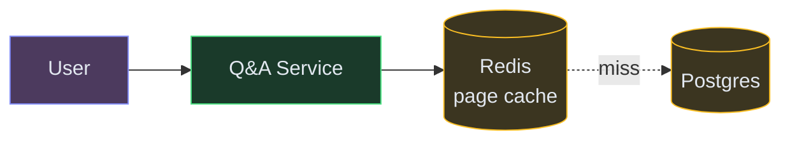
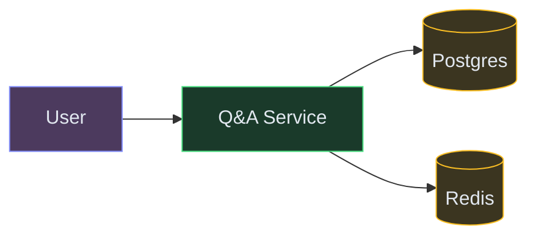
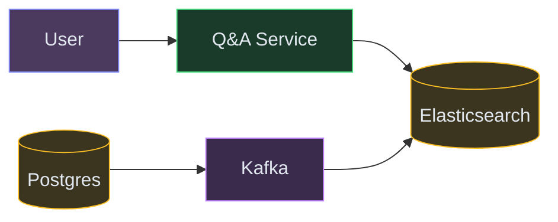

# Designing a Q&A Forum (Quora / StackOverflow)

**Difficulty:** Intermediate
**Prerequisites:**[Caching](/concepts/caching/), [Database Indexing](/concepts/database-indexing/), and [Fan-Out](/concepts/fan-out/)

---

## Understanding the Problem

A Q&A forum lets users post questions, write answers, and vote on both. Readers vastly outnumber writers — most traffic is people reading a question and its top answers, often arriving from a search engine. The hard parts: serving reads cheaply at scale (100:1 read-to-write ratio), ranking answers so the best one appears first, and providing full-text search across millions of questions.

---

## Naive First Cut


Why this breaks:
- Hot questions (viral content) get 100K reads/sec — single DB can't handle the load
- Full-text search with `LIKE '%keyword%'` does a full table scan, no relevance ranking
- Computing "top answers" on every read (sort by votes) is expensive when there are 500 answers
- Feed generation for 10M users requires scanning all followed topics per request
- No caching — same popular question page is recomputed on every request

---

## Functional Requirements

### Core (top 3)
1. **Post and read Q&A** — users post questions, others write answers, anyone can read
2. **Vote on answers** — upvote/downvote; answers ranked by score
3. **Search questions** — full-text search across all questions by keyword and tags

### Below the Line
- User profiles, comments on answers, tag system, personalized feed, notifications, moderation tools

---

## Non-Functional Requirements

- **Read latency** — <100ms for question page loads (including top answers)
- **Scale** — 10M questions, 50M answers, 100:1 read-to-write ratio
- **Search** — full-text results in <200ms with relevance ranking
- **Availability** — 99.9%; read path must stay up even if write path degrades

---

## Core Entities

- **Question** — title, body, tags, author, created_at, view_count
- **Answer** — body, author, question reference, vote_score, created_at
- **Vote** — user, target (answer/question), direction (up/down)
- **Tag** — name, question count (for discovery)

---

## API

```text
POST /v1/questions
  Body: { title, body, tags: ["system-design", "caching"] }
  Response: { questionId, slug }

POST /v1/questions/{questionId}/answers
  Body: { body }
  Response: { answerId }

GET /v1/search?q=distributed+caching&tags=system-design&page=1
  Response: { results: [{ questionId, title, score, answerCount }], total }
```

---

## High-Level Design

### FR1: Post and Read Q&A

The Question Service writes to Postgres. For reads, a Redis cache sits in front — popular question pages are cached with a short TTL.



### FR2: Vote on Answers

Votes update the answer's score. The write goes to Postgres; the cached question page is invalidated so the next read fetches fresh rankings.



### FR3: Search Questions

An Elasticsearch index stores questions with full-text fields. Writes to Postgres are synced to ES via async pipeline.



---

## Deep Dives

### Deep Dive 1: Handling viral questions (thundering herd)

**Bad:** A question goes viral — 100K users hit the page simultaneously. Cache TTL expires, all 100K requests hit the DB at once (thundering herd). DB overloads and the whole site slows down.

**Good:** Use a cache-aside pattern with a short TTL (30s). On cache miss, only one request fetches from DB (using a distributed lock or single-flight pattern). All other concurrent requests wait and receive the cached result once the first one completes.

**Great:** For known hot content (trending questions, front-page posts), use a "cache warming" strategy. A background job identifies trending questions (by view velocity) and proactively refreshes their cache before TTL expiry. This eliminates cache misses entirely for the hottest content. Combined with read replicas on Postgres for the long-tail of unpopular questions, the primary DB only handles writes.

### Deep Dive 2: Answer ranking that rewards quality

**Bad:** Sort by raw vote count. Old answers accumulate votes over time and always stay on top, even when a newer, better answer exists.

**Good:** Use a time-decayed scoring formula: `score = votes / (hours_since_posted + 2)^gravity`. Newer answers with fewer votes can outrank older answers with more votes. This encourages fresh contributions.

**Great:** Combine vote score with engagement signals: answer acceptance (by the question author), view-time (do readers scroll past it or stop?), and author reputation. Weight these into a composite ranking score. Compute rankings asynchronously (not on every page load) and cache the sorted result. Re-rank every few minutes or on significant vote changes (>5 new votes). This keeps page loads fast while providing meaningful rankings.

### Deep Dive 3: Full-text search with relevance

**Bad:** SQL `LIKE '%distributed caching%'` — no index can help, scans all 10M rows, returns results without relevance ranking.

**Good:** Elasticsearch index with standard BM25 scoring. Questions are indexed by title, body, and tags. Search returns results ranked by text relevance. Sync from Postgres to ES via Kafka (CDC pipeline) with <10s lag.

**Great:** Boost search relevance with engagement signals. Weight title matches higher than body matches. Boost questions with more views, votes, and accepted answers. Add tag-based filtering (faceted search). For "unanswered" queries, filter to questions with zero accepted answers — useful for contributors looking to help. Combined with search-as-you-type (prefix completion on the title field), users find answers before even finishing their question.

---

## What's Expected at Each Level

| Level | Expectations |
|---|---|
| **Mid** | Redis cache for read-heavy pages. Elasticsearch for full-text search. Basic vote-sorted answers. Explain read/write ratio implications. |
| **Senior** | Thundering herd protection (single-flight). CDC pipeline to sync ES. Time-decayed ranking formula. Read replicas for the long tail. |
| **Staff+** | Cache warming for trending content. Composite ranking with engagement signals. Faceted search with boost tuning. Feed generation strategy for followed topics. |
