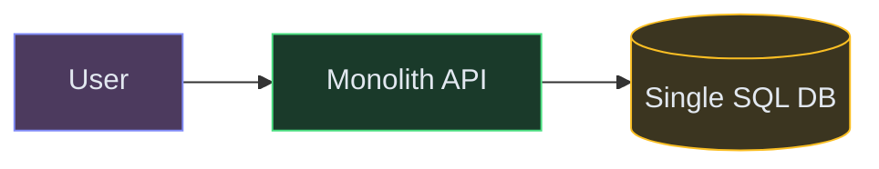
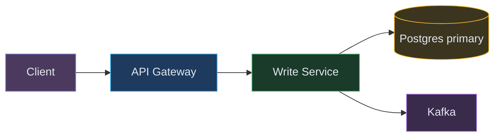
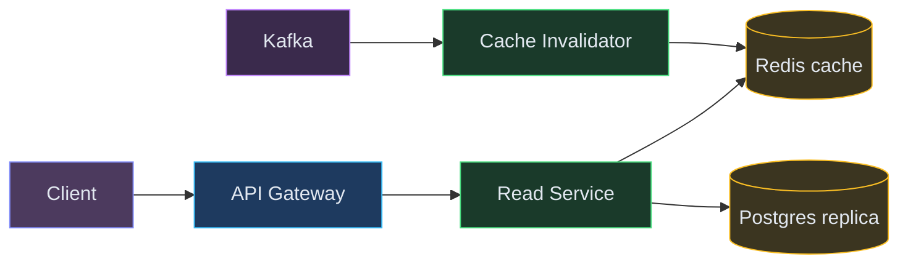
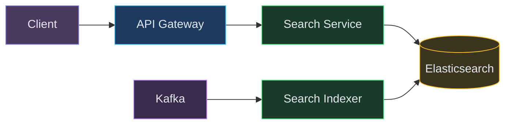
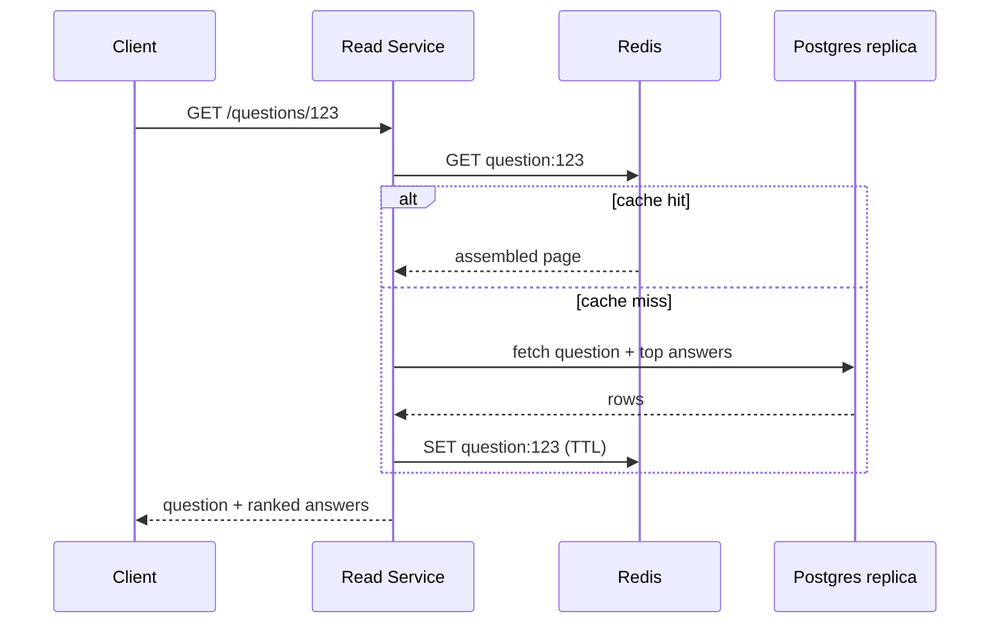
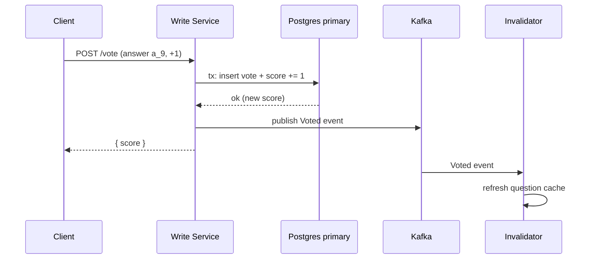
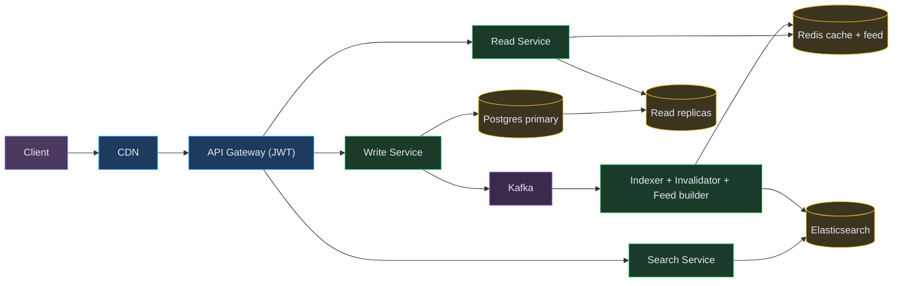

# Designing a Q&A Forum (Quora / StackOverflow)

**Difficulty:** Intermediate **Topics:** Read-heavy Scaling, Search, Feed Ranking, SQL vs NoSQL, Voting **Asked at:** PhonePe, Quora, Stack Overflow, Amazon
**Prerequisites:**[Caching](/concepts/caching/), [Database Indexing](/concepts/database-indexing/), and [Fan-Out](/concepts/fan-out/)

---

## 1. Understanding the Problem

A Q&A forum lets users post **questions**, write **answers**, and **vote** on both. Readers vastly outnumber writers - most traffic is people reading a question and its top answers, often arriving from a search engine. The hard parts: serving reads cheaply at scale, ranking answers so the best one shows first, full-text search over millions of questions, and generating a personalized home feed.

**Real examples:** Quora, Stack Overflow, Reddit (threaded), and internal Q&A tools. This is one of the most frequently reported **PhonePe SDE-2 HLD** questions - often framed as "build it for internal use first, then make it extensible to other tenants."

---

## 1.5. Naive First Cut



One service, one relational DB with `questions`, `answers`, `votes` tables. Every read and write hits the DB directly.

**Why this breaks:**

- Reads are ~100:1 vs writes; a single primary DB melts under read load.
- `ORDER BY votes` on every question's answers is expensive without denormalized scores.
- `WHERE body LIKE '%redis%'` is a full table scan - search is unusable at millions of rows.
- The home feed ("questions you'd care about") can't be computed per-request at scale.
- Vote spikes on a viral question hot-row-contend on a single counter.

The rest of the doc evolves this into a read-optimized, search-backed, cache-fronted design.

---

## 1.7. Prior Art We're Drawing From

- **Quora's read-optimized architecture** - Precomputes and caches rendered question pages and feed candidates; the write path stays thin while the read path is served almost entirely from cache. ([Quora Engineering](https://quorablog.quora.com/))
- **Stack Overflow's monolith + heavy caching** - Famously serves huge traffic from a modest fleet by leaning on aggressive multi-tier caching (Redis) and a well-indexed SQL Server, proving you don't always need microservices. ([Stack Overflow Architecture](https://stackexchange.com/performance))
- **Elasticsearch via CDC** - Sync the source-of-truth DB into a dedicated search index through Change Data Capture so full-text search never touches the primary DB. ([Elastic Blog](https://www.elastic.co/blog/))
- **Reddit / Twitter feed fan-out** - Hybrid feed: precompute (push) for normal users, compute-on-read (pull) for high-follower "celebrity" topics. ([Reddit Engineering](https://www.redditinc.com/blog))

---

## 2. Technology Choices

| Tier / Purpose | What it stores | Access pattern | Primary pick | Alternatives |
|---|---|---|---|---|
| OLTP source of truth | questions, answers, votes, users | point + relational reads/writes | **Postgres** | MySQL, Aurora |
| Cache | rendered questions, answer lists, counters | key lookups, atomic incr | **Redis** | Memcached |
| Search index | question title + body, tags | full-text, faceted | **Elasticsearch** | OpenSearch, Typesense |
| Feed store | per-user candidate question IDs | list read/write | **Redis** | Cassandra |
| Event bus | vote/answer/question events | pub/sub, CDC | **Kafka** | Kinesis, Pub/Sub |
| Object storage | uploaded images in posts | blob get/put | **S3** | GCS, Azure Blob |

**Why Postgres for the source of truth, not NoSQL:** Q&A data is relational (a question has answers, answers have votes, everything ties to users) and benefits from ACID when applying a vote and updating a denormalized score together. A single well-indexed Postgres with read replicas handles this comfortably; we offload the *hard* read patterns (search, feed) to purpose-built systems rather than sharding the primary early.

💡 *CDC (Change Data Capture) = stream every insert/update from the DB's write-ahead log to downstream systems (search, cache) so they stay in sync without dual-writes.*

---

## 3. Functional Requirements

**Core (top 3):**
1. Post a question and post answers to it; users can upvote/downvote both.
2. View a question page with its answers ranked best-first.
3. Full-text search over questions (title + body + tags).

**Below the line (out of scope):** comments/threads, following users, notifications, moderation/spam, monetization, real-time collaborative editing.

## 4. Non-Functional Requirements

**Core:**
1. **Read-heavy:** ~100:1 read:write; question-page reads must be < 200ms p99.
2. **Search latency:** < 300ms p99.
3. **Scale:** 100M+ questions, tens of millions of daily readers, bursty vote traffic on viral posts.
4. **Consistency:** eventual is fine for vote counts and feeds; a user should see their own new answer immediately (read-your-writes).

**Below the line:** exactly-once vote semantics (approximate is fine), strict global ordering of answers.

---

## 5. Core Entities

- **User** - id, name, reputation.
- **Question** - id, authorId, title, body, tags, createdAt, answerCount, score.
- **Answer** - id, questionId, authorId, body, createdAt, score (denormalized vote sum).
- **Vote** - userId, targetId (question or answer), value (+1 / -1), createdAt.
- **Tag** - id, name (used for filtering and feed interest).
- **FeedItem** - per-user precomputed candidate questionId + rank score.

---

## 6. API / System Interface

One endpoint per core requirement. Auth via a JWT validated at the gateway; the client is never trusted for `authorId`.

```json
POST /questions            { "title": "...", "body": "...", "tags": ["redis"] }  -> Question
POST /questions/{id}/answers   { "body": "..." }                                -> Answer
POST /vote                 { "targetId": "a_123", "type": "answer", "value": 1 } -> { "score": 42 }
GET  /questions/{id}       -> { question, answers: [ ...ranked best-first ] }
GET  /search?q=redis+eviction&tag=redis&page=0  -> [ QuestionSummary ]
GET  /feed?cursor=...      -> [ QuestionSummary ]   // personalized home feed
```

---

## 7. High-Level Design

We build up one functional requirement at a time.

### FR1: Post questions & answers, and vote

Before anything else we need durable writes and a place to keep denormalized scores so reads are cheap.

- **Write Service:** handles create-question, create-answer, and vote. It's the only writer to Postgres and it publishes an event to Kafka after each write.
- **Postgres (primary):** source of truth. A vote both inserts a `Vote` row and updates the target's denormalized `score` in one transaction (so reads never sum votes live).
- **Kafka:** every write emits an event (`QuestionCreated`, `AnswerCreated`, `Voted`) for downstream consumers (search indexer, cache invalidation, feed builder).



| Color | Meaning |
|---|---|
| Orange | Client |
| Blue | Edge / gateway |
| Green | Service |
| Yellow | Data store |
| Purple | Async / streaming |

Flow: 1) Client calls the gateway (JWT checked, userId extracted). 2) Gateway routes to the Write Service. 3) Service writes to Postgres in a transaction (for a vote: insert vote + bump score). 4) Service publishes an event to Kafka. 5) Returns the new resource / updated score.

💡 *Denormalized score = we store the running vote total on the answer row itself, updated on each vote, so reads never recompute `SUM(votes)`.*

### FR2: Read a question page fast (best answers first)

Reads dominate, so we put a cache in front and read from replicas. Answers are ranked by their denormalized score (best-first) at write/index time, not per request.

- **Read Service:** serves the assembled question page (question + ranked answers). Reads from cache first, falls back to a Postgres **read replica**.
- **Redis cache:** stores the fully assembled, ranked question payload keyed by `question:{id}`. Invalidated (or refreshed) when a `Voted`/`AnswerCreated` event fires for that question.
- **Read replicas:** absorb cache misses so the primary is reserved for writes.



New components: **Redis cache** (hot question pages), **Postgres replica** (cache-miss reads), **Cache Invalidator** (Kafka consumer that refreshes/evicts a question's cached payload when it changes).

Flow: 1) Read Service checks Redis for `question:{id}`. 2) Hit → return immediately. 3) Miss → read question + top answers from a replica, assemble, write to Redis with a TTL, return. 4) Meanwhile, a vote/answer event on that question triggers the Invalidator to refresh the cache so it doesn't go stale.

### FR3: Full-text search

`LIKE` doesn't scale, so we maintain a dedicated search index synced from Postgres via CDC.

- **Search Indexer:** Kafka consumer that upserts question documents into Elasticsearch on `QuestionCreated`/`AnswerCreated`.
- **Elasticsearch:** inverted index over title + body + tags, returns ranked question IDs; the Read Service hydrates summaries from cache/replica.



New components: **Search Service** (query API) and **Search Indexer** (keeps Elasticsearch in sync from Kafka). The index lags the primary by a second or two, which is fine for search.

---

## 6.5. Core Flows

### Read a question page (cache-aside)



1. Read Service asks Redis for the assembled page. 2) On a hit it returns in ~1ms. 3) On a miss it reads the question and its top-N answers from a replica, assembles and ranks them, writes to Redis with a TTL, and returns. 4) **Failure path:** if Redis is down, the service degrades to reading the replica directly (slower, but correct) rather than erroring.

### Cast a vote (write + async propagation)



1. Write Service applies the vote and the score bump in **one transaction** (no lost updates). 2) It publishes a `Voted` event and returns the new score so the voter sees it immediately (read-your-writes). 3) The Invalidator refreshes the cached question page asynchronously. 4) **Duplicate votes:** a unique constraint on `(userId, targetId)` makes a re-vote a no-op update, so a retried request can't double-count.

### Answer state
Answers don't have a complex lifecycle, but a question does: `open → answered → (optionally) closed/duplicate`. We keep it simple - a `status` column, transitioned by the author or moderation.

---

## 7. Potential Deep Dives

### 7.1 Serving read-heavy question pages

**Bad:** Every read hits Postgres and sums votes live. At 100:1 read ratio the primary saturates and `SUM(votes)` per answer is O(votes).

**Good:** Denormalize the score onto each answer and add read replicas. Reads no longer compute sums, and replicas share load - but a viral question still hammers the DB on every view and replica lag can show stale scores.

**Great:** Cache the fully assembled, ranked question payload in Redis (cache-aside), refreshed by a Kafka-driven invalidator on any change. The DB is touched only on cache misses. Add **stampede protection** (a short lock / "one rebuilder" so 10K simultaneous misses on a freshly-expired viral question don't all hit the DB). Serve static assets and even whole cached pages via CDN for logged-out readers arriving from search.

### 7.2 Ranking answers (and the home feed)

**Bad:** Sort answers purely by raw vote count. New good answers never surface (rich-get-richer), and a joke answer with early upvotes stays pinned at the top forever.

**Good:** Sort by a score that blends votes with age decay (e.g., a Hacker-News-style `score / (age + 2)^gravity`) so fresh, well-voted answers rise. Compute it at write/vote time and store it.

**Great:** For the **home feed**, use hybrid fan-out. 💡 *Fan-out on write = precompute each user's feed when new content appears; fan-out on read = assemble at request time.* Precompute candidate questions per user from followed tags into a Redis list (push). For hugely popular tags/topics (the "celebrity" problem), pull at read time and merge, so we don't fan out one viral question to millions of feeds.

### 7.3 Search that stays fresh and cheap

**Bad:** `WHERE body LIKE '%term%'` - full table scan, no relevance ranking, unusable at scale.

**Good:** A dedicated Elasticsearch index over title/body/tags with BM25 relevance and faceting by tag.

**Great:** Keep it in sync via **CDC from Postgres → Kafka → indexer**, accepting 1-2s staleness. This avoids dual-writes (which drift on failure) and keeps search off the primary entirely. Boost by score and recency in the query so highly-voted recent questions rank higher.

### 7.4 Hot vote counter on a viral question

**Bad:** A single row `UPDATE ... SET score = score + 1` per vote row-locks and serializes under a spike.

**Good:** Increment a Redis counter (`INCR`) for hot targets and periodically flush the delta back to Postgres, removing contention from the hot path.

**Great:** Shard the counter (N sub-counters summed on read) for the rare mega-viral item, and dedupe with the `(userId, targetId)` unique key so retries and double-clicks can't inflate the count.

---

## 7.5. Design Self-Audit

- **Dedicated search index?** Yes - Elasticsearch via CDC (§7.3), not `LIKE`.
- **Read-your-writes?** The voter gets the new score synchronously; the author sees their new answer by reading through to the replica/primary on a cache miss.
- **Single points of failure?** Redis and replicas are multi-node; if cache is down we degrade to replicas, if a replica is down others serve.
- **Async reconciliation?** The indexer and cache invalidator are Kafka consumers with retries + DLQ; a periodic job re-syncs any drift between Postgres and Elasticsearch.
- **Cost at scale?** The expensive tiers are Redis (hot pages) and Elasticsearch (search); both scale horizontally and are far cheaper than scaling the primary DB for reads.

---

## 8. Final Architecture



**PhonePe interviewer follow-ups to expect:** SQL vs NoSQL for questions (defend Postgres + offload search/feed), whether to store foreign keys in an RDBMS (yes - it's relational), how search results are served efficiently (dedicated index via CDC), whether user data and Q&A data live in separate DBs (separate services/schemas, joined at the service layer), and how auth/authz flows through the API gateway and propagates across microservices (JWT validated at the edge, a signed identity/context passed downstream).
