# Designing a Rate Limiter

⚡ **Difficulty:** Beginner–Intermediate
📋 **Prerequisites:** None (this is a great first system design problem)
⏱️ **Reading time:** 15 min

---

## TL;DR

A rate limiter blocks users who send too many requests. It protects your servers from being overwhelmed.

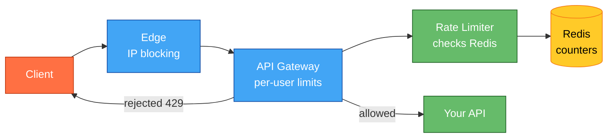

**In 3 sentences:** Every request passes through a rate limiter before reaching your API. The limiter checks a counter in Redis — if under the limit, allow and increment; if over, reject with HTTP 429. Multiple layers (edge + gateway + service) protect different things.

---

## Understanding the Problem

**What is a rate limiter?** When you use an API — say Twitter or Stripe — you can only make a certain number of requests per minute. Go over the limit and you get a "429 Too Many Requests" error. That's a rate limiter.

**Why do we need it?**
- **Protect servers** — one angry client sending 1M requests shouldn't crash the service for everyone
- **Fair usage** — free-tier users get 100 calls/min, paid users get 10000
- **Cost control** — downstream services (databases, third-party APIs) have their own limits
- **Security** — stop brute-force login attempts, credential stuffing, DDoS

**Real examples:**
- GitHub API: 5000 requests/hour per authenticated user
- Stripe API: 100 requests/sec per account
- Twitter API: 300 tweets/3 hours per user

---

## Naive First Cut

The simplest possible rate limiter:

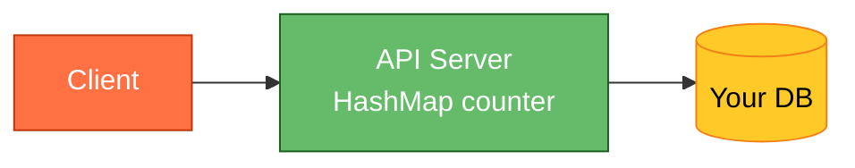

Keep a `HashMap<userId, requestCount>` inside the API server. On each request: if count < limit → allow, else → reject.

**Why this breaks:**

- ❌ **Multiple servers** — you have 10 API pods. Each has its own counter. Client hits different pods and effectively gets 10× the limit.
- ❌ **Server restart** — counters vanish. Everyone gets a fresh quota after every deploy.
- ❌ **Memory** — 10 million unique users = 10 million map entries = OOM risk.
- ❌ **Window boundaries** — client sends 100 requests at 11:59:59, another 100 at 12:00:01. Both windows allow it, but 200 requests arrive in 2 seconds.

---

## The Solution: Shared Counter in Redis

**New components we need:**

1. **Multiple API Pods** — your application servers running behind a load balancer. Requests hit any of them randomly.
2. **Redis (shared counters)** — a single, blazing-fast in-memory database that ALL pods talk to. It holds the rate-limit counters so every pod sees the same global count.

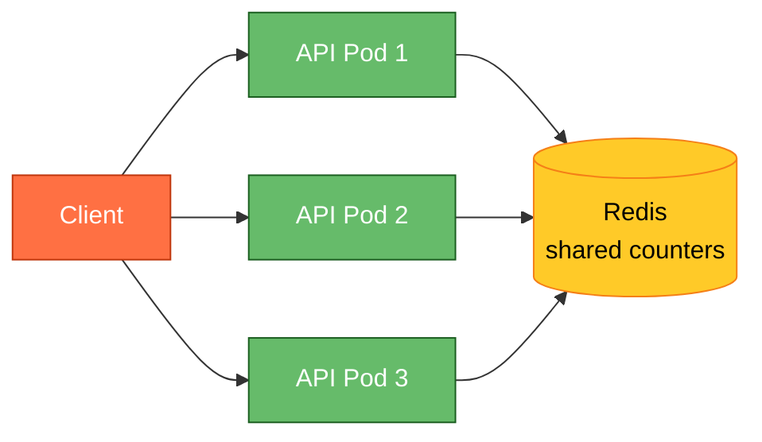

All pods check the SAME counter in Redis. Doesn't matter which pod handles the request — the global count is always accurate.

> 💡 **What is Redis?** An in-memory database that responds in under 1 millisecond. Perfect for counters because it's fast enough to check on every single request without slowing down your API.

---

## Rate Limiting Algorithms

There are 4 main approaches. You need to know all 4 for interviews, but **Token Bucket** is the most common in production.

### Algorithm 1: Fixed Window

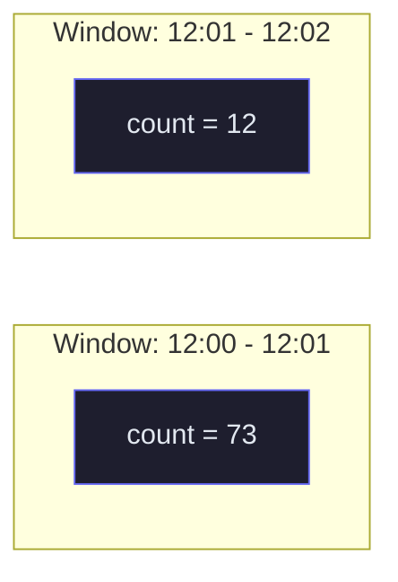

- Divide time into fixed 1-minute windows.
- One counter per window. At window boundary → reset to 0.
- **Redis key:** `rate:{userId}:{minute_number}` with 60-second TTL.
- ✅ Simple. One `INCR` command.
- ❌ **Boundary burst problem:** 100 requests at 11:59:59 + 100 at 12:00:00 = 200 in 2 seconds.

### Algorithm 2: Sliding Window (approximate)

Instead of hard window boundaries, use a weighted combination:

```
estimated_count = current_window_count + previous_window_count × overlap_ratio
```

**Example:** At 12:00:45 (45 seconds into the new window):
- Current window (12:00-12:01): 30 requests
- Previous window (11:59-12:00): 80 requests
- Overlap: 15 seconds remaining of old window = 15/60 = 25%
- Estimate: 30 + 80 × 0.25 = **50**

✅ Smooth. No boundary bursts. ~1% accuracy.
✅ Only stores 2 counters (current + previous). Same memory as fixed window.
❌ Approximate — could allow 1-2% over the limit.

> 💡 **Cloudflare uses this** for billions of rate-limit checks per day. The 1% inaccuracy is acceptable.

### Algorithm 3: Token Bucket ⭐ (most common)

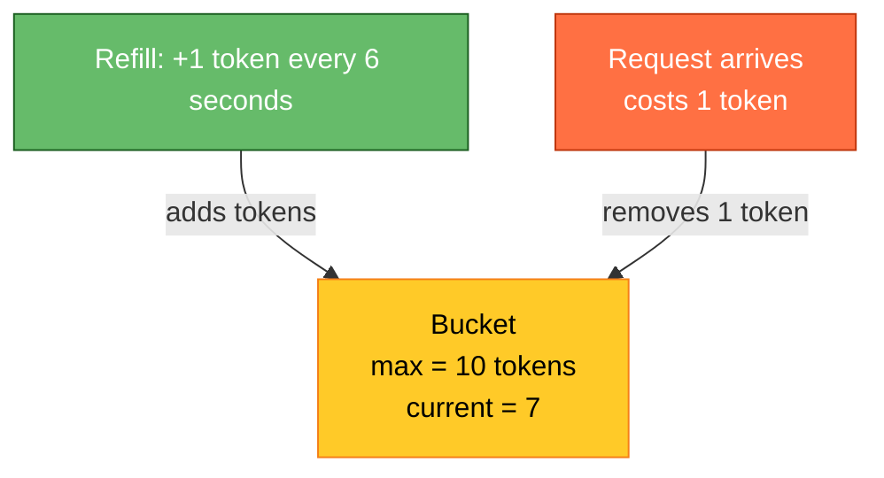

**How it works:**
1. Each user has a "bucket" with a maximum capacity (say 10 tokens).
2. Tokens refill at a steady rate (say 1 token every 6 seconds = 10/minute).
3. Each request costs 1 token.
4. If bucket is empty → reject (429).

**Why it's the best for APIs:**
- ✅ Allows short bursts (bucket can be full = 10 instant requests).
- ✅ But caps sustained rate (only 10 per minute average).
- ✅ Simple Redis implementation: store `{tokens: float, last_refill_time: timestamp}`.

**Redis implementation (pseudocode):**
```
tokens = current_tokens + (now - last_refill) * refill_rate
tokens = min(tokens, max_tokens)   -- cap at bucket size
if tokens >= 1:
    tokens -= 1
    ALLOW
else:
    REJECT (429)
```

> 💡 **Stripe, GitHub, and most production APIs use Token Bucket.** It gives the best UX because it allows natural burst behavior.

### Algorithm 4: Sliding Window Log

- Store the timestamp of EVERY request in a sorted set.
- Count entries within `[now - window, now]`.
- ✅ Perfectly accurate. Zero over-count.
- ❌ Stores every timestamp. 10K requests/min = 10K entries per user. Memory-heavy.
- Used when you need exact precision (billing APIs, credit-based systems).

### Which to pick?

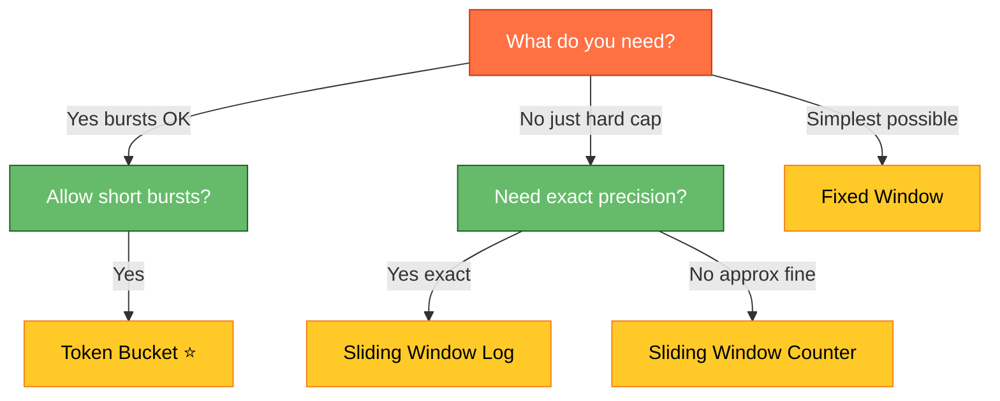

---

## Where to Rate Limit (3 layers)

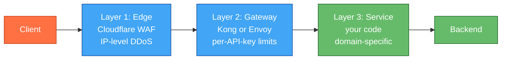

| Layer | What it blocks | Key | Example |
|---|---|---|---|
| **Edge (Cloudflare/WAF)** | DDoS, bots, abusive IPs | IP address | "No IP can send >1000 req/sec" |
| **Gateway (Kong/Envoy)** | Per-user quota enforcement | API key or user ID | "Free tier: 100/min. Paid: 10000/min" |
| **Service level** | Domain-specific limits | Per resource | "Max 5 password reset emails/hour" |

**Why three layers instead of one?** Each layer catches a different class of threat at a different cost. Edge blocks volumetric DDoS attacks before they hit your infrastructure (cheapest, highest volume). Gateway enforces business rules like "free vs paid tier" (requires knowing who the user is). Service-level limits handle domain logic only your code understands ("max 5 password resets per hour"). Skipping layers means you're either blocking too much (service-level can't handle DDoS volume) or too little (edge doesn't know your business rules).

> 💡 **Why multiple layers?** Edge blocks volumetric attacks cheaply (before they hit your servers). Gateway enforces business rules. Service handles logic that only your code understands.

---

## What Happens When Redis Goes Down?

This is a classic interview question. Three options:

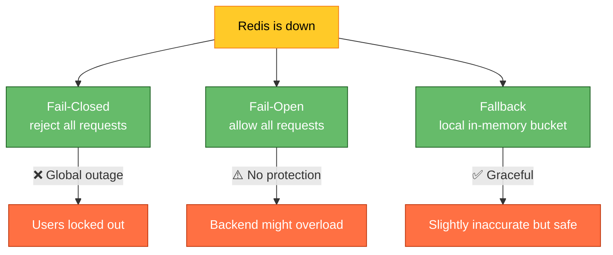

**Best answer for interviews:** "Fail-open with a local fallback. If Redis is unreachable, each pod switches to a local in-memory token bucket. Less accurate (each pod enforces limit/N independently) but the API stays up. Alert on Redis being down so ops investigates."

---

## Complete Flow (Sequence Diagram)

### Request allowed:

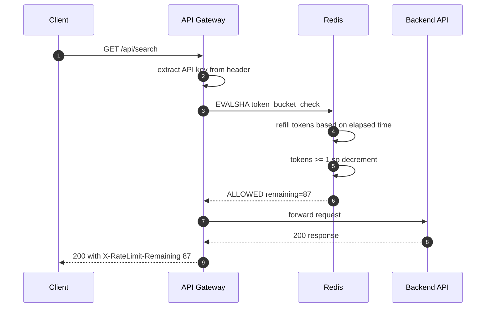

### Request rejected:

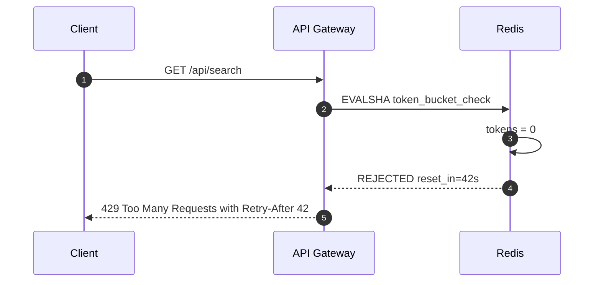

---

## Response Headers

When your API has rate limiting, always return these headers so clients can self-throttle:

```http
HTTP/1.1 200 OK
X-RateLimit-Limit: 100        ← max requests per window
X-RateLimit-Remaining: 87     ← how many left
X-RateLimit-Reset: 1750860060 ← when the window resets (unix timestamp)
```

On rejection:
```http
HTTP/1.1 429 Too Many Requests
Retry-After: 42               ← seconds to wait before retrying
X-RateLimit-Limit: 100
X-RateLimit-Remaining: 0
```

---

## Deep Dive: Distributed Rate Limiting

**Problem:** You have 10 API servers. If each uses its own counter, the total allowed = 10× the limit.

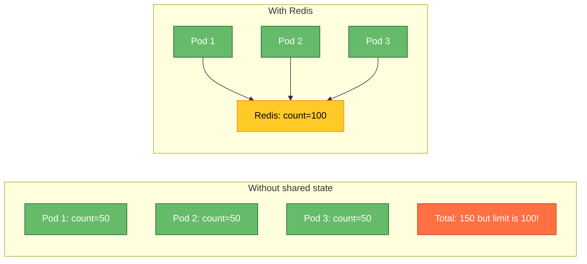

**Three approaches:**

| Approach | How | Trade-off |
|---|---|---|
| **Centralized Redis** | Every request checks Redis | Accurate but adds 0.5-2ms latency per request |
| **Local + periodic sync** | Each pod counts locally, syncs to Redis every 100ms | Fast but can overshoot by ~10% |
| **Sticky routing** | Load balancer always sends same user to same pod | Simple but uneven load distribution |

**Interview answer:** "For protective limits (abuse prevention), local + periodic sync is fine — 10% overshoot is acceptable. For strict limits (billing, credits), always check centralized Redis."

---

## Deep Dive: Handling Burst Traffic

**Problem:** Limit is 100/minute. Client sends all 100 in the first second. Technically within quota, but backend can't handle 100 concurrent requests from one client.

**Solution: Two-tier limiting.**

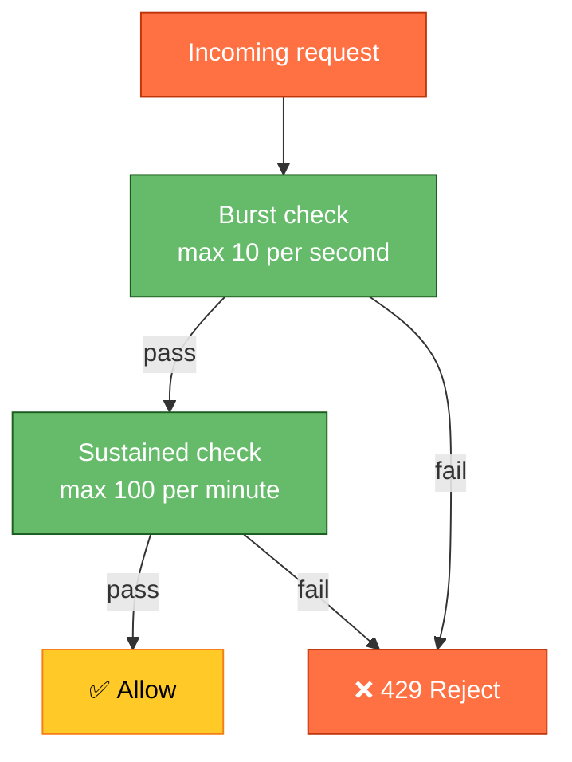

Both limits must pass:
- **Burst:** max 10 requests in any 1-second window
- **Sustained:** max 100 requests in any 60-second window

This is what Stripe does — they publish both a "per-second" and "per-minute" limit.

---

## Final Architecture

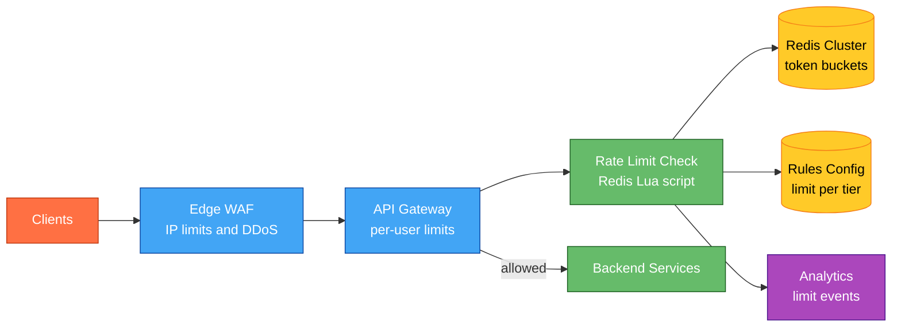

---

## Interview Cheat Sheet

| Question | Answer |
|---|---|
| "Which algorithm?" | Token Bucket — allows bursts, caps sustained rate |
| "Where to store counters?" | Redis — sub-ms latency, atomic Lua, built-in TTL |
| "How to make it atomic?" | Redis Lua script — read + check + decrement in one operation |
| "What if Redis is down?" | Fail-open + local fallback. Never be a single point of failure. |
| "Where to put it?" | 3 layers: Edge (IP/DDoS) → Gateway (per-user) → Service (domain logic) |
| "How to handle distributed?" | Centralized Redis for strict limits; local sync for soft limits |
| "What headers to return?" | X-RateLimit-Limit, X-RateLimit-Remaining, X-RateLimit-Reset, Retry-After |

---

## Key Technologies Mentioned

| Term | What it is |
|---|---|
| **Redis** | An in-memory database. Responds in < 1ms. Used for counters, caches, and fast lookups. |
| **Lua script** | A tiny program that runs INSIDE Redis. Lets you read + check + write atomically in one network call. |
| **API Gateway** | A server that sits in front of your APIs. Handles auth, rate limiting, routing. Examples: Kong, Envoy, AWS API Gateway. |
| **CDN / Edge** | Servers at the "edge" of the network, close to users worldwide. Cloudflare, CloudFront. First line of defense. |
| **Token Bucket** | Algorithm: bucket of tokens, refills at steady rate. Each request costs a token. Empty bucket = rejected. |
| **HTTP 429** | Standard HTTP status code meaning "Too Many Requests." Client should back off and retry later. |

---

*Related: [System Design Fundamentals](/concepts) · [URL Shortener](/URLShortner) · [Chat System](/ChatSystem)*
