# Designing a Rate Limiter

⚡ **Difficulty:** Beginner-Intermediate
📋 **Prerequisites:** [Fundamentals](/concepts) - especially [Caching](/concepts#caching) and [Message Queues](/concepts#message-queues)

---

## TL;DR

A rate limiter blocks users who send too many requests. It protects your servers from being overwhelmed.

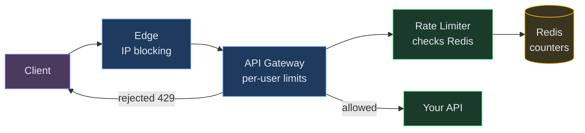

**In 3 sentences:** Every request passes through a rate limiter before reaching your API. The limiter checks a counter in Redis - if under the limit, allow and increment; if over, reject with HTTP 429. Multiple layers (edge + gateway + service) protect different things.

---

## Understanding the Problem

**What is a rate limiter?** When you use an API - say Twitter or Stripe - you can only make a certain number of requests per minute. Go over the limit and you get a "429 Too Many Requests" error. That's a rate limiter.

**Why do we need it?**
- **Protect servers** - one angry client sending 1M requests shouldn't crash the service for everyone
- **Fair usage** - free-tier users get 100 calls/min, paid users get 10000
- **Cost control** - downstream services (databases, third-party APIs) have their own limits
- **Security** - stop brute-force login attempts, credential stuffing, DDoS

**Real examples:**
- GitHub API: 5000 requests/hour per authenticated user
- Stripe API: 100 requests/sec per account
- Twitter API: 300 tweets/3 hours per user

---

## Prior Art We're Drawing From

- **Stripe Rate Limiting** - Uses token bucket with Redis Lua scripts. Publishes rate limit headers (X-RateLimit-Limit, Remaining, Reset) as the API industry standard. ([Stripe Engineering blog](https://stripe.com/blog/rate-limiters))
- **Cloudflare Rate Limiting** - Processes 45M+ HTTP requests/sec. Uses sliding window counters at the edge for IP-level limits, with per-customer limits at the application layer. ([Cloudflare blog](https://blog.cloudflare.com/counting-things-a-lot-of-different-things/))
- **Kong Gateway** - Open-source API gateway with pluggable rate limiting (local, Redis-backed, or cluster-wide). Shows the three-tier pattern: edge → gateway → service. ([Kong rate limiting plugin](https://docs.konghq.com/hub/kong-inc/rate-limiting/))
- **Google Cloud Armor** - Demonstrates adaptive rate limiting that adjusts thresholds based on request patterns rather than fixed rules. ([Google Cloud docs](https://cloud.google.com/armor/docs/rate-limiting-overview))

## Scale Estimation (Back-of-Envelope)

- **Users:** Millions of API clients (both internal services and external developers)
- **Write QPS:** 1M rate-limit checks/sec (every API request triggers a counter check)
- **Read QPS:** Same as write - each check is a read-modify-write on the counter
- **Storage:** ~10GB counter storage in Redis (key per client per window, short TTL)
- **Bandwidth:** Sub-ms latency per check - rate limiter must not become the bottleneck

---

## Functional Requirements

### Core

1. **Limit requests per client** - enforce a max number of requests per time window (e.g., 100 requests/minute per user)
2. **Return clear feedback** - rejected requests get HTTP 429 with headers showing limit, remaining quota, and reset time
3. **Support multiple granularities** - limit by user ID, API key, IP address, or endpoint

### Below the Line

- Adaptive limits (auto-adjust based on system load)
- Per-endpoint weighting (expensive operations cost more tokens)
- Allowlists/blocklists
- Rate limit dashboard for API consumers

---

## Core Entities

- **Rule** - defines a limit: identifier type (user/IP/key), max requests, time window, algorithm
- **Counter** - tracks current usage for a specific client + window combination
- **Window** - the time boundary (fixed 1-min, sliding, or token bucket refill rate)
- **Decision** - the result of a rate check: ALLOW or REJECT, with remaining quota

---

## Naive First Cut

The simplest possible rate limiter:


Keep a `HashMap<userId, requestCount>` inside the API server. On each request: if count < limit → allow, else → reject.

**Why this breaks:**

- ❌ **Multiple servers** - you have 10 API pods. Each has its own counter. Client hits different pods and effectively gets 10× the limit.
- ❌ **Server restart** - counters vanish. Everyone gets a fresh quota after every deploy.
- ❌ **Memory** - 10 million unique users = 10 million map entries = OOM risk.
- ❌ **Window boundaries** - client sends 100 requests at 11:59:59, another 100 at 12:00:01. Both windows allow it, but 200 requests arrive in 2 seconds.

---

## The Solution: Shared Counter in Redis

**New components we need:**

1. **Multiple API Pods** - your application servers running behind a load balancer. Requests hit any of them randomly.
2. **Redis (shared counters)** - a single, blazing-fast in-memory database that ALL pods talk to. It holds the rate-limit counters so every pod sees the same global count.

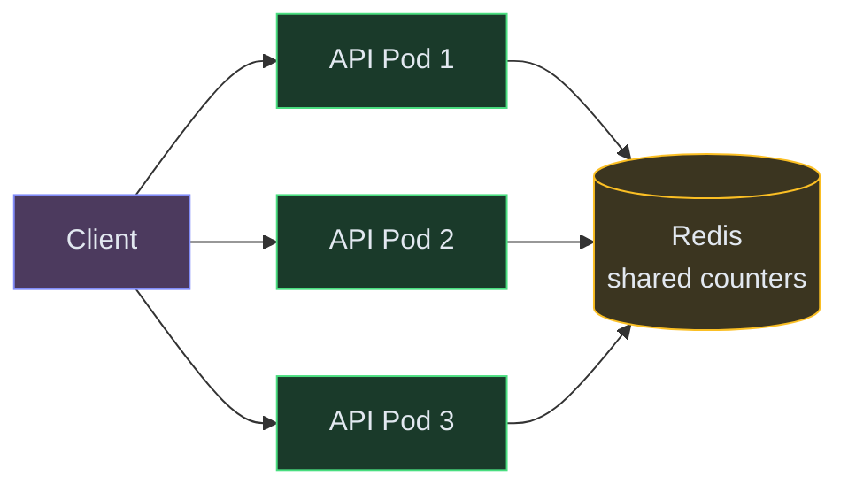

All pods check the SAME counter in Redis. Doesn't matter which pod handles the request - the global count is always accurate.

><br>💡 **What is Redis?** An in-memory database that responds in under 1 millisecond. Perfect for counters because it's fast enough to check on every single request without slowing down your API.

---

## Rate Limiting Algorithms

There are 5 main approaches. You need to know all of them for interviews, but **Token Bucket** and **Sliding Window Counter** are the most common in production.

---

### Algorithm 1: Fixed Window Counter

**How it works:**
Divide time into fixed intervals (e.g., every 60 seconds). Maintain one counter per user per window. Each request increments the counter. If counter exceeds the limit → reject. At window boundary → counter resets to 0.

**Example with numbers:**
- Limit: 100 requests per minute
- Window: 12:00:00 – 12:00:59
- User sends request #73 at 12:00:45 → counter = 73 → ✅ ALLOW
- User sends request #101 at 12:00:58 → counter = 101 → ❌ REJECT (429)
- Clock hits 12:01:00 → counter resets to 0

**Redis implementation:**
```
key = "rate:{userId}:{minute_number}"
count = INCR key
if count == 1: EXPIRE key 60   ← auto-cleanup
if count > limit: REJECT
else: ALLOW
```

**The boundary burst problem:**
- User sends 100 requests at 12:00:58 (end of window 1) → allowed
- User sends 100 requests at 12:01:01 (start of window 2) → allowed
- Result: 200 requests in 3 seconds, but technically "within limits" in both windows

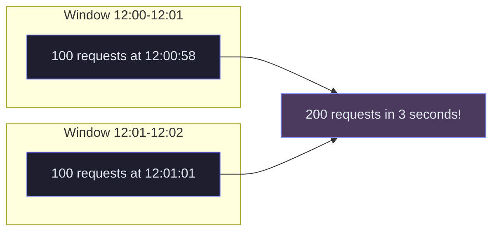

| Pros | Cons |
|---|---|
| ✅ Dead simple - one INCR + one EXPIRE | ❌ Boundary burst allows 2× the limit |
| ✅ Minimal memory - 1 counter per user | ❌ Not accurate for tight limits |
| ✅ O(1) per request | ❌ Resets abruptly |

**Used by:** GitHub API (60/hour for unauthenticated), Twitter/X (15-minute fixed windows), Slack API.

---

### Algorithm 2: Sliding Window Log

**How it works:**
Store the exact timestamp of EVERY request in a sorted list (Redis Sorted Set). When a new request arrives:
1. Remove all entries older than `now - window_size`
2. Count remaining entries
3. If count < limit → allow and add new timestamp; else → reject

**Example with numbers:**
- Limit: 5 requests per 60 seconds
- Current time: 12:01:30
- Stored timestamps: `[12:00:25, 12:00:45, 12:01:05, 12:01:20, 12:01:28]`
- Purge entries before 12:00:30 → removes `12:00:25`
- Remaining count: 4
- 4 < 5 → ✅ ALLOW, add `12:01:30` to the set

**Redis implementation:**
```
key = "rate:{userId}"
now = current_timestamp_ms

ZREMRANGEBYSCORE key 0 (now - window_ms)  ← purge old
count = ZCARD key                          ← count remaining
if count < limit:
    ZADD key now now                       ← log this request
    ALLOW
else:
    REJECT
```

| Pros | Cons |
|---|---|
| ✅ Perfectly accurate - zero boundary burst | ❌ Memory-heavy: stores every timestamp |
| ✅ True rolling window | ❌ 10K req/min limit = 10K entries per user |
| ✅ No approximation | ❌ O(n) cleanup on each request |

**Memory:** For a user with 10,000 requests/hour limit, that is 10,000 timestamps stored per user. At 8 bytes each = 80KB per user. With 1M users = 80GB. Expensive.

**Used by:** Payment/billing systems where exact counts are non-negotiable. Not practical for high-volume public APIs.

---

### Algorithm 3: Sliding Window Counter (Cloudflare's approach)

💡 *This is the "best of both worlds" - accuracy of sliding window + memory of fixed window.*

**How it works:**
Keep TWO counters: one for the current fixed window, one for the previous window. Estimate the rolling count using a weighted formula:

```
estimated_count = current_window_count + (previous_window_count × overlap_percentage)
```

The overlap percentage = how much of the previous window is still "within" our rolling window.

**Example with numbers:**
- Limit: 100 requests per minute
- Current time: 12:01:45 (we're 45 seconds into the current window)
- Previous window (12:00–12:01): 80 requests
- Current window (12:01–12:02): 30 requests so far
- Overlap: we're 45s into the new window, so 15s of the old window still counts = 15/60 = 25%
- Estimated count: 30 + (80 × 0.25) = 30 + 20 = **50** → under 100 → ✅ ALLOW

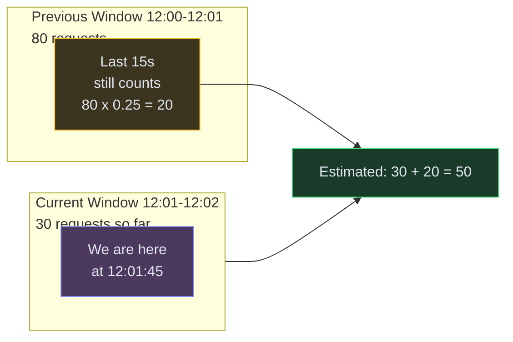

**Redis implementation:**
```
prev_key = "rate:{userId}:{prev_minute}"
curr_key = "rate:{userId}:{curr_minute}"
elapsed = seconds_into_current_window
weight = (window_size - elapsed) / window_size

estimated = GET curr_key + GET prev_key × weight
if estimated < limit:
    INCR curr_key
    ALLOW
else:
    REJECT
```

| Pros | Cons |
|---|---|
| ✅ Smooth - no boundary bursts | ❌ Approximate (~0.003% error rate) |
| ✅ O(1) memory - just 2 counters per user | ❌ Slightly more logic than fixed window |
| ✅ Cloudflare tested: 400M requests, 0.003% error | |

**Memory:** Same as fixed window - 2 integers per user. At 1M users: ~16MB. Negligible.

**Used by:** Cloudflare (45M+ req/sec), most modern REST APIs. The go-to choice when you need accuracy without the memory cost of sliding log.

---

### Algorithm 4: Token Bucket ⭐ (most popular in production)

💡 *Think of a bucket that fills with tokens at a steady rate. Each request costs one token. If the bucket is empty, request is rejected. This allows controlled bursts.*

**How it works:**
1. Each user has a bucket with a maximum capacity (e.g., 10 tokens)
2. Tokens are added at a fixed refill rate (e.g., 1 token every 6 seconds = 10/minute)
3. Each request consumes 1 token
4. If bucket is empty → reject with 429
5. Tokens never exceed max capacity (bucket overflows)

**Example with numbers:**
- Bucket capacity: 10 tokens
- Refill rate: 1 token every 6 seconds (10/minute)
- At 12:00:00 → bucket is full (10 tokens)
- User sends 8 requests instantly → 8 tokens consumed → 2 remaining → all ✅ ALLOWED
- At 12:00:06 → 1 token refilled → bucket = 3
- At 12:00:12 → 1 more token → bucket = 4
- User sends 5 requests → 5 tokens consumed → bucket now has -1? No → 4 used, 1 rejected

**Why bursts are OK here:** The bucket starts full, so a user can "burst" up to 10 requests instantly. But then they must wait for refills. Over time, the average rate converges to the refill rate (10/min). This matches real user behavior - people don't send requests at a perfectly steady rate.

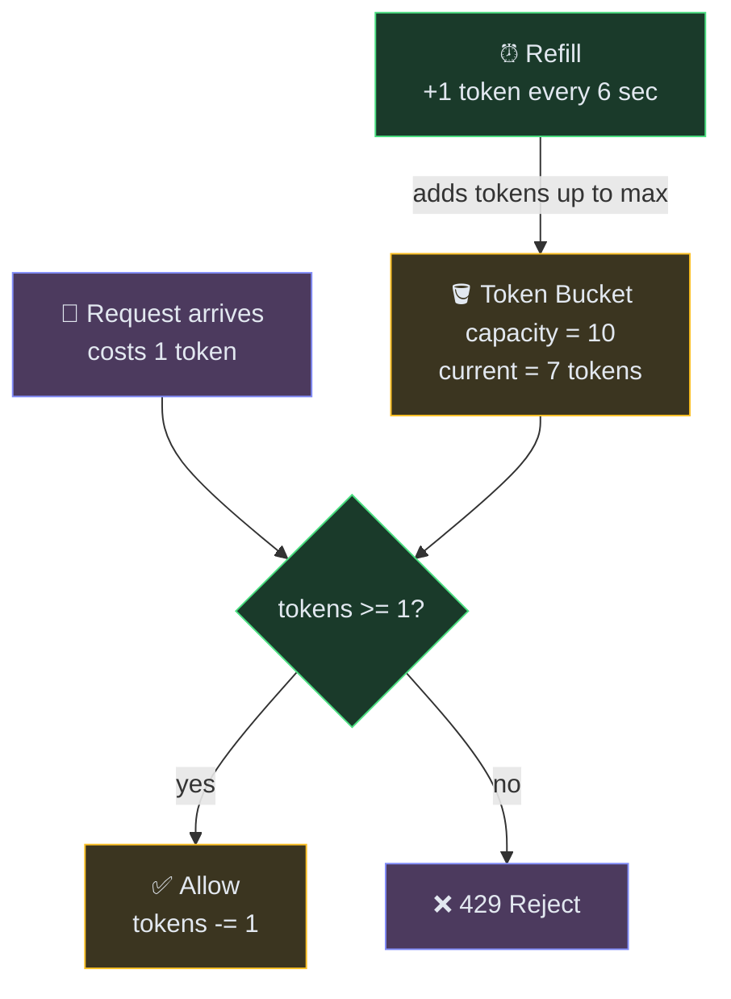

**Redis implementation (lazy refill - no background timer):**
```
key = "bucket:{userId}"
stored = GET key → {tokens: 7, last_refill: 1750000000}

elapsed = now - last_refill
new_tokens = elapsed × refill_rate
tokens = min(capacity, stored.tokens + new_tokens)

if tokens >= 1:
    tokens -= 1
    SET key {tokens, last_refill: now}
    ALLOW
else:
    SET key {tokens, last_refill: now}
    REJECT
```

><br>💡 **Lazy refill:** Instead of a background timer adding tokens, we calculate how many tokens SHOULD have been added since the last request. Same result, zero background processes.

| Pros | Cons |
|---|---|
| ✅ Allows natural burst behavior | ❌ Two values stored per user (tokens + timestamp) |
| ✅ Smooth long-term rate enforcement | ❌ Tuning capacity + refill rate takes thought |
| ✅ Memory efficient - ~50 bytes per user | ❌ In distributed systems, need Redis for sync |
| ✅ Best UX for API consumers | |

**Used by:** Stripe, AWS API Gateway, GitHub, Amazon. The industry default for public APIs.

---

### Algorithm 5: Leaky Bucket

💡 *Like token bucket but inverted: requests go INTO the bucket, and leak out at a constant rate. If the bucket overflows, requests are dropped.*

**How it works:**
1. Incoming requests are added to a queue (the bucket) with a fixed capacity
2. A background worker processes requests from the queue at a constant, steady rate
3. If the queue is full when a new request arrives → drop it (429)

**Think of it as:** Water (requests) pouring into a bucket with a small hole at the bottom. Water drains at a constant rate. If you pour too fast, the bucket overflows and water spills (requests are rejected).

**Example with numbers:**
- Bucket size: 5 requests
- Leak rate: 1 request processed every 200ms (5/sec outflow)
- 10 requests arrive simultaneously
- First 5 fill the bucket → queued
- Next 5 → bucket full → ❌ REJECTED
- Over the next second, the 5 queued requests are processed one every 200ms

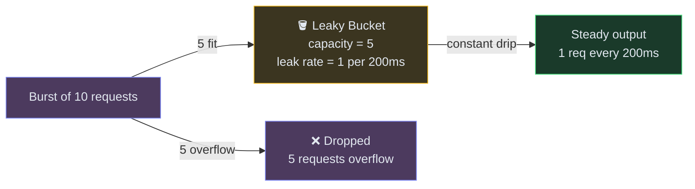

**Key difference from Token Bucket:**
- **Token Bucket:** controls how many requests a user can SEND (input shaping)
- **Leaky Bucket:** controls how fast requests are PROCESSED (output shaping)

Token Bucket allows bursts; Leaky Bucket smooths everything to a constant output rate.

| Pros | Cons |
|---|---|
| ✅ Perfectly smooth output - protects backends | ❌ No burst tolerance - strict constant rate |
| ✅ Prevents downstream overload | ❌ Adds latency (requests wait in queue) |
| ✅ Simple FIFO queue implementation | ❌ Old requests processed before new ones |

**Used by:** Shopify REST API (40 bucket size, 2/sec leak rate), Netflix (streaming traffic shaping). Best for protecting downstream services that can't handle spikes.

---

### Comparison Table

| Algorithm | Memory per user | Burst handling | Accuracy | Best for |
|---|---|---|---|---|
| **Fixed Window** | ~8 bytes (1 counter) | ❌ 2× burst at boundaries | Low | Simple internal APIs, MVPs |
| **Sliding Window Log** | O(n) - 80KB+ at scale | ✅ None (perfect) | Perfect | Billing, payment systems |
| **Sliding Window Counter** | ~16 bytes (2 counters) | ✅ Smooth | ~99.99% | Most public REST APIs |
| **Token Bucket** ⭐ | ~50 bytes (token + timestamp) | ✅ Controlled bursts | High | User-facing APIs (Stripe, AWS) |
| **Leaky Bucket** | ~50 bytes or 1KB (queue) | ❌ None (smooths all) | High | Traffic shaping, backend protection |

### Decision flowchart:

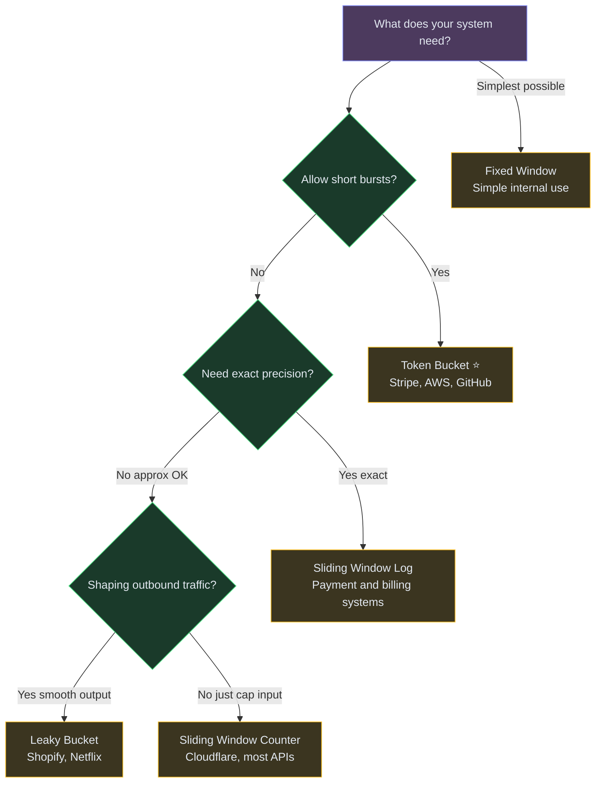

><br>💡 **Interview tip:** Start with Token Bucket as your default answer. If the interviewer asks "what if we can't tolerate any burst?" → switch to Sliding Window Counter. If they ask "what if we need to protect a fragile downstream?" → Leaky Bucket.

---

## Where to Rate Limit (3 layers)

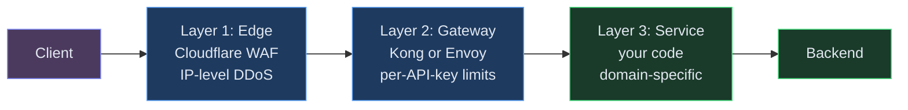

| Layer | What it blocks | Key | Example |
|---|---|---|---|
| **Edge (Cloudflare/WAF)** | DDoS, bots, abusive IPs | IP address | "No IP can send >1000 req/sec" |
| **Gateway (Kong/Envoy)** | Per-user quota enforcement | API key or user ID | "Free tier: 100/min. Paid: 10000/min" |
| **Service level** | Domain-specific limits | Per resource | "Max 5 password reset emails/hour" |

**Why three layers instead of one?** Each layer catches a different class of threat at a different cost. Edge blocks volumetric DDoS attacks before they hit your infrastructure (cheapest, highest volume). Gateway enforces business rules like "free vs paid tier" (requires knowing who the user is). Service-level limits handle domain logic only your code understands ("max 5 password resets per hour"). Skipping layers means you're either blocking too much (service-level can't handle DDoS volume) or too little (edge doesn't know your business rules).

><br>💡 **Why multiple layers?** Edge blocks volumetric attacks cheaply (before they hit your servers). Gateway enforces business rules. Service handles logic that only your code understands.

---

## What Happens When Redis Goes Down?

This is a classic interview question. Three options:

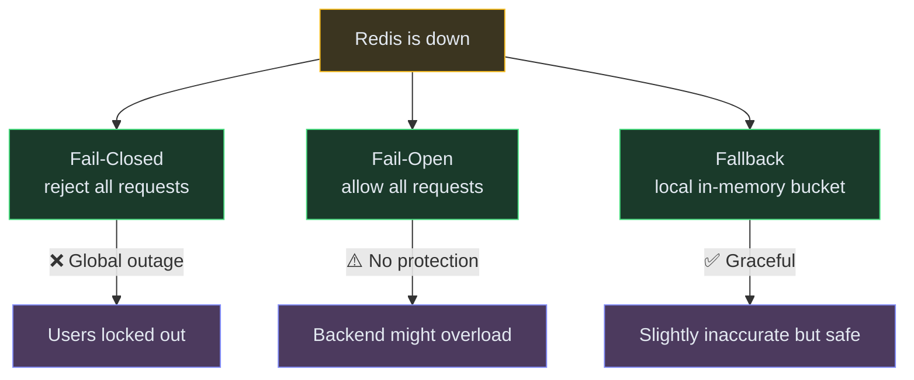

**Best answer for interviews:** "Fail-open with a local fallback. If Redis is unreachable, each pod switches to a local in-memory token bucket. Less accurate (each pod enforces limit/N independently) but the API stays up. Alert on Redis being down so ops investigates."

---

## Complete Flow (Sequence Diagram)

### Request allowed:

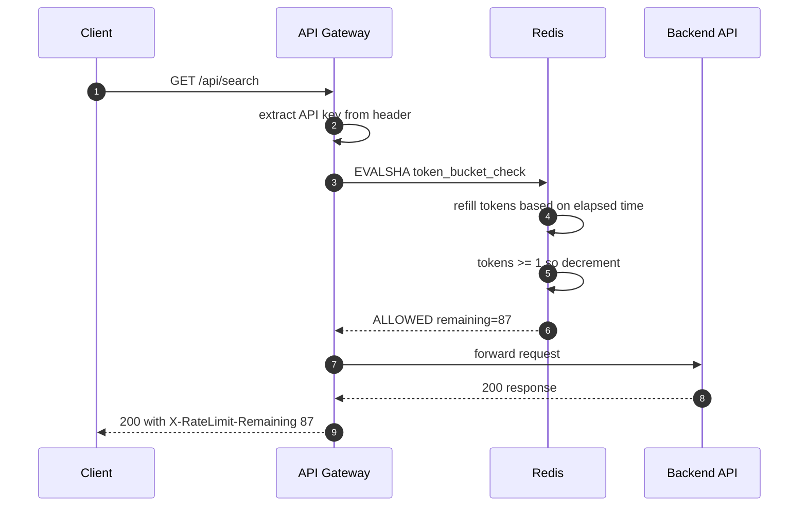

### Request rejected:

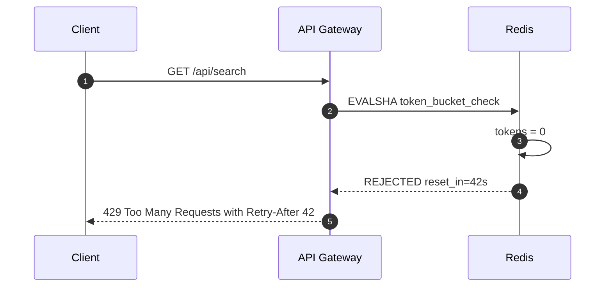

---

## Response Headers

When your API has rate limiting, always return these headers so clients can self-throttle:

```http
HTTP/1.1 200 OK
X-RateLimit-Limit: 100        ← max requests per window
X-RateLimit-Remaining: 87     ← how many left
X-RateLimit-Reset: 1750860060 ← when the window resets (unix timestamp)
```

On rejection:
```http
HTTP/1.1 429 Too Many Requests
Retry-After: 42               ← seconds to wait before retrying
X-RateLimit-Limit: 100
X-RateLimit-Remaining: 0
```

---

## Deep Dive: Distributed Rate Limiting

**Problem:** You have 10 API servers. If each uses its own counter, the total allowed = 10× the limit.

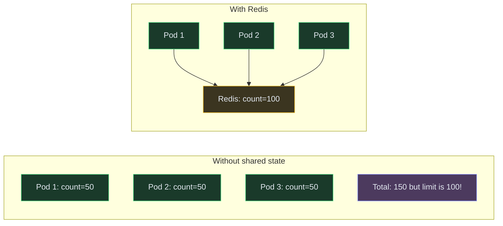

**Three approaches:**

| Approach | How | Trade-off |
|---|---|---|
| **Centralized Redis** | Every request checks Redis | Accurate but adds 0.5-2ms latency per request |
| **Local + periodic sync** | Each pod counts locally, syncs to Redis every 100ms | Fast but can overshoot by ~10% |
| **Sticky routing** | Load balancer always sends same user to same pod | Simple but uneven load distribution |

**Interview answer:** "For protective limits (abuse prevention), local + periodic sync is fine - 10% overshoot is acceptable. For strict limits (billing, credits), always check centralized Redis."

---

## Deep Dive: Handling Burst Traffic

**Problem:** Limit is 100/minute. Client sends all 100 in the first second. Technically within quota, but backend can't handle 100 concurrent requests from one client.

**Solution: Two-tier limiting.**

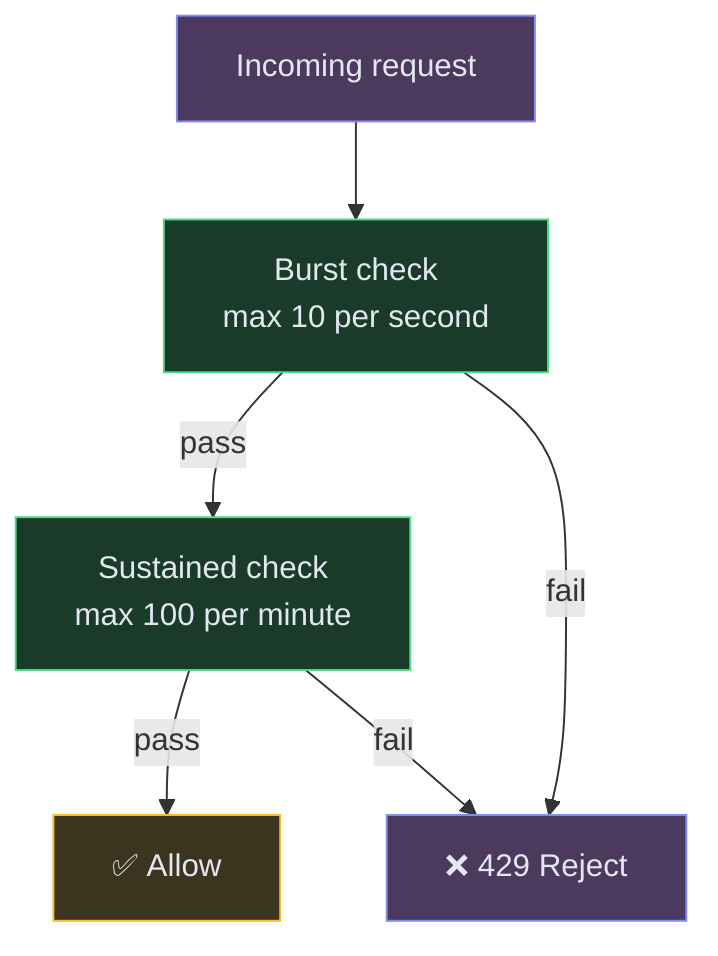

Both limits must pass:
- **Burst:** max 10 requests in any 1-second window
- **Sustained:** max 100 requests in any 60-second window

This is what Stripe does - they publish both a "per-second" and "per-minute" limit.

---

## Final Architecture

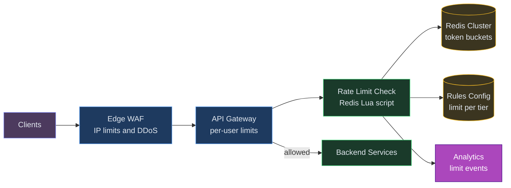

---

## Interview Cheat Sheet

| Question | Answer |
|---|---|
| "Which algorithm?" | Token Bucket - allows bursts, caps sustained rate |
| "Where to store counters?" | Redis - sub-ms latency, atomic Lua, built-in TTL |
| "How to make it atomic?" | Redis Lua script - read + check + decrement in one operation |
| "What if Redis is down?" | Fail-open + local fallback. Never be a single point of failure. |
| "Where to put it?" | 3 layers: Edge (IP/DDoS) → Gateway (per-user) → Service (domain logic) |
| "How to handle distributed?" | Centralized Redis for strict limits; local sync for soft limits |
| "What headers to return?" | X-RateLimit-Limit, X-RateLimit-Remaining, X-RateLimit-Reset, Retry-After |

---

## Key Technologies Mentioned

| Term | What it is |
|---|---|
| **Redis** | An in-memory database. Responds in < 1ms. Used for counters, caches, and fast lookups. |
| **Lua script** | A tiny program that runs INSIDE Redis. Lets you read + check + write atomically in one network call. No race conditions between "check count" and "increment count". |
| **API Gateway** | A server that sits in front of your APIs. Handles auth, rate limiting, routing. Examples: Kong, Envoy, AWS API Gateway. |
| **CDN / Edge** | Servers at the "edge" of the network, close to users worldwide. Cloudflare, CloudFront. First line of defense. |
| **Token Bucket** | Algorithm: bucket of tokens, refills at steady rate. Each request costs a token. Empty bucket = rejected. |
| **HTTP 429** | Standard HTTP status code meaning "Too Many Requests." Client should back off and retry later. |

><br>💡 Redis Lua scripts execute atomically on the server - critical for distributed rate limiting where multiple pods check the same counter.

---

## What's Expected at Each Level

> This section helps you calibrate your depth. You don't need to cover everything - just know what's expected for your level.

### Mid-level

Explain the token bucket or fixed window algorithm. Propose Redis INCR for counting requests per time window. Understand why in-memory counters fail across multiple servers - each server has its own count, so a client can exceed limits by hitting different servers.

### Senior

Compare token bucket vs sliding window vs sliding window log - articulate the tradeoffs (burst tolerance, memory, precision). Propose Redis Lua scripts for atomic check-and-increment. Discuss multi-tier limiting (edge + gateway + service) and what happens when Redis goes down (fail-open vs fail-closed tradeoff).

### Staff+

Address distributed rate limiting across multiple regions with eventual consistency (local counters + periodic sync vs centralized Redis). Discuss adaptive rate limits that adjust dynamically based on system load (shed traffic before the backend saturates). Cover per-endpoint granularity (expensive operations like writes get tighter limits than cheap reads) and cost-based limiting where each operation has a "weight" consuming tokens proportionally.

---
## 🎯 Key Takeaways

- **Token bucket** allows bursts; **sliding window** is smoother but more complex
- **Redis Lua scripts** make check-and-increment atomic - no race conditions
- **Apply at multiple levels**: per-user, per-IP, per-endpoint, global
- **Return 429 with Retry-After header** - good API citizenship

---
## Related Designs
- [URL Shortener](/hld/URLShortner) - high-QPS API design
- [Leaderboard](/hld/Leaderboard) - Redis patterns
- [Notification System](/hld/NotificationSystem) - protecting downstream services


---

## Related Concepts

Understand the building blocks used in this design:

- [Rate Limiting →](/concepts/rate-limiting/) — the core algorithms (token bucket, sliding window) this whole design is built on
- [Caching →](/concepts/caching/) — Redis holds the per-client counters for sub-millisecond checks
- [Distributed Locking →](/concepts/distributed-locking/) — atomic check-and-decrement via Lua keeps counts correct across many pods
