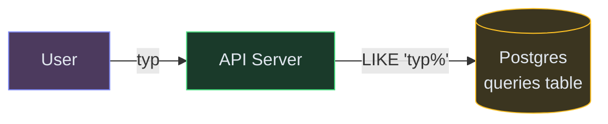
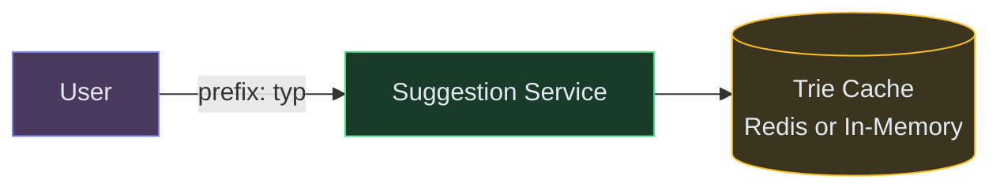

# Designing Search Autocomplete / Typeahead

**Difficulty:** Intermediate
**Prerequisites:**[Caching](/concepts/caching/), [Database Indexing](/concepts/database-indexing/), and [Scalability](/concepts/scalability/)

---

## Understanding the Problem

You're building the autocomplete/typeahead feature for a search engine or e-commerce site. As the user types each character, the system suggests the top 5-10 most relevant completions within 50-100ms. The suggestions are ranked by popularity and must reflect recent trends (if "World Cup" starts trending, it should appear in suggestions within minutes, not days).

Real examples: Google Search suggestions, Amazon product search, YouTube search, Spotify search.

---

## Naive First Cut



On each keystroke, query `SELECT query_text FROM queries WHERE query_text LIKE 'typ%' ORDER BY frequency DESC LIMIT 10`.

Why this breaks:
- `LIKE 'prefix%'` on 1B rows with ORDER BY frequency requires scanning a huge index range and sorting — takes 100ms+ per query
- User types 5 characters = 5 DB queries in 2 seconds — at 100M users typing simultaneously, that's 500M queries/sec hitting the DB
- No ranking decay: a query popular 3 years ago still dominates suggestions even if nobody searches it anymore
- No real-time trending: a breaking news event won't appear in suggestions until a batch job updates frequency counts
- Cold prefix problem: rare prefixes have no suggestions at all

---

## Functional Requirements

### Core (top 3)
1. **Return top suggestions for a prefix** — as user types "typ", return ranked completions like "typescript", "type safety", "typeable keyboard"
2. **Rank by popularity** — most-searched completions rank higher
3. **Reflect trending queries** — if something starts trending, it appears in suggestions within minutes

### Below the Line
- Personalized suggestions (based on user's search history), spell correction, multi-language support, offensive content filtering

---

## Non-Functional Requirements

- **Latency** — suggestions returned within 50ms (each keystroke triggers a request)
- **Scale** — 100K suggestions requests/sec at peak (every active user on every keystroke)
- **Freshness** — trending queries reflected in suggestions within 5 minutes
- **Availability** — 99.99%; degraded suggestions (stale data) is better than no suggestions

---

## Core Entities

- **Query** — a search phrase with an associated popularity score
- **Trie Node** — a node in the prefix tree, each representing a character in the path
- **Suggestion** — a (query, score) pair returned for a given prefix
- **Frequency Counter** — rolling count of how often a query is searched in a time window

---

## API

```text
GET /v1/suggestions?prefix={prefix}&limit=10
  Response: { suggestions: ["typescript tutorial", "type safety", "typeahead design"] }

POST /v1/queries/log
  Body: { query, timestamp }
  Response: 202 Accepted
```

The first endpoint serves suggestions. The second logs completed searches (used to update popularity scores). The log endpoint is fire-and-forget — it doesn't block the user.

---

## High-Level Design

The core data structure is a **Trie (prefix tree)** where each path from root to a node represents a prefix, and each node stores the top-K suggestions for that prefix — pre-computed. Reads are O(length of prefix), not O(total queries).

💡 *Trie: a tree where each edge represents a character. To find suggestions for "typ", traverse root→t→y→p and read the pre-stored top-K list at that node. No scanning required.*

### FR1: Return Top Suggestions for a Prefix



| Color | Layer |
|---|---|
| 🟣 Purple | Clients |
| 🟢 Green | Services |
| 🟡 Yellow | Data stores |

1. User types "typ" → client sends `GET /suggestions?prefix=typ`
2. Suggestion Service looks up the prefix in the Trie Cache
3. Each trie node stores a pre-computed list of top-10 suggestions for that prefix
4. Return the list directly — O(prefix length) lookup, no sorting at query time
5. Response arrives in < 10ms from cache

### FR2: Update Popularity Scores


1. User completes a search → Search Service logs the query to the Message Queue
2. Aggregator Worker batches and counts query frequencies over rolling time windows (last hour, last day, last week)
3. Stores updated frequency counts in the Query Frequency DB
4. This data feeds into the periodic trie rebuild (see next section)

### FR3: Reflect Trending Queries (Trie Rebuild)


1. Trie Builder runs every 5 minutes (background job)
2. Reads the latest frequency data from the DB
3. Rebuilds the trie with updated top-K suggestions at each node
4. Atomically swaps the new trie into the cache (hot swap — no downtime)
5. Trending queries that spike in the last 5-minute window get a boost in the ranking formula

---

## Deep Dives

### Deep Dive 1: Trie Storage — In-Memory vs. Distributed Cache

**Bad — store the trie in a single server's memory.** If that server dies, autocomplete goes down entirely. And a single machine can only hold so much data — at 1B unique queries × average 20 characters, the trie is several GB.

**Good — replicated in-memory trie across multiple servers.** Each Suggestion Service node holds a full copy of the trie in memory. The Trie Builder publishes the new trie to all nodes (push-based). Reads are lightning fast (no network hop for the lookup). Load balancer distributes traffic across replicas.

**Great — same in-memory approach, with sharding by prefix for scale.** Partition the trie: server group A handles prefixes a-m, group B handles n-z. Each group is still replicated for availability. This lets you scale to billions of unique queries while keeping per-node memory manageable. The API layer routes the request to the correct shard based on the first character of the prefix.

### Deep Dive 2: Keeping Suggestions Fresh (Trending Queries)

**Bad — rebuild the trie once a day from batch-computed frequencies.** A breaking news event at 9am doesn't appear in suggestions until the next morning. Users searching for it get no help.

**Good — rebuild every 5 minutes using rolling window aggregation.** The Aggregator Worker maintains counts for the last 1-hour window. The Trie Builder picks up these counts every 5 minutes. Trending queries surface quickly. Use a decay formula: `score = recent_count × 1.0 + daily_count × 0.5 + weekly_count × 0.1` so fresh trends outrank stale popularity.

**Great — same periodic rebuild, with an in-memory "trending overlay."** Maintain a small in-memory structure of the top 100 currently-trending queries (updated every 30 seconds from the queue directly). At query time, merge the trie results with the trending overlay. This gives sub-minute freshness for the hottest queries without rebuilding the entire trie. The next full rebuild incorporates them permanently.

### Deep Dive 3: Reducing Request Volume (Client-Side Optimization)

**Bad — send a request on every single keystroke.** User types 10 characters in 3 seconds = 10 HTTP requests. At 10M concurrent users, that's 100M requests in 3 seconds. Most of these are redundant (user typed fast and only cares about the final prefix).

**Good — client-side debouncing (200ms delay).** Only send the request if the user hasn't typed for 200ms. This cuts requests by 50-70% with minimal perceived latency. Most fast typists only trigger 2-3 requests instead of 10.

**Great — same debouncing, plus client-side prefix caching.** When the client gets results for "typ" (10 suggestions), it caches them locally. If the user then types "type", the client filters the cached "typ" results locally first (instant). Only if the local filter yields < 3 results does it make a new server request for "type". This eliminates 60-80% of remaining requests. The browser cache holds the last 50-100 prefix results with a short TTL.

---

## What's Expected at Each Level

| Level | Expectations |
|---|---|
| **Mid** | Trie data structure with pre-computed top-K at each node. Separate the write path (logging queries) from the read path (serving suggestions). Basic caching. Know why SQL LIKE doesn't scale. |
| **Senior** | Periodic trie rebuild with rolling frequency windows. In-memory replicated trie for low latency. Client-side debouncing and prefix caching. Decay formula for freshness. |
| **Staff+** | Trie sharding by prefix range. Trending overlay for sub-minute freshness. Personalization layer (mix user history with global popularity). Offensive content filtering. Multi-language trie with Unicode normalization. |
