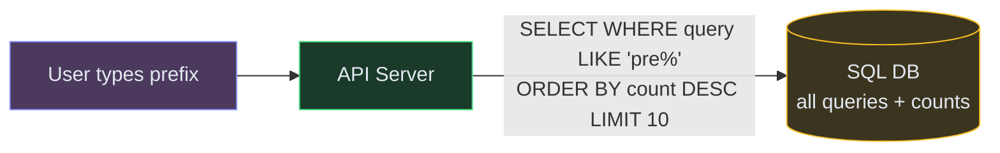
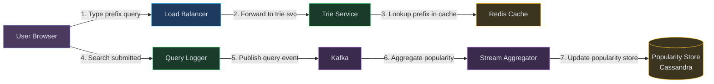
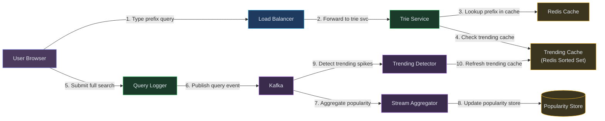
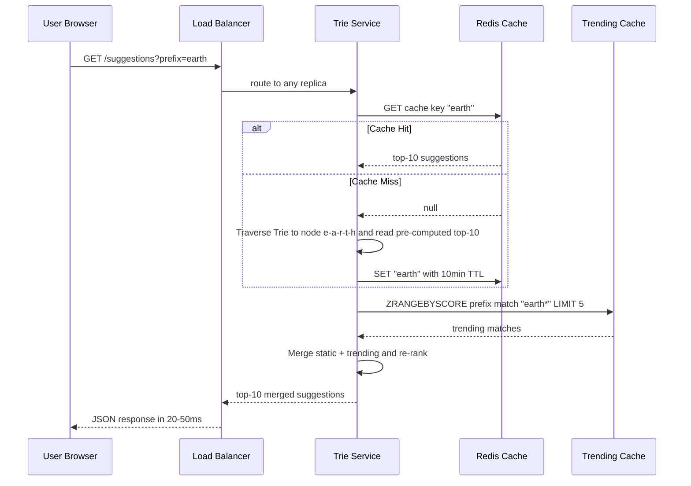
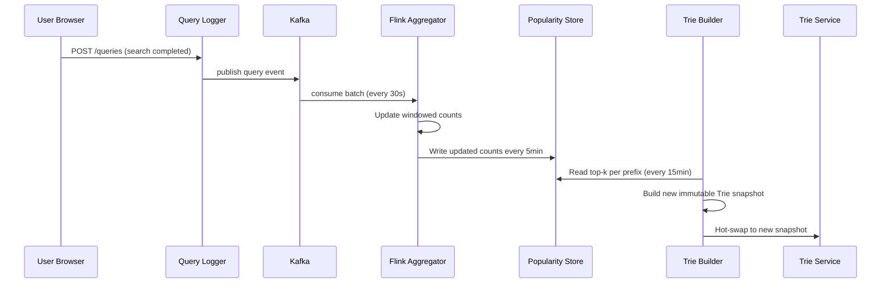
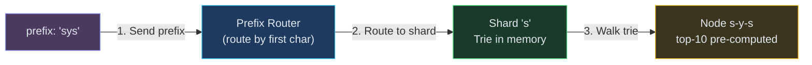
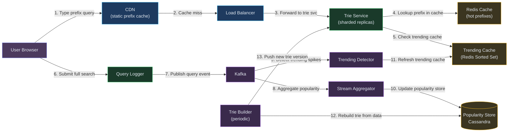

# Designing Search Autocomplete / Typeahead

**Difficulty:** Intermediate **Topics:** Trie, Prefix Matching, Ranking, Caching, Real-time Trending **Asked at:** Google, Amazon, Microsoft, LinkedIn, Uber, Flipkart
**Prerequisites:**[Caching](/concepts/caching/), [Database Indexing](/concepts/database-indexing/), and [Scalability](/concepts/scalability/)

---

## 1. Understanding the Problem

Search autocomplete predicts what a user is about to type and suggests completions in real-time as they press each key. It powers the dropdown under every search bar — Google, Amazon product search, YouTube, LinkedIn people search. The core challenge: return the top-k most relevant suggestions for any prefix in under 100ms, while continuously learning from billions of new queries to keep suggestions fresh and trending-aware.

**Real examples:** Google Search Suggestions, Amazon product typeahead, YouTube search, LinkedIn search, Spotify song search.

---

## 1.5. Naive First Cut



Store every query with its count in a SQL table. On each keystroke, run a LIKE prefix query ordered by count.

**Why this breaks:**

- LIKE 'prefix%' on billions of rows is too slow even with B-tree indexes (full scan for short prefixes like "a")
- A keystroke fires every 50-100ms - SQL can't keep up at millions of concurrent users
- No real-time trending - counts only update in batch, so today's viral topic won't surface for hours
- Single DB becomes the bottleneck - no horizontal scaling for read-heavy prefix lookups
- No personalization - everyone sees the same suggestions regardless of context
- Network round-trip to DB on every keystroke adds unacceptable latency

The rest of the doc evolves this into a Trie-based service with in-memory prefix lookups, async count aggregation, and a caching layer that serves most requests without hitting the data tier.

---

## 1.7. Prior Art We're Drawing From

- **Google Autocomplete** - Uses a combination of query popularity, freshness, and user context. Suggestions update in real-time for trending queries using a streaming pipeline separate from the batch popularity index. ([Google Blog](https://blog.google/products/search/how-google-autocomplete-works-search/))
- **LinkedIn Typeahead** - Built a distributed Trie service called "Galene" that serves prefix-based entity search (people, companies, jobs) with sub-50ms P99. Uses a two-level architecture: coarse-grained sharding by prefix + fine-grained in-memory Tries per shard. ([LinkedIn Engineering](https://engineering.linkedin.com/open-source/cleo-open-source-technology-behind-linkedins-typeahead-search))
- **Facebook Unicorn (Social Graph Search)** - Typeahead over a social graph combines prefix matching with social proximity scoring (friends-of-friends rank higher). The ranking signal isn't just popularity but personalized affinity. ([Facebook Engineering](https://engineering.fb.com/2013/03/06/core-infra/under-the-hood-the-natural-language-interface-of-graph-search/))
- **Elasticsearch Completion Suggester** - Uses FST (Finite State Transducer) data structure internally for prefix lookups with weighted suggestions, serving sub-5ms responses from an in-memory structure. Common choice for product search typeahead.

---

## 2. Technology Choices

| Tier | Purpose | Stores | Access Pattern | Primary Pick | Alternatives |
|---|---|---|---|---|---|
| Prefix index | In-memory prefix lookups | Top-k completions per prefix node | Point lookup by prefix string | Custom distributed Trie service | Elasticsearch Completion Suggester / Redis sorted sets |
| Query log store | Raw query event stream | Every search query with timestamp | Append-only writes | Kafka / Kinesis | Pulsar / Redpanda |
| Aggregation | Count queries over time windows | Query frequency per time bucket | Streaming aggregation | Flink / Kafka Streams | Spark Structured Streaming |
| Popularity store | Aggregated query counts | query -> count + trend score | Batch read for Trie rebuild | Cassandra / DynamoDB | Postgres (if scale is moderate) |
| Cache | Hot prefix results | prefix -> top-10 suggestions | Key-value lookup | Redis / Memcached | Cloudflare Workers KV |
| Analytics DB | Historical query analytics | Long-term query logs | OLAP queries | ClickHouse / BigQuery | Redshift / Snowflake |

**Why a custom Trie over Elasticsearch?** For pure prefix completion at massive scale (100K+ QPS), an in-memory Trie with pre-computed top-k at each node is 10-50x faster than ES Completion Suggester because it avoids serialization and network hops. ES is the right call if you also need fuzzy matching, typo correction, and faceted search alongside autocomplete.

---

## 3. Functional Requirements

### Core (Top 3)

1. **Return top-k suggestions for a prefix** - as the user types each character, return the 10 most relevant completions in under 100ms
2. **Rank by popularity and freshness** - suggestions reflect both historical popularity and real-time trending queries
3. **Update suggestions with new queries** - when users search for something new (a breaking event, a new product), it should appear in suggestions within minutes, not hours

### Below the Line

- Personalized suggestions (based on user history)
- Spell correction / fuzzy matching
- Multi-language support
- Offensive content filtering
- Category-aware suggestions (products vs pages vs people)

---

## 4. Non-Functional Requirements

### Core

- **Low latency:** P99 < 100ms (users expect instant response on each keystroke)
- **High availability:** 99.99% - autocomplete is on the critical search path
- **Scale:** 100K+ prefix lookups per second; 10B+ queries/day feeding the popularity model
- **Freshness:** Trending queries surface within 5-15 minutes

### Below the Line

- Eventual consistency is acceptable (a few minutes stale is fine)
- Multi-region serving (CDN-friendly for static prefix results)
- Graceful degradation under load (return cached stale results rather than fail)

---

## 5. Core Entities

- **Query** - a search string submitted by a user (the raw event)
- **PrefixNode** - a node in the Trie representing a character in a prefix path
- **Suggestion** - a complete query string with its popularity score and metadata
- **TrendingQuery** - a query whose recent velocity exceeds its historical baseline
- **QueryAggregate** - a time-bucketed count for a query string (used for ranking)

---

## 6. API / System Interface

```
GET /v1/suggestions?prefix=<string>&limit=10
Authorization: Bearer <token> (optional - for personalization)

Response:
{
  "prefix": "how to des",
  "suggestions": [
    {"text": "how to design a url shortener", "score": 9842},
    {"text": "how to design distributed systems", "score": 7231},
    {"text": "how to design uber", "score": 6890}
  ],
  "trending": ["how to design ai agents"]
}
```

```
POST /v1/queries (internal - logs a completed search)
Body: {"query": "how to design uber", "userId": "u123", "timestamp": 1720000000}

Response: 202 Accepted
```

Security notes: rate-limit prefix lookups per IP/session to prevent scraping the full suggestion index. Filter offensive and legally restricted terms server-side before returning suggestions.

---

## 7. High-Level Design

### FR1: Return top-k suggestions for a prefix

We need a data structure that can look up any prefix and instantly return the top-k completions. This is the Trie — a tree where each node represents a character, and paths from root to leaves spell out complete queries.


| Color | Meaning |
|---|---|
| Purple | Client |
| Blue | Edge / Load Balancer |
| Green | Application Service |
| Yellow | Data Store |

**New components:**
- **Trie Service:** Holds the entire prefix Trie in memory. Each node stores the top-k completions for that prefix (pre-computed). A lookup is O(L) where L = prefix length — typically 5-20 characters, so effectively O(1).
- **Redis Cache:** Caches the most popular prefix results (the top 1000 prefixes handle ~80% of requests). Avoids hitting the Trie service for hot prefixes.

**Flow:**
1. User types "how" — browser sends GET request to load balancer
2. Load balancer routes to a Trie service instance (any replica works - stateless lookups)
3. Trie service checks Redis cache for prefix "how"
4. Cache hit → return cached top-10 suggestions directly
5. Cache miss → traverse Trie to node "h→o→w", read pre-computed top-10 from that node
6. Store result in Redis with short TTL (5-15 min) and return to user
7. Total latency: 5-20ms (cache hit) or 20-50ms (Trie lookup)

---

### FR2: Rank by popularity and freshness

Before we can rank suggestions, we need to know how popular each query is — and how that popularity is *changing*. This means processing billions of search events into aggregated counts, and detecting when a query's velocity spikes.



| Color | Meaning |
|---|---|
| Purple (nodes) | Async processing |

**New components:**
- **Query Logger:** Lightweight service that captures every completed search query and publishes to the event stream. Fire-and-forget, doesn't affect search latency.
- **Kafka (event stream):** Durably stores the raw query event stream. Decouples ingestion from processing — if Flink falls behind, events queue up safely.
- **Flink Aggregator:** Consumes query events and computes time-windowed counts (last 1 hour, 24 hours, 7 days). Detects trending queries by comparing current velocity against historical baseline.
- **Popularity Store (Cassandra):** Stores the aggregated counts per query. The Trie rebuild job reads from here to determine which completions rank highest.

**Flow:**
1. User completes a search → Query Logger publishes event to Kafka
2. Flink consumes events in micro-batches (every 30 seconds)
3. Flink updates sliding-window counts: `query_counts[query][1h] += 1`
4. Every 5 minutes, Flink writes updated counts to Cassandra
5. A periodic Trie Rebuild job (every 15 min) reads top-k queries per prefix from Cassandra
6. Trie Rebuild produces a new immutable Trie snapshot
7. Trie Service hot-swaps to the new snapshot (zero-downtime reload)

---

### FR3: Update suggestions with new trending queries

When something goes viral (a breaking news event, a product launch), we can't wait 15 minutes for the next Trie rebuild. We need a fast path that injects trending queries into suggestions within minutes.



**New components:**
- **Trending Detector:** A Flink job that specifically watches for velocity spikes. If a query's count in the last 5 minutes exceeds 3x its hourly average, it's marked as trending.
- **Trending Cache (Redis Sorted Set):** Stores currently trending queries with their scores. The Trie Service merges trending results with static Trie results at query time.

**Flow:**
1. A breaking event causes thousands of users to search "earthquake delhi" simultaneously
2. Trending Detector sees the velocity spike within 2-3 minutes
3. Detector writes "earthquake delhi" to the Trending Cache (Redis sorted set by prefix)
4. When a user types "earth", Trie Service fetches static top-10 from Trie AND trending matches from Trending Cache
5. Merges and re-ranks: trending queries get a boost multiplier in the final score
6. User sees "earthquake delhi" in suggestions within 3-5 minutes of the event
7. Trending entries auto-expire (TTL 2-4 hours) — if they persist, the next Trie rebuild incorporates them into the static index

---

## 6.5. Core Flows

### Flow 1: Prefix Lookup (read path)



1. Browser debounces keystrokes (100-150ms) to avoid flooding the server
2. Request hits any Trie Service replica (stateless — all hold the same snapshot)
3. Redis cache absorbs ~80% of traffic for popular prefixes
4. On cache miss, Trie lookup is O(prefix_length) — effectively constant time
5. Trending Cache merge ensures fresh viral queries appear without waiting for rebuild
6. Response includes both static and trending results, clearly labeled

**Non-obvious failure path:** If the Trending Cache (Redis) is down, the Trie Service gracefully degrades — it returns only static Trie results. Suggestions are slightly stale but never unavailable.

---

### Flow 2: Query Ingestion and Count Update (write path)



1. Query Logger is fire-and-forget — doesn't block the search response
2. Kafka provides durability; if Flink lags, events buffer safely
3. Flink maintains in-memory state of windowed counts, flushes periodically
4. Trie Builder runs every 15 minutes, reads aggregated counts, produces a new snapshot
5. Hot-swap means the Trie Service atomically switches pointers — no downtime, no partial state

**Non-obvious failure path:** If Flink crashes mid-window, it replays from Kafka offset (exactly-once semantics via checkpointing). Counts may temporarily lag by one window but never lose data.

---

## 7. Deep Dives

### Deep Dive 1: Trie Data Structure at Scale

**Bad:** Store all queries in a single in-memory Trie on one machine. Works for a dictionary of 1M queries, but with 1B+ unique queries the Trie exceeds available RAM on any single node.

**Good:** Shard the Trie by first 1-2 characters of the prefix. Prefix "a*" goes to shard 1, "b*" to shard 2, etc. Each shard fits in memory (~50-100GB) and handles a subset of traffic. The load balancer routes based on the first character.

**Great:** Pre-compute the top-k suggestions *at each Trie node* during the build phase (not at query time). This means a lookup doesn't need to traverse all children to find the best completions — they're already stored at the prefix node. Combined with sharding, this gives O(L) lookup with zero fan-out. LinkedIn's Cleo system uses this pattern to serve sub-50ms P99 at 100K+ QPS.



---

### Deep Dive 2: Real-time Trending Detection

**Bad:** Recompute all query counts every hour in batch. Breaking events won't surface in suggestions for up to an hour — unacceptable for a product like Google.

**Good:** Sliding window counts in Flink with 5-minute granularity. Compare current-window count against the 24-hour average. If current > 3x average, mark as trending. Latency: ~5 minutes.

**Great:** Use an exponential moving average (EMA) with a decay factor. Each new event updates the EMA incrementally — no windows to maintain, no batch boundaries. A sudden spike causes the EMA to diverge sharply from the long-term average, triggering a trending alert within 1-2 minutes. This is what Twitter uses for Trends detection — it captures velocity, not just volume (so "weather" isn't always trending just because it's always searched).

---

### Deep Dive 3: Caching Strategy and Cache Stampede Prevention

**Bad:** No caching — every keystroke hits the Trie service. Works at low scale but at 100K QPS, even an O(L) lookup per request means high CPU across many shards.

**Good:** Cache the top 10K prefixes in Redis with a 10-minute TTL. ~80% of lookups hit the cache. But when a hot key expires, thousands of requests simultaneously miss and slam the Trie service (cache stampede).

**Great:** Use **probabilistic early expiration** (also called "cache stampede protection"). Each cached entry stores its expiry time. When a request reads a key, if it's within a random window before expiry (e.g., 10-30 seconds before TTL), that request *proactively* refreshes the cache while still returning the stale value. This ensures hot keys never simultaneously expire for many requests. Combine with request coalescing (single-flight) so even if multiple threads miss, only one fetches from the Trie.

---

### Deep Dive 4: Handling Short Prefixes (Hot Partition Problem)

**Bad:** Shard by first character. The prefix "s" gets 10x more traffic than "x" because common words disproportionately start with certain letters. Shard "s" becomes a hot partition.

**Good:** Shard by first 2 characters ("sa", "sb", ..., "sz"). More even distribution, but still some skew.

**Great:** Weighted consistent hashing based on observed traffic per prefix range. Monitor QPS per shard and rebalance by splitting hot ranges. Additionally, replicate the hottest shards (3-5 replicas for "s*" vs 1 for "x*"). The router maintains a routing table that maps prefix ranges to shard replicas, updated by a control plane that monitors load.

---

### Deep Dive 5: Data Collection and Privacy

**Bad:** Log every keystroke with full user identity. Privacy nightmare (GDPR, data retention policies) and generates 10x more data than needed.

**Good:** Only log completed queries (when the user hits Enter or clicks a suggestion). Anonymize after 24 hours by stripping user IDs and keeping only aggregate counts.

**Great:** Differential privacy at the aggregation layer — add calibrated noise to query counts before they're used for ranking. This means no single user's searches can be reverse-engineered from the suggestion rankings, even with access to the popularity store. Apple's approach for emoji suggestions uses local differential privacy (noise added on-device before sending to server).

---

## 7.5. Design Self-Audit

- **Dedicated search index?** The Trie IS the search index — purpose-built for prefix lookups. No need for a general-purpose search engine for this specific use case.
- **Stale reads after writes?** Yes — a newly searched query takes 3-15 minutes to appear in suggestions. Acceptable trade-off documented in FR3 (trending path reduces this to 3-5 min for viral queries).
- **Single points of failure?** Trie Service is replicated (multiple shards, each with replicas). Redis Cache has replicas. Kafka is multi-broker. Flink uses checkpointed state. No single-machine SPOF.
- **Dead-letter / reconciliation?** Kafka consumer offset tracking + Flink checkpoints. If processing fails, events replay from last checkpoint. No silent data loss.
- **Cost at scale?** The Trie is in-memory — at 1B unique queries with top-k pre-computed, expect 200-500GB total across shards. At cloud memory pricing (~$10/GB/month), that's $2K-5K/month for the Trie tier. Affordable for any company running a search product at scale.

---

## 8. Final Architecture



**How it works end-to-end (query path):**

1. **User types a prefix** — keystroke sent to CDN (static prefix cache for top queries)
2. **CDN cache miss** — request routed through Load Balancer to the Trie Service (sharded replicas)
3. **Trie Service looks up suggestions** — checks Redis Cache for hot prefixes, falls back to in-memory trie traversal
4. **Trending Cache checked** — Redis Sorted Set injects trending/breaking queries that haven't aged into the main trie yet
5. **Top-K suggestions returned** — ranked by popularity score, served in <50ms

**How it works end-to-end (update path):**

6. **Query Logger captures searches** — every completed search published to Kafka
7. **Stream Aggregator tallies counts** — rolling window aggregation updates Cassandra (Popularity Store)
8. **Trending Detector identifies spikes** — velocity detection flags sudden surges, updates Trending Cache in real-time
9. **Trie Builder rebuilds periodically** — batch job reads Popularity Store, constructs new trie version, swaps into Trie Service (blue-green)
