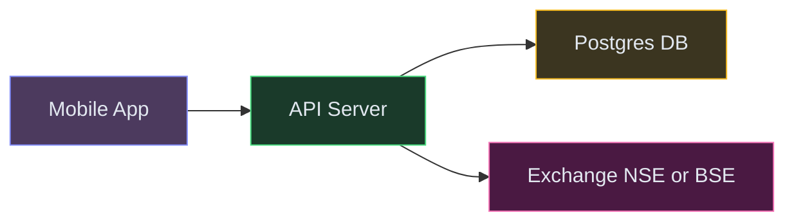
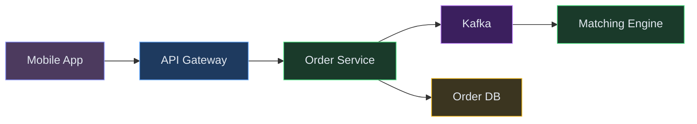
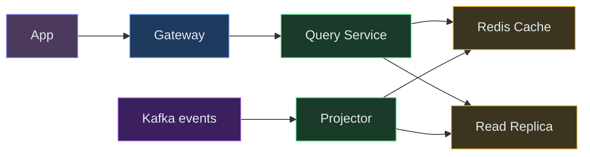
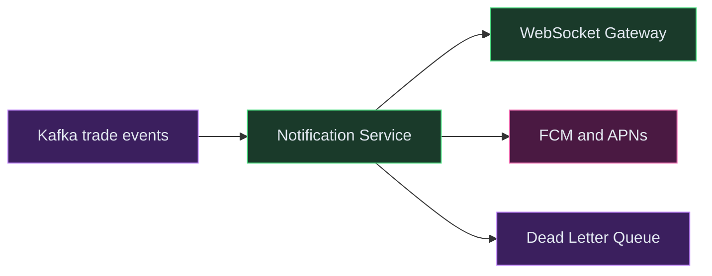
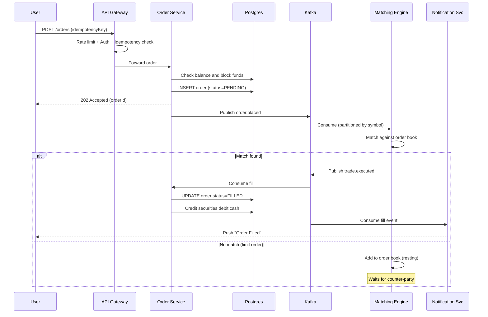
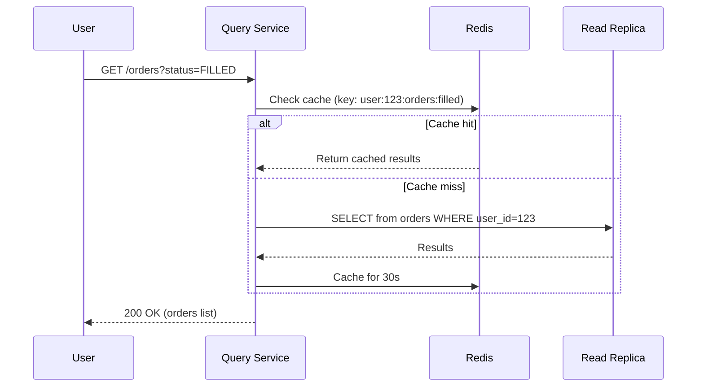
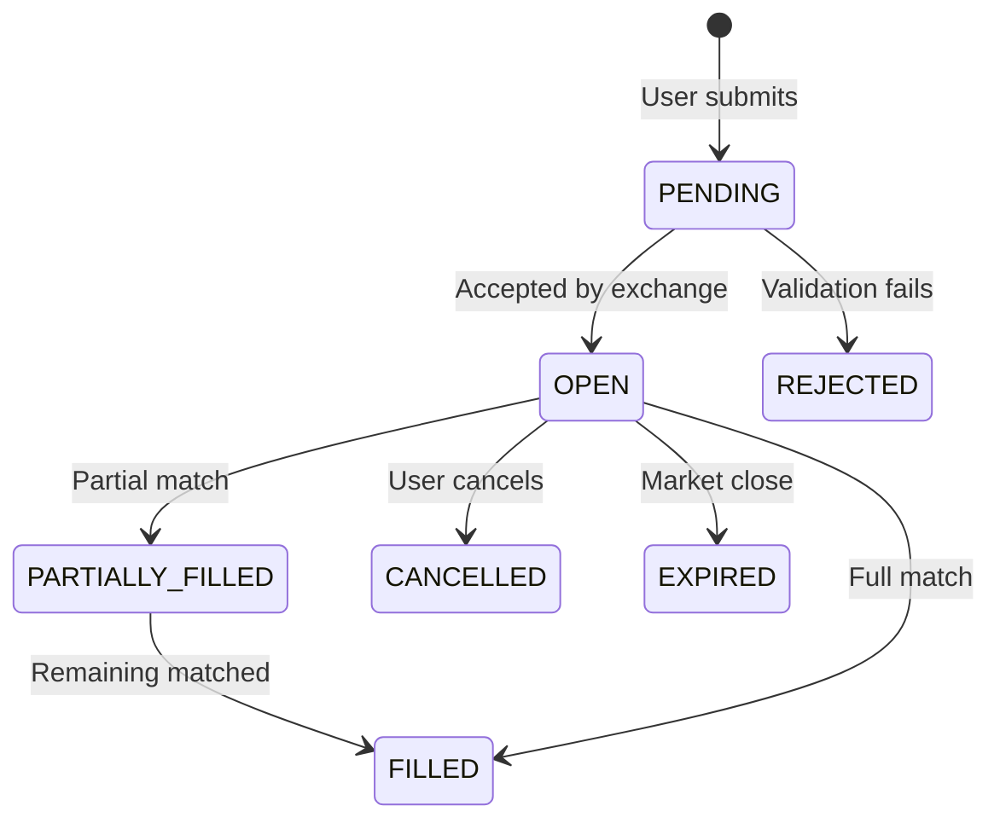
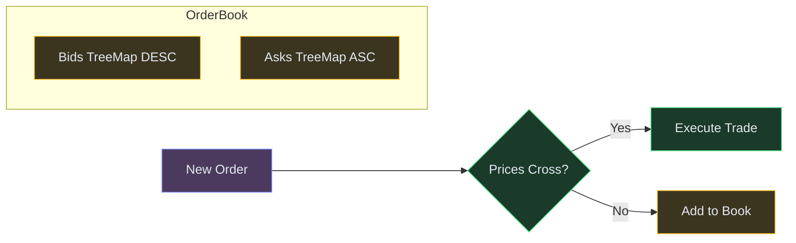
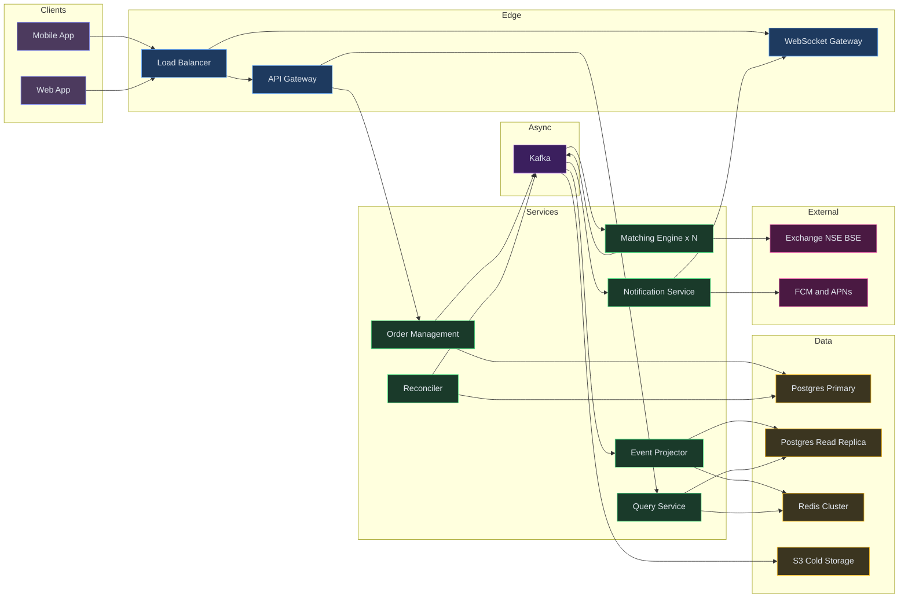

# Designing a Stock Broker Platform (Robinhood / Zerodha)

⚡ **Difficulty:** Advanced 🏷️ **Topics:** Order Matching, Event Sourcing, CQRS, Kafka, Delivery Semantics 🏢 **Asked at:** Robinhood, Zerodha, Groww, Upstox, Goldman Sachs
⏱️ **Reading time:** 21 min

---

## 1. Understanding the Problem

A stock broker platform lets retail users buy and sell financial instruments (stocks, ETFs, options). The broker receives user orders, validates them against account balances and risk rules, routes them to an exchange (or internal matching engine), and shows real-time status updates. The system must handle thousands of concurrent orders during market hours with strong consistency guarantees — a lost or duplicate trade is a regulatory violation.

---

## 1.5. Naive First Cut



**How this breaks:**
- Single API server can't handle 100K+ orders/sec during market open
- Synchronous exchange call blocks the API — timeouts pile up
- No order queue — if exchange is slow, user retries create duplicates
- No way to notify users of fills without polling
- Single DB becomes write bottleneck during peak hours
- No audit trail — regulators require full event history of every order state change

The rest of the doc evolves this into a production-grade event-driven architecture.

---

## 1.7. Prior Art We're Drawing From

- **Zerodha Kite OMS** — Silo-based user partitioning, pre-trade validation at the gateway, async order routing to exchange. Handles millions of orders daily on commodity hardware. ([zerodha.tech blog](https://zerodha.tech/blog/))
- **LMAX Exchange Disruptor** — Single-threaded matching engine processing 6M orders/sec using a lock-free ring buffer. Demonstrates that matching is CPU-bound, not I/O-bound.
- **Coinbase Matching Engine** — Continuous first-come-first-serve order book with price-time priority. Publishes trade events via WebSocket feed. ([Coinbase docs](https://docs.cdp.coinbase.com/exchange/concepts/matching-engine))
- **Kafka + Flink for Exchange** — Event-driven architecture where every state change is a Kafka event; Flink processes matching and settlement in real-time streams. ([Medium article](https://medium.com/@swayam.imo001/how-we-built-a-real-time-stock-exchange-with-an-event-driven-architecture-on-kafka-and-flink-51e5902fdc6c))
- **Robinhood** — Routes orders to market makers (PFOF model) rather than running own matching engine. Emphasizes idempotent order submission and real-time push notifications.

---

## 2. Functional Requirements

### Core (Top 3)

1. **Place and match buy/sell orders** — submit limit/market orders, match based on price-time priority
2. **Show users their transactions** — real-time order status, trade history, portfolio positions
3. **Send notifications** — push notifications on order fills, partial fills, rejections, price alerts

### Below the Line

- Watchlists and price charts (read-heavy, CDN-cacheable)
- Margin trading and short selling
- Options and derivatives
- Admin dashboard and compliance reporting
- Referral and rewards system

---

## 3. Non-Functional Requirements

### Core

| NFR | Target |
|---|---|
| **Latency** | Order placement < 50ms P99 (broker side); matching < 5ms |
| **Throughput** | 100K orders/sec during market open |
| **Consistency** | Exactly-once order execution — no duplicates, no lost fills |
| **Availability** | 99.99% during market hours (09:15 - 15:30 IST) |

### Below the Line

- Audit trail retained for 7 years (regulatory)
- Multi-region DR (but matching engine is single-leader)
- Sub-second portfolio updates after fills

## Scale Estimation (Back-of-Envelope)

- **Users:** 5M DAU, 500K+ concurrent at market open (09:15 IST)
- **Write QPS:** 50K orders/sec peak (80% of daily volume in first 30 minutes of market open)
- **Read QPS:** 100K price updates/sec streaming to clients (5000 symbols × 20 updates/sec each)
- **Storage:** ~2TB trade history/year (10M trades/day × trade + fill + audit event metadata)
- **Bandwidth:** ~3 Gbps at peak (WebSocket price streams + order confirmations to 500K clients)

---

## Technology Choices

| Tier | Purpose | Stores | Access Pattern | Primary | Alternatives |
|---|---|---|---|---|---|
| Order Book (hot) | Active limit orders | Open orders per symbol | Price-time sorted insert/remove | In-memory TreeMap per symbol | Redis Sorted Set, LMAX Disruptor |
| Order DB | Order state and history | All orders ever placed | Write-heavy during market, read for history | Postgres (partitioned by date) | CockroachDB, TiDB |
| Event Bus | Order events stream | Events: placed, matched, filled, rejected | Append-only, partitioned by symbol | Kafka | Redpanda, Kinesis |
| Portfolio Store | User holdings and balances | Positions, cash, P&L | Read-heavy, write on fills | Postgres (CQRS read replica) | DynamoDB, ScyllaDB |
| Notification Queue | Push delivery | Notification payloads | Fan-out per user | Kafka + FCM/APNs | SQS + SNS |
| Cache | Market data, session | Prices, user sessions | High-QPS reads | Redis Cluster | Memcached |
| Object Store | Trade confirmations, reports | PDFs, CSVs | Batch reads | S3 | GCS, MinIO |

**Why Postgres for the order DB, not DynamoDB?**
Orders are relational (order → fills → settlements), need ACID transactions for balance deductions, and regulators require complex queries for audits. Postgres with partitioning by date handles the write volume. The matching engine itself uses in-memory structures — the DB is for persistence, not matching speed.

**Why Kafka, not a simple queue?**
Orders need event replay (for reconciliation), partitioning by symbol (for ordered matching), and multiple consumers (matcher, notifier, portfolio updater, audit logger). Kafka's log-based model fits perfectly.

---

## 4. Core Entities

- **User** — account, KYC status, cash balance, margin
- **Order** — symbol, side (buy/sell), type (market/limit), quantity, price, status, timestamps
- **Trade (Fill)** — matched order pair, execution price, quantity, timestamp
- **Position** — user's holding in a symbol (quantity, avg price)
- **Notification** — type, user, payload, delivery status
- **OrderBook** — per-symbol sorted structure of active limit orders

---

## 5. API / System Interface

```text
POST /api/v1/orders
  Body: { symbol, side: "BUY"|"SELL", type: "MARKET"|"LIMIT", quantity, price?, idempotencyKey }
  Response: { orderId, status: "ACCEPTED", timestamp }
  Auth: JWT Bearer token
  Note: idempotencyKey prevents duplicate submissions on retry

GET /api/v1/orders?status=FILLED&from=2026-01-01&to=2026-06-25&page=1
  Response: { orders: [...], pagination: { total, page, pageSize } }

GET /api/v1/portfolio
  Response: { cash, positions: [{ symbol, quantity, avgPrice, currentPrice, pnl }] }

GET /api/v1/orders/{orderId}
  Response: { order details + fills }

WebSocket /ws/v1/orders
  Pushes: { type: "ORDER_UPDATE", orderId, status, filledQty, ... }
```

---

## 6. High-Level Design

### FR1: Place and Match Orders

The first thing a user does is place a buy or sell order. Let's build the simplest path for that.

**New components we need:**

1. **API Gateway** — Entry point for all requests. Handles auth (JWT), rate limiting, and idempotency checks. Idempotency means: if a user's network drops and they retry, we don't accidentally place the order twice.
2. **Order Management Service (OMS)** — The brain. Validates orders (enough balance? valid symbol? market open?), persists them, and publishes events.
3. **Kafka** — Our event bus.<br>💡 *Kafka is a distributed log where events are appended and consumed by multiple services independently. Think of it as a super-reliable conveyor belt for messages.*
4. **Matching Engine** — Consumes order events and matches buyers with sellers using price-time priority (highest bidder meets lowest seller first).
5. **Order DB (Postgres)** — Stores all orders and their current state. Source of truth.



| Color | Meaning |
|---|---|
| 🟠 Orange | Client |
| 🔵 Blue | Edge / Gateway |
| 🟢 Green | Service |
| 🟣 Purple | Async (Kafka) |
| 🟡 Yellow | Data store |

**Step-by-step flow:**

1. User taps "Buy 10 RELIANCE at ₹2,850" in the app → request hits API Gateway
2. Gateway checks: Is the user authenticated? Has this request been sent before (idempotency key)? Is the user within rate limits?
3. Gateway forwards to OMS. OMS validates: Does the user have enough cash? Is RELIANCE a valid symbol? Is the market open?
4. OMS persists the order in Postgres with status `PENDING` and blocks ₹28,500 from the user's available balance (soft hold — money isn't gone yet, just reserved)
5. OMS publishes an `order.placed` event to Kafka, **partitioned by symbol**
6. User gets back `202 Accepted` with their orderId — they don't wait for matching

**Why Kafka between OMS and Matching Engine?**

The matching engine processes orders one at a time per symbol. If OMS waited for matching synchronously, every order would block. Instead: OMS responds instantly ("accepted"), matching happens async. The user gets notified when their order fills.

**Why partition by symbol?**

All orders for RELIANCE must be matched in strict price-time order. Kafka guarantees ordering within a partition. So we put all RELIANCE orders in one partition → one consumer processes them sequentially → no distributed locks needed.

---

### FR2: Show Users Their Transactions

Once orders are filled, users need to see their transaction history and portfolio. But here's the tension: the write path (order placement) needs to be fast and consistent. The read path (portfolio, history) is 100x more frequent and can tolerate 1-2 seconds of staleness.

This is where we use **CQRS**.<br>💡 *CQRS (Command Query Responsibility Segregation) = separate the system that writes data from the system that reads data. Writes go to the primary DB. Reads go to a separate optimized store (cache + read replica). This lets us scale reads without slowing down writes.*

**New components:**

1. **Event Projector** — A Kafka consumer that listens to `trade.executed` events and updates a read-optimized database.<br>💡 *Think of it as a translator: it takes raw events and builds the "current state" views that users see.*
2. **Query Service** — Serves all read requests (portfolio, order history). Hits cache first, falls back to read replica.
3. **Redis Cache** — Stores hot data (user's current portfolio, recent orders) for sub-10ms reads.
4. **Postgres Read Replica** — A copy of the DB optimized for reads. Doesn't slow down the write path.



**Step-by-step flow:**

1. When a trade executes, the Matching Engine publishes a `trade.executed` event to Kafka
2. The **Projector** consumes this event and does two things: updates the Read Replica (denormalized portfolio view) and invalidates/updates Redis cache
3. When user opens "My Orders" screen, the **Query Service** checks Redis first
4. Cache hit → instant response. Cache miss → query Read Replica → cache the result for 30 seconds
5. Portfolio reflects fills within ~500ms of execution. Users see near-real-time updates without hammering the write DB.

**Why not just read from the main Postgres?**

During market open, the primary DB is handling 100K+ writes/sec. If we also run complex read queries on it (join orders + fills + positions), it'll slow down writes. Separating reads into a replica + cache keeps the write path fast.

---

### FR3: Send Notifications

When a user's order fills, we need to tell them immediately. If they're in the app, push via WebSocket. If they're not, send a push notification to their phone.

**New components:**

1. **Notification Service** — Consumes fill/reject events from Kafka, resolves user preferences, and routes to the right channel.
2. **WebSocket Gateway** — Maintains persistent connections with active users. When a user opens the app, they connect here for real-time updates.
3. **FCM / APNs** — Firebase Cloud Messaging (Android) and Apple Push Notification Service (iOS). External services that deliver push notifications to locked phones.
4. **Dead Letter Queue (DLQ)** — Where failed notifications go for retry.<br>💡 *A DLQ is a holding pen for messages that couldn't be processed. A separate job retries them later instead of losing them.*



**Step-by-step flow:**

1. `trade.executed` event arrives at Notification Service from Kafka
2. Service looks up user preferences: do they want push? email? SMS? in-app only?
3. Templates the message: "Your order to BUY 10 RELIANCE filled at ₹2,847 ✓"
4. If user has an active WebSocket connection → push instantly through WebSocket Gateway (sub-100ms delivery)
5. If user is offline → send via FCM/APNs. Retry with exponential backoff (1s, 2s, 4s, 8s...) on failure.
6. Permanently failed deliveries → DLQ. A reconciler job retries every 5 minutes or flags for manual review.

**Delivery semantics:**

- **Notifications: at-least-once** — getting "Order filled" twice is annoying but harmless
- **Order execution: exactly-once** — filling an order twice is a regulatory violation. This is achieved through idempotency keys (explained in Deep Dive 2)

---

## 6.5. Core Flows

### Flow 1: Order Placement End-to-End



**Non-obvious failure path:** If Kafka is temporarily unavailable after OMS persists the order, the order sits in `PENDING` state. A **reconciler cron** (every 30s) scans for orders stuck in PENDING > 60s and re-publishes them to Kafka. The matching engine is idempotent (uses orderId as dedup key), so re-publishing is safe.

### Flow 2: Transaction History Query



### Order State Machine



---

## 7. Deep Dives

### Deep Dive 1: Order Matching (Price-Time Priority)

**Bad:** Scan all open orders linearly on each new order — O(n) per match, breaks at scale.

**Good:** Sorted data structure (TreeMap/BST) keyed by price. Buy side = max-heap (highest bid first). Sell side = min-heap (lowest ask first). O(log n) insert, O(1) match against best price.

**Great:** In-memory order book per symbol using two TreeMaps (bids descending, asks ascending). Each price level holds a FIFO queue of orders at that price. Match = peek best opposing side, if prices cross, execute.



**Mechanism:** When a BUY order arrives at price P:
1. Check best ASK — if ask_price <= P, execute at ask_price (price improvement for buyer)
2. Fill as much quantity as available at that level
3. If partially filled, move to next ask level
4. If unfilled quantity remains and it's a LIMIT order, add to bids at price P

Single-threaded per symbol — no locks needed. Borrowing from LMAX Disruptor: one thread per symbol partition achieves millions of matches/sec.

---

### Deep Dive 2: Exactly-Once Delivery Semantics

**Bad:** Fire-and-forget — orders get lost on crashes. Or naive retry — user gets double-filled.

**Good:** Idempotency key on order submission + DB unique constraint. Kafka consumer with manual offset commit after processing.

**Great:** End-to-end exactly-once via the following chain:

1. **Client → OMS:** Idempotency key in request. OMS stores `(idempotencyKey, orderId)` in DB. Duplicate request returns same orderId.
2. **OMS → Kafka:** Use Kafka transactions (exactly-once semantics via `transactional.id`). Order is published exactly once.
3. **Kafka → Matching Engine:** Consumer uses `read_committed` isolation. Processes each order exactly once per offset. Uses orderId as dedup key in order book.
4. **Matching Engine → Trade DB:** Kafka transaction that atomically commits the trade AND the consumer offset. If crash after write but before offset commit, re-processing finds trade already exists (idempotent upsert with orderId + fill sequence).

**Backstop:** Reconciler compares Kafka events vs DB state every 5 minutes. Flags discrepancies for manual review. In 4 years at Zerodha, reconciler catches < 0.001% of trades.

---

### Deep Dive 3: Real-Time Notifications and WebSocket Delivery

**Bad:** Client polls every second — wastes bandwidth, adds latency, doesn't scale to millions.

**Good:** WebSocket connection per user, server pushes events. But: how do you route a fill event to the correct WebSocket server holding that user's connection?

**Great:** Pub/Sub fan-out with connection registry:

1. User connects to WebSocket Gateway (any instance behind load balancer)
2. Gateway registers `(userId → serverId)` in Redis
3. When fill happens, Notification Service publishes to Redis Pub/Sub channel `user:{userId}`
4. The specific gateway instance subscribed to that user's channel receives it and pushes to WebSocket
5. If user is offline (no WebSocket), fall back to FCM/APNs push notification

**Why Redis Pub/Sub, not Kafka for this?**
Kafka guarantees durability but adds latency. WebSocket delivery is best-effort and ephemeral — if the push fails, the notification still gets sent via FCM as backup. Redis Pub/Sub is sub-millisecond.

---

### Deep Dive 4: Hot Partition and Market Open Spike

**Problem:** Market opens at 09:15 IST. Within 30 seconds, 80% of daily orders flood in. Specific symbols (RELIANCE, NIFTY futures) get 10x more orders than others.

**Bad:** Single Kafka partition per symbol — the hot symbol partition overwhelms one consumer.

**Good:** Pre-split hot symbols into sub-partitions (e.g., RELIANCE-0 through RELIANCE-3). Round-robin incoming orders across sub-partitions. Each sub-partition has its own matching engine instance.

**Great:** Adaptive partitioning (borrowing from Zerodha's silo approach):
- Pre-market: analyze previous day's volume, assign partition count per symbol proportionally
- Each partition is a single-threaded matching engine (LMAX-style)
- Sub-partitions for same symbol share an order book via shared memory (or merge at end of batch)
- During lull periods, consolidate partitions back to save resources

**Backstop:** Queue depth monitoring. If any partition's lag exceeds 1000 messages, auto-scale by spinning up additional consumer for that partition.

---

### Deep Dive 5: CQRS and Event Sourcing for Audit

**Why event sourcing for a broker?**
Regulators (SEBI, SEC) require a full audit trail of every order state change. "What was the state of order X at 10:32:47.123?" must be answerable. Event sourcing gives this for free — replay events to any point in time.

**Architecture:**
- Every state change is an immutable event in Kafka (retained forever / 7 years)
- Current state is a projection: `OrderProjector` consumes events and materializes current state in Postgres
- Audit queries replay from Kafka directly (or from a cold store like S3 + Athena for old data)
- CQRS: writes go through OMS → Kafka. Reads go through Query Service → projected DB/cache.

**Trade-off:** Eventual consistency on reads (200-500ms lag). Acceptable for portfolio views. Not acceptable for balance checks (those hit the write DB directly).

---

### Deep Dive 6: Idempotent Order Submission

**Problem:** User's network drops after hitting "Buy." App retries. Without protection, user buys 2x.

**Mechanism:**
1. Client generates a UUID `idempotencyKey` before sending
2. OMS has a table: `idempotency_keys (key VARCHAR PK, order_id UUID, created_at TIMESTAMP, expires_at TIMESTAMP)`
3. On receive: `INSERT INTO idempotency_keys (key, order_id) VALUES (?, ?) ON CONFLICT (key) DO NOTHING`
4. If insert succeeds → new order, proceed
5. If conflict → duplicate, return the existing `order_id` and its current status
6. Keys expire after 24 hours (cron cleanup)

**Cost:** One extra DB lookup per order. At 100K orders/sec, this table is write-hot. Solution: partition by key hash, or use Redis with TTL for the idempotency check (faster, but less durable — acceptable since the DB has a unique constraint as backstop).

---

## 7.5. Design Self-Audit

| Question | Answer |
|---|---|
| Dedicated search index? | Not needed — users search by symbol (indexed column), not free text |
| Stale reads after writes? | Read-your-writes for order status via write-DB; portfolio via cache invalidation on fill |
| Single points of failure? | Matching engine is single-leader per symbol — failover via standby replica with Kafka replay |
| Dead-letter / reconciliation? | ✅ Reconciler scans PENDING orders, DLQ for failed notifications |
| Data freshness across caches? | Portfolio cache TTL 30s + event-driven invalidation on fills |
| Cost at scale? | Kafka retention (7 years) → tier to S3 after 30 days. Matching engine is CPU-only, no expensive DB |

---

## 8. Final Architecture



---

*Drop a comment below if you want a specific deep dive expanded (margin trading, options settlement, FIX protocol) 👇*


---

## Key Technologies Mentioned

| Term | What it is |
|---|---|
| **CQRS** | Command Query Responsibility Segregation — separating the fast write path (order placement) from the scalable read path (portfolio, history) so each scales independently. |
| **Event Sourcing** | Storing every order state change as an immutable event in Kafka, enabling full audit replay and point-in-time reconstruction for regulators. |
| **Kafka** | Distributed event log partitioned by symbol ensuring ordered matching per stock and enabling multiple independent consumers (matcher, notifier, auditor). |
| **Order Matching Engine** | In-memory TreeMap-based order book with price-time priority — single-threaded per symbol for lock-free matching at millions of ops/sec. |
| **WebSocket** | Persistent connection pushing real-time order fills and market price updates to active clients without polling. |
| **Redis** | In-memory cache for market data, user sessions, portfolio snapshots, and Pub/Sub routing for WebSocket fan-out. |
| **Postgres** | ACID relational DB for order state, balance management, and idempotency key storage with partitioning by date. |
| **Dead Letter Queue** | Holding queue for failed notifications or unprocessable events — retried by a sweeper or escalated for manual review. |

---

## What's Expected at Each Level

> This section helps you calibrate your depth. You don't need to cover everything — just know what's expected for your level.

### Mid-level

Design a basic order placement and execution flow. Understand the need for an order book — that buy and sell orders must be matched by price. Propose a database for storing trades and a queue for processing orders asynchronously. With prompting, discuss why exactly-once delivery matters and what happens if an order is processed twice.

### Senior

Propose event sourcing for the order lifecycle — every state change is an immutable event. Explain CQRS and why separating the write model from the read model matters for a broker. Discuss Kafka for event streaming with partitions ordered by symbol. Articulate idempotency for order submission (client-generated keys + DB unique constraints) and the need for sequence numbers to detect gaps.

### Staff+

Address matching engine internals — price-time priority with a TreeMap per side, single-threaded per symbol partition (LMAX-style). Discuss market data fan-out to millions of clients via tiered pub-sub or multicast. Proactively mention regulatory requirements (7-year audit trail, trade reconstruction from event log), split-brain scenarios during network partition (matching engine is single-leader with standby failover), and the cost of real-time position calculation at scale.


---
## 🎯 Key Takeaways

- **Exactly-once** via idempotency keys + Kafka transactions — no double fills
- **CQRS** separates write path (fast, consistent) from read path (scalable, eventually consistent)
- **Partition by symbol** in Kafka ensures ordered matching per stock
- **Reconciler** catches edge cases that the primary path misses

---
## Related Designs

- [Digital Wallet (PhonePe)](/hld/DigitalWallet) — payment orchestration, saga pattern, idempotency
- [Uber / Lyft](/hld/Uber) — real-time matching with distributed locks
- [BookMyShow](/hld/BookMyShow) — seat reservation concurrency, exactly-once processing
