# Designing a Social Media Feed (Twitter / X / Threads)

**Difficulty:** Intermediate
**Prerequisites:**[Fan-Out](/concepts/fan-out/), [Caching](/concepts/caching/), and [Message Queues](/concepts/message-queues/)

---

## TL;DR

A social feed shows each user a personalized timeline of posts from people they follow. The core challenge is **fan-out** - when a user with 10M followers tweets, how do you update 10M timelines quickly?

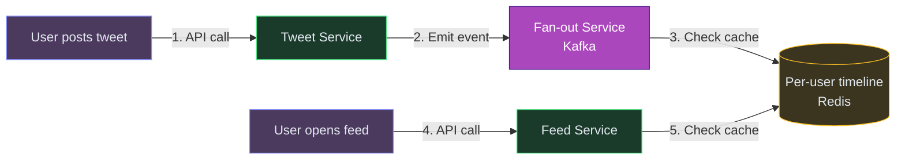

**In 3 sentences:** When someone tweets, the system either pushes that tweet into every follower's pre-built timeline cache (fan-out on write) or waits until each follower opens their feed and assembles it on-the-fly (fan-out on read). Most systems use a **hybrid**: push for regular users, pull for celebrities. The timeline is cached in Redis as a sorted list of tweet IDs per user.

---

## Understanding the Problem

**What is a social feed?** When you open Twitter/X, Instagram, or LinkedIn, you see a stream of posts from accounts you follow (and maybe recommended content). That stream is your **timeline** - a personalized, ordered list assembled from thousands of content sources.

**Why is it hard?**
- User A follows 500 people. Each tweets 5 times/day. Feed must merge 2500 posts/day into a ranked timeline.
- Celebrity with 50M followers tweets once → 50M timelines need updating.
- The feed must load in under 200ms on a slow phone connection.
- "Out of order" tweets feel broken - chronological or ranked, but never randomly jumbled.

**Real numbers (Twitter/X scale):**
- 500M+ DAU
- 500M tweets/day
- Average user follows ~400 accounts
- Median follower count: ~200. Top accounts: 50M+

## Scale Estimation (Back-of-Envelope)

- **Users:** 500M DAU, 400 avg follows per user
- **Write QPS:** ~6K tweets/sec (500M tweets/day), fan-out generates 200B+ cache writes/day
- **Read QPS:** 100K feed loads/sec at peak (each user opens feed 10+ times/day)
- **Storage:** ~3TB tweet storage/year (text + metadata, media stored separately in S3)
- **Bandwidth:** ~50 Gbps at peak for feed API responses + media CDN

---

## Core Entities

- **User** - account with profile, follower/following lists, and preferences
- **Tweet** - text content (280 chars), media attachments, author, timestamp, engagement counts
- **Timeline** - a per-user sorted list of tweet IDs representing their feed
- **Follow Relationship** - directional edge in the social graph (A follows B)
- **Fan-out Job** - an async task that pushes a new tweet into followers' timelines

---

## Naive First Cut

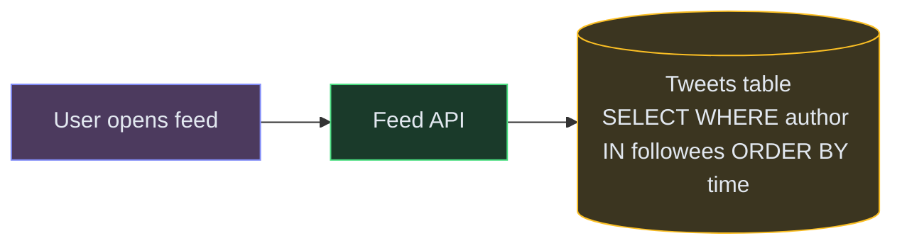

On each feed request: `SELECT * FROM tweets WHERE author_id IN (SELECT followee_id FROM follows WHERE follower_id = ?) ORDER BY created_at DESC LIMIT 50`.

**Why this breaks:**
- ❌ `IN (500 followee IDs)` → massive query scanning millions of rows
- ❌ Every feed open = expensive DB query. 500M DAU × 10 opens/day = 5B queries/day
- ❌ No caching - same expensive query repeated every few seconds
- ❌ No ranking - just chronological, no relevance
- ❌ Celebrity tweet → 50M users all running this query simultaneously

---

## Prior Art We're Drawing From

- **Twitter Fan-out Service** - The original implementation that coined "fan-out on write." Pre-computes timelines for users with < 500K followers; assembles on-read for celebrities. Processes 500M tweets/day into 200B+ timeline writes. ([Twitter Engineering blog](https://blog.twitter.com/engineering/en_us/topics/infrastructure))
- **Facebook TAO** - Graph-aware caching layer serving the social graph at billions of QPS. Demonstrates that follow relationships must be cached separately from content for performance. ([Facebook TAO paper](https://www.usenix.org/conference/atc13/technical-sessions/presentation/bronson))
- **Instagram Feed Ranking** - Moved from chronological to ML-ranked feed. Two-stage pipeline: candidate generation (pull from timeline) → ranking model predicting engagement probability. ([Instagram Engineering](https://instagram-engineering.com/))
- **LinkedIn Feed Architecture** - Uses a "feed mixer" pattern that merges multiple content sources (network updates, sponsored content, recommendations) into a single ranked stream. ([LinkedIn Engineering blog](https://engineering.linkedin.com/blog/2016/03/followfeed--linkedins-feed-made-faster-and-smarter))

---

## The Big Decision: Fan-out on Write vs Fan-out on Read

This is the **core interview question** for a feed system. There are two strategies:

### Fan-out on Write (push model)

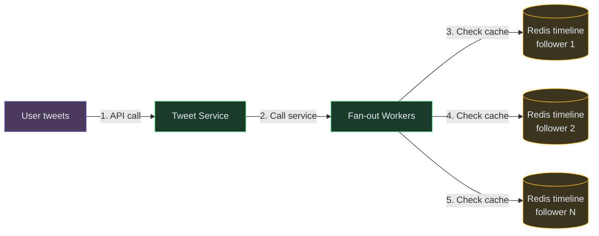

**How:** When user A tweets, immediately push that tweet ID into every follower's pre-built timeline in Redis.

| Pros | Cons |
|---|---|
| Feed reads are instant - just read from Redis | Celebrity with 50M followers = 50M Redis writes per tweet |
| No computation at read time | Write latency proportional to follower count |
| Simple read path | Wastes space for inactive users (push to followers who never open the app) |

### Fan-out on Read (pull model)

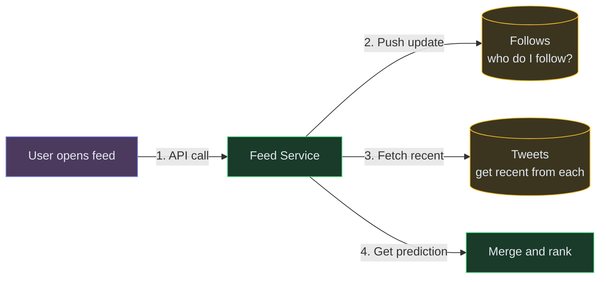

**How:** When user B opens their feed, fetch recent tweets from all 500 people they follow, merge and rank in real-time.

| Pros | Cons |
|---|---|
| No write amplification for celebrities | Slow - merging 500 sources per request |
| Only compute for active users | Read latency scales with follow count |
| Always fresh (no stale cached feed) | Expensive at read time under high traffic |

### The Answer: Hybrid (what Twitter actually does)

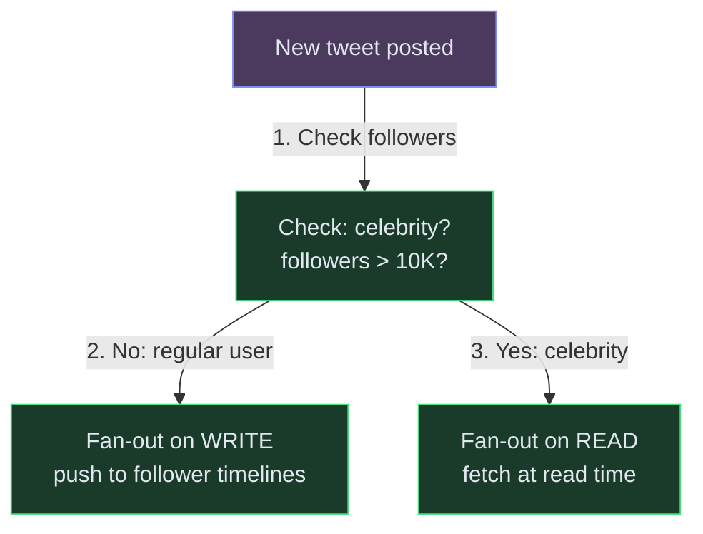

> 💡 **The hybrid approach:** Regular users (< 10K followers) → fan-out on write. Celebrities (> 10K followers) → fan-out on read. At timeline load, merge the pre-built cache with a small number of celebrity tweet fetches.

This is what Twitter, Instagram, and LinkedIn actually use.

---

## High-Level Architecture

Let's build this incrementally, adding components as each requirement demands them.

### FR1: User Posts a Tweet

The first interaction: a user types a tweet and hits Post. We need to store it durably and announce to the system that a new tweet exists.

**New components:**

1. **API Gateway** - authenticates, rate-limits, routes. Entry point for all client requests.
2. **Tweet Service** - handles tweet creation: validates content, stores the tweet, uploads media references. 💡 *This service doesn't deliver tweets to followers - it just writes the tweet and announces "hey, a new tweet exists."*
3. **Tweet Store (Cassandra)** - permanent storage for all tweets. Optimized for high write throughput.
4. **Kafka** - event bus. Tweet Service publishes `TweetCreated` events for downstream consumers. Decouples posting from delivery.

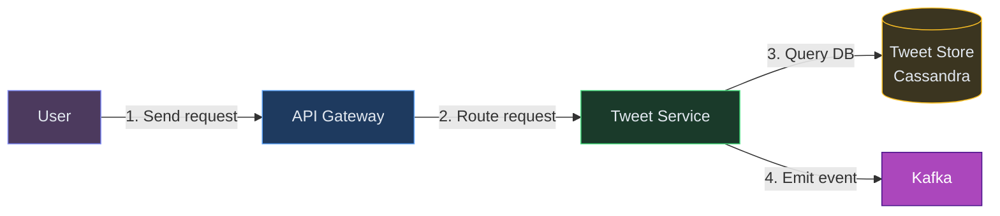

**Step-by-step:**

1. User taps Post → request hits API Gateway
2. Gateway authenticates (JWT) and forwards to Tweet Service
3. Tweet Service stores the tweet in Cassandra (permanent record)
4. Tweet Service publishes `TweetCreated` event to Kafka (includes tweetId, authorId, timestamp)
5. Responds to user: "Tweet posted!" in ~50ms

**Why Kafka?** The poster shouldn't wait while we update millions of follower timelines. Kafka decouples creation from delivery - the user gets instant confirmation, and fan-out happens asynchronously.

---

### FR2: User Opens Their Feed - Pre-Built Timelines

Now users want to see their feed. The naive approach (query all followees' tweets on every request) is too slow at scale. Instead, we pre-build each user's timeline so reading it is just a cache lookup.

**New components:**

5. **Fan-out Service** - consumes `TweetCreated` events from Kafka and pushes tweet IDs into every follower's pre-built timeline.
6. **Social Graph** - stores who-follows-whom. Queried during fan-out: "give me all 5000 followers of this user."
7. **Timeline Cache (Redis sorted set)** - each user's feed stored as a sorted set of tweet IDs scored by timestamp. Reading the feed = `ZREVRANGE` - instant. 💡 *A Redis sorted set keeps elements ordered by score. "Get latest 50 tweets" is a single O(log N + 50) command.*
8. **Feed Service** - handles "show me my feed" requests. Reads from cache, hydrates tweet IDs into full objects, applies ranking.

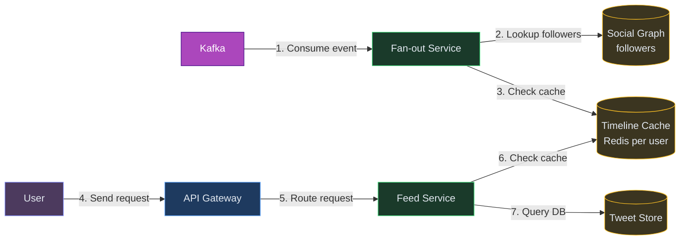

**Step-by-step for fan-out (write path):**

1. Fan-out Service consumes `TweetCreated` from Kafka
2. Queries Social Graph: "who follows this author?" → gets follower list
3. For each follower: `ZADD timeline:{followerId} <timestamp> <tweetId>`
4. Trims each timeline to 800 entries (older tweets fall off cache)

**Step-by-step for feed read:**

1. User opens app → `GET /feed`
2. Feed Service reads from Redis: `ZREVRANGE timeline:{userId} 0 49` → 50 tweet IDs in ~1ms
3. Hydrates IDs → fetches full tweet objects from Cassandra (batch multi-get)
4. Returns ranked feed to user

**But wait - what about celebrities?** If a user has 50M followers, fan-out means 50M Redis writes per tweet. That takes minutes and blocks the queue. We need a different approach for them.

---

### FR3: Handle Celebrities - The Hybrid Approach

The celebrity problem is the core design challenge. Fan-out on write breaks for mega-accounts. We need a hybrid.

**The rule:** Regular users (< 10K followers) → fan-out on write. Celebrities (> 10K followers) → fan-out on read.

**No new infrastructure components** - just different behavior at the Fan-out Service and Feed Service:

- **Fan-out Service:** Checks follower count before pushing. If > 10K, skip this author's tweet (don't push to followers).
- **Feed Service:** Maintains a list of "celebrity followees" per user. On feed load, fetches recent tweets from those 5-20 celebrity accounts directly from the Tweet Store and merges them with the pre-built cache.

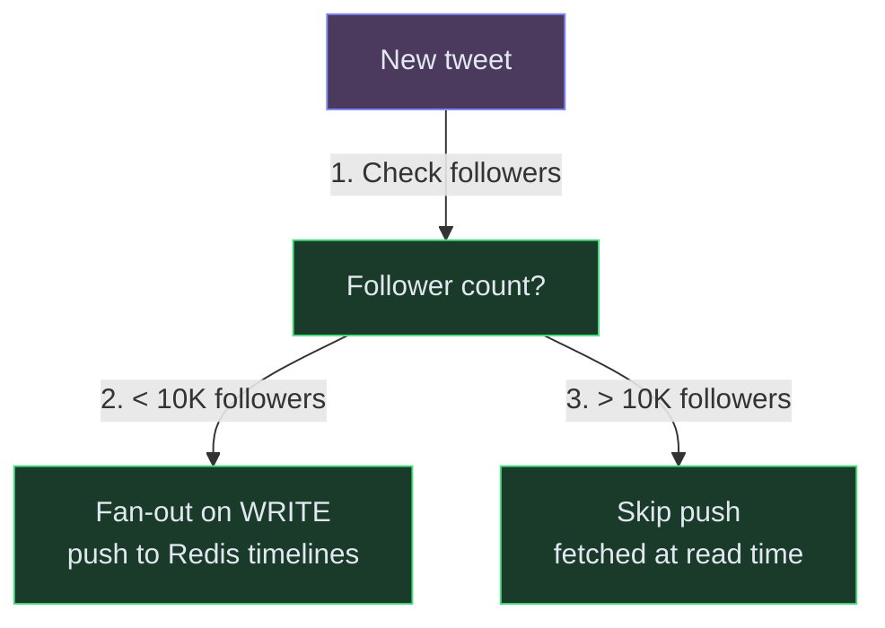

**At read time, the Feed Service does:**
1. Get pre-built timeline from Redis (regular users' tweets)
2. Get list of celebrity followees for this user
3. Fetch recent tweets from each celebrity (5-20 accounts × latest 5 tweets = 100 tweets max)
4. Merge both sets, rank by relevance score
5. Return top 50

**Why 10K as the threshold?** It's a trade-off. Pushing to 10K followers takes ~100ms (acceptable). Pushing to 50M takes minutes (unacceptable). The threshold can be tuned based on your SLA.

---

## Core Flows

### Flow 1: User posts a tweet

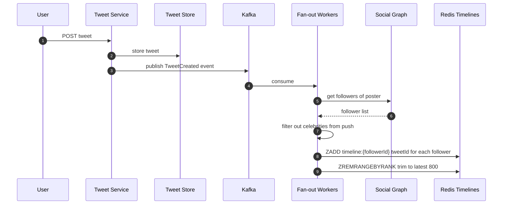

1. Tweet stored permanently in Cassandra/DynamoDB.
2. Event published to Kafka for async fan-out.
3. Fan-out workers get the poster's follower list from the social graph.
4. For each non-celebrity follower, push the tweet ID into their Redis sorted set (scored by timestamp).
5. Trim each timeline to 800 entries (older ones fall off; user can fetch from DB if they scroll far enough).

### Flow 2: User opens their feed

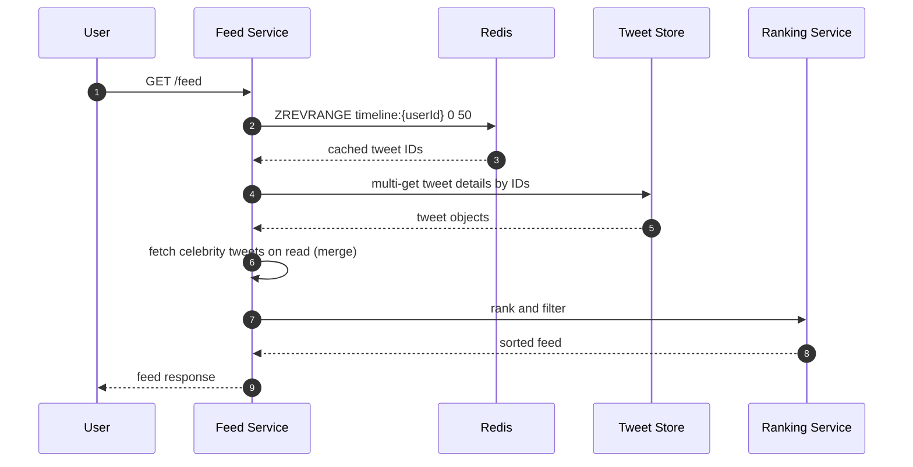

1. Read the user's pre-built timeline from Redis (just tweet IDs, sorted by time).
2. Hydrate: fetch full tweet objects from the tweet store.
3. Merge in recent tweets from celebrities the user follows (fan-out on read for these).
4. Apply ranking (relevance score, engagement signals, freshness decay).
5. Return the ranked feed.

---

## Deep Dives

### Deep Dive 1: The Celebrity Problem (hot partition)

**Problem:** Elon tweets → 100M followers. If we fan-out on write, that's 100M Redis writes. Takes minutes, and during that time the tweet is "invisible" to most followers.

**In simple terms:** A celebrity with 100M followers posts. If we try to push that post into 100M timelines, it takes minutes. During that time, most followers don't see the post. We need a different strategy for mega-accounts.

**Bad:** Fan-out on write for everyone. Celebrities block the queue for hours.

**Good:** Skip fan-out for celebrities (> 10K followers). Fetch their tweets at read time.

**Great:** Tiered approach:
- Regular users (< 10K): push immediately
- Mid-tier (10K–1M): push in batches with lower priority
- Mega-celebrities (1M+): never push. Always pulled at read time.
- **How the reader handles it:** Feed Service maintains a small list of "celebrity followees" per user. On feed load, it fetches recent tweets from those ~5-20 celebrity accounts and merges with the pre-built cache.

### Deep Dive 2: Feed Ranking

**Problem:** Chronological feed is simple but engagement is lower. Users miss important tweets because they happened while asleep.

**In simple terms:** Showing posts purely by time means you miss important tweets that happened while you slept. We need to surface the posts you'd actually care about.

**Ranking signals (simplified):**

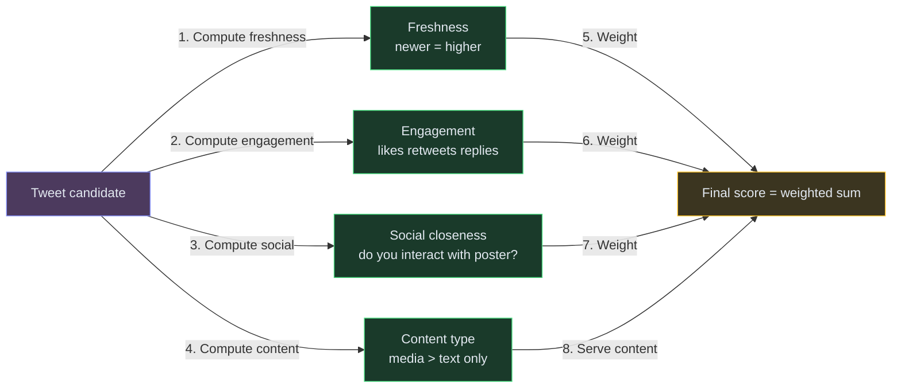

Score = w1 × freshness + w2 × engagement + w3 × social_closeness + w4 × content_type

Twitter uses an ML model (originally "Earlybird") but a weighted sum is fine for interviews.

### Deep Dive 3: Timeline Cache Design (Redis sorted set)

**Why Redis sorted set?**
- `ZADD timeline:{userId} <timestamp> <tweetId>` - O(log N) insert
- `ZREVRANGE timeline:{userId} 0 50` - get latest 50 in O(log N + 50)
- `ZREMRANGEBYRANK timeline:{userId} 0 -801` - trim to 800 entries
- Perfect for "ordered list with efficient insert and range query"

**Memory math:**
- 500M users × 800 tweet IDs × 8 bytes per entry ≈ 3.2 TB
- Redis cluster across 100+ nodes handles this

**What happens when the cache is cold (user hasn't opened in weeks)?**
Fall back to fan-out on read: fetch recent tweets from all followees, build a fresh timeline, cache it. Lazy population.

### Deep Dive 4: Real-time feed updates

**Problem:** User is looking at their feed. Someone they follow tweets. Should it appear immediately?

**In simple terms:** You're scrolling your feed. A new tweet appears from someone you follow. Should it pop in immediately (disrupting your reading) or show a 'new tweets' banner?

**Options:**
- **Polling:** Client checks every 30s. Wastes resources.
- **Long polling:** Client holds a connection; server responds when new content exists.
- **WebSocket/SSE:** Server pushes new tweet IDs to connected clients in real-time.

**What Twitter does:** "New tweets available" banner at the top. User clicks to load. Not auto-injected (disrupts reading position).

Implementation: WebSocket connection subscribes to a channel. Fan-out also publishes to a pub/sub layer. Connected clients get a "3 new tweets" notification.

---

## Final Architecture

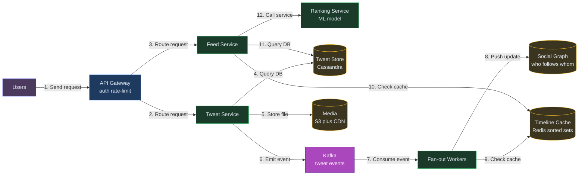

---

## Interview Cheat Sheet

| Question | Answer |
|---|---|
| "How do you build the feed?" | Hybrid fan-out: push for regular users, pull for celebrities |
| "Where's the timeline stored?" | Redis sorted set per user (tweet IDs scored by timestamp) |
| "How do you handle celebrities?" | Don't push to 50M followers. Merge their tweets at read time. |
| "How do you rank?" | Weighted score: freshness + engagement + social closeness |
| "What about real-time?" | WebSocket for "new tweets available" banner, not auto-inject |
| "Storage for tweets?" | Cassandra or DynamoDB - partition by tweetId, immutable, replicated |
| "Social graph storage?" | Adjacency list in Redis or dedicated graph DB. `followers:{userId} → Set<userId>` |
| "What's the read latency?" | P99 < 200ms. Pre-built cache → hydrate → rank. |

---

## Key Technologies

| Term | What it is |
|---|---|
| **Fan-out** | Taking one event (a tweet) and delivering it to many recipients (followers). "Fan-out on write" = push at creation time. "Fan-out on read" = pull at view time. |
| **Redis Sorted Set** | A Redis data structure that stores elements with a score. Lets you get the top-N elements efficiently (perfect for "latest 50 tweets"). |
| **Social Graph** | The network of who-follows-whom. Stored as adjacency lists. Queried as "give me all followers of user X." |
| **Kafka** | Event streaming platform. Tweet creation events go here for async fan-out workers to consume. |
| **Cassandra** | Wide-column NoSQL database. Stores tweets durably. Good for high write volume and partition-per-user access patterns. |
| **CDN** | Content Delivery Network. Serves media (images, videos) from edge servers close to users. |
| **Hydration** | Converting a list of IDs into full objects. "Hydrate tweet IDs → fetch full tweet with text, likes, media URLs." |

---

## What's Expected at Each Level

> This section helps you calibrate your depth. You don't need to cover everything - just know what's expected for your level.

### Mid-level

Produce a working design with tweet storage and basic feed assembly. Recognize that JOIN-based feed queries don't scale. With prompting, propose pre-computing timelines (fan-out on write) so that feed reads are a simple cache lookup rather than a complex multi-table query.

### Senior

Articulate the fan-out-on-write vs fan-out-on-read tradeoff without prompting. Propose the hybrid approach for celebrities (>10K followers skip fan-out, merged at read time). Discuss Redis sorted sets or Cassandra for timeline cache. Explain how to handle the celebrity problem (50M followers) and why naive fan-out would generate 50M writes per tweet.

### Staff+

Address feed ranking vs chronological ordering trade-offs and the ML pipeline needed for relevance scoring. Discuss real-time feed injection (new tweets appearing without refresh via WebSocket/SSE), tweet deletion propagation across cached timelines, and the operational cost of fan-out at Twitter scale (500M users × 400 followers = 200B cache writes/day). Cover cache eviction strategies for inactive users.

---
## 🎯 Key Takeaways

- **Fan-out on write** pre-computes feeds - reads are instant
- **Celebrity exception** skips fan-out for >500K followers - merged at read time
- **Kafka** decouples posting from feed distribution
- **Redis** caches hot timelines for active users

---
## Related Designs
- [Chat System](/hld/ChatSystem) - real-time message delivery
- [Notification System](/hld/NotificationSystem) - push to users
- [Leaderboard](/hld/Leaderboard) - real-time ranking updates

---

## Related Concepts

Understand the building blocks used in this design:

- [Fan-Out Patterns →](/concepts/fan-out/) — pushes each new tweet into follower timelines (fan-out-on-write) with a pull path for celebrities
- [Caching →](/concepts/caching/) — precomputed timelines live in Redis for millisecond reads
- [Database Sharding →](/concepts/database-sharding/) — partitions tweets and timelines across nodes to handle write volume
- [CDN →](/concepts/cdn/) — serves attached images and video close to the viewer
