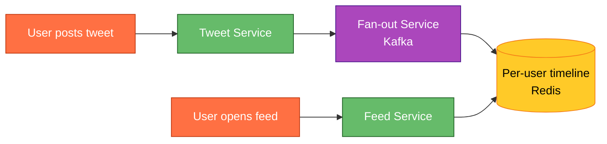
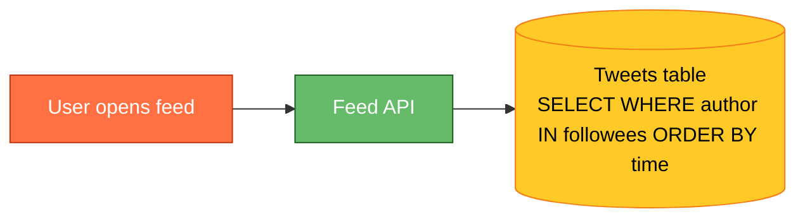
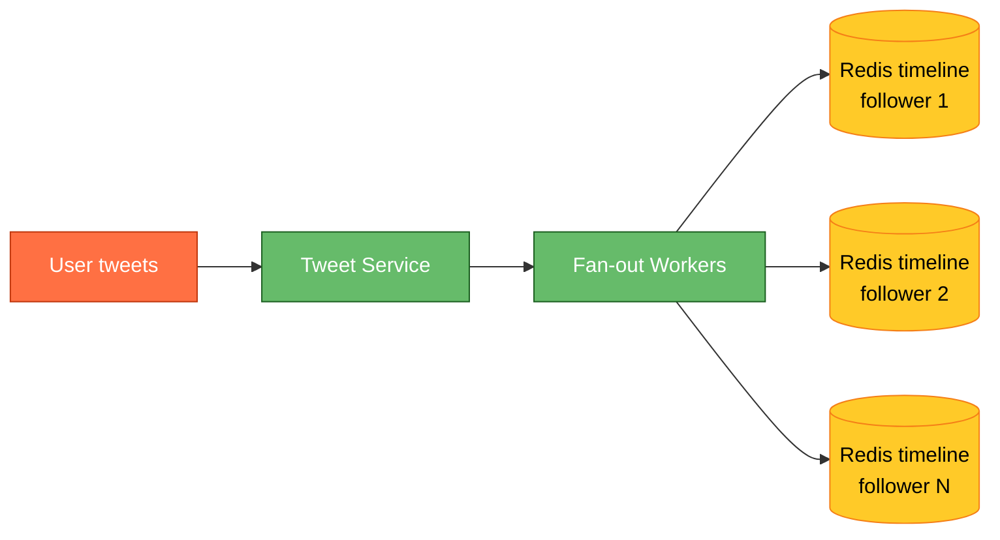
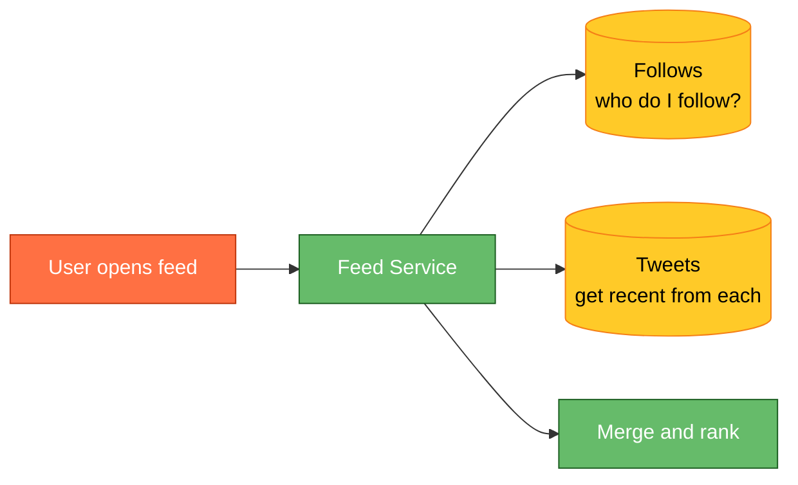
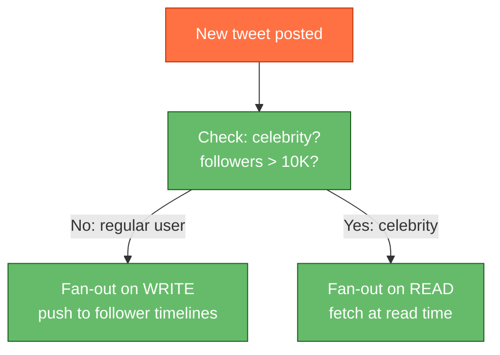
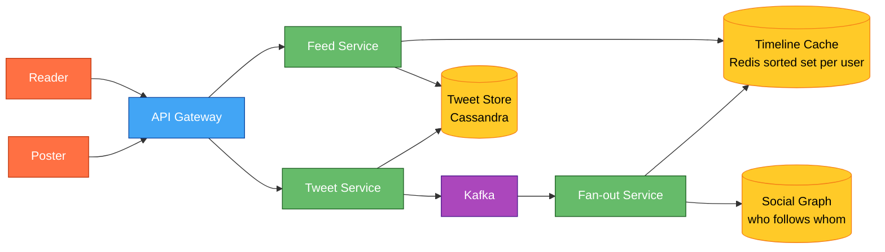
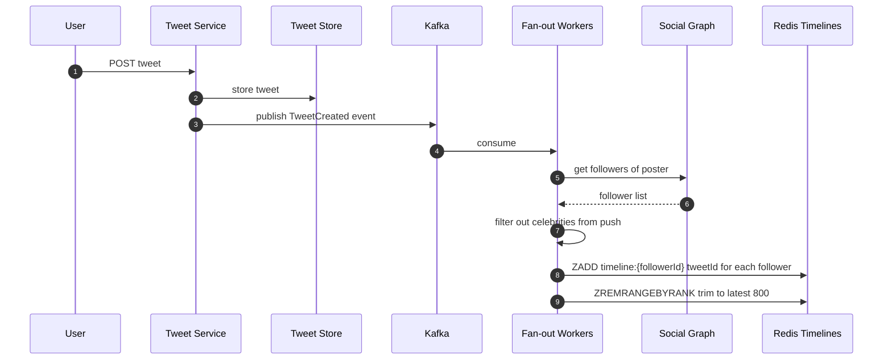
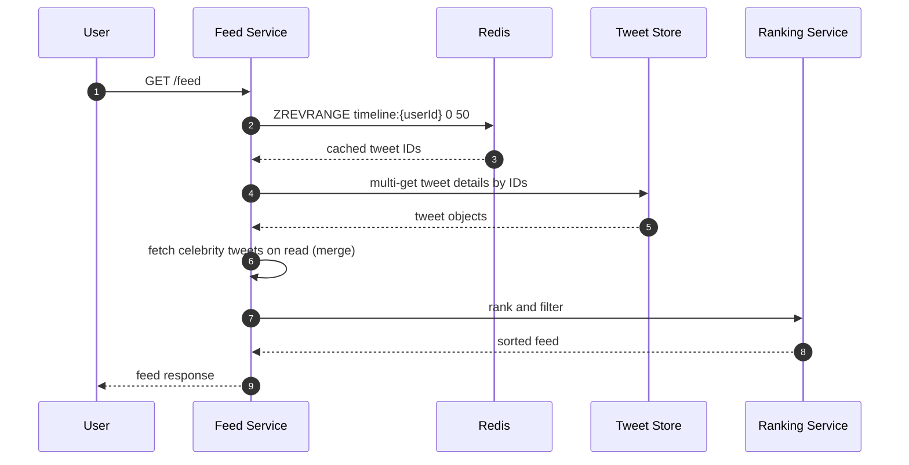
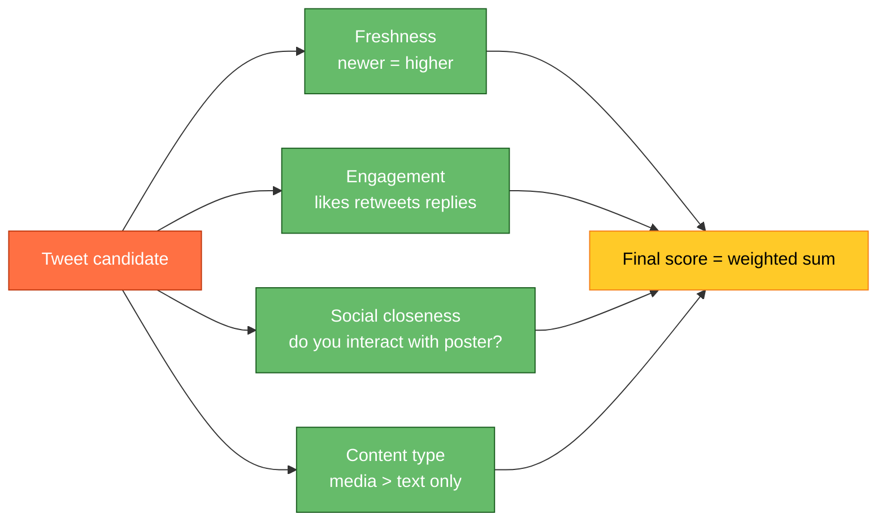
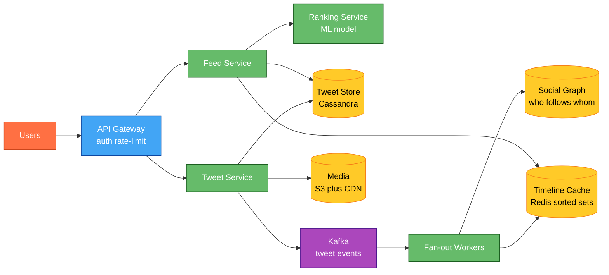

# Designing a Social Media Feed (Twitter/X)

⚡ **Difficulty:** Intermediate
📋 **Prerequisites:** [System Design Fundamentals](/concepts) — especially Caching and Message Queues
⏱️ **Reading time:** 20 min

---

## TL;DR

A social feed shows each user a personalized timeline of posts from people they follow. The core challenge is **fan-out** — when a user with 10M followers tweets, how do you update 10M timelines quickly?

**In 3 sentences:** When someone tweets, the system either pushes that tweet into every follower's pre-built timeline cache (fan-out on write) or waits until each follower opens their feed and assembles it on-the-fly (fan-out on read). Most systems use a **hybrid**: push for regular users, pull for celebrities. The timeline is cached in Redis as a sorted list of tweet IDs per user.

---

## Understanding the Problem

**What is a social feed?** When you open Twitter/X, Instagram, or LinkedIn, you see a stream of posts from accounts you follow (and maybe recommended content). That stream is your **timeline** — a personalized, ordered list assembled from thousands of content sources.

**Why is it hard?**
- User A follows 500 people. Each tweets 5 times/day. Feed must merge 2500 posts/day into a ranked timeline.
- Celebrity with 50M followers tweets once → 50M timelines need updating.
- The feed must load in under 200ms on a slow phone connection.
- "Out of order" tweets feel broken — chronological or ranked, but never randomly jumbled.

**Real numbers (Twitter/X scale):**
- 500M+ DAU
- 500M tweets/day
- Average user follows ~400 accounts
- Median follower count: ~200. Top accounts: 50M+

---

## Naive First Cut

On each feed request: `SELECT * FROM tweets WHERE author_id IN (SELECT followee_id FROM follows WHERE follower_id = ?) ORDER BY created_at DESC LIMIT 50`.

**Why this breaks:**
- ❌ `IN (500 followee IDs)` → massive query scanning millions of rows
- ❌ Every feed open = expensive DB query. 500M DAU × 10 opens/day = 5B queries/day
- ❌ No caching — same expensive query repeated every few seconds
- ❌ No ranking — just chronological, no relevance
- ❌ Celebrity tweet → 50M users all running this query simultaneously

---

## The Big Decision: Fan-out on Write vs Fan-out on Read

This is the **core interview question** for a feed system. There are two strategies:

### Fan-out on Write (push model)

**How:** When user A tweets, immediately push that tweet ID into every follower's pre-built timeline in Redis.

| Pros | Cons |
|---|---|
| Feed reads are instant — just read from Redis | Celebrity with 50M followers = 50M Redis writes per tweet |
| No computation at read time | Write latency proportional to follower count |
| Simple read path | Wastes space for inactive users (push to followers who never open the app) |

### Fan-out on Read (pull model)

**How:** When user B opens their feed, fetch recent tweets from all 500 people they follow, merge and rank in real-time.

| Pros | Cons |
|---|---|
| No write amplification for celebrities | Slow — merging 500 sources per request |
| Only compute for active users | Read latency scales with follow count |
| Always fresh (no stale cached feed) | Expensive at read time under high traffic |

### The Answer: Hybrid (what Twitter actually does)

> 💡 **The hybrid approach:** Regular users (< 10K followers) → fan-out on write. Celebrities (> 10K followers) → fan-out on read. At timeline load, merge the pre-built cache with a small number of celebrity tweet fetches.

This is what Twitter, Instagram, and LinkedIn actually use.

---

## High-Level Architecture

**New components we need:**

1. **API Gateway** — authenticates users, applies rate limits, and routes requests to the right service.
2. **Tweet Service** — handles tweet creation: stores the tweet, uploads media, and publishes an event for fan-out. 💡 *This service doesn't deliver tweets to followers — it just writes the tweet and announces "hey, a new tweet exists."*
3. **Fan-out Service** — the heavy lifter. Receives "new tweet" events and pushes tweet IDs into every follower's timeline cache. 💡 *Fan-out = taking one event (a tweet) and delivering it to many recipients (followers). Like a newspaper printing press — one article, delivered to thousands of mailboxes.*
4. **Feed Service** — handles "show me my feed" requests. Reads the user's pre-built timeline from cache, hydrates tweet IDs into full tweet objects, and applies ranking.
5. **Kafka** — the event bus between Tweet Service and Fan-out. Decouples tweet creation from delivery so the poster doesn't wait while millions of timelines update.
6. **Tweet Store (Cassandra)** — permanent storage for all tweets. Optimized for high write throughput and partition-per-tweet access patterns.
7. **Timeline Cache (Redis sorted set per user)** — each user's pre-built feed stored as a sorted set of tweet IDs (scored by timestamp). Reading the feed is just `ZREVRANGE` — instant. 💡 *A Redis sorted set keeps elements ordered by score. Here, each tweet ID has its timestamp as the score, so "get latest 50 tweets" is a single O(log N + 50) command.*
8. **Social Graph** — stores who-follows-whom. Queried during fan-out ("give me all 5000 followers of this user") and at read time ("which celebrities does this user follow?").

**How posting a tweet flows through the system:**

1. User types "Hello world!" and taps Post → request hits the API Gateway
2. Gateway authenticates and forwards to Tweet Service
3. Tweet Service stores the tweet in Cassandra (permanent record), then publishes a `TweetCreated` event to Kafka
4. Fan-out Service consumes the event, looks up the poster's followers from the Social Graph, and pushes the tweet ID into each follower's Redis timeline (using `ZADD timeline:{followerId} <timestamp> <tweetId>`)
5. Each timeline is trimmed to ~800 entries — older tweets fall off the cache and live only in Cassandra

**How reading the feed works:**

1. User opens the app → "show me my feed" → request hits Feed Service
2. Feed Service reads the user's pre-built timeline from Redis (`ZREVRANGE timeline:{userId} 0 49`) — returns 50 tweet IDs in ~1ms
3. Feed Service fetches full tweet objects from Cassandra (batch multi-get)
4. For celebrities the user follows (not in the pre-built cache), Feed Service fetches their recent tweets directly and merges them in
5. Ranking Service applies relevance scoring (engagement signals, freshness, social closeness) and returns the final ordered feed

**Why Kafka between Tweet Service and Fan-out?** The poster shouldn't wait while we update 10K timelines. Kafka decouples the two — Tweet Service responds to the user in ~50ms ("tweet posted!"), and fan-out happens asynchronously over the next few seconds. If Fan-out workers crash, Kafka retries delivery automatically.

---

## Core Flows

### Flow 1: User posts a tweet

1. Tweet stored permanently in Cassandra/DynamoDB.
2. Event published to Kafka for async fan-out.
3. Fan-out workers get the poster's follower list from the social graph.
4. For each non-celebrity follower, push the tweet ID into their Redis sorted set (scored by timestamp).
5. Trim each timeline to 800 entries (older ones fall off; user can fetch from DB if they scroll far enough).

### Flow 2: User opens their feed

1. Read the user's pre-built timeline from Redis (just tweet IDs, sorted by time).
2. Hydrate: fetch full tweet objects from the tweet store.
3. Merge in recent tweets from celebrities the user follows (fan-out on read for these).
4. Apply ranking (relevance score, engagement signals, freshness decay).
5. Return the ranked feed.

---

## Deep Dives

### Deep Dive 1: The Celebrity Problem (hot partition)

**Problem:** Elon tweets → 100M followers. If we fan-out on write, that's 100M Redis writes. Takes minutes, and during that time the tweet is "invisible" to most followers.

**Bad:** Fan-out on write for everyone. Celebrities block the queue for hours.

**Good:** Skip fan-out for celebrities (> 10K followers). Fetch their tweets at read time.

**Great:** Tiered approach:
- Regular users (< 10K): push immediately
- Mid-tier (10K–1M): push in batches with lower priority
- Mega-celebrities (1M+): never push. Always pulled at read time.
- **How the reader handles it:** Feed Service maintains a small list of "celebrity followees" per user. On feed load, it fetches recent tweets from those ~5-20 celebrity accounts and merges with the pre-built cache.

### Deep Dive 2: Feed Ranking

**Problem:** Chronological feed is simple but engagement is lower. Users miss important tweets because they happened while asleep.

**Ranking signals (simplified):**

Score = w1 × freshness + w2 × engagement + w3 × social_closeness + w4 × content_type

Twitter uses an ML model (originally "Earlybird") but a weighted sum is fine for interviews.

### Deep Dive 3: Timeline Cache Design (Redis sorted set)

**Why Redis sorted set?**
- `ZADD timeline:{userId} <timestamp> <tweetId>` — O(log N) insert
- `ZREVRANGE timeline:{userId} 0 50` — get latest 50 in O(log N + 50)
- `ZREMRANGEBYRANK timeline:{userId} 0 -801` — trim to 800 entries
- Perfect for "ordered list with efficient insert and range query"

**Memory math:**
- 500M users × 800 tweet IDs × 8 bytes per entry ≈ 3.2 TB
- Redis cluster across 100+ nodes handles this

**What happens when the cache is cold (user hasn't opened in weeks)?**
Fall back to fan-out on read: fetch recent tweets from all followees, build a fresh timeline, cache it. Lazy population.

### Deep Dive 4: Real-time feed updates

**Problem:** User is looking at their feed. Someone they follow tweets. Should it appear immediately?

**Options:**
- **Polling:** Client checks every 30s. Wastes resources.
- **Long polling:** Client holds a connection; server responds when new content exists.
- **WebSocket/SSE:** Server pushes new tweet IDs to connected clients in real-time.

**What Twitter does:** "New tweets available" banner at the top. User clicks to load. Not auto-injected (disrupts reading position).

Implementation: WebSocket connection subscribes to a channel. Fan-out also publishes to a pub/sub layer. Connected clients get a "3 new tweets" notification.

---

## Final Architecture

---

## Interview Cheat Sheet

| Question | Answer |
|---|---|
| "How do you build the feed?" | Hybrid fan-out: push for regular users, pull for celebrities |
| "Where's the timeline stored?" | Redis sorted set per user (tweet IDs scored by timestamp) |
| "How do you handle celebrities?" | Don't push to 50M followers. Merge their tweets at read time. |
| "How do you rank?" | Weighted score: freshness + engagement + social closeness |
| "What about real-time?" | WebSocket for "new tweets available" banner, not auto-inject |
| "Storage for tweets?" | Cassandra or DynamoDB — partition by tweetId, immutable, replicated |
| "Social graph storage?" | Adjacency list in Redis or dedicated graph DB. `followers:{userId} → Set<userId>` |
| "What's the read latency?" | P99 < 200ms. Pre-built cache → hydrate → rank. |

---

## Key Technologies

| Term | What it is |
|---|---|
| **Fan-out** | Taking one event (a tweet) and delivering it to many recipients (followers). "Fan-out on write" = push at creation time. "Fan-out on read" = pull at view time. |
| **Redis Sorted Set** | A Redis data structure that stores elements with a score. Lets you get the top-N elements efficiently (perfect for "latest 50 tweets"). |
| **Social Graph** | The network of who-follows-whom. Stored as adjacency lists. Queried as "give me all followers of user X." |
| **Kafka** | Event streaming platform. Tweet creation events go here for async fan-out workers to consume. |
| **Cassandra** | Wide-column NoSQL database. Stores tweets durably. Good for high write volume and partition-per-user access patterns. |
| **CDN** | Content Delivery Network. Serves media (images, videos) from edge servers close to users. |
| **Hydration** | Converting a list of IDs into full objects. "Hydrate tweet IDs → fetch full tweet with text, likes, media URLs." |

---
## Related Designs
- [Chat System](/ChatSystem) — real-time message delivery
- [Notification System](/NotificationSystem) — push to users
- [Leaderboard](/Leaderboard) — real-time ranking updates
