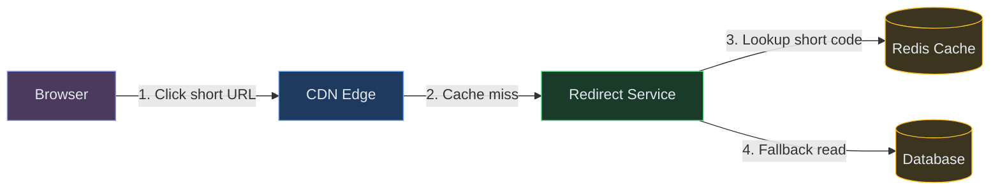
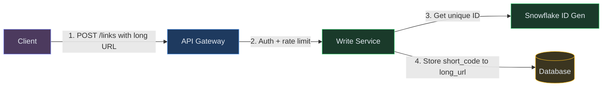
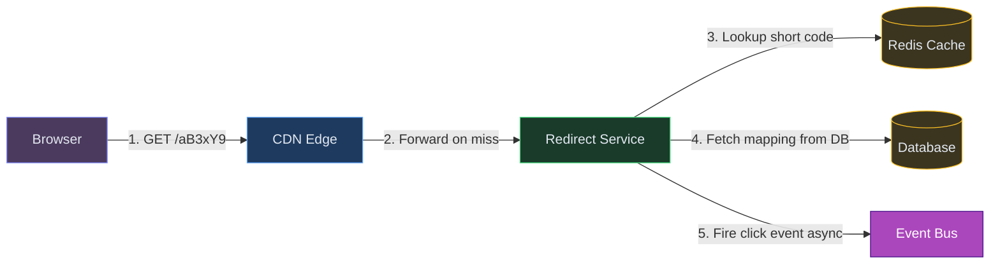
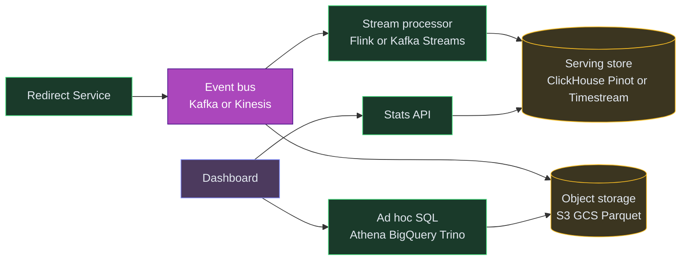
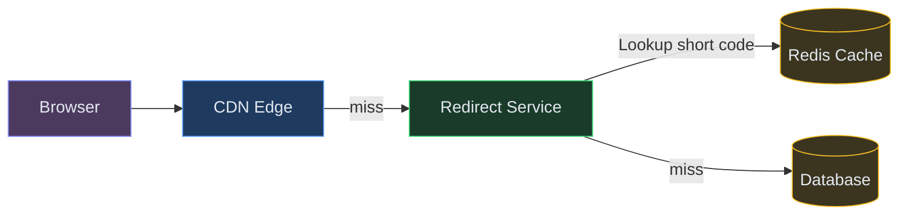
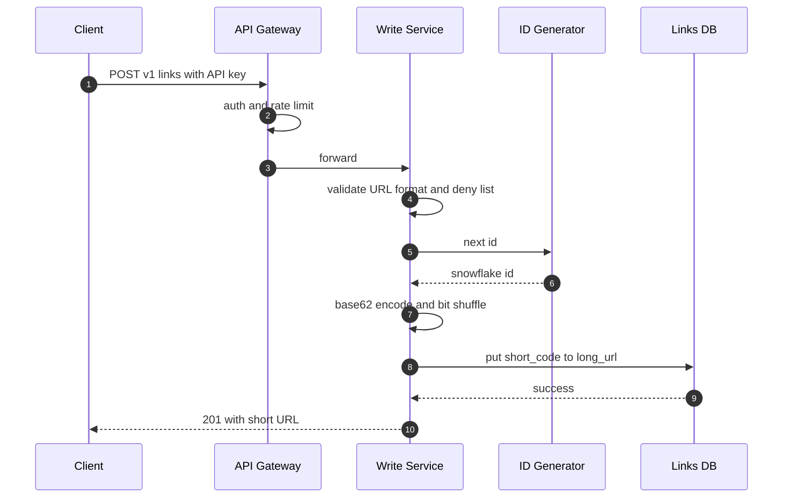
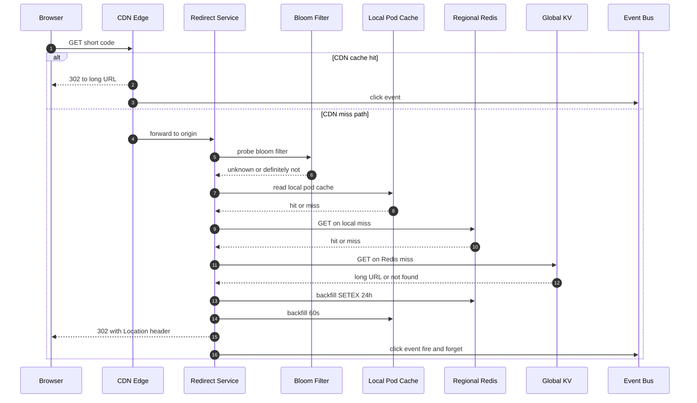
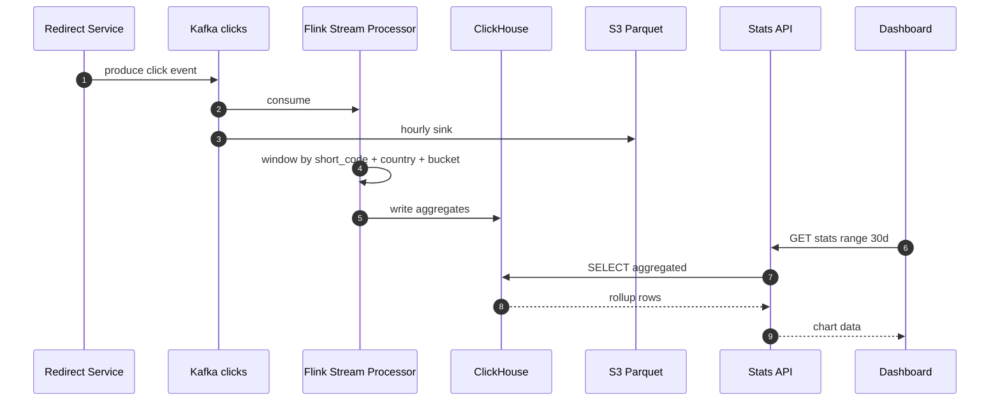
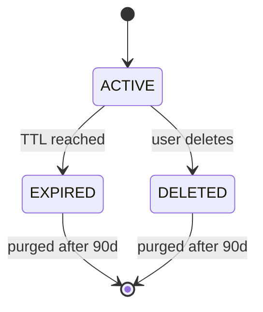
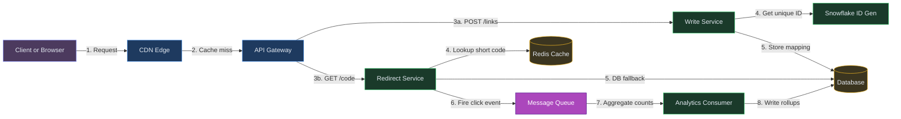

# Designing a URL Shortener Like Bitly or TinyURL

**Difficulty:** Beginner
**Prerequisites:**[Caching](/concepts/caching/) and [CDN](/concepts/cdn/)

---

## TL;DR

A URL shortener maps short codes to long URLs and redirects billions of clicks per day using tiered caching (CDN → Redis → DB).



| Color | Layer |
|---|---|
| 🟠 Orange | Clients |
| 🔵 Blue | Edge |
| 🟢 Green | Services |
| 🟣 Purple | Async / Streaming |
| 🟡 Yellow | Data |
| 🩷 Pink | External |


**In 3 sentences:** User submits a long URL → system generates a unique short code (base62 of a Snowflake ID) → stores the mapping. On redirect, the system looks up the short code through CDN → Redis → DB tiers and returns a 302. Analytics events fire async to Kafka without slowing the redirect.

💡 *Base62 encoding uses [0-9a-zA-Z] (62 characters) to represent numbers compactly. A 7-char Base62 string gives 62^7 = 3.5 trillion unique short codes.*

---

## Understanding the Problem

🔗 **What is a URL shortener?** A service that takes a long URL like `https://example.com/products/2024/summer-sale?utm_campaign=email&ref=newsletter` and gives you back a short one like `https://sho.rt/aB3xY9`. When someone clicks the short link, they're redirected to the original. Despite the tiny API surface, a URL shortener has to handle billions of redirects a day, generate unique codes without collisions, survive traffic spikes on viral links, and provide analytics.

Think Bitly, TinyURL, t.co (Twitter), or Google's short-lived goo.gl.

## Naive First Cut

A 30-second whiteboard sketch:


Receive a URL, generate a random code, store `{short, long}` in a DB, look it up on redirect. Works for 100 users. Breaks at scale:
- Random code generation collides more often than you'd think at 100M+ links.
- Every redirect is a DB read, so 1M redirects/sec melts the DB.
- Hot links (a tweet goes viral) hammer a single row.
- No analytics beyond "it existed."
- One DB region → half the planet sees 200ms+ redirect latency.

The rest of this doc evolves this into a system that serves billions of redirects globally at low latency.

## Prior Art We're Drawing From

- **Bitly** - the canonical URL shortener. Public writeups describe a heavy read-cache tier, base62 encoding over numeric IDs, and a dedicated analytics pipeline separate from the redirect hot path. ([Educative overview](https://www.educative.io/blog/bitly-system-design))
- **Twitter Snowflake** - 64-bit distributed ID generator producing time-ordered unique IDs without coordination per request. Widely adopted as an alternative to DB auto-increment for short-code generation. ([paper / repo](https://github.com/twitter-archive/snowflake))
- **Base62 encoding** - the standard way to turn a numeric ID into a short alphanumeric code. 7 characters of base62 give 3.5 trillion unique codes, enough for decades of links.
- **Counter-based ranges (Zookeeper / DB)** - pre-allocate ranges of IDs to each service instance to avoid per-request coordination. Instagram's photo ID generation is a famous variant.
- **CDN-cached 301 redirects** - t.co and goo.gl both served redirects from edge POPs. Bitly uses its own edge infrastructure with aggressive caching.

## Technology Choices

Each component in this design is generic - here are real options for each. Pick per your stack and ops capacity.

| Component | Options (pick one) |
|---|---|
| CDN / edge compute | Cloudflare (Workers), CloudFront (Lambda@Edge), Fastly (Compute@Edge), Akamai EdgeWorkers |
| Edge WAF / bot control | Cloudflare WAF, AWS WAF + Shield, Fastly Next-Gen WAF, Akamai Kona |
| API gateway | Kong, Apigee, AWS API Gateway, Envoy, Tyk |
| Service compute | Kubernetes (EKS / GKE / AKS), Nomad, ECS Fargate, plain VMs |
| Global KV source of truth | DynamoDB Global Tables, Cassandra multi-DC, ScyllaDB, Spanner, CockroachDB |
| Regional in-memory cache | Redis (ElastiCache / self-hosted / Upstash), Memcached, Valkey |
| ID generation | Snowflake (self-hosted), Sonyflake, MongoDB ObjectID, UUIDv7, DB counter with range allocation |
| Event backbone | Kafka (MSK / Confluent / self-hosted), Kinesis, Google Pub/Sub, Pulsar, RabbitMQ Streams |
| Stream processing | Flink (managed or self-hosted), Kafka Streams, Spark Structured Streaming, Materialize, ksqlDB |
| Raw event lake | S3, GCS, Azure Blob, MinIO - with Parquet/Iceberg table format |
| Ad-hoc analytics | Athena, BigQuery, Snowflake, Trino / Presto, DuckDB |
| Serving analytics store | ClickHouse, Pinot, Druid, Timestream, OpenSearch, Redshift, TimescaleDB |
| DNS / traffic routing | Route 53, Cloudflare DNS, NS1, Google Cloud DNS with latency-based routing |
| Secrets / config | Vault, AWS Secrets Manager, GCP Secret Manager, Doppler |
| Observability | Prometheus + Grafana + Loki + Tempo, Datadog, New Relic, CloudWatch, Honeycomb |

Rule of thumb: **managed > self-hosted** when the workload isn't a differentiator. We're not in the "run Kafka" business.

---

## Functional Requirements

### Core Requirements
1. Users should be able to submit a long URL and get back a unique short URL.
2. Anyone with a short URL should be redirected to the original long URL, fast.
3. Short URLs should have a configurable expiry (default: forever) and support click analytics.

### Below the line (out of scope)
- User accounts, API keys, billing, dashboards
- Custom aliases / vanity URLs (simple extension once core works)
- Password-protected or expiring-on-click links
- Real-time dashboards with sub-second freshness
- QR codes, link previews, malware scanning
- Custom domains per customer

## Non-Functional Requirements

### Core Requirements
- **Read-heavy workload** - 100:1 reads to writes. Every design decision is driven by the redirect hot path.
- **Low redirect latency** - P99 under 100ms globally. This is user-facing; slow redirects feel broken.
- **High availability** - 99.99% on the redirect path. A dead redirect breaks someone else's tweet.
- **Uniqueness** - no two long URLs can accidentally share a short code.
- **Scale** - 100M new links/day, 10B redirects/day, 5-year retention → ~200B rows at peak.

**In simple terms:** 10 billion clicks per day on short links. A database lookup for every click is too slow and too expensive. We need the mapping cached as close to the user as possible.

### Below the line
- Strong consistency on analytics counts (eventual is fine)
- Strict ordering of click events
- Sub-100ms link creation latency (creation is rare; can be 500ms)

## Scale Estimation (Back-of-Envelope)

- **Users:** 100M DAU (link creators + clickers combined)
- **Write QPS:** 1K new URLs/sec (100M new links/day)
- **Read QPS:** 100K redirects/sec (100:1 read-write ratio, 10B redirects/day)

**In simple terms:** 10 billion clicks per day on short links. A database lookup for every click is too slow and too expensive. We need the mapping cached as close to the user as possible.
- **Storage:** 500GB URL mapping data/year (~200B rows at 5-year retention)
- **Bandwidth:** ~50 Gbps at peak for redirect responses + analytics event ingestion

---

## Core Entities

- **Long URL** - the original destination URL the user submitted.
- **Short Code** - the unique alphanumeric suffix (`aB3xY9`) that identifies a mapping.
- **Link** - the stored mapping of `short_code → long_url` with metadata (creator, created_at, expires_at).
- **Click Event** - a record of a single redirect, with timestamp, IP-derived country, referrer, user agent.

---

## API / System Interface

```
POST /v1/links                                 → Link
     Body: { longUrl, customAlias?, expiresAt? }
     Header: Authorization: Bearer <api_key>

GET  /:shortCode                               → 302 redirect
     Public endpoint on the short domain (sho.rt/aB3xY9)

GET  /v1/links/:shortCode/stats                → ClickStats
     Aggregated clicks by time bucket, country, referrer

DELETE /v1/links/:shortCode                    → 204
     Soft delete - short code becomes 410 Gone
```

Security notes:
- Creation is authenticated via API key; redirects are public.
- `customAlias` (if supported) must be validated for reserved words and rate-limited per user.
- Submitted URLs should be screened for phishing/malware (out of scope for this HLD, but hook point needed).
- Never trust the `Referer` header for anything beyond analytics; it's user-controlled.

---

## High-Level Design

Let's build up service by service.

### 1) User creates a short URL

The create path is low-QPS (~1K/sec peak) but needs a unique, collision-free short code every time.

**New components we need:**

1. **API Gateway** - the front door. Authenticates API keys, applies per-user rate limits, and routes requests to the right service.<br>💡 *Think of it as a security guard + receptionist for your backend.*
2. **Write Service** - handles link creation. Validates the URL, generates the short code, and stores the mapping.
3. **Snowflake ID Generator** - produces unique numeric IDs without any coordination between servers.<br>💡 *Snowflake = a distributed ID generator that embeds a timestamp + machine ID + sequence number into a single 64-bit integer. No two machines ever produce the same ID, even without talking to each other.*
4. **Global KV Store** - where the `short_code → long_url` mapping lives permanently. Needs to survive failures and serve reads worldwide.



### Color Legend


**Step-by-step flow:**

1. User calls `POST /v1/links` with their long URL and API key → request hits the API Gateway
2. Gateway checks: Is this API key valid? Has this user exceeded their rate limit?
3. Gateway forwards to Write Service, which asks the Snowflake ID Generator for a fresh numeric ID, then base62-encodes it into a 7-character short code (e.g., `aB3xY9`)
4. Write Service stores `{short_code, long_url, user_id, created_at, expires_at}` in the Global KV Store
5. Returns the short URL to the user - done in under 100ms

**Why Snowflake instead of random strings?** Random strings require a "check if it already exists" round-trip on every creation. At 100M+ links, collisions become frequent and expensive. Snowflake IDs are unique by construction - no checking needed, ever.

### 2) Anyone hits the short URL and gets redirected

This is the hot path - billions of reads per day. Latency and cost both matter.

**New components we need (in addition to the ones above):**

1. **CDN Edge** - servers deployed worldwide (Cloudflare, CloudFront, Fastly) that cache popular redirects close to users. A viral link gets served from the edge in under 10ms without ever touching our origin servers.<br>💡 *CDN (Content Delivery Network) caches content at edge servers worldwide. Users get served from the nearest edge, cutting latency from 200ms to <20ms. [Learn more →](/concepts#cdn-content-delivery-network)*
2. **Redirect Service** - the origin server that handles CDN misses. Looks up the short code and returns a `302 Found` with the long URL.
3. **Redis Cache** - a regional in-memory cache sitting between the Redirect Service and the database. Holds recently-accessed links for sub-millisecond lookups.
4. **Event Bus** - captures every click as an event for analytics, without slowing down the redirect.<br>💡 *Fire-and-forget pattern: the redirect returns immediately, and the click event flows through the bus in the background.*



**Step-by-step flow:**

1. User clicks `sho.rt/aB3xY9` → browser sends a GET request
2. CDN edge checks its local cache - for popular links (that viral tweet everyone's clicking), the redirect is served right there, under 10ms, without ever reaching our servers
3. On CDN miss → request reaches our Redirect Service, which checks the regional Redis cache
4. On Redis miss → reads from the Global KV Store and backfills both Redis and CDN caches for next time
5. Fires a click event to the Event Bus (fire-and-forget - the redirect doesn't wait for analytics)
6. Returns `302 Found` with the long URL in the `Location` header → browser redirects

**Why `302` and not `301`?** A `301` (permanent redirect) tells the browser to cache it forever. Next time the user clicks that link, the browser goes directly to the destination - we never see the click. That means no analytics. `302` (temporary redirect) forces the browser through us every time, so we count every click.

### 3) Analytics and stats

Clicks go to Kafka from the hot path. A stream processor aggregates them into per-link counters visible via a stats API.

**New components we need (in addition to the ones above):**

1. **Stream Processor (Flink or Kafka Streams)** - reads raw click events and aggregates them into per-link counters by time bucket, country, and referrer.<br>💡 *Instead of counting clicks one-by-one on each query, the stream processor pre-computes rollups so dashboard queries are instant. [Learn more →](/concepts#message-queues)*
2. **Serving Store (ClickHouse, Pinot, or Timestream)** - a columnar database optimized for fast aggregation queries like "how many clicks did this link get in the last 30 days, broken down by country?"
3. **Object Storage (S3 / GCS)** - where raw click events are archived as Parquet files for long-term retention and ad-hoc analysis.
4. **Stats API** - serves pre-aggregated analytics to dashboards. Never scans raw events at query time.



Flow:
1. Redirect Service fires every click to the event bus (Kafka / Kinesis / Pub/Sub). The redirect itself doesn't wait.
2. A stream processor (Flink / Kafka Streams / Spark Streaming) windows events by `short_code + time_bucket + country + referrer`, writing aggregates to a serving store (ClickHouse / Pinot / Druid / Timestream).
3. Raw events tee to object storage (S3 / GCS) as hourly Parquet, queryable via Athena / BigQuery / Trino.
4. Stats API reads pre-aggregated rollups - cheap queries, no scanning billions of rows at request time.

---

## Potential Deep Dives

### Deep Dive 1 - How do we generate short codes at 1K/sec without collisions?

**Problem.** We need every short code to be globally unique. With 100M links/day, we're generating ~1,200/sec sustained. Naive approaches either collide, don't scale, or require coordination on every request.

**In simple terms:** Every time someone shortens a URL, we need to generate a unique 7-character code. With millions of URLs, random generation might accidentally create the same code twice.

**Bad - MD5 or SHA256 hash of the long URL, take first 7 chars.**
- Same URL always hashes to the same code, which **seems** like a nice dedupe property - but now two users submitting the same URL share a code and share click stats, which is almost never what they want.
- Hash collisions force you to rehash with a salt and retry, which means an unknown number of DB round-trips per write.
- Truncating 128 bits to 42 bits (7 base62 chars) multiplies collision probability exponentially.

Use hashing only if "same URL → same short code" is an explicit product requirement.

**Good - DB auto-increment ID, base62-encoded.**
- `INSERT INTO links (long_url, ...) RETURNING id`, then base62-encode the ID.
- 7 chars of base62 = 62^7 ≈ 3.5 trillion codes. Plenty.
- Zero collision risk - the DB guarantees uniqueness.
- Problem: a single-primary DB becomes the ID bottleneck at scale. Every insert waits on the sequence.
- Sequential IDs are **predictable** - someone can enumerate `aAAAAA0`, `aAAAAA1`, ... and scrape every link. For a URL shortener that's a privacy leak (short links are often effectively "private" because they're unguessable).

**Great - distributed ID generation with Snowflake + base62 + optional bit-shuffling.**

Options, each with a use case:

1. **Twitter Snowflake** - 64-bit ID = `[41 bits timestamp][10 bits machine ID][12 bits sequence]`. Each service pod generates its own IDs, no coordination, time-ordered, collision-free across ~1K machines. Base62-encode the lower 42 bits for a 7-char code. Used in production by Twitter, Instagram, Discord.
2. **Zookeeper range allocator** - a service instance requests a range of 1M IDs at once from Zookeeper, burns through them locally, and requests the next range. Handles DB unavailability, no per-request coordination.
3. **Database with pre-allocated ranges** - same as (2) but using a single `counter` table row with `SELECT ... FOR UPDATE SKIP LOCKED`. Simpler infra, slightly slower.

To defeat enumeration scraping, we can **bit-shuffle** the numeric ID before base62-encoding using a fixed, reversible permutation (Feistel network or multiply-by-large-prime mod 2^42). Codes become unpredictable without adding any lookup cost - we still decode back to the real ID by reversing the permutation.

For custom aliases (if we support them), we use a separate write path: first try `INSERT ... ON CONFLICT DO NOTHING` on the alias; reserve reserved words (`admin`, `api`, `login`) in a denylist.

### Deep Dive 2 - How do we serve 10B redirects per day at <100ms P99 globally?

**Problem.** 10B redirects/day = ~120K/sec average, 500K/sec peak. A round-trip to a primary DB in us-east-1 from Singapore is already 200ms, before you touch the data. We need data close to the user.

**In simple terms:** 10 billion clicks per day on short links. A database lookup for every click is too slow and too expensive. We need the mapping cached as close to the user as possible.

**Bad - single origin DB, one region, hope for the best.**
Falls over on raw QPS and gives lousy latency to anyone outside the origin region.

**Good - Redis read-through cache in front of the DB.**
Check Redis first on every redirect. Cache hit → return instantly (sub-ms). Cache miss → read from DB, backfill Redis, return. Since links are mostly immutable (write-once, read-forever), cache hit rate climbs to 95%+ quickly. Most traffic never touches the DB.

**Great - CDN layer in front of Redis + DB.**
For truly hot links (viral tweets), the CDN edge (Cloudflare, CloudFront, Fastly) serves the `302` redirect directly from the user's nearest edge server — without ever reaching your origin. Sub-10ms worldwide.



The lookup path: CDN (edge, ~5ms) → Redis (in-memory, ~1ms) → DB (disk, ~10ms). Each tier absorbs traffic so the next one sees less load. Cache invalidation is simple since links are immutable — set a TTL (e.g., CDN 5 min, Redis 24h) and on delete, purge both.

### Deep Dive 3 - How do we handle a single link going viral?

**Problem.** One link gets 100K clicks/sec. All requests land on the same Redis key on the same shard.

**Bad - add more Redis nodes.** Doesn't help — consistent hashing still routes this key to one node.

**Good - local in-process cache in each pod.** Each pod caches the hottest codes in its own memory (simple LRU, 10K entries, 60s TTL). Most viral traffic is served from pod memory without hitting Redis at all.

**Great - CDN absorbs viral traffic + local pod cache as backup.** For any truly viral link, the CDN edge handles 99%+ of requests before they reach origin. Set `Cache-Control: public, max-age=300`. Combined with the pod-level LRU, Redis only sees the initial miss and rare cache-fill requests. The "hot key" problem effectively disappears because it never reaches your infrastructure.

### Deep Dive 4 - How do we handle analytics without slowing redirects?

**Problem.** We want click counts per link without adding latency to the redirect path.

**Bad - synchronously write to a counter on each redirect.** Adds latency to the hot path and creates another hot-key problem.

**Good - fire a click event to a message queue asynchronously.** The redirect returns immediately. A background consumer processes events and increments counters. Decoupled, durable, no impact on redirect latency.

**Great - same as Good, but aggregate into time-bucketed counters.** Instead of storing every raw click event forever, a consumer rolls them up into per-hour/per-day counts per link. A stats API reads pre-aggregated data — fast queries, bounded storage.

**Great - event bus + stream processor for rollups + object storage for raw events + columnar serving store.**

- Every click becomes a Protobuf message on the event bus (Kafka / Kinesis / Pub/Sub) topic `link-clicks`, keyed by `short_code` for partition-level ordering.
- A stream processor (Flink / Kafka Streams / Spark Structured Streaming) maintains tumbling-window aggregates: 1-min, 1-hour, 1-day buckets per `(short_code, country, referrer)` tuple. Writes to a columnar serving store (ClickHouse / Pinot / Druid / Timestream) for fast per-link queries.
- Same stream is tee'd via a sink connector to object storage (S3 / GCS) as hourly Parquet files - for ad-hoc queries via Athena / BigQuery / Trino, ML training, and long-term retention.
- Stats API reads only pre-aggregated rollups. `GET /links/:code/stats?range=30d` runs in milliseconds.

Fully-serverless shortcut if team wants less ops: swap Kafka+Flink for Kinesis Data Streams + Kinesis Data Firehose + Kinesis Data Analytics, or Pub/Sub + Dataflow on GCP.

Eventual consistency tradeoff is explicit: dashboard numbers lag the true count by ~1-2 minutes. For link analytics this is never a problem; nobody sits watching their click count refresh every second expecting real-time precision.

### Deep Dive 5 - How do we scale the writes to the links store?

**Problem.** 100M new links per day = ~1,200 writes/sec average. Over 5 years: 200B rows. A single Postgres instance groans somewhere around a few billion rows even with good indexing.

**In simple terms:** 100M new URLs per day, stored for 5 years = 200 billion rows. A single Postgres can't hold this. We need to split the data across multiple databases.

**Bad - one big Postgres table, add read replicas when it gets slow.**
Replicas don't help writes. Indexes balloon. Backup and restore take 12+ hours.

**Good - shard Postgres by `short_code` hash.**
N shards, each smaller and faster. Application routes by hash. Works but operationally heavy - you now own a sharding layer, cross-shard queries, and painful resharding.

**Great - pick a store built for this: DynamoDB, Cassandra, or TiDB.**

The access pattern is a perfect fit for a KV store:
- **Writes:** `PUT short_code → {long_url, user_id, created_at, expires_at}` - no joins, no transactions beyond a single row.
- **Reads:** `GET short_code` - point lookup by primary key.
- **Deletes:** `UPDATE status = 'deleted'` - also point-key.

No relational queries on the redirect path. DynamoDB (fully managed, auto-scales, Global Tables for multi-region), Cassandra (self-managed, cheaper at massive scale), or TiDB (SQL-compatible if you want it) all fit.

Schema:
```
PK: short_code  (partition key, hashed)
Attrs: long_url, user_id, created_at, expires_at, status
```

User-side queries like "all links created by user X" are a different, secondary access pattern. Serve them from a GSI (global secondary index) on `user_id` or a separate materialized view updated via CDC. Don't warp the primary schema for it.

---

## Core Flows

### Flow 1 - Create a short link



1. Client submits the long URL with an API key.
2. Gateway authenticates, rate-limits, and forwards.
3. Write Service validates URL format, blocks obvious junk and phishing denylist.
4. Asks ID Generator for a fresh Snowflake ID; base62-encodes with bit-shuffling so the code isn't enumerable.
5. Writes to the KV store. Collisions are impossible - Snowflake IDs are unique by construction.
6. Returns the short URL.

Failure worth calling out: if the KV store write fails, we retry with the same ID (the ID has already been generated, there's no benefit to burning a new one). If it keeps failing, the ID is silently wasted - Snowflake has 42 bits of address space so waste is irrelevant.

### Flow 2 - Redirect a short link



1. User's browser hits the short URL. CDN edge checks its cache first.
2. On CDN hit (vast majority), browser gets the `302` instantly and the CDN logs the click.
3. On CDN miss, origin service checks a bloom filter to cheaply reject codes that definitely don't exist.
4. Local pod cache → regional Redis → global KV, each populated on miss.
5. `302` returned to browser with `Location: <long_url>` header.
6. Click event fired to Kafka asynchronously; the redirect does not wait.

Failure handling: if all caches miss AND the KV is slow, we time out the read at 50ms and return `503 Try Again`. We never serve a wrong URL; stale-if-error is risky because the link's destination may have been changed.

### Flow 3 - Analytics ingestion



1. Every redirect produces a click event - `{short_code, ts, ip_country, referrer, user_agent}`.
2. Kafka Connect sinks raw events to S3 for long-term retention and ad-hoc analytics.
3. Flink maintains per-link rollups in ClickHouse across 1-min, 1-hour, and 1-day windows.
4. Dashboards query ClickHouse via the Stats API - fast even for a link with a billion clicks because we're reading aggregates, not raw events.

### Link state machine



`ACTIVE` links redirect normally. `EXPIRED` and `DELETED` return `410 Gone` (not `404`), so clients can distinguish "this link intentionally ended" from "this link never existed."

---

## Final Architecture



All requests enter through **CDN → API Gateway**. The gateway routes writes (`POST /links`) to the Write Service and redirects (`GET /:code`) to the Redirect Service. The CDN caches popular redirects at the edge for sub-10ms responses.


---

## Key Technologies Mentioned

| Term | What it is |
|---|---|
| **Base62 Encoding** | Converts numeric IDs into compact alphanumeric strings using [0-9a-zA-Z] - 7 characters yield 3.5 trillion unique short codes. |
| **Snowflake ID** | Distributed 64-bit ID generator embedding timestamp + machine ID + sequence - unique by construction with no coordination per request. |
| **Redis Cache** | Regional in-memory cache holding recently-accessed link mappings for sub-millisecond redirect lookups on CDN misses. |
| **CDN** | Content Delivery Network serving redirect responses from edge PoPs worldwide - hot links resolved in under 10ms without hitting origin. |
| **301 / 302 Redirect** | HTTP status codes: 301 (permanent, browser caches forever - no analytics) vs 302 (temporary, always routes through us - enables click counting). |
| **Bloom Filter** | Probabilistic data structure in each service pod that fast-rejects invalid short codes (guaranteed 404) without hitting Redis or the DB. |
| **Kafka** | Event bus carrying click events from the redirect hot path to the analytics pipeline without adding latency to redirects. |

---

## What's Expected at Each Level

> This section helps you calibrate your depth. You don't need to cover everything - just know what's expected for your level.

### Mid-level

Design basic URL creation and redirect flow. Propose a database for storing long-to-short mappings. Understand Base62 encoding for generating short codes from numeric IDs. Explain the difference between 301 (permanent) vs 302 (temporary) redirects and when each is appropriate.

### Senior

Propose a counter-based or hash-based ID generation strategy (Snowflake or similar). Discuss caching with Redis for popular URLs and CDN for redirect responses at the edge. Explain horizontal scaling of the write service with a distributed counter (range allocation per instance). Articulate the 100:1 read-write ratio and how it drives the architecture.

### Staff+

Address multi-region deployment with counter range allocation per region (no cross-region coordination on writes). Discuss the analytics pipeline - click tracking without adding latency to the redirect hot path (fire-and-forget to Kafka, process async). Cover URL expiration cleanup (background TTL sweeper vs lazy deletion), and the security implications of predictable sequential codes (enumeration attacks, phishing detection).

---
## 🎯 Key Takeaways

- **Base62 encoding** turns numeric IDs into short 7-char codes (3.5T unique codes)
- **302 redirect** enables analytics; **301** for permanent redirects without tracking
- **CDN caching** at the edge handles redirect QPS without hitting origin
- **Snowflake ID** eliminates the need for a centralized ID counter

---
## Related Designs
- [Rate Limiter](/hld/RateLimiter) - protecting high-QPS endpoints
- [Leaderboard](/hld/Leaderboard) - Redis-based caching patterns
- [Stock Broker](/hld/StockBroker) - idempotency keys for write operations


---

## Related Concepts

Understand the building blocks used in this design:

- [Consistent Hashing →](/concepts/consistent-hashing/) — distributes the short-code keyspace across nodes with minimal reshuffling
- [Caching →](/concepts/caching/) — hot short-URL lookups are served from Redis instead of the database
- [CDN →](/concepts/cdn/) — edge nodes handle redirects for popular links close to users
- [Database Sharding →](/concepts/database-sharding/) — partitions the code-to-URL mapping table as it grows to billions of rows
