# Designing a Ride Sharing Platform (Uber / Lyft)

⚡ **Difficulty:** Advanced 🏷️ **Topics:** Real-Time Matching, Location Tracking, WebSocket, Surge Pricing, Geohash 🏢 **Asked at:** Uber, Lyft, Ola, Grab, Google, Amazon

---

## 1. Understanding the Problem

A ride-sharing platform connects riders who need a ride with nearby drivers who have a car. The rider opens the app, enters a destination, and within seconds gets matched with the closest available driver. The driver navigates to the pickup, completes the trip, and both parties are charged/paid. The hard part? Millions of drivers are sending GPS pings every few seconds, and you need to find the nearest available ones in real-time while guaranteeing no two riders get matched to the same driver.

---

## 1.5. Naive First Cut

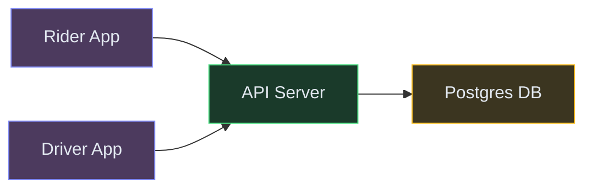

**How this breaks:**

- Querying "nearest driver" in Postgres with lat/lng is a full table scan — won't work with 2M active drivers
- Single API server can't handle 500K+ location pings per second from all active drivers
- No way to push ride offers to drivers — polling is too slow for a 10-second matching window
- If two riders request simultaneously and the same driver is "nearest," both get assigned → double-booking
- No real-time tracking — rider has no idea where the driver is after matching
- Single DB is a write bottleneck for millions of location updates per second

The rest of the doc evolves this into a production-grade real-time matching and tracking system.

---

## 1.7. Prior Art We're Drawing From

- **Uber Ringpop** — Consistent hash ring for partitioning driver locations by geohash region. Each node owns a geographic shard, enabling local proximity queries without global coordination. ([Uber Engineering Blog](https://www.uber.com/blog/ringpop-open-source-nodejs-library/))
- **Uber H3** — Hierarchical hexagonal grid system for geospatial indexing. Replaces traditional geohash with uniform-area hexagons that avoid edge distortion. Used for surge pricing zones and supply-demand balancing. ([Uber H3](https://www.uber.com/blog/h3/))
- **Lyft Marketplace Dispatch** — Scoring-based matching that considers not just distance but ETA, driver heading, and predicted rider wait time. Two-phase: filter nearby candidates, then rank by composite score. ([Lyft Engineering](https://eng.lyft.com/matchmaking-in-lyft-line-9c2635fe62c4))
- **Grab GrabNearby** — Redis Geo + geohash for sub-10ms proximity queries on 2M+ active drivers in Southeast Asia. Location TTL ensures stale drivers auto-expire. ([Grab Engineering](https://engineering.grab.com/))
- **Google S2 Geometry** — Hilbert curve-based spatial indexing used internally at Google Maps and adopted by multiple ride-sharing platforms for region-based sharding and proximity search.

---

## 2. Functional Requirements

### Core (Top 3)

1. **Riders request a ride** — enter pickup and destination, get matched with the nearest available driver within 30 seconds
2. **Real-time location tracking** — drivers send GPS updates every 3-5 seconds; riders see live driver position during ride
3. **Drivers accept/decline rides** — receive ride offers with pickup details, navigate to rider, start/complete trip

### Below the Line

- Ride fare estimation before booking
- Payment processing and driver payouts
- Rating system (rider rates driver and vice versa)
- Ride history and receipts
- Scheduled rides (book for later)
- Ride sharing / carpooling (UberPool)

---

## 3. Non-Functional Requirements

### Core

| NFR | Target |
|---|---|
| **Matching latency** | Rider matched with driver in < 30 seconds |
| **Location ingestion** | Handle 2M+ drivers sending pings every 3-5 seconds (500K-700K writes/sec) |
| **Availability** | 99.99% during peak hours — a down matching service means no rides |
| **Consistency** | Strong consistency on driver assignment — no double-booking (one driver = one active ride) |

### Below the Line

- ETA accuracy within 2 minutes of actual arrival
- Sub-second location update delivery to riders (live tracking)
- Multi-region deployment for global coverage

---

## Technology Choices

| Tier | Purpose | Stores | Access Pattern | Primary | Alternatives |
|---|---|---|---|---|---|
| Location Store (hot) | Real-time driver positions | lat/lng per active driver | Geo-radius queries + point updates | Redis Geo (GEOADD/GEORADIUS) | PostGIS, ElasticSearch geo_point |
| Ride DB | Ride lifecycle state | Rides, assignments, fares | Read/write by rideId and userId | Postgres | CockroachDB, TiDB |
| Event Bus | Ride events and location fan-out | Events: requested, matched, started, completed | Pub/sub + ordered per ride | Kafka or Redpanda | Kinesis, Pub/Sub |
| Cache | Driver availability, ETAs | Driver status, precomputed ETAs | High-QPS reads, TTL-based expiry | Redis Cluster | Memcached |
| Real-time Delivery | Push location to riders | WebSocket messages | Fan-out per active ride | WebSocket Gateway + Redis Pub/Sub | SSE, gRPC streaming |
| Analytics Store | Trip history, pricing signals | Historical rides, demand patterns | Batch reads, time-series | ClickHouse or BigQuery | Redshift, Druid |
| Object Store | Receipts, invoices | PDFs | Batch generation, rare reads | S3 | GCS, MinIO |

**Why Redis Geo, not Postgres with PostGIS?**
We're handling 500K+ location updates per second. Redis Geo uses an in-memory sorted set with geohash encoding — O(log N) inserts and O(N+log M) radius queries where M is total items and N is results. PostGIS would require disk I/O on every update and query. Redis gives us sub-millisecond proximity search, which is essential for the 30-second matching SLA.

**Why Kafka for ride events?**
A single ride generates 8-10 state transitions (requested → matched → driver_enroute → arrived → started → completed). Multiple services consume these: billing, notifications, analytics, ETA. Kafka's consumer groups let each service process independently without blocking others.

---

## 4. Core Entities

- **Rider** — account, payment methods, saved addresses, current location
- **Driver** — account, vehicle info, availability status (online/offline/on-trip), current location
- **Ride** — pickup, destination, status, assigned driver, fare, timestamps (state machine)
- **Location** — driverId, lat/lng, heading, speed, timestamp (ephemeral — lives in Redis)
- **Fare** — base fare, distance component, time component, surge multiplier, total
- **Zone** — geographic region for surge pricing (H3 hexagon or geohash prefix)

---

## 5. API / System Interface

```text
POST /api/v1/rides/request
  Body: { pickupLat, pickupLng, destLat, destLng, rideType: "STANDARD"|"PREMIUM" }
  Response: { rideId, estimatedFare, estimatedETA, status: "MATCHING" }
  Auth: JWT Bearer token (rider)
  Note: Idempotency via clientRequestId header

POST /api/v1/rides/{rideId}/accept
  Body: { driverId }
  Response: { status: "DRIVER_ENROUTE", driver: { name, vehicle, eta } }
  Auth: JWT Bearer token (driver)

POST /api/v1/rides/{rideId}/complete
  Body: { endLat, endLng }
  Response: { fare, receipt }
  Auth: JWT Bearer token (driver)

PUT /api/v1/drivers/location
  Body: { lat, lng, heading, speed, timestamp }
  Response: 204 No Content
  Auth: JWT Bearer token (driver)
  Note: Called every 3-5 seconds by driver app. Fire-and-forget.

WebSocket /ws/v1/rides/{rideId}/track
  Pushes: { driverLat, driverLng, heading, eta, updatedAt }
  Auth: JWT ticket in connection params
```

---

## 6. High-Level Design

### FR1: Riders Request a Ride and Get Matched

The first thing that happens when a rider opens the app is they enter a destination and tap "Request Ride." The system needs to find the nearest available driver within seconds and assign them to this ride — without double-booking.

**New components we need:**

1. **API Gateway** — Entry point for all client requests. Handles JWT auth, rate limiting, and request routing.
2. **Ride Service** — Manages the ride lifecycle (state machine). Creates the ride, assigns drivers, tracks state transitions.
3. **Matching Service** — The brain of the system. Finds nearby available drivers, ranks them, and assigns the best one.
4. **Location Service** — Stores and queries real-time driver GPS coordinates. This is the hot path — 500K writes/sec of location pings.
5. **Redis Geo** — The in-memory geospatial index. 💡 *Redis Geo stores coordinates using geohash encoding in a sorted set. GEORADIUS returns all members within a given radius of a point in O(N+log M) time — fast enough for real-time matching.*

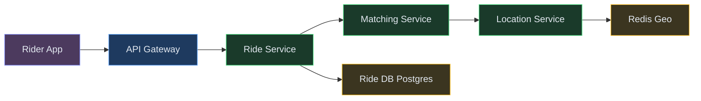

| Color | Meaning |
|---|---|
| 🟠 Purple-Orange | Client apps |
| 🔵 Blue | Edge / Gateway |
| 🟢 Green | Backend services |
| 🟡 Yellow | Data stores |
| 🟣 Purple | Async (Kafka) |
| 🔴 Pink | External services |

**Step-by-step flow:**

1. Rider taps "Request Ride" with pickup (current GPS) and destination → request hits API Gateway
2. Gateway validates JWT, checks rate limits, forwards to Ride Service
3. Ride Service creates a ride record in Postgres with status `MATCHING` and calls Matching Service
4. Matching Service asks Location Service: "Give me all available drivers within 3km of this pickup point"
5. Location Service runs `GEORADIUS` on Redis Geo → returns 15 drivers sorted by distance
6. Matching Service filters for availability (checks driver status in Redis cache — are they already on a trip?) and ranks top 5 by ETA
7. Matching Service picks the best driver and attempts to **lock** them (distributed lock — Deep Dive 2)

**Why not just pick the closest driver?**

Distance alone isn't enough. A driver 500m away stuck in traffic might have a 12-minute ETA, while a driver 1.2km away on a highway has a 3-minute ETA. The matching service uses ETA (from the mapping API) as the primary ranking signal, not raw distance.

---

### FR2: Real-Time Location Tracking

Drivers send their GPS position every 3-5 seconds. This is the highest-throughput write path in the system — 2M active drivers × one ping every 4 seconds = ~500K writes/sec. We need to store these locations so the matching service can query them AND stream them to riders during active rides.

**New components we need:**

1. **Location Ingestion Service** — A stateless fleet of workers that receive driver pings and write to Redis Geo. Designed for pure throughput.
2. **Kafka** — Buffers location events for downstream consumers (ride tracking, analytics, ETA recalculation). 💡 *Using Kafka here decouples the write path (driver → Redis) from the read/fan-out path (Redis → rider). The driver app doesn't wait for the rider to receive the update.*
3. **WebSocket Gateway** — Maintains persistent connections with riders who are on active rides. Pushes real-time driver positions.

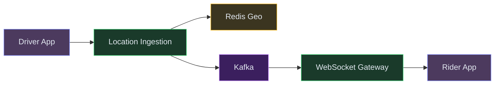

**Step-by-step flow:**

1. Driver app sends GPS ping every 3-5 seconds: `PUT /drivers/location` with lat, lng, heading, speed
2. Location Ingestion Service receives the ping (stateless — any instance handles any driver)
3. Service writes to Redis Geo: `GEOADD drivers:available {lng} {lat} {driverId}` — this updates the driver's position in the spatial index
4. Simultaneously, publishes the location event to Kafka topic `driver.locations`, partitioned by rideId (if on active ride) or by geohash region (if available)
5. For active rides: a Kafka consumer at the WebSocket Gateway picks up the event and pushes it to the rider's WebSocket connection
6. Redis entries have a TTL. 💡 *TTL (Time-To-Live) = automatic expiration. If a driver crashes or loses connectivity for >15 seconds, their entry expires and they disappear from matching queries. No stale ghost drivers.*

**Why Redis Geo over a regular database?**

At 500K writes/sec, no disk-based database survives. Redis is in-memory — a single shard handles ~100K operations/sec. With 6-8 shards (partitioned by geographic region), we comfortably handle the full load. Each `GEOADD` is O(log N) and `GEORADIUS` is O(N+log M) where N = results returned.

---

### FR3: Drivers Accept Rides and Complete Trips

Once matched, the driver gets a push notification with ride details. They have 15 seconds to accept. If they decline or timeout, the system moves to the next-best driver. After acceptance, the ride moves through a state machine: driver_enroute → arrived → trip_started → trip_completed.

**New components we need:**

1. **Notification Service** — Pushes ride offers to drivers and status updates to riders. Uses FCM/APNs for offline users, WebSocket for online.
2. **Pricing Service** — Calculates fares based on distance, time, and surge multiplier. Called at ride request (estimate) and ride completion (final fare).
3. **ETA Service** — Computes estimated time of arrival using mapping APIs (Google Maps, Mapbox, OSRM). Called during matching and continuously during the ride.

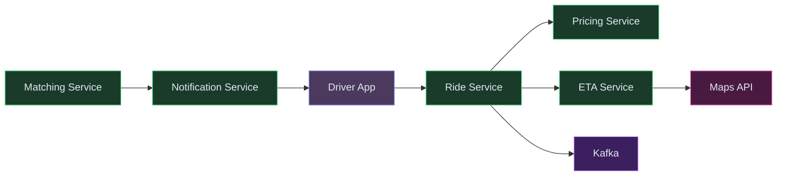

**Step-by-step flow:**

1. Matching Service selects the best driver and publishes `ride.offered` event
2. Notification Service pushes the offer to driver via WebSocket (or FCM if app is backgrounded): "New ride: Pickup at MG Road, 1.2km away, est. fare ₹350"
3. Driver has 15 seconds to accept. **Timer starts** (managed by Ride Service)
4. If driver accepts → Ride Service updates ride status to `DRIVER_ENROUTE`, removes driver from Redis Geo available pool, notifies rider
5. If driver declines or timeout → Matching Service picks next-best driver from the ranked list (retry up to 3 drivers)
6. During trip: Ride Service listens to `ride.started` and `ride.completed` events, calls Pricing Service for final fare calculation
7. On completion: Pricing Service computes fare = base + (distance × rate) + (time × rate) × surge_multiplier. Ride Service persists final state.

**Why a 15-second timeout?**

If we wait too long, the rider's experience suffers. If too short, drivers can't react. 15 seconds is the industry standard. After 3 failed attempts (45 seconds total), expand the search radius and try again. If still no match after 60 seconds, notify rider "No drivers available."

---

## 6.5. Core Flows

### Flow 1: Ride Request and Matching End-to-End

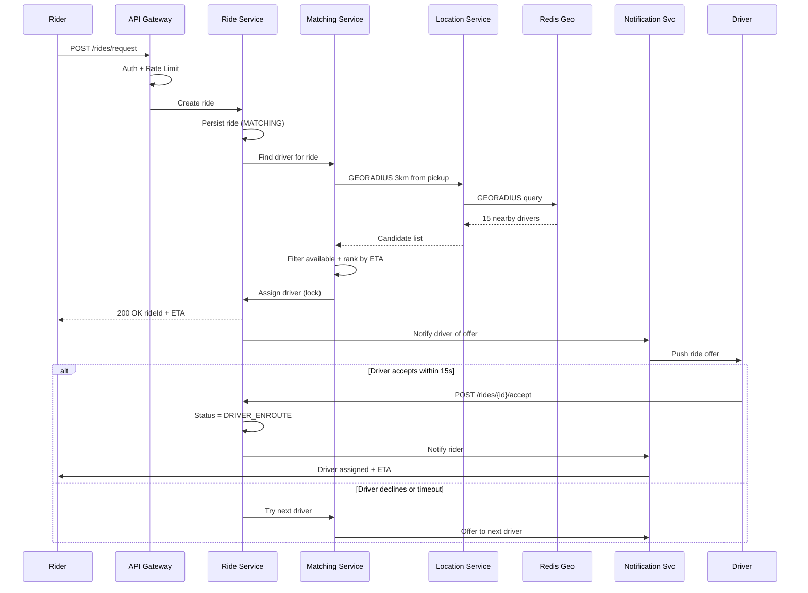

**Non-obvious failure path:** What if the Matching Service crashes after locking a driver but before notifying them? The lock has a TTL of 20 seconds. If no acceptance arrives, the lock auto-releases and the driver becomes available again. The Ride Service's reconciler detects rides stuck in `MATCHING` for > 30 seconds and re-triggers matching.

### Flow 2: Real-Time Location Streaming to Rider

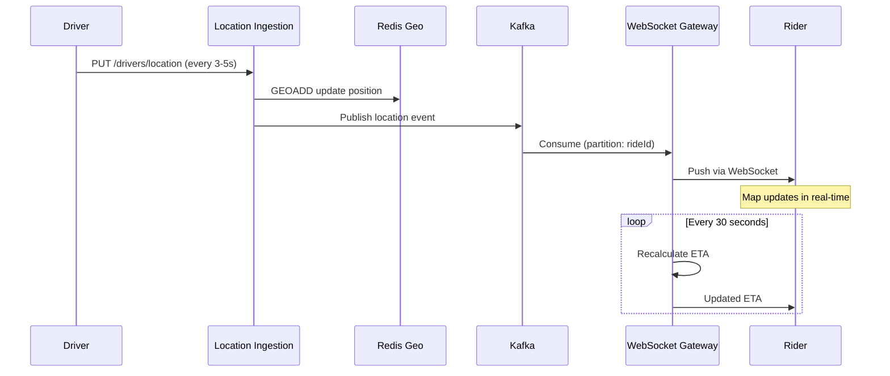

**Non-obvious failure path:** If the WebSocket connection drops (rider enters a tunnel), the gateway buffers the last 3 location updates. When the rider reconnects, it replays these so the map doesn't jump. If disconnected > 60 seconds, the rider app falls back to polling `GET /rides/{id}/status`.

### Ride Lifecycle State Machine

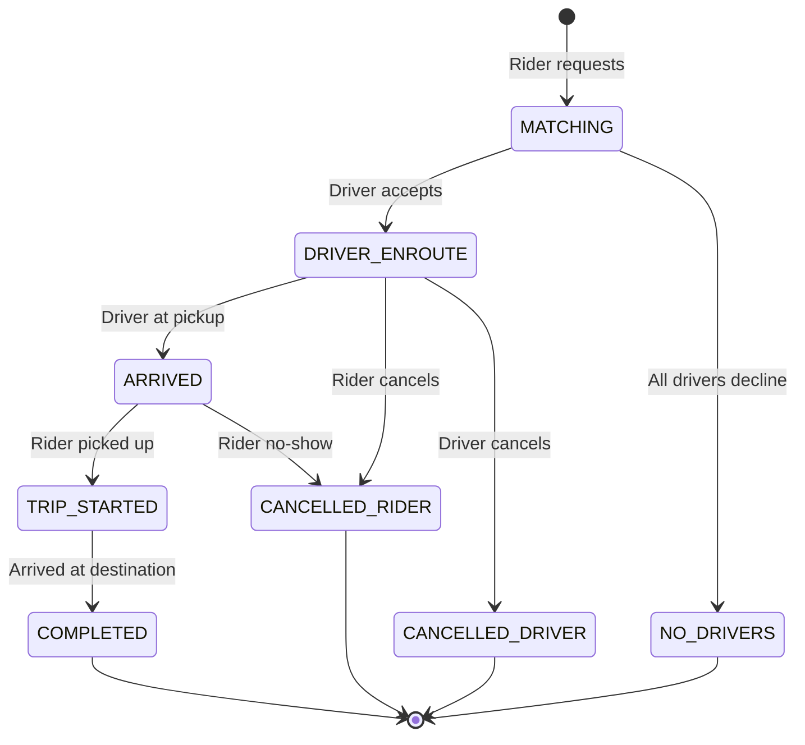

Each transition emits a Kafka event consumed by: Billing (fare calculation), Notifications (user updates), Analytics (supply-demand metrics), and the ETA service (recalculate).

---

## 7. Deep Dives

### Deep Dive 1: Storing and Querying Millions of Driver Locations Efficiently

**Problem:** 2M active drivers sending pings every 3-5 seconds = ~500K-700K writes/sec. We also need sub-50ms proximity queries ("find drivers within 3km").

**Bad:** Store locations in Postgres with a spatial index (PostGIS). Even with a GiST index, disk I/O on every write makes 500K writes/sec impossible without a massive (and expensive) cluster. Queries under load degrade to 100ms+.

**Good:** Redis Geo with a single instance per city. `GEOADD` for writes, `GEORADIUS` for queries. Fast, but a single Redis instance maxes at ~100K ops/sec and holds ~10M entries in 2-3GB RAM.

**Great:** Sharded Redis Geo, partitioned by geohash prefix. 💡 *Geohash encodes a 2D coordinate into a 1D string where nearby points share a common prefix. A geohash like "tdr1w" covers a ~5km² cell. We shard by the first 3-4 characters, so each shard owns a geographic region.*

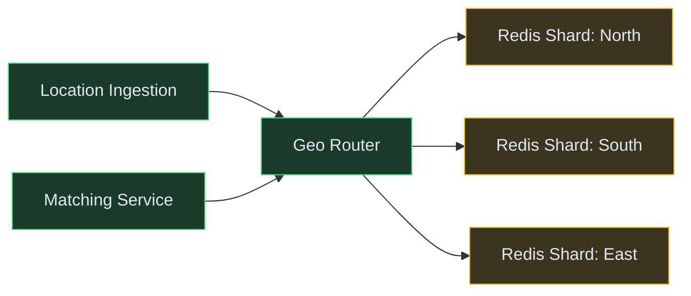

**Mechanism (borrowing from Grab's GrabNearby):**

1. Driver sends location → Ingestion Service computes geohash prefix (4 chars = ~20km² cell)
2. Geo Router maps prefix to the owning Redis shard (consistent hashing — like Uber's Ringpop)
3. `GEOADD city:available {lng} {lat} {driverId}` — O(log N) insert
4. Each entry has a TTL of 15 seconds. If no fresh ping arrives, the driver auto-expires (handles crashes, offline)
5. When Matching Service needs nearby drivers: computes geohash of pickup, queries the owning shard + adjacent shards (to handle cell boundary cases)
6. `GEORADIUS city:available {lng} {lat} 3000 m COUNT 20 ASC` — returns 20 nearest within 3km

**Scaling math:** With 2M drivers across 8 shards, each shard holds ~250K entries (~500MB RAM). Each shard handles ~80K ops/sec. Total capacity: 640K ops/sec — comfortably above our 500K requirement.

**Edge case — cell boundaries:** A rider at the edge of geohash cell "tdr1" might have the nearest driver in cell "tdr2." Solution: always query the target shard + 8 neighboring cells. This means up to 3 shard queries per match request, but they run in parallel (sub-10ms total).

---

### Deep Dive 2: Preventing Double-Booking (Distributed Locking)

**Problem:** Two riders request simultaneously. Both see Driver X as the nearest available. Without protection, both rides get assigned to Driver X → double-booking.

**Bad:** Check-then-act in application code (`if driver.available then assign`). Race condition between the check and the assignment. Two processes both see "available" and both assign.

**Good:** Database-level optimistic locking with a version column. `UPDATE drivers SET ride_id = ? WHERE id = ? AND ride_id IS NULL`. Only one UPDATE succeeds (returns rowcount=1). The other gets rowcount=0 and retries with next driver. Works but adds a DB round-trip in the hot path.

**Great:** Redis distributed lock with fence tokens. 💡 *A distributed lock is a mechanism where only one process can "hold" a key at a time. A fence token is a monotonically increasing number that prevents stale locks from causing harm — if a process holds token 5 but the lock has moved to token 6, its writes are rejected.*

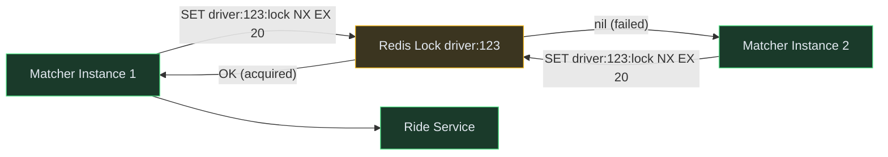

**Mechanism:**

1. Matching Service picks Driver X as best candidate
2. Attempts `SET driver:{driverId}:lock {rideId} NX EX 20` in Redis
   - `NX` = only set if not exists (atomic check-and-set)
   - `EX 20` = auto-expire in 20 seconds (prevents deadlock if matcher crashes)
3. If lock acquired (OK response) → proceed with assignment, notify driver
4. If lock not acquired (nil response) → skip this driver, try next candidate
5. When driver accepts: Ride Service confirms the assignment in Postgres (strong consistency) and removes the lock
6. If driver declines or 15s timeout: lock is explicitly released, driver returns to available pool

**Backstop:** Even if Redis lock fails (network partition), the Postgres `UPDATE rides SET driver_id = ? WHERE id = ? AND status = 'MATCHING'` acts as a second gate. The DB has a unique constraint on (driver_id, status='ACTIVE') preventing any double-assignment at the persistence layer.

**Why not Redlock?**

Redlock (Redis distributed lock across N nodes) adds latency and complexity. For ride matching, a single Redis lock with short TTL + Postgres backstop is sufficient. The worst case of a stale lock is a 20-second delay (lock expires), not a correctness violation.

---

### Deep Dive 3: Handling Peak Demand (Surge Pricing + Queue Management)

**Problem:** Friday night, 10PM. Demand spikes 5x but driver supply stays constant. Without intervention: matching times spike to 5+ minutes, riders rage-quit, drivers get overwhelmed with pings.

**Bad:** First-come-first-served with no price adjustment. All riders compete for the same small pool of drivers. Most riders wait indefinitely. Drivers in adjacent zones don't know there's demand nearby.

**Good:** Simple surge multiplier (2x, 3x) shown to riders before confirming. Discourages some demand, incentivizes nearby drivers to relocate. But: how do you calculate the surge factor? Fixed zones break at city boundaries.

**Great:** Dynamic surge pricing using H3 hexagonal zones with real-time supply-demand signals. (Borrowing from Uber's H3 system.)

**Mechanism:**

1. City is divided into H3 hexagons (resolution 7 = ~5km² cells). 💡 *H3 is Uber's open-source hexagonal grid system. Unlike square geohash cells, hexagons have uniform adjacency (every neighbor is equidistant) — better for spatial analysis.*
2. Every 30 seconds, a **Surge Calculator** job runs per zone:
   - `demand_score` = ride requests in last 2 minutes / available drivers in zone
   - If demand_score > 1.5 → surge multiplier = 1.0 + (demand_score - 1.0) × 0.5 (capped at 3.0x)
3. Surge multiplier is shown to rider before they confirm. Some riders wait, reducing demand naturally.
4. Drivers see a heat map of surge zones → incentivized to drive toward high-demand areas (supply redistribution)
5. When demand drops, surge decays gradually (not instantly) to prevent oscillation

**Queue management during extreme peaks:**

- If no driver is available within 5km even with surge: ride enters a **waiting queue**
- Rider is shown position in queue and estimated wait time
- As drivers complete trips in the zone, they're immediately offered queued rides (priority over new requests)
- If wait exceeds 5 minutes, expand search radius to 8km with surge pricing as incentive for farther drivers

**Backstop:** Circuit breaker on the matching service. If matching failure rate exceeds 80% for > 60 seconds in a zone, temporarily halt new ride requests in that zone and show "No drivers available — try again in a few minutes" rather than queuing indefinitely.

---

### Deep Dive 4: Real-Time Location Streaming to Riders (WebSocket + Pub/Sub)

**Problem:** During an active ride, the rider needs to see the driver's position update every 3-5 seconds on the map. With 1M concurrent rides, that's 1M WebSocket connections each receiving 200-300 messages per ride.

**Bad:** Rider polls `GET /rides/{id}/driver-location` every 2 seconds. At 1M rides, that's 500K HTTP requests/sec just for tracking. Wastes bandwidth, adds 2-second latency, burns server CPU on connection setup.

**Good:** One WebSocket per rider, server pushes location. But: how does the location event (arriving at Location Ingestion Service) get routed to the correct WebSocket Gateway instance holding that rider's connection?

**Great:** Kafka-partitioned fan-out + Redis Pub/Sub for last-mile delivery. 💡 *Fan-out = delivering one event to multiple subscribers. Here the "fan" is narrow (one rider per ride), but the routing is the challenge — which server holds the connection?*

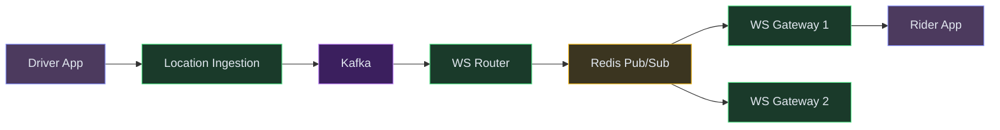

**Mechanism:**

1. When a rider connects via WebSocket for ride tracking, the gateway registers `(rideId → gatewayInstanceId)` in Redis
2. Driver sends location ping → Location Ingestion → publishes to Kafka topic `ride.tracking`, partitioned by rideId
3. WS Router consumes from Kafka, looks up which gateway instance owns the rider's connection (from Redis registry)
4. Publishes to Redis Pub/Sub channel `ride:{rideId}:location`
5. The specific gateway instance subscribed to that channel receives it, pushes to rider's WebSocket
6. Total latency: driver GPS → rider map = 200-400ms (network + Kafka + Redis Pub/Sub + WebSocket push)

**Scaling WebSocket connections:**

- Each gateway instance holds ~100K concurrent connections (limited by file descriptors and RAM)
- 10 gateway instances = 1M concurrent rides covered
- Horizontal scaling: add more gateway instances behind a load balancer (sticky sessions by rideId)
- Connection registry in Redis enables any gateway to find any connection

**Fallback for disconnection:**
- If rider WebSocket drops, buffer last 5 location points in Redis (LIST with LTRIM)
- On reconnect, replay buffered points for smooth map animation
- If disconnected > 30 seconds, rider app switches to HTTP polling as graceful degradation

---

### Deep Dive 5: ETA Calculation and Route Optimization

**Problem:** The rider needs accurate ETA both at matching time ("driver arrives in 4 minutes") and during the trip ("arriving at destination in 12 minutes"). Calling Google Maps API for every location update (500K/sec) would cost $millions/month and add latency.

**Bad:** Straight-line distance / average speed. "2km away = 4 minutes." Completely wrong in urban areas with one-way streets, traffic, and construction.

**Good:** Call Google Maps Directions API for each match request. Accurate but expensive ($5-10 per 1000 requests). At 100K rides/day, that's $500-1000/day just for matching ETAs. Plus it adds 200-400ms latency per call.

**Great:** Precomputed ETA grid + real-time traffic adjustment + selective API calls.

**Mechanism:**

1. **Precomputed ETA grid:** Divide city into H3 cells. Pre-calculate travel time between every pair of adjacent cells at different times of day (morning rush, afternoon, night). Store in Redis as a lookup table. Cost: one-time batch computation.
2. **On match request:** Look up source cell → destination cell ETA from grid. Adjust by real-time traffic multiplier (from driver speed data in the last 5 minutes).
3. **Selective external API calls:** Only call Google Maps / Mapbox for:
   - Long trips (> 10km) where grid approximation is inaccurate
   - Rides that cross city boundaries (precomputed grid doesn't cover)
   - Initial rider-facing ETA estimate (user-visible, accuracy matters)
4. **During ride:** Update ETA every 30 seconds using remaining distance on route / average speed of last 2 minutes. No external API call needed.

**Traffic adjustment from driver data:**

- Every driver ping includes speed. Aggregate average speed per road segment per 5-minute window.
- If drivers on MG Road are averaging 8 km/h (instead of the usual 30 km/h), multiply ETA for routes through MG Road by 3.75x.
- This gives us live traffic data for free — from our own driver fleet.

**Cost comparison:**
- Naive (Google Maps for everything): ~$1500/day for a city with 100K rides/day
- Hybrid approach: ~$150/day (API calls only for 10% of rides) — 90% cost reduction

---

## 7.5. Design Self-Audit

| Question | Answer |
|---|---|
| Dedicated search index? | Not needed — riders don't text-search for drivers. Geo-proximity is handled by Redis Geo |
| Stale reads after writes? | Driver availability is eventually consistent (3-5s lag from location ping frequency). Acceptable — matching retry handles it |
| Single points of failure? | Redis Geo shards have replicas with automatic failover. Matching Service is stateless, horizontally scaled. Ride DB uses Postgres primary + synchronous standby |
| Dead-letter / reconciliation? | Rides stuck in MATCHING > 60s are re-processed by reconciler. Failed notifications go to DLQ with 3 retries |
| Data freshness across caches? | Location in Redis has 15s TTL — stale drivers auto-expire. Ride status propagates via Kafka events (200-500ms lag) |
| Cost at scale? | Redis Geo (8 shards × r6g.large) ≈ $2000/month. Kafka (6 brokers) ≈ $3000/month. WebSocket Gateways (10 instances) ≈ $2000/month. Google Maps API (reduced 90%) ≈ $4500/month. Total hot-path infra: ~$12K/month for a city with 2M drivers |

---

## 8. Final Architecture

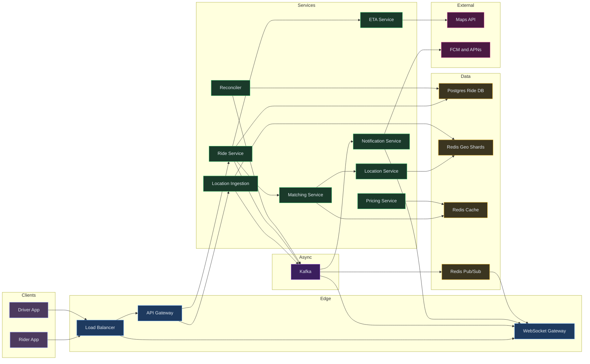

---

*Want a deep dive on carpooling matching (UberPool), payment splitting, or driver incentive algorithms? Drop a comment below 👇*

---
## 🎯 Key Takeaways

- **Redis Geo** with geohash sharding handles 500K location pings/sec
- **Distributed lock with TTL** prevents double-booking drivers
- **WebSocket + Kafka** for real-time location streaming to riders
- **Surge pricing** uses H3 hexagonal zones with supply/demand signals

---
## Related Designs
- [Food Delivery (Zomato)](/Zomato) — similar geo-matching, dispatch, live tracking
- [Notification System](/NotificationSystem) — multi-channel push delivery
- [Job Scheduler](/JobScheduler) — delayed triggers, timeout management
