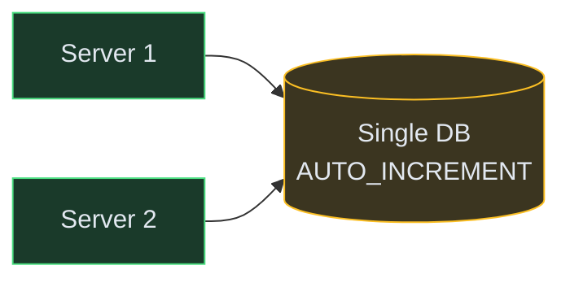
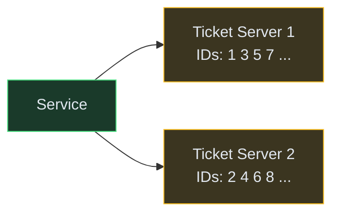
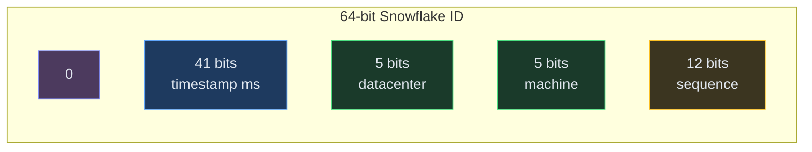
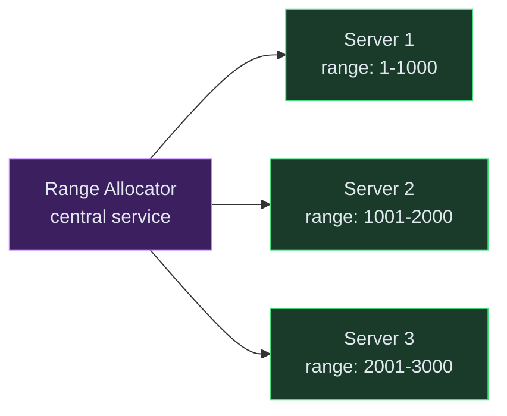
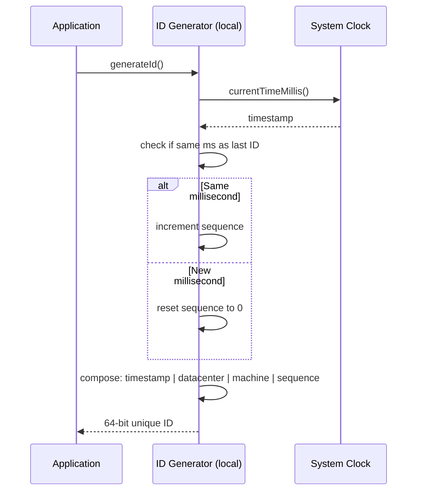

# Designing a Distributed Unique ID Generator

**Difficulty:** Beginner
**Prerequisites:** [Fundamentals](/concepts) - especially [Back-of-Envelope Estimation](/concepts#back-of-envelope-estimation)
**Asked at:** Twitter, Discord, Instagram, Amazon, Flipkart

---

## TL;DR

Every distributed system needs unique IDs - for users, orders, messages, posts. A single auto-increment DB column breaks at scale. This design explores 4 approaches: UUID, database sequences, Snowflake IDs, and range-based allocation.


**In 2 sentences:** Generate globally unique, roughly time-sorted, 64-bit IDs without a single point of failure. Twitter's Snowflake approach (timestamp + machine ID + sequence) is the industry standard for most use cases.

---

## Understanding the Problem

Almost every system needs unique identifiers. User IDs, order IDs, message IDs, transaction IDs - they must be globally unique across all servers, ideally sortable by creation time, and generated with extremely low latency (< 1ms). The challenge is generating these at scale (10K-100K IDs/sec) across multiple machines without coordination or collisions.

---

## Prior Art We're Drawing From

- **Twitter Snowflake** - The original distributed ID generator. 64-bit IDs composed of timestamp + datacenter + machine + sequence. Open-sourced in 2010, now the de facto standard. ([Twitter Engineering Blog](https://blog.twitter.com/engineering/en_us/a/2010/announcing-snowflake))
- **Instagram Sharded IDs** - Modified Snowflake using Postgres schemas to embed shard information into IDs. Generates IDs at the DB layer without a separate service. ([Instagram Engineering](https://instagram-engineering.com/sharding-ids-at-instagram-1cf5a71e5a5c))
- **Discord Snowflakes** - Twitter Snowflake adapted for Discord with epoch starting at Discord's launch date. Used for messages, users, channels. ([Discord Developer Docs](https://discord.com/developers/docs/reference#snowflakes))
- **MongoDB ObjectId** - 12-byte ID with timestamp + random + counter. No central coordination needed. Demonstrates the random + counter hybrid approach. ([MongoDB Docs](https://www.mongodb.com/docs/manual/reference/method/ObjectId/))

---

## Naive First Cut



Just use `AUTO_INCREMENT` in a single MySQL/Postgres table.

**Why this breaks:**

- Single point of failure - if the DB goes down, no service can generate IDs
- Bottleneck - all ID generation is serialized through one DB
- Can't scale horizontally - adding more app servers doesn't help, the DB is the limit
- Sequential and guessable - exposes total count, easy to scrape
- Cross-datacenter latency - if services are in multiple regions, every ID requires a round-trip to one DB

The rest of the doc explores 4 production-ready alternatives.

---

## Functional Requirements

### Core

1. **Generate globally unique IDs** - no two IDs should ever collide across all services and servers
2. **IDs must be 64-bit numeric** - fits in a long/bigint, can be used as primary keys and sorted efficiently
3. **Roughly time-ordered** - IDs generated later should be larger than IDs generated earlier (enables range queries and chronological sorting)

### Below the Line

- Human-readable (short URLs, display-friendly)
- Cryptographically unpredictable
- Embeddable shard/partition information
- Custom epoch support

---

## Non-Functional Requirements

| NFR | Target |
|---|---|
| **Throughput** | 10K-100K IDs/sec per node |
| **Latency** | < 1ms per ID generation |
| **Availability** | 99.999% - ID generation cannot be a single point of failure |
| **Uniqueness** | Zero collisions, ever, across all nodes |

---

## Core Entities

- **ID** - the 64-bit unique identifier itself
- **Node** - a machine/process that generates IDs (identified by a machine ID)
- **Timestamp** - millisecond-precision time component within the ID
- **Sequence** - per-node counter that resets each millisecond

---

## The 4 Approaches

### Approach 1: UUID

```text
550e8400-e29b-41d4-a716-446655440000
```

128-bit random identifier. No coordination needed - any server can generate one independently.

| Pros | Cons |
|------|------|
| Zero coordination | 128 bits (too large for primary key, bad index performance) |
| Any node generates independently | Not sortable by time |
| Zero collisions (practically) | Not human-friendly |
| Simple to implement | Fragmented B-tree indexes (random order) |

**Verdict:** Use for cases where time-ordering doesn't matter and you don't need compact IDs (e.g., idempotency keys, distributed trace IDs).

---

### Approach 2: Database Ticket Server

Two (or more) databases that hand out IDs from disjoint ranges.



Server 1 increments by 2 starting at 1. Server 2 increments by 2 starting at 2. No collisions.

| Pros | Cons |
|------|------|
| Simple to understand | Still requires DB round-trip per ID |
| Numeric, sortable | Adding a 3rd server requires changing the step (breaks existing pattern) |
| Flickr used this at scale | Not truly time-ordered across servers |

**Verdict:** Works for small-medium scale. Flickr used this pattern. But inflexible when adding/removing nodes.

---

### Approach 3: Snowflake (Industry Standard)

A 64-bit ID composed of multiple fields packed into a single long integer.

```text
| 1 bit unused | 41 bits timestamp | 5 bits datacenter | 5 bits machine | 12 bits sequence |
```



**How it works:**

1. **41 bits for timestamp** - milliseconds since a custom epoch (e.g., Twitter uses Nov 4, 2010). Gives ~69 years of IDs before overflow.
2. **5 bits datacenter ID** - supports 32 datacenters
3. **5 bits machine ID** - supports 32 machines per datacenter (1024 total nodes)
4. **12 bits sequence** - counter per millisecond per machine. Supports 4096 IDs/ms/machine = **4 million IDs/sec per machine**

**Why this is great:**

- No coordination - each machine generates independently using its own machine ID
- Time-sorted - IDs increase over time (timestamp is the most significant bits)
- 64-bit - fits in a bigint, great index performance
- High throughput - 4M IDs/sec per node without any network calls
- Unique - machine ID + sequence guarantees no collision within the same millisecond

| Pros | Cons |
|------|------|
| No coordination at runtime | Requires machine ID assignment (one-time setup via ZooKeeper or config) |
| Time-sorted | Clock skew between machines can cause non-monotonic ordering |
| 64-bit, compact | 69-year lifespan (enough for most systems) |
| 4M IDs/sec/node | Need NTP sync to prevent clock drift |

**Clock skew handling:** If the system clock moves backward (NTP correction), either wait until the clock catches up, or refuse to generate IDs until the clock advances past the last timestamp used. Twitter's Snowflake logs an error and waits.

---

### Approach 4: Range-Based Allocation

A central service pre-allocates ID ranges to application servers. Each server generates IDs from its range without further coordination.



**How it works:**

1. Central allocator (backed by a DB) hands out ranges of 1000 or 10000 IDs at a time
2. Each app server increments locally within its range - zero network calls per ID
3. When a range is exhausted, fetch a new range from the allocator
4. If a server crashes mid-range, those unused IDs are simply wasted (acceptable)

| Pros | Cons |
|------|------|
| Very fast (local increment) | IDs not time-sorted across servers |
| Simple implementation | Wasted IDs on server crash |
| Central allocator is low-QPS (called rarely) | Allocator is still a SPOF (mitigate with replicas) |
| Used by Google Spanner | Not as compact as Snowflake |

---

## Comparison Table

| Approach | Bits | Time-sorted | Coordination | Throughput/node | Best for |
|----------|------|-------------|--------------|-----------------|----------|
| UUID | 128 | ❌ | None | Unlimited | Trace IDs, idempotency keys |
| Ticket Server | 64 | Partial | DB per ID | ~10K/sec | Small-medium scale |
| **Snowflake** | **64** | **✅** | **None at runtime** | **4M/sec** | **Most use cases** |
| Range Allocation | 64 | ❌ (within node only) | Rare (per range) | Unlimited | Sharded DBs, Google Spanner |

---

## Recommended: Snowflake Implementation

For most interview answers, Snowflake is the go-to. Here's the generation flow:



**No network calls. No DB lookups. Pure local computation.**

---

## Deep Dives

### Deep Dive 1: Machine ID Assignment

**Problem:** Each node needs a unique machine ID (10 bits = 1024 possible). How do you assign these without collisions? If two machines accidentally get the same ID, they'll generate duplicate IDs.

**In simple terms:** Before a machine can start generating IDs, it needs a name tag (its machine ID). We need to make sure no two machines wear the same name tag.

**Bad:** Hardcode machine IDs in config files. "Server A = machine 1, Server B = machine 2." Error-prone — someone deploys a new server and forgets to update the config. Doesn't work with auto-scaling (Kubernetes spinning up pods dynamically).

**Good:** Use ZooKeeper or etcd. Each node, on startup, connects to ZooKeeper and claims the next available sequential ID via an ephemeral node. If the node crashes, ZooKeeper detects the missing heartbeat and releases the ID for reuse.

**How it works step by step:**
1. Node starts up → connects to ZooKeeper
2. Creates an ephemeral sequential node: `/id-generators/machine-0007`
3. Reads its sequence number (7) → that's its machine ID
4. If the node crashes, ZooKeeper auto-deletes the ephemeral node
5. Next node to start gets the recycled ID

**Great:** Use the network interface MAC address or container hostname hash to derive a machine ID. No external dependency at all.

**How it works:**
1. Take the machine's MAC address (unique per network card): `AA:BB:CC:DD:EE:FF`
2. Hash it: `hash("AA:BB:CC:DD:EE:FF") % 1024` → machine ID = 547
3. On startup, register this ID in a shared store (Redis or DB) to verify no collision
4. If collision detected (extremely rare) → fall back to random + retry

**Trade-off:** ZooKeeper approach is safer (guarantees uniqueness) but adds an external dependency. MAC-based is simpler but theoretically collision-possible (hash collisions). In practice, most companies use ZooKeeper/etcd because they already run it for other coordination tasks.

---

### Deep Dive 2: Clock Skew

**Problem:** NTP (the protocol that syncs your system clock with the internet) can adjust the clock backward. If timestamp decreases, two IDs could have the same timestamp + sequence = collision.

**In simple terms:** Imagine your clock shows 10:05, then suddenly jumps back to 10:03 (because NTP realized it was 2 minutes ahead). Now the ID generator thinks it's 10:03 again and might generate the same IDs it made the first time at 10:03. Duplicate IDs.

**Bad:** Ignore it. Hope clocks are always correct. "NTP adjustments are rare." True — but when it happens, you get duplicate IDs in your database, corrupt data, and a very bad day debugging.

**Good:** Detect backward clock movement. The generator tracks `lastTimestamp` (the timestamp it used for the most recent ID). Before generating a new ID, check: `if currentTime < lastTimestamp → REFUSE to generate. Wait until the clock catches up.`

**How it works:**
1. Generator keeps `lastTimestamp = 10:05:00.123`
2. Next call: `currentTime = 10:04:59.900` (clock went back!)
3. Generator detects: current < last → clock skew!
4. Options: (a) spin-wait doing nothing until `currentTime >= lastTimestamp`, or (b) throw an error and let the caller retry later
5. Once clock catches up, resume normal generation

**Downside:** During the wait, no IDs are generated. If the clock was adjusted back by 5 seconds, you have 5 seconds of downtime for that node.

**Great:** Use a logical clock component. Instead of waiting, "borrow from the future" by continuing to increment the sequence counter even though the timestamp hasn't advanced. Eventually the real clock catches up and things normalize.

**How it works:**
1. Clock goes back → keep using `lastTimestamp` (the old, higher value)
2. Keep incrementing the sequence counter (normally resets each millisecond, but now it keeps growing)
3. If sequence overflows (hits 4096) → then you must wait (no choice)
4. In practice, a 1-2 second clock adjustment only "borrows" ~4096 sequences — well within limits

**What Twitter's Snowflake actually does:** Logs an error to alert ops, then waits. They chose simplicity over cleverness — a few milliseconds of waiting is better than complex "borrowing" logic that's hard to reason about.

---

### Deep Dive 3: Scaling Beyond 4M IDs/sec

**Problem:** One Snowflake node generates 4M IDs/sec (4096 per millisecond). What if you need 100M/sec? (e.g., a messaging platform generating IDs for every single message across billions of conversations)

**In simple terms:** One machine can make 4 million IDs per second. What if that's not enough? How do you get 100 million per second?

**Bad:** Make the sequence field larger (e.g., 16 bits = 65536/ms). But this steals bits from the timestamp, reducing the 69-year lifespan to ~4 years. Or steals from machine ID, reducing max nodes from 1024 to 64.

**Good:** Run multiple Snowflake instances. The bit layout already supports 1024 machines (10 bits for datacenter + machine). Deploy 25 machines × 4M/sec each = 100M/sec. Each machine has a unique ID, so no collisions.

**How it works:**
1. Deploy 25 ID generator instances (each with a unique machine ID)
2. Put them behind a load balancer
3. Services request IDs from any instance (round-robin)
4. Each instance generates 4M/sec independently
5. Total throughput: 25 × 4M = 100M/sec
6. Zero coordination between instances at runtime

**Great:** For extreme scale beyond 1024 machines, use the range-based approach as a hybrid. A central allocator hands out blocks of Snowflake machine IDs dynamically. Each "micro-generator" thread gets its own machine ID from the pool, generates IDs locally, and returns the machine ID when done.

**When is this needed?** In practice, almost never. Even Twitter at peak (~140K tweets/sec + internal IDs) only needed a handful of Snowflake nodes. The 4M/sec per node limit is extremely generous. Most companies never hit it.

---

## Interview Cheat Sheet

| Question | Answer |
|---|---|
| "Why not UUID?" | 128 bits, not sortable, bad index performance. Use when time-ordering isn't needed. |
| "Why not auto-increment?" | Single DB bottleneck, SPOF, can't scale horizontally, sequential = guessable. |
| "What's Snowflake?" | 64-bit ID = timestamp(41) + datacenter(5) + machine(5) + sequence(12). No coordination. 4M IDs/sec/node. |
| "How is uniqueness guaranteed?" | Unique machine ID ensures no two nodes produce the same bits. Sequence resets per millisecond per node. |
| "What about clock skew?" | Detect backward movement, wait until clock catches up. Or use logical clock. |
| "How to assign machine IDs?" | ZooKeeper, etcd, or derive from MAC/hostname hash with collision check. |
| "Is it truly globally unique?" | Yes - as long as machine IDs are unique and clocks don't go backward without detection. |

---

## What's Expected at Each Level

### Mid-level

Know that auto-increment doesn't scale. Propose UUID or Snowflake. Explain the Snowflake bit layout and why 64-bit time-sorted IDs are preferred over 128-bit random UUIDs for database primary keys. Understand the trade-offs table.

### Senior

Drive the discussion on clock skew handling, machine ID assignment strategies, and when to choose Snowflake vs range-based allocation. Discuss the index performance implications of random vs sequential IDs. Know that Twitter, Discord, and Instagram all use Snowflake variants.

### Staff+

Discuss multi-region ID generation with region bits, capacity planning for the 69-year timestamp limit, and hybrid approaches for extreme throughput. Address the operational burden of ZooKeeper for machine ID assignment vs stateless alternatives. Cover how Snowflake IDs leak creation time (privacy concern for some products).

---

## 🎯 Key Takeaways

- **Auto-increment is the naive solution** - breaks at scale, SPOF, guessable
- **Snowflake is the industry standard** - 64-bit, time-sorted, no coordination, 4M IDs/sec/node
- **UUID when ordering doesn't matter** - trace IDs, idempotency keys
- **Range allocation for extreme scale** - Google Spanner pattern, trades ordering for simplicity
- **Clock skew is the main operational risk** - detect and wait is the standard mitigation

---

## Related Designs

- [URL Shortener](/hld/URLShortner) - uses Base62 ID generation for short links
- [Pastebin](/hld/Pastebin) - unique ID generation for paste URLs
- [Key-Value Store](/hld/KeyValueStore) - consistent hashing uses similar partitioning concepts


---

## Related Concepts

Understand the building blocks used in this design:

- [Consistent Hashing →](/concepts/consistent-hashing/) — assigns ID ranges or worker nodes so generators never collide
- [Leader Election →](/concepts/leader-election/) — coordinates the authority that hands out node IDs and epochs
- [Database Replication →](/concepts/database-replication/) — durably persists allocated ID ranges so restarts don't reissue IDs
