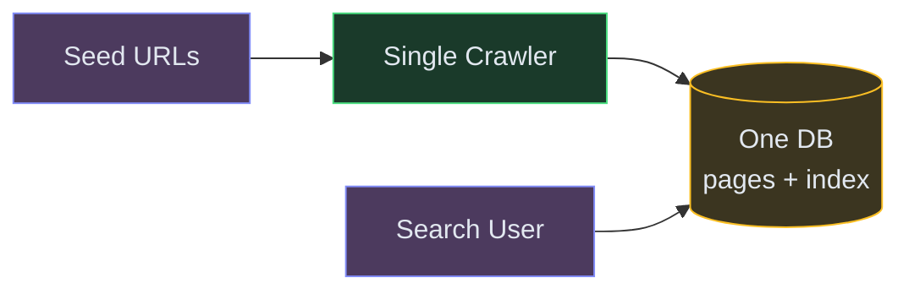
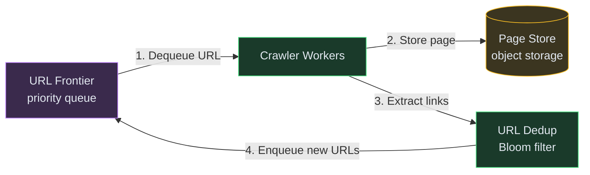
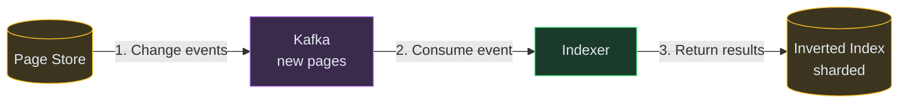
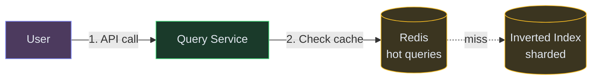

# Designing a Web Crawler and Search Engine

**Difficulty:** Advanced
**Prerequisites:**[Message Queues](/concepts/message-queues/), [Consistent Hashing](/concepts/consistent-hashing/), and [Bloom Filters](/concepts/bloom-filters/)

---

## Understanding the Problem

Two coupled systems: a **crawler** that discovers and downloads billions of web pages, and a **search service** that indexes that content and answers user queries in milliseconds. The hard parts: crawling politely without hammering any single site, avoiding re-crawling unchanged content, building a massive inverted index, and serving ranked results at sub-200ms latency.

---

## Naive First Cut



Why this breaks:
- Single crawler — at 1 page/sec, crawling 10B pages takes 317 years
- No URL deduplication — the same page is fetched thousands of times via different links
- No politeness — hammering a single domain causes your IP to be blocked
- One database can't hold billions of documents AND serve as a search index
- No ranking — results are returned in insertion order, not by relevance

---

## Functional Requirements

### Core (top 3)
1. **Crawl the web** — discover, download, and store web pages at scale (1B+ pages)
2. **Build an inverted index** — map every word to the pages that contain it
3. **Serve search queries** — return the top 10 most relevant results for a query in <200ms

### Below the Line
- Image/video indexing, real-time freshness (news), autocomplete, personalization, ads

---

## Non-Functional Requirements

- **Crawl throughput** — 10K pages/second sustained
- **Index freshness** — popular pages re-crawled within hours; long-tail within weeks
- **Query latency** — <200ms P99 for search results
- **Politeness** — respect robots.txt; max 1 request/second per domain

---

## Core Entities

- **URL** — address to crawl, domain, last crawled timestamp, crawl priority
- **Page** — raw HTML content, extracted text, outgoing links, content hash
- **Inverted Index Entry** — word → list of (page ID, position, frequency)
- **Query** — user search terms, results with relevance scores

---

## API

```text
POST /v1/crawl/seed
  Body: { urls: ["https://example.com", ...] }
  Response: { queued: 150 }

GET /v1/search?q=distributed+systems&page=1
  Response: { results: [{ url, title, snippet, score }], total: 15000, took: "45ms" }

GET /v1/crawl/status
  Response: { pagesIndexed: 1200000000, crawlRate: "9800 pages/sec" }
```

---

## High-Level Design

### FR1: Crawl the Web

A URL Frontier (priority queue) feeds URLs to a distributed fleet of Crawler workers. Each worker downloads the page, extracts links (new URLs fed back to the frontier), and stores content.



### FR2: Build the Inverted Index

An Indexer reads crawled pages, tokenizes content, and builds the inverted index. The index maps each word to a posting list (pages containing that word, with positions and frequency).



### FR3: Serve Search Queries

The Query Service receives a user query, looks up each term in the inverted index, intersects posting lists, scores results by relevance (TF-IDF + PageRank), and returns top-K.



---

## Deep Dives

### Deep Dive 1: URL deduplication — avoiding redundant crawls

**Bad:** Maintain a hash set of all visited URLs in memory. At 10B URLs × 100 bytes each = 1TB of RAM. Doesn't fit on a single machine. Also, the same page can be reached via different URLs (trailing slashes, query params, anchors).

**Good:** Use a Bloom filter for fast membership testing (probabilistic: may say "seen" for an unseen URL, but never misses a seen one). False positive rate of 1% at 10B URLs needs ~12GB — fits in memory. Normalize URLs (lowercase, remove fragments, sort params) before checking.

**Great:** Combine the Bloom filter with content-based dedup. After downloading a page, compute a SimHash (locality-sensitive hash) of the content. Two pages with similar content (mirror sites, syndicated articles) get the same SimHash — dedup at the content level, not just URL level. This eliminates near-duplicate pages that have different URLs but identical content, reducing index bloat by 30-40%.

### Deep Dive 2: Politeness and crawl rate management

**Bad:** All crawler workers hit the same popular domain simultaneously. The site's servers overload, they block your IP, and you lose access to that domain's content entirely.

**Good:** Enforce per-domain rate limiting: max 1 request/second per domain. The URL Frontier maintains a per-domain queue with a "not-before" timestamp. Workers pick the next URL whose domain is eligible to be crawled. Respect `robots.txt` (fetch and cache it per domain, honor `Crawl-delay` directives).

**Great:** Use a two-level frontier. Back queue: per-domain queues with rate limiting (politeness). Front queue: priority queue that selects which domain to crawl next based on importance (PageRank of domain, freshness requirements). This ensures high-value domains (news sites, Wikipedia) are crawled frequently while staying polite. Assign each worker a set of domains via consistent hashing — this ensures DNS caching efficiency and persistent connections per worker-domain pair.

### Deep Dive 3: Search ranking — beyond simple TF-IDF

**Bad:** Rank by keyword frequency (TF-IDF only). SEO spammers stuff keywords into pages and dominate results. Irrelevant but keyword-rich pages rank above authoritative sources.

**Good:** Combine TF-IDF with PageRank — a page's authority is proportional to the number and quality of pages linking to it. This boosts authoritative sources (Wikipedia, official docs) above spam. PageRank is computed offline as a batch job over the link graph.

**Great:** Multi-signal ranking: TF-IDF (text relevance) + PageRank (authority) + freshness (prefer recent content for time-sensitive queries) + click-through rate (learn from user behavior over time). The scoring formula is a weighted combination, tuned via ML. For query latency, pre-compute static scores (PageRank) and combine with query-time scores (TF-IDF) during serving. Cache results for popular queries (top 1% of queries account for 30% of traffic) with a 1-minute TTL.

---

## What's Expected at Each Level

| Level | Expectations |
|---|---|
| **Mid** | URL Frontier + crawler fleet. Bloom filter for dedup. Inverted index concept. Basic TF-IDF ranking. Robots.txt politeness. |
| **Senior** | Per-domain rate limiting with two-level frontier. Content-based dedup (SimHash). PageRank for authority. Index sharding by term or document. |
| **Staff+** | Consistent hashing for worker-domain affinity. Multi-signal ML ranking. Incremental index updates (not full rebuild). Freshness-based re-crawl prioritization. Cache strategy for query serving. |
