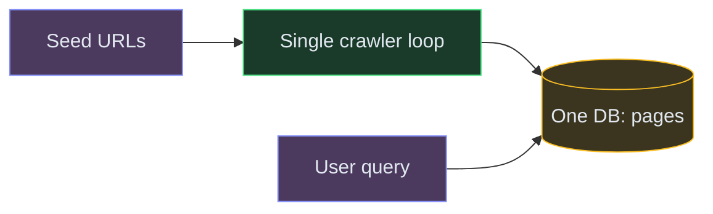

# Designing a Web Crawler & Search Engine (Google-scale)

**Difficulty:** Advanced **Topics:** Distributed Crawling, Inverted Index, Dedup, Ranking, Frontier Queue **Asked at:** PhonePe, Google, Amazon, Microsoft
**Prerequisites:**[Message Queues](/concepts/message-queues/), [Consistent Hashing](/concepts/consistent-hashing/), and [Bloom Filters](/concepts/bloom-filters/)

---

## 1. Understanding the Problem

Two coupled systems: a **crawler** that discovers and downloads web pages at massive scale and stores their content, and a **query service** that indexes that content and answers user searches in milliseconds. The hard parts: crawling billions of pages politely (without hammering any one site), avoiding re-crawling the same content, building and updating an inverted index, and serving ranked results fast.

**Real examples:** Googlebot + Google Search, Bing, and internal enterprise search. This is a repeatedly reported **PhonePe SDE-2 HLD** question, usually split as "part 1: the crawler service, part 2: the serving service."

---

## 1.5. Naive First Cut

One process pulls a URL, downloads it, saves HTML, extracts links, repeats. Queries scan the pages table.

**Why this breaks:**

- One machine can't crawl billions of pages - throughput is hopelessly low.
- No dedup - the same page/content gets fetched and stored repeatedly.
- No politeness - it would hammer a single domain and get blocked.
- Scanning HTML for a search term is O(all pages) - no inverted index, no ranking.
- No recrawl strategy - content goes stale; no way to prioritize important pages.

The rest of the doc evolves this into a distributed, deduplicated crawler feeding an inverted index behind a fast query service.

---

## 1.7. Prior Art We're Drawing From

- **Google's Mercator / Googlebot** - A URL "frontier" that balances politeness (per-host rate limits) with priority (important pages crawled more often), plus content fingerprinting to skip duplicates. ([The Anatomy of a Search Engine](http://infolab.stanford.edu/~backrub/google.html))
- **Apache Nutch / Hadoop** - Open-source distributed crawler + indexer that partitions the frontier and index across many nodes. ([Apache Nutch](https://nutch.apache.org/))
- **Elasticsearch / Lucene inverted index** - The core serving primitive: term → posting list of documents, with BM25 relevance scoring. ([Lucene](https://lucene.apache.org/))
- **Bloom filters for "seen URL" checks** - A space-efficient membership test to avoid re-enqueuing already-crawled URLs across billions of them. ([Bloom filter deep dive](/concepts/bloom-filters/))

---

## 2. Technology Choices

| Tier / Purpose | What it stores | Access pattern | Primary pick | Alternatives |
|---|---|---|---|---|
| URL frontier | pending URLs + priority | enqueue / dequeue | **Kafka** + Redis (per-host queues) | RabbitMQ, SQS |
| Seen-URL / dedup | crawled URL + content hashes | membership test | **Redis + Bloom filter** | RocksDB |
| Raw page store | fetched HTML | write-once, batch read | **S3 / object store** | HDFS, GCS |
| Metadata store | url, status, lastCrawled, hash | point + range | **Cassandra** | Bigtable, DynamoDB |
| Inverted index | term -> postings | full-text query | **Elasticsearch** | Lucene, Solr |
| Query cache | hot query results | key lookup | **Redis** | Memcached |

**Why Cassandra for page metadata, not a relational DB:** metadata is write-heavy (every fetch updates status/hash), keyed by URL, and needs to scale to tens of billions of rows across a cluster with no single primary. Wide-column stores are built for exactly this; we don't need joins here. Raw HTML goes to cheap object storage, not a DB.

💡 *URL frontier = the prioritized set of URLs waiting to be crawled - the crawler's to-do list, sharded by host for politeness.*

---

## 3. Functional Requirements

**Core (top 3):**
1. Crawl: given seed URLs, discover and download reachable pages, extracting new links.
2. Index: parse downloaded pages into an inverted index (term → documents).
3. Query: return relevant pages ranked by relevance for a search string.

**Below the line:** rendering JS-heavy pages, image/video search, personalization, spam/SEO defense, freshness SLAs per site.

## 4. Non-Functional Requirements

**Core:**
1. **Scale:** billions of pages; crawl throughput of thousands of pages/sec.
2. **Politeness:** respect `robots.txt` and per-host rate limits - never overload a domain.
3. **Query latency:** < 200ms p99 for search.
4. **Fault tolerance:** a crawler node dying must not lose URLs or re-crawl everything.

**Below the line:** strict real-time freshness, exactly-once crawling (at-least-once + dedup is fine).
