# Designing a Food Delivery Service Like Zomato / Uber Eats / DoorDash

⚡ **Difficulty:** Intermediate–Advanced
📋 **Prerequisites:** [Fundamentals](/concepts) - especially [Geospatial Indexing](/concepts#geospatial-indexing), [Message Queues](/concepts#message-queues), and [Real-Time Communication](/concepts#real-time-communication-websocket-vs-sse-vs-polling)

---

## TL;DR

A food delivery platform connects customers, restaurants, and riders. The system handles search (Elasticsearch), ordering (Postgres), live rider tracking (Redis Geo + WebSocket), and dispatch matching (Temporal workflow).

💡 *Elasticsearch is a search engine optimized for full-text search, filtering, and faceted queries. It indexes data in inverted indexes for sub-100ms search across millions of documents.*

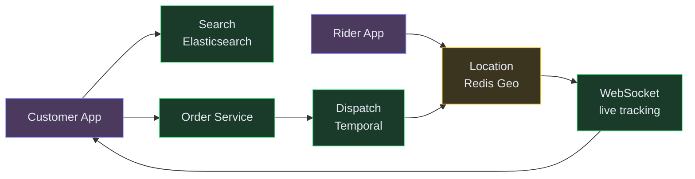

| Color | Layer |
|---|---|
| 🟠 Orange | Clients |
| 🔵 Blue | Edge |
| 🟢 Green | Services |
| 🟣 Purple | Async / Streaming |
| 🟡 Yellow | Data |
| 🩷 Pink | External |


**In 3 sentences:** Customer searches for restaurants (Elasticsearch with geo + relevance scoring), places an order (Postgres with idempotency), and the system finds a nearby rider (Redis Geo for proximity, Temporal for the multi-step dispatch workflow). The rider's live location streams to the customer via WebSocket. Each component is independently scalable.

💡 *WebSocket is a persistent two-way connection. Unlike HTTP (ask → answer → done), WebSocket stays open so the server can push updates instantly. [Learn more →](/concepts#real-time-communication-websocket-vs-sse-vs-polling)*

---

## Understanding the Problem

🍔 **What is Zomato?** Zomato (known as Uber Eats or DoorDash in the US) is an on-demand food delivery platform that connects customers with nearby restaurants. Customers browse menus, place orders, pay, and watch their food travel from the restaurant to their door via a delivery partner.

---

## Prior Art We're Drawing From

- **DoorDash Dispatch** - Builds assignment algorithms that balance delivery time, driver earnings, and restaurant readiness. Uses ML models for ETA prediction and dynamic batching. ([DoorDash Engineering](https://doordash.engineering/))
- **Uber Eats Marketplace** - Three-sided marketplace (eaters, restaurants, couriers) with real-time dispatch using geospatial indexing. Open-sourced Cadence for workflow orchestration. ([Uber Engineering](https://www.uber.com/blog/engineering/))
- **Swiggy Search** - Elasticsearch-based restaurant discovery with personalized ranking, geolocation filtering, and real-time availability. Handles 50K+ QPS during peak hours. ([Swiggy Engineering](https://bytes.swiggy.com/))
- **Grab GrabNearby** - Redis Geo for sub-10ms rider proximity queries across Southeast Asia. Location TTL ensures stale drivers auto-expire. ([Grab Engineering](https://engineering.grab.com/))

---

## Functional Requirements

### Core Requirements
1. Customers should be able to search for nearby restaurants and browse their menus.
2. Customers should be able to place an order and pay for it.
3. The system should dispatch the order to an available delivery partner and let the customer track it in real time.

### Below the line (out of scope)
- Ratings and reviews for restaurants and riders
- Promotions, coupons, loyalty programs
- Scheduled / group orders
- Restaurant onboarding and menu management tooling
- Multi-restaurant carts

## Non-Functional Requirements

### Core Requirements
- **Low latency** for search and order placement: search < 300 ms P95, order placement < 1 s P95.
- **Strong consistency** for order state and payment - no double charges, no two riders assigned to one order.
- **High throughput at peak** - dinner rush in a metro can generate 100K+ orders/hour and 200K+ live rider GPS streams.
- **Real-time tracking** - rider location visible to the customer within 2 seconds of each update.

### Below the line
- Fine-grained access control, GDPR/DPDP compliance
- Disaster recovery with multi-region failover
- CI/CD and zero-downtime deploys
- Full observability stack

## Scale Estimation (Back-of-Envelope)

- **Users:** 20M DAU, 200K peak concurrent
- **Write QPS:** 200K rider location writes/sec (200K active riders × 1 ping/sec during peak)
- **Read QPS:** 50K search queries/sec (20M DAU × ~10 searches/day concentrated in dinner rush)
- **Storage:** ~500GB orders DB/year (100K orders/hour peak × order metadata)
- **Bandwidth:** ~2 Gbps at peak (search responses + tracking WebSocket streams)

---

## Core Entities

- **Customer** - user placing the order.
- **Restaurant** - merchant with a menu and operating hours.
- **Menu Item** - a dish belonging to a restaurant, with price and availability.
- **Order** - a confirmed request linking a customer, a restaurant, and items, with lifecycle state.
- **Delivery Partner (Rider)** - the person physically delivering the order; has a live location.
- **Payment** - the financial transaction tied to an order.

---

## API / System Interface

```
GET  /v1/restaurants?lat=<>&lng=<>&q=<>        → Restaurant[]
GET  /v1/restaurants/:id/menu                  → Menu
POST /v1/orders                                → Order
     Body: { restaurantId, items, addressId, paymentMethod }
     Header: Idempotency-Key: <uuid>
POST /v1/riders/location                       → 200
     Body: { lat, lng }
     (riderId comes from JWT, never trust the body)
PATCH /v1/rides/:rideId                        → Ride
     Body: { accept | decline }
GET  /v1/orders/:id/track                      → WebSocket stream
```

Security: every endpoint requires a JWT. `customerId`, `riderId`, and server-side amounts must never be taken from the client body.

---

## High-Level Design

Let's build up the design by walking through each functional requirement.

### 1) Customers can search restaurants and browse menus

Customer opens the app → hits our backend through an API Gateway → a Restaurant Service returns a list of nearby restaurants filtered by location, cuisine, and availability.

**New components we need:**

1. **API Gateway** - authenticates users, applies rate limits, and routes to the right service. Every request passes through here first.
2. **Restaurant Service** - handles restaurant listings and menus. Reads from the database and returns results filtered by location and availability.
3. **Restaurants and Menus DB** - stores restaurant info, operating hours, and menu items. The source of truth for catalog data.

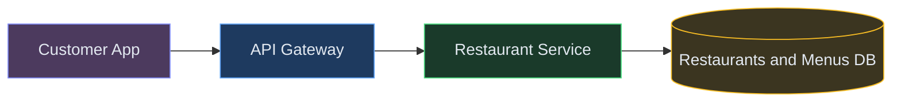

### Color Legend


**Step-by-step flow:**

1. Customer opens the app and types "biryani" → app calls `GET /v1/restaurants?lat=12.9&lng=77.6&q=biryani`
2. API Gateway checks: valid JWT? Within rate limits? Good → forwards to Restaurant Service
3. Restaurant Service queries the database for restaurants near the customer's coordinates that serve biryani and are currently open
4. Customer picks "Hyderabad House" and taps it → app calls `GET /v1/restaurants/:id/menu` → same service returns the full menu with prices and availability

The naive version works for now - just a DB query. But at Zomato scale (500K restaurants, 50K search QPS), a raw database query melts. We'll evolve this into an Elasticsearch-powered search in the deep dives.

### 2) Customers can place and pay for an order

When the customer confirms a cart, we need to create an order, charge them, and move on to dispatch. We add an Order Service and a Payment Service.

**New components we need (in addition to the ones above):**

1. **Order Service** - the order lifecycle manager. Creates orders, validates carts, computes totals, and manages the order state machine from CREATED → DELIVERED.<br>💡 *This service is the single source of truth for "what's happening with my order?" - every state change goes through it.*
2. **Payment Service** - handles charging the customer. Wraps the payment gateway and manages the authorization + capture flow.
3. **Orders DB (Postgres)** - stores order state with strong consistency. We use Postgres because money is involved - ACID transactions prevent double-charges and lost orders.
4. **Payment Gateway (Razorpay, Stripe, UPI)** - the external service that actually moves money. We don't process cards ourselves - that would require PCI compliance.<br>💡 *The gateway is a "trusted intermediary" between us and banks.*

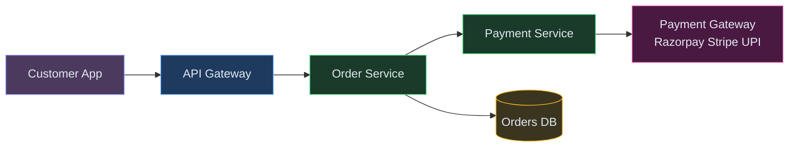

**Step-by-step flow:**

1. Customer confirms their cart → app calls `POST /v1/orders` with an `Idempotency-Key` (so accidental retries don't create double orders)
2. Order Service validates: Are all items still available? Is the restaurant still open? It computes the authoritative total itself - never trust the client's amount (clients can be tampered with)
3. Order Service calls Payment Service → which authorizes the charge through Razorpay/Stripe/UPI
4. On payment success → Order Service writes the order with status `CONFIRMED` to Postgres (one atomic transaction: order + payment record)
5. Customer sees "Order Confirmed! 🎉" - now the dispatch flow kicks in

**Why the idempotency key?** Indian mobile networks are flaky. The user's phone might retry the request when it loses signal for a second. Without an idempotency key, they'd get charged twice. With it, the second request returns the same response as the first - safe retries for free.

### 3) Match a rider and let the customer track the delivery

Now we introduce a Rider Client, a Location Service that receives live GPS pings, and a Ride Matching Service that picks a rider for each confirmed order. We also need a push channel so the rider gets notified immediately.

**New components we need (in addition to the ones above):**

1. **Location Service** - ingests live GPS pings from rider phones (every 3-5 seconds) and stores them. The "where is everyone right now?" service.
2. **Location Store (Redis Geo)** - holds live rider positions in memory, sharded by city.<br>💡 *Redis Geo uses geohashing under the hood - it can answer "find all riders within 3km of this restaurant" in microseconds across 200K riders. [Learn more →](/concepts#geospatial-indexing)*
3. **Ride Matching Service** - finds the best available rider for a confirmed order. Queries nearby riders, scores them, and sends an offer.
4. **Notification Service** - pushes the ride offer to the rider's phone via FCM/APNs. Also notifies the customer about order updates.
5. **FCM / APNs** - Firebase Cloud Messaging and Apple Push Notification service. External services that deliver push notifications to rider phones, even when the app is backgrounded.

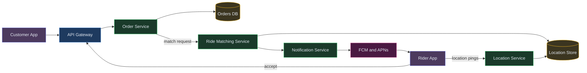

**Step-by-step flow:**

1. Riders' phones continuously stream GPS pings to the Location Service (adaptive: 30s when parked, 3-5s when moving). Location Service writes each ping to Redis Geo, keyed by city
2. Once the order hits `CONFIRMED`, the Order Service fires a "find me a rider" request to the Ride Matching Service
3. Matching Service queries Redis Geo: "Who's within 3km of Hyderabad House and currently available?" → gets a ranked list of candidates
4. Matching picks the best rider (closest + high acceptance rate + estimated pickup time) and sends them an offer via the Notification Service → rider's phone buzzes with "New delivery: Hyderabad House → 2.1km away"
5. Rider taps "Accept" → PATCH request comes in → Order Service updates state to `RIDER_ASSIGNED`
6. Customer's app opens a WebSocket connection for live tracking → sees the rider's blue dot moving toward the restaurant on a map

**Why Redis Geo instead of a regular database?** 200K riders × 1 ping every 4 seconds = 50K writes/sec. A traditional database would collapse under this write volume. Redis keeps everything in memory - writes are sub-millisecond - and its `GEOSEARCH` command answers "riders within 3km" in microseconds. Perfect for a read pattern that happens on every single order.

---

## Potential Deep Dives

### Deep Dive 1 - How do we handle 200K riders pinging their location every few seconds?

**In simple terms:** 200K delivery drivers are sending their GPS location every 4 seconds. That's 50K writes per second of tiny geo records. A normal database can't handle this volume.

**Problem.** 200K riders × 1 ping / 4s ≈ 50K writes/sec of tiny geo records. Standard databases (PostgreSQL, DynamoDB) would either fall over on write volume or cost a fortune. And we also need to answer "give me riders within 3 km of this point" fast - a lat/lng scan of millions of rows is a non-starter.

**Bad - store every ping in PostgreSQL with a B-tree on (lat, lng).**
Writes are O(log N) per insert and proximity queries require a full scan or a bounding-box lookup that's still O(N) in the worst case. B-trees don't understand two-dimensional data. Breaks under real load.

**Good - use PostGIS or a geospatial index.**
PostGIS adds R-tree / GiST indexes tuned for 2D queries. `ST_DWithin(point, rider_location, 3000)` gives you nearby riders in log N. Handles the read side, but writes at 50K/sec still hammer the DB and each write costs multiple disk IOs.

**Great - use Redis Geo for live positions, partitioned by city.**
Redis Geo (backed by sorted sets under the hood with geohash scoring) stores rider positions entirely in memory:
- `GEOADD riders:{city_id} <lng> <lat> <rider_id>` - O(log N) and well under a millisecond.
- `GEOSEARCH riders:{city_id} FROMLONLAT <lng> <lat> BYRADIUS 3 km COUNT 50` - returns nearby riders in tens of microseconds.

Sharding by `city_id` keeps each Redis shard small (say 10K riders) and evenly distributed. Riders don't cross city boundaries often.

Freshness over durability is the right tradeoff here - if Redis loses a few seconds of pings, the rider just shows up again on the next ping. We still tee every ping to Kafka for a durable history stream consumed by analytics and fraud detection, not by the matching hot path.

💡 *Kafka is a distributed event log. Producers append events, consumers read at their own pace. Perfect for decoupling services that produce data from those that consume it. [Learn more →](/concepts#message-queues)*

Client-side optimization matters too. Instead of dumb 5s intervals, the rider app can adapt:
- Stationary rider → 30s interval.
- Moving rider → 3-5s interval.
- Sharp turn or stop → immediate ping.

This alone cuts traffic by 60-70%.

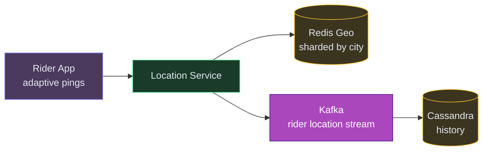

### Deep Dive 2 - How do we make sure one rider isn't offered the same order twice, and one order isn't offered to two riders at the same time?

**Problem.** Matching is a race. Multiple concurrent orders in the same area may see the same candidate rider at the top of their list. Without coordination we could double-book a rider, or send the same customer's order to two riders.

**In simple terms:** Two orders in the same area both see the same delivery driver as the 'best match.' Without coordination, both orders get assigned to the same driver. We need a lock.

**Bad - optimistically send to the top candidate, hope for the best.**
Under high concurrency this produces double-offers. Riders get confused, customers get delayed.

**Good - lock the rider with a Redis `SET NX PX`.**
Before sending an offer, try `SET offer:rider:{rider_id} <orderId> NX PX 10000`.
- `NX` = only set if no offer is currently out.
- `PX 10000` = 10-second window for the rider to accept.
If the lock fails, the rider is busy; move on to the next candidate. If the rider doesn't accept within 10 s, the key expires and someone else can offer.

This is the same "reserve a ticket at checkout" pattern from Ticketmaster.

**Great - add a fencing token to defend against late accepts.**
A rider might hit "accept" after the 10-second TTL expired and another order already locked them. Store a monotonic `offer_seq` as the lock value: `SET offer:rider:r1 "orderA:42" NX PX 10000`. The rider's accept request carries `offer_seq = 42`. On accept, the service runs a Lua compare-and-delete: only honor the accept if the current lock value still matches `orderA:42`. Late accepts are rejected cleanly.

This gives us strong consistency in matching without introducing a traditional database transaction on the hot path.

### Deep Dive 3 - Real-time updates for the customer tracking the order

**Problem.** The customer's map needs to show the rider moving smoothly. We can't have the app hammer the server with polling queries - at 20 million DAU, that's catastrophic.

**In simple terms:** The customer wants to see their delivery driver moving on the map in real-time. Polling the server every 2 seconds for 20M users = catastrophic load. We need push updates.

**Bad - short polling every 3 seconds.**
Easy to implement but means millions of wasted requests for orders that aren't moving, and 3-second lag feels laggy.

**Good - long polling or server-sent events (SSE).**
SSE gives one-way server → client push over a long-lived HTTP connection. Works well for pure read streams like live tracking. But iOS Safari support is flaky for SSE, and you lose the persistent connection during app backgrounding.

**Great - WebSocket from client to a WebSocket Gateway, Redis Pub/Sub behind it.**
- Customer app opens a WSS connection to our WebSocket Gateway.
- Gateway subscribes the connection to a Redis Pub/Sub channel `track:order:<id>`.
- Location Service publishes every rider ping for an active delivery to that channel.
- Gateway fans out the message to every subscribed customer on the same pod.

Consistent hashing at the edge routes all subscribers for one order to the same gateway pod, keeping Pub/Sub fan-out local. Supports millions of concurrent connections with a few hundred pods.

### Deep Dive 4 - What if no rider accepts? What if the gateway loses the accept?

**Problem.** This is a multi-step human-in-the-loop workflow. Any step can fail: rider doesn't respond, app crashes, phone loses signal, offer times out. We need to move on to the next rider automatically and never strand an order.

**In simple terms:** We sent a delivery offer to a rider. They didn't respond (phone died, went to bathroom). We need to automatically move to the next rider after a timeout without losing the order.

**Bad - best-effort timers in the matching service.**
If the matching service pod restarts mid-offer, the state is lost and the order hangs. Customer waits forever.

**Good - persist the matching state in a database and poll it with a worker.**
Matching state lives in a DB, a background worker looks for expired offers and triggers reassignment. Works but you're hand-rolling a workflow engine and retry logic, which is always more subtle than it looks.

**Great - use a durable workflow engine like Temporal (Cadence).**
The whole matching workflow is expressed as a Temporal workflow: "offer to top rider, wait 10s, if no accept, offer to next rider, repeat up to N times, then emit DispatchFailed." Temporal persists every step's state to its own storage. If any worker crashes, another worker picks up the exact same workflow at the exact same step - no custom retry code needed.

Uber themselves open-sourced Cadence for exactly this reason; food-delivery dispatch is the same class of problem.

### Deep Dive 5 - How do we search across 500K restaurants with text, filters, and ranking?

**Problem.** Zomato isn't just "tap the nearest pin" - customers type "biryani," filter by "pure veg, rating 4+, under ₹300," and expect relevant results in under 300ms. At 50K search QPS peak across a catalog of 500K restaurants with nested menu items, the requirements are: text search, faceted filters, geo constraint, custom ranking, and personalization, all at low latency.

**In simple terms:** Customers type 'biryani' and expect results in under 300ms, filtered by location, rating, price, and dietary preferences. A regular SQL query can't handle this complexity at speed.

**Bad - `WHERE name ILIKE '%biryani%' AND is_open = true` on Postgres.**
Full table scans. No relevance ranking. No typo tolerance - "biriyani" returns nothing. Facet counts (how many veg results? how many 4+ rated?) require a separate aggregation query per facet. Falls apart past 50 QPS.

**Good - Postgres full-text search with `tsvector` + PostGIS for geo.**
Adds a GIN-indexed `tsvector` column, handles stemming and basic relevance. Works for small catalogs. But:
- Ranking is rigid - hard to blend text relevance with distance, rating, and popularity.
- No out-of-the-box typo tolerance or edge n-grams for prefix matching as the user types.
- Facet counts still require separate `COUNT(*) GROUP BY` queries.
- Search traffic competes with OLTP writes on the same Postgres cluster.

**Great - Elasticsearch as a dedicated search index, fed by CDC.**
Elasticsearch is purpose-built for exactly this workload:
- **Inverted index + BM25** for fast text search with proper relevance.
- **Edge n-grams** for as-you-type suggestions ("piz" → "pizza").
- **Geo-point filter + distance scoring** built in.
- **`function_score` query** blends text relevance, distance, rating, popularity, and personalization into a single score in one query.
- **Aggregations** give you all facet counts in the same request.

Index structure - one document per restaurant with denormalized menu highlights:
```json
{
  "restaurant_id": "r_123",
  "name": "Pizza Hub",
  "name_ngram": "piz pizz pizza pizz hub",
  "cuisines": ["italian", "pizza"],
  "location": {"lat": 12.93, "lon": 77.61},
  "rating": 4.3,
  "price_range": 2,
  "is_open": true,
  "popular_items": ["margherita pizza", "garlic bread"],
  "popularity_score": 0.87
}
```

A query blends relevance + distance + rating in one shot:
```json
{
  "query": {
    "bool": {
      "filter": [
        { "geo_distance": { "distance": "5km", "location": { "lat": 12.9, "lon": 77.6 } } },
        { "term": { "is_open": true } },
        { "range": { "rating": { "gte": 4 } } }
      ],
      "must": [{ "match": { "name_ngram": "biryani" } }]
    }
  },
  "functions": [
    { "gauss": { "location": { "origin": "...", "scale": "2km" } } },
    { "field_value_factor": { "field": "popularity_score", "modifier": "sqrt" } }
  ],
  "score_mode": "sum"
}
```

**Keeping the index in sync.** Restaurants and menus live in the primary DB (Postgres or Mongo). We don't dual-write - that leads to drift. Instead, Debezium tails the DB's change log and publishes to a Kafka topic; a Kafka consumer materializes the search document and bulk-indexes it into Elasticsearch. End-to-end lag under 3 seconds is fine for a catalog that changes slowly.

💡 *CDC (Change Data Capture) watches the database transaction log and streams every insert/update/delete as an event - keeps other systems in sync without polling.*

**Adding a cache in front.** Popular queries (`"pizza near me"` in Bangalore CBD) repeat constantly. Cache the top results in Redis with a key like `search:{geohash5}:{query_hash}` and a 60-second TTL. Use single-flight / request coalescing on cache miss so a viral query doesn't stampede Elasticsearch.

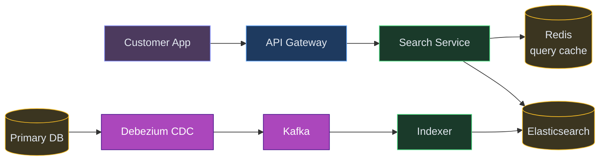

This is why a separate search tier matters: we get text, geo, facets, and relevance ranking in one system, decoupled from the OLTP database that owns the truth.

---

## Core Flows

Here's how each functional requirement plays out end-to-end across the system.

### Flow 1 - Search for nearby restaurants

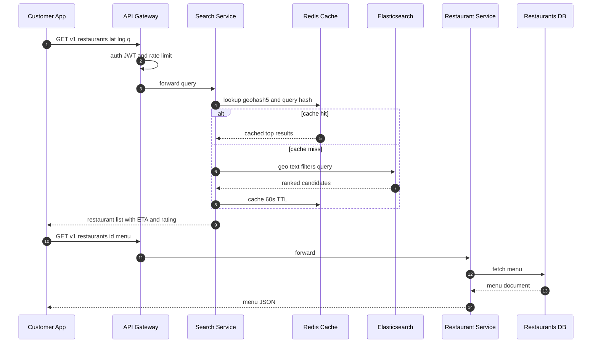

1. Gateway validates the JWT and applies per-user rate limits.
2. Search Service computes a cache key from a coarse geohash plus the query and filter fingerprint.
3. Cache miss hits Elasticsearch with a `function_score` query blending text relevance, geo distance, rating, and popularity in one shot.
4. Results are cached for 60 seconds with request coalescing to prevent stampedes on viral queries.
5. Customer picks a restaurant; client fetches the menu directly from the Restaurant Service.

### Flow 2 - Place and pay for an order

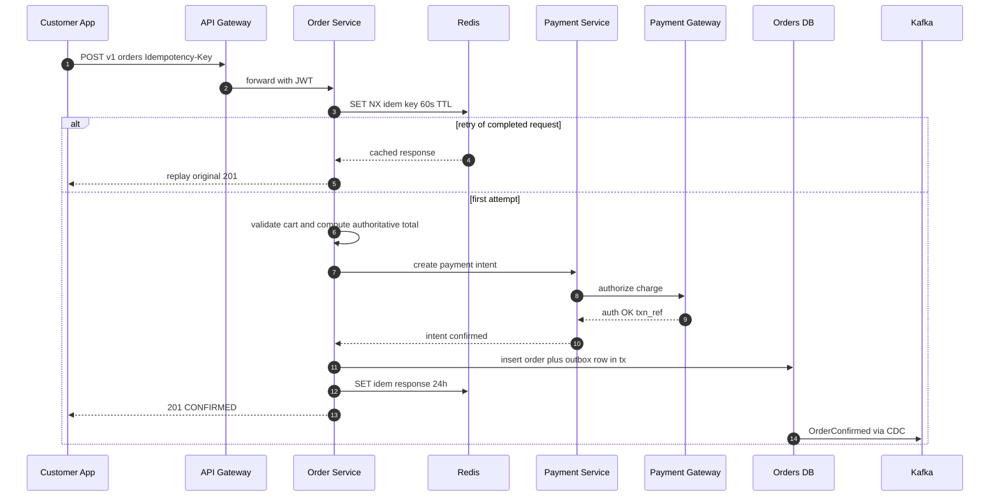

1. Client generates a UUIDv4 idempotency key tied to the cart. Retries reuse the same key.
2. Order Service checks Redis for the key; duplicate retries replay the cached response with no duplicate processing.
3. Server recomputes the total authoritatively - never trust a client-supplied amount.
4. Payment Service authorizes through the gateway. For UPI this is immediate; for 3DS cards the client finishes the extra step before capture.
5. Order row plus outbox row go in one Postgres transaction - either both land or neither does.
6. Debezium tails the WAL and publishes `OrderConfirmed` to Kafka for downstream services.

Failure worth calling out: if the gateway times out, the order stays in `PAYMENT_PENDING`. A reconciler polls the gateway every 5 minutes and either promotes to `CONFIRMED` or cancels with refund - gateway truth always wins.

### Flow 3a - Dispatch a rider

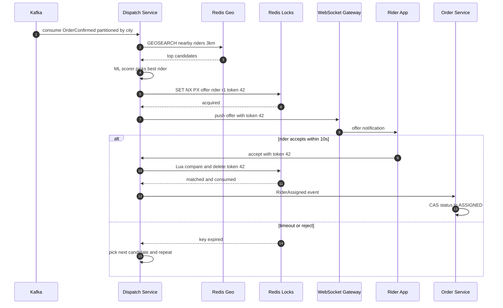

1. Dispatch consumes `OrderConfirmed` from a Kafka topic partitioned by `city_id` so one worker owns each city and there's no cross-worker race.
2. Redis Geo returns nearby riders; the ML scorer ranks them by distance, acceptance rate, and expected pickup time.
3. Before sending an offer, Dispatch grabs a per-rider lock carrying a fencing token - `SET offer:rider:r1 "orderA:42" NX PX 10000`.
4. Rider taps accept; the request carries the token. A Lua compare-and-delete verifies the token still matches. Mismatch means the offer expired and someone else owns the slot - clean rejection.
5. On timeout or reject, Dispatch picks the next candidate. After N unsuccessful rounds, escalate to ops or cancel with refund.

### Flow 3b - Live tracking

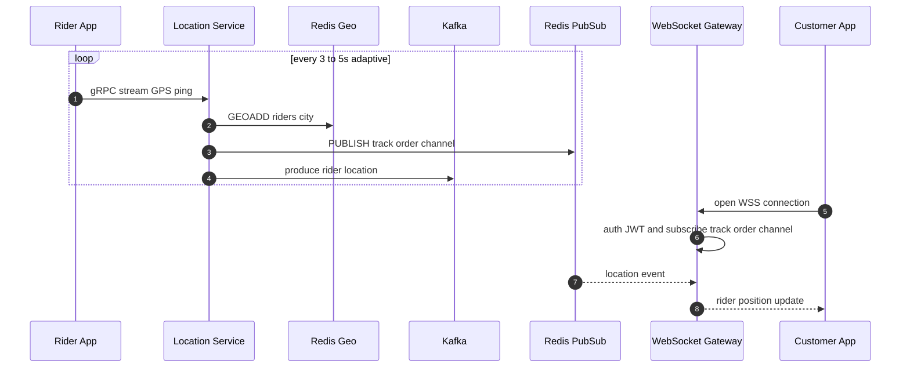

1. Rider app streams GPS pings over a long-lived gRPC connection. Intervals are adaptive - 30s when stationary, 3-5s moving, immediate on sharp turns. Cuts traffic by ~60%.
2. Location Service validates each ping, updates Redis Geo for the matching hot path, publishes to a Redis Pub/Sub channel for customer fan-out, and tees a copy to Kafka for history.
3. Customer opens tracking; WebSocket connects and subscribes to the order's channel.
4. Consistent hashing at the edge routes all subscribers for one order to the same gateway pod, keeping Pub/Sub fan-out local.
5. Kafka feeds the durable history tier (ClickHouse warm, S3 cold) for fraud, payouts, and ETA model training.

### Order state machine

For clarity, here's the full state progression driven by events from the flows above:

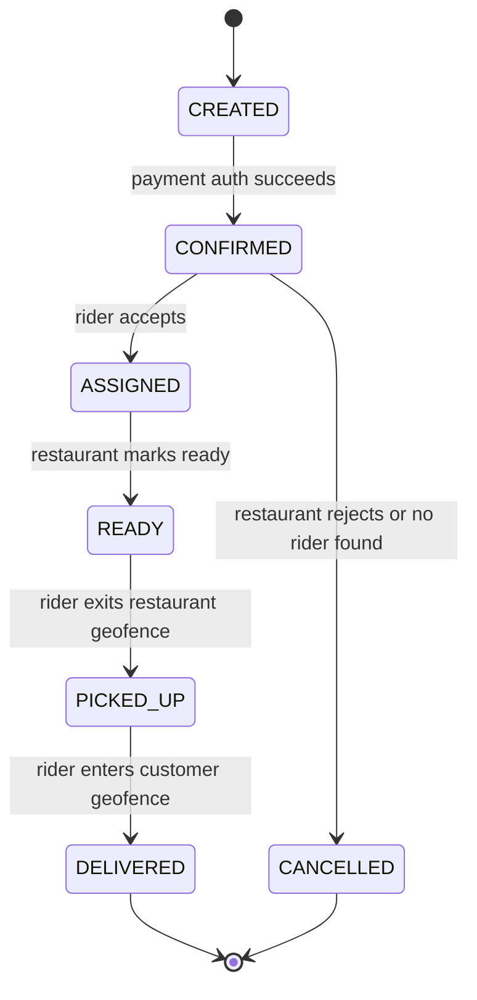

Every transition is a compare-and-set in Postgres (`UPDATE ... WHERE status = expected_current`), so no consumer can push the order into an illegal state. Each transition writes an outbox row that fans out via Kafka to notification, analytics, and recommendation services.

---

## Final Architecture

Putting it all together:

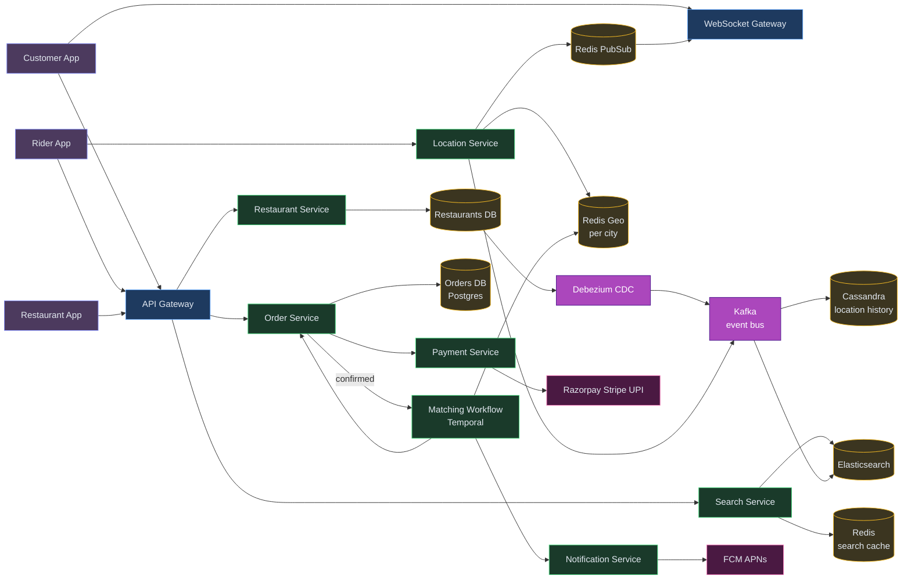

That's the design. Five deep dives in Bad / Good / Great progression, each picking the right primitive for the problem: Redis Geo for live rider locations, Redis locks with fencing tokens for consistent matching, WebSockets plus Pub/Sub for real-time tracking, Temporal for durable multi-step dispatch, and Elasticsearch fed by CDC for catalog search.

---

## Key Technologies Mentioned

| Term | What it is |
|---|---|
| **Elasticsearch** | Search engine with inverted indexes, geo-point filters, and function_score queries powering restaurant search with text + location + ranking in one call. |
| **Redis Geo** | In-memory geospatial index for sub-millisecond "find riders within 3km" queries on 200K+ active delivery partners. |
| **WebSocket** | Persistent connection streaming live rider location to customers for real-time order tracking on the map. |
| **Kafka** | Event bus carrying order confirmations, location streams, and CDC events between decoupled services. |
| **Dispatch Algorithm** | Scoring-based matching that picks the best rider using distance, acceptance rate, and estimated pickup time - not just proximity. |
| **Rider Assignment** | Redis SET NX with fencing tokens ensuring one order is offered to exactly one rider at a time, preventing double-dispatch. |
| **ETA** | Estimated Time of Arrival calculated from mapping APIs, used for rider ranking and customer-facing delivery predictions. |
| **CDN** | Content Delivery Network caching restaurant images and static assets at edge nodes for fast app loading. |

---

## What's Expected at Each Level

> This section helps you calibrate your depth. You don't need to cover everything - just know what's expected for your level.

### Mid-level

Produce a working 3-service design (search, order, dispatch). Recognize the need for geo-queries and a basic payment flow. With prompting, discuss caching for search. You should be able to articulate why a regular SQL query won't work for "restaurants near me" at scale, and sketch a happy-path order flow from placement to delivery.

### Senior

Drive the design proactively. Propose Elasticsearch for search with CDC sync, Redis Geo for rider proximity, and idempotency for orders. Discuss real-time tracking trade-offs (polling vs WebSocket vs SSE) without prompting. You should articulate the fan-out problem for location updates and explain why the dispatch workflow needs durability beyond a simple queue.

### Staff+

Address dispatch workflow durability (Temporal/Cadence), fencing tokens for preventing double-assignment of riders, adaptive location pinging to reduce write volume, and operational concerns like what happens during Redis failover. Show awareness of cost at scale - quantify rider location write volume, explain why city-sharded Redis Geo is cheaper than DynamoDB, and discuss graceful degradation when the matching service is overloaded.


---
## 🎯 Key Takeaways

- **Elasticsearch** for restaurant search with geo-filtering - not a regular DB
- **Redis Geo** for driver proximity (nearest available rider) - O(log N) queries
- **Kafka** decouples order placement from dispatch - user doesn't wait for driver assignment
- **WebSocket** for live tracking - don't poll, push

---
## Related Designs
- [Job Scheduler](/hld/JobScheduler) - distributed task processing
- [Notification System](/hld/NotificationSystem) - multi-channel push delivery
- [Digital Wallet](/hld/DigitalWallet) - payment processing + idempotency


---

## Related Concepts

Understand the building blocks used in this design:

- [Geospatial Indexing →](/concepts/geospatial/) — finds nearby restaurants and available delivery partners for a customer's location
- [WebSockets vs SSE →](/concepts/websockets/) — streams live order status and delivery-partner tracking to the customer
- [Message Queues →](/concepts/message-queues/) — decouples order placement from restaurant acceptance and delivery dispatch
- [Caching →](/concepts/caching/) — serves hot restaurant menus and listing pages without hitting the primary store
