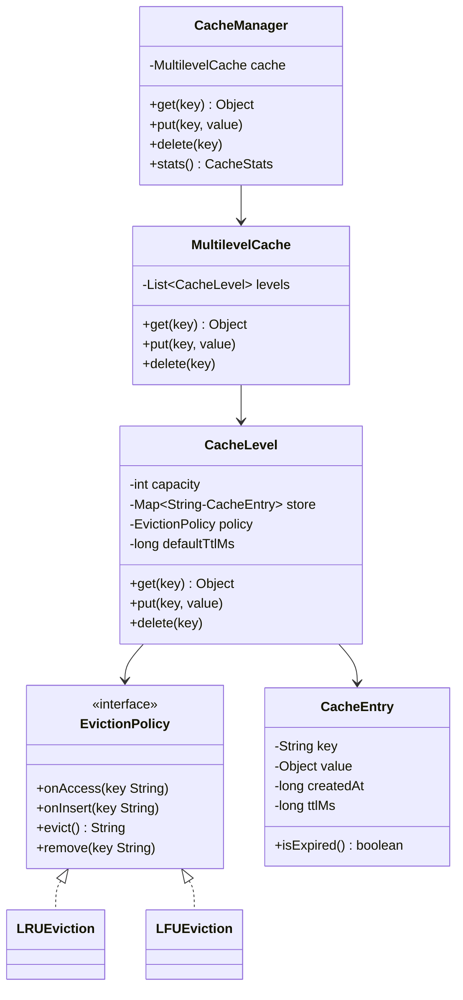

# Designing Multilevel Cache — Hierarchical Caching System

⚡ **Difficulty:** Medium-Hard 🏷️ **Patterns:** Strategy, Composition, Facade 🏢 **Asked at:** PhonePe, Flipkart, Amazon, Walmart

---

## Functional Requirements

1. **Multiple cache levels** — L1 (fast, small capacity) and L2 (slower, larger capacity), extensible to N levels
2. **Configurable eviction** — each level can use a different eviction strategy (LRU or LFU)
3. **Read-through** — on cache miss at L1, check L2, then origin; populate upper levels on hit
4. **Write-through** — writes propagate to all cache levels (top-down)
5. **TTL support** — entries expire after a configurable time-to-live
6. **Get/Put/Delete** — standard cache operations with O(1) average time complexity

## Non-Functional Requirements

1. **O(1) operations** — get, put, delete must be constant time (HashMap + DoublyLinkedList for LRU, HashMap + frequency lists for LFU)
2. **Thread-safety** — concurrent reads and writes must not corrupt cache state
3. **Extensibility** — add new eviction policies (FIFO, Random) without modifying existing code
4. **Correctness** — eviction removes the correct entry per policy, TTL expiry is honored

---

## Core Entities

| Entity | Description |
|---|---|
| `Cache` | Interface — get, put, delete operations |
| `CacheEntry` | Key, value, creation time, TTL |
| `EvictionPolicy` | Strategy interface — tracks access, evicts entries |
| `LRUEviction` | Least Recently Used — doubly linked list + HashMap |
| `LFUEviction` | Least Frequently Used — frequency map + min-frequency tracking |
| `CacheLevel` | Single cache level with capacity, eviction policy, and TTL |
| `MultilevelCache` | Composes multiple CacheLevels with read-through and write-through |
| `CacheManager` | Facade — provides simple get/put/delete to clients |

---

## Class Diagram

---

## Design Patterns

| Pattern | Where | Why |
|---|---|---|
| **Strategy** | `EvictionPolicy` with LRU/LFU | Swap eviction algorithm per cache level, no if/else chain |
| **Composition** | `MultilevelCache` composes `CacheLevel` objects | Add/remove levels without changing core logic |
| **Facade** | `CacheManager` | Single entry point hides multilevel complexity from clients |

---

## How It All Fits Together

Here's what happens on a **read (get)**:

1. Client calls `get(key)` on CacheManager
2. CacheManager delegates to MultilevelCache
3. MultilevelCache checks L1 first — if hit and not expired, return value
4. If L1 miss: check L2 — if hit and not expired, promote entry to L1 (write-through up), return value
5. If L2 miss: return null (or fetch from origin if configured)
6. On each access: eviction policy's `onAccess(key)` is called to update recency/frequency

Here's what happens on a **write (put)**:

1. Client calls `put(key, value)` on CacheManager
2. CacheManager delegates to MultilevelCache
3. MultilevelCache writes to ALL levels (write-through, top-down)
4. At each level: if capacity is full, eviction policy's `evict()` is called to remove one entry
5. New entry is inserted, eviction policy's `onInsert(key)` is called

💡 *LRU uses a DoublyLinkedList where the head is most-recently-used and tail is least-recently-used. On access, the node is moved to head. On eviction, the tail is removed. HashMap provides O(1) node lookup for the move operation.*

💡 *LFU tracks access frequency per key. When multiple keys have the same minimum frequency, the least recently used among them is evicted (LFU with LRU tiebreaker). This requires a HashMap of frequency → DoublyLinkedList.*

---

## Complete Code

### CacheEntry

A value object wrapping the cached data with metadata: creation timestamp and TTL. The `isExpired()` check is O(1) — just compare current time against creation + TTL.

<button class="tab-btn active">Java</button>
<button class="tab-btn">Python</button>
<button class="tab-btn">C++</button>

<pre><code class="language-java">package cache.model;

public class CacheEntry {
    private final String key;
    private Object value;
    private final long createdAt;
    private final long ttlMs; // 0 means no expiry

    public CacheEntry(String key, Object value, long ttlMs) {
        this.key = key;
        this.value = value;
        this.createdAt = System.currentTimeMillis();
        this.ttlMs = ttlMs;
    }

    public String getKey() { return key; }
    public Object getValue() { return value; }
    public void setValue(Object value) { this.value = value; }

    public boolean isExpired() {
        if (ttlMs &lt;= 0) return false;
        return System.currentTimeMillis() - createdAt &gt; ttlMs;
    }

    @Override
    public String toString() {
        return key + "=" + value + (isExpired() ? " [EXPIRED]" : "");
    }
}</code></pre>

<pre><code class="language-python">import time

class CacheEntry:
    def __init__(self, key: str, value, ttl_ms: int = 0):
        self.key = key
        self.value = value
        self.created_at = time.time() * 1000  # ms
        self.ttl_ms = ttl_ms  # 0 means no expiry

    def is_expired(self) -&gt; bool:
        if self.ttl_ms &lt;= 0:
            return False
        return (time.time() * 1000) - self.created_at &gt; self.ttl_ms

    def __str__(self):
        expired = " [EXPIRED]" if self.is_expired() else ""
        return f"{self.key}={self.value}{expired}"</code></pre>

<pre><code class="language-cpp">#pragma once
#include &lt;string&gt;
#include &lt;chrono&gt;
#include &lt;iostream&gt;

class CacheEntry {
public:
    std::string key;
    std::string value;
    long long createdAt;
    long long ttlMs; // 0 means no expiry

    CacheEntry(std::string key, std::string value, long long ttlMs = 0)
        : key(std::move(key)), value(std::move(value)), ttlMs(ttlMs) {
        createdAt = std::chrono::duration_cast&lt;std::chrono::milliseconds&gt;(
            std::chrono::system_clock::now().time_since_epoch()).count();
    }

    bool isExpired() const {
        if (ttlMs &lt;= 0) return false;
        auto now = std::chrono::duration_cast&lt;std::chrono::milliseconds&gt;(
            std::chrono::system_clock::now().time_since_epoch()).count();
        return now - createdAt &gt; ttlMs;
    }

    friend std::ostream&amp; operator&lt;&lt;(std::ostream&amp; os, const CacheEntry&amp; e) {
        os &lt;&lt; e.key &lt;&lt; "=" &lt;&lt; e.value;
        if (e.isExpired()) os &lt;&lt; " [EXPIRED]";
        return os;
    }
};</code></pre>

### EvictionPolicy (Strategy Interface)

The strategy interface for cache eviction. Each policy must support four operations: tracking access, tracking insertion, selecting a victim for eviction, and removing a specific key. LRU and LFU implement this differently.

💡 *Strategy pattern = define a family of algorithms, encapsulate each one, and make them interchangeable. Each CacheLevel picks its eviction strategy at creation time. Adding FIFO or Random eviction = one new class, zero changes to existing code.*

<button class="tab-btn active">Java</button>
<button class="tab-btn">Python</button>
<button class="tab-btn">C++</button>

<pre><code class="language-java">package cache.eviction;

public interface EvictionPolicy {
    void onAccess(String key);
    void onInsert(String key);
    String evict(); // returns key to evict
    void remove(String key);
}</code></pre>

<pre><code class="language-python">from abc import ABC, abstractmethod

class EvictionPolicy(ABC):
    @abstractmethod
    def on_access(self, key: str):
        pass

    @abstractmethod
    def on_insert(self, key: str):
        pass

    @abstractmethod
    def evict(self) -&gt; str:
        """Returns key to evict."""
        pass

    @abstractmethod
    def remove(self, key: str):
        pass</code></pre>

<pre><code class="language-cpp">#pragma once
#include &lt;string&gt;

class EvictionPolicy {
public:
    virtual ~EvictionPolicy() = default;
    virtual void onAccess(const std::string&amp; key) = 0;
    virtual void onInsert(const std::string&amp; key) = 0;
    virtual std::string evict() = 0; // returns key to evict
    virtual void remove(const std::string&amp; key) = 0;
};</code></pre>

### LRUEviction

Least Recently Used eviction using a **DoublyLinkedList + HashMap**. The list maintains access order — most recent at head, least recent at tail. On access, the node is moved to head in O(1). On eviction, the tail node is removed in O(1). The HashMap maps keys to list nodes for O(1) lookup.

<button class="tab-btn active">Java</button>
<button class="tab-btn">Python</button>
<button class="tab-btn">C++</button>

<pre><code class="language-java">package cache.eviction;

import java.util.HashMap;
import java.util.Map;

public class LRUEviction implements EvictionPolicy {

    private static class Node {
        String key;
        Node prev, next;
        Node(String key) { this.key = key; }
    }

    private final Node head = new Node("HEAD"); // dummy head (most recent)
    private final Node tail = new Node("TAIL"); // dummy tail (least recent)
    private final Map&lt;String, Node&gt; map = new HashMap&lt;&gt;();

    public LRUEviction() {
        head.next = tail;
        tail.prev = head;
    }

    @Override
    public void onAccess(String key) {
        Node node = map.get(key);
        if (node != null) {
            removeNode(node);
            addToHead(node);
        }
    }

    @Override
    public void onInsert(String key) {
        Node node = new Node(key);
        map.put(key, node);
        addToHead(node);
    }

    @Override
    public String evict() {
        if (tail.prev == head) return null; // empty
        Node victim = tail.prev;
        removeNode(victim);
        map.remove(victim.key);
        return victim.key;
    }

    @Override
    public void remove(String key) {
        Node node = map.remove(key);
        if (node != null) removeNode(node);
    }

    private void addToHead(Node node) {
        node.next = head.next;
        node.prev = head;
        head.next.prev = node;
        head.next = node;
    }

    private void removeNode(Node node) {
        node.prev.next = node.next;
        node.next.prev = node.prev;
    }
}</code></pre>

<pre><code class="language-python">class _Node:
    def __init__(self, key: str):
        self.key = key
        self.prev = None
        self.next = None

class LRUEviction(EvictionPolicy):
    def __init__(self):
        self._head = _Node("HEAD")  # dummy head (most recent)
        self._tail = _Node("TAIL")  # dummy tail (least recent)
        self._head.next = self._tail
        self._tail.prev = self._head
        self._map: dict[str, _Node] = {}

    def on_access(self, key: str):
        node = self._map.get(key)
        if node:
            self._remove_node(node)
            self._add_to_head(node)

    def on_insert(self, key: str):
        node = _Node(key)
        self._map[key] = node
        self._add_to_head(node)

    def evict(self) -&gt; str:
        if self._tail.prev == self._head:
            return None  # empty
        victim = self._tail.prev
        self._remove_node(victim)
        del self._map[victim.key]
        return victim.key

    def remove(self, key: str):
        node = self._map.pop(key, None)
        if node:
            self._remove_node(node)

    def _add_to_head(self, node: _Node):
        node.next = self._head.next
        node.prev = self._head
        self._head.next.prev = node
        self._head.next = node

    def _remove_node(self, node: _Node):
        node.prev.next = node.next
        node.next.prev = node.prev</code></pre>

<pre><code class="language-cpp">#pragma once
#include &lt;unordered_map&gt;
#include &lt;string&gt;
#include "EvictionPolicy.h"

class LRUEviction : public EvictionPolicy {
    struct Node {
        std::string key;
        Node* prev = nullptr;
        Node* next = nullptr;
        Node(std::string k) : key(std::move(k)) {}
    };

    Node* head; // dummy head (most recent)
    Node* tail; // dummy tail (least recent)
    std::unordered_map&lt;std::string, Node*&gt; map;

    void addToHead(Node* node) {
        node-&gt;next = head-&gt;next;
        node-&gt;prev = head;
        head-&gt;next-&gt;prev = node;
        head-&gt;next = node;
    }

    void removeNode(Node* node) {
        node-&gt;prev-&gt;next = node-&gt;next;
        node-&gt;next-&gt;prev = node-&gt;prev;
    }

public:
    LRUEviction() {
        head = new Node("HEAD");
        tail = new Node("TAIL");
        head-&gt;next = tail;
        tail-&gt;prev = head;
    }

    ~LRUEviction() {
        Node* curr = head;
        while (curr) {
            Node* next = curr-&gt;next;
            delete curr;
            curr = next;
        }
    }

    void onAccess(const std::string&amp; key) override {
        auto it = map.find(key);
        if (it != map.end()) {
            removeNode(it-&gt;second);
            addToHead(it-&gt;second);
        }
    }

    void onInsert(const std::string&amp; key) override {
        Node* node = new Node(key);
        map[key] = node;
        addToHead(node);
    }

    std::string evict() override {
        if (tail-&gt;prev == head) return ""; // empty
        Node* victim = tail-&gt;prev;
        removeNode(victim);
        std::string key = victim-&gt;key;
        map.erase(key);
        delete victim;
        return key;
    }

    void remove(const std::string&amp; key) override {
        auto it = map.find(key);
        if (it != map.end()) {
            removeNode(it-&gt;second);
            delete it-&gt;second;
            map.erase(it);
        }
    }
};</code></pre>

### LFUEviction

Least Frequently Used eviction with O(1) operations. Uses a HashMap of frequency → DoublyLinkedList (ordered by recency within same frequency). Tracks a `minFreq` pointer for O(1) eviction. When ties occur at the same frequency, the least recently used entry at that frequency is evicted (LFU + LRU tiebreaker).

<button class="tab-btn active">Java</button>
<button class="tab-btn">Python</button>
<button class="tab-btn">C++</button>

<pre><code class="language-java">package cache.eviction;

import java.util.*;

public class LFUEviction implements EvictionPolicy {

    private final Map&lt;String, Integer&gt; keyFreq = new HashMap&lt;&gt;();
    private final Map&lt;Integer, LinkedHashSet&lt;String&gt;&gt; freqKeys = new HashMap&lt;&gt;();
    private int minFreq = 0;

    @Override
    public void onAccess(String key) {
        if (!keyFreq.containsKey(key)) return;
        int freq = keyFreq.get(key);
        keyFreq.put(key, freq + 1);

        freqKeys.get(freq).remove(key);
        if (freqKeys.get(freq).isEmpty()) {
            freqKeys.remove(freq);
            if (minFreq == freq) minFreq++;
        }

        freqKeys.computeIfAbsent(freq + 1, k -&gt; new LinkedHashSet&lt;&gt;()).add(key);
    }

    @Override
    public void onInsert(String key) {
        keyFreq.put(key, 1);
        freqKeys.computeIfAbsent(1, k -&gt; new LinkedHashSet&lt;&gt;()).add(key);
        minFreq = 1;
    }

    @Override
    public String evict() {
        if (!freqKeys.containsKey(minFreq) || freqKeys.get(minFreq).isEmpty()) {
            return null;
        }
        LinkedHashSet&lt;String&gt; keys = freqKeys.get(minFreq);
        String victim = keys.iterator().next(); // oldest at min frequency
        keys.remove(victim);
        if (keys.isEmpty()) freqKeys.remove(minFreq);
        keyFreq.remove(victim);
        return victim;
    }

    @Override
    public void remove(String key) {
        if (!keyFreq.containsKey(key)) return;
        int freq = keyFreq.remove(key);
        LinkedHashSet&lt;String&gt; keys = freqKeys.get(freq);
        if (keys != null) {
            keys.remove(key);
            if (keys.isEmpty()) freqKeys.remove(freq);
        }
    }
}</code></pre>

<pre><code class="language-python">from collections import OrderedDict, defaultdict

class LFUEviction(EvictionPolicy):
    def __init__(self):
        self._key_freq: dict[str, int] = {}
        self._freq_keys: dict[int, OrderedDict] = defaultdict(OrderedDict)
        self._min_freq = 0

    def on_access(self, key: str):
        if key not in self._key_freq:
            return
        freq = self._key_freq[key]
        self._key_freq[key] = freq + 1

        del self._freq_keys[freq][key]
        if not self._freq_keys[freq]:
            del self._freq_keys[freq]
            if self._min_freq == freq:
                self._min_freq += 1

        self._freq_keys[freq + 1][key] = True

    def on_insert(self, key: str):
        self._key_freq[key] = 1
        self._freq_keys[1][key] = True
        self._min_freq = 1

    def evict(self) -&gt; str:
        if self._min_freq not in self._freq_keys or not self._freq_keys[self._min_freq]:
            return None
        # Pop the oldest key at minimum frequency (FIFO within same freq)
        victim, _ = self._freq_keys[self._min_freq].popitem(last=False)
        if not self._freq_keys[self._min_freq]:
            del self._freq_keys[self._min_freq]
        del self._key_freq[victim]
        return victim

    def remove(self, key: str):
        if key not in self._key_freq:
            return
        freq = self._key_freq.pop(key)
        if key in self._freq_keys[freq]:
            del self._freq_keys[freq][key]
            if not self._freq_keys[freq]:
                del self._freq_keys[freq]</code></pre>

<pre><code class="language-cpp">#pragma once
#include &lt;unordered_map&gt;
#include &lt;list&gt;
#include &lt;string&gt;
#include "EvictionPolicy.h"

class LFUEviction : public EvictionPolicy {
    std::unordered_map&lt;std::string, int&gt; keyFreq;
    // freq -&gt; list of keys (front = oldest at that freq)
    std::unordered_map&lt;int, std::list&lt;std::string&gt;&gt; freqKeys;
    // key -&gt; iterator in its frequency list
    std::unordered_map&lt;std::string, std::list&lt;std::string&gt;::iterator&gt; keyIter;
    int minFreq = 0;

public:
    void onAccess(const std::string&amp; key) override {
        auto it = keyFreq.find(key);
        if (it == keyFreq.end()) return;
        int freq = it-&gt;second;
        it-&gt;second = freq + 1;

        freqKeys[freq].erase(keyIter[key]);
        if (freqKeys[freq].empty()) {
            freqKeys.erase(freq);
            if (minFreq == freq) minFreq++;
        }

        freqKeys[freq + 1].push_back(key);
        keyIter[key] = std::prev(freqKeys[freq + 1].end());
    }

    void onInsert(const std::string&amp; key) override {
        keyFreq[key] = 1;
        freqKeys[1].push_back(key);
        keyIter[key] = std::prev(freqKeys[1].end());
        minFreq = 1;
    }

    std::string evict() override {
        if (freqKeys.find(minFreq) == freqKeys.end() || freqKeys[minFreq].empty())
            return "";
        std::string victim = freqKeys[minFreq].front();
        freqKeys[minFreq].pop_front();
        if (freqKeys[minFreq].empty()) freqKeys.erase(minFreq);
        keyFreq.erase(victim);
        keyIter.erase(victim);
        return victim;
    }

    void remove(const std::string&amp; key) override {
        auto it = keyFreq.find(key);
        if (it == keyFreq.end()) return;
        int freq = it-&gt;second;
        freqKeys[freq].erase(keyIter[key]);
        if (freqKeys[freq].empty()) freqKeys.erase(freq);
        keyFreq.erase(it);
        keyIter.erase(key);
    }
};</code></pre>

### CacheLevel

A single cache level with a fixed capacity, an eviction strategy, and a default TTL. Handles the mechanics of storing entries, checking expiry, and delegating to the eviction policy on access/insert.

<button class="tab-btn active">Java</button>
<button class="tab-btn">Python</button>
<button class="tab-btn">C++</button>

<pre><code class="language-java">package cache.core;

import cache.eviction.EvictionPolicy;
import cache.model.CacheEntry;

import java.util.HashMap;
import java.util.Map;

public class CacheLevel {
    private final String name;
    private final int capacity;
    private final Map&lt;String, CacheEntry&gt; store;
    private final EvictionPolicy evictionPolicy;
    private final long defaultTtlMs;
    private int hits = 0;
    private int misses = 0;

    public CacheLevel(String name, int capacity, EvictionPolicy evictionPolicy, long defaultTtlMs) {
        this.name = name;
        this.capacity = capacity;
        this.store = new HashMap&lt;&gt;();
        this.evictionPolicy = evictionPolicy;
        this.defaultTtlMs = defaultTtlMs;
    }

    public Object get(String key) {
        CacheEntry entry = store.get(key);
        if (entry == null) {
            misses++;
            return null;
        }
        if (entry.isExpired()) {
            delete(key);
            misses++;
            return null;
        }
        hits++;
        evictionPolicy.onAccess(key);
        return entry.getValue();
    }

    public void put(String key, Object value) {
        if (store.containsKey(key)) {
            // Update existing
            store.get(key).setValue(value);
            evictionPolicy.onAccess(key);
            return;
        }
        if (store.size() &gt;= capacity) {
            String evictKey = evictionPolicy.evict();
            if (evictKey != null) {
                store.remove(evictKey);
                System.out.println("    [" + name + "] Evicted: " + evictKey);
            }
        }
        store.put(key, new CacheEntry(key, value, defaultTtlMs));
        evictionPolicy.onInsert(key);
    }

    public void delete(String key) {
        if (store.remove(key) != null) {
            evictionPolicy.remove(key);
        }
    }

    public boolean containsKey(String key) {
        CacheEntry entry = store.get(key);
        if (entry == null) return false;
        if (entry.isExpired()) {
            delete(key);
            return false;
        }
        return true;
    }

    public String getName() { return name; }
    public int getHits() { return hits; }
    public int getMisses() { return misses; }
    public int getSize() { return store.size(); }
    public int getCapacity() { return capacity; }
}</code></pre>

<pre><code class="language-python">class CacheLevel:
    def __init__(self, name: str, capacity: int, eviction_policy: EvictionPolicy,
                 default_ttl_ms: int = 0):
        self.name = name
        self.capacity = capacity
        self._store: dict[str, CacheEntry] = {}
        self._policy = eviction_policy
        self._default_ttl_ms = default_ttl_ms
        self.hits = 0
        self.misses = 0

    def get(self, key: str):
        entry = self._store.get(key)
        if entry is None:
            self.misses += 1
            return None
        if entry.is_expired():
            self.delete(key)
            self.misses += 1
            return None
        self.hits += 1
        self._policy.on_access(key)
        return entry.value

    def put(self, key: str, value):
        if key in self._store:
            self._store[key].value = value
            self._policy.on_access(key)
            return
        if len(self._store) &gt;= self.capacity:
            evict_key = self._policy.evict()
            if evict_key:
                del self._store[evict_key]
                print(f"    [{self.name}] Evicted: {evict_key}")
        self._store[key] = CacheEntry(key, value, self._default_ttl_ms)
        self._policy.on_insert(key)

    def delete(self, key: str):
        if key in self._store:
            del self._store[key]
            self._policy.remove(key)

    def contains_key(self, key: str) -&gt; bool:
        entry = self._store.get(key)
        if entry is None:
            return False
        if entry.is_expired():
            self.delete(key)
            return False
        return True

    @property
    def size(self) -&gt; int:
        return len(self._store)</code></pre>

<pre><code class="language-cpp">#pragma once
#include &lt;unordered_map&gt;
#include &lt;string&gt;
#include &lt;memory&gt;
#include &lt;iostream&gt;
#include "CacheEntry.h"
#include "EvictionPolicy.h"

class CacheLevel {
    std::string name;
    int capacity;
    std::unordered_map&lt;std::string, CacheEntry&gt; store;
    std::unique_ptr&lt;EvictionPolicy&gt; policy;
    long long defaultTtlMs;
    int hits = 0;
    int misses = 0;

public:
    CacheLevel(std::string name, int capacity,
               std::unique_ptr&lt;EvictionPolicy&gt; policy, long long defaultTtlMs = 0)
        : name(std::move(name)), capacity(capacity),
          policy(std::move(policy)), defaultTtlMs(defaultTtlMs) {}

    std::string get(const std::string&amp; key) {
        auto it = store.find(key);
        if (it == store.end()) { misses++; return ""; }
        if (it-&gt;second.isExpired()) {
            remove(key);
            misses++;
            return "";
        }
        hits++;
        policy-&gt;onAccess(key);
        return it-&gt;second.value;
    }

    void put(const std::string&amp; key, const std::string&amp; value) {
        auto it = store.find(key);
        if (it != store.end()) {
            it-&gt;second.value = value;
            policy-&gt;onAccess(key);
            return;
        }
        if ((int)store.size() &gt;= capacity) {
            std::string evictKey = policy-&gt;evict();
            if (!evictKey.empty()) {
                store.erase(evictKey);
                std::cout &lt;&lt; "    [" &lt;&lt; name &lt;&lt; "] Evicted: " &lt;&lt; evictKey &lt;&lt; "\n";
            }
        }
        store.emplace(key, CacheEntry(key, value, defaultTtlMs));
        policy-&gt;onInsert(key);
    }

    void remove(const std::string&amp; key) {
        if (store.erase(key)) policy-&gt;remove(key);
    }

    bool containsKey(const std::string&amp; key) {
        auto it = store.find(key);
        if (it == store.end()) return false;
        if (it-&gt;second.isExpired()) { remove(key); return false; }
        return true;
    }

    const std::string&amp; getName() const { return name; }
    int getHits() const { return hits; }
    int getMisses() const { return misses; }
    int getSize() const { return (int)store.size(); }
    int getCapacity() const { return capacity; }
};</code></pre>

### MultilevelCache

Composes multiple CacheLevel instances into a hierarchy with read-through and write-through semantics. On a read miss at any level, lower levels are checked. On a hit at a lower level, the entry is promoted to all upper levels. Writes propagate to all levels.

💡 *Composition pattern = build complex behavior by combining simple objects. MultilevelCache doesn't inherit from CacheLevel — it composes N of them. Adding a third level (L3) is just adding another CacheLevel to the list.*

<button class="tab-btn active">Java</button>
<button class="tab-btn">Python</button>
<button class="tab-btn">C++</button>

<pre><code class="language-java">package cache.core;

import java.util.*;

public class MultilevelCache {
    private final List&lt;CacheLevel&gt; levels;

    public MultilevelCache(List&lt;CacheLevel&gt; levels) {
        if (levels == null || levels.isEmpty()) {
            throw new IllegalArgumentException("Need at least one cache level");
        }
        this.levels = new ArrayList&lt;&gt;(levels);
    }

    public Object get(String key) {
        for (int i = 0; i &lt; levels.size(); i++) {
            Object value = levels.get(i).get(key);
            if (value != null) {
                System.out.println("  ✓ Hit at " + levels.get(i).getName() + " for key: " + key);
                // Promote to upper levels (read-through up)
                for (int j = i - 1; j &gt;= 0; j--) {
                    levels.get(j).put(key, value);
                }
                return value;
            }
        }
        System.out.println("  ✗ Miss at all levels for key: " + key);
        return null;
    }

    public void put(String key, Object value) {
        // Write-through: write to all levels
        for (CacheLevel level : levels) {
            level.put(key, value);
        }
    }

    public void delete(String key) {
        for (CacheLevel level : levels) {
            level.delete(key);
        }
    }

    public List&lt;CacheLevel&gt; getLevels() {
        return Collections.unmodifiableList(levels);
    }
}</code></pre>

<pre><code class="language-python">class MultilevelCache:
    def __init__(self, levels: list[CacheLevel]):
        if not levels:
            raise ValueError("Need at least one cache level")
        self.levels = list(levels)

    def get(self, key: str):
        for i, level in enumerate(self.levels):
            value = level.get(key)
            if value is not None:
                print(f"  ✓ Hit at {level.name} for key: {key}")
                # Promote to upper levels (read-through up)
                for j in range(i - 1, -1, -1):
                    self.levels[j].put(key, value)
                return value
        print(f"  ✗ Miss at all levels for key: {key}")
        return None

    def put(self, key: str, value):
        # Write-through: write to all levels
        for level in self.levels:
            level.put(key, value)

    def delete(self, key: str):
        for level in self.levels:
            level.delete(key)</code></pre>

<pre><code class="language-cpp">#pragma once
#include &lt;vector&gt;
#include &lt;memory&gt;
#include &lt;iostream&gt;
#include "CacheLevel.h"

class MultilevelCache {
    std::vector&lt;std::unique_ptr&lt;CacheLevel&gt;&gt; levels;

public:
    void addLevel(std::unique_ptr&lt;CacheLevel&gt; level) {
        levels.push_back(std::move(level));
    }

    std::string get(const std::string&amp; key) {
        for (int i = 0; i &lt; (int)levels.size(); i++) {
            std::string value = levels[i]-&gt;get(key);
            if (!value.empty()) {
                std::cout &lt;&lt; "  Hit at " &lt;&lt; levels[i]-&gt;getName()
                          &lt;&lt; " for key: " &lt;&lt; key &lt;&lt; "\n";
                // Promote to upper levels
                for (int j = i - 1; j &gt;= 0; j--) {
                    levels[j]-&gt;put(key, value);
                }
                return value;
            }
        }
        std::cout &lt;&lt; "  Miss at all levels for key: " &lt;&lt; key &lt;&lt; "\n";
        return "";
    }

    void put(const std::string&amp; key, const std::string&amp; value) {
        for (auto&amp; level : levels) {
            level-&gt;put(key, value);
        }
    }

    void remove(const std::string&amp; key) {
        for (auto&amp; level : levels) {
            level-&gt;remove(key);
        }
    }

    const std::vector&lt;std::unique_ptr&lt;CacheLevel&gt;&gt;&amp; getLevels() const {
        return levels;
    }
};</code></pre>

### CacheManager (Facade)

The single entry point for clients. Provides simple get/put/delete and a stats() method showing hits, misses, and sizes per level. All operations are thread-safe via `ReentrantLock`.

💡 *Facade pattern = provide a simplified interface to a complex subsystem. Clients call `get(key)` on the manager — they never interact directly with CacheLevels, EvictionPolicies, or the multilevel composition.*

<button class="tab-btn active">Java</button>
<button class="tab-btn">Python</button>
<button class="tab-btn">C++</button>

<pre><code class="language-java">package cache;

import cache.core.CacheLevel;
import cache.core.MultilevelCache;

import java.util.concurrent.locks.ReentrantLock;

public class CacheManager {
    private final MultilevelCache cache;
    private final ReentrantLock lock = new ReentrantLock();

    public CacheManager(MultilevelCache cache) {
        this.cache = cache;
    }

    public Object get(String key) {
        lock.lock();
        try {
            return cache.get(key);
        } finally { lock.unlock(); }
    }

    public void put(String key, Object value) {
        lock.lock();
        try {
            cache.put(key, value);
        } finally { lock.unlock(); }
    }

    public void delete(String key) {
        lock.lock();
        try {
            cache.delete(key);
        } finally { lock.unlock(); }
    }

    public void printStats() {
        System.out.println("\n--- Cache Stats ---");
        for (CacheLevel level : cache.getLevels()) {
            System.out.printf("  %s: size=%d/%d, hits=%d, misses=%d%n",
                level.getName(), level.getSize(), level.getCapacity(),
                level.getHits(), level.getMisses());
        }
    }
}</code></pre>

<pre><code class="language-python">import threading

class CacheManager:
    def __init__(self, cache: MultilevelCache):
        self._cache = cache
        self._lock = threading.Lock()

    def get(self, key: str):
        with self._lock:
            return self._cache.get(key)

    def put(self, key: str, value):
        with self._lock:
            self._cache.put(key, value)

    def delete(self, key: str):
        with self._lock:
            self._cache.delete(key)

    def print_stats(self):
        print("\n--- Cache Stats ---")
        for level in self._cache.levels:
            print(f"  {level.name}: size={level.size}/{level.capacity}, "
                  f"hits={level.hits}, misses={level.misses}")</code></pre>

<pre><code class="language-cpp">#pragma once
#include &lt;mutex&gt;
#include &lt;iostream&gt;
#include "MultilevelCache.h"

class CacheManager {
    MultilevelCache cache;
    std::mutex mtx;

public:
    CacheManager(MultilevelCache cache) : cache(std::move(cache)) {}

    std::string get(const std::string&amp; key) {
        std::lock_guard&lt;std::mutex&gt; lock(mtx);
        return cache.get(key);
    }

    void put(const std::string&amp; key, const std::string&amp; value) {
        std::lock_guard&lt;std::mutex&gt; lock(mtx);
        cache.put(key, value);
    }

    void remove(const std::string&amp; key) {
        std::lock_guard&lt;std::mutex&gt; lock(mtx);
        cache.remove(key);
    }

    void printStats() {
        std::cout &lt;&lt; "\n--- Cache Stats ---\n";
        for (const auto&amp; level : cache.getLevels()) {
            std::cout &lt;&lt; "  " &lt;&lt; level-&gt;getName()
                      &lt;&lt; ": size=" &lt;&lt; level-&gt;getSize()
                      &lt;&lt; "/" &lt;&lt; level-&gt;getCapacity()
                      &lt;&lt; ", hits=" &lt;&lt; level-&gt;getHits()
                      &lt;&lt; ", misses=" &lt;&lt; level-&gt;getMisses() &lt;&lt; "\n";
        }
    }
};</code></pre>

### Demo (Runnable)

The demo sets up a two-level cache: L1 (capacity 3, LRU) and L2 (capacity 5, LFU). It demonstrates cache hits, misses, eviction in action, read-through promotion, and final stats.

<button class="tab-btn active">Java</button>
<button class="tab-btn">Python</button>
<button class="tab-btn">C++</button>

<pre><code class="language-java">package cache;

import cache.core.CacheLevel;
import cache.core.MultilevelCache;
import cache.eviction.LFUEviction;
import cache.eviction.LRUEviction;

import java.util.Arrays;

public class Demo {
    public static void main(String[] args) {
        System.out.println("══════ MULTILEVEL CACHE DEMO ══════\n");

        // L1: small &amp; fast, LRU eviction, capacity 3
        CacheLevel l1 = new CacheLevel("L1", 3, new LRUEviction(), 0);
        // L2: larger &amp; slower, LFU eviction, capacity 5
        CacheLevel l2 = new CacheLevel("L2", 5, new LFUEviction(), 0);

        MultilevelCache multilevel = new MultilevelCache(Arrays.asList(l1, l2));
        CacheManager manager = new CacheManager(multilevel);

        // --- Insert entries ---
        System.out.println("--- Inserting entries ---");
        manager.put("user:1", "Alice");
        System.out.println("  PUT user:1 = Alice");
        manager.put("user:2", "Bob");
        System.out.println("  PUT user:2 = Bob");
        manager.put("user:3", "Charlie");
        System.out.println("  PUT user:3 = Charlie");

        // --- Read hits ---
        System.out.println("\n--- Reading (should hit L1) ---");
        System.out.println("  GET user:1 = " + manager.get("user:1"));
        System.out.println("  GET user:2 = " + manager.get("user:2"));

        // --- Trigger L1 eviction ---
        System.out.println("\n--- Insert more (L1 full, triggers eviction) ---");
        manager.put("user:4", "Diana");
        System.out.println("  PUT user:4 = Diana");
        manager.put("user:5", "Eve");
        System.out.println("  PUT user:5 = Eve");

        // --- user:3 should be evicted from L1 (LRU), but still in L2 ---
        System.out.println("\n--- Read user:3 (evicted from L1, should hit L2) ---");
        Object val = manager.get("user:3");
        System.out.println("  GET user:3 = " + val + " (promoted back to L1)");

        // --- Cache miss ---
        System.out.println("\n--- Read non-existent key ---");
        Object miss = manager.get("user:99");
        System.out.println("  GET user:99 = " + miss);

        // --- Trigger L2 eviction ---
        System.out.println("\n--- Fill up L2 to trigger LFU eviction ---");
        manager.put("user:6", "Frank");
        System.out.println("  PUT user:6 = Frank");

        // Access some keys to increase their frequency
        manager.get("user:1");
        manager.get("user:1");
        manager.get("user:2");

        manager.put("user:7", "Grace");
        System.out.println("  PUT user:7 = Grace (should evict least frequent from L2)");

        // --- Delete ---
        System.out.println("\n--- Delete user:1 ---");
        manager.delete("user:1");
        System.out.println("  DEL user:1");
        System.out.println("  GET user:1 = " + manager.get("user:1") + " (should be null)");

        // --- Stats ---
        manager.printStats();

        System.out.println("\n══════ DONE ══════");
    }
}</code></pre>

<pre><code class="language-python">def demo():
    print("══════ MULTILEVEL CACHE DEMO ══════\n")

    # L1: small &amp; fast, LRU eviction, capacity 3
    l1 = CacheLevel("L1", 3, LRUEviction())
    # L2: larger &amp; slower, LFU eviction, capacity 5
    l2 = CacheLevel("L2", 5, LFUEviction())

    multilevel = MultilevelCache([l1, l2])
    manager = CacheManager(multilevel)

    # --- Insert entries ---
    print("--- Inserting entries ---")
    manager.put("user:1", "Alice")
    print("  PUT user:1 = Alice")
    manager.put("user:2", "Bob")
    print("  PUT user:2 = Bob")
    manager.put("user:3", "Charlie")
    print("  PUT user:3 = Charlie")

    # --- Read hits ---
    print("\n--- Reading (should hit L1) ---")
    print(f"  GET user:1 = {manager.get('user:1')}")
    print(f"  GET user:2 = {manager.get('user:2')}")

    # --- Trigger L1 eviction ---
    print("\n--- Insert more (L1 full, triggers eviction) ---")
    manager.put("user:4", "Diana")
    print("  PUT user:4 = Diana")
    manager.put("user:5", "Eve")
    print("  PUT user:5 = Eve")

    # --- user:3 evicted from L1 (LRU), still in L2 ---
    print("\n--- Read user:3 (evicted from L1, should hit L2) ---")
    val = manager.get("user:3")
    print(f"  GET user:3 = {val} (promoted back to L1)")

    # --- Cache miss ---
    print("\n--- Read non-existent key ---")
    miss = manager.get("user:99")
    print(f"  GET user:99 = {miss}")

    # --- Trigger L2 eviction ---
    print("\n--- Fill up L2 to trigger LFU eviction ---")
    manager.put("user:6", "Frank")
    print("  PUT user:6 = Frank")

    # Access some keys to increase frequency
    manager.get("user:1")
    manager.get("user:1")
    manager.get("user:2")

    manager.put("user:7", "Grace")
    print("  PUT user:7 = Grace (should evict least frequent from L2)")

    # --- Delete ---
    print("\n--- Delete user:1 ---")
    manager.delete("user:1")
    print("  DEL user:1")
    print(f"  GET user:1 = {manager.get('user:1')} (should be None)")

    # --- Stats ---
    manager.print_stats()

    print("\n══════ DONE ══════")

if __name__ == "__main__":
    demo()</code></pre>

<pre><code class="language-cpp">#include &lt;iostream&gt;
#include &lt;memory&gt;
#include "CacheManager.h"
#include "LRUEviction.h"
#include "LFUEviction.h"

int main() {
    std::cout &lt;&lt; "══════ MULTILEVEL CACHE DEMO ══════\n\n";

    MultilevelCache multilevel;
    multilevel.addLevel(std::make_unique&lt;CacheLevel&gt;(
        "L1", 3, std::make_unique&lt;LRUEviction&gt;(), 0));
    multilevel.addLevel(std::make_unique&lt;CacheLevel&gt;(
        "L2", 5, std::make_unique&lt;LFUEviction&gt;(), 0));

    CacheManager manager(std::move(multilevel));

    // Insert entries
    std::cout &lt;&lt; "--- Inserting entries ---\n";
    manager.put("user:1", "Alice");
    std::cout &lt;&lt; "  PUT user:1 = Alice\n";
    manager.put("user:2", "Bob");
    std::cout &lt;&lt; "  PUT user:2 = Bob\n";
    manager.put("user:3", "Charlie");
    std::cout &lt;&lt; "  PUT user:3 = Charlie\n";

    // Read hits
    std::cout &lt;&lt; "\n--- Reading (should hit L1) ---\n";
    std::cout &lt;&lt; "  GET user:1 = " &lt;&lt; manager.get("user:1") &lt;&lt; "\n";
    std::cout &lt;&lt; "  GET user:2 = " &lt;&lt; manager.get("user:2") &lt;&lt; "\n";

    // Trigger L1 eviction
    std::cout &lt;&lt; "\n--- Insert more (L1 full, triggers eviction) ---\n";
    manager.put("user:4", "Diana");
    std::cout &lt;&lt; "  PUT user:4 = Diana\n";
    manager.put("user:5", "Eve");
    std::cout &lt;&lt; "  PUT user:5 = Eve\n";

    // Read from L2
    std::cout &lt;&lt; "\n--- Read user:3 (evicted from L1, should hit L2) ---\n";
    std::string val = manager.get("user:3");
    std::cout &lt;&lt; "  GET user:3 = " &lt;&lt; val &lt;&lt; " (promoted back to L1)\n";

    // Cache miss
    std::cout &lt;&lt; "\n--- Read non-existent key ---\n";
    std::cout &lt;&lt; "  GET user:99 = " &lt;&lt; manager.get("user:99") &lt;&lt; "\n";

    // Delete
    std::cout &lt;&lt; "\n--- Delete user:1 ---\n";
    manager.remove("user:1");
    std::cout &lt;&lt; "  DEL user:1\n";
    std::cout &lt;&lt; "  GET user:1 = " &lt;&lt; manager.get("user:1") &lt;&lt; " (should be empty)\n";

    // Stats
    manager.printStats();

    std::cout &lt;&lt; "\n══════ DONE ══════\n";
    return 0;
}</code></pre>

---

## Data Structure Walkthrough

### LRU — DoublyLinkedList + HashMap

<pre><code class="language-mermaid">flowchart LR
    A[HashMap key to Node] --> B[DoublyLinkedList]
    B --> C[Head = Most Recent]
    B --> D[Tail = Least Recent]
    E[On Access] --> F[Move Node to Head O1]
    G[On Evict] --> H[Remove Tail O1]
    I[On Insert] --> J[Add to Head O1]</code></pre>

**Why this works:** HashMap gives O(1) lookup of the node. The doubly-linked list gives O(1) removal and insertion at head/tail because we have direct pointers to prev/next.

### LFU — Frequency Map + MinFreq Pointer

<pre><code class="language-mermaid">flowchart LR
    A[keyFreq Map: key to freq] --> B[freqKeys Map: freq to OrderedSet]
    B --> C[minFreq pointer]
    D[On Access] --> E[Move key from freq N to freq N+1]
    F[On Evict] --> G[Remove oldest key at minFreq]
    H[On Insert] --> I[Add key at freq 1 - reset minFreq]</code></pre>

**Why this works:** `minFreq` always points to the lowest frequency bucket. Within each bucket, keys are ordered by insertion time (LinkedHashSet/OrderedDict), so ties are broken by LRU. All operations are O(1).

---

## How to Extend

| Feature | Implementation |
|---|---|
| **FIFO Eviction** | New `FIFOEviction` — simple queue, evict from front |
| **Random Eviction** | New `RandomEviction` — pick random key from a list |
| **Write-Back** | Dirty flag on entries, flush to lower levels on eviction |
| **TTL Cleanup** | Background thread that periodically scans and removes expired entries |
| **Metrics/Monitoring** | Observer on CacheLevel to emit hit/miss rates to monitoring systems |
| **L3 Level** | Just add another CacheLevel to the MultilevelCache list |

---

## What Interviewers Look For

1. ✅ Strategy pattern for eviction — no if/else chains based on policy type
2. ✅ O(1) LRU — DoublyLinkedList + HashMap, not a LinkedHashMap black box
3. ✅ O(1) LFU — frequency buckets with minFreq pointer, LRU tiebreaker
4. ✅ Composition — multilevel cache composed of independent level objects
5. ✅ Thread-safety — locks on all mutable shared state
6. ✅ TTL support — entries self-expire on access
7. ✅ Runnable demo — shows eviction, promotion, hits/misses end-to-end

---

## Related Designs

- [Splitwise](/Splitwise) — Strategy pattern and Facade
- [Snake & Ladder](/SnakeLadder) — Strategy and Command patterns
