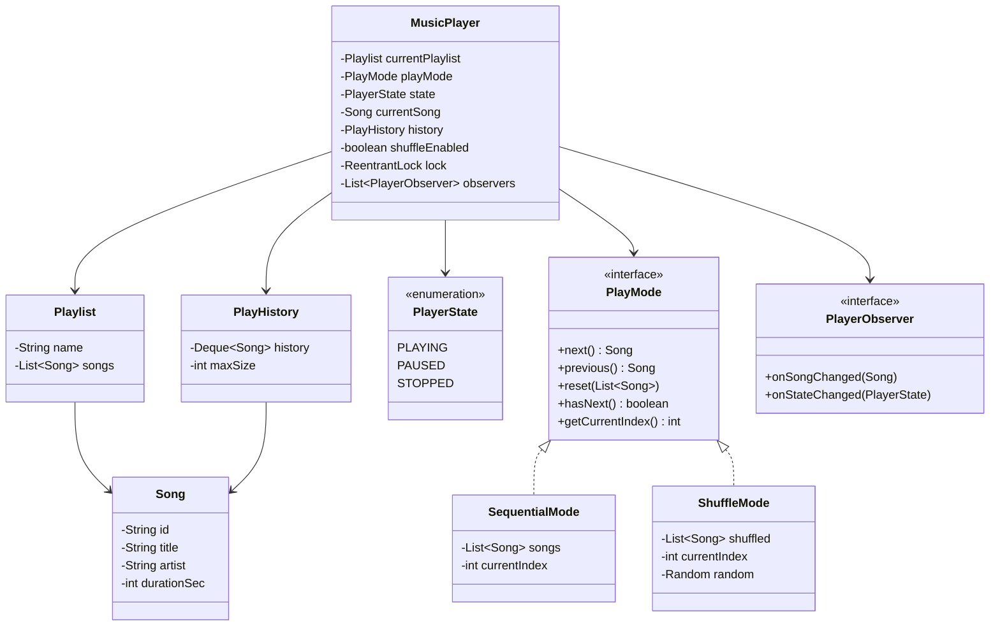
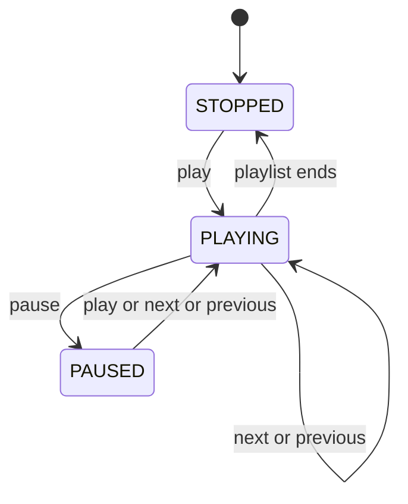
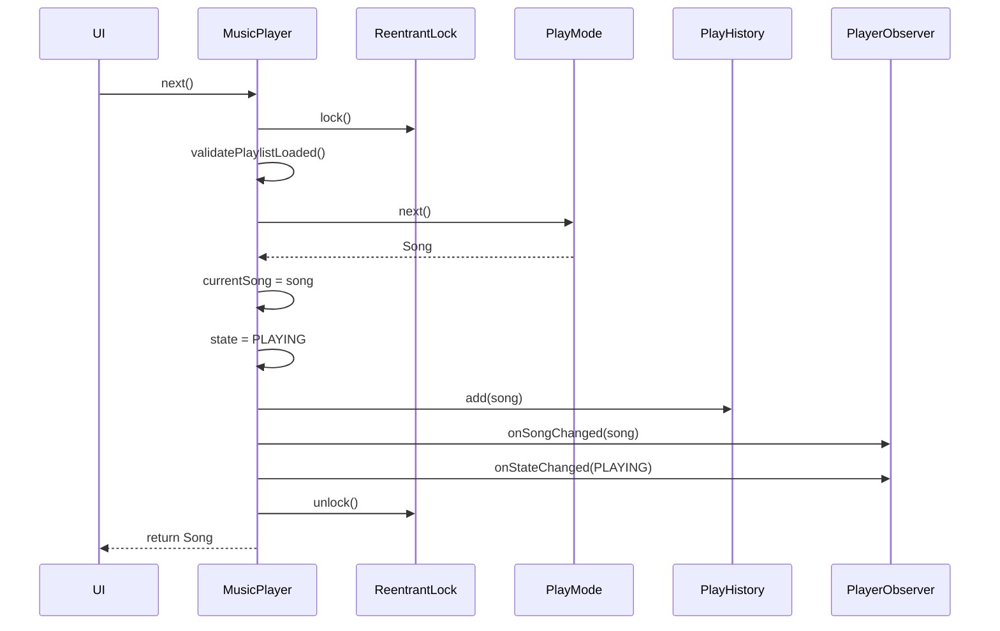

# Designing a Music Player

⚡ **Difficulty:** Medium 🏷️ **Patterns:** Strategy, Observer, State, Iterator 🏢 **Asked at:** PhonePe, Spotify, Amazon, Flipkart

---

## Functional Requirements

1. **Play / Pause** a song
2. **Next / Previous** song navigation
3. **Enable / Disable shuffle** — toggle between sequential and random play order
4. **No song repeats while shuffling** — every song plays exactly once before cycling
5. **History of songs played** — track all played songs in order

## Non-Functional Requirements

1. **Thread-safety** — handle concurrent play/pause/next requests (UI thread + notification controls)
2. **O(1) next/previous** — instant track switching regardless of playlist size
3. **Extensibility** — easy to add new play modes (repeat-one, repeat-all, priority queue)
4. **Memory-efficient shuffle** — shuffle in-place, don't duplicate unnecessarily

---

## Core Entities

| Entity | Description |
|---|---|
| `Song` | Immutable value object — id, title, artist, duration |
| `Playlist` | Ordered collection of songs |
| `MusicPlayer` | Main controller — owns state, play mode, and history |
| `PlayMode` (interface) | Strategy for determining next/previous song |
| `SequentialMode` | Plays songs in playlist order |
| `ShuffleMode` | Plays songs in random order without repeats |
| `PlayerState` | Enum: PLAYING, PAUSED, STOPPED |
| `PlayHistory` | Bounded ordered log of songs played |
| `PlayerObserver` | Interface for song/state change notifications |

---

## Class Diagram



---

## Design Patterns

| Pattern | Where | Why |
|---|---|---|
| **Strategy** | `PlayMode` interface with `SequentialMode` / `ShuffleMode` | Swap play algorithm at runtime. Adding RepeatMode = one new class, zero changes to player. |
| **Observer** | `PlayerObserver` notified on song/state changes | Decouples UI, analytics, notification bar from player logic. |
| **State** | `PlayerState` enum driving valid transitions | Prevents invalid operations (can't next when STOPPED). |
| **Iterator** | Internal index-based traversal in each PlayMode | Uniform next/previous interface regardless of play order. |

---

## Data Structures

| Component | Structure | Why |
|---|---|---|
| Playlist songs | `ArrayList<Song>` | O(1) random access for index-based next/prev |
| Shuffle order | `ArrayList<Song>` (shuffled copy) | Fisher-Yates in-place, O(1) next by index |
| Play history | `ArrayDeque<Song>` (bounded) | O(1) add, auto-evict oldest when full |
| Observers | `CopyOnWriteArrayList` | Thread-safe iteration during notification |
| Current index | `int` | O(1) next/previous in all modes |

---

## Complete Code

### Song.java

```java
package musicplayer.model;

public class Song {
    private final String id;
    private final String title;
    private final String artist;
    private final int durationSec;

    public Song(String id, String title, String artist, int durationSec) {
        this.id = id;
        this.title = title;
        this.artist = artist;
        this.durationSec = durationSec;
    }

    public String getId() { return id; }
    public String getTitle() { return title; }
    public String getArtist() { return artist; }
    public int getDurationSec() { return durationSec; }

    @Override
    public String toString() {
        return title + " — " + artist + " (" + durationSec + "s)";
    }

    @Override
    public boolean equals(Object o) {
        if (this == o) return true;
        if (o == null || getClass() != o.getClass()) return false;
        Song song = (Song) o;
        return id.equals(song.id);
    }

    @Override
    public int hashCode() {
        return id.hashCode();
    }
}
```

### Playlist.java

```java
package musicplayer.model;

import java.util.ArrayList;
import java.util.Collections;
import java.util.List;

public class Playlist {
    private final String name;
    private final List<Song> songs;

    public Playlist(String name) {
        this.name = name;
        this.songs = new ArrayList<>();
    }

    public void addSong(Song song) {
        songs.add(song);
    }

    public void removeSong(Song song) {
        songs.remove(song);
    }

    public String getName() { return name; }
    public List<Song> getSongs() { return Collections.unmodifiableList(songs); }
    public int size() { return songs.size(); }
    public boolean isEmpty() { return songs.isEmpty(); }

    @Override
    public String toString() {
        return name + " (" + songs.size() + " songs)";
    }
}
```

### PlayerState.java

```java
package musicplayer.model;

public enum PlayerState {
    PLAYING,
    PAUSED,
    STOPPED
}
```

### PlayMode.java (Strategy Interface)

```java
package musicplayer.strategy;

import musicplayer.model.Song;
import java.util.List;

public interface PlayMode {
    /**
     * Get the next song in the play order.
     * @return next Song, or null if no more songs
     */
    Song next();

    /**
     * Get the previous song in the play order.
     * @return previous Song, or null if at the beginning
     */
    Song previous();

    /**
     * Reset the mode with a new list of songs.
     */
    void reset(List<Song> songs);

    /**
     * Check if there are more songs to play.
     */
    boolean hasNext();

    /**
     * Get the current song without advancing.
     */
    Song current();
}
```

### SequentialMode.java

```java
package musicplayer.strategy;

import musicplayer.model.Song;
import java.util.ArrayList;
import java.util.List;

public class SequentialMode implements PlayMode {
    private List<Song> songs;
    private int currentIndex;

    public SequentialMode() {
        this.songs = new ArrayList<>();
        this.currentIndex = -1;
    }

    @Override
    public void reset(List<Song> songs) {
        this.songs = new ArrayList<>(songs);
        this.currentIndex = -1;
    }

    @Override
    public Song next() {
        if (songs.isEmpty()) return null;
        currentIndex++;
        if (currentIndex >= songs.size()) {
            currentIndex = 0; // wrap around
        }
        return songs.get(currentIndex);
    }

    @Override
    public Song previous() {
        if (songs.isEmpty()) return null;
        currentIndex--;
        if (currentIndex < 0) {
            currentIndex = songs.size() - 1; // wrap around
        }
        return songs.get(currentIndex);
    }

    @Override
    public boolean hasNext() {
        return songs != null && !songs.isEmpty();
    }

    @Override
    public Song current() {
        if (songs.isEmpty() || currentIndex < 0 || currentIndex >= songs.size()) {
            return null;
        }
        return songs.get(currentIndex);
    }
}
```

### ShuffleMode.java

```java
package musicplayer.strategy;

import musicplayer.model.Song;
import java.util.ArrayList;
import java.util.Collections;
import java.util.List;
import java.util.Random;

/**
 * Shuffle mode using Fisher-Yates algorithm.
 * Guarantees: every song plays exactly once before any repeat.
 * When all songs are exhausted, reshuffles for the next cycle.
 */
public class ShuffleMode implements PlayMode {
    private List<Song> shuffled;
    private int currentIndex;
    private final Random random;

    public ShuffleMode() {
        this.shuffled = new ArrayList<>();
        this.currentIndex = -1;
        this.random = new Random();
    }

    @Override
    public void reset(List<Song> songs) {
        this.shuffled = new ArrayList<>(songs);
        fisherYatesShuffle();
        this.currentIndex = -1;
    }

    /**
     * Fisher-Yates (Knuth) shuffle — O(n) time, in-place.
     * Each permutation is equally likely.
     */
    private void fisherYatesShuffle() {
        for (int i = shuffled.size() - 1; i > 0; i--) {
            int j = random.nextInt(i + 1);
            Collections.swap(shuffled, i, j);
        }
    }

    @Override
    public Song next() {
        if (shuffled.isEmpty()) return null;

        currentIndex++;
        if (currentIndex >= shuffled.size()) {
            // All songs played once — reshuffle for new cycle
            fisherYatesShuffle();
            currentIndex = 0;
        }
        return shuffled.get(currentIndex);
    }

    @Override
    public Song previous() {
        if (shuffled.isEmpty()) return null;

        if (currentIndex > 0) {
            currentIndex--;
        }
        return shuffled.get(currentIndex);
    }

    @Override
    public boolean hasNext() {
        return shuffled != null && !shuffled.isEmpty();
    }

    @Override
    public Song current() {
        if (shuffled.isEmpty() || currentIndex < 0 || currentIndex >= shuffled.size()) {
            return null;
        }
        return shuffled.get(currentIndex);
    }
}
```

### PlayHistory.java

```java
package musicplayer.history;

import musicplayer.model.Song;
import java.util.ArrayDeque;
import java.util.ArrayList;
import java.util.Collections;
import java.util.Deque;
import java.util.List;

/**
 * Bounded history of played songs.
 * Uses ArrayDeque for O(1) add/remove.
 * Oldest entries are evicted when maxSize is reached.
 */
public class PlayHistory {
    private final Deque<Song> history;
    private final int maxSize;

    public PlayHistory(int maxSize) {
        this.maxSize = maxSize;
        this.history = new ArrayDeque<>(maxSize);
    }

    public void add(Song song) {
        if (song == null) return;
        if (history.size() >= maxSize) {
            history.removeLast(); // evict oldest
        }
        history.addFirst(song); // most recent at front
    }

    public Song getLastPlayed() {
        return history.peekFirst();
    }

    public List<Song> getHistory() {
        return Collections.unmodifiableList(new ArrayList<>(history));
    }

    public int size() {
        return history.size();
    }

    public void clear() {
        history.clear();
    }
}
```

### PlayerObserver.java

```java
package musicplayer.observer;

import musicplayer.model.PlayerState;
import musicplayer.model.Song;

public interface PlayerObserver {
    void onSongChanged(Song newSong);
    void onStateChanged(PlayerState newState);
}
```

### ConsoleObserver.java (Sample implementation)

```java
package musicplayer.observer;

import musicplayer.model.PlayerState;
import musicplayer.model.Song;

/**
 * Simple observer that prints events to console.
 * In production, this would be UI updates, analytics, notification bar, etc.
 */
public class ConsoleObserver implements PlayerObserver {
    private final String name;

    public ConsoleObserver(String name) {
        this.name = name;
    }

    @Override
    public void onSongChanged(Song newSong) {
        System.out.println("[" + name + "] Now playing: " + newSong);
    }

    @Override
    public void onStateChanged(PlayerState newState) {
        System.out.println("[" + name + "] State changed to: " + newState);
    }
}
```

### MusicPlayer.java (Main Controller)

```java
package musicplayer;

import musicplayer.history.PlayHistory;
import musicplayer.model.PlayerState;
import musicplayer.model.Playlist;
import musicplayer.model.Song;
import musicplayer.observer.PlayerObserver;
import musicplayer.strategy.PlayMode;
import musicplayer.strategy.SequentialMode;
import musicplayer.strategy.ShuffleMode;

import java.util.List;
import java.util.concurrent.CopyOnWriteArrayList;
import java.util.concurrent.locks.ReentrantLock;

public class MusicPlayer {
    private Playlist currentPlaylist;
    private PlayMode playMode;
    private volatile PlayerState state;
    private volatile Song currentSong;
    private final PlayHistory history;
    private boolean shuffleEnabled;
    private final ReentrantLock lock;
    private final List<PlayerObserver> observers;

    public MusicPlayer() {
        this.state = PlayerState.STOPPED;
        this.history = new PlayHistory(100); // keep last 100 songs
        this.shuffleEnabled = false;
        this.lock = new ReentrantLock();
        this.observers = new CopyOnWriteArrayList<>();
        this.playMode = new SequentialMode();
    }

    // ─── Playlist Management ────────────────────────────────

    public void loadPlaylist(Playlist playlist) {
        lock.lock();
        try {
            if (playlist == null || playlist.isEmpty()) {
                throw new IllegalArgumentException("Playlist cannot be null or empty");
            }
            this.currentPlaylist = playlist;
            this.playMode.reset(playlist.getSongs());
            this.state = PlayerState.STOPPED;
            this.currentSong = null;
            System.out.println("Loaded playlist: " + playlist);
        } finally {
            lock.unlock();
        }
    }

    // ─── Playback Controls ──────────────────────────────────

    public void play() {
        lock.lock();
        try {
            validatePlaylistLoaded();

            if (state == PlayerState.PAUSED) {
                // Resume current song
                state = PlayerState.PLAYING;
                notifyStateChanged(state);
            } else if (state == PlayerState.STOPPED) {
                // Start from beginning
                Song song = playMode.next();
                if (song != null) {
                    currentSong = song;
                    state = PlayerState.PLAYING;
                    history.add(song);
                    notifySongChanged(song);
                    notifyStateChanged(state);
                }
            }
            // If already PLAYING, do nothing
        } finally {
            lock.unlock();
        }
    }

    public void pause() {
        lock.lock();
        try {
            if (state == PlayerState.PLAYING) {
                state = PlayerState.PAUSED;
                notifyStateChanged(state);
            }
        } finally {
            lock.unlock();
        }
    }

    public Song next() {
        lock.lock();
        try {
            validatePlaylistLoaded();

            if (!playMode.hasNext()) {
                state = PlayerState.STOPPED;
                notifyStateChanged(state);
                return null;
            }

            Song song = playMode.next();
            if (song != null) {
                currentSong = song;
                state = PlayerState.PLAYING;
                history.add(song);
                notifySongChanged(song);
                notifyStateChanged(state);
            }
            return song;
        } finally {
            lock.unlock();
        }
    }

    public Song previous() {
        lock.lock();
        try {
            validatePlaylistLoaded();

            Song song = playMode.previous();
            if (song != null) {
                currentSong = song;
                state = PlayerState.PLAYING;
                history.add(song);
                notifySongChanged(song);
                notifyStateChanged(state);
            }
            return song;
        } finally {
            lock.unlock();
        }
    }

    // ─── Shuffle Toggle ─────────────────────────────────────

    public void enableShuffle() {
        lock.lock();
        try {
            validatePlaylistLoaded();
            this.shuffleEnabled = true;
            ShuffleMode mode = new ShuffleMode();
            mode.reset(currentPlaylist.getSongs());
            this.playMode = mode;
            System.out.println("Shuffle: ENABLED");
        } finally {
            lock.unlock();
        }
    }

    public void disableShuffle() {
        lock.lock();
        try {
            validatePlaylistLoaded();
            this.shuffleEnabled = false;
            SequentialMode mode = new SequentialMode();
            mode.reset(currentPlaylist.getSongs());
            this.playMode = mode;
            System.out.println("Shuffle: DISABLED");
        } finally {
            lock.unlock();
        }
    }

    public boolean isShuffleEnabled() {
        return shuffleEnabled;
    }

    // ─── Getters ────────────────────────────────────────────

    public Song getCurrentSong() {
        return currentSong;
    }

    public PlayerState getState() {
        return state;
    }

    public List<Song> getHistory() {
        return history.getHistory();
    }

    // ─── Observer Management ────────────────────────────────

    public void addObserver(PlayerObserver observer) {
        observers.add(observer);
    }

    public void removeObserver(PlayerObserver observer) {
        observers.remove(observer);
    }

    // ─── Private Helpers ────────────────────────────────────

    private void validatePlaylistLoaded() {
        if (currentPlaylist == null || currentPlaylist.isEmpty()) {
            throw new IllegalStateException("No playlist loaded");
        }
    }

    private void notifySongChanged(Song song) {
        for (PlayerObserver obs : observers) {
            obs.onSongChanged(song);
        }
    }

    private void notifyStateChanged(PlayerState newState) {
        for (PlayerObserver obs : observers) {
            obs.onStateChanged(newState);
        }
    }
}
```

### Demo.java (Runnable end-to-end)

```java
package musicplayer;

import musicplayer.model.Playlist;
import musicplayer.model.Song;
import musicplayer.observer.ConsoleObserver;

public class Demo {
    public static void main(String[] args) {
        System.out.println("═══════════════════════════════════════");
        System.out.println("       MUSIC PLAYER — LLD DEMO        ");
        System.out.println("═══════════════════════════════════════\n");

        // ─── Setup ──────────────────────────────────────────
        MusicPlayer player = new MusicPlayer();
        player.addObserver(new ConsoleObserver("UI"));

        Playlist playlist = new Playlist("My Favourites");
        playlist.addSong(new Song("1", "Blinding Lights", "The Weeknd", 200));
        playlist.addSong(new Song("2", "Bohemian Rhapsody", "Queen", 354));
        playlist.addSong(new Song("3", "Shape of You", "Ed Sheeran", 233));
        playlist.addSong(new Song("4", "Starboy", "The Weeknd", 230));
        playlist.addSong(new Song("5", "Someone Like You", "Adele", 285));

        player.loadPlaylist(playlist);

        // ─── Sequential Play ────────────────────────────────
        System.out.println("\n--- Sequential Play ---");
        player.play();       // Song 1
        player.next();       // Song 2
        player.next();       // Song 3
        player.pause();
        System.out.println("Current: " + player.getCurrentSong());
        System.out.println("State: " + player.getState());
        player.play();       // Resume Song 3
        player.previous();   // Back to Song 2

        // ─── Shuffle Mode ───────────────────────────────────
        System.out.println("\n--- Shuffle Mode (no repeats) ---");
        player.enableShuffle();
        for (int i = 0; i < 5; i++) {
            player.next();
        }
        System.out.println("\nAll 5 songs played once without repeat!");
        System.out.println("Next call reshuffles and starts new cycle:");
        player.next(); // Reshuffles, plays first of new cycle

        // ─── Disable Shuffle ────────────────────────────────
        System.out.println("\n--- Back to Sequential ---");
        player.disableShuffle();
        player.next();
        player.next();

        // ─── History ────────────────────────────────────────
        System.out.println("\n--- Play History ---");
        var history = player.getHistory();
        System.out.println("Total songs in history: " + history.size());
        System.out.println("Most recent first:");
        for (int i = 0; i < Math.min(5, history.size()); i++) {
            System.out.println("  " + (i + 1) + ". " + history.get(i));
        }

        // ─── Concurrent Access Demo ────────────────────────
        System.out.println("\n--- Concurrent Access ---");
        Thread t1 = new Thread(() -> {
            for (int i = 0; i < 3; i++) {
                player.next();
                try { Thread.sleep(50); } catch (InterruptedException ignored) {}
            }
        }, "Thread-1");

        Thread t2 = new Thread(() -> {
            for (int i = 0; i < 3; i++) {
                player.next();
                try { Thread.sleep(50); } catch (InterruptedException ignored) {}
            }
        }, "Thread-2");

        t1.start();
        t2.start();
        try {
            t1.join();
            t2.join();
        } catch (InterruptedException ignored) {}

        System.out.println("\nBoth threads finished safely. No race conditions.");
        System.out.println("Final state: " + player.getState());
        System.out.println("Current song: " + player.getCurrentSong());

        System.out.println("\n═══════════════════════════════════════");
        System.out.println("            DEMO COMPLETE              ");
        System.out.println("═══════════════════════════════════════");
    }
}
```

---

## State Transitions



---

## Sequence Diagram — Next Song



---

## How to Extend

| New Feature | Implementation |
|---|---|
| **Repeat One** | New `RepeatOneMode implements PlayMode` — `next()` always returns current song |
| **Repeat All** | Already handled — `SequentialMode.next()` wraps at end |
| **Play Queue** | Add `Deque<Song> queue` in MusicPlayer, check before calling `playMode.next()` |
| **Crossfade** | Add timer observer — triggers `next()` 3s before current song ends |
| **Resume position** | Store `(Song, positionMs)` in history instead of just Song |
| **Lyrics sync** | New observer `LyricsObserver` that fetches lyrics on `onSongChanged` |

---

## What Interviewers Look For

1. ✅ **Strategy pattern** for shuffle vs sequential — not if/else inside player
2. ✅ **Fisher-Yates guarantee** — no repeats, uniform distribution, O(n)
3. ✅ **Thread-safety** — `ReentrantLock` + `volatile` + `CopyOnWriteArrayList`
4. ✅ **Bounded history** — `ArrayDeque` with eviction, not unbounded list
5. ✅ **Observer** — player doesn't know about UI, analytics, or notifications
6. ✅ **Clean state machine** — no invalid transitions
7. ✅ **Runnable demo** — compiles and runs end-to-end
8. ✅ **Extensibility** — adding repeat/queue = one new class, zero edits

---

*Drop a comment below if you want additional features (queue, crossfade, lyrics sync) implemented 👇*
