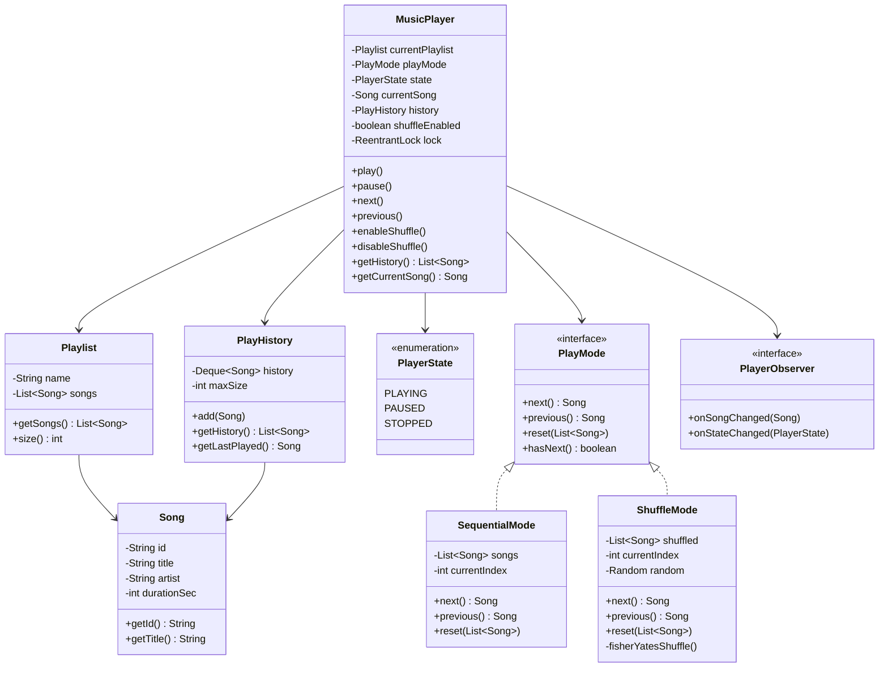
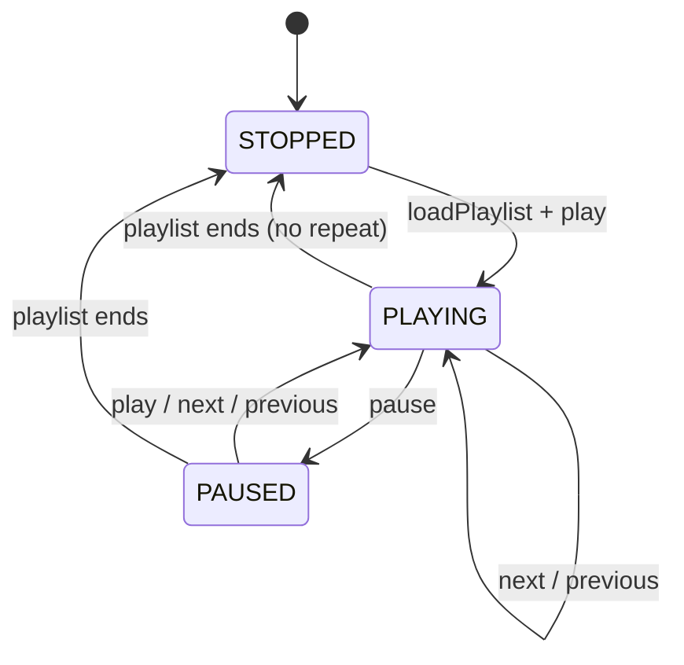
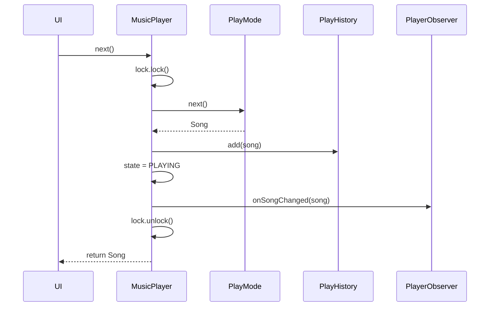

# Designing a Music Player

⚡ **Difficulty:** Medium 🏷️ **Patterns:** Strategy, Observer, State, Iterator 🏢 **Asked at:** PhonePe, Spotify, Amazon, Flipkart

---

## Functional Requirements

1. **Play / Pause** a song
2. **Next / Previous** song navigation
3. **Enable / Disable shuffle** — toggle between sequential and random play order
4. **No song repeats while shuffling** — once shuffled, every song plays exactly once before cycling
5. **History of songs played** — track all played songs in order

## Non-Functional Requirements

1. **Thread-safety** — handle concurrent play/pause/next requests (e.g., from UI thread + notification controls)
2. **O(1) next/previous** — instant track switching regardless of playlist size
3. **Extensibility** — easy to add new play modes (repeat-one, repeat-all, priority queue)
4. **Memory-efficient shuffle** — don't duplicate the playlist; shuffle in-place

---

## Core Entities

| Entity | Description |
|---|---|
| `Song` | Immutable value object — id, title, artist, duration |
| `Playlist` | Ordered collection of songs |
| `MusicPlayer` | Main controller — owns state, play mode, and history |
| `PlayMode` (interface) | Strategy for determining next/previous song |
| `SequentialMode` | Plays songs in playlist order |
| `ShuffleMode` | Plays songs in random order without repeats |
| `PlayerState` | Enum: PLAYING, PAUSED, STOPPED |
| `PlayHistory` | Ordered log of songs played |

---

## Class Diagram



---

## API / System Interface

```java
public interface MusicPlayerAPI {
    void loadPlaylist(Playlist playlist);
    void play();
    void pause();
    Song next();
    Song previous();
    void enableShuffle();
    void disableShuffle();
    boolean isShuffleEnabled();
    Song getCurrentSong();
    List<Song> getHistory();
    void addObserver(PlayerObserver observer);
}
```

---

## Design Patterns Used

| Pattern | Where | Why |
|---|---|---|
| **Strategy** | `PlayMode` interface with `SequentialMode` / `ShuffleMode` | Swap play algorithm without modifying player. Adding RepeatMode = one new class. |
| **Observer** | `PlayerObserver` notified on song/state changes | Decouples UI updates from player logic. Multiple listeners (UI, analytics, notification bar). |
| **State** | `PlayerState` enum driving valid transitions | Prevents invalid operations (e.g., can't go "next" while STOPPED). |
| **Iterator** | Internal index-based traversal in each PlayMode | Uniform next/previous interface regardless of underlying order. |

---

## Data Structures

| Component | Data Structure | Why |
|---|---|---|
| Playlist songs | `ArrayList<Song>` | O(1) random access for shuffle index swaps |
| Shuffle order | `ArrayList<Song>` (shuffled copy) | Fisher-Yates in-place, O(1) next by index |
| Play history | `ArrayDeque<Song>` (bounded) | O(1) add to front, O(1) access last, auto-evict oldest |
| Observers | `CopyOnWriteArrayList<PlayerObserver>` | Thread-safe iteration during notification without locks |
| Current index | `int` | O(1) next/previous in both sequential and shuffle modes |

---

## Shuffle Logic — Fisher-Yates (No Repeats)

```java
public class ShuffleMode implements PlayMode {
    private List<Song> shuffled;
    private int currentIndex = -1;
    private final Random random = new Random();

    @Override
    public void reset(List<Song> songs) {
        // Create a shuffled copy — O(n) time, O(n) space
        this.shuffled = new ArrayList<>(songs);
        fisherYatesShuffle();
        this.currentIndex = -1;
    }

    private void fisherYatesShuffle() {
        for (int i = shuffled.size() - 1; i > 0; i--) {
            int j = random.nextInt(i + 1);
            Collections.swap(shuffled, i, j);
        }
    }

    @Override
    public Song next() {
        currentIndex++;
        if (currentIndex >= shuffled.size()) {
            // All songs played once — reshuffle for next cycle
            fisherYatesShuffle();
            currentIndex = 0;
        }
        return shuffled.get(currentIndex);
    }

    @Override
    public Song previous() {
        if (currentIndex > 0) currentIndex--;
        return shuffled.get(currentIndex);
    }

    @Override
    public boolean hasNext() {
        return shuffled != null && !shuffled.isEmpty();
    }
}
```

**Key guarantee:** Every song plays exactly once before any repeat. When all songs are exhausted, reshuffle and start a new cycle.

---

## Concurrency Handling

```java
public class MusicPlayer implements MusicPlayerAPI {
    private final ReentrantLock lock = new ReentrantLock();
    private volatile PlayerState state = PlayerState.STOPPED;
    private volatile Song currentSong;

    @Override
    public Song next() {
        lock.lock();
        try {
            if (state == PlayerState.STOPPED) {
                throw new IllegalStateException("No playlist loaded");
            }
            Song song = playMode.next();
            this.currentSong = song;
            this.state = PlayerState.PLAYING;
            history.add(song);
            notifyObservers(song);
            return song;
        } finally {
            lock.unlock();
        }
    }

    @Override
    public void enableShuffle() {
        lock.lock();
        try {
            this.shuffleEnabled = true;
            ShuffleMode mode = new ShuffleMode();
            mode.reset(currentPlaylist.getSongs());
            this.playMode = mode;
        } finally {
            lock.unlock();
        }
    }

    @Override
    public void disableShuffle() {
        lock.lock();
        try {
            this.shuffleEnabled = false;
            SequentialMode mode = new SequentialMode();
            mode.reset(currentPlaylist.getSongs());
            this.playMode = mode;
        } finally {
            lock.unlock();
        }
    }
}
```

**Why `ReentrantLock` over `synchronized`:**
- Allows try-lock patterns for non-blocking UI
- Can be fair (FIFO) if needed
- More explicit lock/unlock scope

**Thread-safe reads:**
- `currentSong` and `state` are `volatile` — safe to read without lock
- Observers use `CopyOnWriteArrayList` — safe to iterate while another thread adds/removes

---

## State Transitions



---

## Sequence Diagram — Next Song Flow



---

## How to Extend

| New Feature | How |
|---|---|
| **Repeat One** | New `RepeatOneMode implements PlayMode` — `next()` always returns same song |
| **Repeat All** | `SequentialMode` wraps index at end instead of stopping |
| **Queue (play next)** | Add a priority `Deque<Song>` checked before `PlayMode.next()` |
| **Crossfade** | Observer pattern — `AudioEngine` observer starts next song 3s before current ends |
| **Resume position** | `PlayHistory` stores `(Song, positionMs)` pairs |

---

## What Interviewers Look For

1. ✅ **Strategy pattern** for shuffle vs sequential — not if/else inside player
2. ✅ **Fisher-Yates guarantee** — no repeats, uniform distribution
3. ✅ **Thread-safety** — explicit lock + volatile for concurrent access
4. ✅ **History as bounded deque** — not unbounded list eating memory
5. ✅ **Observer** — player doesn't know about UI, analytics, or notifications
6. ✅ **Clean state machine** — no invalid transitions (can't next when stopped)

---

*Drop a comment below if you want this implemented end-to-end with a runnable Demo class 👇*
