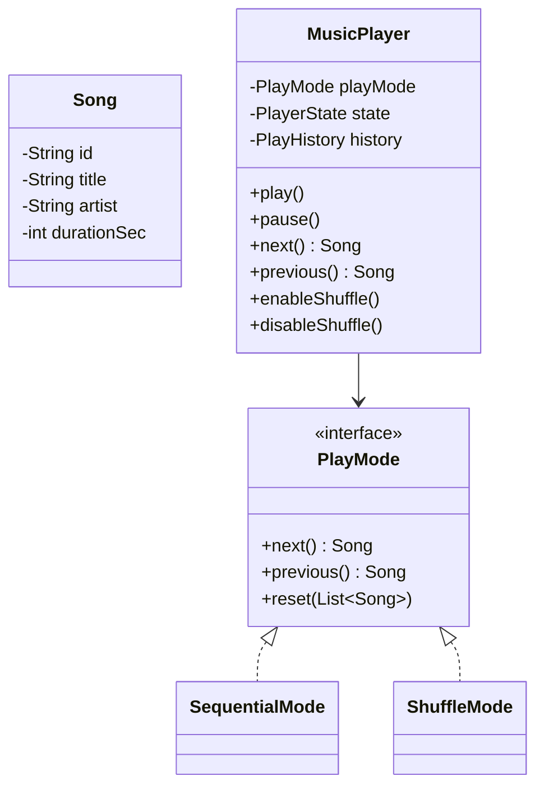
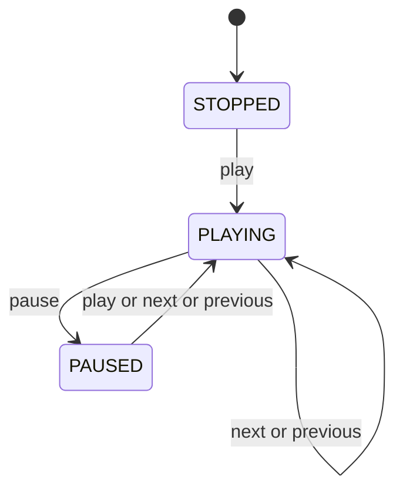

# Designing a Music Player

⚡ **Difficulty:** Medium 🏷️ **Patterns:** Strategy, Observer, State, Iterator 🏢 **Asked at:** PhonePe, Spotify, Amazon, Flipkart

---

## Functional Requirements

1. **Play / Pause** a song
2. **Next / Previous** song navigation
3. **Enable / Disable shuffle** — toggle between sequential and random play order
4. **No song repeats while shuffling** — every song plays exactly once before cycling
5. **History of songs played** — track all played songs in order

## Non-Functional Requirements

1. **Thread-safety** — handle concurrent play/pause/next requests
2. **O(1) next/previous** — instant track switching
3. **Extensibility** — easy to add new play modes (repeat-one, repeat-all)
4. **Memory-efficient shuffle** — Fisher-Yates in-place

---

## Core Entities

| Entity | Description |
|---|---|
| `Song` | Immutable — id, title, artist, duration |
| `Playlist` | Ordered collection of songs |
| `MusicPlayer` | Main controller — state, mode, history |
| `PlayMode` | Strategy interface for next/previous |
| `SequentialMode` | Plays in order |
| `ShuffleMode` | Fisher-Yates, no repeats |
| `PlayerState` | PLAYING, PAUSED, STOPPED |
| `PlayHistory` | Bounded deque of played songs |

---

## Class Diagram



---

## Design Patterns

| Pattern | Where | Why |
|---|---|---|
| **Strategy** | `PlayMode` with Sequential/Shuffle | Swap algorithm at runtime, no if/else |
| **Observer** | `PlayerObserver` on song/state change | Decouple UI from player logic |
| **State** | `PlayerState` enum | Prevent invalid transitions |
| **Iterator** | Index-based traversal in PlayMode | Uniform next/prev interface |

---

## Complete Code

### Song

<div class="code-tabs">
<div class="tab-buttons">
<button class="tab-btn active">Java</button>
<button class="tab-btn">Python</button>
<button class="tab-btn">C++</button>
</div>
<div class="tab-content active">

```java
package musicplayer.model;

public class Song {
    private final String id;
    private final String title;
    private final String artist;
    private final int durationSec;

    public Song(String id, String title, String artist, int durationSec) {
        this.id = id;
        this.title = title;
        this.artist = artist;
        this.durationSec = durationSec;
    }

    public String getId() { return id; }
    public String getTitle() { return title; }
    public String getArtist() { return artist; }
    public int getDurationSec() { return durationSec; }

    @Override
    public String toString() {
        return title + " — " + artist + " (" + durationSec + "s)";
    }

    @Override
    public boolean equals(Object o) {
        if (this == o) return true;
        if (!(o instanceof Song)) return false;
        return id.equals(((Song) o).id);
    }

    @Override
    public int hashCode() { return id.hashCode(); }
}
```

</div>
<div class="tab-content">

```python
from dataclasses import dataclass

@dataclass(frozen=True)
class Song:
    id: str
    title: str
    artist: str
    duration_sec: int

    def __str__(self):
        return f"{self.title} — {self.artist} ({self.duration_sec}s)"
```

</div>
<div class="tab-content">

```cpp
#pragma once
#include <string>

class Song {
public:
    std::string id;
    std::string title;
    std::string artist;
    int durationSec;

    Song(std::string id, std::string title, std::string artist, int dur)
        : id(std::move(id)), title(std::move(title)),
          artist(std::move(artist)), durationSec(dur) {}

    bool operator==(const Song& other) const { return id == other.id; }

    friend std::ostream& operator<<(std::ostream& os, const Song& s) {
        os << s.title << " — " << s.artist << " (" << s.durationSec << "s)";
        return os;
    }
};
```

</div>
</div>

### Playlist

<div class="code-tabs">
<div class="tab-buttons">
<button class="tab-btn active">Java</button>
<button class="tab-btn">Python</button>
<button class="tab-btn">C++</button>
</div>
<div class="tab-content active">

```java
package musicplayer.model;

import java.util.ArrayList;
import java.util.Collections;
import java.util.List;

public class Playlist {
    private final String name;
    private final List<Song> songs;

    public Playlist(String name) {
        this.name = name;
        this.songs = new ArrayList<>();
    }

    public void addSong(Song song) { songs.add(song); }
    public String getName() { return name; }
    public List<Song> getSongs() { return Collections.unmodifiableList(songs); }
    public int size() { return songs.size(); }
    public boolean isEmpty() { return songs.isEmpty(); }
}
```

</div>
<div class="tab-content">

```python
class Playlist:
    def __init__(self, name: str):
        self.name = name
        self.songs: list[Song] = []

    def add_song(self, song: Song):
        self.songs.append(song)

    def size(self) -> int:
        return len(self.songs)

    def is_empty(self) -> bool:
        return len(self.songs) == 0
```

</div>
<div class="tab-content">

```cpp
#pragma once
#include <vector>
#include <string>
#include "Song.h"

class Playlist {
public:
    std::string name;
    std::vector<Song> songs;

    Playlist(std::string name) : name(std::move(name)) {}

    void addSong(const Song& song) { songs.push_back(song); }
    int size() const { return songs.size(); }
    bool isEmpty() const { return songs.empty(); }
};
```

</div>
</div>

### PlayMode (Strategy Interface)

<div class="code-tabs">
<div class="tab-buttons">
<button class="tab-btn active">Java</button>
<button class="tab-btn">Python</button>
<button class="tab-btn">C++</button>
</div>
<div class="tab-content active">

```java
package musicplayer.strategy;

import musicplayer.model.Song;
import java.util.List;

public interface PlayMode {
    Song next();
    Song previous();
    void reset(List<Song> songs);
    boolean hasNext();
    Song current();
}
```

</div>
<div class="tab-content">

```python
from abc import ABC, abstractmethod

class PlayMode(ABC):
    @abstractmethod
    def next(self) -> Song | None:
        pass

    @abstractmethod
    def previous(self) -> Song | None:
        pass

    @abstractmethod
    def reset(self, songs: list[Song]):
        pass

    @abstractmethod
    def has_next(self) -> bool:
        pass

    @abstractmethod
    def current(self) -> Song | None:
        pass
```

</div>
<div class="tab-content">

```cpp
#pragma once
#include <vector>
#include "Song.h"

class PlayMode {
public:
    virtual ~PlayMode() = default;
    virtual Song* next() = 0;
    virtual Song* previous() = 0;
    virtual void reset(const std::vector<Song>& songs) = 0;
    virtual bool hasNext() const = 0;
    virtual Song* current() = 0;
};
```

</div>
</div>

### SequentialMode

<div class="code-tabs">
<div class="tab-buttons">
<button class="tab-btn active">Java</button>
<button class="tab-btn">Python</button>
<button class="tab-btn">C++</button>
</div>
<div class="tab-content active">

```java
package musicplayer.strategy;

import musicplayer.model.Song;
import java.util.ArrayList;
import java.util.List;

public class SequentialMode implements PlayMode {
    private List<Song> songs = new ArrayList<>();
    private int currentIndex = -1;

    @Override
    public void reset(List<Song> songs) {
        this.songs = new ArrayList<>(songs);
        this.currentIndex = -1;
    }

    @Override
    public Song next() {
        if (songs.isEmpty()) return null;
        currentIndex++;
        if (currentIndex >= songs.size()) currentIndex = 0;
        return songs.get(currentIndex);
    }

    @Override
    public Song previous() {
        if (songs.isEmpty()) return null;
        currentIndex--;
        if (currentIndex < 0) currentIndex = songs.size() - 1;
        return songs.get(currentIndex);
    }

    @Override
    public boolean hasNext() { return !songs.isEmpty(); }

    @Override
    public Song current() {
        if (currentIndex < 0 || currentIndex >= songs.size()) return null;
        return songs.get(currentIndex);
    }
}
```

</div>
<div class="tab-content">

```python
class SequentialMode(PlayMode):
    def __init__(self):
        self._songs: list[Song] = []
        self._index = -1

    def reset(self, songs: list[Song]):
        self._songs = list(songs)
        self._index = -1

    def next(self) -> Song | None:
        if not self._songs:
            return None
        self._index += 1
        if self._index >= len(self._songs):
            self._index = 0
        return self._songs[self._index]

    def previous(self) -> Song | None:
        if not self._songs:
            return None
        self._index -= 1
        if self._index < 0:
            self._index = len(self._songs) - 1
        return self._songs[self._index]

    def has_next(self) -> bool:
        return len(self._songs) > 0

    def current(self) -> Song | None:
        if self._index < 0 or self._index >= len(self._songs):
            return None
        return self._songs[self._index]
```

</div>
<div class="tab-content">

```cpp
#pragma once
#include <vector>
#include "PlayMode.h"

class SequentialMode : public PlayMode {
    std::vector<Song> songs;
    int currentIndex = -1;

public:
    void reset(const std::vector<Song>& s) override {
        songs = s;
        currentIndex = -1;
    }

    Song* next() override {
        if (songs.empty()) return nullptr;
        currentIndex++;
        if (currentIndex >= (int)songs.size()) currentIndex = 0;
        return &songs[currentIndex];
    }

    Song* previous() override {
        if (songs.empty()) return nullptr;
        currentIndex--;
        if (currentIndex < 0) currentIndex = songs.size() - 1;
        return &songs[currentIndex];
    }

    bool hasNext() const override { return !songs.empty(); }

    Song* current() override {
        if (currentIndex < 0 || currentIndex >= (int)songs.size()) return nullptr;
        return &songs[currentIndex];
    }
};
```

</div>
</div>

### ShuffleMode (Fisher-Yates, No Repeats)

<div class="code-tabs">
<div class="tab-buttons">
<button class="tab-btn active">Java</button>
<button class="tab-btn">Python</button>
<button class="tab-btn">C++</button>
</div>
<div class="tab-content active">

```java
package musicplayer.strategy;

import musicplayer.model.Song;
import java.util.*;

public class ShuffleMode implements PlayMode {
    private List<Song> shuffled = new ArrayList<>();
    private int currentIndex = -1;
    private final Random random = new Random();

    @Override
    public void reset(List<Song> songs) {
        this.shuffled = new ArrayList<>(songs);
        fisherYatesShuffle();
        this.currentIndex = -1;
    }

    private void fisherYatesShuffle() {
        for (int i = shuffled.size() - 1; i > 0; i--) {
            int j = random.nextInt(i + 1);
            Collections.swap(shuffled, i, j);
        }
    }

    @Override
    public Song next() {
        if (shuffled.isEmpty()) return null;
        currentIndex++;
        if (currentIndex >= shuffled.size()) {
            fisherYatesShuffle(); // all played once, reshuffle
            currentIndex = 0;
        }
        return shuffled.get(currentIndex);
    }

    @Override
    public Song previous() {
        if (shuffled.isEmpty()) return null;
        if (currentIndex > 0) currentIndex--;
        return shuffled.get(currentIndex);
    }

    @Override
    public boolean hasNext() { return !shuffled.isEmpty(); }

    @Override
    public Song current() {
        if (currentIndex < 0 || currentIndex >= shuffled.size()) return null;
        return shuffled.get(currentIndex);
    }
}
```

</div>
<div class="tab-content">

```python
import random

class ShuffleMode(PlayMode):
    def __init__(self):
        self._shuffled: list[Song] = []
        self._index = -1

    def reset(self, songs: list[Song]):
        self._shuffled = list(songs)
        self._fisher_yates_shuffle()
        self._index = -1

    def _fisher_yates_shuffle(self):
        for i in range(len(self._shuffled) - 1, 0, -1):
            j = random.randint(0, i)
            self._shuffled[i], self._shuffled[j] = self._shuffled[j], self._shuffled[i]

    def next(self) -> Song | None:
        if not self._shuffled:
            return None
        self._index += 1
        if self._index >= len(self._shuffled):
            self._fisher_yates_shuffle()
            self._index = 0
        return self._shuffled[self._index]

    def previous(self) -> Song | None:
        if not self._shuffled:
            return None
        if self._index > 0:
            self._index -= 1
        return self._shuffled[self._index]

    def has_next(self) -> bool:
        return len(self._shuffled) > 0

    def current(self) -> Song | None:
        if self._index < 0 or self._index >= len(self._shuffled):
            return None
        return self._shuffled[self._index]
```

</div>
<div class="tab-content">

```cpp
#pragma once
#include <vector>
#include <algorithm>
#include <random>
#include "PlayMode.h"

class ShuffleMode : public PlayMode {
    std::vector<Song> shuffled;
    int currentIndex = -1;
    std::mt19937 rng{std::random_device{}()};

    void fisherYatesShuffle() {
        for (int i = shuffled.size() - 1; i > 0; i--) {
            std::uniform_int_distribution<int> dist(0, i);
            std::swap(shuffled[i], shuffled[dist(rng)]);
        }
    }

public:
    void reset(const std::vector<Song>& songs) override {
        shuffled = songs;
        fisherYatesShuffle();
        currentIndex = -1;
    }

    Song* next() override {
        if (shuffled.empty()) return nullptr;
        currentIndex++;
        if (currentIndex >= (int)shuffled.size()) {
            fisherYatesShuffle();
            currentIndex = 0;
        }
        return &shuffled[currentIndex];
    }

    Song* previous() override {
        if (shuffled.empty()) return nullptr;
        if (currentIndex > 0) currentIndex--;
        return &shuffled[currentIndex];
    }

    bool hasNext() const override { return !shuffled.empty(); }

    Song* current() override {
        if (currentIndex < 0 || currentIndex >= (int)shuffled.size()) return nullptr;
        return &shuffled[currentIndex];
    }
};
```

</div>
</div>

### PlayHistory

<div class="code-tabs">
<div class="tab-buttons">
<button class="tab-btn active">Java</button>
<button class="tab-btn">Python</button>
<button class="tab-btn">C++</button>
</div>
<div class="tab-content active">

```java
package musicplayer.history;

import musicplayer.model.Song;
import java.util.*;

public class PlayHistory {
    private final Deque<Song> history;
    private final int maxSize;

    public PlayHistory(int maxSize) {
        this.maxSize = maxSize;
        this.history = new ArrayDeque<>(maxSize);
    }

    public void add(Song song) {
        if (song == null) return;
        if (history.size() >= maxSize) history.removeLast();
        history.addFirst(song);
    }

    public Song getLastPlayed() { return history.peekFirst(); }
    public List<Song> getHistory() { return new ArrayList<>(history); }
    public int size() { return history.size(); }
    public void clear() { history.clear(); }
}
```

</div>
<div class="tab-content">

```python
from collections import deque

class PlayHistory:
    def __init__(self, max_size: int = 100):
        self._history: deque[Song] = deque(maxlen=max_size)

    def add(self, song: Song):
        if song:
            self._history.appendleft(song)

    def get_last_played(self) -> Song | None:
        return self._history[0] if self._history else None

    def get_history(self) -> list[Song]:
        return list(self._history)

    def size(self) -> int:
        return len(self._history)

    def clear(self):
        self._history.clear()
```

</div>
<div class="tab-content">

```cpp
#pragma once
#include <deque>
#include <vector>
#include "Song.h"

class PlayHistory {
    std::deque<Song> history;
    int maxSize;

public:
    PlayHistory(int maxSize = 100) : maxSize(maxSize) {}

    void add(const Song& song) {
        if (history.size() >= (size_t)maxSize) history.pop_back();
        history.push_front(song);
    }

    const Song* getLastPlayed() const {
        return history.empty() ? nullptr : &history.front();
    }

    std::vector<Song> getHistory() const {
        return {history.begin(), history.end()};
    }

    int size() const { return history.size(); }
    void clear() { history.clear(); }
};
```

</div>
</div>

### MusicPlayer (Main Controller)

<div class="code-tabs">
<div class="tab-buttons">
<button class="tab-btn active">Java</button>
<button class="tab-btn">Python</button>
<button class="tab-btn">C++</button>
</div>
<div class="tab-content active">

```java
package musicplayer;

import musicplayer.history.PlayHistory;
import musicplayer.model.*;
import musicplayer.strategy.*;

import java.util.List;
import java.util.concurrent.CopyOnWriteArrayList;
import java.util.concurrent.locks.ReentrantLock;

public enum PlayerState { PLAYING, PAUSED, STOPPED }

public interface PlayerObserver {
    void onSongChanged(Song song);
    void onStateChanged(PlayerState state);
}

public class MusicPlayer {
    private Playlist currentPlaylist;
    private PlayMode playMode;
    private volatile PlayerState state = PlayerState.STOPPED;
    private volatile Song currentSong;
    private final PlayHistory history = new PlayHistory(100);
    private boolean shuffleEnabled = false;
    private final ReentrantLock lock = new ReentrantLock();
    private final List<PlayerObserver> observers = new CopyOnWriteArrayList<>();

    public void loadPlaylist(Playlist playlist) {
        lock.lock();
        try {
            this.currentPlaylist = playlist;
            this.playMode = new SequentialMode();
            this.playMode.reset(playlist.getSongs());
            this.state = PlayerState.STOPPED;
            this.currentSong = null;
        } finally { lock.unlock(); }
    }

    public void play() {
        lock.lock();
        try {
            if (state == PlayerState.PAUSED) {
                state = PlayerState.PLAYING;
                notifyState();
            } else if (state == PlayerState.STOPPED) {
                Song song = playMode.next();
                if (song != null) {
                    currentSong = song;
                    state = PlayerState.PLAYING;
                    history.add(song);
                    notifySong(song);
                    notifyState();
                }
            }
        } finally { lock.unlock(); }
    }

    public void pause() {
        lock.lock();
        try {
            if (state == PlayerState.PLAYING) {
                state = PlayerState.PAUSED;
                notifyState();
            }
        } finally { lock.unlock(); }
    }

    public Song next() {
        lock.lock();
        try {
            Song song = playMode.next();
            if (song != null) {
                currentSong = song;
                state = PlayerState.PLAYING;
                history.add(song);
                notifySong(song);
                notifyState();
            }
            return song;
        } finally { lock.unlock(); }
    }

    public Song previous() {
        lock.lock();
        try {
            Song song = playMode.previous();
            if (song != null) {
                currentSong = song;
                state = PlayerState.PLAYING;
                history.add(song);
                notifySong(song);
                notifyState();
            }
            return song;
        } finally { lock.unlock(); }
    }

    public void enableShuffle() {
        lock.lock();
        try {
            shuffleEnabled = true;
            playMode = new ShuffleMode();
            playMode.reset(currentPlaylist.getSongs());
            System.out.println("Shuffle: ON");
        } finally { lock.unlock(); }
    }

    public void disableShuffle() {
        lock.lock();
        try {
            shuffleEnabled = false;
            playMode = new SequentialMode();
            playMode.reset(currentPlaylist.getSongs());
            System.out.println("Shuffle: OFF");
        } finally { lock.unlock(); }
    }

    public boolean isShuffleEnabled() { return shuffleEnabled; }
    public Song getCurrentSong() { return currentSong; }
    public PlayerState getState() { return state; }
    public List<Song> getHistory() { return history.getHistory(); }

    public void addObserver(PlayerObserver o) { observers.add(o); }
    public void removeObserver(PlayerObserver o) { observers.remove(o); }

    private void notifySong(Song s) { for (var o : observers) o.onSongChanged(s); }
    private void notifyState() { for (var o : observers) o.onStateChanged(state); }
}
```

</div>
<div class="tab-content">

```python
import threading
from enum import Enum, auto

class PlayerState(Enum):
    PLAYING = auto()
    PAUSED = auto()
    STOPPED = auto()

class PlayerObserver:
    def on_song_changed(self, song: Song): pass
    def on_state_changed(self, state: PlayerState): pass

class MusicPlayer:
    def __init__(self):
        self._playlist: Playlist | None = None
        self._play_mode: PlayMode = SequentialMode()
        self._state = PlayerState.STOPPED
        self._current_song: Song | None = None
        self._history = PlayHistory(100)
        self._shuffle_enabled = False
        self._lock = threading.Lock()
        self._observers: list[PlayerObserver] = []

    def load_playlist(self, playlist: Playlist):
        with self._lock:
            self._playlist = playlist
            self._play_mode = SequentialMode()
            self._play_mode.reset(playlist.songs)
            self._state = PlayerState.STOPPED
            self._current_song = None

    def play(self):
        with self._lock:
            if self._state == PlayerState.PAUSED:
                self._state = PlayerState.PLAYING
                self._notify_state()
            elif self._state == PlayerState.STOPPED:
                song = self._play_mode.next()
                if song:
                    self._current_song = song
                    self._state = PlayerState.PLAYING
                    self._history.add(song)
                    self._notify_song(song)
                    self._notify_state()

    def pause(self):
        with self._lock:
            if self._state == PlayerState.PLAYING:
                self._state = PlayerState.PAUSED
                self._notify_state()

    def next(self) -> Song | None:
        with self._lock:
            song = self._play_mode.next()
            if song:
                self._current_song = song
                self._state = PlayerState.PLAYING
                self._history.add(song)
                self._notify_song(song)
                self._notify_state()
            return song

    def previous(self) -> Song | None:
        with self._lock:
            song = self._play_mode.previous()
            if song:
                self._current_song = song
                self._state = PlayerState.PLAYING
                self._history.add(song)
                self._notify_song(song)
                self._notify_state()
            return song

    def enable_shuffle(self):
        with self._lock:
            self._shuffle_enabled = True
            self._play_mode = ShuffleMode()
            self._play_mode.reset(self._playlist.songs)
            print("Shuffle: ON")

    def disable_shuffle(self):
        with self._lock:
            self._shuffle_enabled = False
            self._play_mode = SequentialMode()
            self._play_mode.reset(self._playlist.songs)
            print("Shuffle: OFF")

    @property
    def shuffle_enabled(self) -> bool:
        return self._shuffle_enabled

    @property
    def current_song(self) -> Song | None:
        return self._current_song

    @property
    def state(self) -> PlayerState:
        return self._state

    def get_history(self) -> list[Song]:
        return self._history.get_history()

    def add_observer(self, obs: PlayerObserver):
        self._observers.append(obs)

    def _notify_song(self, song: Song):
        for o in self._observers:
            o.on_song_changed(song)

    def _notify_state(self):
        for o in self._observers:
            o.on_state_changed(self._state)
```

</div>
<div class="tab-content">

```cpp
#pragma once
#include <mutex>
#include <vector>
#include <memory>
#include <iostream>
#include "Song.h"
#include "Playlist.h"
#include "PlayMode.h"
#include "SequentialMode.h"
#include "ShuffleMode.h"
#include "PlayHistory.h"

enum class PlayerState { PLAYING, PAUSED, STOPPED };

class PlayerObserver {
public:
    virtual ~PlayerObserver() = default;
    virtual void onSongChanged(const Song& song) = 0;
    virtual void onStateChanged(PlayerState state) = 0;
};

class MusicPlayer {
    Playlist* currentPlaylist = nullptr;
    std::unique_ptr<PlayMode> playMode;
    PlayerState state = PlayerState::STOPPED;
    Song* currentSong = nullptr;
    PlayHistory history{100};
    bool shuffleEnabled = false;
    std::mutex mtx;
    std::vector<PlayerObserver*> observers;

    void notifySong(const Song& s) {
        for (auto* o : observers) o->onSongChanged(s);
    }
    void notifyState() {
        for (auto* o : observers) o->onStateChanged(state);
    }

public:
    MusicPlayer() : playMode(std::make_unique<SequentialMode>()) {}

    void loadPlaylist(Playlist& playlist) {
        std::lock_guard<std::mutex> lock(mtx);
        currentPlaylist = &playlist;
        playMode = std::make_unique<SequentialMode>();
        playMode->reset(playlist.songs);
        state = PlayerState::STOPPED;
        currentSong = nullptr;
    }

    void play() {
        std::lock_guard<std::mutex> lock(mtx);
        if (state == PlayerState::PAUSED) {
            state = PlayerState::PLAYING;
            notifyState();
        } else if (state == PlayerState::STOPPED) {
            Song* song = playMode->next();
            if (song) {
                currentSong = song;
                state = PlayerState::PLAYING;
                history.add(*song);
                notifySong(*song);
                notifyState();
            }
        }
    }

    void pause() {
        std::lock_guard<std::mutex> lock(mtx);
        if (state == PlayerState::PLAYING) {
            state = PlayerState::PAUSED;
            notifyState();
        }
    }

    Song* next() {
        std::lock_guard<std::mutex> lock(mtx);
        Song* song = playMode->next();
        if (song) {
            currentSong = song;
            state = PlayerState::PLAYING;
            history.add(*song);
            notifySong(*song);
            notifyState();
        }
        return song;
    }

    Song* previous() {
        std::lock_guard<std::mutex> lock(mtx);
        Song* song = playMode->previous();
        if (song) {
            currentSong = song;
            state = PlayerState::PLAYING;
            history.add(*song);
            notifySong(*song);
            notifyState();
        }
        return song;
    }

    void enableShuffle() {
        std::lock_guard<std::mutex> lock(mtx);
        shuffleEnabled = true;
        playMode = std::make_unique<ShuffleMode>();
        playMode->reset(currentPlaylist->songs);
        std::cout << "Shuffle: ON\n";
    }

    void disableShuffle() {
        std::lock_guard<std::mutex> lock(mtx);
        shuffleEnabled = false;
        playMode = std::make_unique<SequentialMode>();
        playMode->reset(currentPlaylist->songs);
        std::cout << "Shuffle: OFF\n";
    }

    bool isShuffleEnabled() const { return shuffleEnabled; }
    Song* getCurrentSong() { return currentSong; }
    PlayerState getState() const { return state; }
    std::vector<Song> getHistory() { return history.getHistory(); }

    void addObserver(PlayerObserver* o) { observers.push_back(o); }
};
```

</div>
</div>

### Demo (Runnable)

<div class="code-tabs">
<div class="tab-buttons">
<button class="tab-btn active">Java</button>
<button class="tab-btn">Python</button>
<button class="tab-btn">C++</button>
</div>
<div class="tab-content active">

```java
package musicplayer;

import musicplayer.model.*;

public class Demo {
    public static void main(String[] args) {
        System.out.println("══════ MUSIC PLAYER DEMO ══════\n");

        MusicPlayer player = new MusicPlayer();
        player.addObserver(new PlayerObserver() {
            public void onSongChanged(Song s) { System.out.println("  ♪ Now playing: " + s); }
            public void onStateChanged(PlayerState st) { System.out.println("  ⏸ State: " + st); }
        });

        Playlist pl = new Playlist("Favourites");
        pl.addSong(new Song("1", "Blinding Lights", "The Weeknd", 200));
        pl.addSong(new Song("2", "Bohemian Rhapsody", "Queen", 354));
        pl.addSong(new Song("3", "Shape of You", "Ed Sheeran", 233));
        pl.addSong(new Song("4", "Starboy", "The Weeknd", 230));
        pl.addSong(new Song("5", "Someone Like You", "Adele", 285));

        player.loadPlaylist(pl);

        System.out.println("--- Sequential ---");
        player.play();
        player.next();
        player.next();
        player.pause();
        player.play(); // resume
        player.previous();

        System.out.println("\n--- Shuffle (no repeats) ---");
        player.enableShuffle();
        for (int i = 0; i < 5; i++) player.next();
        System.out.println("All 5 played without repeat!");

        System.out.println("\n--- History ---");
        var hist = player.getHistory();
        for (int i = 0; i < Math.min(5, hist.size()); i++)
            System.out.println("  " + (i+1) + ". " + hist.get(i));

        System.out.println("\n══════ DONE ══════");
    }
}
```

</div>
<div class="tab-content">

```python
def demo():
    print("══════ MUSIC PLAYER DEMO ══════\n")

    class ConsolePrinter(PlayerObserver):
        def on_song_changed(self, song):
            print(f"  ♪ Now playing: {song}")
        def on_state_changed(self, state):
            print(f"  ⏸ State: {state.name}")

    player = MusicPlayer()
    player.add_observer(ConsolePrinter())

    pl = Playlist("Favourites")
    pl.add_song(Song("1", "Blinding Lights", "The Weeknd", 200))
    pl.add_song(Song("2", "Bohemian Rhapsody", "Queen", 354))
    pl.add_song(Song("3", "Shape of You", "Ed Sheeran", 233))
    pl.add_song(Song("4", "Starboy", "The Weeknd", 230))
    pl.add_song(Song("5", "Someone Like You", "Adele", 285))

    player.load_playlist(pl)

    print("--- Sequential ---")
    player.play()
    player.next()
    player.next()
    player.pause()
    player.play()
    player.previous()

    print("\n--- Shuffle (no repeats) ---")
    player.enable_shuffle()
    for _ in range(5):
        player.next()
    print("All 5 played without repeat!")

    print("\n--- History ---")
    for i, song in enumerate(player.get_history()[:5]):
        print(f"  {i+1}. {song}")

    print("\n══════ DONE ══════")

if __name__ == "__main__":
    demo()
```

</div>
<div class="tab-content">

```cpp
#include <iostream>
#include "MusicPlayer.h"

class ConsolePrinter : public PlayerObserver {
public:
    void onSongChanged(const Song& s) override {
        std::cout << "  ♪ Now playing: " << s << "\n";
    }
    void onStateChanged(PlayerState st) override {
        std::cout << "  ⏸ State: " << (int)st << "\n";
    }
};

int main() {
    std::cout << "══════ MUSIC PLAYER DEMO ══════\n\n";

    MusicPlayer player;
    ConsolePrinter printer;
    player.addObserver(&printer);

    Playlist pl("Favourites");
    pl.addSong(Song("1", "Blinding Lights", "The Weeknd", 200));
    pl.addSong(Song("2", "Bohemian Rhapsody", "Queen", 354));
    pl.addSong(Song("3", "Shape of You", "Ed Sheeran", 233));
    pl.addSong(Song("4", "Starboy", "The Weeknd", 230));
    pl.addSong(Song("5", "Someone Like You", "Adele", 285));

    player.loadPlaylist(pl);

    std::cout << "--- Sequential ---\n";
    player.play();
    player.next();
    player.next();
    player.pause();
    player.play();
    player.previous();

    std::cout << "\n--- Shuffle (no repeats) ---\n";
    player.enableShuffle();
    for (int i = 0; i < 5; i++) player.next();
    std::cout << "All 5 played without repeat!\n";

    std::cout << "\n--- History ---\n";
    auto hist = player.getHistory();
    for (int i = 0; i < std::min(5, (int)hist.size()); i++)
        std::cout << "  " << (i+1) << ". " << hist[i] << "\n";

    std::cout << "\n══════ DONE ══════\n";
    return 0;
}
```

</div>
</div>

---

## State Transitions



---

## How to Extend

| Feature | Implementation |
|---|---|
| **Repeat One** | New `RepeatOneMode` — `next()` returns same song |
| **Play Queue** | `Deque<Song>` checked before `PlayMode.next()` |
| **Crossfade** | Timer observer triggers `next()` 3s before end |
| **Lyrics sync** | New observer fetches lyrics on `onSongChanged` |

---

## What Interviewers Look For

1. ✅ Strategy pattern for shuffle vs sequential
2. ✅ Fisher-Yates — no repeats, O(n)
3. ✅ Thread-safety — locks + volatile/atomic
4. ✅ Bounded history — deque with eviction
5. ✅ Observer — decoupled notifications
6. ✅ Runnable demo — compiles end-to-end

---

*Related: [Parking Lot LLD](/ParkingLot) · [HLD Problems](/hld)*
