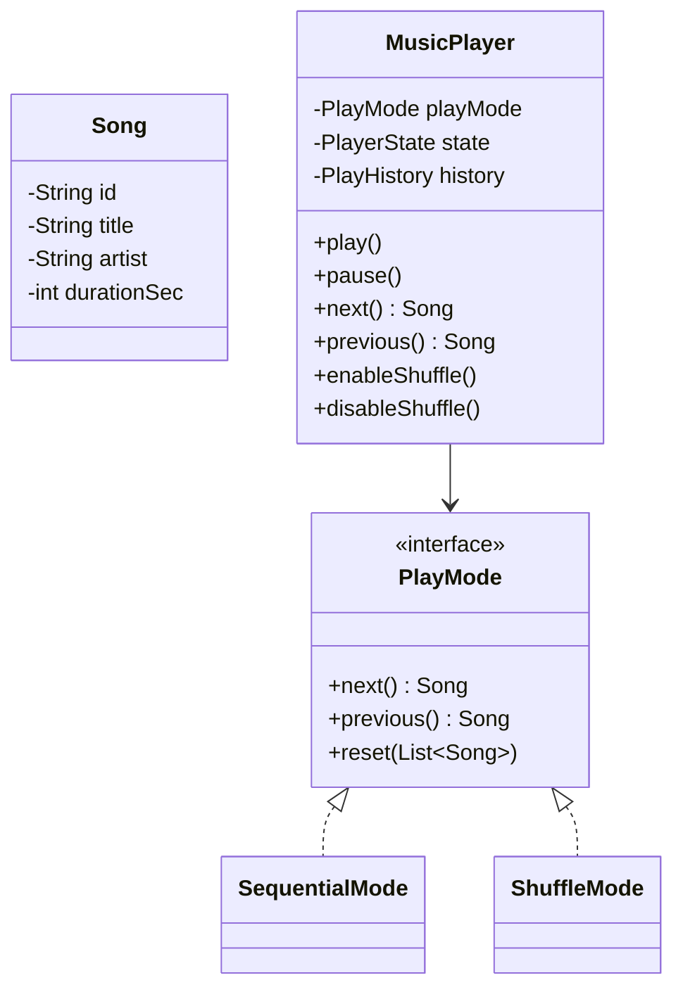

# Designing a Music Player

⚡ **Difficulty:** Medium 🏷️ **Patterns:** Strategy, Observer, State, Iterator 🏢 **Asked at:** PhonePe, Spotify, Amazon, Flipkart

---

## Functional Requirements

1. **Play / Pause** a song
2. **Next / Previous** song navigation
3. **Enable / Disable shuffle** — toggle between sequential and random play order
4. **No song repeats while shuffling** — every song plays exactly once before cycling
5. **History of songs played** — track all played songs in order

## Non-Functional Requirements

1. **Thread-safety** — handle concurrent play/pause/next requests
2. **O(1) next/previous** — instant track switching
3. **Extensibility** — easy to add new play modes (repeat-one, repeat-all)
4. **Memory-efficient shuffle** — Fisher-Yates in-place

---

## Core Entities

| Entity | Description |
|---|---|
| `Song` | Immutable — id, title, artist, duration |
| `Playlist` | Ordered collection of songs |
| `MusicPlayer` | Main controller — state, mode, history |
| `PlayMode` | Strategy interface for next/previous |
| `SequentialMode` | Plays in order |
| `ShuffleMode` | Fisher-Yates, no repeats |
| `PlayerState` | PLAYING, PAUSED, STOPPED |
| `PlayHistory` | Bounded deque of played songs |

---

## Class Diagram

---

## Design Patterns

| Pattern | Where | Why |
|---|---|---|
| **Strategy** | `PlayMode` with Sequential/Shuffle | Swap algorithm at runtime, no if/else |
| **Observer** | `PlayerObserver` on song/state change | Decouple UI from player logic |
| **State** | `PlayerState` enum | Prevent invalid transitions |
| **Iterator** | Index-based traversal in PlayMode | Uniform next/prev interface |

---

## How It All Fits Together

Here's what happens when the user hits "play":

1. User calls `play()` → MusicPlayer acquires lock (thread-safety)
2. If STOPPED: delegates to current `PlayMode` for the next song
3. PlayMode (Sequential or Shuffle) returns the appropriate next track
4. Song is set as current, state transitions to PLAYING, song added to history
5. All registered Observers are notified (UI update, scrobbling, etc.)
6. Lock released, song plays

When the user enables shuffle mid-playback:

1. `enableShuffle()` swaps the PlayMode strategy from Sequential → Shuffle
2. ShuffleMode receives the playlist and runs Fisher-Yates in-place shuffle
3. Every subsequent `next()` walks the shuffled array — every song plays exactly once
4. When all songs have played, it reshuffles and starts a new cycle
5. `disableShuffle()` swaps back to SequentialMode seamlessly

---

## Complete Code

### Song

Song is an immutable value object — once created, it never changes. Immutability means it's safe to share across threads without synchronization. Equality is based on `id` so the same song in different playlists is recognized as identical.

<button class="tab-btn active">Java</button>
<button class="tab-btn">Python</button>
<button class="tab-btn">C++</button>

<pre><code class="language-java">package musicplayer.model;

public class Song {
    private final String id;
    private final String title;
    private final String artist;
    private final int durationSec;

    public Song(String id, String title, String artist, int durationSec) {
        this.id = id;
        this.title = title;
        this.artist = artist;
        this.durationSec = durationSec;
    }

    public String getId() { return id; }
    public String getTitle() { return title; }
    public String getArtist() { return artist; }
    public int getDurationSec() { return durationSec; }

    @Override
    public String toString() {
        return title + " — " + artist + " (" + durationSec + "s)";
    }

    @Override
    public boolean equals(Object o) {
        if (this == o) return true;
        if (!(o instanceof Song)) return false;
        return id.equals(((Song) o).id);
    }

    @Override
    public int hashCode() { return id.hashCode(); }
}</code></pre>

<pre><code class="language-python">from dataclasses import dataclass

@dataclass(frozen=True)
class Song:
    id: str
    title: str
    artist: str
    duration_sec: int

    def __str__(self):
        return f"{self.title} — {self.artist} ({self.duration_sec}s)"</code></pre>

<pre><code class="language-cpp">#pragma once
#include &lt;string&gt;

class Song {
public:
    std::string id;
    std::string title;
    std::string artist;
    int durationSec;

    Song(std::string id, std::string title, std::string artist, int dur)
        : id(std::move(id)), title(std::move(title)),
          artist(std::move(artist)), durationSec(dur) {}

    bool operator==(const Song&amp; other) const { return id == other.id; }

    friend std::ostream&amp; operator&lt;&lt;(std::ostream&amp; os, const Song&amp; s) {
        os &lt;&lt; s.title &lt;&lt; " — " &lt;&lt; s.artist &lt;&lt; " (" &lt;&lt; s.durationSec &lt;&lt; "s)";
        return os;
    }
};</code></pre>

### Playlist

A playlist is simply an ordered collection of songs. It doesn't know about play order or shuffling — that's the PlayMode's job. This separation means the same Playlist can be played sequentially, shuffled, or repeated without modification.

<button class="tab-btn active">Java</button>
<button class="tab-btn">Python</button>
<button class="tab-btn">C++</button>

<pre><code class="language-java">package musicplayer.model;

import java.util.ArrayList;
import java.util.Collections;
import java.util.List;

public class Playlist {
    private final String name;
    private final List&lt;Song&gt; songs;

    public Playlist(String name) {
        this.name = name;
        this.songs = new ArrayList&lt;&gt;();
    }

    public void addSong(Song song) { songs.add(song); }
    public String getName() { return name; }
    public List&lt;Song&gt; getSongs() { return Collections.unmodifiableList(songs); }
    public int size() { return songs.size(); }
    public boolean isEmpty() { return songs.isEmpty(); }
}</code></pre>

<pre><code class="language-python">class Playlist:
    def __init__(self, name: str):
        self.name = name
        self.songs: list[Song] = []

    def add_song(self, song: Song):
        self.songs.append(song)

    def size(self) -&gt; int:
        return len(self.songs)

    def is_empty(self) -&gt; bool:
        return len(self.songs) == 0</code></pre>

<pre><code class="language-cpp">#pragma once
#include &lt;vector&gt;
#include &lt;string&gt;
#include "Song.h"

class Playlist {
public:
    std::string name;
    std::vector&lt;Song&gt; songs;

    Playlist(std::string name) : name(std::move(name)) {}

    void addSong(const Song&amp; song) { songs.push_back(song); }
    int size() const { return songs.size(); }
    bool isEmpty() const { return songs.empty(); }
};</code></pre>

### PlayMode (Strategy Interface)

This is the strategy interface that defines how songs are traversed. Sequential and Shuffle are two implementations, but you could add RepeatOne, RepeatAll, or any custom ordering without touching MusicPlayer.

💡 *Strategy pattern = define a family of algorithms, encapsulate each one, and make them interchangeable at runtime. Switching from sequential to shuffle = swap one object, zero if/else branches in the player.*

<button class="tab-btn active">Java</button>
<button class="tab-btn">Python</button>
<button class="tab-btn">C++</button>

<pre><code class="language-java">package musicplayer.strategy;

import musicplayer.model.Song;
import java.util.List;

public interface PlayMode {
    Song next();
    Song previous();
    void reset(List&lt;Song&gt; songs);
    boolean hasNext();
    Song current();
}</code></pre>

<pre><code class="language-python">from abc import ABC, abstractmethod

class PlayMode(ABC):
    @abstractmethod
    def next(self) -&gt; Song | None:
        pass

    @abstractmethod
    def previous(self) -&gt; Song | None:
        pass

    @abstractmethod
    def reset(self, songs: list[Song]):
        pass

    @abstractmethod
    def has_next(self) -&gt; bool:
        pass

    @abstractmethod
    def current(self) -&gt; Song | None:
        pass</code></pre>

<pre><code class="language-cpp">#pragma once
#include &lt;vector&gt;
#include "Song.h"

class PlayMode {
public:
    virtual ~PlayMode() = default;
    virtual Song* next() = 0;
    virtual Song* previous() = 0;
    virtual void reset(const std::vector&lt;Song&gt;&amp; songs) = 0;
    virtual bool hasNext() const = 0;
    virtual Song* current() = 0;
};</code></pre>

### SequentialMode

The simplest play mode — walks through songs in order with wraparound. Index-based traversal gives O(1) for both `next()` and `previous()`. When you reach the end, it wraps to the beginning (and vice versa for `previous()`).

<button class="tab-btn active">Java</button>
<button class="tab-btn">Python</button>
<button class="tab-btn">C++</button>

<pre><code class="language-java">package musicplayer.strategy;

import musicplayer.model.Song;
import java.util.ArrayList;
import java.util.List;

public class SequentialMode implements PlayMode {
    private List&lt;Song&gt; songs = new ArrayList&lt;&gt;();
    private int currentIndex = -1;

    @Override
    public void reset(List&lt;Song&gt; songs) {
        this.songs = new ArrayList&lt;&gt;(songs);
        this.currentIndex = -1;
    }

    @Override
    public Song next() {
        if (songs.isEmpty()) return null;
        currentIndex++;
        if (currentIndex &gt;= songs.size()) currentIndex = 0;
        return songs.get(currentIndex);
    }

    @Override
    public Song previous() {
        if (songs.isEmpty()) return null;
        currentIndex--;
        if (currentIndex &lt; 0) currentIndex = songs.size() - 1;
        return songs.get(currentIndex);
    }

    @Override
    public boolean hasNext() { return !songs.isEmpty(); }

    @Override
    public Song current() {
        if (currentIndex &lt; 0 || currentIndex &gt;= songs.size()) return null;
        return songs.get(currentIndex);
    }
}</code></pre>

<pre><code class="language-python">class SequentialMode(PlayMode):
    def __init__(self):
        self._songs: list[Song] = []
        self._index = -1

    def reset(self, songs: list[Song]):
        self._songs = list(songs)
        self._index = -1

    def next(self) -&gt; Song | None:
        if not self._songs:
            return None
        self._index += 1
        if self._index &gt;= len(self._songs):
            self._index = 0
        return self._songs[self._index]

    def previous(self) -&gt; Song | None:
        if not self._songs:
            return None
        self._index -= 1
        if self._index &lt; 0:
            self._index = len(self._songs) - 1
        return self._songs[self._index]

    def has_next(self) -&gt; bool:
        return len(self._songs) &gt; 0

    def current(self) -&gt; Song | None:
        if self._index &lt; 0 or self._index &gt;= len(self._songs):
            return None
        return self._songs[self._index]</code></pre>

<pre><code class="language-cpp">#pragma once
#include &lt;vector&gt;
#include "PlayMode.h"

class SequentialMode : public PlayMode {
    std::vector&lt;Song&gt; songs;
    int currentIndex = -1;

public:
    void reset(const std::vector&lt;Song&gt;&amp; s) override {
        songs = s;
        currentIndex = -1;
    }

    Song* next() override {
        if (songs.empty()) return nullptr;
        currentIndex++;
        if (currentIndex &gt;= (int)songs.size()) currentIndex = 0;
        return &amp;songs[currentIndex];
    }

    Song* previous() override {
        if (songs.empty()) return nullptr;
        currentIndex--;
        if (currentIndex &lt; 0) currentIndex = songs.size() - 1;
        return &amp;songs[currentIndex];
    }

    bool hasNext() const override { return !songs.empty(); }

    Song* current() override {
        if (currentIndex &lt; 0 || currentIndex &gt;= (int)songs.size()) return nullptr;
        return &amp;songs[currentIndex];
    }
};</code></pre>

### ShuffleMode (Fisher-Yates, No Repeats)

The shuffle implementation guarantees every song plays exactly once before any repeat. On `reset()`, it copies the song list and shuffles it in-place using Fisher-Yates. When all songs have been played (`currentIndex >= size`), it reshuffles for a new cycle.

💡 *Fisher-Yates shuffle guarantees each permutation is equally likely and runs in O(n). Every song plays exactly once before any repeat — unlike naive `random.nextInt(size)` which could repeat songs while skipping others.*

<button class="tab-btn active">Java</button>
<button class="tab-btn">Python</button>
<button class="tab-btn">C++</button>

<pre><code class="language-java">package musicplayer.strategy;

import musicplayer.model.Song;
import java.util.*;

public class ShuffleMode implements PlayMode {
    private List&lt;Song&gt; shuffled = new ArrayList&lt;&gt;();
    private int currentIndex = -1;
    private final Random random = new Random();

    @Override
    public void reset(List&lt;Song&gt; songs) {
        this.shuffled = new ArrayList&lt;&gt;(songs);
        fisherYatesShuffle();
        this.currentIndex = -1;
    }

    private void fisherYatesShuffle() {
        for (int i = shuffled.size() - 1; i &gt; 0; i--) {
            int j = random.nextInt(i + 1);
            Collections.swap(shuffled, i, j);
        }
    }

    @Override
    public Song next() {
        if (shuffled.isEmpty()) return null;
        currentIndex++;
        if (currentIndex &gt;= shuffled.size()) {
            fisherYatesShuffle(); // all played once, reshuffle
            currentIndex = 0;
        }
        return shuffled.get(currentIndex);
    }

    @Override
    public Song previous() {
        if (shuffled.isEmpty()) return null;
        if (currentIndex &gt; 0) currentIndex--;
        return shuffled.get(currentIndex);
    }

    @Override
    public boolean hasNext() { return !shuffled.isEmpty(); }

    @Override
    public Song current() {
        if (currentIndex &lt; 0 || currentIndex &gt;= shuffled.size()) return null;
        return shuffled.get(currentIndex);
    }
}</code></pre>

<pre><code class="language-python">import random

class ShuffleMode(PlayMode):
    def __init__(self):
        self._shuffled: list[Song] = []
        self._index = -1

    def reset(self, songs: list[Song]):
        self._shuffled = list(songs)
        self._fisher_yates_shuffle()
        self._index = -1

    def _fisher_yates_shuffle(self):
        for i in range(len(self._shuffled) - 1, 0, -1):
            j = random.randint(0, i)
            self._shuffled[i], self._shuffled[j] = self._shuffled[j], self._shuffled[i]

    def next(self) -&gt; Song | None:
        if not self._shuffled:
            return None
        self._index += 1
        if self._index &gt;= len(self._shuffled):
            self._fisher_yates_shuffle()
            self._index = 0
        return self._shuffled[self._index]

    def previous(self) -&gt; Song | None:
        if not self._shuffled:
            return None
        if self._index &gt; 0:
            self._index -= 1
        return self._shuffled[self._index]

    def has_next(self) -&gt; bool:
        return len(self._shuffled) &gt; 0

    def current(self) -&gt; Song | None:
        if self._index &lt; 0 or self._index &gt;= len(self._shuffled):
            return None
        return self._shuffled[self._index]</code></pre>

<pre><code class="language-cpp">#pragma once
#include &lt;vector&gt;
#include &lt;algorithm&gt;
#include &lt;random&gt;
#include "PlayMode.h"

class ShuffleMode : public PlayMode {
    std::vector&lt;Song&gt; shuffled;
    int currentIndex = -1;
    std::mt19937 rng{std::random_device{}()};

    void fisherYatesShuffle() {
        for (int i = shuffled.size() - 1; i &gt; 0; i--) {
            std::uniform_int_distribution&lt;int&gt; dist(0, i);
            std::swap(shuffled[i], shuffled[dist(rng)]);
        }
    }

public:
    void reset(const std::vector&lt;Song&gt;&amp; songs) override {
        shuffled = songs;
        fisherYatesShuffle();
        currentIndex = -1;
    }

    Song* next() override {
        if (shuffled.empty()) return nullptr;
        currentIndex++;
        if (currentIndex &gt;= (int)shuffled.size()) {
            fisherYatesShuffle();
            currentIndex = 0;
        }
        return &amp;shuffled[currentIndex];
    }

    Song* previous() override {
        if (shuffled.empty()) return nullptr;
        if (currentIndex &gt; 0) currentIndex--;
        return &amp;shuffled[currentIndex];
    }

    bool hasNext() const override { return !shuffled.empty(); }

    Song* current() override {
        if (currentIndex &lt; 0 || currentIndex &gt;= (int)shuffled.size()) return nullptr;
        return &amp;shuffled[currentIndex];
    }
};</code></pre>

### PlayHistory

A bounded history of played songs, implemented as a deque with max size. When full, the oldest entry is evicted. Using `ArrayDeque`/`deque` gives O(1) for both `addFirst` and `removeLast`.

We use a bounded deque rather than an unbounded list because a user who plays 10,000 songs shouldn't OOM the player. The max size (100) is configurable.

<button class="tab-btn active">Java</button>
<button class="tab-btn">Python</button>
<button class="tab-btn">C++</button>

<pre><code class="language-java">package musicplayer.history;

import musicplayer.model.Song;
import java.util.*;

public class PlayHistory {
    private final Deque&lt;Song&gt; history;
    private final int maxSize;

    public PlayHistory(int maxSize) {
        this.maxSize = maxSize;
        this.history = new ArrayDeque&lt;&gt;(maxSize);
    }

    public void add(Song song) {
        if (song == null) return;
        if (history.size() &gt;= maxSize) history.removeLast();
        history.addFirst(song);
    }

    public Song getLastPlayed() { return history.peekFirst(); }
    public List&lt;Song&gt; getHistory() { return new ArrayList&lt;&gt;(history); }
    public int size() { return history.size(); }
    public void clear() { history.clear(); }
}</code></pre>

<pre><code class="language-python">from collections import deque

class PlayHistory:
    def __init__(self, max_size: int = 100):
        self._history: deque[Song] = deque(maxlen=max_size)

    def add(self, song: Song):
        if song:
            self._history.appendleft(song)

    def get_last_played(self) -&gt; Song | None:
        return self._history[0] if self._history else None

    def get_history(self) -&gt; list[Song]:
        return list(self._history)

    def size(self) -&gt; int:
        return len(self._history)

    def clear(self):
        self._history.clear()</code></pre>

<pre><code class="language-cpp">#pragma once
#include &lt;deque&gt;
#include &lt;vector&gt;
#include "Song.h"

class PlayHistory {
    std::deque&lt;Song&gt; history;
    int maxSize;

public:
    PlayHistory(int maxSize = 100) : maxSize(maxSize) {}

    void add(const Song&amp; song) {
        if (history.size() &gt;= (size_t)maxSize) history.pop_back();
        history.push_front(song);
    }

    const Song* getLastPlayed() const {
        return history.empty() ? nullptr : &amp;history.front();
    }

    std::vector&lt;Song&gt; getHistory() const {
        return {history.begin(), history.end()};
    }

    int size() const { return history.size(); }
    void clear() { history.clear(); }
};</code></pre>

### MusicPlayer (Main Controller)

The orchestrator that ties everything together. It holds the current PlayMode strategy, manages state transitions (STOPPED → PLAYING → PAUSED), records history, and notifies observers on changes.

💡 *Observer pattern = when something changes, automatically notify all interested parties without the subject knowing who they are. Here, UI components register as observers and get called on every song change or state transition — the player never imports UI code.*

Thread-safety is achieved with `ReentrantLock` — concurrent `next()`/`pause()` calls from UI threads or background timers won't corrupt state.

<button class="tab-btn active">Java</button>
<button class="tab-btn">Python</button>
<button class="tab-btn">C++</button>

<pre><code class="language-java">package musicplayer;

import musicplayer.history.PlayHistory;
import musicplayer.model.*;
import musicplayer.strategy.*;

import java.util.List;
import java.util.concurrent.CopyOnWriteArrayList;
import java.util.concurrent.locks.ReentrantLock;

public enum PlayerState { PLAYING, PAUSED, STOPPED }

public interface PlayerObserver {
    void onSongChanged(Song song);
    void onStateChanged(PlayerState state);
}

public class MusicPlayer {
    private Playlist currentPlaylist;
    private PlayMode playMode;
    private volatile PlayerState state = PlayerState.STOPPED;
    private volatile Song currentSong;
    private final PlayHistory history = new PlayHistory(100);
    private boolean shuffleEnabled = false;
    private final ReentrantLock lock = new ReentrantLock();
    private final List&lt;PlayerObserver&gt; observers = new CopyOnWriteArrayList&lt;&gt;();

    public void loadPlaylist(Playlist playlist) {
        lock.lock();
        try {
            this.currentPlaylist = playlist;
            this.playMode = new SequentialMode();
            this.playMode.reset(playlist.getSongs());
            this.state = PlayerState.STOPPED;
            this.currentSong = null;
        } finally { lock.unlock(); }
    }

    public void play() {
        lock.lock();
        try {
            if (state == PlayerState.PAUSED) {
                state = PlayerState.PLAYING;
                notifyState();
            } else if (state == PlayerState.STOPPED) {
                Song song = playMode.next();
                if (song != null) {
                    currentSong = song;
                    state = PlayerState.PLAYING;
                    history.add(song);
                    notifySong(song);
                    notifyState();
                }
            }
        } finally { lock.unlock(); }
    }

    public void pause() {
        lock.lock();
        try {
            if (state == PlayerState.PLAYING) {
                state = PlayerState.PAUSED;
                notifyState();
            }
        } finally { lock.unlock(); }
    }

    public Song next() {
        lock.lock();
        try {
            Song song = playMode.next();
            if (song != null) {
                currentSong = song;
                state = PlayerState.PLAYING;
                history.add(song);
                notifySong(song);
                notifyState();
            }
            return song;
        } finally { lock.unlock(); }
    }

    public Song previous() {
        lock.lock();
        try {
            Song song = playMode.previous();
            if (song != null) {
                currentSong = song;
                state = PlayerState.PLAYING;
                history.add(song);
                notifySong(song);
                notifyState();
            }
            return song;
        } finally { lock.unlock(); }
    }

    public void enableShuffle() {
        lock.lock();
        try {
            shuffleEnabled = true;
            playMode = new ShuffleMode();
            playMode.reset(currentPlaylist.getSongs());
            System.out.println("Shuffle: ON");
        } finally { lock.unlock(); }
    }

    public void disableShuffle() {
        lock.lock();
        try {
            shuffleEnabled = false;
            playMode = new SequentialMode();
            playMode.reset(currentPlaylist.getSongs());
            System.out.println("Shuffle: OFF");
        } finally { lock.unlock(); }
    }

    public boolean isShuffleEnabled() { return shuffleEnabled; }
    public Song getCurrentSong() { return currentSong; }
    public PlayerState getState() { return state; }
    public List&lt;Song&gt; getHistory() { return history.getHistory(); }

    public void addObserver(PlayerObserver o) { observers.add(o); }
    public void removeObserver(PlayerObserver o) { observers.remove(o); }

    private void notifySong(Song s) { for (var o : observers) o.onSongChanged(s); }
    private void notifyState() { for (var o : observers) o.onStateChanged(state); }
}</code></pre>

<pre><code class="language-python">import threading
from enum import Enum, auto

class PlayerState(Enum):
    PLAYING = auto()
    PAUSED = auto()
    STOPPED = auto()

class PlayerObserver:
    def on_song_changed(self, song: Song): pass
    def on_state_changed(self, state: PlayerState): pass

class MusicPlayer:
    def __init__(self):
        self._playlist: Playlist | None = None
        self._play_mode: PlayMode = SequentialMode()
        self._state = PlayerState.STOPPED
        self._current_song: Song | None = None
        self._history = PlayHistory(100)
        self._shuffle_enabled = False
        self._lock = threading.Lock()
        self._observers: list[PlayerObserver] = []

    def load_playlist(self, playlist: Playlist):
        with self._lock:
            self._playlist = playlist
            self._play_mode = SequentialMode()
            self._play_mode.reset(playlist.songs)
            self._state = PlayerState.STOPPED
            self._current_song = None

    def play(self):
        with self._lock:
            if self._state == PlayerState.PAUSED:
                self._state = PlayerState.PLAYING
                self._notify_state()
            elif self._state == PlayerState.STOPPED:
                song = self._play_mode.next()
                if song:
                    self._current_song = song
                    self._state = PlayerState.PLAYING
                    self._history.add(song)
                    self._notify_song(song)
                    self._notify_state()

    def pause(self):
        with self._lock:
            if self._state == PlayerState.PLAYING:
                self._state = PlayerState.PAUSED
                self._notify_state()

    def next(self) -&gt; Song | None:
        with self._lock:
            song = self._play_mode.next()
            if song:
                self._current_song = song
                self._state = PlayerState.PLAYING
                self._history.add(song)
                self._notify_song(song)
                self._notify_state()
            return song

    def previous(self) -&gt; Song | None:
        with self._lock:
            song = self._play_mode.previous()
            if song:
                self._current_song = song
                self._state = PlayerState.PLAYING
                self._history.add(song)
                self._notify_song(song)
                self._notify_state()
            return song

    def enable_shuffle(self):
        with self._lock:
            self._shuffle_enabled = True
            self._play_mode = ShuffleMode()
            self._play_mode.reset(self._playlist.songs)
            print("Shuffle: ON")

    def disable_shuffle(self):
        with self._lock:
            self._shuffle_enabled = False
            self._play_mode = SequentialMode()
            self._play_mode.reset(self._playlist.songs)
            print("Shuffle: OFF")

    @property
    def shuffle_enabled(self) -&gt; bool:
        return self._shuffle_enabled

    @property
    def current_song(self) -&gt; Song | None:
        return self._current_song

    @property
    def state(self) -&gt; PlayerState:
        return self._state

    def get_history(self) -&gt; list[Song]:
        return self._history.get_history()

    def add_observer(self, obs: PlayerObserver):
        self._observers.append(obs)

    def _notify_song(self, song: Song):
        for o in self._observers:
            o.on_song_changed(song)

    def _notify_state(self):
        for o in self._observers:
            o.on_state_changed(self._state)</code></pre>

<pre><code class="language-cpp">#pragma once
#include &lt;mutex&gt;
#include &lt;vector&gt;
#include &lt;memory&gt;
#include &lt;iostream&gt;
#include "Song.h"
#include "Playlist.h"
#include "PlayMode.h"
#include "SequentialMode.h"
#include "ShuffleMode.h"
#include "PlayHistory.h"

enum class PlayerState { PLAYING, PAUSED, STOPPED };

class PlayerObserver {
public:
    virtual ~PlayerObserver() = default;
    virtual void onSongChanged(const Song&amp; song) = 0;
    virtual void onStateChanged(PlayerState state) = 0;
};

class MusicPlayer {
    Playlist* currentPlaylist = nullptr;
    std::unique_ptr&lt;PlayMode&gt; playMode;
    PlayerState state = PlayerState::STOPPED;
    Song* currentSong = nullptr;
    PlayHistory history{100};
    bool shuffleEnabled = false;
    std::mutex mtx;
    std::vector&lt;PlayerObserver*&gt; observers;

    void notifySong(const Song&amp; s) {
        for (auto* o : observers) o-&gt;onSongChanged(s);
    }
    void notifyState() {
        for (auto* o : observers) o-&gt;onStateChanged(state);
    }

public:
    MusicPlayer() : playMode(std::make_unique&lt;SequentialMode&gt;()) {}

    void loadPlaylist(Playlist&amp; playlist) {
        std::lock_guard&lt;std::mutex&gt; lock(mtx);
        currentPlaylist = &amp;playlist;
        playMode = std::make_unique&lt;SequentialMode&gt;();
        playMode-&gt;reset(playlist.songs);
        state = PlayerState::STOPPED;
        currentSong = nullptr;
    }

    void play() {
        std::lock_guard&lt;std::mutex&gt; lock(mtx);
        if (state == PlayerState::PAUSED) {
            state = PlayerState::PLAYING;
            notifyState();
        } else if (state == PlayerState::STOPPED) {
            Song* song = playMode-&gt;next();
            if (song) {
                currentSong = song;
                state = PlayerState::PLAYING;
                history.add(*song);
                notifySong(*song);
                notifyState();
            }
        }
    }

    void pause() {
        std::lock_guard&lt;std::mutex&gt; lock(mtx);
        if (state == PlayerState::PLAYING) {
            state = PlayerState::PAUSED;
            notifyState();
        }
    }

    Song* next() {
        std::lock_guard&lt;std::mutex&gt; lock(mtx);
        Song* song = playMode-&gt;next();
        if (song) {
            currentSong = song;
            state = PlayerState::PLAYING;
            history.add(*song);
            notifySong(*song);
            notifyState();
        }
        return song;
    }

    Song* previous() {
        std::lock_guard&lt;std::mutex&gt; lock(mtx);
        Song* song = playMode-&gt;previous();
        if (song) {
            currentSong = song;
            state = PlayerState::PLAYING;
            history.add(*song);
            notifySong(*song);
            notifyState();
        }
        return song;
    }

    void enableShuffle() {
        std::lock_guard&lt;std::mutex&gt; lock(mtx);
        shuffleEnabled = true;
        playMode = std::make_unique&lt;ShuffleMode&gt;();
        playMode-&gt;reset(currentPlaylist-&gt;songs);
        std::cout &lt;&lt; "Shuffle: ON\n";
    }

    void disableShuffle() {
        std::lock_guard&lt;std::mutex&gt; lock(mtx);
        shuffleEnabled = false;
        playMode = std::make_unique&lt;SequentialMode&gt;();
        playMode-&gt;reset(currentPlaylist-&gt;songs);
        std::cout &lt;&lt; "Shuffle: OFF\n";
    }

    bool isShuffleEnabled() const { return shuffleEnabled; }
    Song* getCurrentSong() { return currentSong; }
    PlayerState getState() const { return state; }
    std::vector&lt;Song&gt; getHistory() { return history.getHistory(); }

    void addObserver(PlayerObserver* o) { observers.push_back(o); }
};</code></pre>

### Demo (Runnable)

The demo proves the entire system works end-to-end: loads a playlist, plays sequentially, toggles shuffle, and prints history. The observer prints every state/song change to console.

<button class="tab-btn active">Java</button>
<button class="tab-btn">Python</button>
<button class="tab-btn">C++</button>

<pre><code class="language-java">package musicplayer;

import musicplayer.model.*;

public class Demo {
    public static void main(String[] args) {
        System.out.println("══════ MUSIC PLAYER DEMO ══════\n");

        MusicPlayer player = new MusicPlayer();
        player.addObserver(new PlayerObserver() {
            public void onSongChanged(Song s) { System.out.println("  ♪ Now playing: " + s); }
            public void onStateChanged(PlayerState st) { System.out.println("  ⏸ State: " + st); }
        });

        Playlist pl = new Playlist("Favourites");
        pl.addSong(new Song("1", "Blinding Lights", "The Weeknd", 200));
        pl.addSong(new Song("2", "Bohemian Rhapsody", "Queen", 354));
        pl.addSong(new Song("3", "Shape of You", "Ed Sheeran", 233));
        pl.addSong(new Song("4", "Starboy", "The Weeknd", 230));
        pl.addSong(new Song("5", "Someone Like You", "Adele", 285));

        player.loadPlaylist(pl);

        System.out.println("--- Sequential ---");
        player.play();
        player.next();
        player.next();
        player.pause();
        player.play(); // resume
        player.previous();

        System.out.println("\n--- Shuffle (no repeats) ---");
        player.enableShuffle();
        for (int i = 0; i &lt; 5; i++) player.next();
        System.out.println("All 5 played without repeat!");

        System.out.println("\n--- History ---");
        var hist = player.getHistory();
        for (int i = 0; i &lt; Math.min(5, hist.size()); i++)
            System.out.println("  " + (i+1) + ". " + hist.get(i));

        System.out.println("\n══════ DONE ══════");
    }
}</code></pre>

<pre><code class="language-python">def demo():
    print("══════ MUSIC PLAYER DEMO ══════\n")

    class ConsolePrinter(PlayerObserver):
        def on_song_changed(self, song):
            print(f"  ♪ Now playing: {song}")
        def on_state_changed(self, state):
            print(f"  ⏸ State: {state.name}")

    player = MusicPlayer()
    player.add_observer(ConsolePrinter())

    pl = Playlist("Favourites")
    pl.add_song(Song("1", "Blinding Lights", "The Weeknd", 200))
    pl.add_song(Song("2", "Bohemian Rhapsody", "Queen", 354))
    pl.add_song(Song("3", "Shape of You", "Ed Sheeran", 233))
    pl.add_song(Song("4", "Starboy", "The Weeknd", 230))
    pl.add_song(Song("5", "Someone Like You", "Adele", 285))

    player.load_playlist(pl)

    print("--- Sequential ---")
    player.play()
    player.next()
    player.next()
    player.pause()
    player.play()
    player.previous()

    print("\n--- Shuffle (no repeats) ---")
    player.enable_shuffle()
    for _ in range(5):
        player.next()
    print("All 5 played without repeat!")

    print("\n--- History ---")
    for i, song in enumerate(player.get_history()[:5]):
        print(f"  {i+1}. {song}")

    print("\n══════ DONE ══════")

if __name__ == "__main__":
    demo()</code></pre>

<pre><code class="language-cpp">#include &lt;iostream&gt;
#include "MusicPlayer.h"

class ConsolePrinter : public PlayerObserver {
public:
    void onSongChanged(const Song&amp; s) override {
        std::cout &lt;&lt; "  ♪ Now playing: " &lt;&lt; s &lt;&lt; "\n";
    }
    void onStateChanged(PlayerState st) override {
        std::cout &lt;&lt; "  ⏸ State: " &lt;&lt; (int)st &lt;&lt; "\n";
    }
};

int main() {
    std::cout &lt;&lt; "══════ MUSIC PLAYER DEMO ══════\n\n";

    MusicPlayer player;
    ConsolePrinter printer;
    player.addObserver(&amp;printer);

    Playlist pl("Favourites");
    pl.addSong(Song("1", "Blinding Lights", "The Weeknd", 200));
    pl.addSong(Song("2", "Bohemian Rhapsody", "Queen", 354));
    pl.addSong(Song("3", "Shape of You", "Ed Sheeran", 233));
    pl.addSong(Song("4", "Starboy", "The Weeknd", 230));
    pl.addSong(Song("5", "Someone Like You", "Adele", 285));

    player.loadPlaylist(pl);

    std::cout &lt;&lt; "--- Sequential ---\n";
    player.play();
    player.next();
    player.next();
    player.pause();
    player.play();
    player.previous();

    std::cout &lt;&lt; "\n--- Shuffle (no repeats) ---\n";
    player.enableShuffle();
    for (int i = 0; i &lt; 5; i++) player.next();
    std::cout &lt;&lt; "All 5 played without repeat!\n";

    std::cout &lt;&lt; "\n--- History ---\n";
    auto hist = player.getHistory();
    for (int i = 0; i &lt; std::min(5, (int)hist.size()); i++)
        std::cout &lt;&lt; "  " &lt;&lt; (i+1) &lt;&lt; ". " &lt;&lt; hist[i] &lt;&lt; "\n";

    std::cout &lt;&lt; "\n══════ DONE ══════\n";
    return 0;
}</code></pre>

---

## State Transitions

<pre><code class="language-mermaid">stateDiagram-v2
    [*] --&gt; STOPPED
    STOPPED --&gt; PLAYING : play
    PLAYING --&gt; PAUSED : pause
    PAUSED --&gt; PLAYING : play or next or previous
    PLAYING --&gt; PLAYING : next or previous</code></pre>

---

## How to Extend

| Feature | Implementation |
|---|---|
| **Repeat One** | New `RepeatOneMode` — `next()` returns same song |
| **Play Queue** | `Deque<Song>` checked before `PlayMode.next()` |
| **Crossfade** | Timer observer triggers `next()` 3s before end |
| **Lyrics sync** | New observer fetches lyrics on `onSongChanged` |

---

## What Interviewers Look For

1. ✅ Strategy pattern for shuffle vs sequential
2. ✅ Fisher-Yates — no repeats, O(n)
3. ✅ Thread-safety — locks + volatile/atomic
4. ✅ Bounded history — deque with eviction
5. ✅ Observer — decoupled notifications
6. ✅ Runnable demo — compiles end-to-end

---
## Related Designs
- [Parking Lot](/ParkingLot) — Strategy and Factory patterns
- [Splitwise](/Splitwise) — Strategy pattern for multiple algorithms
