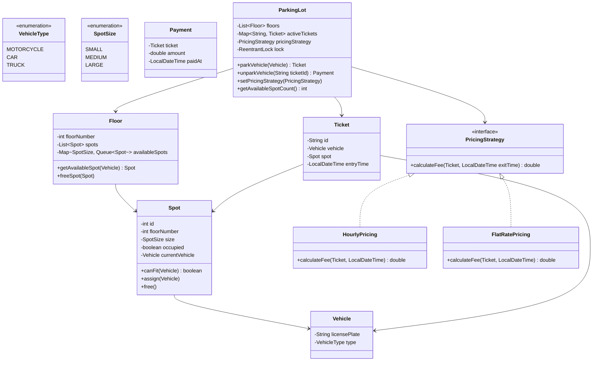
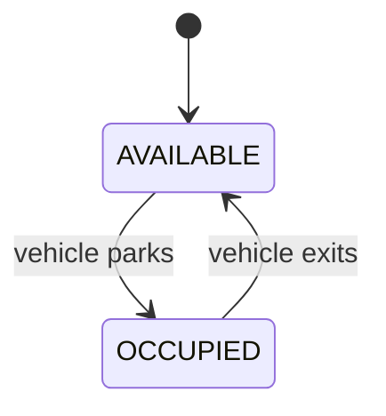
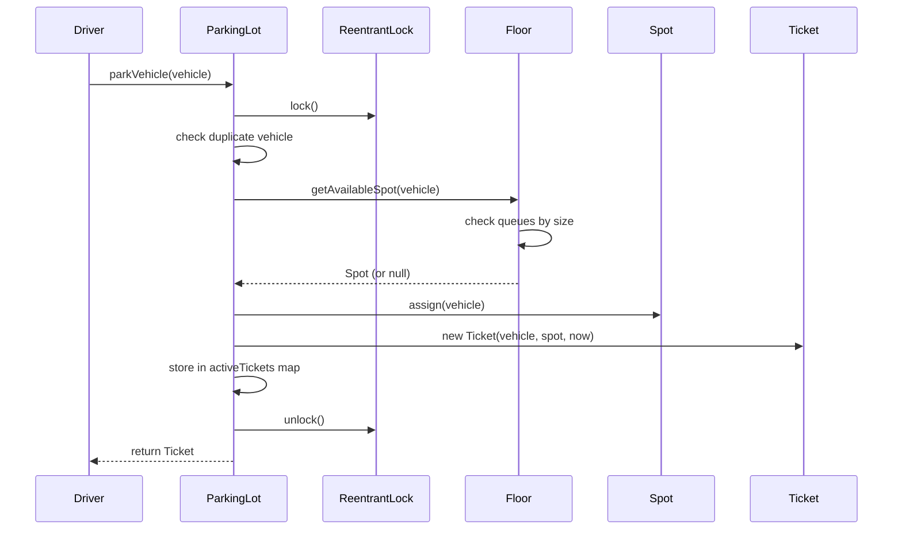

# Designing a Parking Lot System

⚡ **Difficulty:** Beginner 🏷️ **Patterns:** Strategy, Factory, Observer, Composition 🏢 **Asked at:** Flipkart, PhonePe, Amazon, Google, Uber

---

## Functional Requirements

1. Parking lot has **multiple floors**, each floor has spots of sizes: Small, Medium, Large
2. Vehicle types: **Motorcycle, Car, Truck**
3. Motorcycle fits in any spot. Car fits in Medium/Large. Truck needs Large only.
4. On entry: **assign nearest available matching spot**, issue ticket
5. On exit: **calculate fee** based on duration and vehicle type, process payment
6. **Strategy-based pricing** - hourly, flat-rate, or weekend pricing (swappable)

## Non-Functional Requirements

1. **Thread-safety** - two vehicles shouldn't be assigned the same spot concurrently
2. **O(1) spot lookup** - use appropriate data structures for fast spot assignment
3. **Extensibility** - adding new vehicle types, spot types, or pricing = minimal code changes

---

## Core Entities

| Entity | Description |
|---|---|
| `Vehicle` | License plate + type (Motorcycle, Car, Truck) |
| `VehicleType` | Enum: MOTORCYCLE, CAR, TRUCK |
| `Spot` | Has a size, tracks if occupied, knows which vehicle is parked |
| `SpotSize` | Enum: SMALL, MEDIUM, LARGE |
| `Floor` | Collection of spots, can find available spot for a vehicle |
| `ParkingLot` | Multiple floors, manages park/unpark operations |
| `Ticket` | Issued on entry - links vehicle, spot, entry time |
| `PricingStrategy` | Interface for fee calculation (Strategy pattern) |
| `HourlyPricing` | Charges per hour based on vehicle type |
| `FlatRatePricing` | Flat fee regardless of duration |
| `Payment` | Result of fee calculation |

---

## Class Diagram



---

## Design Patterns

| Pattern | Where | Why |
|---|---|---|
| **Strategy** | `PricingStrategy` interface with `HourlyPricing` / `FlatRatePricing` | Swap pricing at runtime. Weekend pricing = one new class, zero changes to ParkingLot. |
| **Factory** | `SpotFactory` creates spots of different sizes | Decouple spot creation from floor initialization logic. |
| **Composition** | ParkingLot HAS Floors, Floors HAVE Spots | Flexible hierarchical structure over inheritance. |
| **Observer** (extension) | Display panel notified on spot status change | Decouple UI from core logic. |

---

## Data Structures

| Component | Structure | Why |
|---|---|---|
| Available spots per size | `Map<SpotSize, Queue<Spot>>` | O(1) dequeue to get next available spot |
| Active tickets | `HashMap<String, Ticket>` | O(1) lookup on exit by ticket ID |
| Floors | `ArrayList<Floor>` | Sequential floor-by-floor search |
| Spot ID mapping | Implicit via floor + spot index | No extra map needed |

---

## How It All Fits Together

Here's what happens when a car arrives at the lot:

1. Driver enters → system calls `parkVehicle(car)`
2. ParkingLot acquires a lock (thread-safety for concurrent arrivals)
3. Checks if car is already parked (duplicate prevention via `vehicleTickets` map)
4. Iterates through floors, asking each for an available MEDIUM or LARGE spot
5. Floor checks its `Queue<Spot>` for the smallest fitting size first (best-fit strategy)
6. Spot is assigned, ticket is issued with entry timestamp
7. Lock is released, ticket returned to driver

When the car leaves:

1. Driver presents ticket → system calls `unparkVehicle(ticketId)`
2. ParkingLot acquires lock, looks up ticket in O(1) from `activeTickets` map
3. PricingStrategy calculates fee based on duration and vehicle type
4. Spot is freed and returned to the floor's available queue
5. Vehicle tracking removed, payment receipt generated and returned

---

## Complete Code

### VehicleType.java

These two enums define the type vocabulary for the entire system. Every sizing/pricing decision branches on these values, so centralizing them as enums prevents stringly-typed bugs.

```java
package parkinglot.model;

public enum VehicleType {
    MOTORCYCLE,
    CAR,
    TRUCK
}
```

### SpotSize.java

```java
package parkinglot.model;

public enum SpotSize {

    SMALL,
    MEDIUM,
    LARGE
}
```

### Vehicle.java

A vehicle is the "thing being parked." It's an immutable value object identified by its license plate. Equality is based on `licensePlate` so we can use it as a HashMap key for duplicate-parking detection.

```java
package parkinglot.model;

public class Vehicle {
    private final String licensePlate;
    private final VehicleType type;

    public Vehicle(String licensePlate, VehicleType type) {
        this.licensePlate = licensePlate;
        this.type = type;
    }

    public String getLicensePlate() { return licensePlate; }
    public VehicleType getType() { return type; }

    @Override
    public String toString() {
        return type + " [" + licensePlate + "]";
    }

    @Override
    public boolean equals(Object o) {
        if (this == o) return true;
        if (o == null || getClass() != o.getClass()) return false;
        Vehicle v = (Vehicle) o;
        return licensePlate.equals(v.licensePlate);
    }

    @Override
    public int hashCode() {
        return licensePlate.hashCode();
    }
}
```

### Spot.java

A spot is the atomic unit of the parking lot - it knows its size, whether it's occupied, and which vehicle is in it. The `canFit()` method encodes the sizing rules (motorcycle → any, car → medium/large, truck → large only) so the Floor doesn't need to know vehicle-specific logic.

```java
package parkinglot.model;

public class Spot {
    private final int id;
    private final int floorNumber;
    private final SpotSize size;
    private boolean occupied;
    private Vehicle currentVehicle;

    public Spot(int id, int floorNumber, SpotSize size) {
        this.id = id;
        this.floorNumber = floorNumber;
        this.size = size;
        this.occupied = false;
        this.currentVehicle = null;
    }

    /**
     * Check if this spot can fit the given vehicle.
     * Rules:
     *   Motorcycle → any spot (SMALL, MEDIUM, LARGE)
     *   Car → MEDIUM or LARGE only
     *   Truck → LARGE only
     */
    public boolean canFit(Vehicle vehicle) {
        if (occupied) return false;

        switch (vehicle.getType()) {
            case MOTORCYCLE:
                return true; // fits anywhere
            case CAR:
                return size == SpotSize.MEDIUM || size == SpotSize.LARGE;
            case TRUCK:
                return size == SpotSize.LARGE;
            default:
                return false;
        }
    }

    public void assign(Vehicle vehicle) {
        if (occupied) {
            throw new IllegalStateException("Spot " + id + " is already occupied");
        }
        this.occupied = true;
        this.currentVehicle = vehicle;
    }

    public void free() {
        this.occupied = false;
        this.currentVehicle = null;
    }

    public int getId() { return id; }
    public int getFloorNumber() { return floorNumber; }
    public SpotSize getSize() { return size; }
    public boolean isOccupied() { return occupied; }
    public Vehicle getCurrentVehicle() { return currentVehicle; }

    @Override
    public String toString() {
        return "Floor " + floorNumber + " | Spot " + id + " (" + size + ")" +
               (occupied ? " [OCCUPIED by " + currentVehicle + "]" : " [AVAILABLE]");
    }
}
```

### Floor.java

A floor owns a collection of spots and manages availability. The key data structure choice here is `Map<SpotSize, Queue<Spot>>` - a queue per spot size gives us O(1) retrieval of the next available spot instead of scanning all spots linearly. When a vehicle arrives, we try the smallest fitting size first (best-fit) so motorcycles don't waste large spots.

```java
package parkinglot.model;

import java.util.*;

public class Floor {
    private final int floorNumber;
    private final List<Spot> spots;
    private final Map<SpotSize, Queue<Spot>> availableSpots;

    public Floor(int floorNumber, int smallCount, int mediumCount, int largeCount) {
        this.floorNumber = floorNumber;
        this.spots = new ArrayList<>();
        this.availableSpots = new EnumMap<>(SpotSize.class);

        // Initialize queues for each size
        availableSpots.put(SpotSize.SMALL, new LinkedList<>());
        availableSpots.put(SpotSize.MEDIUM, new LinkedList<>());
        availableSpots.put(SpotSize.LARGE, new LinkedList<>());

        int id = 1;
        // Create spots and add to available queues
        for (int i = 0; i < smallCount; i++) {
            Spot spot = new Spot(id++, floorNumber, SpotSize.SMALL);
            spots.add(spot);
            availableSpots.get(SpotSize.SMALL).offer(spot);
        }
        for (int i = 0; i < mediumCount; i++) {
            Spot spot = new Spot(id++, floorNumber, SpotSize.MEDIUM);
            spots.add(spot);
            availableSpots.get(SpotSize.MEDIUM).offer(spot);
        }
        for (int i = 0; i < largeCount; i++) {
            Spot spot = new Spot(id++, floorNumber, SpotSize.LARGE);
            spots.add(spot);
            availableSpots.get(SpotSize.LARGE).offer(spot);
        }
    }

    /**
     * Find and assign an available spot for the vehicle.
     * Uses the smallest fitting spot first (best fit).
     * Returns null if no spot available on this floor.
     */
    public Spot getAvailableSpot(Vehicle vehicle) {
        // Try spots in order: smallest fitting first
        List<SpotSize> candidates = getFittingSizes(vehicle.getType());

        for (SpotSize size : candidates) {
            Queue<Spot> queue = availableSpots.get(size);
            if (!queue.isEmpty()) {
                return queue.poll(); // remove from available
            }
        }
        return null; // no spot on this floor
    }

    /**
     * Return a spot back to the available pool.
     */
    public void freeSpot(Spot spot) {
        availableSpots.get(spot.getSize()).offer(spot);
    }

    /**
     * Get compatible spot sizes for a vehicle type (smallest first).
     */
    private List<SpotSize> getFittingSizes(VehicleType type) {
        switch (type) {
            case MOTORCYCLE:
                return Arrays.asList(SpotSize.SMALL, SpotSize.MEDIUM, SpotSize.LARGE);
            case CAR:
                return Arrays.asList(SpotSize.MEDIUM, SpotSize.LARGE);
            case TRUCK:
                return Collections.singletonList(SpotSize.LARGE);
            default:
                return Collections.emptyList();
        }
    }

    public int getFloorNumber() { return floorNumber; }
    public List<Spot> getSpots() { return Collections.unmodifiableList(spots); }

    public int getAvailableCount() {
        return availableSpots.values().stream()
                .mapToInt(Queue::size)
                .sum();
    }

    public int getTotalCount() {
        return spots.size();
    }
}
```

### Ticket.java

A ticket is the proof of parking - it captures which vehicle is in which spot, and when they entered. The UUID-based ID ensures uniqueness without a central counter. This is the link between entry and exit: the driver presents the ticket ID at departure.

```java
package parkinglot.model;

import java.time.LocalDateTime;
import java.util.UUID;

public class Ticket {
    private final String id;
    private final Vehicle vehicle;
    private final Spot spot;
    private final LocalDateTime entryTime;

    public Ticket(Vehicle vehicle, Spot spot, LocalDateTime entryTime) {
        this.id = UUID.randomUUID().toString().substring(0, 8).toUpperCase();
        this.vehicle = vehicle;
        this.spot = spot;
        this.entryTime = entryTime;
    }

    public String getId() { return id; }
    public Vehicle getVehicle() { return vehicle; }
    public Spot getSpot() { return spot; }
    public LocalDateTime getEntryTime() { return entryTime; }

    @Override
    public String toString() {
        return "Ticket[" + id + "] " + vehicle + " → " + spot +
               " | Entry: " + entryTime;
    }
}
```

### Payment.java

Payment is the output of the unpark flow - it bundles the fee, hours parked, and timestamp into a receipt. Separating it from the pricing logic keeps the "what to charge" decision (strategy) independent from the "record what was charged" concern (this class).

```java
package parkinglot.model;

import java.time.LocalDateTime;

public class Payment {
    private final Ticket ticket;
    private final double amount;
    private final long hoursParked;
    private final LocalDateTime paidAt;

    public Payment(Ticket ticket, double amount, long hoursParked) {
        this.ticket = ticket;
        this.amount = amount;
        this.hoursParked = hoursParked;
        this.paidAt = LocalDateTime.now();
    }

    public Ticket getTicket() { return ticket; }
    public double getAmount() { return amount; }
    public long getHoursParked() { return hoursParked; }
    public LocalDateTime getPaidAt() { return paidAt; }

    @Override
    public String toString() {
        return "Payment: ₹" + amount + " | " + hoursParked + " hrs | " +
               ticket.getVehicle() + " | Ticket: " + ticket.getId();
    }
}
```

### PricingStrategy.java (Strategy Interface)

This is the heart of the extensibility story.

💡 *Strategy pattern = define a family of algorithms, encapsulate each one, and make them interchangeable at runtime. Adding a new pricing model = one new class, zero changes to existing code.*

The interface takes a ticket and exit time, returns a fee. ParkingLot delegates all pricing decisions here - it never contains pricing logic itself.

```java
package parkinglot.pricing;

import parkinglot.model.Ticket;
import java.time.LocalDateTime;

public interface PricingStrategy {
    /**
     * Calculate the parking fee for a ticket.
     * @param ticket The parking ticket
     * @param exitTime The time of exit
     * @return Fee amount in ₹
     */
    double calculateFee(Ticket ticket, LocalDateTime exitTime);
}
```

### HourlyPricing.java

The default strategy - charges per hour with different rates per vehicle type. Uses ceiling division (`(minutes + 59) / 60`) so even 1 minute counts as a full hour. The `EnumMap` gives us O(1) rate lookup by vehicle type.

```java
package parkinglot.pricing;

import parkinglot.model.Ticket;
import parkinglot.model.VehicleType;

import java.time.LocalDateTime;
import java.time.temporal.ChronoUnit;
import java.util.EnumMap;
import java.util.Map;

/**
 * Charges per hour based on vehicle type.
 * Minimum charge = 1 hour (even if parked for 5 minutes).
 */
public class HourlyPricing implements PricingStrategy {
    private final Map<VehicleType, Double> rates;

    public HourlyPricing() {
        rates = new EnumMap<>(VehicleType.class);
        rates.put(VehicleType.MOTORCYCLE, 10.0);
        rates.put(VehicleType.CAR, 20.0);
        rates.put(VehicleType.TRUCK, 30.0);
    }

    public HourlyPricing(double motorcycleRate, double carRate, double truckRate) {
        rates = new EnumMap<>(VehicleType.class);
        rates.put(VehicleType.MOTORCYCLE, motorcycleRate);
        rates.put(VehicleType.CAR, carRate);
        rates.put(VehicleType.TRUCK, truckRate);
    }

    @Override
    public double calculateFee(Ticket ticket, LocalDateTime exitTime) {
        long minutes = ChronoUnit.MINUTES.between(ticket.getEntryTime(), exitTime);
        long hours = (minutes + 59) / 60; // round up to next hour
        if (hours == 0) hours = 1; // minimum 1 hour

        double rate = rates.getOrDefault(ticket.getVehicle().getType(), 20.0);
        return hours * rate;
    }
}
```

### FlatRatePricing.java

A simpler strategy - flat fee per vehicle type regardless of how long they park. Useful for mall parking ("₹50 for the visit") or airport short-term. Demonstrates that strategies can have completely different logic while sharing the same interface.

```java
package parkinglot.pricing;

import parkinglot.model.Ticket;
import parkinglot.model.VehicleType;

import java.time.LocalDateTime;
import java.util.EnumMap;
import java.util.Map;

/**
 * Flat fee regardless of duration.
 * Good for mall parking, airport short-term, etc.
 */
public class FlatRatePricing implements PricingStrategy {
    private final Map<VehicleType, Double> flatRates;

    public FlatRatePricing() {
        flatRates = new EnumMap<>(VehicleType.class);
        flatRates.put(VehicleType.MOTORCYCLE, 20.0);
        flatRates.put(VehicleType.CAR, 50.0);
        flatRates.put(VehicleType.TRUCK, 100.0);
    }

    public FlatRatePricing(double motorcycleRate, double carRate, double truckRate) {
        flatRates = new EnumMap<>(VehicleType.class);
        flatRates.put(VehicleType.MOTORCYCLE, motorcycleRate);
        flatRates.put(VehicleType.CAR, carRate);
        flatRates.put(VehicleType.TRUCK, truckRate);
    }

    @Override
    public double calculateFee(Ticket ticket, LocalDateTime exitTime) {
        return flatRates.getOrDefault(ticket.getVehicle().getType(), 50.0);
    }
}
```

### WeekendPricing.java (Extension example)

This wraps any existing strategy and applies a multiplier on weekends.

💡 *Decorator pattern = wrap an existing object to add behavior without modifying it. Here we layer "2x on weekends" on top of any base pricing strategy - composable and open for extension.*

This shows how Strategy + Decorator combine: you can do `new WeekendPricing(new HourlyPricing())` to get hourly rates that double on Saturdays/Sundays.

```java
package parkinglot.pricing;

import parkinglot.model.Ticket;

import java.time.DayOfWeek;
import java.time.LocalDateTime;

/**
 * Double rate on weekends. Delegates to base strategy for calculation.
 * Demonstrates Decorator pattern on top of Strategy.
 */
public class WeekendPricing implements PricingStrategy {
    private final PricingStrategy baseStrategy;
    private final double weekendMultiplier;

    public WeekendPricing(PricingStrategy baseStrategy, double weekendMultiplier) {
        this.baseStrategy = baseStrategy;
        this.weekendMultiplier = weekendMultiplier;
    }

    public WeekendPricing(PricingStrategy baseStrategy) {
        this(baseStrategy, 2.0); // default 2x on weekends
    }

    @Override
    public double calculateFee(Ticket ticket, LocalDateTime exitTime) {
        double baseFee = baseStrategy.calculateFee(ticket, exitTime);
        DayOfWeek day = ticket.getEntryTime().getDayOfWeek();
        if (day == DayOfWeek.SATURDAY || day == DayOfWeek.SUNDAY) {
            return baseFee * weekendMultiplier;
        }
        return baseFee;
    }
}
```

### ParkingLotException.java

A domain-specific unchecked exception for parking operations (lot full, duplicate vehicle, invalid ticket). Gives callers a single exception type to catch for all parking-related failures.

```java
package parkinglot.exception;

public class ParkingLotException extends RuntimeException {
    public ParkingLotException(String message) {
        super(message);
    }
}
```

### ParkingLot.java (Main Controller)

The orchestrator - coordinates floors, tickets, and pricing. Uses `ReentrantLock` so two concurrent arrivals can't grab the same spot. The private constructor forces creation through the Builder, which avoids a 6-parameter constructor.

💡 *Builder pattern = construct complex objects step-by-step instead of telescoping constructors with 10 parameters. Here: `new Builder().name("Mall").addFloor(5,10,3).pricingStrategy(hourly).build()`*

We maintain two maps: `activeTickets` (ticketId → Ticket) for O(1) exit lookup, and `vehicleTickets` (plate → Ticket) for O(1) duplicate detection.

```java
package parkinglot;

import parkinglot.exception.ParkingLotException;
import parkinglot.model.*;
import parkinglot.pricing.HourlyPricing;
import parkinglot.pricing.PricingStrategy;

import java.time.LocalDateTime;
import java.util.*;
import java.util.concurrent.locks.ReentrantLock;

public class ParkingLot {
    private final String name;
    private final List<Floor> floors;
    private final Map<String, Ticket> activeTickets;   // ticketId → Ticket
    private final Map<String, Ticket> vehicleTickets;  // licensePlate → Ticket
    private PricingStrategy pricingStrategy;
    private final ReentrantLock lock;

    private ParkingLot(String name, List<Floor> floors, PricingStrategy pricingStrategy) {
        this.name = name;
        this.floors = floors;
        this.activeTickets = new HashMap<>();
        this.vehicleTickets = new HashMap<>();
        this.pricingStrategy = pricingStrategy;
        this.lock = new ReentrantLock();
    }

    // ─── Park Vehicle ───────────────────────────────────────

    public Ticket parkVehicle(Vehicle vehicle) {
        lock.lock();
        try {
            // Check if vehicle already parked
            if (vehicleTickets.containsKey(vehicle.getLicensePlate())) {
                throw new ParkingLotException(
                    "Vehicle " + vehicle.getLicensePlate() + " is already parked");
            }

            // Find available spot across all floors
            Spot spot = findSpot(vehicle);
            if (spot == null) {
                throw new ParkingLotException(
                    "No available spot for " + vehicle.getType());
            }

            // Assign spot and create ticket
            spot.assign(vehicle);
            Ticket ticket = new Ticket(vehicle, spot, LocalDateTime.now());
            activeTickets.put(ticket.getId(), ticket);
            vehicleTickets.put(vehicle.getLicensePlate(), ticket);

            return ticket;
        } finally {
            lock.unlock();
        }
    }

    // ─── Unpark Vehicle ─────────────────────────────────────

    public Payment unparkVehicle(String ticketId) {
        return unparkVehicle(ticketId, LocalDateTime.now());
    }

    public Payment unparkVehicle(String ticketId, LocalDateTime exitTime) {
        lock.lock();
        try {
            Ticket ticket = activeTickets.remove(ticketId);
            if (ticket == null) {
                throw new ParkingLotException("Invalid ticket: " + ticketId);
            }

            // Free the spot
            Spot spot = ticket.getSpot();
            spot.free();

            // Return spot to the floor's available pool
            floors.get(spot.getFloorNumber() - 1).freeSpot(spot);

            // Remove vehicle tracking
            vehicleTickets.remove(ticket.getVehicle().getLicensePlate());

            // Calculate fee
            double fee = pricingStrategy.calculateFee(ticket, exitTime);
            long hours = java.time.temporal.ChronoUnit.HOURS.between(
                ticket.getEntryTime(), exitTime) + 1;

            return new Payment(ticket, fee, hours);
        } finally {
            lock.unlock();
        }
    }

    // ─── Spot Finder ────────────────────────────────────────

    private Spot findSpot(Vehicle vehicle) {
        for (Floor floor : floors) {
            Spot spot = floor.getAvailableSpot(vehicle);
            if (spot != null) return spot;
        }
        return null;
    }

    // ─── Pricing Strategy (Runtime Swap) ────────────────────

    public void setPricingStrategy(PricingStrategy strategy) {
        lock.lock();
        try {
            this.pricingStrategy = strategy;
        } finally {
            lock.unlock();
        }
    }

    // ─── Status / Getters ───────────────────────────────────

    public int getTotalSpots() {
        return floors.stream().mapToInt(Floor::getTotalCount).sum();
    }

    public int getAvailableSpots() {
        return floors.stream().mapToInt(Floor::getAvailableCount).sum();
    }

    public int getOccupiedSpots() {
        return getTotalSpots() - getAvailableSpots();
    }

    public String getName() { return name; }
    public List<Floor> getFloors() { return Collections.unmodifiableList(floors); }
    public int getActiveTicketCount() { return activeTickets.size(); }

    public void displayStatus() {
        System.out.println("\n╔══════════════════════════════════════╗");
        System.out.println("║  " + name);
        System.out.println("╠══════════════════════════════════════╣");
        System.out.printf("║  Total: %d | Available: %d | Occupied: %d%n",
                getTotalSpots(), getAvailableSpots(), getOccupiedSpots());
        System.out.println("╠══════════════════════════════════════╣");
        for (Floor floor : floors) {
            System.out.printf("║  Floor %d: %d/%d available%n",
                    floor.getFloorNumber(), floor.getAvailableCount(), floor.getTotalCount());
        }
        System.out.println("╚══════════════════════════════════════╝");
    }

    // ─── Builder ────────────────────────────────────────────

    public static class Builder {
        private String name = "Parking Lot";
        private final List<Floor> floors = new ArrayList<>();
        private PricingStrategy pricingStrategy = new HourlyPricing();
        private int floorCounter = 0;

        public Builder name(String name) {
            this.name = name;
            return this;
        }

        public Builder addFloor(int smallSpots, int mediumSpots, int largeSpots) {
            floorCounter++;
            floors.add(new Floor(floorCounter, smallSpots, mediumSpots, largeSpots));
            return this;
        }

        public Builder pricingStrategy(PricingStrategy strategy) {
            this.pricingStrategy = strategy;
            return this;
        }

        public ParkingLot build() {
            if (floors.isEmpty()) {
                throw new IllegalStateException("Parking lot must have at least one floor");
            }
            return new ParkingLot(name, floors, pricingStrategy);
        }
    }
}
```

### Demo.java (Runnable end-to-end)

The demo proves the system works end-to-end: builds a lot, parks vehicles, handles duplicates, unparks with different pricing strategies, and demonstrates thread-safety with concurrent parking from two threads.

```java
package parkinglot;

import parkinglot.model.*;
import parkinglot.pricing.*;

import java.time.LocalDateTime;

public class Demo {
    public static void main(String[] args) {
        System.out.println("═══════════════════════════════════════");
        System.out.println("     PARKING LOT - LLD DEMO           ");
        System.out.println("═══════════════════════════════════════\n");

        // ─── Build Parking Lot ──────────────────────────────
        ParkingLot lot = new ParkingLot.Builder()
                .name("Phoenix Mall Parking")
                .addFloor(5, 10, 3)   // Floor 1: 5 small, 10 medium, 3 large
                .addFloor(5, 10, 3)   // Floor 2: same layout
                .addFloor(0, 5, 5)    // Floor 3: no small, 5 medium, 5 large
                .pricingStrategy(new HourlyPricing()) // ₹10/₹20/₹30 per hour
                .build();

        lot.displayStatus();

        // ─── Park Vehicles ──────────────────────────────────
        System.out.println("\n--- Parking Vehicles ---");

        Vehicle bike1 = new Vehicle("KA-01-1234", VehicleType.MOTORCYCLE);
        Vehicle car1 = new Vehicle("MH-12-AB-1234", VehicleType.CAR);
        Vehicle car2 = new Vehicle("DL-05-CD-5678", VehicleType.CAR);
        Vehicle truck1 = new Vehicle("TN-22-XY-9999", VehicleType.TRUCK);

        Ticket t1 = lot.parkVehicle(bike1);
        System.out.println("✓ Parked: " + t1);

        Ticket t2 = lot.parkVehicle(car1);
        System.out.println("✓ Parked: " + t2);

        Ticket t3 = lot.parkVehicle(car2);
        System.out.println("✓ Parked: " + t3);

        Ticket t4 = lot.parkVehicle(truck1);
        System.out.println("✓ Parked: " + t4);

        lot.displayStatus();

        // ─── Try Duplicate Park ─────────────────────────────
        System.out.println("\n--- Try Parking Same Vehicle Again ---");
        try {
            lot.parkVehicle(car1);
        } catch (Exception e) {
            System.out.println("✗ Expected error: " + e.getMessage());
        }

        // ─── Unpark with Hourly Pricing ─────────────────────
        System.out.println("\n--- Unpark (Hourly Pricing) ---");

        // Simulate 3 hours later
        LocalDateTime threeHoursLater = LocalDateTime.now().plusHours(3);

        Payment p1 = lot.unparkVehicle(t1.getId(), threeHoursLater);
        System.out.println("✓ " + p1);

        Payment p2 = lot.unparkVehicle(t2.getId(), threeHoursLater);
        System.out.println("✓ " + p2);

        // ─── Switch to Flat Rate Pricing ────────────────────
        System.out.println("\n--- Switch to Flat Rate Pricing ---");
        lot.setPricingStrategy(new FlatRatePricing()); // ₹20/₹50/₹100

        Payment p3 = lot.unparkVehicle(t3.getId(), threeHoursLater);
        System.out.println("✓ " + p3);

        // ─── Weekend Pricing (Decorator on Hourly) ──────────
        System.out.println("\n--- Switch to Weekend Pricing (2x Hourly) ---");
        lot.setPricingStrategy(new WeekendPricing(new HourlyPricing(), 2.0));

        Payment p4 = lot.unparkVehicle(t4.getId(), threeHoursLater);
        System.out.println("✓ " + p4);

        lot.displayStatus();

        // ─── Concurrent Access Demo ─────────────────────────
        System.out.println("\n--- Concurrent Parking (Thread Safety) ---");

        Thread thread1 = new Thread(() -> {
            for (int i = 0; i < 5; i++) {
                try {
                    Vehicle v = new Vehicle("T1-" + i, VehicleType.CAR);
                    Ticket t = lot.parkVehicle(v);
                    System.out.println("  [T1] Parked: " + v.getLicensePlate());
                } catch (Exception e) {
                    System.out.println("  [T1] " + e.getMessage());
                }
            }
        });

        Thread thread2 = new Thread(() -> {
            for (int i = 0; i < 5; i++) {
                try {
                    Vehicle v = new Vehicle("T2-" + i, VehicleType.CAR);
                    Ticket t = lot.parkVehicle(v);
                    System.out.println("  [T2] Parked: " + v.getLicensePlate());
                } catch (Exception e) {
                    System.out.println("  [T2] " + e.getMessage());
                }
            }
        });

        thread1.start();
        thread2.start();
        try {
            thread1.join();
            thread2.join();
        } catch (InterruptedException ignored) {}

        System.out.println("\nBoth threads parked without race conditions.");
        lot.displayStatus();

        System.out.println("\n═══════════════════════════════════════");
        System.out.println("           DEMO COMPLETE               ");
        System.out.println("═══════════════════════════════════════");
    }
}
```

---

## State Transitions



---

## Sequence Diagram - Park Vehicle



---

## How to Extend

| Extension | Implementation |
|---|---|
| **Reserved/VIP spots** | Add `boolean reserved` to Spot, filter in `getAvailableSpot` |
| **EV charging spots** | New `SpotSize.EV_CHARGING` or boolean flag on Spot |
| **Display panel** | Observer pattern - Spot notifies panel on assign/free |
| **Multiple entry/exit gates** | Gate class that calls ParkingLot.parkVehicle (lock handles concurrency) |
| **Subscription/monthly pass** | New `SubscriptionPricing implements PricingStrategy` with ₹0 for passholders |
| **Nearest spot algorithm** | Priority queue ordered by distance to entry gate |
| **Capacity alerts** | Observer notified when occupancy exceeds 80% |

---

## What Interviewers Look For

1. ✅ **Strategy pattern** for pricing - not if/else inside ParkingLot
2. ✅ **Best-fit spot assignment** - motorcycle gets SMALL first, not LARGE
3. ✅ **Thread-safety** - `ReentrantLock` prevents double-assignment
4. ✅ **O(1) spot retrieval** - `Queue<Spot>` per size, not linear scan
5. ✅ **Clean separation** - Vehicle doesn't know about Spot, Spot doesn't know about pricing
6. ✅ **Builder pattern** - clean construction of complex ParkingLot
7. ✅ **Runnable demo** - compiles and runs end-to-end with clear output
8. ✅ **Extensibility** - new pricing = one class, new vehicle type = add to enum + update `canFit`

---
## Related Designs
- [Music Player](/lld/MusicPlayer) - Strategy and Observer patterns in action
- [Splitwise](/lld/Splitwise) - Strategy pattern for multiple split algorithms
