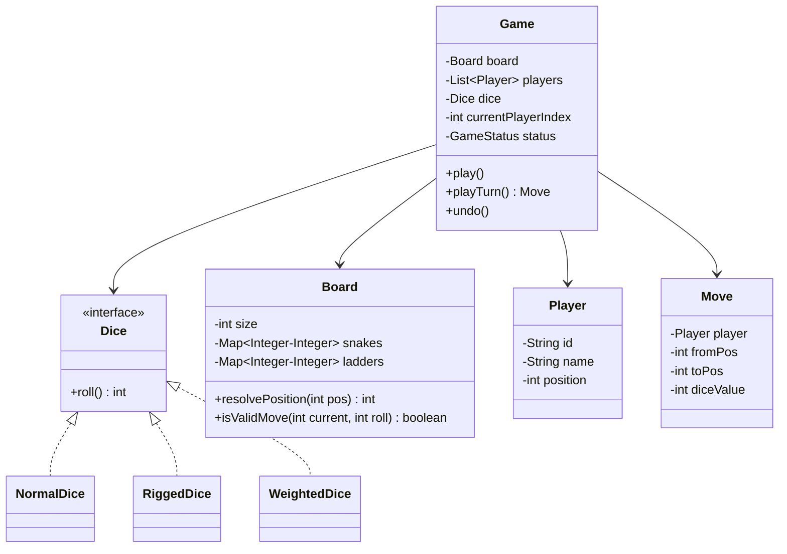

# Designing Snake & Ladder — Turn-Based Board Game

⚡ **Difficulty:** Medium 🏷️ **Patterns:** Strategy, State, Command, Observer 🏢 **Asked at:** PhonePe, Flipkart, Amazon, Swiggy

---

## Functional Requirements

1. **Configurable board** — board size (default 100), configurable snakes and ladders with start/end positions
2. **Multiple players** — support 2-4 players with turn-based play
3. **Dice rolling** — pluggable dice strategy (normal, rigged, weighted)
4. **Game loop** — turn management, automatic snake/ladder resolution, win detection
5. **Move validation** — player can't move beyond the last cell, must land exactly on final cell to win
6. **Game history** — track all moves with undo capability

## Non-Functional Requirements

1. **Thread-safety** — concurrent game state access must be safe
2. **Extensibility** — add new dice types or board elements without modifying existing code
3. **Correctness** — no player can land on an invalid cell, snakes always go down, ladders always go up
4. **O(1) move resolution** — snake/ladder lookup via HashMap

---

## Core Entities

| Entity | Description |
|---|---|
| `Game` | Orchestrates the game loop, manages turns and win detection |
| `Board` | Holds the grid, snakes, ladders, and resolves cell transitions |
| `Player` | Name, id, current position on the board |
| `Snake` | Head (start) and tail (end) — moves player down |
| `Ladder` | Bottom (start) and top (end) — moves player up |
| `Dice` | Strategy interface — roll returns a value |
| `NormalDice` | Standard 1-6 random roll |
| `RiggedDice` | Returns a predetermined sequence (for testing) |
| `Cell` | Position on board, may contain a snake head or ladder bottom |
| `GameStatus` | Enum — IN_PROGRESS, FINISHED |
| `Move` | Command object — stores player, from, to, dice value for undo |

---

## Class Diagram

---

## Design Patterns

| Pattern | Where | Why |
|---|---|---|
| **Strategy** | `Dice` with Normal/Rigged/Weighted | Swap dice behavior without changing game logic |
| **State** | `GameStatus` controlling game loop flow | Game behaves differently when IN_PROGRESS vs FINISHED |
| **Command** | `Move` objects with undo support | Record and reverse moves for game history |
| **Observer** | `GameObserver` on game events | Notify UI or logger when moves happen, game ends |

---

## How It All Fits Together

Here's what happens during a single turn:

1. Game checks if status is IN_PROGRESS — if FINISHED, no-op
2. Current player is selected via round-robin index
3. Dice strategy is invoked — `dice.roll()` returns 1-6 (or whatever the strategy dictates)
4. Board validates the move — if `currentPos + roll > boardSize`, player stays put
5. If valid, player moves to `currentPos + roll`
6. Board resolves the new position — checks for snake head or ladder bottom at that cell
7. If snake: player slides down to tail. If ladder: player climbs to top
8. Move is recorded as a Command object for undo capability
9. All registered GameObservers are notified of the move
10. If player reaches the final cell (boardSize), game status → FINISHED, player wins
11. Turn index advances to next player

💡 *The board resolution is O(1) — snakes and ladders are stored in HashMaps keyed by their start position. No iteration over the board needed.*

---

## Complete Code

### Player

A mutable entity representing a player on the board. Position starts at 0 (off-board) and advances toward the board size.

<button class="tab-btn active">Java</button>
<button class="tab-btn">Python</button>
<button class="tab-btn">C++</button>

<pre><code class="language-java">package snakeladder.model;

public class Player {
    private final String id;
    private final String name;
    private int position;

    public Player(String id, String name) {
        this.id = id;
        this.name = name;
        this.position = 0; // starts off-board
    }

    public String getId() { return id; }
    public String getName() { return name; }
    public int getPosition() { return position; }
    public void setPosition(int position) { this.position = position; }

    @Override
    public String toString() { return name + " (pos=" + position + ")"; }
}</code></pre>

<pre><code class="language-python">class Player:
    def __init__(self, id: str, name: str):
        self.id = id
        self.name = name
        self.position = 0  # starts off-board

    def __str__(self):
        return f"{self.name} (pos={self.position})"</code></pre>

<pre><code class="language-cpp">#pragma once
#include &lt;string&gt;
#include &lt;iostream&gt;

class Player {
public:
    std::string id;
    std::string name;
    int position;

    Player(std::string id, std::string name)
        : id(std::move(id)), name(std::move(name)), position(0) {}

    friend std::ostream&amp; operator&lt;&lt;(std::ostream&amp; os, const Player&amp; p) {
        os &lt;&lt; p.name &lt;&lt; " (pos=" &lt;&lt; p.position &lt;&lt; ")";
        return os;
    }
};</code></pre>

### Snake and Ladder

Simple value objects. A Snake has a head (higher position) and tail (lower position). A Ladder has a bottom (lower) and top (higher). Validation ensures snakes go down and ladders go up.

<button class="tab-btn active">Java</button>
<button class="tab-btn">Python</button>
<button class="tab-btn">C++</button>

<pre><code class="language-java">package snakeladder.model;

public class Snake {
    private final int head;
    private final int tail;

    public Snake(int head, int tail) {
        if (head &lt;= tail) throw new IllegalArgumentException("Snake head must be above tail");
        this.head = head;
        this.tail = tail;
    }

    public int getHead() { return head; }
    public int getTail() { return tail; }

    @Override
    public String toString() { return "Snake[" + head + " → " + tail + "]"; }
}

// --- Ladder.java ---
package snakeladder.model;

public class Ladder {
    private final int bottom;
    private final int top;

    public Ladder(int bottom, int top) {
        if (bottom &gt;= top) throw new IllegalArgumentException("Ladder bottom must be below top");
        this.bottom = bottom;
        this.top = top;
    }

    public int getBottom() { return bottom; }
    public int getTop() { return top; }

    @Override
    public String toString() { return "Ladder[" + bottom + " → " + top + "]"; }
}</code></pre>

<pre><code class="language-python">class Snake:
    def __init__(self, head: int, tail: int):
        if head &lt;= tail:
            raise ValueError("Snake head must be above tail")
        self.head = head
        self.tail = tail

    def __str__(self):
        return f"Snake[{self.head} → {self.tail}]"

class Ladder:
    def __init__(self, bottom: int, top: int):
        if bottom &gt;= top:
            raise ValueError("Ladder bottom must be below top")
        self.bottom = bottom
        self.top = top

    def __str__(self):
        return f"Ladder[{self.bottom} → {self.top}]"</code></pre>

<pre><code class="language-cpp">#pragma once
#include &lt;stdexcept&gt;
#include &lt;iostream&gt;

class Snake {
public:
    int head;
    int tail;

    Snake(int head, int tail) : head(head), tail(tail) {
        if (head &lt;= tail) throw std::invalid_argument("Snake head must be above tail");
    }

    friend std::ostream&amp; operator&lt;&lt;(std::ostream&amp; os, const Snake&amp; s) {
        os &lt;&lt; "Snake[" &lt;&lt; s.head &lt;&lt; " -&gt; " &lt;&lt; s.tail &lt;&lt; "]";
        return os;
    }
};

class Ladder {
public:
    int bottom;
    int top;

    Ladder(int bottom, int top) : bottom(bottom), top(top) {
        if (bottom &gt;= top) throw std::invalid_argument("Ladder bottom must be below top");
    }

    friend std::ostream&amp; operator&lt;&lt;(std::ostream&amp; os, const Ladder&amp; l) {
        os &lt;&lt; "Ladder[" &lt;&lt; l.bottom &lt;&lt; " -&gt; " &lt;&lt; l.top &lt;&lt; "]";
        return os;
    }
};</code></pre>

### Dice (Strategy Interface)

The strategy interface for dice rolling. NormalDice gives a uniform random 1-6. RiggedDice returns a predetermined sequence (useful for testing deterministic game outcomes). WeightedDice allows custom probability distributions.

💡 *Strategy pattern = define a family of algorithms, encapsulate each one, and make them interchangeable. The Game doesn't know or care which dice implementation it uses — it just calls `roll()`.*

<button class="tab-btn active">Java</button>
<button class="tab-btn">Python</button>
<button class="tab-btn">C++</button>

<pre><code class="language-java">package snakeladder.dice;

public interface Dice {
    int roll();
}

// --- NormalDice.java ---
package snakeladder.dice;

import java.util.Random;

public class NormalDice implements Dice {
    private final Random random = new Random();
    private final int faces;

    public NormalDice() { this.faces = 6; }
    public NormalDice(int faces) { this.faces = faces; }

    @Override
    public int roll() { return random.nextInt(faces) + 1; }
}

// --- RiggedDice.java ---
package snakeladder.dice;

import java.util.LinkedList;
import java.util.List;
import java.util.Queue;

public class RiggedDice implements Dice {
    private final Queue&lt;Integer&gt; values;

    public RiggedDice(List&lt;Integer&gt; values) {
        this.values = new LinkedList&lt;&gt;(values);
    }

    @Override
    public int roll() {
        if (values.isEmpty()) throw new IllegalStateException("No more rigged values");
        return values.poll();
    }
}

// --- WeightedDice.java ---
package snakeladder.dice;

import java.util.Random;

public class WeightedDice implements Dice {
    private final double[] cumulativeWeights;
    private final Random random = new Random();

    public WeightedDice(double[] weights) {
        this.cumulativeWeights = new double[weights.length];
        double sum = 0;
        for (int i = 0; i &lt; weights.length; i++) {
            sum += weights[i];
            cumulativeWeights[i] = sum;
        }
        // Normalize
        for (int i = 0; i &lt; cumulativeWeights.length; i++) {
            cumulativeWeights[i] /= sum;
        }
    }

    @Override
    public int roll() {
        double r = random.nextDouble();
        for (int i = 0; i &lt; cumulativeWeights.length; i++) {
            if (r &lt;= cumulativeWeights[i]) return i + 1;
        }
        return cumulativeWeights.length;
    }
}</code></pre>

<pre><code class="language-python">import random as rand_module
from abc import ABC, abstractmethod
from collections import deque

class Dice(ABC):
    @abstractmethod
    def roll(self) -&gt; int:
        pass

class NormalDice(Dice):
    def __init__(self, faces: int = 6):
        self.faces = faces

    def roll(self) -&gt; int:
        return rand_module.randint(1, self.faces)

class RiggedDice(Dice):
    def __init__(self, values: list[int]):
        self._values = deque(values)

    def roll(self) -&gt; int:
        if not self._values:
            raise RuntimeError("No more rigged values")
        return self._values.popleft()

class WeightedDice(Dice):
    def __init__(self, weights: list[float]):
        total = sum(weights)
        self._cumulative = []
        cum = 0.0
        for w in weights:
            cum += w / total
            self._cumulative.append(cum)

    def roll(self) -&gt; int:
        r = rand_module.random()
        for i, cw in enumerate(self._cumulative):
            if r &lt;= cw:
                return i + 1
        return len(self._cumulative)</code></pre>

<pre><code class="language-cpp">#pragma once
#include &lt;random&gt;
#include &lt;vector&gt;
#include &lt;queue&gt;
#include &lt;stdexcept&gt;

class Dice {
public:
    virtual ~Dice() = default;
    virtual int roll() = 0;
};

class NormalDice : public Dice {
    std::mt19937 rng{std::random_device{}()};
    int faces;
public:
    NormalDice(int faces = 6) : faces(faces) {}
    int roll() override {
        std::uniform_int_distribution&lt;int&gt; dist(1, faces);
        return dist(rng);
    }
};

class RiggedDice : public Dice {
    std::queue&lt;int&gt; values;
public:
    RiggedDice(const std::vector&lt;int&gt;&amp; vals) {
        for (int v : vals) values.push(v);
    }
    int roll() override {
        if (values.empty()) throw std::runtime_error("No more rigged values");
        int v = values.front();
        values.pop();
        return v;
    }
};

class WeightedDice : public Dice {
    std::vector&lt;double&gt; cumulative;
    std::mt19937 rng{std::random_device{}()};
public:
    WeightedDice(const std::vector&lt;double&gt;&amp; weights) {
        double sum = 0;
        for (double w : weights) { sum += w; cumulative.push_back(sum); }
        for (double&amp; c : cumulative) c /= sum;
    }
    int roll() override {
        std::uniform_real_distribution&lt;double&gt; dist(0.0, 1.0);
        double r = dist(rng);
        for (int i = 0; i &lt; (int)cumulative.size(); i++) {
            if (r &lt;= cumulative[i]) return i + 1;
        }
        return (int)cumulative.size();
    }
};</code></pre>

### Board

The board holds all snakes and ladders in HashMaps for O(1) lookup. `resolvePosition()` checks if a position has a snake head or ladder bottom and returns the resolved final position. Validation ensures no overlapping snakes/ladders at the same cell.

<button class="tab-btn active">Java</button>
<button class="tab-btn">Python</button>
<button class="tab-btn">C++</button>

<pre><code class="language-java">package snakeladder.model;

import java.util.*;

public class Board {
    private final int size;
    private final Map&lt;Integer, Integer&gt; snakes;  // head -&gt; tail
    private final Map&lt;Integer, Integer&gt; ladders; // bottom -&gt; top

    public Board(int size, List&lt;Snake&gt; snakeList, List&lt;Ladder&gt; ladderList) {
        this.size = size;
        this.snakes = new HashMap&lt;&gt;();
        this.ladders = new HashMap&lt;&gt;();

        for (Snake s : snakeList) {
            if (snakes.containsKey(s.getHead()) || ladders.containsKey(s.getHead())) {
                throw new IllegalArgumentException("Overlap at position " + s.getHead());
            }
            snakes.put(s.getHead(), s.getTail());
        }
        for (Ladder l : ladderList) {
            if (ladders.containsKey(l.getBottom()) || snakes.containsKey(l.getBottom())) {
                throw new IllegalArgumentException("Overlap at position " + l.getBottom());
            }
            ladders.put(l.getBottom(), l.getTop());
        }
    }

    public int getSize() { return size; }

    public boolean isValidMove(int currentPos, int diceValue) {
        return currentPos + diceValue &lt;= size;
    }

    public int resolvePosition(int position) {
        if (snakes.containsKey(position)) {
            System.out.println("    🐍 Snake! Slide from " + position + " to " + snakes.get(position));
            return snakes.get(position);
        }
        if (ladders.containsKey(position)) {
            System.out.println("    🪜 Ladder! Climb from " + position + " to " + ladders.get(position));
            return ladders.get(position);
        }
        return position;
    }

    public boolean isWinningPosition(int position) {
        return position == size;
    }
}</code></pre>

<pre><code class="language-python">class Board:
    def __init__(self, size: int, snakes: list['Snake'], ladders: list['Ladder']):
        self.size = size
        self._snakes: dict[int, int] = {}   # head -&gt; tail
        self._ladders: dict[int, int] = {}  # bottom -&gt; top

        for s in snakes:
            if s.head in self._snakes or s.head in self._ladders:
                raise ValueError(f"Overlap at position {s.head}")
            self._snakes[s.head] = s.tail

        for l in ladders:
            if l.bottom in self._ladders or l.bottom in self._snakes:
                raise ValueError(f"Overlap at position {l.bottom}")
            self._ladders[l.bottom] = l.top

    def is_valid_move(self, current_pos: int, dice_value: int) -&gt; bool:
        return current_pos + dice_value &lt;= self.size

    def resolve_position(self, position: int) -&gt; int:
        if position in self._snakes:
            print(f"    🐍 Snake! Slide from {position} to {self._snakes[position]}")
            return self._snakes[position]
        if position in self._ladders:
            print(f"    🪜 Ladder! Climb from {position} to {self._ladders[position]}")
            return self._ladders[position]
        return position

    def is_winning_position(self, position: int) -&gt; bool:
        return position == self.size</code></pre>

<pre><code class="language-cpp">#pragma once
#include &lt;unordered_map&gt;
#include &lt;vector&gt;
#include &lt;stdexcept&gt;
#include &lt;iostream&gt;
#include "SnakeLadder.h"

class Board {
    int size;
    std::unordered_map&lt;int, int&gt; snakes;   // head -&gt; tail
    std::unordered_map&lt;int, int&gt; ladders;  // bottom -&gt; top

public:
    Board(int size, const std::vector&lt;Snake&gt;&amp; snakeList,
          const std::vector&lt;Ladder&gt;&amp; ladderList) : size(size) {
        for (const auto&amp; s : snakeList) {
            if (snakes.count(s.head) || ladders.count(s.head))
                throw std::invalid_argument("Overlap at position");
            snakes[s.head] = s.tail;
        }
        for (const auto&amp; l : ladderList) {
            if (ladders.count(l.bottom) || snakes.count(l.bottom))
                throw std::invalid_argument("Overlap at position");
            ladders[l.bottom] = l.top;
        }
    }

    int getSize() const { return size; }

    bool isValidMove(int currentPos, int diceValue) const {
        return currentPos + diceValue &lt;= size;
    }

    int resolvePosition(int position) const {
        auto sit = snakes.find(position);
        if (sit != snakes.end()) {
            std::cout &lt;&lt; "    Snake! Slide from " &lt;&lt; position
                      &lt;&lt; " to " &lt;&lt; sit-&gt;second &lt;&lt; "\n";
            return sit-&gt;second;
        }
        auto lit = ladders.find(position);
        if (lit != ladders.end()) {
            std::cout &lt;&lt; "    Ladder! Climb from " &lt;&lt; position
                      &lt;&lt; " to " &lt;&lt; lit-&gt;second &lt;&lt; "\n";
            return lit-&gt;second;
        }
        return position;
    }

    bool isWinningPosition(int position) const {
        return position == size;
    }
};</code></pre>

### Move (Command)

The Command pattern — each move is recorded as an object containing the player, from/to positions, and dice value. This enables undo functionality by simply restoring the player to the previous position.

💡 *Command pattern = encapsulate a request as an object. Each Move stores everything needed to undo itself — the player reference and the original position. No need to recompute anything.*

<button class="tab-btn active">Java</button>
<button class="tab-btn">Python</button>
<button class="tab-btn">C++</button>

<pre><code class="language-java">package snakeladder.model;

public class Move {
    private final Player player;
    private final int fromPosition;
    private final int toPosition;
    private final int diceValue;

    public Move(Player player, int fromPosition, int toPosition, int diceValue) {
        this.player = player;
        this.fromPosition = fromPosition;
        this.toPosition = toPosition;
        this.diceValue = diceValue;
    }

    public Player getPlayer() { return player; }
    public int getFromPosition() { return fromPosition; }
    public int getToPosition() { return toPosition; }
    public int getDiceValue() { return diceValue; }

    public void undo() {
        player.setPosition(fromPosition);
    }

    @Override
    public String toString() {
        return player.getName() + ": " + fromPosition + " → " + toPosition +
               " (rolled " + diceValue + ")";
    }
}</code></pre>

<pre><code class="language-python">class Move:
    def __init__(self, player: Player, from_pos: int, to_pos: int, dice_value: int):
        self.player = player
        self.from_pos = from_pos
        self.to_pos = to_pos
        self.dice_value = dice_value

    def undo(self):
        self.player.position = self.from_pos

    def __str__(self):
        return f"{self.player.name}: {self.from_pos} → {self.to_pos} (rolled {self.dice_value})"</code></pre>

<pre><code class="language-cpp">#pragma once
#include "Player.h"
#include &lt;iostream&gt;
#include &lt;memory&gt;

class Move {
public:
    std::shared_ptr&lt;Player&gt; player;
    int fromPosition;
    int toPosition;
    int diceValue;

    Move(std::shared_ptr&lt;Player&gt; player, int from, int to, int dice)
        : player(std::move(player)), fromPosition(from), toPosition(to), diceValue(dice) {}

    void undo() {
        player-&gt;position = fromPosition;
    }

    friend std::ostream&amp; operator&lt;&lt;(std::ostream&amp; os, const Move&amp; m) {
        os &lt;&lt; m.player-&gt;name &lt;&lt; ": " &lt;&lt; m.fromPosition &lt;&lt; " -&gt; "
           &lt;&lt; m.toPosition &lt;&lt; " (rolled " &lt;&lt; m.diceValue &lt;&lt; ")";
        return os;
    }
};</code></pre>

### GameObserver

Observer interface to decouple game events from their consumers. Logging, UI updates, analytics — all can hook in without modifying the Game class.

<button class="tab-btn active">Java</button>
<button class="tab-btn">Python</button>
<button class="tab-btn">C++</button>

<pre><code class="language-java">package snakeladder.observer;

import snakeladder.model.Move;
import snakeladder.model.Player;

public interface GameObserver {
    void onMoveMade(Move move);
    void onGameOver(Player winner);
}</code></pre>

<pre><code class="language-python">class GameObserver:
    def on_move_made(self, move: Move):
        pass

    def on_game_over(self, winner: Player):
        pass</code></pre>

<pre><code class="language-cpp">#pragma once
#include "Move.h"
#include "Player.h"
#include &lt;memory&gt;

class GameObserver {
public:
    virtual ~GameObserver() = default;
    virtual void onMoveMade(const Move&amp; move) = 0;
    virtual void onGameOver(const std::shared_ptr&lt;Player&gt;&amp; winner) = 0;
};</code></pre>

### Game (Orchestrator)

The main game class that ties everything together. It manages the turn loop, delegates to the Board for move resolution, records Moves for history/undo, and notifies observers. The `play()` method runs the entire game to completion.

<button class="tab-btn active">Java</button>
<button class="tab-btn">Python</button>
<button class="tab-btn">C++</button>

<pre><code class="language-java">package snakeladder;

import snakeladder.dice.Dice;
import snakeladder.model.*;
import snakeladder.observer.GameObserver;

import java.util.*;
import java.util.concurrent.CopyOnWriteArrayList;

public enum GameStatus { IN_PROGRESS, FINISHED }

// --- Game.java ---
package snakeladder;

import snakeladder.dice.Dice;
import snakeladder.model.*;
import snakeladder.observer.GameObserver;

import java.util.*;
import java.util.concurrent.CopyOnWriteArrayList;

public class Game {
    private final Board board;
    private final List&lt;Player&gt; players;
    private final Dice dice;
    private final Deque&lt;Move&gt; moveHistory = new ArrayDeque&lt;&gt;();
    private final List&lt;GameObserver&gt; observers = new CopyOnWriteArrayList&lt;&gt;();
    private int currentPlayerIndex = 0;
    private GameStatus status = GameStatus.IN_PROGRESS;
    private Player winner = null;

    public Game(Board board, List&lt;Player&gt; players, Dice dice) {
        if (players.size() &lt; 2 || players.size() &gt; 4) {
            throw new IllegalArgumentException("Need 2-4 players");
        }
        this.board = board;
        this.players = new ArrayList&lt;&gt;(players);
        this.dice = dice;
    }

    public void addObserver(GameObserver observer) {
        observers.add(observer);
    }

    public Move playTurn() {
        if (status == GameStatus.FINISHED) return null;

        Player current = players.get(currentPlayerIndex);
        int diceValue = dice.roll();
        int oldPos = current.getPosition();

        System.out.println("  " + current.getName() + " rolled " + diceValue);

        if (!board.isValidMove(oldPos, diceValue)) {
            System.out.println("    Cannot move — would exceed board. Stay at " + oldPos);
            Move move = new Move(current, oldPos, oldPos, diceValue);
            moveHistory.push(move);
            advanceTurn();
            return move;
        }

        int newPos = oldPos + diceValue;
        newPos = board.resolvePosition(newPos);
        current.setPosition(newPos);

        Move move = new Move(current, oldPos, newPos, diceValue);
        moveHistory.push(move);

        for (GameObserver obs : observers) obs.onMoveMade(move);

        if (board.isWinningPosition(newPos)) {
            status = GameStatus.FINISHED;
            winner = current;
            System.out.println("  🏆 " + current.getName() + " WINS!");
            for (GameObserver obs : observers) obs.onGameOver(winner);
        } else {
            advanceTurn();
        }

        return move;
    }

    public void play() {
        System.out.println("Game started with " + players.size() + " players!");
        System.out.println("Board size: " + board.getSize() + "\n");
        int turn = 1;
        while (status == GameStatus.FINISHED == false) {
            System.out.println("Turn " + turn + ":");
            playTurn();
            System.out.println();
            turn++;
        }
    }

    public void undo() {
        if (moveHistory.isEmpty()) return;
        Move last = moveHistory.pop();
        last.undo();
        // Move back to previous player
        currentPlayerIndex = (currentPlayerIndex - 1 + players.size()) % players.size();
        if (status == GameStatus.FINISHED) {
            status = GameStatus.IN_PROGRESS;
            winner = null;
        }
    }

    public GameStatus getStatus() { return status; }
    public Player getWinner() { return winner; }
    public List&lt;Move&gt; getMoveHistory() { return new ArrayList&lt;&gt;(moveHistory); }

    private void advanceTurn() {
        currentPlayerIndex = (currentPlayerIndex + 1) % players.size();
    }
}</code></pre>

<pre><code class="language-python">from enum import Enum
from collections import deque

class GameStatus(Enum):
    IN_PROGRESS = "IN_PROGRESS"
    FINISHED = "FINISHED"

class Game:
    def __init__(self, board: Board, players: list[Player], dice: Dice):
        if len(players) &lt; 2 or len(players) &gt; 4:
            raise ValueError("Need 2-4 players")
        self.board = board
        self.players = list(players)
        self.dice = dice
        self._move_history: deque[Move] = deque()
        self._observers: list[GameObserver] = []
        self._current_index = 0
        self.status = GameStatus.IN_PROGRESS
        self.winner = None

    def add_observer(self, observer: GameObserver):
        self._observers.append(observer)

    def play_turn(self) -&gt; Move | None:
        if self.status == GameStatus.FINISHED:
            return None

        current = self.players[self._current_index]
        dice_value = self.dice.roll()
        old_pos = current.position

        print(f"  {current.name} rolled {dice_value}")

        if not self.board.is_valid_move(old_pos, dice_value):
            print(f"    Cannot move — would exceed board. Stay at {old_pos}")
            move = Move(current, old_pos, old_pos, dice_value)
            self._move_history.append(move)
            self._advance_turn()
            return move

        new_pos = old_pos + dice_value
        new_pos = self.board.resolve_position(new_pos)
        current.position = new_pos

        move = Move(current, old_pos, new_pos, dice_value)
        self._move_history.append(move)

        for obs in self._observers:
            obs.on_move_made(move)

        if self.board.is_winning_position(new_pos):
            self.status = GameStatus.FINISHED
            self.winner = current
            print(f"  🏆 {current.name} WINS!")
            for obs in self._observers:
                obs.on_game_over(self.winner)
        else:
            self._advance_turn()

        return move

    def play(self):
        print(f"Game started with {len(self.players)} players!")
        print(f"Board size: {self.board.size}\n")
        turn = 1
        while self.status != GameStatus.FINISHED:
            print(f"Turn {turn}:")
            self.play_turn()
            print()
            turn += 1

    def undo(self):
        if not self._move_history:
            return
        last = self._move_history.pop()
        last.undo()
        self._current_index = (self._current_index - 1) % len(self.players)
        if self.status == GameStatus.FINISHED:
            self.status = GameStatus.IN_PROGRESS
            self.winner = None

    def _advance_turn(self):
        self._current_index = (self._current_index + 1) % len(self.players)</code></pre>

<pre><code class="language-cpp">#pragma once
#include &lt;vector&gt;
#include &lt;deque&gt;
#include &lt;memory&gt;
#include &lt;iostream&gt;
#include &lt;stdexcept&gt;
#include "Board.h"
#include "Player.h"
#include "Dice.h"
#include "Move.h"
#include "GameObserver.h"

enum class GameStatus { IN_PROGRESS, FINISHED };

class Game {
    Board board;
    std::vector&lt;std::shared_ptr&lt;Player&gt;&gt; players;
    std::shared_ptr&lt;Dice&gt; dice;
    std::deque&lt;Move&gt; moveHistory;
    std::vector&lt;GameObserver*&gt; observers;
    int currentPlayerIndex = 0;
    GameStatus status = GameStatus::IN_PROGRESS;
    std::shared_ptr&lt;Player&gt; winner = nullptr;

    void advanceTurn() {
        currentPlayerIndex = (currentPlayerIndex + 1) % players.size();
    }

public:
    Game(Board board, std::vector&lt;std::shared_ptr&lt;Player&gt;&gt; players,
         std::shared_ptr&lt;Dice&gt; dice)
        : board(std::move(board)), players(std::move(players)), dice(std::move(dice)) {
        if (this-&gt;players.size() &lt; 2 || this-&gt;players.size() &gt; 4)
            throw std::invalid_argument("Need 2-4 players");
    }

    void addObserver(GameObserver* obs) { observers.push_back(obs); }

    Move playTurn() {
        auto current = players[currentPlayerIndex];
        int diceValue = dice-&gt;roll();
        int oldPos = current-&gt;position;

        std::cout &lt;&lt; "  " &lt;&lt; current-&gt;name &lt;&lt; " rolled " &lt;&lt; diceValue &lt;&lt; "\n";

        if (!board.isValidMove(oldPos, diceValue)) {
            std::cout &lt;&lt; "    Cannot move — stay at " &lt;&lt; oldPos &lt;&lt; "\n";
            Move move(current, oldPos, oldPos, diceValue);
            moveHistory.push_back(move);
            advanceTurn();
            return move;
        }

        int newPos = oldPos + diceValue;
        newPos = board.resolvePosition(newPos);
        current-&gt;position = newPos;

        Move move(current, oldPos, newPos, diceValue);
        moveHistory.push_back(move);

        for (auto* obs : observers) obs-&gt;onMoveMade(move);

        if (board.isWinningPosition(newPos)) {
            status = GameStatus::FINISHED;
            winner = current;
            std::cout &lt;&lt; "  " &lt;&lt; current-&gt;name &lt;&lt; " WINS!\n";
            for (auto* obs : observers) obs-&gt;onGameOver(winner);
        } else {
            advanceTurn();
        }
        return move;
    }

    void play() {
        std::cout &lt;&lt; "Game started with " &lt;&lt; players.size() &lt;&lt; " players!\n";
        std::cout &lt;&lt; "Board size: " &lt;&lt; board.getSize() &lt;&lt; "\n\n";
        int turn = 1;
        while (status != GameStatus::FINISHED) {
            std::cout &lt;&lt; "Turn " &lt;&lt; turn &lt;&lt; ":\n";
            playTurn();
            std::cout &lt;&lt; "\n";
            turn++;
        }
    }

    void undo() {
        if (moveHistory.empty()) return;
        Move last = moveHistory.back();
        moveHistory.pop_back();
        last.undo();
        currentPlayerIndex = (currentPlayerIndex - 1 + players.size()) % players.size();
        if (status == GameStatus::FINISHED) {
            status = GameStatus::IN_PROGRESS;
            winner = nullptr;
        }
    }

    GameStatus getStatus() const { return status; }
};</code></pre>

### Demo (Runnable)

The demo creates a board with snakes and ladders, adds 3 players, uses a RiggedDice for deterministic output, and plays the game to completion — showing every turn, snake/ladder interactions, and the final winner.

<button class="tab-btn active">Java</button>
<button class="tab-btn">Python</button>
<button class="tab-btn">C++</button>

<pre><code class="language-java">package snakeladder;

import snakeladder.dice.*;
import snakeladder.model.*;
import snakeladder.observer.GameObserver;

import java.util.*;

public class Demo {
    public static void main(String[] args) {
        System.out.println("══════ SNAKE &amp; LADDER DEMO ══════\n");

        // Configure snakes
        List&lt;Snake&gt; snakes = Arrays.asList(
            new Snake(17, 7),
            new Snake(54, 34),
            new Snake(62, 19),
            new Snake(98, 79)
        );

        // Configure ladders
        List&lt;Ladder&gt; ladders = Arrays.asList(
            new Ladder(3, 22),
            new Ladder(5, 8),
            new Ladder(11, 26),
            new Ladder(20, 29),
            new Ladder(71, 91)
        );

        // Create board
        Board board = new Board(100, snakes, ladders);

        // Create players
        List&lt;Player&gt; players = Arrays.asList(
            new Player("p1", "Alice"),
            new Player("p2", "Bob"),
            new Player("p3", "Charlie")
        );

        // Use rigged dice for deterministic demo
        List&lt;Integer&gt; rolls = Arrays.asList(
            3, 6, 5,   // Turn 1: Alice-&gt;3(ladder to 22), Bob-&gt;6, Charlie-&gt;5(ladder to 8)
            4, 5, 6,   // Turn 2: Alice-&gt;26(ladder!), Bob-&gt;11(ladder to 26), Charlie-&gt;14
            4, 4, 6,   // Turn 3: Alice-&gt;30, Bob-&gt;30, Charlie-&gt;20(ladder to 29)
            6, 5, 6,   // Turn 4: Alice-&gt;36, Bob-&gt;35, Charlie-&gt;35
            6, 6, 6,   // Turn 5: Alice-&gt;42, Bob-&gt;41, Charlie-&gt;41
            6, 6, 6,   // Turn 6: Alice-&gt;48, Bob-&gt;47, Charlie-&gt;47
            6, 6, 6,   // Turn 7: Alice-&gt;54(snake! to 34), Bob-&gt;53, Charlie-&gt;53
            6, 6, 6,   // Turn 8: Alice-&gt;40, Bob-&gt;59, Charlie-&gt;59
            6, 6, 6,   // Turn 9: Alice-&gt;46, Bob-&gt;65, Charlie-&gt;65
            6, 6, 5,   // Turn 10: Alice-&gt;52, Bob-&gt;71(ladder to 91), Charlie-&gt;70
            6, 5, 1,   // Turn 11: Alice-&gt;58, Bob-&gt;96, Charlie-&gt;71(ladder to 91)
            4, 4, 6    // Turn 12: Alice-&gt;62(snake! to 19), Bob-&gt;100 WIN!
        );
        Dice dice = new RiggedDice(rolls);

        // Create game
        Game game = new Game(board, players, dice);
        game.addObserver(new GameObserver() {
            public void onMoveMade(Move m) {}
            public void onGameOver(Player w) {
                System.out.println("\n  📣 Game Over! Winner: " + w.getName());
            }
        });

        // Play the game
        game.play();

        // Show move history
        System.out.println("--- Move History (last 5) ---");
        List&lt;Move&gt; history = game.getMoveHistory();
        int start = Math.max(0, history.size() - 5);
        for (int i = start; i &lt; history.size(); i++) {
            System.out.println("  " + history.get(i));
        }

        System.out.println("\n══════ DONE ══════");
    }
}</code></pre>

<pre><code class="language-python">def demo():
    print("══════ SNAKE &amp; LADDER DEMO ══════\n")

    # Configure snakes
    snakes = [
        Snake(17, 7),
        Snake(54, 34),
        Snake(62, 19),
        Snake(98, 79),
    ]

    # Configure ladders
    ladders = [
        Ladder(3, 22),
        Ladder(5, 8),
        Ladder(11, 26),
        Ladder(20, 29),
        Ladder(71, 91),
    ]

    # Create board
    board = Board(100, snakes, ladders)

    # Create players
    players = [
        Player("p1", "Alice"),
        Player("p2", "Bob"),
        Player("p3", "Charlie"),
    ]

    # Use rigged dice for deterministic demo
    rolls = [
        3, 6, 5,   # Turn 1
        4, 5, 6,   # Turn 2
        4, 4, 6,   # Turn 3
        6, 5, 6,   # Turn 4
        6, 6, 6,   # Turn 5
        6, 6, 6,   # Turn 6
        6, 6, 6,   # Turn 7
        6, 6, 6,   # Turn 8
        6, 6, 6,   # Turn 9
        6, 6, 5,   # Turn 10
        6, 5, 1,   # Turn 11
        4, 4, 6,   # Turn 12
    ]
    dice = RiggedDice(rolls)

    # Create game
    class ConsoleObserver(GameObserver):
        def on_move_made(self, move):
            pass
        def on_game_over(self, winner):
            print(f"\n  📣 Game Over! Winner: {winner.name}")

    game = Game(board, players, dice)
    game.add_observer(ConsoleObserver())

    # Play the game
    game.play()

    # Show move history (last 5)
    print("--- Move History (last 5) ---")
    history = list(game._move_history)
    for m in history[-5:]:
        print(f"  {m}")

    print("\n══════ DONE ══════")

if __name__ == "__main__":
    demo()</code></pre>

<pre><code class="language-cpp">#include &lt;iostream&gt;
#include &lt;vector&gt;
#include &lt;memory&gt;
#include "Game.h"
#include "Dice.h"
#include "SnakeLadder.h"

class ConsoleObserver : public GameObserver {
public:
    void onMoveMade(const Move&amp; m) override {}
    void onGameOver(const std::shared_ptr&lt;Player&gt;&amp; w) override {
        std::cout &lt;&lt; "\n  Game Over! Winner: " &lt;&lt; w-&gt;name &lt;&lt; "\n";
    }
};

int main() {
    std::cout &lt;&lt; "══════ SNAKE &amp; LADDER DEMO ══════\n\n";

    // Configure snakes and ladders
    std::vector&lt;Snake&gt; snakes = {
        Snake(17, 7), Snake(54, 34), Snake(62, 19), Snake(98, 79)
    };
    std::vector&lt;Ladder&gt; ladders = {
        Ladder(3, 22), Ladder(5, 8), Ladder(11, 26),
        Ladder(20, 29), Ladder(71, 91)
    };

    Board board(100, snakes, ladders);

    // Create players
    auto alice = std::make_shared&lt;Player&gt;("p1", "Alice");
    auto bob = std::make_shared&lt;Player&gt;("p2", "Bob");
    auto charlie = std::make_shared&lt;Player&gt;("p3", "Charlie");

    std::vector&lt;std::shared_ptr&lt;Player&gt;&gt; players = {alice, bob, charlie};

    // Rigged dice for deterministic demo
    std::vector&lt;int&gt; rolls = {
        3, 6, 5, 4, 5, 6, 4, 4, 6, 6, 5, 6,
        6, 6, 6, 6, 6, 6, 6, 6, 6, 6, 6, 6,
        6, 6, 5, 6, 5, 1, 4, 4, 6
    };
    auto dice = std::make_shared&lt;RiggedDice&gt;(rolls);

    // Create game
    Game game(board, players, dice);
    ConsoleObserver observer;
    game.addObserver(&amp;observer);

    // Play
    game.play();

    std::cout &lt;&lt; "\n══════ DONE ══════\n";
    return 0;
}</code></pre>

---

## Game Loop — Algorithm Walkthrough

<pre><code class="language-mermaid">flowchart LR
    A[Start Turn] --> B[Get Current Player]
    B --> C[Roll Dice via Strategy]
    C --> D{Valid Move?}
    D -->|No| E[Stay Put - Advance Turn]
    D -->|Yes| F[Move to New Position]
    F --> G[Resolve Snakes and Ladders]
    G --> H{Reached Final Cell?}
    H -->|Yes| I[Player Wins - Game Over]
    H -->|No| J[Record Move - Advance Turn]
    J --> A
    E --> A</code></pre>

**Turn Resolution:**
1. Roll dice → get value (1-6 for normal dice)
2. Check if `currentPos + roll > boardSize` → if yes, skip turn
3. Move player to `currentPos + roll`
4. Check HashMap for snake at that position → slide down if found
5. Check HashMap for ladder at that position → climb up if found
6. Check if position == boardSize → declare winner
7. Advance turn index

---

## How to Extend

| Feature | Implementation |
|---|---|
| **Double Roll** | New dice strategy that grants extra turn on doubles |
| **Power-Ups** | New `BoardElement` interface — shield (ignore next snake), boost (double next roll) |
| **Multiplayer Online** | Wrap Game in a network adapter, serialize Move objects |
| **Undo/Redo** | Already supported — `undo()` pops from move stack |
| **Variable Board** | Pass different size + snake/ladder configs to Board constructor |

---

## What Interviewers Look For

1. ✅ Strategy pattern for dice — no hardcoded random logic in Game
2. ✅ Command pattern for moves — undo support with stored state
3. ✅ O(1) snake/ladder resolution — HashMap lookup, no board traversal
4. ✅ Validation — snakes go down, ladders go up, no overlaps, can't exceed board
5. ✅ Observer — decoupled event notifications
6. ✅ Clean game loop — single responsibility per class
7. ✅ Runnable demo — deterministic game with rigged dice proves correctness

---

## Related Designs

- [Splitwise](/lld/Splitwise) — Strategy pattern and Observer
- [Parking Lot](/lld/ParkingLot) — Strategy-based assignment and extensible design
