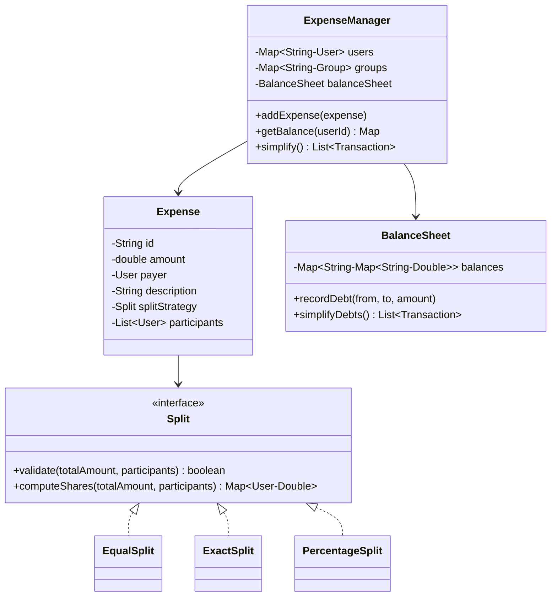

# Designing Splitwise — Expense Splitting System

⚡ **Difficulty:** Medium 🏷️ **Patterns:** Strategy, Observer, Facade 🏢 **Asked at:** PhonePe, Flipkart, Amazon, Razorpay

---

## Functional Requirements

1. **Add expenses** shared between users with a payer and multiple participants
2. **Multiple split strategies** — EQUAL, EXACT (specify amounts), PERCENTAGE
3. **Track balances** — who owes whom across all expenses
4. **Simplify debts** — minimize the number of transactions needed to settle up
5. **Group expenses** — organize expenses under a group (trip, apartment, etc.)
6. **Balance summary** — show per-user net balance

## Non-Functional Requirements

1. **Thread-safety** — concurrent expense additions must not corrupt balances
2. **O(n log n) debt simplification** — greedy with heaps
3. **Extensibility** — add new split types (SHARE, WEIGHT) without modifying existing code
4. **Correctness** — split amounts must always sum to the total expense amount

---

## Core Entities

| Entity | Description |
|---|---|
| `User` | Immutable — id, name, email |
| `Group` | Named collection of users and their shared expenses |
| `Expense` | Amount, payer, description, split strategy, participants |
| `Split` | Strategy interface — computes each participant's share |
| `EqualSplit` | Divides equally among all participants |
| `ExactSplit` | Each participant's amount specified explicitly |
| `PercentageSplit` | Each participant pays a percentage of total |
| `BalanceSheet` | Tracks net balances between every pair of users |
| `ExpenseManager` | Facade — orchestrates expenses, groups, balances, and simplification |

---

## Class Diagram

---

## Design Patterns

| Pattern | Where | Why |
|---|---|---|
| **Strategy** | `Split` with Equal/Exact/Percentage | Swap split algorithm per expense, no if/else chain |
| **Observer** | `BalanceObserver` on balance changes | Notify UI or services when debts change |
| **Facade** | `ExpenseManager` | Single entry point hides balance tracking, group logic, simplification |

---

## How It All Fits Together

Here's what happens when a user adds an expense:

1. User calls `addExpense()` on ExpenseManager with amount, payer, participants, and split type
2. ExpenseManager delegates to the `Split` strategy to compute each participant's share
3. Strategy validates the split (amounts sum to total? percentages sum to 100?)
4. For each participant (excluding payer): a debt is recorded in the BalanceSheet
5. BalanceSheet updates the net balance between payer and each participant
6. All registered BalanceObservers are notified of the change
7. Lock is released, expense is stored

When a user triggers debt simplification:

1. BalanceSheet computes the **net balance** for each user (total owed - total lent)
2. Users with positive net balance go into a max-heap (creditors)
3. Users with negative net balance go into a min-heap (debtors)
4. Greedy: pop the largest creditor and largest debtor, settle the minimum of the two amounts
5. Push back any remainder, repeat until both heaps are empty
6. Result: the minimum number of transactions to settle all debts

💡 *This greedy approach works because we only care about net flows, not individual expense history. If A owes B $10 and B owes A $3, the net is A→B $7.*

---

## Complete Code

### User

User is an immutable value object representing a person in the system. Equality is based on `id` so the same user across different groups is recognized as identical.

<button class="tab-btn active">Java</button>
<button class="tab-btn">Python</button>
<button class="tab-btn">C++</button>

<pre><code class="language-java">package splitwise.model;

public class User {
    private final String id;
    private final String name;
    private final String email;

    public User(String id, String name, String email) {
        this.id = id;
        this.name = name;
        this.email = email;
    }

    public String getId() { return id; }
    public String getName() { return name; }
    public String getEmail() { return email; }

    @Override
    public String toString() { return name + " (" + id + ")"; }

    @Override
    public boolean equals(Object o) {
        if (this == o) return true;
        if (!(o instanceof User)) return false;
        return id.equals(((User) o).id);
    }

    @Override
    public int hashCode() { return id.hashCode(); }
}</code></pre>

<pre><code class="language-python">from dataclasses import dataclass

@dataclass(frozen=True)
class User:
    id: str
    name: str
    email: str

    def __str__(self):
        return f"{self.name} ({self.id})"</code></pre>

<pre><code class="language-cpp">#pragma once
#include &lt;string&gt;
#include &lt;iostream&gt;

class User {
public:
    std::string id;
    std::string name;
    std::string email;

    User(std::string id, std::string name, std::string email)
        : id(std::move(id)), name(std::move(name)), email(std::move(email)) {}

    bool operator==(const User&amp; other) const { return id == other.id; }
    bool operator!=(const User&amp; other) const { return !(*this == other); }

    friend std::ostream&amp; operator&lt;&lt;(std::ostream&amp; os, const User&amp; u) {
        os &lt;&lt; u.name &lt;&lt; " (" &lt;&lt; u.id &lt;&lt; ")";
        return os;
    }
};</code></pre>

### Transaction

A simple value object representing a settlement — one user pays another a specific amount. Used as the output of debt simplification.

<button class="tab-btn active">Java</button>
<button class="tab-btn">Python</button>
<button class="tab-btn">C++</button>

<pre><code class="language-java">package splitwise.model;

public class Transaction {
    private final User from;
    private final User to;
    private final double amount;

    public Transaction(User from, User to, double amount) {
        this.from = from;
        this.to = to;
        this.amount = amount;
    }

    public User getFrom() { return from; }
    public User getTo() { return to; }
    public double getAmount() { return amount; }

    @Override
    public String toString() {
        return from.getName() + " pays " + to.getName() + ": $" + String.format("%.2f", amount);
    }
}</code></pre>

<pre><code class="language-python">@dataclass(frozen=True)
class Transaction:
    from_user: User
    to_user: User
    amount: float

    def __str__(self):
        return f"{self.from_user.name} pays {self.to_user.name}: ${self.amount:.2f}"</code></pre>

<pre><code class="language-cpp">#pragma once
#include "User.h"

class Transaction {
public:
    User from;
    User to;
    double amount;

    Transaction(User from, User to, double amount)
        : from(std::move(from)), to(std::move(to)), amount(amount) {}

    friend std::ostream&amp; operator&lt;&lt;(std::ostream&amp; os, const Transaction&amp; t) {
        os &lt;&lt; t.from.name &lt;&lt; " pays " &lt;&lt; t.to.name &lt;&lt; ": $" &lt;&lt; t.amount;
        return os;
    }
};</code></pre>

### Split (Strategy Interface)

This is the strategy interface that defines how an expense is divided among participants. EqualSplit, ExactSplit, and PercentageSplit are three implementations — but you could add WeightedSplit or ShareSplit without touching any existing code.

💡 *Strategy pattern = define a family of algorithms, encapsulate each one, and make them interchangeable. Each expense picks its own split strategy at creation time. Zero if/else branching in ExpenseManager.*

<button class="tab-btn active">Java</button>
<button class="tab-btn">Python</button>
<button class="tab-btn">C++</button>

<pre><code class="language-java">package splitwise.strategy;

import splitwise.model.User;
import java.util.List;
import java.util.Map;

public interface Split {
    boolean validate(double totalAmount, List&lt;User&gt; participants);
    Map&lt;User, Double&gt; computeShares(double totalAmount, List&lt;User&gt; participants);
}</code></pre>

<pre><code class="language-python">from abc import ABC, abstractmethod

class Split(ABC):
    @abstractmethod
    def validate(self, total_amount: float, participants: list[User]) -&gt; bool:
        pass

    @abstractmethod
    def compute_shares(self, total_amount: float, participants: list[User]) -&gt; dict[User, float]:
        pass</code></pre>

<pre><code class="language-cpp">#pragma once
#include &lt;vector&gt;
#include &lt;unordered_map&gt;
#include "User.h"

struct UserHash {
    size_t operator()(const User&amp; u) const {
        return std::hash&lt;std::string&gt;{}(u.id);
    }
};

class Split {
public:
    virtual ~Split() = default;
    virtual bool validate(double totalAmount, const std::vector&lt;User&gt;&amp; participants) = 0;
    virtual std::unordered_map&lt;User, double, UserHash&gt; computeShares(
        double totalAmount, const std::vector&lt;User&gt;&amp; participants) = 0;
};</code></pre>

### EqualSplit

The simplest strategy — divides the total equally among all participants. Validation just checks that there's at least one participant.

<button class="tab-btn active">Java</button>
<button class="tab-btn">Python</button>
<button class="tab-btn">C++</button>

<pre><code class="language-java">package splitwise.strategy;

import splitwise.model.User;
import java.util.*;

public class EqualSplit implements Split {

    @Override
    public boolean validate(double totalAmount, List&lt;User&gt; participants) {
        return participants != null &amp;&amp; !participants.isEmpty() &amp;&amp; totalAmount &gt; 0;
    }

    @Override
    public Map&lt;User, Double&gt; computeShares(double totalAmount, List&lt;User&gt; participants) {
        Map&lt;User, Double&gt; shares = new HashMap&lt;&gt;();
        double each = totalAmount / participants.size();
        for (User u : participants) {
            shares.put(u, each);
        }
        return shares;
    }
}</code></pre>

<pre><code class="language-python">class EqualSplit(Split):
    def validate(self, total_amount: float, participants: list[User]) -&gt; bool:
        return len(participants) &gt; 0 and total_amount &gt; 0

    def compute_shares(self, total_amount: float, participants: list[User]) -&gt; dict[User, float]:
        each = total_amount / len(participants)
        return {u: each for u in participants}</code></pre>

<pre><code class="language-cpp">#pragma once
#include "Split.h"

class EqualSplit : public Split {
public:
    bool validate(double totalAmount, const std::vector&lt;User&gt;&amp; participants) override {
        return !participants.empty() &amp;&amp; totalAmount &gt; 0;
    }

    std::unordered_map&lt;User, double, UserHash&gt; computeShares(
            double totalAmount, const std::vector&lt;User&gt;&amp; participants) override {
        std::unordered_map&lt;User, double, UserHash&gt; shares;
        double each = totalAmount / participants.size();
        for (const auto&amp; u : participants) {
            shares[u] = each;
        }
        return shares;
    }
};</code></pre>

### ExactSplit

Each participant's share is specified explicitly. Validation ensures the individual amounts sum exactly to the total expense. This is useful when items have different prices (e.g., everyone ordered different dishes).

<button class="tab-btn active">Java</button>
<button class="tab-btn">Python</button>
<button class="tab-btn">C++</button>

<pre><code class="language-java">package splitwise.strategy;

import splitwise.model.User;
import java.util.*;

public class ExactSplit implements Split {
    private final Map&lt;User, Double&gt; exactAmounts;

    public ExactSplit(Map&lt;User, Double&gt; exactAmounts) {
        this.exactAmounts = exactAmounts;
    }

    @Override
    public boolean validate(double totalAmount, List&lt;User&gt; participants) {
        if (exactAmounts == null || exactAmounts.isEmpty()) return false;
        double sum = exactAmounts.values().stream().mapToDouble(Double::doubleValue).sum();
        return Math.abs(sum - totalAmount) &lt; 0.01;
    }

    @Override
    public Map&lt;User, Double&gt; computeShares(double totalAmount, List&lt;User&gt; participants) {
        return new HashMap&lt;&gt;(exactAmounts);
    }
}</code></pre>

<pre><code class="language-python">class ExactSplit(Split):
    def __init__(self, exact_amounts: dict[User, float]):
        self._exact_amounts = exact_amounts

    def validate(self, total_amount: float, participants: list[User]) -&gt; bool:
        if not self._exact_amounts:
            return False
        return abs(sum(self._exact_amounts.values()) - total_amount) &lt; 0.01

    def compute_shares(self, total_amount: float, participants: list[User]) -&gt; dict[User, float]:
        return dict(self._exact_amounts)</code></pre>

<pre><code class="language-cpp">#pragma once
#include "Split.h"
#include &lt;cmath&gt;

class ExactSplit : public Split {
    std::unordered_map&lt;User, double, UserHash&gt; exactAmounts;

public:
    ExactSplit(std::unordered_map&lt;User, double, UserHash&gt; amounts)
        : exactAmounts(std::move(amounts)) {}

    bool validate(double totalAmount, const std::vector&lt;User&gt;&amp; participants) override {
        if (exactAmounts.empty()) return false;
        double sum = 0;
        for (const auto&amp; [user, amt] : exactAmounts) sum += amt;
        return std::abs(sum - totalAmount) &lt; 0.01;
    }

    std::unordered_map&lt;User, double, UserHash&gt; computeShares(
            double totalAmount, const std::vector&lt;User&gt;&amp; participants) override {
        return exactAmounts;
    }
};</code></pre>

### PercentageSplit

Each participant is assigned a percentage of the total. Validation checks that all percentages sum to 100. Useful for unequal splits like rent based on room size.

<button class="tab-btn active">Java</button>
<button class="tab-btn">Python</button>
<button class="tab-btn">C++</button>

<pre><code class="language-java">package splitwise.strategy;

import splitwise.model.User;
import java.util.*;

public class PercentageSplit implements Split {
    private final Map&lt;User, Double&gt; percentages;

    public PercentageSplit(Map&lt;User, Double&gt; percentages) {
        this.percentages = percentages;
    }

    @Override
    public boolean validate(double totalAmount, List&lt;User&gt; participants) {
        if (percentages == null || percentages.isEmpty()) return false;
        double sum = percentages.values().stream().mapToDouble(Double::doubleValue).sum();
        return Math.abs(sum - 100.0) &lt; 0.01 &amp;&amp; totalAmount &gt; 0;
    }

    @Override
    public Map&lt;User, Double&gt; computeShares(double totalAmount, List&lt;User&gt; participants) {
        Map&lt;User, Double&gt; shares = new HashMap&lt;&gt;();
        for (Map.Entry&lt;User, Double&gt; entry : percentages.entrySet()) {
            shares.put(entry.getKey(), totalAmount * entry.getValue() / 100.0);
        }
        return shares;
    }
}</code></pre>

<pre><code class="language-python">class PercentageSplit(Split):
    def __init__(self, percentages: dict[User, float]):
        self._percentages = percentages

    def validate(self, total_amount: float, participants: list[User]) -&gt; bool:
        if not self._percentages:
            return False
        return abs(sum(self._percentages.values()) - 100.0) &lt; 0.01 and total_amount &gt; 0

    def compute_shares(self, total_amount: float, participants: list[User]) -&gt; dict[User, float]:
        return {u: total_amount * pct / 100.0 for u, pct in self._percentages.items()}</code></pre>

<pre><code class="language-cpp">#pragma once
#include "Split.h"
#include &lt;cmath&gt;

class PercentageSplit : public Split {
    std::unordered_map&lt;User, double, UserHash&gt; percentages;

public:
    PercentageSplit(std::unordered_map&lt;User, double, UserHash&gt; pcts)
        : percentages(std::move(pcts)) {}

    bool validate(double totalAmount, const std::vector&lt;User&gt;&amp; participants) override {
        if (percentages.empty()) return false;
        double sum = 0;
        for (const auto&amp; [user, pct] : percentages) sum += pct;
        return std::abs(sum - 100.0) &lt; 0.01 &amp;&amp; totalAmount &gt; 0;
    }

    std::unordered_map&lt;User, double, UserHash&gt; computeShares(
            double totalAmount, const std::vector&lt;User&gt;&amp; participants) override {
        std::unordered_map&lt;User, double, UserHash&gt; shares;
        for (const auto&amp; [user, pct] : percentages) {
            shares[user] = totalAmount * pct / 100.0;
        }
        return shares;
    }
};</code></pre>

### Expense

An expense records who paid, how much, for what, and how it's split. It holds a reference to its Split strategy and the list of participants. The expense is immutable once created.

<button class="tab-btn active">Java</button>
<button class="tab-btn">Python</button>
<button class="tab-btn">C++</button>

<pre><code class="language-java">package splitwise.model;

import splitwise.strategy.Split;
import java.util.*;

public class Expense {
    private final String id;
    private final double amount;
    private final User payer;
    private final String description;
    private final Split splitStrategy;
    private final List&lt;User&gt; participants;

    public Expense(String id, double amount, User payer, String description,
                   Split splitStrategy, List&lt;User&gt; participants) {
        this.id = id;
        this.amount = amount;
        this.payer = payer;
        this.description = description;
        this.splitStrategy = splitStrategy;
        this.participants = Collections.unmodifiableList(participants);
    }

    public String getId() { return id; }
    public double getAmount() { return amount; }
    public User getPayer() { return payer; }
    public String getDescription() { return description; }
    public Split getSplitStrategy() { return splitStrategy; }
    public List&lt;User&gt; getParticipants() { return participants; }

    @Override
    public String toString() {
        return description + " — $" + String.format("%.2f", amount) + " paid by " + payer.getName();
    }
}</code></pre>

<pre><code class="language-python">class Expense:
    def __init__(self, id: str, amount: float, payer: User,
                 description: str, split_strategy: Split, participants: list[User]):
        self.id = id
        self.amount = amount
        self.payer = payer
        self.description = description
        self.split_strategy = split_strategy
        self.participants = list(participants)

    def __str__(self):
        return f"{self.description} — ${self.amount:.2f} paid by {self.payer.name}"</code></pre>

<pre><code class="language-cpp">#pragma once
#include &lt;string&gt;
#include &lt;vector&gt;
#include &lt;memory&gt;
#include "User.h"
#include "Split.h"

class Expense {
public:
    std::string id;
    double amount;
    User payer;
    std::string description;
    std::shared_ptr&lt;Split&gt; splitStrategy;
    std::vector&lt;User&gt; participants;

    Expense(std::string id, double amount, User payer, std::string description,
            std::shared_ptr&lt;Split&gt; strategy, std::vector&lt;User&gt; participants)
        : id(std::move(id)), amount(amount), payer(std::move(payer)),
          description(std::move(description)), splitStrategy(std::move(strategy)),
          participants(std::move(participants)) {}

    friend std::ostream&amp; operator&lt;&lt;(std::ostream&amp; os, const Expense&amp; e) {
        os &lt;&lt; e.description &lt;&lt; " — $" &lt;&lt; e.amount &lt;&lt; " paid by " &lt;&lt; e.payer.name;
        return os;
    }
};</code></pre>

### Group

A group holds a set of users and their shared expenses — like a trip or an apartment. It provides a scoped view of expenses for that context.

<button class="tab-btn active">Java</button>
<button class="tab-btn">Python</button>
<button class="tab-btn">C++</button>

<pre><code class="language-java">package splitwise.model;

import java.util.*;

public class Group {
    private final String id;
    private final String name;
    private final List&lt;User&gt; members;
    private final List&lt;Expense&gt; expenses;

    public Group(String id, String name, List&lt;User&gt; members) {
        this.id = id;
        this.name = name;
        this.members = new ArrayList&lt;&gt;(members);
        this.expenses = new ArrayList&lt;&gt;();
    }

    public void addExpense(Expense expense) { expenses.add(expense); }
    public String getId() { return id; }
    public String getName() { return name; }
    public List&lt;User&gt; getMembers() { return Collections.unmodifiableList(members); }
    public List&lt;Expense&gt; getExpenses() { return Collections.unmodifiableList(expenses); }

    @Override
    public String toString() { return name + " (" + members.size() + " members)"; }
}</code></pre>

<pre><code class="language-python">class Group:
    def __init__(self, id: str, name: str, members: list[User]):
        self.id = id
        self.name = name
        self.members = list(members)
        self.expenses: list[Expense] = []

    def add_expense(self, expense: Expense):
        self.expenses.append(expense)

    def __str__(self):
        return f"{self.name} ({len(self.members)} members)"</code></pre>

<pre><code class="language-cpp">#pragma once
#include &lt;string&gt;
#include &lt;vector&gt;
#include "User.h"
#include "Expense.h"

class Group {
public:
    std::string id;
    std::string name;
    std::vector&lt;User&gt; members;
    std::vector&lt;Expense&gt; expenses;

    Group(std::string id, std::string name, std::vector&lt;User&gt; members)
        : id(std::move(id)), name(std::move(name)), members(std::move(members)) {}

    void addExpense(const Expense&amp; expense) { expenses.push_back(expense); }

    friend std::ostream&amp; operator&lt;&lt;(std::ostream&amp; os, const Group&amp; g) {
        os &lt;&lt; g.name &lt;&lt; " (" &lt;&lt; g.members.size() &lt;&lt; " members)";
        return os;
    }
};</code></pre>

### BalanceSheet

The core accounting engine. Tracks net balances between every pair of users using a nested map: `balances[A][B] = X` means A owes B $X. When a new debt is recorded, it automatically nets against any existing reverse debt (if B already owed A, it reduces that first).

💡 *We store directed net balances rather than individual transactions. This means `getBalance(userId)` is O(n) where n = number of users, not number of expenses. The tradeoff: we lose individual expense history in the balance sheet (but Expense objects are stored separately).*

The debt simplification algorithm uses a **greedy approach with heaps**:
- Compute net balance for each user (positive = creditor, negative = debtor)
- Push creditors into a max-heap, debtors into a min-heap
- Match the largest creditor with the largest debtor, settle the minimum
- Repeat until all settled — this minimizes total number of transactions

<button class="tab-btn active">Java</button>
<button class="tab-btn">Python</button>
<button class="tab-btn">C++</button>

<pre><code class="language-java">package splitwise.core;

import splitwise.model.Transaction;
import splitwise.model.User;

import java.util.*;

public class BalanceSheet {
    // balances[A_id][B_id] = amount A owes B (positive means A owes B)
    private final Map&lt;String, Map&lt;String, Double&gt;&gt; balances = new HashMap&lt;&gt;();
    private final Map&lt;String, User&gt; userMap = new HashMap&lt;&gt;();

    public void recordDebt(User from, User to, double amount) {
        if (amount &lt;= 0 || from.equals(to)) return;
        userMap.putIfAbsent(from.getId(), from);
        userMap.putIfAbsent(to.getId(), to);

        // Net the balances: if to already owes from, reduce that first
        double reverseDebt = getDirectDebt(to.getId(), from.getId());
        if (reverseDebt &gt;= amount) {
            setDebt(to.getId(), from.getId(), reverseDebt - amount);
        } else {
            setDebt(to.getId(), from.getId(), 0);
            double existing = getDirectDebt(from.getId(), to.getId());
            setDebt(from.getId(), to.getId(), existing + (amount - reverseDebt));
        }
    }

    public Map&lt;String, Double&gt; getBalanceForUser(String userId) {
        Map&lt;String, Double&gt; result = new HashMap&lt;&gt;();
        // What this user owes others (negative for them)
        Map&lt;String, Double&gt; owes = balances.getOrDefault(userId, Collections.emptyMap());
        for (Map.Entry&lt;String, Double&gt; e : owes.entrySet()) {
            if (e.getValue() &gt; 0.01) result.put(e.getKey(), -e.getValue());
        }
        // What others owe this user (positive for them)
        for (Map.Entry&lt;String, Map&lt;String, Double&gt;&gt; entry : balances.entrySet()) {
            if (entry.getKey().equals(userId)) continue;
            double amt = entry.getValue().getOrDefault(userId, 0.0);
            if (amt &gt; 0.01) result.put(entry.getKey(), amt);
        }
        return result;
    }

    public List&lt;Transaction&gt; simplifyDebts() {
        // Step 1: Compute net balance for each user
        Map&lt;String, Double&gt; netBalance = new HashMap&lt;&gt;();
        for (Map.Entry&lt;String, Map&lt;String, Double&gt;&gt; entry : balances.entrySet()) {
            String fromId = entry.getKey();
            for (Map.Entry&lt;String, Double&gt; debt : entry.getValue().entrySet()) {
                String toId = debt.getKey();
                double amt = debt.getValue();
                if (amt &lt; 0.01) continue;
                netBalance.merge(fromId, -amt, Double::sum);  // from owes, so negative
                netBalance.merge(toId, amt, Double::sum);     // to is owed, so positive
            }
        }

        // Step 2: Separate into creditors (positive) and debtors (negative)
        // Max-heap for creditors, min-heap (max of abs) for debtors
        PriorityQueue&lt;double[]&gt; creditors = new PriorityQueue&lt;&gt;((a, b) -&gt; Double.compare(b[1], a[1]));
        PriorityQueue&lt;double[]&gt; debtors = new PriorityQueue&lt;&gt;((a, b) -&gt; Double.compare(a[1], b[1]));

        List&lt;String&gt; userIds = new ArrayList&lt;&gt;(netBalance.keySet());
        for (String uid : userIds) {
            double bal = netBalance.get(uid);
            if (bal &gt; 0.01) creditors.offer(new double[]{userIds.indexOf(uid), bal});
            else if (bal &lt; -0.01) debtors.offer(new double[]{userIds.indexOf(uid), bal});
        }

        // Step 3: Greedy matching
        List&lt;Transaction&gt; transactions = new ArrayList&lt;&gt;();
        while (!creditors.isEmpty() &amp;&amp; !debtors.isEmpty()) {
            double[] creditor = creditors.poll();
            double[] debtor = debtors.poll();

            double settle = Math.min(creditor[1], -debtor[1]);
            User fromUser = userMap.get(userIds.get((int) debtor[0]));
            User toUser = userMap.get(userIds.get((int) creditor[0]));
            transactions.add(new Transaction(fromUser, toUser, settle));

            creditor[1] -= settle;
            debtor[1] += settle;

            if (creditor[1] &gt; 0.01) creditors.offer(creditor);
            if (debtor[1] &lt; -0.01) debtors.offer(debtor);
        }
        return transactions;
    }

    private double getDirectDebt(String fromId, String toId) {
        return balances.getOrDefault(fromId, Collections.emptyMap()).getOrDefault(toId, 0.0);
    }

    private void setDebt(String fromId, String toId, double amount) {
        balances.computeIfAbsent(fromId, k -&gt; new HashMap&lt;&gt;()).put(toId, amount);
    }
}</code></pre>

<pre><code class="language-python">import heapq
from collections import defaultdict

class BalanceSheet:
    def __init__(self):
        # balances[from_id][to_id] = amount from owes to
        self._balances: dict[str, dict[str, float]] = defaultdict(lambda: defaultdict(float))
        self._user_map: dict[str, User] = {}

    def record_debt(self, from_user: User, to_user: User, amount: float):
        if amount &lt;= 0 or from_user == to_user:
            return
        self._user_map[from_user.id] = from_user
        self._user_map[to_user.id] = to_user

        # Net against reverse debt
        reverse = self._balances[to_user.id][from_user.id]
        if reverse &gt;= amount:
            self._balances[to_user.id][from_user.id] = reverse - amount
        else:
            self._balances[to_user.id][from_user.id] = 0
            self._balances[from_user.id][to_user.id] += (amount - reverse)

    def get_balance_for_user(self, user_id: str) -&gt; dict[str, float]:
        result = {}
        # What this user owes others
        for to_id, amt in self._balances[user_id].items():
            if amt &gt; 0.01:
                result[to_id] = -amt
        # What others owe this user
        for from_id, debts in self._balances.items():
            if from_id == user_id:
                continue
            amt = debts.get(user_id, 0)
            if amt &gt; 0.01:
                result[from_id] = amt
        return result

    def simplify_debts(self) -&gt; list[Transaction]:
        # Step 1: Net balances
        net: dict[str, float] = defaultdict(float)
        for from_id, debts in self._balances.items():
            for to_id, amt in debts.items():
                if amt &lt; 0.01:
                    continue
                net[from_id] -= amt
                net[to_id] += amt

        # Step 2: Separate creditors and debtors
        # Max-heap for creditors (negate for heapq), min-heap for debtors
        creditors = []  # (-amount, user_id) — max-heap via negation
        debtors = []    # (amount, user_id) — min-heap (most negative first)

        for uid, bal in net.items():
            if bal &gt; 0.01:
                heapq.heappush(creditors, (-bal, uid))
            elif bal &lt; -0.01:
                heapq.heappush(debtors, (bal, uid))

        # Step 3: Greedy matching
        transactions = []
        while creditors and debtors:
            credit_amt, credit_id = heapq.heappop(creditors)
            debt_amt, debt_id = heapq.heappop(debtors)

            settle = min(-credit_amt, -debt_amt)
            from_user = self._user_map[debt_id]
            to_user = self._user_map[credit_id]
            transactions.append(Transaction(from_user, to_user, round(settle, 2)))

            remainder_credit = -credit_amt - settle
            remainder_debt = -debt_amt - settle

            if remainder_credit &gt; 0.01:
                heapq.heappush(creditors, (-remainder_credit, credit_id))
            if remainder_debt &gt; 0.01:
                heapq.heappush(debtors, (-remainder_debt, debt_id))

        return transactions</code></pre>

<pre><code class="language-cpp">#pragma once
#include &lt;unordered_map&gt;
#include &lt;vector&gt;
#include &lt;queue&gt;
#include &lt;cmath&gt;
#include &lt;algorithm&gt;
#include "User.h"
#include "Transaction.h"

class BalanceSheet {
    // balances[fromId][toId] = amount from owes to
    std::unordered_map&lt;std::string, std::unordered_map&lt;std::string, double&gt;&gt; balances;
    std::unordered_map&lt;std::string, User&gt; userMap;

    double getDirectDebt(const std::string&amp; fromId, const std::string&amp; toId) {
        auto it = balances.find(fromId);
        if (it == balances.end()) return 0;
        auto it2 = it-&gt;second.find(toId);
        return it2 == it-&gt;second.end() ? 0 : it2-&gt;second;
    }

    void setDebt(const std::string&amp; fromId, const std::string&amp; toId, double amount) {
        balances[fromId][toId] = amount;
    }

public:
    void recordDebt(const User&amp; from, const User&amp; to, double amount) {
        if (amount &lt;= 0 || from == to) return;
        userMap.emplace(from.id, from);
        userMap.emplace(to.id, to);

        double reverse = getDirectDebt(to.id, from.id);
        if (reverse &gt;= amount) {
            setDebt(to.id, from.id, reverse - amount);
        } else {
            setDebt(to.id, from.id, 0);
            double existing = getDirectDebt(from.id, to.id);
            setDebt(from.id, to.id, existing + (amount - reverse));
        }
    }

    std::vector&lt;Transaction&gt; simplifyDebts() {
        // Net balances
        std::unordered_map&lt;std::string, double&gt; net;
        for (auto&amp; [fromId, debts] : balances) {
            for (auto&amp; [toId, amt] : debts) {
                if (amt &lt; 0.01) continue;
                net[fromId] -= amt;
                net[toId] += amt;
            }
        }

        // Max-heap for creditors, max-heap (by abs) for debtors
        using Pair = std::pair&lt;double, std::string&gt;;
        std::priority_queue&lt;Pair&gt; creditors;
        std::priority_queue&lt;Pair&gt; debtors;

        for (auto&amp; [uid, bal] : net) {
            if (bal &gt; 0.01) creditors.push({bal, uid});
            else if (bal &lt; -0.01) debtors.push({-bal, uid});
        }

        std::vector&lt;Transaction&gt; transactions;
        while (!creditors.empty() &amp;&amp; !debtors.empty()) {
            auto [creditAmt, creditId] = creditors.top(); creditors.pop();
            auto [debtAmt, debtId] = debtors.top(); debtors.pop();

            double settle = std::min(creditAmt, debtAmt);
            transactions.emplace_back(userMap.at(debtId), userMap.at(creditId), settle);

            if (creditAmt - settle &gt; 0.01) creditors.push({creditAmt - settle, creditId});
            if (debtAmt - settle &gt; 0.01) debtors.push({debtAmt - settle, debtId});
        }
        return transactions;
    }
};</code></pre>

### BalanceObserver

Observer interface for balance change notifications. UI components, notification services, or logging can implement this to react when debts change — without the core system knowing about them.

💡 *Observer pattern = decouple the "what happened" from "who cares." ExpenseManager fires events; any number of observers can listen without modifying the manager.*

<button class="tab-btn active">Java</button>
<button class="tab-btn">Python</button>
<button class="tab-btn">C++</button>

<pre><code class="language-java">package splitwise.observer;

import splitwise.model.Expense;

public interface BalanceObserver {
    void onExpenseAdded(Expense expense);
    void onBalanceChanged(String userId, double newNetBalance);
}</code></pre>

<pre><code class="language-python">class BalanceObserver:
    def on_expense_added(self, expense: Expense):
        pass

    def on_balance_changed(self, user_id: str, new_net_balance: float):
        pass</code></pre>

<pre><code class="language-cpp">#pragma once
#include &lt;string&gt;
#include "Expense.h"

class BalanceObserver {
public:
    virtual ~BalanceObserver() = default;
    virtual void onExpenseAdded(const Expense&amp; expense) = 0;
    virtual void onBalanceChanged(const std::string&amp; userId, double newNetBalance) = 0;
};</code></pre>

### ExpenseManager (Facade)

The single entry point for all operations. It orchestrates user registration, group creation, expense addition, balance queries, and debt simplification. All public methods are thread-safe via `ReentrantLock`.

💡 *Facade pattern = provide a simplified interface to a complex subsystem. Clients call `addExpense()` on the manager — they never interact directly with BalanceSheet, Split strategies, or Groups.*

<button class="tab-btn active">Java</button>
<button class="tab-btn">Python</button>
<button class="tab-btn">C++</button>

<pre><code class="language-java">package splitwise;

import splitwise.core.BalanceSheet;
import splitwise.model.*;
import splitwise.observer.BalanceObserver;
import splitwise.strategy.Split;

import java.util.*;
import java.util.concurrent.CopyOnWriteArrayList;
import java.util.concurrent.locks.ReentrantLock;

public class ExpenseManager {
    private final Map&lt;String, User&gt; users = new HashMap&lt;&gt;();
    private final Map&lt;String, Group&gt; groups = new HashMap&lt;&gt;();
    private final List&lt;Expense&gt; expenses = new ArrayList&lt;&gt;();
    private final BalanceSheet balanceSheet = new BalanceSheet();
    private final ReentrantLock lock = new ReentrantLock();
    private final List&lt;BalanceObserver&gt; observers = new CopyOnWriteArrayList&lt;&gt;();

    public void addUser(User user) {
        lock.lock();
        try {
            users.put(user.getId(), user);
        } finally { lock.unlock(); }
    }

    public void createGroup(String groupId, String name, List&lt;User&gt; members) {
        lock.lock();
        try {
            Group group = new Group(groupId, name, members);
            groups.put(groupId, group);
            for (User u : members) users.putIfAbsent(u.getId(), u);
        } finally { lock.unlock(); }
    }

    public void addExpense(String expenseId, double amount, User payer,
                           String description, Split splitStrategy,
                           List&lt;User&gt; participants, String groupId) {
        lock.lock();
        try {
            if (!splitStrategy.validate(amount, participants)) {
                throw new IllegalArgumentException("Invalid split: amounts do not match total");
            }

            Expense expense = new Expense(expenseId, amount, payer, description,
                                          splitStrategy, participants);
            expenses.add(expense);

            if (groupId != null &amp;&amp; groups.containsKey(groupId)) {
                groups.get(groupId).addExpense(expense);
            }

            // Compute shares and record debts
            Map&lt;User, Double&gt; shares = splitStrategy.computeShares(amount, participants);
            for (Map.Entry&lt;User, Double&gt; entry : shares.entrySet()) {
                User participant = entry.getKey();
                double share = entry.getValue();
                if (!participant.equals(payer) &amp;&amp; share &gt; 0) {
                    balanceSheet.recordDebt(participant, payer, share);
                }
            }

            // Notify observers
            for (BalanceObserver obs : observers) {
                obs.onExpenseAdded(expense);
            }
        } finally { lock.unlock(); }
    }

    public Map&lt;String, Double&gt; getBalance(String userId) {
        lock.lock();
        try {
            return balanceSheet.getBalanceForUser(userId);
        } finally { lock.unlock(); }
    }

    public List&lt;Transaction&gt; simplifyDebts() {
        lock.lock();
        try {
            return balanceSheet.simplifyDebts();
        } finally { lock.unlock(); }
    }

    public void addObserver(BalanceObserver observer) {
        observers.add(observer);
    }

    public Group getGroup(String groupId) {
        return groups.get(groupId);
    }

    public List&lt;Expense&gt; getAllExpenses() {
        return Collections.unmodifiableList(expenses);
    }
}</code></pre>

<pre><code class="language-python">import threading

class ExpenseManager:
    def __init__(self):
        self._users: dict[str, User] = {}
        self._groups: dict[str, Group] = {}
        self._expenses: list[Expense] = []
        self._balance_sheet = BalanceSheet()
        self._lock = threading.Lock()
        self._observers: list[BalanceObserver] = []

    def add_user(self, user: User):
        with self._lock:
            self._users[user.id] = user

    def create_group(self, group_id: str, name: str, members: list[User]):
        with self._lock:
            group = Group(group_id, name, members)
            self._groups[group_id] = group
            for u in members:
                self._users.setdefault(u.id, u)

    def add_expense(self, expense_id: str, amount: float, payer: User,
                    description: str, split_strategy: Split,
                    participants: list[User], group_id: str = None):
        with self._lock:
            if not split_strategy.validate(amount, participants):
                raise ValueError("Invalid split: amounts do not match total")

            expense = Expense(expense_id, amount, payer, description,
                              split_strategy, participants)
            self._expenses.append(expense)

            if group_id and group_id in self._groups:
                self._groups[group_id].add_expense(expense)

            # Compute shares and record debts
            shares = split_strategy.compute_shares(amount, participants)
            for participant, share in shares.items():
                if participant != payer and share &gt; 0:
                    self._balance_sheet.record_debt(participant, payer, share)

            # Notify observers
            for obs in self._observers:
                obs.on_expense_added(expense)

    def get_balance(self, user_id: str) -&gt; dict[str, float]:
        with self._lock:
            return self._balance_sheet.get_balance_for_user(user_id)

    def simplify_debts(self) -&gt; list[Transaction]:
        with self._lock:
            return self._balance_sheet.simplify_debts()

    def add_observer(self, observer: BalanceObserver):
        self._observers.append(observer)

    def get_group(self, group_id: str) -&gt; Group:
        return self._groups.get(group_id)

    def get_all_expenses(self) -&gt; list[Expense]:
        return list(self._expenses)</code></pre>

<pre><code class="language-cpp">#pragma once
#include &lt;mutex&gt;
#include &lt;vector&gt;
#include &lt;unordered_map&gt;
#include &lt;memory&gt;
#include &lt;stdexcept&gt;
#include "User.h"
#include "Group.h"
#include "Expense.h"
#include "BalanceSheet.h"
#include "BalanceObserver.h"
#include "Split.h"

class ExpenseManager {
    std::unordered_map&lt;std::string, User&gt; users;
    std::unordered_map&lt;std::string, Group&gt; groups;
    std::vector&lt;Expense&gt; expenses;
    BalanceSheet balanceSheet;
    std::mutex mtx;
    std::vector&lt;BalanceObserver*&gt; observers;

public:
    void addUser(const User&amp; user) {
        std::lock_guard&lt;std::mutex&gt; lock(mtx);
        users.emplace(user.id, user);
    }

    void createGroup(const std::string&amp; groupId, const std::string&amp; name,
                     const std::vector&lt;User&gt;&amp; members) {
        std::lock_guard&lt;std::mutex&gt; lock(mtx);
        groups.emplace(groupId, Group(groupId, name, members));
        for (const auto&amp; u : members) users.emplace(u.id, u);
    }

    void addExpense(const std::string&amp; expenseId, double amount, const User&amp; payer,
                    const std::string&amp; description, std::shared_ptr&lt;Split&gt; splitStrategy,
                    const std::vector&lt;User&gt;&amp; participants, const std::string&amp; groupId = "") {
        std::lock_guard&lt;std::mutex&gt; lock(mtx);
        if (!splitStrategy-&gt;validate(amount, participants)) {
            throw std::invalid_argument("Invalid split: amounts do not match total");
        }

        Expense expense(expenseId, amount, payer, description, splitStrategy, participants);
        expenses.push_back(expense);

        if (!groupId.empty()) {
            auto it = groups.find(groupId);
            if (it != groups.end()) it-&gt;second.addExpense(expense);
        }

        auto shares = splitStrategy-&gt;computeShares(amount, participants);
        for (const auto&amp; [participant, share] : shares) {
            if (participant != payer &amp;&amp; share &gt; 0) {
                balanceSheet.recordDebt(participant, payer, share);
            }
        }

        for (auto* obs : observers) obs-&gt;onExpenseAdded(expense);
    }

    std::vector&lt;Transaction&gt; simplifyDebts() {
        std::lock_guard&lt;std::mutex&gt; lock(mtx);
        return balanceSheet.simplifyDebts();
    }

    void addObserver(BalanceObserver* obs) { observers.push_back(obs); }
};</code></pre>

### Demo (Runnable)

The demo proves the entire system works end-to-end: creates users, forms a group, adds expenses with all three split types, shows individual balances, and runs debt simplification to minimize transactions.

<button class="tab-btn active">Java</button>
<button class="tab-btn">Python</button>
<button class="tab-btn">C++</button>

<pre><code class="language-java">package splitwise;

import splitwise.model.*;
import splitwise.observer.BalanceObserver;
import splitwise.strategy.*;

import java.util.*;

public class Demo {
    public static void main(String[] args) {
        System.out.println("══════ SPLITWISE DEMO ══════\n");

        ExpenseManager manager = new ExpenseManager();
        manager.addObserver(new BalanceObserver() {
            public void onExpenseAdded(Expense e) {
                System.out.println("  📝 Expense added: " + e);
            }
            public void onBalanceChanged(String uid, double bal) {}
        });

        // Create users
        User alice = new User("u1", "Alice", "alice@email.com");
        User bob = new User("u2", "Bob", "bob@email.com");
        User charlie = new User("u3", "Charlie", "charlie@email.com");
        User diana = new User("u4", "Diana", "diana@email.com");

        manager.addUser(alice);
        manager.addUser(bob);
        manager.addUser(charlie);
        manager.addUser(diana);

        // Create a trip group
        manager.createGroup("g1", "Goa Trip",
            Arrays.asList(alice, bob, charlie, diana));
        System.out.println("Group created: Goa Trip\n");

        // --- EQUAL SPLIT ---
        System.out.println("--- Equal Split: Dinner $240 paid by Alice ---");
        manager.addExpense("e1", 240.0, alice, "Dinner",
            new EqualSplit(),
            Arrays.asList(alice, bob, charlie, diana), "g1");

        // --- EXACT SPLIT ---
        System.out.println("\n--- Exact Split: Shopping $500 paid by Bob ---");
        Map&lt;User, Double&gt; exactAmounts = new HashMap&lt;&gt;();
        exactAmounts.put(alice, 100.0);
        exactAmounts.put(bob, 200.0);
        exactAmounts.put(charlie, 50.0);
        exactAmounts.put(diana, 150.0);
        manager.addExpense("e2", 500.0, bob, "Shopping",
            new ExactSplit(exactAmounts),
            Arrays.asList(alice, bob, charlie, diana), "g1");

        // --- PERCENTAGE SPLIT ---
        System.out.println("\n--- Percentage Split: Hotel $1000 paid by Charlie ---");
        Map&lt;User, Double&gt; percentages = new HashMap&lt;&gt;();
        percentages.put(alice, 30.0);
        percentages.put(bob, 30.0);
        percentages.put(charlie, 20.0);
        percentages.put(diana, 20.0);
        manager.addExpense("e3", 1000.0, charlie, "Hotel",
            new PercentageSplit(percentages),
            Arrays.asList(alice, bob, charlie, diana), "g1");

        // --- BALANCES ---
        System.out.println("\n--- Balances ---");
        for (User u : Arrays.asList(alice, bob, charlie, diana)) {
            Map&lt;String, Double&gt; bal = manager.getBalance(u.getId());
            System.out.println("  " + u.getName() + ":");
            for (Map.Entry&lt;String, Double&gt; e : bal.entrySet()) {
                String label = e.getValue() &gt; 0 ? "is owed" : "owes";
                System.out.printf("    %s $%.2f (user %s)%n", label,
                    Math.abs(e.getValue()), e.getKey());
            }
        }

        // --- SIMPLIFY DEBTS ---
        System.out.println("\n--- Simplified Debts (Minimum Transactions) ---");
        List&lt;Transaction&gt; simplified = manager.simplifyDebts();
        for (Transaction t : simplified) {
            System.out.println("  " + t);
        }
        System.out.println("  Total transactions: " + simplified.size());

        System.out.println("\n══════ DONE ══════");
    }
}</code></pre>

<pre><code class="language-python">def demo():
    print("══════ SPLITWISE DEMO ══════\n")

    class ConsolePrinter(BalanceObserver):
        def on_expense_added(self, expense):
            print(f"  📝 Expense added: {expense}")
        def on_balance_changed(self, user_id, new_net_balance):
            pass

    manager = ExpenseManager()
    manager.add_observer(ConsolePrinter())

    # Create users
    alice = User("u1", "Alice", "alice@email.com")
    bob = User("u2", "Bob", "bob@email.com")
    charlie = User("u3", "Charlie", "charlie@email.com")
    diana = User("u4", "Diana", "diana@email.com")

    manager.add_user(alice)
    manager.add_user(bob)
    manager.add_user(charlie)
    manager.add_user(diana)

    # Create a trip group
    manager.create_group("g1", "Goa Trip", [alice, bob, charlie, diana])
    print("Group created: Goa Trip\n")

    # --- EQUAL SPLIT ---
    print("--- Equal Split: Dinner $240 paid by Alice ---")
    manager.add_expense("e1", 240.0, alice, "Dinner",
        EqualSplit(), [alice, bob, charlie, diana], "g1")

    # --- EXACT SPLIT ---
    print("\n--- Exact Split: Shopping $500 paid by Bob ---")
    exact_amounts = {alice: 100.0, bob: 200.0, charlie: 50.0, diana: 150.0}
    manager.add_expense("e2", 500.0, bob, "Shopping",
        ExactSplit(exact_amounts), [alice, bob, charlie, diana], "g1")

    # --- PERCENTAGE SPLIT ---
    print("\n--- Percentage Split: Hotel $1000 paid by Charlie ---")
    percentages = {alice: 30.0, bob: 30.0, charlie: 20.0, diana: 20.0}
    manager.add_expense("e3", 1000.0, charlie, "Hotel",
        PercentageSplit(percentages), [alice, bob, charlie, diana], "g1")

    # --- BALANCES ---
    print("\n--- Balances ---")
    for u in [alice, bob, charlie, diana]:
        bal = manager.get_balance(u.id)
        print(f"  {u.name}:")
        for other_id, amount in bal.items():
            label = "is owed" if amount &gt; 0 else "owes"
            print(f"    {label} ${abs(amount):.2f} (user {other_id})")

    # --- SIMPLIFY DEBTS ---
    print("\n--- Simplified Debts (Minimum Transactions) ---")
    simplified = manager.simplify_debts()
    for t in simplified:
        print(f"  {t}")
    print(f"  Total transactions: {len(simplified)}")

    print("\n══════ DONE ══════")

if __name__ == "__main__":
    demo()</code></pre>

<pre><code class="language-cpp">#include &lt;iostream&gt;
#include &lt;vector&gt;
#include &lt;memory&gt;
#include "ExpenseManager.h"
#include "EqualSplit.h"
#include "ExactSplit.h"
#include "PercentageSplit.h"

class ConsolePrinter : public BalanceObserver {
public:
    void onExpenseAdded(const Expense&amp; e) override {
        std::cout &lt;&lt; "  📝 Expense added: " &lt;&lt; e &lt;&lt; "\n";
    }
    void onBalanceChanged(const std::string&amp; uid, double bal) override {}
};

int main() {
    std::cout &lt;&lt; "══════ SPLITWISE DEMO ══════\n\n";

    ExpenseManager manager;
    ConsolePrinter printer;
    manager.addObserver(&amp;printer);

    // Create users
    User alice("u1", "Alice", "alice@email.com");
    User bob("u2", "Bob", "bob@email.com");
    User charlie("u3", "Charlie", "charlie@email.com");
    User diana("u4", "Diana", "diana@email.com");

    manager.addUser(alice);
    manager.addUser(bob);
    manager.addUser(charlie);
    manager.addUser(diana);

    // Create group
    manager.createGroup("g1", "Goa Trip", {alice, bob, charlie, diana});
    std::cout &lt;&lt; "Group created: Goa Trip\n\n";

    // --- EQUAL SPLIT ---
    std::cout &lt;&lt; "--- Equal Split: Dinner $240 paid by Alice ---\n";
    manager.addExpense("e1", 240.0, alice, "Dinner",
        std::make_shared&lt;EqualSplit&gt;(),
        {alice, bob, charlie, diana}, "g1");

    // --- EXACT SPLIT ---
    std::cout &lt;&lt; "\n--- Exact Split: Shopping $500 paid by Bob ---\n";
    std::unordered_map&lt;User, double, UserHash&gt; exactAmounts = {
        {alice, 100.0}, {bob, 200.0}, {charlie, 50.0}, {diana, 150.0}
    };
    manager.addExpense("e2", 500.0, bob, "Shopping",
        std::make_shared&lt;ExactSplit&gt;(exactAmounts),
        {alice, bob, charlie, diana}, "g1");

    // --- PERCENTAGE SPLIT ---
    std::cout &lt;&lt; "\n--- Percentage Split: Hotel $1000 paid by Charlie ---\n";
    std::unordered_map&lt;User, double, UserHash&gt; pcts = {
        {alice, 30.0}, {bob, 30.0}, {charlie, 20.0}, {diana, 20.0}
    };
    manager.addExpense("e3", 1000.0, charlie, "Hotel",
        std::make_shared&lt;PercentageSplit&gt;(pcts),
        {alice, bob, charlie, diana}, "g1");

    // --- SIMPLIFY DEBTS ---
    std::cout &lt;&lt; "\n--- Simplified Debts (Minimum Transactions) ---\n";
    auto simplified = manager.simplifyDebts();
    for (const auto&amp; t : simplified) {
        std::cout &lt;&lt; "  " &lt;&lt; t &lt;&lt; "\n";
    }
    std::cout &lt;&lt; "  Total transactions: " &lt;&lt; simplified.size() &lt;&lt; "\n";

    std::cout &lt;&lt; "\n══════ DONE ══════\n";
    return 0;
}</code></pre>

---

## Debt Simplification — Algorithm Walkthrough

<pre><code class="language-mermaid">flowchart LR
    A[Compute Net Balances] --> B[Separate Creditors and Debtors]
    B --> C[Max-Heap Creditors]
    B --> D[Min-Heap Debtors]
    C --> E[Greedy: Match Largest Creditor with Largest Debtor]
    D --> E
    E --> F[Settle min of both amounts]
    F --> G{Both heaps empty?}
    G -->|No| E
    G -->|Yes| H[Return Minimal Transactions]</code></pre>

**Example:** Alice is owed $100, Bob is owed $50, Charlie owes $80, Diana owes $70.
- Match Alice ($100) with Diana ($70) → Diana pays Alice $70. Alice remainder: $30.
- Match Bob ($50) with Charlie ($80) → Charlie pays Bob $50. Charlie remainder: $30.
- Match Alice ($30) with Charlie ($30) → Charlie pays Alice $30.
- **Result: 3 transactions** instead of potentially many more pairwise settlements.

---

## How to Extend

| Feature | Implementation |
|---|---|
| **Weighted Split** | New `WeightedSplit` — divide proportionally by weight values |
| **Settlement** | Track settled transactions, reduce balances accordingly |
| **Expense Editing** | Reverse old splits, apply new splits atomically |
| **Currency Support** | Decorator on Split that converts amounts before computing |
| **Recurring Expenses** | Scheduler that calls `addExpense()` on a cron |

---

## What Interviewers Look For

1. ✅ Strategy pattern for split types — no if/else chains
2. ✅ Debt simplification — greedy with heaps, O(n log n)
3. ✅ Thread-safety — locks on all mutable shared state
4. ✅ Validation — splits must sum to total before recording
5. ✅ Observer — decoupled notifications on balance changes
6. ✅ Facade — ExpenseManager hides subsystem complexity
7. ✅ Runnable demo — all three split types exercised end-to-end

---
## Related Designs
- [Music Player](/MusicPlayer) — Strategy and Observer patterns
- [Parking Lot](/ParkingLot) — Strategy-based pricing and extensible design
